# 1.HTML简介

## 1.1网站

### 1.1.1什么是网站

- 网站是指在因特网上根据一定的规则，使用HTML等制作的用于展示特定内容相关的网页集合，其中网页是网站中的一页，通常是HTML格式的文件，它要通过浏览器来阅读。

- 网页是构成网站的基本元素，它通常由图片、链接、文字、声音、视频等元素组成，通常我们看到的网页，常见以 `.htm` 或 `.html` 后缀结尾的文件，因此将其俗称为HTML文件。

### 1.1.2什么是HMTL

- HTML（Hyper Text Markup Language）指的是超文本标记语言，它是用来描述网页的一种语言。

- HTML不是一种编程语言，而是一种标记语言（Markup Language）。

  > 注1：标记语言是一套标记标签（Markup Tab），如：`<a>` 标签表示超链接。
  >
  > 注2：编程语言是有编译过程的，而标记语言没有编译过程，HTML标签是直接由浏览器解析执行。

- 所谓超文本有2种含义：

  1. 它可以加入图片、声音、动画、多媒体等内容（超越了文本限制）。
  2. 它还可以从一个文件跳转到另一个文件，与世界各地主机的文件连接（超级链接文本）。

### 1.1.3网页的形成

- 网页是由网页元素组成的，这些元素是利用HTML标签描述出来，然后通过浏览器解析来显示给用户的。
- 网页形成的过程：
  1. 前端代码开发。
  2. 浏览器解析、渲染代码。
  3. 呈现Web页面。

## 1.2浏览器

### 1.2.1常用浏览器

- 浏览器是网页显示，运行的平台，是前端开发必备利器。
- 常用的浏览器有：IE（目前IE已经被Edge取代）、Chrome、Firefox、Safari、Opera。

### 1.2.2浏览器内核

- 浏览器内核也称渲染引擎是用来解析HTML与CSS，渲染引擎决定了浏览器如何显示网页的内容以及页面的格式信息。

- 浏览器出品的公司不同，内在的浏览器内核也是不同的，如下表所示：

  | 浏览器  | 浏览器使用的内核 |
  | :-----: | :--------------: |
  |   IE    |     Trident      |
  | Chrome  |   Opera-Blink    |
  | Firefox |      Gecko       |
  | Safari  |      Webkit      |
  |  Opera  |   Opera-Blink    |

- 浏览器内核不同导致浏览器解析相同代码时的速度、性能、效果也不同的。


### 1.2.3浏览器工作原理

- 浏览器工作原理如图所示：

  

- User Interface（UI界面）：包括地址栏、前进/后退按钮、书签菜单等，也就是浏览器主窗口之外的其他部分。

- Browser Engine（浏览器引擎）：用来查询和操作渲染引擎，是UI界面和渲染引擎之间的桥梁。

- Rendering Engine（渲染引擎）：用于解析HTML和CSS，并将解析后的内容显示在浏览器上。

- Networking（网络模块）：用于发送网络请求。

- JavaScript Interpreter（JavaScript解析器）：用于解析和执行JavaScript代码。

- UI Backend（UI后端）：用于绘制组合框、弹窗等窗口小组件，它会调用操作系统的UI方法。

- Data Persistence（数据存储模块）：比如数据存储cookie、HTML5中的localStorage和sessionStorage。

## 1.3Web标准

- Web标准是由W3C组织和其他标准化组织制定的一系列标准的集合。

  > 注：W3C（万维网联盟）是国际最著名的标准化组织，1994年成立后，至今已发布近百项相关万维网的标准，对万维网发展做出了杰出的贡献。

### 1.3.1为什么需要Web标准

- 因为浏览器不同，解析渲染显示的页面效果就有些许差异，通过Web标准可以统一浏览器解析显示效果，同时大大减少开发者的工作量（一套代码，多种浏览器平台兼容运行）。
- 遵循Web标准除了可以让不同的开发人员写出的页面更标准、更统一外，还有以下优点：
  1. 让Web的发展前景更广阔。
  2. 内容能被更广泛的设备访问。
  3. 更容易被搜寻引擎搜索。
  4. 降低网站流量费用。
  5. 使网站更易于维护。
  6. 提高页面浏览速度。

### 1.3.2Web标准的构成

- Web标准的构成主要包括三个方面，如下表所示：

  |        Web标准         | 说明                                                         |
  | :--------------------: | ------------------------------------------------------------ |
  |    结构标准（HTML）    | 结构用于对网页元素进行整理和分类，现阶段主要指的是HTML       |
  |    表现标准（CSS）     | 表现用于设置网页元素的版式、大小、颜色等外观样式，主要指CSS  |
  | 行为标准（JavaScript） | 行为是指网页模型的定义及交互方式的编写，现阶段主要指的是JavaScript |

- 根据Web标准可以将Web前端分为三层，如下表所示：

  |              Web前端              | 说明                                                         |
  | :-------------------------------: | ------------------------------------------------------------ |
  | HTML（HyperText Markup Language） | 超文本标记语言，从语义的角度描述页面的结构，相当于人的身体组织结构。 |
  |   CSS（Cascading Style Sheets）   | 层叠样式表，从审美的角度美化页面的样式，相当于人的衣服和打扮。 |
  |         JS（JavaScript）          | 从交互的角度描述页面的行为，相当于人的动作，让人有生命力。   |

- Web标准提出的最佳体验方案是：结构、样式、行为相互分离，简单的理解就是结构写到 `.html` 文件中、表现写到 `.css` 文件中、行为写到 `.js` 文件中，一句话解释就是结构类似身体、表现类似衣服、行为类似动作，结构始终是一切的基础。

# 2.HTML标签

## 2.1HTML标签语法规范

### 2.1.1HTML标签的组成

- HTML标签也称标签或标记。

- 标签的组成如下图所示：

  

- 标签是由尖括号包围的关键字词，如：`<p>`。

- 标签通常是成对出现的，如：`<p></p>` 标签，我们称为双标签，其中 `<p>` 是开始标签（Opening tag），`</p>` 是结束标签（Closing tag）。

  > 注1：开始标签：包含标签的名称，被大于号、小于号所包围，表示元素从这里开始或者开始起作用。
  >
  > 注2：结束标签：与开始标签相识，只是其在元素名之前包含了一个斜杠，这表示着元素的结尾。

- 有些特殊的标签必须是单个标签，如：`<br />` 标签，我们称为单标签，`/` 的前面有一个空格，每个标签原则上都应该有结束符，即：`/`，所以单标签的最后要加 `/` 以表示结束，当然不加也是可以被浏览器正常解析的。

- Content（内容）：表示标签包裹的内容，上图中标签包裹的内容为My cat is very grumpy。

- Element（元素）：开始标签、结束标签与内容相结合，便是一个完整的元素。

  > 注：不包含任何内容的元素称为空元素，如：`` 标签。

### 2.1.2HTML标签的嵌套关系

- 标签的嵌套关系可以分为：

  - 父子关系（也称包含关系），如：

    ```html
    <head>
        <title></title>
    </head>
    ```

  - 兄弟关系（也称并列关系），如：

    ```html
    <head></head>
    <body></body>
    ```

### 2.1.3HTML标签的语法规范

- 所有标签都要正确的嵌套，不能交叉嵌套，如：

  ```html
  <!-- 错误示范 -->
  <head>
      <title>
  </head>
      </title>
  <!-- 正确示范 -->
  <head>
      <title></title>
  </head>
  ```

- 所有的标签都必须小写，如：

  ```html
  <!-- 错误示范 -->
  <P></P>
  <!-- 正确示范 -->
  <p></p>
  ```

- 所有的标签都必须闭合，如：

  ```html
  <!-- 错误示范 -->
  <P</P
  <!-- 正确示范 -->
  <p></p>
  ```

## 2.2HTML标签属性语法规范

### 2.2.1HTML标签属性的组成

- 标签属性（Attribute）的组成如下图所示：

  

- 标签属性包含了关于标签的一些额外信息，这些信息本身不应显示在内容中，如上图中，`class` 是属性名称，`editor-note` 是属性的值。

- 标签属性的组成为：`属性名="属性值"`。

- 注意点：标签可以拥有多个属性。

### 2.2.2HTML标签属性的语法规范

- 属性名和标签名之间要有空格隔开，如：

  ```html
  <!-- 错误示范 -->
  <pclass="editor-note"></p>
  <!-- 正确示范 -->
  <p class="editor-note"></p>
  ```

- 标签属性必须写在开始标签里面并且要写在标签名的后面，如：

  ```html
  <!-- 错误示范 -->
  <class="editor-note"p></p>
  <!-- 正确示范 -->
  <p class="editor-note"></p>
  ```

- 多个标签属性之间用空格分隔，如：

  ```html
  <!-- 错误示范 -->
  <p class="editor-note"id="1"></p>
  <!-- 正确示范 -->
  <p class="editor-note" id="1"></p>
  ```

- 标签属性都必须有属性值，如：

  ```html
  <!-- 错误示范 -->
  <p class=""></p>
  <!-- 正确示范 -->
  <p class="editor-note"></p>
  ```

## 2.3HTML基本结构标签

### 2.3.1HTML基本的结构标签

- 每个网页都会有一个基本的结构标签（也称为骨架标签），页面内容也是在这些基本标签上书写。

- 基本的结构标签，如下表所示：

  |      标签名       |   定义   | 说明                                                         |
  | :---------------: | :------: | :----------------------------------------------------------- |
  |  `<html></html>`  | HTML标签 | 页面中最大的标签，也是最基础的标签，我们也称为根标签         |
  |  `<head></head>`  | 头部标签 | 在 `<head>` 标签中我们必须要设置 `<title>` 标签              |
  | `<title></title>` | 标题标签 | 让页面拥有一个属于自己的网页标题                             |
  |  `<body></body>`  | 主体标签 | 元素包含文档的所有内容，页面内容基本都是放到 `<body>` 标签里面的 |

- 演示代码：

  ```html
  <html>
    <head>
      <title>HTML基本的结构标签</title>
    </head>
    <body>
      键盘敲烂，月入过万。
    </body>
  </html>
  ```

- 演示结果：

  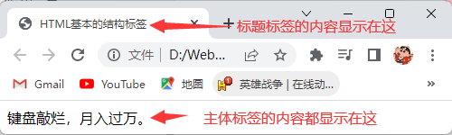

### 2.3.2文档类型声明标签

- 任何一个标准的HTML页面，第一行一定是一个以 `<!DOCTYPE HTML的版本>` 开头的语句，这一行就是文档声明头，即：DTD（DocType Declaration）。

- `<!DOCTYPE HTML的版本>` 文档类型声明标签的作用：是告诉浏览器使用哪种HTML版本来显示网页。

- 语法：

  ```html
  <!DOCTYPE HTML的版本>
  ```

- HTML的版本的取值为：`html` （表示声明文档类型为HTML5）。

- 注意点：

  - 文档类型声明标签位于文档最上面的位置，处于 `<html>` 标签之上。
  - 文档类型声明标签不是一个HTML标签，它就是文档类型声明标签。

### 2.3.3lang语言种类

- `<html>` 标签的 `lang` 属性的作用：是设置网页使用的语言，主要是为了方便浏览器搜索推荐以及触发浏览器翻译功能，并不是说设置了某类主语言后网页中就不能存在其他类型的语言了。

- 语法：

  ```html
  <head lang="网页语言"></head>
  ```

- 网页语言的取值，如下表所示：

  | 网页语言取值 | 说明                             |
  | :----------: | :------------------------------- |
  |      en      | 定义语言为英语                   |
  |      zh      | 定义语言为中文                   |
  |    en-GB     | 定义语言为英文（英国）           |
  |    en-US     | 定义语言为英文（美国）           |
  |    zh-CN     | 定义语言为中文（简体，中国大陆） |
  |    zh-SG     | 定义语言为中文（简体，新加坡）   |
  |    zh-HK     | 定义语言为中文（简体，香港）     |
  |    zh-MO     | 定义语言为中文（简体，澳门）     |
  |    zh-TW     | 定义语言为中文（简体，台湾）     |

### 2.3.4字符集

- 字符集（Character set）就是多个字符的集合，以便计算机能够识别和储存各种文字。

- HTML使用 `<meta />` 标签的 `charset` 属性来设置HTML文档应该使用哪种字符编码，防止HTML文档保存后再打开时会显示乱码。

- 语法：

  ```html
  <!-- 完整写法 -->
  <meta http-equiv="Content-Type" content="text/html;charset=字符编码">
  <!-- 简洁写法 -->
  <meta charset="字符编码">
  ```

- 字符编码的取值，如下表所示：

  | 字符编码取值 |               作用               |
  | :----------: | :------------------------------: |
  |    GB2312    | 设置HTML文档使用GB2312的字符编码 |
  |     BIG5     |  设置HTML文档使用BIG5的字符编码  |
  |     GBK      |  设置HTML文档使用GBK的字符编码   |
  |    UTF-8     | 设置HTML文档使用UTF-8的字符编码  |

- 注意点：

  - `UTF-8` 也被称为万国码，基本包含了全世界所有国家需要用到的字符，所以开发者统一使用 `UTF-8` 即可。
  - 字符集设置是必须的，否则极大可能引起网页乱码。
  - `<meta />` 标签是写在 `<head>` 标签里的。

### 2.3.5标准的HTML结构

- 标准的HTML结构如下所示：

  ```html
  <!DOCTYPE html>
  <html lang="en">
    <head>
      <meta charset="UTF-8" />
      <title>Document</title>
    </head>
    <body></body>
  </html>
  ```

## 2.4前端开发工具

### 2.4.1VSCode编辑器

- VSCode全称是Visual Studio Code，是微软推出的一个跨平台的编辑器，能够在Windows、Linux、IOS等平台上运行，通过安装一些插件可以让这个编辑器变成一个编译器，VSCode支持C++、Python、Java、C#、Go等多种语言，功能强大、插件丰富并且启动速度极快，值得每个开发人员尝试一把！
- VSCode下载网站：https://code.visualstudio.com/。

### 2.4.2VSCode编辑器插件

- VSCode编辑器汉化插件：Chinese (Simplified) (简体中文) Language Pack for Visual Studio Code。
- 自动重命名配对的标签：Auto Rename Tag。
- 浏览器实时显示代码的变化：Live Server。

## 2.5HTML常用标签

### 2.5.1标签语义

- 标签语义就是指标签的含义，即这个标签是用来干嘛的，根据标签的语义，在合适的地方给一个最为合理的标签，可以让页面结构更清晰。

### 2.5.2标题标签

- HTML提供了6个等级的标题标签，即：`<h1>`~`<h6>`。

  > 注：h为单词head的缩写，意为头部、标题。

- 标签语义：作为标题使用，并且依据重要性递减。

- 语法：

  ```html
  <h1>1级标题</h1>
  <h2>2级标题</h2>
  <h3>3级标题</h3>
  <h4>4级标题</h4>
  <h5>5级标题</h5>
  <h6>6级标题</h6>
  ```

- 注意点：

  - 标题标签是写在 `<body>` 标签里的。
  - 加了标题的文字会自动加粗，文字都有变大但是从 `<h1>` 至 `<h6>` 标签文字逐渐减小。
  - 级别越大的标题标签，对网页元素的强调性越强，同时也和浏览器SEO优化有关。
  - 标题标签独占一行。

- 演示代码：

  ```html
  <!DOCTYPE html>
  <html lang="en">
    <head>
      <meta charset="UTF-8" />
      <title>Document</title>
    </head>
    <body>
      <h1>1级标题</h1>
      <h2>2级标题</h2>
      <h3>3级标题</h3>
      <h4>4级标题</h4>
      <!-- 一个标题标签独占一行 -->
      <h5>5级标题</h5>123
      <h6>6级标题</h6>
    </body>
  </html>
  ```

- 演示结果：

  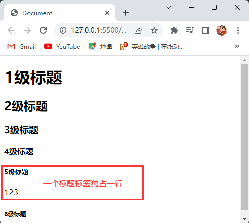

### 2.5.3段落标签

- 段落标签使用 `<p>` 标签进行定义。

  > 注：p为单词paragraph的缩写，意为段落。

- 标签语义：可以把HTML文档分割为若干个段落。

- 语法：

  ```html
  <p>这是一个段落</p>
  ```

- 注意点：

  - 段落标签是写在 `<body>` 标签里的。
  - 文本在一个段落中会根据浏览器窗口的大小自动换行，对于中文段落来说无论如何都会自动换行，但是对于英文段落来说如果字母是连续的，如：aaa···，那么浏览器会认为该段落整体都是一个字母不会自动换行，要想英文段落自动换行字母之间得有空格。
  - 段落和段落之间的空隙叫做段间距，同一段落里的不同行文字之间的空隙叫做行间距。
  - 段落标签独占一行。

- 演示代码：

  ```html
  <!DOCTYPE html>
  <html lang="en">
    <head>
      <meta charset="UTF-8" />
      <title>Document</title>
    </head>
    <body>
      <p>这是一个很长长长长长长长长长长长长长长长长长长长长长长长长长长长长长长长长长长长长长长长长长长长长长长长长长长长长长长长长长长长长长长长长长长长长长长长长长长的段落</p>
      <p>这是一个很长长长长长长长长长长长长长长长长长长长长长长长aaaaaaa长长长长长长长长长长长长长长长长长长长长长长长长长长长长长长长长长长长长长长长长长长长长长长长长长长长的段落</p>
    </body>
  </html>
  ```

- 演示结果：

  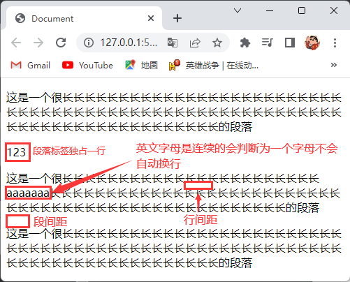

### 2.5.4换行标签

- 换行标签使用 `<br />` 标签进行定义。

  > 注：br为单词break的缩写，意为打断、换行。

- 标签语义：强制换行。

- 语法：

  ```html
  <br />
  ```

- 注意点：

  - 换行标签是写在 `<body>` 标签里的。
  - 换行标签只是简单地开始新的一行，跟段落不一样，所以不会产生段间距。

- 演示代码：

  ```html
  <!DOCTYPE html>
  <html lang="en">
    <head>
      <meta charset="UTF-8" />
      <title>Document</title>
    </head>
    <body>
      <p>这是一个很长长长长长长长长长长长<br />长长长长长长长长长长长长长长长长长长长长长长长长长长长长长长长长长长长长长长长长长长长长长长长长长长长长长长长长长长长长长长长的段落</p>
    </body>
  </html>
  ```

- 演示结果：

  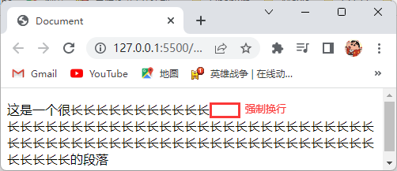

### 2.5.5分割线标签

- 分割线标签使用 `<hr />` 标签进行定义。

  > 注：hr为单词horizontal的缩写，意为：分割。

- 标签语义：添加一条分割线将段落与段落之间隔开。

- 语法：

  ```html
  <hr />
  ```

- 注意点：

  - 分割线标签是写在 `<body>` 标签里的。
  - 分割线标签独占一行。
  - 分割线标签就是在页面中显示一条分割线。
  - 实际开发中并不常用分割线标签作为分割线，而是使用CSS盒子模型中的边框来实现分割线效果，或是利用一个空盒子设置长宽高及背景颜色来实现分割线效果。

- 演示代码：

  ```html
  <!DOCTYPE html>
  <html lang="en">
    <head>
      <meta charset="UTF-8" />
      <title>Document</title>
    </head>
    <body>
      <p>段落</p>
      <hr />123
      <p>段落</p>
    </body>
  </html>
  ```

- 演示结果：

  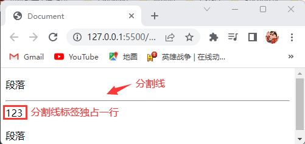

### 2.5.6文本格式化标签

- 文本格式化标签有：加粗标签、倾斜标签、删除线标签、下划线标签等。

- 标签语义：突出重要性，比普通文字更重要。

- 文本格式化标签各个标签的标签语义，如下表所示：

  |   标签名   |           标签           | 标签语义         |
  | :--------: | :----------------------: | ---------------- |
  |  加粗标签  | `<strong>` 或 `<b>` 标签 | 文本加粗         |
  |  倾斜标签  |   `<em>` 或 `<i>` 标签   | 文本倾斜         |
  | 删除线标签 |  `<del>` 或 `<s>` 标签   | 给文本添加删除线 |
  | 下划线标签 |  `<ins>` 或 `<u>` 标签   | 给文本添加下划线 |

- 语法：

  ```html
  <!-- 加粗标签的完整写法和简写 -->
  <strong></strong>
  <b></b>
  <!-- 倾斜标签的完整写法和简写 -->
  <em></em>
  <i></i>
  <!-- 删除线标签的完整写法和简写 -->
  <del></del>
  <s></s>
  <!-- 下划线标签的完整写法和简写 -->
  <ins></ins>
  <u></u>
  ```

- 注意点：

  - 文本格式化标签不只是单纯的给文本添加效果，其核心的意义在于对元素进行强调，所以在后期的开发中可以把一些特殊性、强调性的元素放在文本格式化标签中，然后再对文本格式化标签这个元素进行样式设置。
  - 文本格式化标签是写在 `<body>` 标签里的。
  - 需要突出重要性的强调语境用完整写法，不需要突出重要性的强调语境用简写。

- 演示代码：

  ```html
  <!DOCTYPE html>
  <html lang="en">
    <head>
      <meta charset="UTF-8" />
      <title>Document</title>
    </head>
    <body>
      <strong>加粗</strong>
      <b>加粗</b>
      <em>倾斜</em>
      <i>倾斜</i>
      <del>删除线</del>
      <s>删除线</s>
      <ins>下划线</ins>
      <u>下划线</u>
    </body>
  </html>
  ```

- 演示结果：

  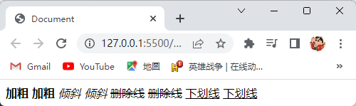

### 2.5.7没有语义的布局标签

- 没有语义的布局标签也就是没有标签语义，这些标签是用来布局和装内容的。

- 没有语义的布局标签有：`<div>` 标签、`<span>` 标签。

  > 注1：div是division的缩写，意为分割、分区。
  >
  > 注2：span单词，意为跨度、跨距。

- 语法：

  ```html
  <div></div>
  <span></span>
  ```

- 注意点：

  - `<div>` 标签独占一行。
  - `<span>` 标签一行可以放置多个。
  - `<div>` 标签和 `<span>` 标签是写在 `<body>` 标签里的。
  - `<span>` 标签里面不能放 `<p>`、`<h>`、`<ul>`、`<dl>`、`<ol>`、`<div>` 标签。
  - `<span>` 标签不单单是用于布局，对于一些需要单独修饰和设置的元素，可以将其用 `<span>` 标签嵌套起来，然后就可以单独对其进行设置，如：在一个 `<p>` 标签的段落中要对其中某一句话单独设置样式，那么就可以用 `<span>` 标签将这句话单独嵌套起来，这样就方便对其单独设置样式还不会影响段落中的其他内容，这其实也是利用了 `<span>` 标签一行可以放置多个盒子的特性，不过对于特殊且具有强调性的元素建议使用文本格式化标签。

- 演示代码：

  ```html
  <!DOCTYPE html>
  <html lang="en">
    <head>
      <meta charset="UTF-8" />
      <title>Document</title>
    </head>
    <body>
      <div>div独占一行</div>123
      <div>div独占一行</div>
      <span>span一行可以放置多个</span>
      <span>span一行可以放置多个</span>
      <span>span一行可以放置多个</span>
    </body>
  </html>
  ```

- 演示结果：

  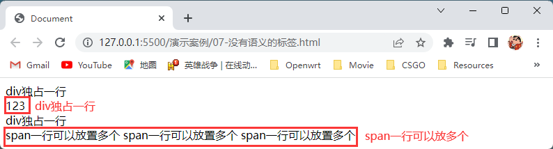

### 2.5.8图像标签

- 图像标签使用 `` 标签进行定义。

  > 注：img为单词image的缩写，意为：图像。

- 标签语义：添加图片到网页。

- 语法：

  ```html
  
  ```

- 图像标签的属性，如下表所示：

  | 属性名 |   属性值   | 说明                         |
  | :----: | :--------: | ---------------------------- |
  |  src   | 图片的路径 | 设置要添加图片的路径         |
  |  alt   |    文本    | 图片加载不出时显示的文本     |
  | title  |    文本    | 鼠标悬停在图片上时显示的文本 |
  | width  |   像素值   | 设置图片的宽度为多少像素     |
  | height |   像素值   | 设置图片的高度为多少像素     |
  | border |   像素值   | 设置图片的边框粗细为多少像素 |

  > 铺垫知识：
  >
  > - 目录文件夹：就是普通文件夹，里面只不过存放了我们做页面所需要的相关素材，如html文件、图片等。
  > - 根目录：打开目录文件夹的第一层就是根目录。
  > - 像素值：格式为数字+px（如：12px），网页的基本单位是像素（px）。
  >
  > 路径分为相对路径和绝对路径：
  >
  > - 相对路径：是以引用文件所在位置为参考基础，而建立出的目录路径，简单来说就是从代码所在的这个文件出发，去寻找目标文件的。
  > - 相对路径分为：
  >   - 同一级路径：用 `./` 表示，意思是引用文件和被引用文件在同一个文件夹下。
  >   - 下一级路径：用 `/` 表示，意思是被引用文件在引用文件的下一级文件夹中。
  >   - 上一级路径：用 `../` 表示，意思是被引用文件在引用文件的上一级文件夹中。
  > - 绝对路径：是指目录下的绝对位置，直接到达目标位置，通常是从盘符开始的路径，如：`D:\web\img\logo.gif` 或完整的网页地址 `http://www.baidu.com`。
  >
  > - 注意点：相对路径为 `/`（正斜杆），绝对路径为 `\`（反斜杆）。

- 注意点：

  - 图像标签是写在 `<body>` 标签里面的。
  - 其他属性可以省略，但是 `src` 属性必须要有。
  - 能够插入的图片类型有 `jpg（jpeg）`、`gif`、`png`、`bmp` 等，不能往网页中插入的图片格式有 `psd`、`ai` 等。
  - 设置图像的宽度与高度时一般设置其中之一便可，另外一个会自动按比例适配，如果同时设置高度和宽度，若设置不当图片可能会变形。

- 演示代码：

  ```html
  <!DOCTYPE html>
  <html lang="en">
    <head>
      <meta charset="UTF-8" />
      <title>Document</title>
    </head>
    <body>
      <h4>图片标签</h4>
      
      <h4>图片标签设置了alt属性</h4>
      
      <h4>图片标签设置了title属性</h4>
      
      <h4>图片标签设置了width和height属性</h4>
      
    </body>
  </html>
  ```

- 演示结果：

  

### 2.5.9超链接标签

- 超链接标签使用 `<a>` 标签进行定义。

  > 注：a为单词anchor的缩写，意为：锚。

- 标签语义：从一个页面链接到另一个页面。

- 语法：

  ```html
  <a>超链接显示的内容</a>
  ```

- 超链接标签的属性，如下表所示：

  | 属性名 |                            属性值                            | 说明                       |
  | :----: | :----------------------------------------------------------: | -------------------------- |
  |  href  |                      要链接到的文件路径                      | 用于指定链接目标目标的地址 |
  | target | `_self`（在同一个页面中打开，默认值）或 `_blank`（在新窗口页面中打开） | 用于指定链接页面的打开方式 |

- 链接分类：

  - 外部链接：链接到其他网页。

  - 内部链接：网站内部页面之间的相互链接。

  - 空链接：该链接没有任何功能，一般给超链接标签的 `href` 属性设置 `javascript:void(0)` 属性值即可。

  - 下载链接：如果 `href` 属性值里面的地址是一个文件或者压缩包，就会下载这个文件。

  - 网页元素链接：在网页中的各种网页元素，如：文本、图像、表格、音频、视频等都可以添加超链接。

  - 锚点链接：点击链接，可以快速定位到页面中的某个位置。
    - 锚点链接的使用步骤：
      1. 在超链接标签的 `href` 属性中，设置属性值为 `#名字` 的形式，如：
      
         ```html
         <a href="#two"> 第2集 </a>
         ```
      
      2. 找到目标位置标签，里面添加一个 `id` 属性，`id` 属性的属性值为上一步设置的名字，如：
      
         ```html
         <h3 id="two">第2集介绍</h3>
         ```
      
    - 给超链接标签的 `href` 属性设置 `#` 属性值即可快速定位到页面的顶部。

- 注意点：

  - 超链接标签是写在 `<body>` 标签里的。
  - 其他属性可以省略，但是 `href` 属性必须要有。

- 演示代码：

  ```html
  <!DOCTYPE html>
  <html lang="en">
    <head>
      <meta charset="UTF-8" />
      <title>Document</title>
    </head>
    <body>
      <h4>1.锚点链接</h4>
      <a href="#six">锚点链接到6.网页元素链接</a>
      <h4>2.外部链接</h4>
      <a href="http://www.baidu.com">跳转到百度页面</a>
      <h4>3.内部链接设置了target属性</h4>
      <a href="./02-标题标签.html" target="_blank">链接到标题标签页面并且在新窗口打开</a>
      <h4>4.空链接</h4>
      <a href="javascript:void(0)">空链接用户点击无效果</a>
      <h4>5.下载链接</h4>
      <a href="./file/img.7z">下载img.7z文件</a>
      <h4 id="six">6.网页元素链接点击百度图片跳转到百度页面</h4>
      <a href="http://www.baidu.com">
        
      </a>
      <h4>7.给超链接标签的href属性设置#属性值即可快速定位到页面的顶部</h4>
      <a href="#">返回页面顶部</a>
    </body>
  </html>
  ```

- 演示结果：

  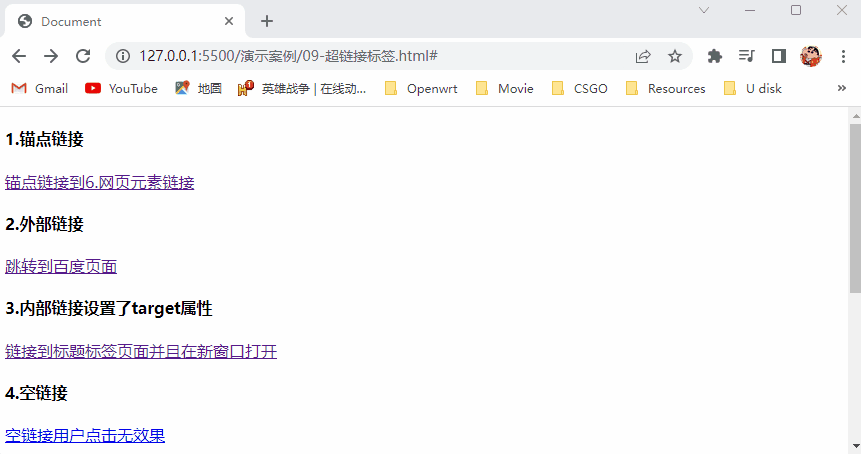

## 2.6HTML中的注释和特殊字符

### 2.6.1注释标签

- 注释标签使用 `<!-- -->` 标签进行定义。

- 标签语义：为代码添加的具有解释性、描述性的信息，主要用来帮助开发人员理解代码，浏览器执行代码时会忽略所有的注释。

- 语法：

  ```html
  <!-- 要注释的内容 -->
  ```

- 注意点：

  - 在VSCode编辑器中可以使用 `Ctrl+/` 快捷键快速注释。
  - 注释标签可以写在任意地方。

- 演示代码：

  ```html
  <!DOCTYPE html>
  <html lang="en">
    <head>
      <meta charset="UTF-8" />
      <title>Document</title>
    </head>
    <body>
      <h4>代码代码</h4>
      <!-- 这是一个注释 -->
    </body>
  </html>
  ```

- 演示结果：

  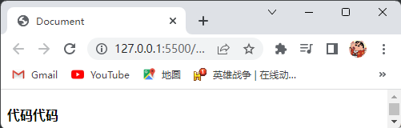

### 2.6.2特殊字符

- 在HTML页面中，一些特殊的符号很难或者不方便直接使用，此时我们就可以使用字符实体来代替。

- HTML字符实体结构为：`&英文;`。

- 常见的字符实体有：

  | 特殊字符 |   说明   | 字符的代码 |
  | :------: | :------: | :--------: |
  |          |  空格符  |  `&nbsp;`  |
  |    <     |  小于号  |   `&lt;`   |
  |    >     |  大于号  |   `&gt;`   |
  |    &     |   和号   |  `&amp;`   |
  |    ±     |  正负号  | `&plusmn;` |
  |    ×     |   乘号   | `&times;`  |
  |    ÷     |   除号   | `&divide;` |
  |   ^2^    |   上标   |  `&sup2;`  |
  |   ~2~    |   下标   |  `&sub2;`  |
  |    "     |  双引号  |  `&quot;`  |
  |    '     |  单引号  |  `&apos;`  |
  |    ￠    | 美分符号 |  `&cent;`  |
  |    ￡    | 英镑符号 | `&pound;`  |
  |    ￥    | 美元符号 |  `&yen;`   |
  |    €     | 欧元符号 |  `&euro;`  |
  |    §     | 章节符号 |  `&sect;`  |
  |    ©     | 版权符号 |  `&copy;`  |

- 注意点：在HTML代码中同时并列出现多个空格、换行、缩进等，最终浏览器只会解析出一个空格，所以需要使用字符实体来添加多个空格。

## 2.8HTML表格标签

### 2.8.1表格的主要作用

- 表格主要用于显示、展示数据，因为它可以让数据显示的非常的规整，可读性非常好，特别是后台展示数据的时候，能够熟练运用表格就显得很重要，一个清爽简约的表格能够把繁杂的数据表现得很有条理，合理的使用表格也能够有效提高SEO。

### 2.8.2表格的基本语法

- 表格的基本语法有：表格标签、表格行标签、表格单元格标签。

- 表格的基本语法各个标签的标签语义，如下表所示：

  |     标签名     |     标签     | 标签语义               |
  | :------------: | :----------: | ---------------------- |
  |    表格标签    | `table` 标签 | 用于定义表格           |
  |   表格行标签   |  `tr` 标签   | 用于定义表格中的行     |
  | 表格单元格标签 |  `td` 标签   | 用于定义表格中的单元格 |

- 语法：

  ```html
  <table>
      <tr>
          <td></td>
      </tr>
  </table>
  ```

- 表格标签的属性，如下表所示：

  |   属性名    |                            属性值                            | 说明                                             |
  | :---------: | :----------------------------------------------------------: | ------------------------------------------------ |
  |    align    | `left`（左对齐，默认值）或 `center`（居中对齐）或 `right`（右对齐） | 设置表格的对齐方式                               |
  |   border    |              1（有边框）或0（没有边框，默认值）              | 设置表格单元格是否有边框                         |
  | cellpadding |                    像素值（默认为1像素）                     | 设置单元格的边沿与其内容之间的空白距离为多少像素 |
  | cellspacing |                    像素值（默认为2像素）                     | 设置单元格与单元格之间的空白距离为多少像素       |
  |    width    |                            像素值                            | 设置表格的宽度为多少像素                         |
  |   height    |                            像素值                            | 设置表格的高度为多少像素                         |

- 注意点：

  - 表格标签是写在 `<body>` 标签里的。
  - 表格行标签是写在表格标签里的。
  - 表格单元格标签是写在表格行标签里的。
  - 表格单元格标签里面可以放任何元素。

- 演示代码：

  ```html
  <!DOCTYPE html>
  <html lang="en">
    <head>
      <meta charset="UTF-8" />
      <title>Document</title>
    </head>
    <body>
      <h4>1.表格的基本语法</h4>
      <table>
        <tr>
          <td>苹果</td>
          <td>苹果</td>
          <td>苹果</td>
        </tr>
        <tr>
          <td>苹果</td>
          <td>苹果</td>
          <td>苹果</td>
        </tr>
      </table>
      <h4>2.表格标签使用了align属性和border属性</h4>
      <table align="center" border="1">
        <tr>
          <td>苹果</td>
          <td>苹果</td>
          <td>苹果</td>
        </tr>
        <tr>
          <td>苹果</td>
          <td>苹果</td>
          <td>苹果</td>
        </tr>
      </table>
      <h4>3.表格标签使用了border属性和cellpadding属性</h4>
      <table border="1" cellpadding="10px">
        <tr>
          <td>苹果</td>
          <td>苹果</td>
          <td>苹果</td>
        </tr>
        <tr>
          <td>苹果</td>
          <td>苹果</td>
          <td>苹果</td>
        </tr>
      </table>
      <h4>4.表格标签使用了border属性和cellspacing属性</h4>
      <table border="1" cellspacing="10px">
        <tr>
          <td>苹果</td>
          <td>苹果</td>
          <td>苹果</td>
        </tr>
        <tr>
          <td>苹果</td>
          <td>苹果</td>
          <td>苹果</td>
        </tr>
      </table>
      <h4>5.表格标签使用了border属性和width属性和height属性</h4>
      <table border="1" width="200" height="200">
        <tr>
          <td>苹果</td>
          <td>苹果</td>
          <td>苹果</td>
        </tr>
        <tr>
          <td>苹果</td>
          <td>苹果</td>
          <td>苹果</td>
        </tr>
      </table>
    </body>
  </html>
  ```

- 演示结果：

  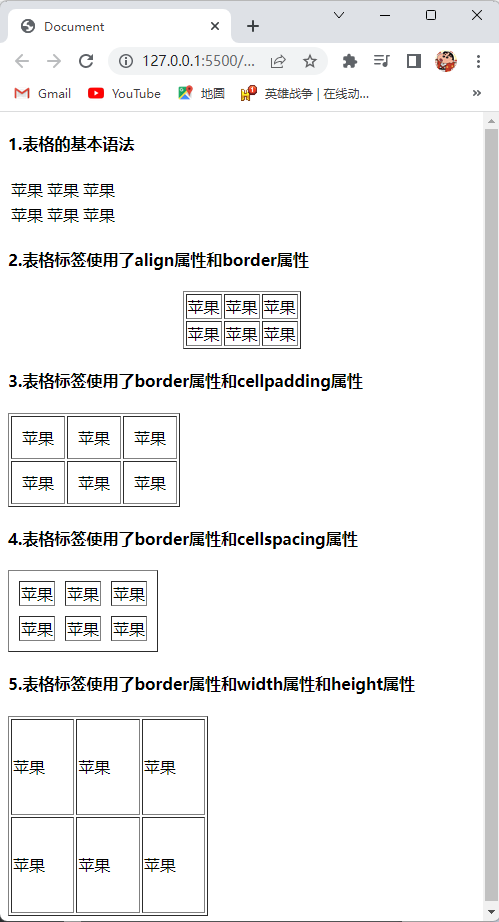

### 2.8.3表头单元格标签

- 表头单元格标签使用 `<th>` 标签进行定义。

  > 注：th是单词table head的缩写，意为表头。

- 标签语义：表头单元格也是单元格，常用于表格第一行，突出重要性，表头单元格里面的文字会加粗居中显示。

- 语法：

  ```html
  <th></th>
  ```

- 注意点：

  - 表头单元格标签写在表格行标签里。

  - 表头单元格标签里面可以放任何元素。

- 演示代码：

  ```html
  <!DOCTYPE html>
  <html lang="en">
    <head>
      <meta charset="UTF-8" />
      <title>Document</title>
    </head>
    <body>
      <table border="1" cellpadding="5px">
        <tr>
          <th>序号</th>
          <th>姓名</th>
          <th>性别</th>
        </tr>
        <tr>
          <td>1</td>
          <td>张三</td>
          <td>男</td>
        </tr>
      </table>
    </body>
  </html>
  ```

- 演示结果：

  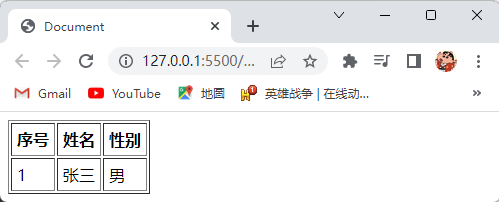

### 2.8.4表格结构标签

- 因为表格可能很长，为了更好的表示表格的语义，可以将表格分割成表格头部、表格主体、表格底部三大部分。
- 表格结构标签使用 `<thead>` 标签来表示表格的头部区域，`<tbody>` 标签来表示表格的主体区域，`<tfoot>` 标签来表示表格的底部区域。

- 标签语义：让表格的内容结构分组，突出表格的不同部分（头部、主体、底部），使语义更加清晰。

- 语法：

  ```html
  <thead>表格的头部区域</thead>
  <tbody>表格的主体区域</tbody>
  <tfoot>表格的底部区域</tfoot>
  ```

- 注意点：

  - 表格结构标签都是写在在表格标签里面。
  - `<thead>` 标签必须拥有 `<tr>` 标签，一般是位于第一行，且一般 `<tr>` 标签中推荐放置 `<th>` 标签。
  - `<tbody>` 标签包裹 `<tr>` 标签，一般是位于除第一行和倒数第一行的中间，且一般 `<tr>` 标签中推荐放置 `<td>` 标签。
  - `<tfoot>` 标签包裹 `<tr>` 标签，一般是位于倒数第一行，且一般 `<tr>` 标签中推荐放置 `<td>` 标签。
  - 表格结构标签可以省略。

- 写与不写表格结构标签的区别：

  - 如果写了，那么这三个部分的代码顺序可以任意，浏览器显示的时候还是按照 `<thead>`、`<tbody>`、`<tfoot>` 标签的顺序依次来显示内容，如果不写 `<thead>`、`<tbody>`、`<tfoot>` 标签，那么浏览器解析并显示表格内容的时候是从按照代码的从上到下的顺序来显示。
  - 当表格非常大内容非常多的时候，如果用 `<thead>`、`<tbody>`、`<tfoot>` 标签的话，那么数据可以边获取边显示，如果不写，则必须等表格的内容全部从服务器获取完成才能显示出来。
  - 如果写了，只有同一个结构标签中的单元格标签才能跨行合并，不能跨结构标签合并。

- 演示代码：

  ```html
  <!DOCTYPE html>
  <html lang="en">
    <head>
      <meta charset="UTF-8" />
      <title>Document</title>
    </head>
    <body>
      <table border="1" cellpadding="5px">
        <thead>
          <tr>
            <th>序号</th>
            <th>姓名</th>
            <th>性别</th>
          </tr>
        </thead>
        <tbody>
          <tr>
            <td>1</td>
            <td>张三</td>
            <td>男</td>
          </tr>
        </tbody>
        <tfoot>
          <tr>
            <td>结束</td>
            <td>结束</td>
            <td>结束</td>
          </tr>
        </tfoot>
      </table>
    </body>
  </html>
  ```

- 演示结果：

  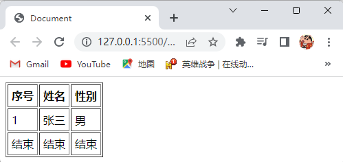

### 2.8.5合并单元格

- 合并单元格分为：

  - 跨行合并：是给表格单元格设置 `rowspan` 属性，属性值为要合并的单元格个数来实现。
  - 跨行合并的步骤：
    1. 确定合并那几个单元格。
    2. 然后保留最上方的表格单元格标签删除其他的表格单元格标签。
    3. 给保留的表格单元格标签设置 `rowspan` 属性。
  - 跨列合并：是给表格单元格设置 `colspan` 属性，属性值为要合并的单元格个数来实现。
  - 跨列合并的步骤：
    1. 确定合并那几个单元格。
    2. 然后保留最左方的表格单元格标签删除其他的表格单元格标签。
    3. 给保留的表格单元格标签设置 `colspan` 属性。

- 演示代码：

  ```html
  <!DOCTYPE html>
  <html lang="en">
    <head>
      <meta charset="UTF-8" />
      <title>Document</title>
    </head>
    <body>
      <h4>跨行合并</h4>
      <table border="1" width="300px" height="300px" cellspacing="0">
        <tr>
          <td></td>
          <td rowspan="2"></td>
          <td></td>
        </tr>
        <tr>
          <td></td>
          <td></td>
        </tr>
      </table>
      <h4>跨列合并</h4>
      <table border="1" width="300px" height="300px" cellspacing="0">
        <tr>
          <td></td>
          <td colspan="2"></td>
        </tr>
        <tr>
          <td></td>
          <td></td>
          <td></td>
        </tr>
      </table>
    </body>
  </html>
  ```

- 演示结果：

  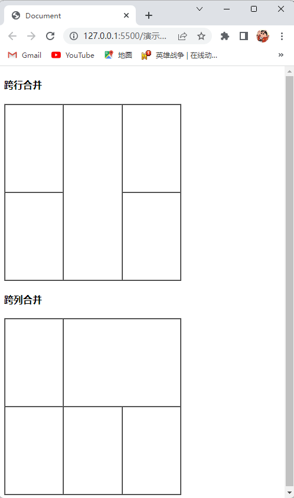

### 2.8.6表格标题标签

- 表格标题标签使用 `<captain>` 标签来定义。

- 标签语义：给表格设置一个标题。

- 语法：

  ```html
  <captain></captain>
  ```

- 表格标题标签的属性，如下表所示：

  | 属性名 | 属性值                                                       | 说明                       |
  | :----: | ------------------------------------------------------------ | -------------------------- |
  | align  | `left`（左对齐）或 `center`（居中对齐，默认值）或 `right`（右对齐） | 设置表格标题标签的对齐方式 |

- 注意点：表格标题标签是写在表格标签里的。

- 演示代码：

  ```html
  <!DOCTYPE html>
  <html lang="en">
    <head>
      <meta charset="UTF-8" />
      <title>Document</title>
    </head>
    <body>
      <table border="1" cellpadding="10px">
        <caption>学生表</caption>
        <tr>
          <th>序号</th>
          <th>姓名</th>
          <th>性别</th>
        </tr>
        <tr>
          <td>1</td>
          <td>张三</td>
          <td>男</td>
        </tr>
      </table>
    </body>
  </html>
  ```

- 演示结果：

  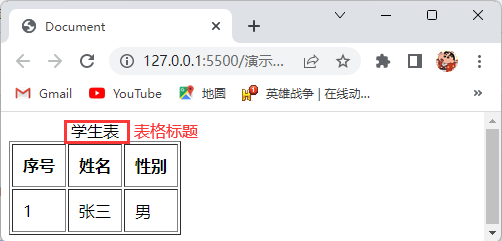

## 2.9HTML列表标签

### 2.9.1列表的主要作用

- 表格是用来显示数据的，那么列表就是用来布局的，列表最大的特点就是整齐、整洁、有序，它作为布局会更加自由和方便，在实际开发中凡是遇到排列整齐的简洁内容，都可以使用列表来进行布局。

### 2.9.2无序列表标签

- 无序列表标签使用 `<ul>` 标签进行定义，无序列表中的列表项使用 `<li>` 标签进行定义。

- 标签语义：在网页中表示一组无顺序之分的列表。

- 语法：

  ```html
  <ul>
      <li></li>
  </ul>
  ```

- 无序列表标签的属性，如下表所示：

  | 属性名 |                            属性值                            | 说明                       |
  | :----: | :----------------------------------------------------------: | -------------------------- |
  |  type  | `disc`（实心原点，默认值）或 `square`（实心方点）或 `circle`（空心圆） | 设置列表每一项前显示的标识 |

- `<li>` 标签的属性，如下表所示：

  | 属性名 |                            属性值                            | 说明                       |
  | :----: | :----------------------------------------------------------: | -------------------------- |
  |  type  | `disc`（实心原点，默认值）或 `square`（实心方点）或 `circle`（空心圆） | 设置单个列表项前显示的标识 |

- 注意点：

  - 无序列表标签是写在 `<body>` 标签里的。
  - `<ul>` 标签中只允许包含 `<li>` 标签，且 `<li>` 标签不能单独存在。
  - `<li>` 标签可以包含任意标签。
  - `<ul>` 标签中至少包含一对 `<li>` 标签。
  - 列表之间是可以嵌套的。
  - 无序列表中的列表项标签独占一行。

- 演示代码：

  ```html
  <!DOCTYPE html>
  <html lang="en">
    <head>
      <meta charset="UTF-8" />
      <title>Document</title>
    </head>
    <body>
      <h4>无序列表</h4>
      <ul>
        <li>水果</li>
        <li>水果</li>
        <li>水果</li>
      </ul>
      <h4>无序列表添加了type属性</h4>
      <ul type="square">
        <li>水果</li>
        <li>水果</li>
        <li>水果</li>
      </ul>
      <h4>li标签添加了type属性</h4>
      <ul>
        <li>水果</li>
        <li type="square">水果</li>
        <li>水果</li>
      </ul>
    </body>
  </html>
  ```

- 演示结果：

  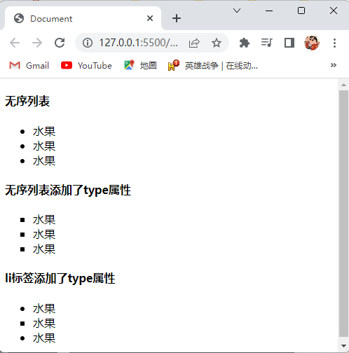

### 2.9.3有序列表标签

- 有序列表标签使用 `<ol>` 标签进行定义，有序列表中的列表项使用 `<li>` 标签进行定义。

- 标签语义：在网页中表示一组有顺序之分的列表。

- 语法：

  ```html
  <ol>
      <li></li>
  </ol>
  ```

- 有序列表标签的属性，如下表所示：

  | 属性名 |                        属性值                        | 说明                               |
  | :----: | :--------------------------------------------------: | ---------------------------------- |
  |  type  | `1`（阿拉伯数字，默认值）或 `a` 或 `A` 或 `i` 或 `I` | 设置列表每一项前显示的标识         |
  | start  |                         数字                         | 设置列表每一项前显示的标识从几开始 |

- `<li>` 标签的属性，如下表所示：

  | 属性名 |                        属性值                        | 说明                       |
  | :----: | :--------------------------------------------------: | -------------------------- |
  |  type  | `1`（阿拉伯数字，默认值）或 `a` 或 `A` 或 `i` 或 `I` | 设置单个列表项前显示的标识 |

- 注意点：

  - 有序列表标签是写在 `<body>` 标签里的。
  - `<ol>` 标签中只允许包含 `<li>` 标签，且 `<li>` 标签不能单独存在。
  - `<li>` 标签可以包含任意标签。
  - `<ol>` 标签中至少包含一对 `<li>` 标签。
  - 列表之间是可以嵌套的。
  - 有序列表中的列表项标签独占一行。

- 演示代码：

  ```html
  <!DOCTYPE html>
  <html lang="en">
    <head>
      <meta charset="UTF-8" />
      <title>Document</title>
    </head>
    <body>
      <h4>有序列表</h4>
      <ol>
        <li>水果</li>
        <li>水果</li>
        <li>水果</li>
      </ol>
      <h4>有序列表添加了type属性和start属性</h4>
      <ol type="A" start="3">
        <li>水果</li>
        <li>水果</li>
        <li>水果</li>
      </ol>
      <h4>li标签添加了type属性</h4>
      <ol>
        <li>水果</li>
        <li type="A">水果</li>
        <li>水果</li>
      </ol>
    </body>
  </html>
  ```

- 演示结果：

  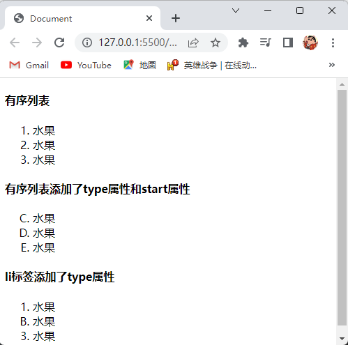

### 2.9.4自定义列表标签

- 自定义列表标签使用 `<dl>` 标签进行定义，自定义列表的主题使用 `<dt>` 标签进行定义，自定义列表的针对主题的每一项内容使用 `<dd>` 标签进行定义。

- 标签语义：在网页中表示一组自定义的列表，自定义列表常用于对术语或名词进行解释、描述和展开。

- 语法：

  ```html
  <dl>
      <dt></dt>
      <dd></dd>
  </dl>
  ```

- 注意点：

  - 自定义列表标签是写在 `<body>` 标签里的。
  - `<dl>` 标签中只允许包含 `<dt>` 和 `<dd>` 标签，且 `<dt>` 和 `<dd>` 标签不能单独存在。
  - `<dt>` 和 `<dd>` 标签可以包含任意标签。
  - `<dl>` 标签中至少包含一对 `<dt>` 标签。
  - 列表之间是可以嵌套的。
  - 自定义列表的主题标签和自定义列表的针对主题的每一项内容标签独占一行。

- 演示代码：

  ```html
  <!DOCTYPE html>
  <html lang="en">
    <head>
      <meta charset="UTF-8" />
      <title>Document</title>
    </head>
    <body>
      <dl>
        <dt>水果</dt>
        <dd>苹果</dd>
        <dd>香蕉</dd>
      </dl>
    </body>
  </html>
  ```

- 演示结果：

  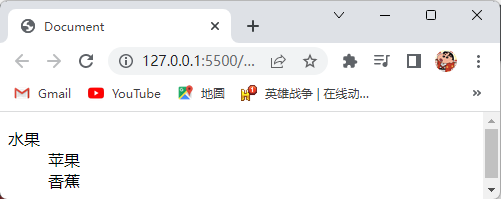

## 2.10HTML表单标签

### 2.10.1为什么需要表单

- 使用表单目的是为了收集用户信息，在我们网页中，我们也需要跟用户进行交互，收集用户资料，此时就需要表单。

### 2.10.2表单的组成

- 在HTML中，一个完整的表单通常由表单域、表单控件（也称为表单元素）和提示信息3个部分构成，如图所示：

  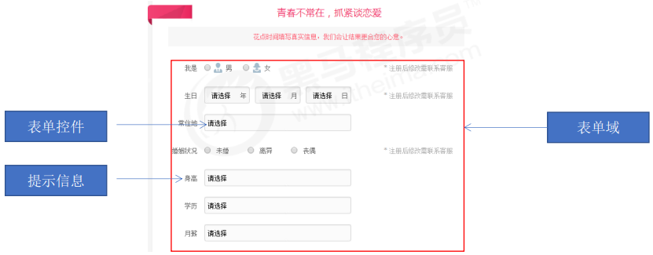

### 2.10.3表单域标签

- 表单域标签使用 `<form>` 标签来定义。

- 标签语义：把它范围内的表单控件信息提交给服务器。

- 语法：

  ```html
  <form></form>
  ```

- 表单域标签的属性，如下表所示：

  | 属性名 |          属性值          | 说明                                               |
  | :----: | :----------------------: | -------------------------------------------------- |
  | action |           路径           | 用于指定接收并处理表单数据的服务器程序的地址       |
  | method | `get`（默认值）或 `post` | 用于设置表单数据的提交方式                         |
  |  name  |        用户自定义        | 用于指定表单的名称，以区分同一个页面中的多个表单域 |

  > 注1：GET方式是将表单数据，以 `name=value` 形式追加到 `action` 属性指定的处理程序的后面，两者间用 `?` 隔开，每一个表单的 `name=value` 间用 `&` 号隔开，特点是只适合提交少量信息，并且不太安全（不要提交敏感数据）、提交的数据类型只限于ASCII字符。
  >
  > 注2：POST方式是将表单数据直接发送（隐藏）到 `action` 属性指定的处理程序，POST发送的数据不可见，`action` 属性指定的处理程序可以获取到表单数据，特点是可以提交海量信息，相对来说安全一些，提交的数据格式是多样的（Word、Excel、rar、img）。

- 注意点：

  - 表单域标签是写在 `<body>` 标签里的。
  - 表单域标签独占一行。

- 演示代码：

  ```html
  <!DOCTYPE html>
  <html lang="en">
    <head>
      <meta charset="UTF-8" />
      <title>Document</title>
    </head>
    <body>
      <form action="">
        这是表单域
      </form>
    </body>
  </html>
  ```

- 演示结果：

  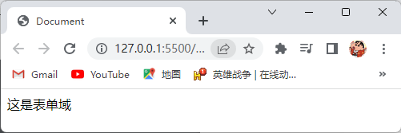

### 2.10.4表单控件

- 表单控件也称表单元素。

- 表单控件有：输入表单控件、下拉表单控件、文本域表单控件。

- 输入表单控件：

  - 输入表单控件使用 `<input />` 标签进行定义。

    > 注：input单词是输入的意思。

  - 标签语义：收集用户信息。

  - 语法：

    ```html
    <input />
    ```

  - `<input />` 标签的属性，如下表所示：

    |  属性名   | 属性值                                                       | 说明                                                         |
    | :-------: | :----------------------------------------------------------- | ------------------------------------------------------------ |
    |   type    | `text`（定义为文本类型，默认值，用于用于输入用户名）<br />`password`（定义为密码类型，用于用户输入密码）<br />`radio`（定义为单选按钮，用于用户单选）<br />`checkbox`（定义为多选框，用于用户多选）<br />`hidden`（定义为隐藏框，用于隐藏输入框）<br />`file`（定义为文件选择框，用于用户上传文件）<br />`button`（定义为普通按钮，没有任何功能的按钮，要配合JavaScript来使用）<br />`submit`（定义为提交按钮，将表单数据发送到服务器）<br />`reset`（定义为重置按钮，将清空当前表单中的所有数据，并设置为最初的默认值）<br />`image`（定义为图片按钮，功能和提交按钮一致，只不过图片按钮可以显示图片） | 指定不同的控件类型                                           |
    |   name    | 用户自定义                                                   | 定义 `<input />` 标签的名称                                  |
    |   value   | 用户自定义                                                   | 规定 `<input />` 标签要发送给服务器的值                      |
    |  checked  | `checked`                                                    | 设置单选按钮或多选框，默认处于选中状态                       |
    | maxlength | 正整数                                                       | 规定文本框最大可以输入多少个字符                             |
    |   size    | 正整数                                                       | 规定文本框可以显示的多少个字符                               |
    | readonly  | `readonly`                                                   | 规定此 `<input />` 标签只读，不能编辑，在谷歌浏览器中光标点不进去，在IE浏览器中光标能点进去，但是属性值不能编辑 |
    | disabled  | `disabled`                                                   | 规定此 `<input />` 标签只读，不能编辑，所有浏览器光标点不进去 |

  - 注意点：

    - `<input />` 标签写在表单域标签里的。
    - `<input />` 标签其他属性可以省略，但是 `type` 属性必须要有。
    - `<input />` 标签的 `name` 和 `value` 属性是每个表单控件都有的属性，主要给后台人员使用，`name` 属性的主要作用就是用于区别不同的 `<input />` 标签使得后台人员能快速的找到所需的 `<input />` 标签，当 `value` 属性的属性值不是自己设置的时候，那么 `value` 属性的属性值就是用户输入或选择的内容。
    - 属性名和属性值相同时可以只写属性名，如：`checked="checked"` 可以直接写成 `checked`。
    - 多个单选按钮必须设置相同的 `name` 属性才能实现多选一。
    - 多个单选按钮或多个复选框如果是一组的，必须设置相同的 `name` 属性。

  - 演示代码：

    ```html
    <!DOCTYPE html>
    <html lang="en">
      <head>
        <meta charset="UTF-8" />
        <title>Document</title>
      </head>
      <body>
        <form action="">
          文本框：<input type="text"><br>
          密码框：<input type="password"><br>
          单选按钮：<input type="radio" name="sex" checked><input type="radio" name="sex"><br>
          多选框：<input type="checkbox" name="duo"><input type="checkbox" name="duo" checked><input type="checkbox" name="duo"><br>
          隐藏框：<input type="hidden"><br>
          选择文件框：<input type="file"><br>
          普通按钮：<input type="button" value="普通按钮"><br>
          提交按钮：<input type="submit"><br>
          重置按钮：<input type="reset"><br>
          图片按钮：<input type="image">
        </form>
      </body>
    </html>
    ```

  - 演示结果：

    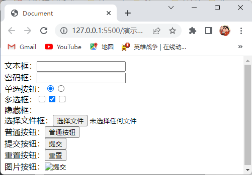

- 下拉表单控件：

  - 下拉表单控件使用 `<select>` 标签进行定义，下拉列表中的列表项使用 `<option>` 标签进行定义。

  - 标签语义：在页面中，有多个选项让用户选择时，可以使用下拉列表表单控件节约页面空间。

  - 语法：

    ```html
    <select>
        <option></option>
    </select>
    ```

  - `<select>` 标签的属性，如下表所示：

    | 属性名 |   属性值   | 说明                       |
    | :----: | :--------: | -------------------------- |
    |  name  | 用户自定义 | 定义 `<select>` 标签的名称 |

  - `<option>` 标签的属性，如下表所示：

    |  属性名  |   属性值   | 说明                                   |
    | :------: | :--------: | -------------------------------------- |
    | selected |  selected  | 设置当前列表项为默认项                 |
    |  value   | 用户自定义 | 规定 `<option>` 标签要发送给服务器的值 |

  - 注意点：
    - `<select>` 标签是写在 `<form>` 标签里的。
    - `<option>` 标签是写在 `<select>` 标签里面的。
    - `<select>` 标签中至少包含一对 `<option>` 标签。
    - 每个 `<option>` 标签都应该有一个 `value` 属性，其中包含选择该选项时要提交给服务器的数据值，如果不包含 `value` 属性，则 `value` 属性的属性值默认为元素内包含的文本。

  - 演示代码：

    ```html
    <!DOCTYPE html>
    <html lang="en">
      <head>
        <meta charset="UTF-8" />
        <title>Document</title>
      </head>
      <body>
        <form action="">
          <h4>下拉表单控件</h4>
          <select name="" id="">
            <option value="">北京</option>
            <option value="">天津</option>
            <option value="">广州</option>
          </select>
          <h4>option标签设置了selected属性</h4>
          <select name="" id="">
            <option value="">北京</option>
            <option value="" selected>天津</option>
            <option value="">广州</option>
          </select>
        </form>
      </body>
    </html>
    ```

  - 演示结果：

    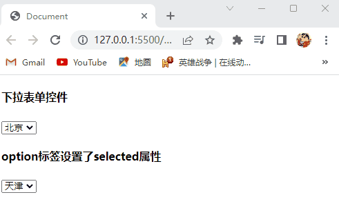

- 文本域表单控件：

  - 文本域表单控件使用 `<textarea>` 标签进行定义。

  - 标签语义：在网页中提供可输入多行文本的表单控件。

  - 语法：

    ```html
    <textarea></textarea>
    ```

  - `<textarea>` 标签的属性，如下表所示：

    |  属性名  |  属性值  | 说明                             |
    | :------: | :------: | -------------------------------- |
    |   rows   |  正整数  | 设置文本区域能显示多少行         |
    |   cols   |  正整数  | 设置文本区域一行能显示多少个字符 |
    | readonly | readonly | 设置文本区域只读，无法选中       |

  - 注意点：

    - `<textarea>` 标签是写在 `<form>` 标签里的。
    - 鼠标长按文本区域的右下角可以拖拽改变大小。

  - 演示代码：

    ```html
    <!DOCTYPE html>
    <html lang="en">
      <head>
        <meta charset="UTF-8" />
        <title>Document</title>
      </head>
      <body>
        <form action="">
          <textarea name="" id="" cols="30" rows="10"></textarea>
        </form>
      </body>
    </html>
    ```

  - 演示结果：

    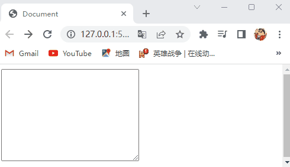

### 2.10.5标注标签

- 标注标签使用 `<label>` 标签进行定义。

- 标签语义：绑定一个表单控件，当点击 `<label>` 标签内的文本时，浏览器就会自动将焦点（光标）转到或者选择对应的表单控件上，用来增加用户体验。

- 语法：

  ```html
  <label></label>
  ```

- `<label>` 标签的属性，如下表所示：

  | 属性名 |   属性值   | 说明                                      |
  | :----: | :--------: | ----------------------------------------- |
  |  for   | 用户自定义 | 把 `<label>` 标签中的文本和表单控件相绑定 |

- `<label>` 标签的使用方法：

  - 方法1：
    1. 使用 `<label>` 标签把要和表单控件绑定的内容包裹起来，如：
    
       ```html
       <label>男</label>
       ```
    
    2. 给表单控件添加 `id` 属性，`id` 属性的属性值为用户自定义。
    
       ```html
       <input type="radio" id="man">
       ```
    
    3. 将 `<label>` 标签的 `for` 属性的属性值设置为表单控件的 `id` 属性的属性值。
    
       ```html
       <label for="man">男</label>
       ```
    
  - 方法2：
    1. 使用 `<label>` 标签把要和表单控件绑定的内容和表单控件一起包裹起来。
    2. 将 `<label>` 标签的 `for` 属性删除即可。

- 注意点：`<label>` 标签常用于单选框和复选框表单控件。

- 演示代码：

  ```html
  <!DOCTYPE html>
  <html lang="en">
    <head>
      <meta charset="UTF-8" />
      <title>Document</title>
    </head>
    <body>
      <h4>方法1</h4>
      <form action="">
        <label for="text">文本框</label>
        <input type="text" id="text"><br>
        <label for="man">男</label>
        <input type="radio" id="man" name="sex">
        <label for="woman">女</label>
        <input type="radio" id="woman" name="sex">
      </form>
      <h4>方法2</h4>
      <form action="">
        <label>
          文本框<input type="text"><br>
        </label>
        <label>
          男<input type="radio" name="sex">
        </label>
        <label>
          女<input type="radio" name="sex">
        </label>
      </form>
    </body>
  </html>
  ```

- 演示结果：

  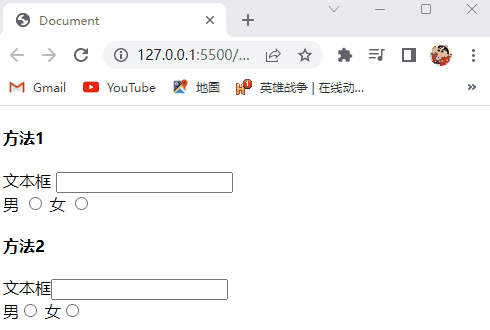

# 3.HTML5

## 3.1HTML5的新特性

- HTML5的新增特性主要是针对于以前的不足，增加了一些新的标签、新的表单和新的表单属性等，这些新特性都有兼容性问题，基本是IE9+以上版本的浏览器才支持，如果不考虑兼容性问题，可以大量使用这些新特性。

## 3.2HTML5新增的有语义的布局标签

- 新增的有语义的布局标签有： `<header>` 标签、`<nav>` 标签、`<footer>` 标签、`<aside>` 标签、`<section>` 标签、`<article>` 标签、`<figure>`标签、`<mark>`标签、`<progress>`标签、`<time>`标签。

- 有语义的布局标签各个标签的标签语义，如下表所示：

  |      标签      | 标签语义       |
  | :------------: | -------------- |
  | `header` 标签  | 表示网页头部   |
  |   `nav` 标签   | 表示网页导航   |
  | `article` 标签 | 表示网页文章   |
  | `section` 标签 | 表示网页区块   |
  |  `aside` 标签  | 表示网页侧边栏 |
  | `footer` 标签  | 表示网页底部   |

- 语法：

  ```html
  <!-- 表示网页头部 -->
  <header></header>
  <!-- 表示网页导航 -->
  <nav></nav>
  <!-- 表示网页文章 -->
  <article></article>
  <!-- 表示网页区块 -->
  <section></section>
  <!-- 表示网页侧边栏 -->
  <aside></aside>
  <!-- 表示网页底部 -->
  <footer></footer>
  ```

- 注意点：

  - 有语义化的布局标签是写在 `<body>` 标签里的。
  - 有语义的布局标签主要是针对搜索引擎。
  - 有语义的布局标签在页面中可以使用多次。
  - 在IE9中，需要把这些元素转换为块级元素。
  - 有语义的布局标签一般使用在移动端。
  - 有语义的布局标签独占一行。

- 演示代码：

  ```html
  <!DOCTYPE html>
  <html lang="en">
    <head>
      <meta charset="UTF-8" />
      <title>Document</title>
    </head>
    <body>
      <header>表示网页头部</header>
      <nav>表示网页导航</nav>
      <article>表示网页文章</article>
      <section>表示网页区块</section>
      <aside>表示网页侧边栏</aside>
      <footer>表示网页底部</footer>
    </body>
  </html>
  ```

- 演示结果：

  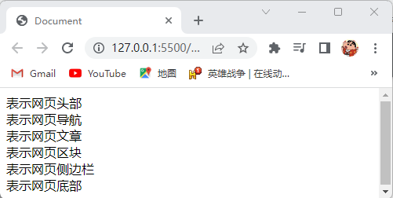

  

## 3.3HTML5新增的多媒体标签

### 3.3.1视频标签

- 视频标签使用 `<video>` 标签进行定义。

- 标签语义：给网页添加视频。

- 语法：

  ```html
  <video></video>
  ```

- 视频标签的属性，如下表所示：

  |  属性名  |                  属性值                   | 说明                                                         |
  | :------: | :---------------------------------------: | ------------------------------------------------------------ |
  |   src    |                   路径                    | 设置要添加的视频的路径                                       |
  | autoplay |                `autoplay`                 | 视频就绪自动播放，如果是谷歌浏览器还需要添加 `muted` 属性才能自动播放 |
  | controls |                `controls`                 | 向用户显示播放控件                                           |
  |  width   |                  像素值                   | 设置播放器的宽度为多少像素                                   |
  |  height  |                  像素值                   | 设置播放器的高度为多少像素                                   |
  |   loop   |                  `loop`                   | 设置视频播放完后继续播放该视频                               |
  | preload  | `auto`（预先加载）或 `none`（不预先加载） | 规定是否预加载视频，如果有 `autoplay` 属性则忽略 `preload` 属性 |
  |  poster  |                   路径                    | 设置视频加载等待时的画面图片的路径                           |
  |  muted   |                   muted                   | 设置视频静音播放                                             |

- 注意点：

  - 视频标签是写在 `<body>` 标签里的。
  - 视频标签的属性其他可以省略，但是 `src` 属性必须要有。
  - 视频标签目前支持三种格式：`MP4`、`Wav`、`Ogg`。

- 演示代码：

  ```html
  <!DOCTYPE html>
  <html lang="en">
    <head>
      <meta charset="UTF-8" />
      <title>Document</title>
    </head>
    <body>
      <video src="./file/mi.mp4" autoplay muted width="100%" loop></video>
    </body>
  </html>
  ```

- 演示结果：

  

### 3.3.2音频标签

- 音频标签使用 `<audio>` 标签进行定义。

- 标签语义：给网页添加音频。

- 语法：

  ```html
  <audio></audio>
  ```

- 音频标签的属性，如下表所示：

  |  属性名  |                  属性值                   | 说明                                                         |
  | :------: | :---------------------------------------: | ------------------------------------------------------------ |
  |   src    |                   路径                    | 设置要添加的音频的路径                                       |
  | autoplay |                `autoplay`                 | 音频就绪自动播放，谷歌浏览器把音频自动播放禁止了             |
  | controls |                `controls`                 | 向用户显示播放控件                                           |
  |   loop   |                  `loop`                   | 设置音频播放完后继续播放该音频                               |
  | preload  | `auto`（预先加载）或 `none`（不预先加载） | 规定是否预加载音频，如果有 `autoplay` 属性则忽略 `preload` 属性 |

- 注意点：

  - 音频标签是写在 `<body>` 标签里的。
  - 音频标签的属性其他可以省略，但是 `src` 属性必须要有。
  - 音频标签目前支持三种格式：`MP3`、`Wav`、`Ogg`。

- 演示代码：

  ```html
  <!DOCTYPE html>
  <html lang="en">
    <head>
      <meta charset="UTF-8" />
      <title>Document</title>
    </head>
    <body>
      <audio src="./file/music.mp3" autoplay loop controls></audio>
    </body>
  </html>
  ```

- 演示结果：

  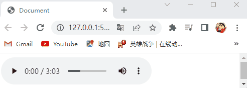

## 3.4HTML5新增的输入表单控件的类型

- 新增的输入表单控件的类型，如下表所示：

  | 属性名 | 属性值                                                       | 说明               |
  | :----: | ------------------------------------------------------------ | ------------------ |
  |  type  | `email`（定义为邮箱类型，限制用户输入必须为email类型）<br />`url`（定义为网站类型，限制用户输入必须为网站类型）<br />`date`（定义为日期的下拉列表控件，用于用户选择日期）<br />`time`（定义为时间的下拉列表控件，用于用户选择时间）<br />`month`（定义为月份的下拉列表控件，用于用户选择月份）<br />`week`（定义为星期的下拉列表控件，用于用户选择星期）<br />`number`（定义为数字类型，限制用户输入必须为数字类型）<br />`tel`（定义为手机号类型，限制用户输入必须为手机号）<br />`search`（定义为搜索框，用于搜索用户输入的信息）<br />`color`（定义为颜色的下拉控件，用于用户选择颜色）<br />`range`（定义为滑动条） | 指定不同的控件类型 |

- 演示代码：

  ```html
  <!DOCTYPE html>
  <html lang="en">
    <head>
      <meta charset="UTF-8" />
      <title>Document</title>
    </head>
    <body>
      <form action="">
        邮件文本框：<input type="email"><br>
        网址文本框：<input type="url"><br>
        日期下拉列表：<input type="date"><br>
        时间下拉列表：<input type="time"><br>
        月份下拉列表：<input type="month"><br>
        星期下拉列表：<input type="week"><br>
        数量文本框：<input type="number"><br>
        手机号文本框：<input type="tel"><br>
        搜索文本框：<input type="search"><br>
        颜色下拉列表：<input type="color"><br>
        滑动条：<input type="range">
      </form>
    </body>
  </html>
  ```

- 演示结果：

  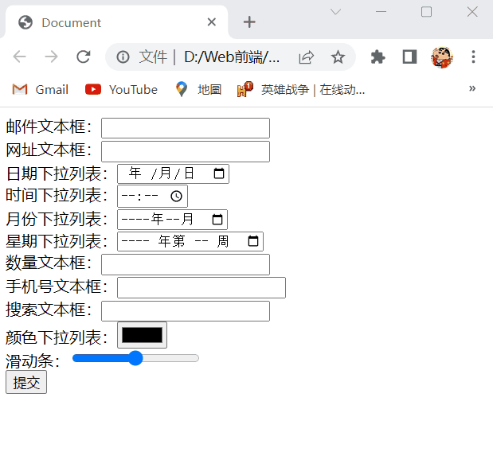


## 3.5HTML5新增的输入表单控件的属性

- 新增的输入表单控件的属性，如下表所示：

  |    属性名    | 属性值                                  | 说明                                                         |
  | :----------: | :-------------------------------------- | ------------------------------------------------------------ |
  | placeholder  | 用户自定义                              | 设置提示用户输入内容的文本                                   |
  |   required   | `required`                              | 规定此 `<input />` 标签中的内容不能为空                      |
  |  autofocus   | `autofocus`                             | 规定页面加载完毕后光标会自动聚焦到此 `<input />` 标签        |
  | autocomplete | `on`（显示，默认值）或 `off` （不显示） | 规定当用户在文本框中开始输入内容时，浏览器基于之前在文本框中输入的文本，是否应该显示用户之前在文本框中输入的文本 |
  |   multiple   | multiple                                | 设置可以上传多个文件                                         |

- 注意点：可以使用CSS选择器 `input::placeholder` 来修改提示用户输入内容的文本的样式。

- 演示代码：

  ```html
  <!DOCTYPE html>
  <html lang="en">
    <head>
      <meta charset="UTF-8" />
      <title>Document</title>
    </head>
    <body>
      <form action="">
        设置提示用户信息：<input type="text" placeholder="请输入用户名"><br>
        设置该标签内容不能为空：<input type="text" required><br>
        设置页面加载完毕时自动获取光标：<input type="text" autofocus><br>
        设置可以上传多个文件：<input type="file" multiple><br>
        <input type="submit" value="提交">
      </form>
    </body>
  </html>
  ```

- 演示结果：

  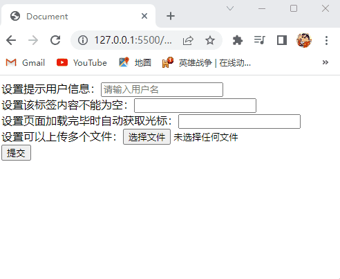

## 3.6HTML5新增的按钮标签

- HTML5新增的按钮标签为 `<button>` 标签。

- 标签语义：在HTML页面中显示用户点击的按钮。

- 语法：

  ```html
  <button></button>
  ```

- 按钮标签的属性，如下表所示：

  | 属性名 |                            属性值                            | 说明           |
  | :----: | :----------------------------------------------------------: | -------------- |
  |  type  | `submit`（提交按钮）或 `reset`（重置按钮）或 `button`（无功能按钮） | 定义按钮的类型 |

- 注意点：

  - 按钮标签是写在 `<body>` 标签里面的。
  - 谷歌浏览器中按钮标签默认是提交按钮。
  - 按钮标签和表单控件设置的按钮控件的区别是按钮标签是双标签，更便于包裹其他内容：文字、图片等。
  - 要实现按钮标签的 `type` 属性中的 `submit` 和 `reset` 属性值的功能，需要配合 `<form>` 标签使用，也就是要用 `<form>` 标签把按钮标签包裹起来。
  - 要实现按钮标签的 `type` 属性中的 `button` 属性值的功能因为是由JavaScript添加功能的所以不需要配合 `<form>` 标签使用。
  - 按钮标签默认具有边框。

- 演示代码：

  ```html
  <!DOCTYPE html>
  <html lang="en">
    <head>
      <meta charset="UTF-8" />
      <title>Document</title>
    </head>
    <body>
      <form action="">
        <!-- 要实现按钮标签的type属性中的submit和reset属性值的功能，需要配合<form>标签使用，也就是要用<form>标签把按钮标签包裹起来 -->
        <button type="submit">提交按钮</button>
        <button type="reset">重置按钮</button>
      </form>
      <button type="button">无功能按钮</button>
    </body>
  </html>
  ```

- 演示结果：

  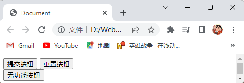

# 4.查阅手册

- 经常查阅手册是一个很好的学习习惯。
- 推荐的HTML手册网址：
  1. W3C：http://www.w3school.com.cn。
  2. MDN：https://developer.mozilla.org/zh-CN/。
  3. 菜鸟教程：https://www.runoob.com/。