# 1.CSS简介

## 1.1HTML的局限性

- HTML只关注内容的语义，如：`<p>` 标签表示一个段落，虽然HTML可以做些简单的样式，但是带来的是无尽的臃肿和繁琐，所以HTML主要做结构，显示元素内容。

## 1.2什么是CSS

- CSS是层叠样式表（Cascading style sheets）的简称，也称之为CSS样式表或级联样式表。
- CSS是一种标记语言。
- CSS主要用于设置HTML页面中的文本样式（字体、大小、颜色、对齐方式……）、图片样式（宽高、边框样式、边距……）以及版面的布局和外观显示样式，让我们的网页更加丰富多彩，布局更加灵活自如，简单理解就是CSS可以美化HTML，让HTML更漂亮，同时让页面布局更简单。
- CSS最大的价值是由HTML专注去做结构呈现，样式交给CSS，即：结构与样式分离。

## 1.3CSS的语法规范

### 1.3.1CSS的组成

- CSS由两个主要的部分构成：选择器以及一条或多条声明。

- CSS的组成如下图所示：

  

- 上图的整个结构称为规则集（通常简称为规则），上图中各个部分的释义如下：
  - Selector（选择器）：HTML元素的名称位于规则集开始，它选择了一个或多个需要添加样式的元素（在上图中就是选择了 `<p>` 标签），要给不同元素添加样式只需要更改选择器就行了。
  - Declaration（声明）：如 `color: red;` 用来指定添加样式元素的属性。
  - Properties（属性）：改变HTML元素样式的途径（上图中 `color` 就是 `<p>` 标签的属性），在CSS中由编写人员决定修改哪个属性以改变规则。
  - Property value（属性的值）：在属性的右边，冒号后面即属性的值，它从指定属性的众多外观中选择一个值（我们除了 `red` 之外还有很多属性值可以用于 `color` 属性）。
- 注意点：属性必须要有属性值。

### 1.3.2CSS的语法规范

- 每个规则集除了选择器的部分都应该包含在成对的大括号里，如：

  ```css
  /* 错误示范 */
  p {
      
  }color: red;
  /* 正确示范 */
  p {
      color: red;
  }
  ```

- 在每个声明里要用冒号将属性与属性值分隔开，如：

  ```css
  /* 错误示范 */
  p {
      color red;
  }
  /* 正确示范 */
  p {
      color: red;
  }
  ```

- 在每个规则集里要用分号将各个声明分隔开，如：

  ```css
  /* 错误示范 */
  p {
      color: red
      color: green
  }
  /* 正确示范 */
  p {
      color: red;
      color: green;
  }
  ```

- 规则集建议使用展开格式书写，如：

  ```css
  /* 紧凑格式 */
  p { color: red;color: greed; }
  /* 展开格式 */
  p {
      color: red;
      color: green;
  }
  ```

- 在每个规则集里属性和属性值和选择器全部使用小写字母，特殊情况除外，如：

  ```css
  /* 错误示范 */
  P {
      COLOR: RED;
  }
  /* 正确示范 */
  p {
      color: red;
  }
  ```

- 选择器和大括号中间要有一个空格，如：

  ```css
  /* 错误示范 */
  p{
      color: red;
  }
  /* 正确示范 */
  p {
      color: red;
  }
  ```

- 在每个规则集里属性值前面，冒号后面，要有一个空格，如：

  ```css
  /* 错误示范 */
  p{
      color:red;
  }
  /* 正确示范 */
  p {
      color: red;
  }
  ```


# 2.CSS基础选择器

## 2.1CSS选择器的作用

- 选择器（选择符）就是根据不同的需求把不同的标签选出来，这就是选择器的作用，简单理解就是选择标签用的。

- 示例：

  ```css
  h1 {
  	color: red;
  	font-size: 25px;
  }
  ```

- 示例中CSS做了两件事：

  - 找到所有的 `<h1>` 标签。
  - 将找到的标签的样式设置为，颜色为红色、字体大小为25像素。

## 2.2选择器的分类

- 选择器分为基础选择器和复合选择器两个大类：

  - 基础选择器：是由单个选择器组成的。
  - 基础选择器有：
    - 标签选择器。
    - 类选择器。
    - id选择器。
    - 通配符选择器。

  - 复合选择器：是由两个或多个基础选择器，通过不同的方式组合而成的。
  - 复合选择器有：
    - 后代选择器。
    - 子选择器。
    - 并集选择器。
    - 伪类选择器。
    - ···

## 2.3标签选择器

- 标签选择器（也称元素选择器）是指用HTML标签名称作为选择器。

- 标签选择器的作用：可以把页面中某一类标签全部选择出来，如：所有的 `<div>` 标签或所有的 `<p>` 标签，并为其设置统一的样式。

- 语法：

  ```css
  标签名 {
      声明
  	···
  }
  ```

- 标签的选择器的优缺点：

  - 优点：能快速为页面中同类型的标签统一设置样式。
  - 缺点：不能设计差异化样式，只能选择全部的当前标签。

- 注意点：

  - 标签选择器选择的是一类标签，而不是单独某一个。
  - 标签选择器无论嵌套关系有多深，都能找到对应的标签。

- 演示代码：

  ```html
  <!DOCTYPE html>
  <html lang="en">
    <head>
      <meta charset="UTF-8" />
      <title>Document</title>
      <style>
        p {
          color: green;
        }
        span {
          color: pink;
        }
      </style>
    </head>
    <body>
      <p>男生</p>
      <p>男生</p>
      <p>男生</p>
      <!-- 标签选择器无论嵌套关系有多深，都能找到对应的标签 -->
      <div>
        <span>女生</span>
        <span>女生</span>
        <span>女生</span>
      </div>
    </body>
  </html>
  ```

- 演示结果：

  

## 2.4类选择器

- 类选择器可以单独选择一个或者多个标签。

- 类选择器的作用：是通过类名，找到页面中所有带有这个类名的标签，为其设置样式。

- 语法：

  ```css
  .类名 {
  	声明
  	···
  }
  ```

- 类选择器的使用步骤：

  1. 先设置类名和要设置的样式，如：

     ```css
     .red {
         color: red;
     }
     ```

  2. 找到需要设置样式的标签给其添加 `class` 属性，并将其属性值设置为上一步所设置的类名，如：

     ```html
     <p class="red">红色</p>
     ```

- 注意点：

  - 类选择器在CSS中使用 `.` 进行标识，并且后面紧跟类名，类名由自己命名。
  - 所有的标签都有 `class` 属性。
  - 给标签设置 `class` 属性可以理解为给标签起了一个别名来表示这个标签，其标签的别名为 `class` 属性的属性值，当标签的别名和类选择器设置的类名一样时，那么该类选择器选中了这个标签。
  - 类名可以重复使用并且一个类选择器可以同时选中多个标签。
  - 类名可以由数字、字母、下划线、中划线组成，但不能以数字或者中划线开头。
  - 类名如果为长名称或词组可以使用 `_` 来隔开。
  - 不能使用已有的关键字作为类名。
  - 类名不要使用纯数字、中文等命名，尽量使用英文字母来表示。
  - 类名的命名要有意义，尽量使别人一眼就知道这个类名的目的（可读性第一，长度第二，推荐使用英语，如果是使用拼音请使用全拼）。

- 演示代码：

  ```html
  <!DOCTYPE html>
  <html lang="en">
    <head>
      <meta charset="UTF-8" />
      <title>Document</title>
      <style>
        .red {
          color: red;
        }
        /* 类名可以重复使用 */
        .red {
          font-size: 20px;
        }
      </style>
    </head>
    <body>
      <ul>
        <!-- 一个类选择器可以同时选中多个标签 -->
        <li class="red">水果</li>
        <li class="red">香蕉</li>
        <li>桃子</li>
        <li>甘蔗</li>
        <li>山竹</li>
      </ul>
    </body>
  </html>
  ```

- 演示结果：

  

## 2.5类选择器之多类名

- 多类名就是标签的 `class` 属性的属性值中有多个类选择器设置的类名。

- 多类名的作用：可以使标签分别具有这些类名所设置的样式。

- 多类名的使用方法：在标签的 `class` 属性的属性值中书写多个类选择器设置的类名，如：

  ```html
  <p class="red font20">内容</p>
  ```

- 多类名在开发中使用的场景：当一些标签需要使用相同的样式时，可以把这些样式放到一个类里，然后这些标签就可以使用这个公共样式的类，然后在调用自己独有的类，这样的好处就是节省了CSS代码，统一修改也非常方便。

- 注意点：在标签的 `class` 属性的属性值中书写多个类选择器设置的类名时，各个类名中间要用空格隔开。

- 演示代码：

  ```html
  <!DOCTYPE html>
  <html lang="en">
  <head>
      <meta charset="UTF-8">
      <title>Document</title>
      <style>
          .box {
              width: 100px;
              height: 100px;
          }
          .red {
              background-color: red;
          }
          .green {
              background-color: green;
          }
      </style>
  </head>
  <body>
      <!-- 可以使标签分别具有这些类名所设置的样式 -->
      <div class="red box"></div>
      <div class="green box"></div>
      <div class="red box"></div>
  </body>
  </html>
  ```

- 演示结果：

  

## 2.6id选择器

- id选择器只能选中一个标签。

- id选择器的作用：是通过id名，找到页面中唯一一个带有这个id名的标签，为其设置样式。

- 语法：

  ```css
  #id名 {
  	声明
  	···
  }
  ```

- id选择器的使用步骤：

  1. 先设置id名和要设置的样式，如：

     ```css
     #red {
         color: red;
     }
     ```

  2. 找到需要设置样式的标签给其添加 `id` 属性，并将其属性值设置为上一步所设置的id名，如：

     ```html
     <p id="red">红色</p>
     ```

- 注意点：

  - id选择器在CSS中使用 `#` 进行标识，并且后面紧跟id名，id名由自己命名。
  - 所有的标签都有 `id` 属性。
  - 一个标签上只能有一个 `id` 属性。
  - 给标签设置 `id` 属性可以理解为给标签设置了一个身份证号码来表示这个标签，其标签的身份证号码为 `id` 属性的属性值，当标签的身份证号码和id选择器设置的id名一样时，那么该id选择器选中了这个标签。
  - id名不可以重复使用，一个标签只能有一个专属的id名就像一个人只能拥有一个专属的身份证号。
  - id名可以由数字、字母、下划线、中划线组成，但不能以数字或者中划线开头。
  - id名如果为长名称或词组可以使用 `-` 来隔开。
  - 不能使用已有的关键字作为id名。
  - id名不要使用纯数字、中文等命名，尽量使用英文字母来表示。
  - id名的命名要有意义，尽量使别人一眼就知道这个id名的目的（可读性第一，长度第二，推荐使用英语，如果是使用拼音请使用全拼）。

- 演示代码：

  ```html
  <!DOCTYPE html>
  <html lang="en">
    <head>
      <meta charset="UTF-8" />
      <title>Document</title>
      <style>
        #red {
          color: red;
        }
        /* id名不可以重复使用 */
        #red {
          font: 20px;
        }
      </style>
    </head>
    <body>
      <!-- id选择器只能选中一个标签 -->
      <p id="red">红色</p>
    </body>
  </html>
  ```

- 演示结果：

  

## 2.7通配符选择器

- 通配符选择器选择所有的标签。

- 通配符选择器的作用：选择页面中所有的标签包括 `<html>` 标签、`<body>` 标签等，为其设置样式。

- 语法：

  ```css
  * {
      声明
      ···
  }
  ```

- 注意点：

  - 通配符选择器是在特殊的情况下才使用，因为他会选择页面中所有的标签并为其设置样式。
  - 通配符选择器在CSS中使用 `*` 进行标识。

- 演示代码：

  ```html
  <!DOCTYPE html>
  <html lang="en">
    <head>
      <meta charset="UTF-8" />
      <title>Document</title>
      <style>
        * {
          color: red;
        }
      </style>
    </head>
    <body>
      <p>红色</p>
      <div>红色</div>
      <ul>
        <li>红色</li>
      </ul>
    </body>
  </html>
  ```

- 演示结果：

  

# 3.CSS的字体属性

## 3.1CSS字体属性的作用

- CSS字体属性用于定义字体系列、字体大小、字体粗细、和字体样式（如：斜体）。

## 3.2字体系列属性

- CSS使用 `font-family` 属性来定义页面中文本的字体系列。

- 语法：

  ```css
  选择器 {
      font-family: 字体1,字体2,字体3,···,字体系列;
  }
  ```

- 字体系列属性的属性值取值为：

  - 字体：Microsoft YaHei（微软雅黑）、黑体、宋体、楷体等。

  - 字体系列：sans-serif（无衬线字体系列）、serif（衬线字体系列）、monospace（等宽字体系列）等。

    > 铺垫知识：
    >
    > - 电脑上所有的字体分为三类分别为：
    >
    >   - 无衬线字体系列：
    >
    >     - 特点：文字壁画粗细均匀，并且首尾无装饰，如：
    >
    >       
    >
    >     - 使用场景：网页中大多采用无衬线字体系列。
    >
    >     - 常见的该系列的字体：Microsoft YaHei、黑体、Arial等。
    >
    >   - 衬线字体系列：
    >
    >     - 特点：文字笔画粗细不均，并且首尾有笔锋装饰，如：
    >
    >       
    >
    >     - 使用场景：报刊书籍大多采用呈现字体系列。
    >
    >     - 常见的该系列的字体：宋体、Times New Roman。
    >
    >   - 等宽字体系列：
    >
    >     - 特点：每个字母或文字的宽度相等，如：
    >
    >       
    >
    >     - 使用场景：一般用于程序代码编写，有利于代码的阅读和编写。
    >
    >     - 常见的该系列的字体：Consolas、fira code。

- 字体系列属性的渲染规则为：先将页面中的文本的字体设置为字体1，如果用户电脑中没有这个字体，那么就将页面中的文本的字体设置为字体2，以此类推一直到字体系列，此时会将页面中的文本的字体设置为用户电脑中拥有的属于该字体系列的字体。

- 注意点：

  - 各种字体之间必须使用英文状态下的逗号隔开。
  - 如果有空格隔开的多个单词组成的字体，需要加引号（单引号双引号都可以），如：`'Microsoft YaHei'` 或 `"Microsoft YaHei"`。
  - 一般是给 `<body>` 标签设置 `font-family` 属性，因为页面的主要内容都是放到 `<body>` 标签里。
  - 尽量使用系统默认自带字体，保证在任何用户的浏览器中都能正确显示。

- 演示代码：

  ```html
  <!DOCTYPE html>
  <html lang="en">
    <head>
      <meta charset="UTF-8" />
      <title>Document</title>
      <style>
        body {
          font-family: 宋体;
        }
        .yahei {
          font-family: "Microsoft YaHei";
        }
      </style>
    </head>
    <body>
      <h4>宋体</h4>
      <h4 class="yahei">微软雅黑</h4>
    </body>
  </html>
  ```

- 演示结果：

  

## 3.3字体大小属性

- CSS使用 `font-size` 属性来定义页面中文本的字体大小。

- 语法：

  ```css
  选择器 {
      font-size: 属性值;
  }
  ```

- 字体大小属性的属性值取值为：像素值（设置字体大小为多少像素）。

- 注意点：

  - 谷歌浏览器默认的文字大小为16px。
  - 不同浏览器可能默认显示的字号大小不一致，我们尽量给一个明确值大小，不要默认大小。
  - 可以给 `<body>` 标签设置 `font-size` 属性来指定整个页面文字的大小。
  - 标题标签比较特殊，在给 `<body>` 标签设置 `font-size` 属性来指定整个页面文字的大小时，标题标签中的文字不会受其影响，所以标题标签需要单独指定文字大小。

- 演示代码：

  ```html
  <!DOCTYPE html>
  <html lang="en">
    <head>
      <meta charset="UTF-8" />
      <title>Document</title>
      <style>
        /* 可以给<body>标签设置font-size属性来指定整个页面文字的大小 */
        body {
          font-size: 20px;
        }
        /* 标题标签需要单独指定文字大小 */
        h3 {
          font-size: 60px;
        }
      </style>
    </head>
    <body>
      <p>一二三一二三一二三</p>
      <div>一二三一二三一二三</div>
      <!-- 标题标签比较特殊，在给<body>标签设置font-size属性来指定整个页面文字的大小时，标题标签中的文字不会受其影响 -->
      <h1>标题标签</h1>
      <h3>标题标签</h3>
    </body>
  </html>
  ```

- 演示结果：

  

## 3.4字体粗细属性

- CSS使用 `font-weight` 属性来定义页面中文本的字体粗细。

- 语法：

  ```css
  选择器 {
      font-weight: 属性值;
  }
  ```

- 字体大小属性的属性值取值为：

  - `normal`（默认值，不加粗）。
  - `bold`（加粗）。
  - `100~900`（400等同于`normal`，而700等同于`bold`，其它值一般不使用，注意这个数字后面不跟单位）。

- 注意点：

  - 不是所有字体都提供了九种粗细，因此部分取值页面中无变化。
  - 实际开发时，我们更喜欢用数字表示粗细。

- 演示代码：

  ```html
  <!DOCTYPE html>
  <html lang="en">
    <head>
      <meta charset="UTF-8" />
      <title>Document</title>
      <style>
        h1 {
          font-weight: normal;
        }
        p {
          font-weight: 700;
        }
      </style>
    </head>
    <body>
      <h1>不加粗的标题</h1>
      <p>加粗的段落</p>
    </body>
  </html>
  ```

- 演示结果：

  

## 3.5字体样式属性

- CSS使用 `font-style` 属性来定义页面中文本的字体样式。

- 语法：

  ```css
  选择器 {
      font-style: 属性值;
  }
  ```

- 字体样式属性的属性值取值为：

  - `normal`（默认值，不倾斜）。
  - `italic`（倾斜）。

- 注意点：平时我们很少给文字加斜体，反而要给斜体标签（如：`<em>` 和 `<i>` 标签）改为不倾斜字体。

- 演示代码：

  ```html
  <!DOCTYPE html>
  <html lang="en">
    <head>
      <meta charset="UTF-8" />
      <title>Document</title>
      <style>
        p {
          font-style: italic;
        }
        em {
          font-style: normal;
        }
      </style>
    </head>
    <body>
      <p>使不倾斜的文本倾斜</p>
      <em>使倾斜的文本不倾斜</em>
    </body>
  </html>
  ```

- 演示结果：

  

## 3.6字体的复合属性

- 字体复合属性可以把上面的CSS字体属性综合来写，这样可以更节约代码。

- 语法：

  ```css
  选择器 {
      font: 字体样式属性的属性值 字体粗细属性的属性值 字体大小属性的属性值/行间距属性的属性值 字体系列属性的属性值;
  }
  ```

- 字体复合属性的属性值取值为：各个属性的属性值。

- 注意点：

  - 使用字体的复合属性时，必须按上面语法格式中的顺序书写，不能更换顺序，并且各个属性值之间以空格隔开。
  - 字体大小属性的属性值和字体系列属性的属性值必须要有，其他属性的属性值可以省略（取它们的默认值）。

- 演示代码：

  ```html
  <!DOCTYPE html>
  <html lang="en">
    <head>
      <meta charset="UTF-8" />
      <title>Document</title>
      <style>
        p {
          font: normal 700 28px '宋体';
        }
        div {
          font: 20px '微软雅黑';
        }
      </style>
    </head>
    <body>
      <p>使用字体复合属性</p>
      <div>使用字体复合属性</div>
    </body>
  </html>
  ```

- 演示结果：

  

# 4.CSS的文本属性

## 4.1CSS文本属性的作用

- CSS文本属性可定义文本的外观，比如：文本颜色、文本对齐、文本装饰、文本缩进、行间距等。

## 4.2文本颜色属性

- CSS使用 `color` 属性来定义页面中文本的颜色。

- 语法：

  ```css
  选择器 {
      color: 属性值;
  }
  ```

- 文本颜色属性的属性值取值为：

  - 预定义的颜色值：`red`、`green`、`blue`、`black`、`white`、`gray` 等。

    > 注：预定义的颜色值为网页预设的颜色值，如：`red` 表示红色。

  - 十六进制颜色表示法：`#FF0000`、`#FF6600` 等。

    > 注：十六进制颜色表示法以 `#` 开头后面跟着6个十六进制数，每两位为一组来表示 `0~255`。

  - RGB颜色表示法：`rgb(255,0,0)`、`rgb(100%,0,0)` 等。

    > 注：RGB颜色表示法的格式为 `rgb(红,绿,蓝)` 其中红绿蓝的值为 `0~255`。

  - RGBA颜色表示法：`rgba(255,0,0,0)`、`rgba(100%,0,0,0)` 等。

    > 注：RGBA颜色表示法的格式为 `rgbA(红,绿,蓝,透明度)` 其中红绿蓝的值为 `0~255`，透明度的值为 `0~1`。

- 注意点：

  - 十六进制的 `#` 号后面如果有两两相同的并紧挨一起的数字或字母则可以缩写，如：`#FF00ZZ` 可以缩写为 `#F0Z`。
  - RGBA颜色表示法中的透明度的值如果为 `0.3` 可以简写为 `.3`。
  - RGB和RGBA的区别是RGBA比RGB多了个透明值。

- 演示代码：

  ```html
  <!DOCTYPE html>
  <html lang="en">
    <head>
      <meta charset="UTF-8" />
      <title>Document</title>
      <style>
        .pink {
          color: pink;
        }
        .red {
          color: #F00;
        }
        .green {
          color: rgb(0, 255, 0);
        }
        .blue {
          color: rgba(0, 0, 255, .5);
        }
      </style>
    </head>
    <body>
      <p class="pink">粉色</p>
      <p class="red">红色</p>
      <p class="green">绿色</p>
      <p class="blue">蓝色</p>
    </body>
  </html>
  ```

- 演示结果：

  

## 4.3对齐文本属性

- CSS使用 `text-align` 属性来设置标签内文本内容的水平对齐方式。

- 语法：

  ```css
  选择器 {
      text-align: 属性值;
  }
  ```

- 对齐文本属性的属性值取值为：

  - `left`（默认值，左对齐）。
  - `center`（居中对齐）。
  - `right`（右对齐）。

- 演示代码：

  ```html
  <!DOCTYPE html>
  <html lang="en">
    <head>
      <meta charset="UTF-8" />
      <title>Document</title>
      <style>
        .center {
          text-align: center;
        }
        .right {
          text-align: right;
        }
      </style>
    </head>
    <body>
      <p class="center">文本</p>
      <p class="right">文本</p>
    </body>
  </html>
  ```

- 演示结果：

  

## 4.4装饰文本属性

- CSS使用 `text-decoration` 属性来给页面中的文本添加下划线、删除线、上划线等。

- 语法：

  ```css
  选择器 {
      text-decoration: 属性值;
  }
  ```

- 装饰文本属性的属性值取值为：

  - `none`（默认值，没有装饰线）。
  - `underline`（下划线）。
  - `overline`（上划线）。
  - `line-through`（删除线）。

- 演示代码：

  ```html
  <!DOCTYPE html>
  <html lang="en">
    <head>
      <meta charset="UTF-8" />
      <title>Document</title>
      <style>
        .one {
          text-decoration: underline;
        }
        .two {
          text-decoration: overline;
        }
        .three {
          text-decoration: line-through;
        }
      </style>
    </head>
    <body>
      <p class="one">文本</p>
      <p class="two">文本</p>
      <p class="three">文本</p>
    </body>
  </html>
  ```

- 演示结果：

  

## 4.5文本缩进属性

- CSS使用 `text-indent` 属性来设置文本段落的首行缩进。

- 语法：

  ```css
  选择器 {
      text-indent: 属性值;
  }
  ```

- 文本缩进属性的属性值取值为：

  - `数字em`。

    > 注：em是一个相对单位，如：文本缩进属性的属性值设置为2em，则表示缩进当前标签的 `font-size` 属性的属性值的2倍。

  - 像素值（设置首行缩进多少像素）。

- 注意点：文本缩进属性的属性值可以为负值。

- 演示代码：

  ```html
  <!DOCTYPE html>
  <html lang="en">
    <head>
      <meta charset="UTF-8" />
      <title>Document</title>
      <style>
        .one {
          text-indent: 2em;
        }
        /* 文本缩进属性的属性值可以为负值 */
        .two {
          text-indent: -20px;
        }
      </style>
    </head>
    <body>
      <p class="one">这是一个段落这是一个段落这是一个段落这是一个段落这是一个段落这是一个段落这是一个段落这是一个段落这是一个段落这是一个段落这是一个段落这是一个段落这是一个段落这是一个段落这是一个段落</p>
      <p class="two">这是一个段落这是一个段落这是一个段落这是一个段落这是一个段落这是一个段落这是一个段落这是一个段落这是一个段落这是一个段落这是一个段落这是一个段落这是一个段落这是一个段落这是一个段落</p>
    </body>
  </html>
  ```

- 演示结果：

  

## 4.6行间距属性

- 行间距也称行高。

- 行间距的组成，如下图所示：

  

- CSS使用 `line-height` 属性来设置文字行与行之间的距离。

- 语法：

  ```css
  选择器 {
      line-height: 属性值;
  }
  ```

- 行间距属性的属性值取值为：

  - 像素值（设置行间距为多少像素）。
  - 数字（设置行间距为当前标签的 `font-size` 属性的属性值的倍数）。

- 注意点：

  - 行间距 = 上间距 + 文本高度 + 下间距。
  - 上下间距 =（行间距 - 文本高度）/ 2。

  - 文本高度 = 当前标签的 `font-size` 属性的属性值。

  - 行间距测量技巧：上一行文字的底部与本行文字的底部之间的距离就是行间距。

- 演示代码：

  ```html
  <!DOCTYPE html>
  <html lang="en">
    <head>
      <meta charset="UTF-8" />
      <title>Document</title>
      <style>
        p {
          line-height: 36px;
        }
      </style>
    </head>
    <body>
      <p>这是一个段落这是一个段落这是一个段落这是一个段落这是一个段落这是一个段落这是一个段落这是一个段落这是一个段落这是一个段落这是一个段落这是一个段落这是一个段落这是一个段落这是一个段落</p>
    </body>
  </html>
  ```

- 演示结果：

  

# 5.CSS引入方式

## 5.1CSS的三种样式表

- 按照CSS样式书写的位置（或者引入的方式），CSS样式表可以分为三大类：
  - 行内样式表（行内式）。
  - 内部样式表（嵌入式）。
  - 外部样式表（外链式）。

## 5.2行内样式表

- 行内样式表（内联样式表）是写在标签的 `style` 属性的属性值中设定CSS样式，适合于修改简单样式。

- 语法：

  ```html
  <div style="color: red; font-size: 12px;">
      青春不常在，抓紧谈恋爱
  </div>
  ```

- 注意点：

  - 在标签的 `style` 属性的属性值中书写CSS属性时，写法要符合CSS规范。
  - 在标签的 `style` 属性的属性值中书写多个CSS属性时，多个CSS属性之间使用空格进行分隔。
  - 行内样式表因为是写在标签的 `style` 属性的属性值中，所以只能控制当前的标签设置样式，所以不需要使用选择器。
  - 行内样式表由于书写繁琐，并且没有体现出结构与样式相分离的思想，所以不推荐大量使用，只有对当前元素添加简单样式的时候，可以考虑使用。
  - 使用行内样式表设定CSS，通常也被称为行内式引入。

- 演示代码：

  ```html
  <!DOCTYPE html>
  <html lang="en">
    <head>
      <meta charset="UTF-8" />
      <title>Document</title>
    </head>
    <body>
      <p>这是一个段落</p>
      <p style="color: red; font-size: 26px;">这是一个段落</p>
      <p>这是一个段落</p>
    </body>
  </html>
  ```

- 演示结果：

  

## 5.3内部样式表

- 内部样式表（嵌入样式表）是写到HTML页面内部，是将所有的CSS代码抽取出来，单独放到一个 `<style>` 标签中。

- 语法：

  ```html
  <style>
      选择器 {
          声明
          ···
      }
  </style>
  ```

- `<style>` 标签的属性，如下表所示：

  | 属性名 |  属性值  | 说明                           |
  | :----: | :------: | ------------------------------ |
  |  type  | text/css | 定义该标签的MIME类型为text/css |

- 注意点：

  - `<style>` 标签理论上可以放在HTML文档的任何地方，但一般会放到文档的 `<head>` 标签里。
  - 目前的浏览器已经支持省略 `<style>` 标签的 `type` 属性。
  - 内部样式表，可以方便控制当前整个页面中的元素样式设置。
  - 内部样式表使代码结构清晰，但是并没有实现结构与样式完全分离。
  - 使用内部样式表设定CSS，通常也被称为嵌入式引入，这种方式是我们练习时常用的方式。

- 演示代码：

  ```html
  <!DOCTYPE html>
  <html lang="en">
    <head>
      <meta charset="UTF-8" />
      <title>Document</title>
      <style>
        p {
          color: red;
          font-size: 20px;
        }
      </style>
    </head>
    <body>
      <p>这是一个段落</p>
      <p>这是一个段落</p>
      <p>这是一个段落</p>
    </body>
  </html>
  ```

- 演示结果：

  

## 5.4外部样式表

- 外部样式表是将所有的CSS代码抽取出来，单独放到一个后缀名为 `.css` 的文件中，之后再把该CSS文件通过 `<link />` 标签引入到HTML页面中使用。

- 语法：

  ```html
  <link />
  ```

- `<link />` 标签的属性，如下表所示：

  | 属性名 |   属性值   | 说明                                                         |
  | :----: | :--------: | ------------------------------------------------------------ |
  |  rel   | stylesheet | 定义当前文档与被链接文档之间的关系，该属性值表示被链接的文档是一个样式表文件 |
  |  href  |    路径    | 设置被链接的文档的路径                                       |
  |  type  |  text/css  | 定义被链接文档的MIME类型为text/css                           |

- 外部样式表的使用步骤：

  1. 新建一个后缀名为 `.css` 的样式文件，把所有的CSS代码都放入此文件中。
  2. 在HTML页面中，使用 `<link />` 标签引入这个样式文件。

- 注意点：

  - `<link />` 标签的 `rel` 属性和 `href` 属性不能省略，但是 `type` 属性可以省略。
  - `<link />` 标签理论上可以放在HTML文档的任何地方，但一般会放到文档的 `<head>` 标签里。
  - 使用外部样式表设定CSS，通常也被称为外链式或链接式引入，这种方式是开发中常用的方式。

- 演示代码之CSS文件：

  ```css
  p {
      color: red;
      font-size: 30px;
  }
  ```

- 演示代码之HTML文件：

  ```html
  <!DOCTYPE html>
  <html lang="en">
    <head>
      <meta charset="UTF-8" />
      <title>Document</title>
      <!-- 使用<link />标签引入外部样式表 -->
      <link rel="stylesheet" href="./css/18-外部样式表.css">
    </head>
    <body>
      <p>这是一个段落</p>
      <p>这是一个段落</p>
      <p>这是一个段落</p>
    </body>
  </html>
  ```

- 演示结果：

  

# 6.Chrome调试工具

## 6.1打开Chrome调试工具

- 打开Chrome（谷歌）浏览器，按下F12键或者右击页面空白处会弹出快捷菜单，再单击快捷菜单中的检查。

- 演示：

  

## 6.2使用调试工具

- 快捷键 `Ctrl+滚轮` 可以放大开发者工具代码大小。

- 演示：

  

- Chrome调试工具左边是HTML元素结构，右边是CSS样式。

- 演示：

  

- Chrome调试工具最左上角的选项可以用来选中页面中的元素。

- 演示：

  

- Chrome调试工具右边的CSS样式可以改动数值（上下箭头或者直接输入)和查看颜色。

- 注意点：在Chrome调试工具右边的CSS样式中改动数值，并不会修改网页的源代码。

- 演示：

  

- 快捷键 `Ctrl+0` 复原浏览器大小

- 演示：

  

- 如果点击元素，发现右侧没有样式引入，极有可能是类名或者样式引入错误。

- 演示：

  

- 如果有样式，但是样式前面有黄色叹号提示，则是样式属性书写错误。

- 演示：

  

# 7.Emmet语法

## 7.1Emmet语法的作用

- Emmet语法的前身是Zen coding，它使用缩写，来提高HTML/CSS的编写速度，VSCode编辑器内部已经集成该语法。

## 7.2快速生成HTML结构语法

- 快速生成标签的语法是 `标签名` 后按 `Tab键`。

- 演示：

  

- 快速生成多个相同标签的语法是 `标签名*数字` 后按 `Tab键`。

- 演示：

  

- 快速生成父子级关系标签的语法是 `父级标签名>子级标签名` 后按 `Tab键`。

- 演示：

  

- 快速生成兄弟关系标签的语法是 `标签名+标签名` 后按 `Tab键`。

- 演示：

  

- 快速生成带有类名的标签的语法是 `标签名.类名` 后按 `Tab键`。

- 演示：

  

- 快速生成带有id名的标签的语法是 `标签名#id名` 后按 `Tab键`。

- 演示：

  

- 想要在生成的标签内部写内容的语法是 `标签名{要写的内容}` 后按 `Tab键`。

- 演示：

  

- 想要有自增的数字时可以使用自增符号 `$`。

- 演示：

  

## 7.3快速生成CSS样式语法

- 快速生成CSS属性的语法是 `CSS属性的首字母该属性的属性值` 后按 `Tab键`。

- 注意点：如果是由两个单词组成并且使用 `-` 将两个单词进行分隔的CSS属性，这时快速生成该CSS属性的语法是 `CSS属性的两个单词首字母该属性的属性值` 后按 `Tab键`。

- 演示：

  

## 7.4快速格式化代码

- VSCode编辑器使用快捷键 `Shift+Alt+F` 来快速格式化代码。

- 我们可以设置在保存HTML页面的时候自动格式化代码，步骤为：

  1. 打开VSCode编辑器。
  2. 单击文件菜单下的首选项快捷菜单中的设置。
  3. 在搜索设置文本框中输入 `Editor: Format On Save` 后，敲击回车。
  4. 勾选 `Editor: Format On Save` 选项。

- 演示：

  

# 8.CSS复合选择器

## 8.1什么是CSS复合选择器

- 在CSS中，可以根据选择器的类型把选择器分为基础选择器和复合选择器，复合选择器是建立在基础选择器之上，对基础选择器进行组合形成的。
- 复合选择器可以更准确、更高效的选择目标元素（标签）。
- 复合选择器是由两个或多个基础选择器，通过不同的方式组合而成的。
- 常用的复合选择器包括：后代选择器、子选择器、并集选择器、伪类选择器等。

## 8.2后代选择器

- 后代选择器又称为包含选择器就是根据HTML标签嵌套的关系，选择父元素后代中的元素。

- 语法：

  ```css
  选择器1 选择器2 ··· 选择器n {
      声明
      ···
  }
  ```

- 后代选择器的运行规则：先找到选择器1选中的元素，再从该元素的后代中找到选择器2选中的元素，再从选择器2选中的元素的后代中找到选择器3选中的元素，以此类推一直找到最后的选择器选中的元素，为其设置样式。

- 注意点：

  - 元素的后代可以是儿子、孙子、重孙子。
  - 选择器之间用空格隔开。
  - 选择器可以是任何形式的选择器，如：可以是基础选择器也可以是复合选择器等。

- 演示代码：

  ```html
  <!DOCTYPE html>
  <html lang="en">
    <head>
      <meta charset="UTF-8" />
      <title>Document</title>
      <style>
        /* 元素的后代可以是儿子、孙子、重孙子 */
        div a {
          color: red;
        }
        ul li div span {
          color: pink;
        }
      </style>
    </head>
    <body>
      <div>
        <span>
          <a href="#">孙子</a>
        </span>
      </div>
      <ul>
        <li>
          <div>
            <span>文本</span>
          </div>
        </li>
      </ul>
    </body>
  </html>
  ```

- 演示结果：

  

## 8.3子元素选择器

- 子元素选择器又称为子选择器就是根据HTML标签嵌套的关系，选择父元素中的子元素。

- 语法：

  ```css
  选择器1>选择器2>···>选择器n {
      声明
      ···
  }
  ```

- 子元素选择器的运行规则：先找到选择器1选中的元素，再从该元素的子元素中找到选择器2选中的元素，再从选择器2选中的元素的子元素中找到选择器3选中的元素，以此类推一直找到最后的选择器选中的元素，为其设置样式。

- 注意点：

  - 子元素只能是儿子不能是孙子或者重孙子。
  - 选择器之间用 `>` 隔开。

- 演示代码：

  ```html
  <!DOCTYPE html>
  <html lang="en">
    <head>
      <meta charset="UTF-8" />
      <title>Document</title>
      <style>
        /* 子元素只能是儿子不能是孙子或者重孙子 */
        div>a {
          color: red;
        }
        ul>li>span>a {
          color: green;
        }
      </style>
    </head>
    <body>
      <div>
        <a href="#">儿子</a>
        <p>
          <a href="#">孙子</a>
        </p>
      </div>
      <ul>
        <li>
          <span>
            <a href="#">文本</a>
          </span>
        </li>
      </ul>
    </body>
  </html>
  ```

- 演示结果：

  

## 8.4并集选择器

- 并集选择器可以选择多组标签，通常用于集体声明。

- 语法：

  ```css
  选择器1,
  选择器2,
  选择器3,
  ···,
  选择器n {
      声明
      ···
  }
  ```

- 并集选择器的运行规则：同时选择选择器1选中的标签和选择器2选中的标签和选择器3选中的标签，以此类推一直到选择器n选中的标签，为这些标签设置样式。

- 注意点：选择器之间用 `,` 隔开。

- 演示代码：

  ```html
  <!DOCTYPE html>
  <html lang="en">
    <head>
      <meta charset="UTF-8" />
      <title>Document</title>
      <style>
        /* 选择器可以是任何形式的选择器 */
        div,
        ul a {
          color: red;
        }
        span,
        p {
          color: green;
        }
      </style>
    </head>
    <body>
      <div>文本</div>
      <ul>
        <li>
          <a href="#">链接</a>
        </li>
      </ul>
      <span>文本</span>
      <p>文本</p>
    </body>
  </html>
  ```

- 演示结果：

  

## 8.5伪类选择器

### 8.5.1什么是伪类选择器

- 伪类选择器用于向某些元素添加特殊的效果，如：给超链接添加特殊效果，或选择第1个，第n个元素。
- 伪类选择器书写最大的特点是用 `:` 表示，如：`:hover`。

### 8.5.2伪类选择器的分类

- 伪类选择器分为：
  - 链接伪类选择器。
  - 结构伪类选择器。
  - ···

### 8.5.3链接伪类选择器

- 链接伪类选择器是用于选择不同状态下的超链接，并为其设置样式。

- 语法：

  ```css
  选择器链接伪类选择器 {
      声明
      ···
  }
  ```

- 链接伪类选择器，有以下4种：

  | 链接伪类选择器 | 说明                                                     |
  | :------------: | -------------------------------------------------------- |
  |     :link      | 选择未被访问过的超链接                                   |
  |    :visited    | 选择已被访问过的超链接                                   |
  |     :hover     | 选择鼠标悬停在超链接上的时候                             |
  |    :active     | 选择超链接被鼠标激活（即鼠标已经按下、还没有释放）的时候 |

- 注意点：

  - 选择器选中的标签必须为超链接标签，因为链接伪类选择器是用于选择不同状态下的超链接。
  - 为了确保使用链接伪类选择器给超链接标签设置的样式生效且不冲突，需要将链接伪类选择器按照一定的顺序声明，顺序为 `:link`，`:visited`，`:hover`，`:active`。
  - `:hover` 和 `:active` 链接伪类选择器比较特殊，它们不仅可以用于超链接还可以用于其他元素，这时选择器选中的标签不用必须为超链接标签。

- 演示代码：

  ```html
  <!DOCTYPE html>
  <html lang="en">
    <head>
      <meta charset="UTF-8" />
      <title>Document</title>
      <style>
        .one:link {
          color: black;
        }
        .two:visited {
          color: red;
        }
        .three:hover {
          color: pink;
        }
        .four:active {
          color: green;
        }
        /* :hover和:active链接伪类选择器比较特殊，它们不仅可以用于超链接还可以用于其他元素，这时选择器选中的标签不用必须为超链接标签 */
        div:hover {
          color: blue;
        }
        p:active {
          color: skyblue;
        }
      </style>
    </head>
    <body>
      <a href="javascript:void(0);" class="one">未被访问过的超链接</a><br>
      <a href="javascript:void(0);" class="two">已被访问过的超链接</a><br>
      <a href="javascript:void(0);" class="three">鼠标悬停在超链接上的时候</a><br>
      <a href="javascript:void(0);" class="four">超链接被鼠标激活（即鼠标已经按下、还没有释放）的时候</a><br>
      <div>其他元素</div>
      <p>其他元素</p>
    </body>
  </html>
  ```

- 演示结果：

  

### 8.5.4 `:focus` 伪类选择器

- `:focus` 伪类选择器用于选择获取了焦点（光标）的元素，并为其设置样式。

- 语法：

  ```css
  选择器:focus {
      声明
      ···
  }
  ```

- 注意点：一般能获取光标的元素是 `<input />` 标签，所以选择器选中的标签一般是 `<input />` 标签。

- 演示代码：

  ```html
  <!DOCTYPE html>
  <html lang="en">
    <head>
      <meta charset="UTF-8" />
      <title>Document</title>
      <style>
        input:focus {
          background-color: pink;
        }
      </style>
    </head>
    <body>
      <input type="text" name="" id="">
    </body>
  </html>
  ```

- 演示结果：

  

# 9.CSS元素显示模式

## 9.1什么是CSS元素显示模式

- 元素显示模式就是元素（标签）以什么方式进行显示，如：`<div>` 标签自己独占一行，`<span>` 标签一行可以放多个。
- 元素显示模式的作用就是网页的标签非常多，在不同地方会用到不同类型的标签，了解他们的特点可以更好的布局我们的网页。
- 元素一般分为块元素和行内元素和行内块元素三种类型。

## 9.2块级元素

- 常见的块级元素有 `<h1> ~ <h6>`、`<p>`、`<div>`、`<ul>`、`<ol>`、`<li>`、`<dl>`、`<dt>`、`<dd>`、`<table>`、`<tr>`、`<form>` 等标签，其中 `<div>` 标签是最典型的块级元素。

- 块级元素的特点：

  - 块级元素比较霸道，自己独占一行（一行只能显示一个）。
  - 块级元素的高度，宽度、外边距以及内边距都可以设置。
  - 块级元素的宽度默认是父元素的宽度，高度默认由内容撑开。
  - 块级元素是一个容器及盒子，里面可以放块级元素、行内元素、行内块元素。

- 注意点：

  - 文字类的元素内不能放置块级元素，会发生语法错误，如：`<p>` 标签主要用于存放文字，因此 `<p>` 标签里面不能放块级元素，特别是不能放 `<div>` 标签，同理可得 `<h1> ~ <h6>` 标签等都是文字类元素，里面也不能放其他块级元素。
  - 当块级元素的宽度超过其父元素宽度时，不会发生换行。

- 演示代码：

  ```html
  <!DOCTYPE html>
  <html lang="en">
    <head>
      <meta charset="UTF-8" />
      <title>Document</title>
      <style>
        div {
          width: 500px;
          height: 300px;
          background-color: pink;
        }
        p {
          background-color: yellow;
        }
        h4 {
          width: 600px;
          background-color: skyblue;
        }
        span {
          background-color: #fff;
        }
      </style>
    </head>
    <body>
      <div>块级元素高度，宽度、外边距以及内边距都可以设置
        <p>块级元素宽度默认是父元素的宽度，高度默认由内容撑开</p>
        <h4>当块级元素的宽度超过其父元素宽度时，不会发生换行</h4>
        <span>块级元素是一个容器及盒子，里面可以放块级元素、行内元素、行内块元素</span>
      </div>
    </body>
  </html>
  ```

- 演示结果：

  

## 9.3行内元素

- 常见的行内元素有 `<a>`、`<span>`、`<em>`、`<strong>` 等标签，其中 `<span>` 标签是最典型的行内元素，有的地方也将行内元素称为内联元素。
- 行内元素的特点：

  - 行内元素一行可以显示多个。
  - 直接设置行内元素的宽度和高度是无效的。
  - 行内元素的宽度和高度默认由内容撑开。
  - 行内元素只能容纳文本、行内元素、行内块元素。

- 注意点：

  - 超链接标签比较特殊，超链接标签虽然是行内元素但是它可以容纳块级元素、行内元素、行内块元素，如果超链接标签里要放块级元素建议将超链接标签转换为块级元素比较安全。
  - 超链接标签里不能放超链接标签。

- 演示代码：

  ```html
  <!DOCTYPE html>
  <html lang="en">
    <head>
      <meta charset="UTF-8" />
      <title>Document</title>
      <style>
        /* 直接设置行内元素的宽度和高度是无效的 */
        /* 行内元素的宽度和高度默认由内容撑开 */
        span {
          width: 100px;
          height: 100px;
          background-color: pink;
        }
      </style>
    </head>
    <body>
      <span>行内元素</span>
      <span>行内元素</span>
      <span>行内元素</span>
    </body>
  </html>
  ```

- 演示结果：

  

## 9.4行内块元素

- 常见的行内块元素有 ``、`<input />`、`<th>`、`<td>` 等标签，它们同时具有块级元素和行内元素的特点。
- 行内块元素的特点：

  - 行内块元素一行可以显示多个（行内元素特点）。
  - 行内块元素的宽度和高度默认由内容撑开（行内元素特点）。
  - 行内块元素的高度，行高、外边距以及内边距都可以控制（块级元素特点）。

- 注意点：`` 标签有行内块元素特点，但是Chrome调试工具中显示结果是 `inline`（行内元素）。

- 演示代码：

  ```html
  <!DOCTYPE html>
  <html lang="en">
    <head>
      <meta charset="UTF-8" />
      <title>Document</title>
      <style>
        /* 行内块元素的高度，行高、外边距以及内边距都可以控制 */
        input {
          width: 100px;
          height: 100px;
          background-color: pink;
        }
      </style>
    </head>
    <body>
      <!-- 行内块元素一行可以显示多个 -->
      <input type="text" name="" id="">
      <input type="text" name="" id="">
    </body>
  </html>
  ```

- 演示结果：

  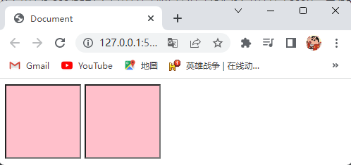

##  9.5元素显示模式转换

- 特殊情况下，我们需要元素模式的转换，简单理解就是一个模式的元素需要另外一种模式的特性，如：想要增加 `<a>` 标签的触发范围这时就需要元素显示模式转换。

- CSS使用 `display` 属性将元素的显示模式转换为另一种模式。

- 语法：

  ```css
  选择器 {
      display: 属性值;
  }
  ```

- `display` 属性的属性值取值为：

  - `block`（把元素的显示模式转换为块级元素）。
  - `inline`（把元素的显示模式转换为行内元素）。
  - `inline-block`（把元素的显示模式转换为行内块元素）。

- 演示代码：

  ```html
  <!DOCTYPE html>
  <html lang="en">
    <head>
      <meta charset="UTF-8" />
      <title>Document</title>
      <style>
        /* 块级元素转换为行内元素其高度宽度不能设置 */
        div {
          width: 100px;
          height: 100px;
          display: inline;
          background-color: pink;
        }
        /* 行内元素转换为块级元素其高度宽度可以设置 */
        span {
          width: 200px;
          height: 100px;
          display: block;
          background-color: yellow;
        }
        /* 块级元素转换为行内块元素使其一行能显示多个 */
        p {
          width: 200px;
          height: 100px;
          display: inline-block;
          background-color: skyblue;
        }
      </style>
    </head>
    <body>
      <div>块级元素转换为行内元素</div>
      <span>行内元素转换为块级元素</span>
      <p>块级元素转换为行内块元素</p>
      <p>块级元素转换为行内块元素</p>
    </body>
  </html>
  ```

- 演示结果：

  

## 9.6单行文字垂直居中

- CSS没有给我们提供标签内文本内容垂直居中的属性，但是我们可以通过将行间距属性的属性值设置为标签的高度来实现单行文字垂直居中，原理是行间距是由上间距和文本高度和下间距组成的，当行间距和标签的高度一致文字就会垂直居中，简单理解就是行高的上间距和下间距把文字挤到中间了，如果行间距小于标签的高度文字会偏上，如果行间距大于标签的高度则文字偏下。

- 演示代码：

  ```html
  <!DOCTYPE html>
  <html lang="en">
    <head>
      <meta charset="UTF-8" />
      <title>Document</title>
      <style>
        /* 行间距属性的属性值设置为标签的高度来实现单行文字垂直居中 */
        div {
          width: 100px;
          height: 100px;
          background-color: pink;
          line-height: 100px;
        }
      </style>
    </head>
    <body>
      <div>单行文字</div>
    </body>
  </html>
  ```

- 演示结果：

  

# 10.CSS的背景属性

## 10.1CSS背景属性的作用

- CSS背景属性可以设置元素的背景颜色、背景图片、背景平铺、背景图片位置、背景图像固定等。

## 10.2背景颜色属性

- CSS使用 `background-color` 属性来定义元素的背景颜色。

- 语法：

  ```css
  选择器 {
      background-color: 属性值;
  }
  ```

- 背景颜色属性的属性值取值为：

  - `transparent`（默认值，透明，无颜色）。

  - 预定义的颜色值：`red`、`green`、`blue`、`black`、`white`、`gray` 等。

  - 十六进制颜色表示法：`#FF0000`、`#FF6600` 等。

  - RGB颜色表示法：`rgb(255,0,0)`、`rgb(100%,0,0)` 等。

  - RGBA颜色表示法：`rgba(255,0,0,0)`、`rgba(100%,0,0,0)` 等。

- 注意点：

  - 背景颜色属性不会影响元素大小，并且还能看清元素的大小和位置，一般在布局中会习惯先给元素设置背景颜色属性。
  - 背景颜色不会改变元素里面的内容的颜色。
  - 背景颜色只显示在元素里面。

- 演示代码：

  ```html
  <!DOCTYPE html>
  <html lang="en">
    <head>
      <meta charset="UTF-8" />
      <title>Document</title>
      <style>
        div {
          width: 100px;
          height: 100px;
          background-color: pink;
        }
      </style>
    </head>
    <body>
      <div></div>
    </body>
  </html>
  ```

- 演示结果：

  

## 10.3背景图片属性

- CSS使用 `background-image` 属性来定义元素的背景图片。

- 语法：

  ```css
  选择器 {
      background-image: 属性值;
  }
  ```

- 背景图片属性的属性值取值为：

  - `none`（默认值，设置为无背景图片）。

  - `url()`（设置元素背景图片的路径）。

- 注意点：

  - 设置元素背景图片的路径时，元素背景图片的路径要写在 `url()` 的括号里面，并且不能加引号。
  - 背景图片属性在实际开发中常用于Logo或者一些装饰性的小图片或者是超大的背景图片，优点是非常便于控制位置（精灵图也是一种运用场景）。
  - 背景图片属性仅仅是指给元素起到装饰效果，类似于背景颜色属性，是不能撑开元素的宽度和高度的。
  - 背景图片属性和背景颜色属性可以同时存在，背景图片在背景颜色的上一层。

- 背景图片属性和图像标签的区别：
  - 图像标签是一个标签，不设置标签的宽度和高度时，图片会以原尺寸显示，一般用于重要的图片。
  - 背景图片属性是一个属性，仅仅是给元素起到装饰效果，是不能撑开元素的宽度和高度的，一般用于不重要的装饰性的图片。

- 演示代码：

  ```html
  <!DOCTYPE html>
  <html lang="en">
    <head>
      <meta charset="UTF-8" />
      <title>Document</title>
      <style>
        /* 背景图片属性和背景颜色属性可以同时存在，背景图片在背景颜色的上一层 */
        div {
          width: 300px;
          height: 300px;
          background-image: url(./imgs/logo.png);
          background-color: pink;
        }
      </style>
    </head>
    <body>
      <div></div>
    </body>
  </html>
  ```

- 演示结果：

  

## 10.4背景图片平铺属性

- CSS使用 `background-repeat` 属性来设置元素的背景图片的平铺方式。

- 语法：

  ```css
  选择器 {
      background-repeat: 属性值;
  }
  ```

- 背景图片平铺属性的属性值取值为：

  - `repeat`（默认值，背景图片在横向和纵向上平铺）。

  - `no-repeat`（背景图片不平铺）。

  - `repeat-x`（背景图片在横向上平铺）。

  - `repeat-y`（背景图片在纵向上平铺）。

- 演示代码：

  ```html
  <!DOCTYPE html>
  <html lang="en">
    <head>
      <meta charset="UTF-8" />
      <title>Document</title>
      <style>
        div {
          width: 300px;
          height: 200px;
          background-image: url(./imgs/logo.png);
          background-color: pink;
          display: inline-block;
        }
        .one {
          background-repeat: repeat;
        }
        .two {
          background-repeat: no-repeat;
        }
        .three {
          background-repeat: repeat-x;
        }
        .four {
          background-repeat: repeat-y;
        }
      </style>
    </head>
    <body>
      <div class="one"></div>
      <div class="two"></div>
      <div class="three"></div>
      <div class="four"></div>
    </body>
  </html>
  ```

- 演示结果：

  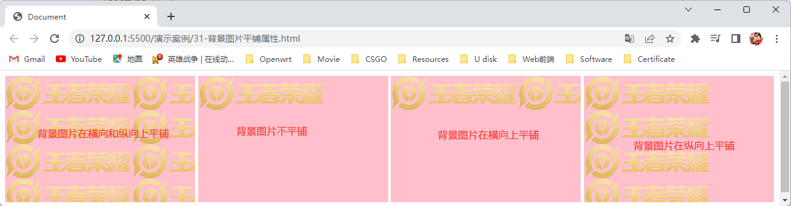

## 10.5背景图片位置属性

- CSS使用 `background-position` 属性来设置背景图片在元素里的位置。

- 语法：

  ```css
  选择器 {
      background-position: x坐标 y坐标;
  }
  ```

- 背景图片位置属性的属性值取值为：

  - x坐标：`left`（默认值，左对齐）、`center`（水平居中对齐）、`right`（右对齐）、像素值（设置背景图片在x轴上距离原点多少像素）。
  - y坐标：`top`（默认值，顶对齐）、`center`（垂直居中对齐）、`botttom`（底对齐）、像素值（设置背景图片在y轴上距离原点多少像素）。

- 背景图片在元素里的坐标轴如图所示：

  

- 注意点：

  - x坐标的值和y坐标的值中间要用空格隔开。
  - 像素值可以为负数。
  - 背景图片只显示在元素里面超出元素大小的部分则不显示。
  - 如果x坐标和y坐标的值都是方位名词，则两个值的前后顺序无关，如：`background-position: left top` 和 `background-position: top left` 实现的效果是一样的。
  - 如果只指定了一个坐标的值是方位名词，另一个坐标的值省略，则省略的坐标的值默认为方位名词中的居中对齐，如：`background-position: top` 表示实现背景图片在元素中水平居中对齐和顶对齐，`background-position: left` 表示实现背景图片在元素中左对齐和垂直居中对齐。

  - 如果x坐标和y坐标的值都是像素值，则第一个值肯定是x坐标，第二个值肯定是y坐标。
  - 如果只指定了一个坐标的值为像素值，另一个坐标的值省略，则设置了像素值的坐标为x坐标，省略了值的坐标为y坐标且省略的坐标的值默认为垂直居中对齐。
  - 如果x坐标和y坐标的值其中一个是方位名词另一个为像素值，那么第一个值肯定为x坐标，第二个值为y坐标。

- 演示代码：

  ```html
  <!DOCTYPE html>
  <html lang="en">
    <head>
      <meta charset="UTF-8" />
      <title>Document</title>
      <style>
        div {
          width: 500px;
          height: 200px;
          background-color: pink;
          background-image: url(./imgs/logo.png);
          background-repeat: no-repeat;
          display: inline-block;
        }
        .one {
          background-position: top right;
        }
        .two {
          background-position: top;
        }
        .three {
          background-position: 20px 20px;
        }
        .four {
          background-position: 20px;
        }
        .five {
          background-position: 20px bottom;
        }
      </style>
    </head>
    <body>
      <div class="one"></div>
      <div class="two"></div>
      <div class="three"></div>
      <div class="four"></div>
      <div class="five"></div>
    </body>
  </html>
  ```

- 演示结果：

  

## 10.6背景图片固定属性

- CSS使用 `background-attachment` 属性来设置背景图片是否固定或者随着页面的其余部分滚动。

- 语法：

  ```css
  选择器 {
      background-attachment: 属性值;
  }
  ```

- 背景图片固定属性的属性值取值为：

  - `scroll`（默认值，设置背景图像是随着页面的其余部分滚动）。
  - `fixed`（默认值，设置背景图像是固定的）。

- 演示代码：

  ```html
  <!DOCTYPE html>
  <html lang="en">
    <head>
      <meta charset="UTF-8" />
      <title>Document</title>
      <style>
        body {
          background-image: url(./imgs/bg.jpg);
          background-repeat: no-repeat;
          background-attachment: fixed;
          background-position: top;
        }
        p {
          color: #fff;
        }
      </style>
    </head>
    <body>
      <p>1</p>
      <p>2</p>
      <p>3</p>
      <p>4</p>
      <p>5</p>
      <p>6</p>
      <p>7</p>
      <p>8</p>
      <p>9</p>
      <p>10</p>
      <p>11</p>
      <p>12</p>
      <p>13</p>
      <p>14</p>
      <p>15</p>
      <p>16</p>
      <p>17</p>
      <p>18</p>
      <p>19</p>
      <p>20</p>
      <p>21</p>
      <p>22</p>
      <p>23</p>
      <p>24</p>
      <p>25</p>
      <p>26</p>
      <p>27</p>
      <p>28</p>
      <p>29</p>
      <p>30</p>
    </body>
  </html>
  ```

- 演示结果：

  

## 10.7背景的复合属性

- 背景复合属性可以把上面的CSS背景属性综合来写，这样可以更节约代码。

- 语法：

  ```css
  选择器 {
      background: 背景颜色属性的属性值 背景图片属性的属性值 背景图片平铺属性的属性值 背景图片固定属性的属性值 背景图片位置属性的属性值;
  }
  ```

- 背景复合属性的属性值取值为：各个属性的属性值。

- 注意点：

  - 使用背景的复合属性时，可以不按上面语法格式中的顺序书写，但是各个属性值之间要以空格隔开。
  - 背景的复合属性中的属性值可以按照需求省略。

- 演示代码：

  ```html
  <!DOCTYPE html>
  <html lang="en">
    <head>
      <meta charset="UTF-8" />
      <title>Document</title>
      <style>
        div {
          width: 300px;
          height: 200px;
          background: pink url(./imgs/logo.png) no-repeat scroll right center;
        }
      </style>
    </head>
    <body>
      <div></div>
    </body>
  </html>
  ```

- 演示结果：

  

# 11.CSS的三大特性

## 11.1层叠性

- 层叠性就是给一个元素设置相同的样式，此时一个样式就会覆盖（层叠）另一个冲突的样式，层叠性主要解决样式冲突的问题。

- 层叠性的特性：

  - 给一个元素设置相同的样式时，写在下面的样式会覆盖掉另一个冲突的样式。
  - 给一个元素设置不同的样式时，样式会层叠叠加，共同作用在元素上。
  - 当使用不同的选择器选择了同一个元素，并且在每个选择器中设置了相同的样式，此时样式会层叠覆盖，最终写在最后的样式会生效。
  - 当使用不同的选择器选择了同一个元素，并且在每个选择器中设置了不同的样式，此时样式会层叠叠加，共同作用在元素上。

- 注意点：当样式冲突时，只有当选择器优先级相同时才能通过层叠性判断结果。

- 演示代码：

  ```html
  <!DOCTYPE html>
  <html lang="en">
    <head>
      <meta charset="UTF-8" />
      <title>Document</title>
      <style>
        /* 给一个元素设置相同的样式时，写在下面的样式会覆盖掉另一个冲突的样式 */
        span {
          color: red;
          color: green;
        }
        /* 给一个元素设置不同的样式时，样式会层叠叠加，共同作用在元素上 */
        h6 {
          height: 50px;
          background-color: pink;
        }
        /* 当使用不同的选择器选择了同一个元素，并且在每个选择器中设置了相同的样式，此时样式会层叠覆盖，最终写在最后的样式会生效 */
        p {
          color: red;
        }
        .one {
          color: pink;
        }
        /* 当使用不同的选择器选择了同一个元素，并且在每个选择器中设置了不同的样式，此时样式会层叠叠加，共同作用在元素上 */
        div {
          height: 50px;
        }
        .two {
          background-color: skyblue;
        }
      </style>
    </head>
    <body>
      <span>给一个元素设置相同的样式时，写在下面的样式会覆盖掉另一个冲突的样式</span>
      <h6>给一个元素设置不同的样式时，样式会层叠叠加，共同作用在元素上</h6>
      <p class="one">当使用不同的选择器选择了同一个元素，并且在每个选择器中设置了相同的样式，此时样式会层叠覆盖，最终写在最后的样式会生效</p>
      <div class="two">当使用不同的选择器选择了同一个元素，并且在每个选择器中设置了不同的样式，此时样式会层叠叠加，共同作用在元素上</div>
    </body>
  </html>
  ```

- 演示结果：

  

## 11.2继承性

- 继承性就是子元素会继承父元素的某些样式，如：文本颜色和字号，简单的理解就是子承父业。

- 注意点：

  - 子元素可以继承父元素的文本属性、字体属性不是控制文字的都不能继承。
  - 恰当地使用继承性可以简化代码，降低CSS样式的复杂性。
  - 继承性失效的特殊情况：如果元素有浏览器默认样式，此时继承性依然存在，但是优先显示浏览器的默认样式，如：超链接标签的 `color` 属性会继承失效，标题标签的 `font-size` 属性会继承失效。

- 演示代码：

  ```html
  <!DOCTYPE html>
  <html lang="en">
    <head>
      <meta charset="UTF-8" />
      <title>Document</title>
      <style>
        div {
          color: pink;
        }
      </style>
    </head>
    <body>
      <div>
        <p>继承成功</p>
        <a href="#">继承失效因为超链接标签有浏览器默认样式，优先显示浏览器的默认样式</a>
      </div>
    </body>
  </html>
  ```

- 演示结果：

  

## 11.3优先级

- 当同一个元素指定了多个选择器时，就会有优先级的产生，不同的选择器具有不同的优先级，优先级高的选择器的样式会覆盖优先级低的选择器的样式，优先级相同时，则执行层叠性。

- 选择器的权重，如下表所示：

  | 选择器               | 选择器权重 |
  | -------------------- | :--------: |
  | 继承性、通配符选择器 | (0,0,0,0)  |
  | 标签选择器           | (0,0,0,1)  |
  | 类选择器、伪类选择器 | (0,0,1,0)  |
  | id选择器             | (0,1,0,0)  |
  | 行内样式             | (1,0,0,0)  |
  | `!important`         |   无穷大   |

- 选择器权重叠加：

  - 如果是复合选择器，此时需要通过权重叠加计算方法，判断最终哪个选择器优先级最高会生效。

  - 选择器权重叠加的计算公式（每一级之间不存在进位），如图所示：

    

- 选择器权重的比较规则：

  1. 先比较第一级数字，如果比较出来了，之后的统统不看，谁的数字大谁的优先级高，如：行内样式（1,0,0,0）和id选择器（0,1,0,0）相比较那么则是行内样式优先级更高。
  2. 如果第一级数字相同，此时再去比较第二级数字，如果比较出来了，之后的统统不看，谁的数字大谁的优先级高，如：id选择器（0,1,0,0）和类选择器（0,0,1,0）相比较那么则是id选择器优先级更高。
  3. ···
  4. 如果最终所有数字都相同，表示优先级相同，则比较层叠性（谁写在下面，谁说了算）。

- 注意点：

  - 选择器权重越高优先级也越高。
  - `!important` 权重是最高的它写在样式的后面分号的前面，如：`color: red!important;`。
  - 继承性的权重是0，如果该元素没有直接选中，不管父元素权重多高，子元素得到的权重都是0。
  - 如果全是继承性，那么就看继承性里面谁最高，看继承了哪个父级，哪个父级高，哪个选择器的样式生效。

- 演示代码：

  ```html
  <!DOCTYPE html>
  <html lang="en">
    <head>
      <meta charset="UTF-8" />
      <title>Document</title>
      <style>
        /* 选择器权重越大优先级也越高，优先级高的选择器的样式会覆盖优先级低的选择器的样式 */
        span {
          color: yellow;
        }
        .one {
          color: pink;
        }
        li {
          color: #fff;
        }
        ul li {
          color: red;
        }
        /* 继承性的权重是0，如果该元素没有直接选中，不管父元素权重多高，子元素得到的权重都是0 */
        div {
          color: gray!important;
        }
        p {
          color: blue;
        }
        /* 优先级相同时，则执行层叠性 */
        .duan {
          color: skyblue;
        }
        .duan {
          color: green;
        }
        /* 如果全是继承性，那么就看继承性里面谁最高，看继承了哪个父级，哪个父级高，哪个选择器的样式生效 */
        .father {
          color: purple!important;
        }
        dl {
          color: aqua;
        }
      </style>
    </head>
    <body>
      <span class="one">文本</span>
      <ul>
        <li>文本</li>
        <li>文本</li>
      </ul>
      <div>
        <p>文本</p>
      </div>
      <p class="duan">文本</p>
      <a href="#" class="father">
        <dl>
          <dt>文本</dt>
        </dl>
      </a>
    </body>
  </html>
  ```

- 演示结果：

  

# 12.CSS的注释

- CSS使用 `/* */` 来注释。

  > 注：注释是为了给代码添加具有解释性、描述性的信息，主要用来帮助开发人员理解代码，浏览器执行代码时会忽略所有的注释。

- 语法：

  ```css
  /* 要注释的内容 */
  ```

- 注意点：

  - 在VSCode编辑器中可以使用 `Ctrl+/` 快捷键快速注释。
  - 在HTML文件中，CSS的注释只能写在 `<style>` 标签中。

- 演示代码：

  ```html
  <!DOCTYPE html>
  <html lang="en">
    <head>
      <meta charset="UTF-8" />
      <title>Document</title>
      <style>
        p {
          /* color: red; */
          font-size: 20px;
        }
      </style>
    </head>
    <body>
      <p>这是一个段落</p>
    </body>
  </html>
  ```

- 演示结果：

  

# 13.CSS盒子模型

## 13.1网页布局的本质

- 网页布局过程：
  - 先准备好相关的网页元素，网页元素基本都是盒子。
  - 利用CSS设置好盒子样式，然后摆放到相应位置。
  - 往盒子里面装内容。
- 网页布局的核心本质就是利用CSS摆盒子。

## 13.2盒子模型组成

- 盒子模型（Box Model）就是把HTML页面中的元素看作是一个矩形的盒子，也就是一个盛装内容的容器。

- 盒子模型组成，如图所示：

  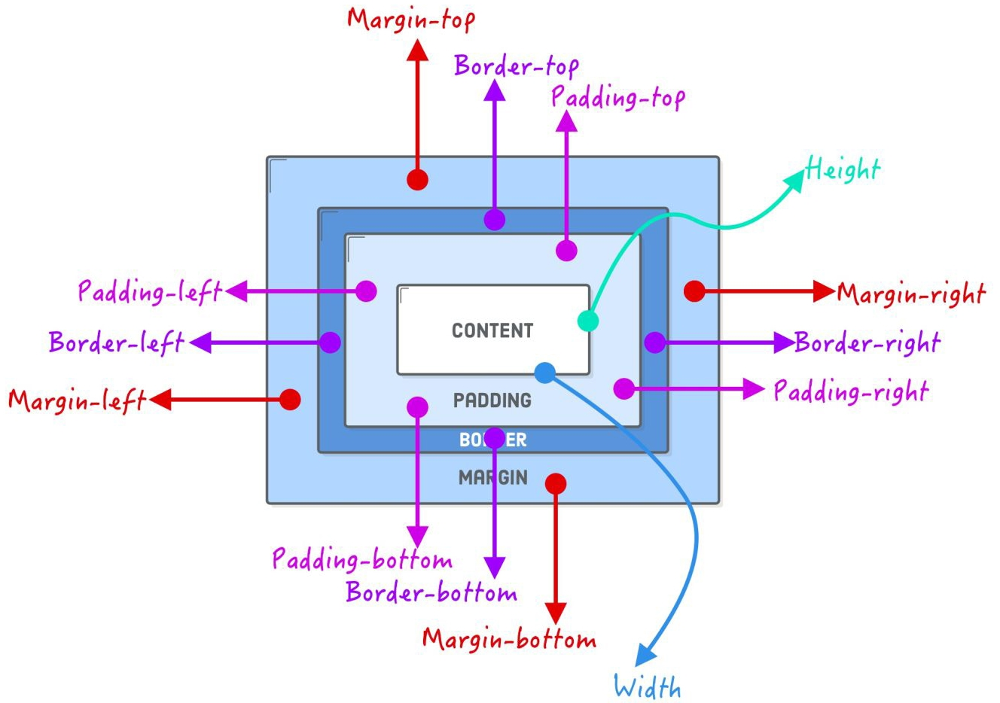

- CSS中规定每个盒子分别由内容区域（content）、内边距区域（padding）、边框区域（border）、外边距区域（margin）构成，这就是盒子模型。

## 13.3内容区域

- 内容区域主要是用于放置内容的，如：文本、图片等。

- CSS使用 `width` 和 `height` 属性分别来设置盒子内容区域的宽度和高度。

- 语法：

  ```CSS
  选择器 {
      width: 属性值;
      height: 属性值;
  }
  ```

- `width` 和 `height` 属性的属性值分别取值为：

  - `width` 属性：像素值（用于设置盒子内容区域的宽度为多少像素）。
  - `height` 属性：像素值（用于设置盒子内容区域的高度为多少像素）。

- 注意点：在盒子没有设置边框区域和内边距区域时，内容区域的宽度和高度就是盒子的宽度和高度。

- 演示代码：

  ```html
  <!DOCTYPE html>
  <html lang="en">
    <head>
      <meta charset="UTF-8" />
      <title>Document</title>
      <style>
        div {
          width: 200px;
          height: 200px;
          background-color: pink;
        }
      </style>
    </head>
    <body>
      <div>设置一个200px*200px的盒子模型</div>
    </body>
  </html>
  ```

- 演示结果：

  

## 13.4边框区域

### 13.4.1边框区域的组成

- 边框区域由四部分组成分别是上边框、下边框、左边框、右边框。

### 13.4.2边框的宽度、样式、颜色

- CSS使用 `border-width`、`border-style`、`border-color` 属性分别来设置盒子四条边框的宽度（粗细）、样式、颜色。

- 语法：

  ```css
  选择器 {
      border-width: 属性值;
      border-style: 属性值;
      border-color: 属性值;
  }
  ```

- `border-width`、`border-style`、`border-color` 属性的属性值分别取值为：

  - `border-width` 属性：像素值（用于设置盒子四条边框的宽度为多少像素）。
  - `border-style` 属性：`none`（默认值，设置盒子没有边框）、`solid`（设置盒子四条边框为单实线）、`dashed`（设置盒子四条边框为虚线）、`dotted`（设置盒子四条边框为点线）。
  - `border-color` 属性：
    - 预定义的颜色值：`red`、`green`、`blue`、`black`、`white`、`gray` 等。
    - 十六进制颜色表示法：`#FF0000`、`#FF6600` 等。

    - RGB颜色表示法：`rgb(255,0,0)`、`rgb(100%,0,0)` 等。

    - RGBA颜色表示法：`rgba(255,0,0,0)`、`rgba(100%,0,0,0)` 等。

- 演示代码：

  ```html
  <!DOCTYPE html>
  <html lang="en">
    <head>
      <meta charset="UTF-8" />
      <title>Document</title>
      <style>
        div {
          width: 300px;
          height: 100px;
          background-color: pink;
          border-width: 10px;
          border-style: solid;
          background-color: red;
        }
      </style>
    </head>
    <body>
      <div>设置盒子四条边框的粗细为10px且为单实线颜色为红色</div>
    </body>
  </html>
  ```

- 演示结果：

  

### 13.4.3边框的复合属性

- 边框复合属性可以把上面的CSS边框属性综合来写，这样可以更节约代码。

- 语法：

  ```css
  选择器 {
      border: border-width属性的属性值 border-style属性的属性值 border-color属性的属性值;
  }
  ```

- 边框复合属性的属性值取值为：各个属性的属性值。

- 注意点：使用边框的复合属性时，可以不按上面语法格式中的顺序书写，但是各个属性值之间要以空格隔开。

- 演示代码：

  ```html
  <!DOCTYPE html>
  <html lang="en">
    <head>
      <meta charset="UTF-8" />
      <title>Document</title>
      <style>
        div {
          width: 300px;
          height: 100px;
          background-color: pink;
          border: 20px dotted blue;
        }
      </style>
    </head>
    <body>
      <div>设置盒子四条边框的粗细为20px且为点线颜色为蓝色</div>
    </body>
  </html>
  ```

- 演示结果：

  

### 13.4.4单边框的宽度、样式、颜色

- CSS使用 `border-top`、`border-bottom`、`border-left`、`border-right` 属性分别来设置盒子的上边框、下边框、左边框、右边框的宽度（粗细）、样式、颜色。

- 语法：

  ```css
  选择器 {
      border-top: border-width属性的属性值 border-style属性的属性值 border-color属性的属性值;
      border-bottom: border-width属性的属性值 border-style属性的属性值 border-color属性的属性值;
      border-left: border-width属性的属性值 border-style属性的属性值 border-color属性的属性值;
      border-right: border-width属性的属性值 border-style属性的属性值 border-color属性的属性值;
  }
  ```

- `border-top`、`border-bottom`、`border-left`、`border-right` 属性的属性值分别取值为：

  - `border-top` 属性：各个属性的属性值。
  - `border-bottom` 属性：各个属性的属性值。
  - `border-left` 属性：各个属性的属性值。
  - `border-right` 属性：各个属性的属性值。

- 演示代码：

  ```html
  <!DOCTYPE html>
  <html lang="en">
    <head>
      <meta charset="UTF-8" />
      <title>Document</title>
      <style>
        div {
          width: 300px;
          height: 100px;
          background-color: pink;
          border-top: 10px solid red;
        }
      </style>
    </head>
    <body>
      <div>上边框的宽度设置为10px且为单实线颜色为红色</div>
    </body>
  </html>
  ```

- 演示结果：

  

### 13.4.5表格的细线边框

- 当使用边框属性给表格、表格单元格标签设置边框时，相邻的两条边框会叠加在一起，使得边框变粗，如下图所示：

  

- CSS使用 `border-collapse` 属性来设置相邻的两条边框是否合并成一条边框。

- 语法：

  ```css
  选择器 {
      border-collapse: 属性值;
  }
  ```

- `border-collapse` 属性的属性值取值为：

  - `separate`（默认值，相邻的两条边框不合并）。
  - `collapse`（相邻的两条边框会合并成一条边框）。

- 演示代码：

  ```html
  <!DOCTYPE html>
  <html lang="en">
    <head>
      <meta charset="UTF-8" />
      <title>Document</title>
      <style>
        table,
        th,
        td {
          border: 2px solid red;
          border-collapse: collapse;
        }
      </style>
    </head>
    <body>
      <table cellspacing="0px">
        <tr>
          <th>数字</th>
          <th>数字</th>
          <th>数字</th>
          <th>数字</th>
          <th>数字</th>
        </tr>
        <tr>
          <td>1</td>
          <td>2</td>
          <td>3</td>
          <td>4</td>
          <td>5</td>
        </tr>
        <tr>
          <td>1</td>
          <td>2</td>
          <td>3</td>
          <td>4</td>
          <td>5</td>
        </tr>
      </table>
    </body>
  </html>
  ```

- 演示结果：

  

### 13.4.6边框会影响盒子的实际大小

- 边框会影响盒子的实际大小，如：一个盒子的内容区域的宽度高度都为100px，给该盒子设置了上边框、下边框、左边框、右边框，且边框的宽度都为10px，那么盒子实际的宽度高度都为120px，因为边框会影响盒子的实际大小，所以设置了边框的盒子的实际宽度为100px+10px+10px（盒子内容区域的宽度+左边框的宽度+右边框的宽度），设置了边框的盒子的实际高度为100px+10px+10px（盒子内容区域的高度+上边框的宽度+下边框的宽度）。
- 不想边框影响盒子的实际大小的解决方案：
  - 在测量盒子的宽度高度时，只测量盒子内容区域的宽度高度，边框不测量。
  - 如果在测量盒子的宽度高度时，包含了边框，那么设置盒子的宽度高度时需要减去边框的宽度。

## 13.5内边距区域

### 13.5.1内边距区域的组成

- 内边距区域由四部分组成分别是上内边距、下内边距、左内边距、右内边距。

### 13.5.2单内边距的宽度

- 内边距就是边框区域与内容区域之间的距离。

- CSS使用 `padding-top`、`padding-bottom`、`padding-left`、`padding-right` 属性分别来设置盒子的上内边距、下内边距、左内边距、右内边距的宽度。

- 语法：

  ```css
  选择器 {
      padding-top: 属性值;
      padding-bottom: 属性值;
      padding-left: 属性值;
      padding-right: 属性值;
  }
  ```

- `padding-top`、`padding-bottom`、`padding-left`、`padding-right` 属性的属性值分别取值为：

  - `padding-top` 属性：像素值（设置盒子的上内边距为多少像素，默认值为0px）。
  - `padding-bottom` 属性：像素值（设置盒子的下内边距为多少像素，默认值为0px）。
  - `padding-left` 属性：像素值（设置盒子的左内边距为多少像素，默认值为0px）。
  - `padding-right` 属性：像素值（设置盒子的右内边距为多少像素，默认值为0px）。

- 注意点：行内元素为了照顾兼容性，尽量只设置左右内边距，不要设置上下内边距，某些时候，行内元素的上下内边距都不生效时，可以将其转换为块级或行内块元素就可以了。

- 演示代码：

  ```html
  <!DOCTYPE html>
  <html lang="en">
    <head>
      <meta charset="UTF-8" />
      <title>Document</title>
      <style>
        div {
          width: 300px;
          height: 100px;
          background-color: pink;
          padding-left: 10px;
          padding-top: 20px;
        }
      </style>
    </head>
    <body>
      <div>设置左内边距为10px上内边距为20px</div>
    </body>
  </html>
  ```

- 演示结果：

  

### 13.5.3内边距的复合属性

- 内边距复合属性可以把上面的CSS内边距属性综合来写，这样可以更节约代码。

- 语法：

  ```css
  选择器 {
      padding: 属性值;
      padding: 属性值1 属性值2;
      padding: 属性值1 属性值2 属性值3;
      padding: 属性值1 属性值2 属性值3 属性值4;
  }
  ```

- 内边距复合属性的属性值取值为：像数值（设置内边距的宽度为多少像素，默认值为0px）。

- 语法说明：内边距复合属性可以有一到四个属性值，属性值的个数不同表达的意思也不同，如下表所示：

  |          属性值的个数          | 表达意思                                                     |
  | :----------------------------: | ------------------------------------------------------------ |
  |        `padding: 5px;`         | 设置盒子的上下左右内边距为5px                                |
  |      `padding: 5px 10px;`      | 设置盒子的上下内边距为5px，左右内边距为10px                  |
  |   `padding: 5px 10px 15px;`    | 设置盒子的上内边距为5px，左右内边距为10px，下内边距为15px    |
  | `padding: 5px 10px 15px 20px;` | 设置盒子的上内边距为5px，右内边距为10px，下内边距为15px，左内边距为20px，按照顺时针方向设置的 |

- 注意点：

  - 内边距复合属性的属性值个数不同表达的意思也不同。

  - 使用内边距的复合属性时，各个属性值之间要以空格隔开。

- 演示代码：

  ```html
  <!DOCTYPE html>
  <html lang="en">
    <head>
      <meta charset="UTF-8" />
      <title>Document</title>
      <style>
        div {
          width: 300px;
          height: 100px;
          background-color: pink;
          padding: 5px 10px 15px 20px;
        }
      </style>
    </head>
    <body>
      <div>设置盒子的上内边距为5px，右内边距为10px，下内边距为15px，左内边距为20px</div>
    </body>
  </html>
  ```

- 演示结果：

  

### 13.5.4内边距会影响盒子的实际大小

- 内边距会影响盒子的实际大小，如：一个盒子的内容区域的宽度高度都为100px，给该盒子设置了上内边距、下内边距、左内边距、右内边距，且内边距的宽度都为10px，那么盒子实际的宽度高度都为120px，因为内边距会影响盒子的实际大小，所以设置了内边距的盒子的实际宽度为100px+10px+10px（盒子内容区域的宽度+左内边距的宽度+右内边距的宽度），设置了内边距的盒子的实际高度为100px+10px+10px（盒子内容区域的高度+上内边距的宽度+下内边距的宽度）。
- 不想内边距影响盒子的实际大小的解决方案：如果在测量盒子的宽度高度时，包含了内边距，那么设置盒子的宽度高度时需要减去内边距的宽度。
- 特殊情况：如果盒子没有指定宽度和高度时，内边距就不会影响到盒子的实际大小。

## 13.6外边距区域

### 13.6.1外边距区域的组成

- 外边距区域由四部分组成分别是上外边距、下外边距、左外边距、右外边距。

### 13.6.2单外边距的宽度

- 外边距就是盒子与盒子之间的距离。

- CSS使用 `margin-top`、`margin-bottom`、`margin-left`、`margin-right` 属性分别来设置盒子的上外边距、下外边距、左外边距、右外边距的宽度。

- 语法：

  ```css
  选择器 {
      margin-top: 属性值;
      margin-bottom: 属性值;
      margin-left: 属性值;
      margin-right: 属性值;
  }
  ```

- `margin-top`、`margin-bottom`、`margin-left`、`margin-right` 属性的属性值分别取值为：

  - `margin-top` 属性：像素值（设置盒子的上外边距为多少像素，默认值为0px）。
  - `margin-bottom` 属性：像素值（设置盒子的下外边距为多少像素，默认值为0px）。
  - `margin-left` 属性：像素值（设置盒子的左外边距为多少像素，默认值为0px）。
  - `margin-right` 属性：像素值（设置盒子的右外边距为多少像素，默认值为0px）。

- 注意点：行内元素为了照顾兼容性，尽量只设置左右外边距，不要设置上下外边距，某些时候，行内元素的上下外边距都不生效时，可以将其转换为块级或行内块元素就可以了。

- 演示代码：

  ```html
  <!DOCTYPE html>
  <html lang="en">
    <head>
      <meta charset="UTF-8" />
      <title>Document</title>
      <style>
        div {
          width: 150px;
          height: 150px;
          background-color: pink;
          margin-bottom: 20px;
        }
      </style>
    </head>
    <body>
      <div>设置盒子的下外边距为20px</div>
      <div></div>
    </body>
  </html>
  ```

- 演示结果：

  

### 13.6.3外边距的复合属性

- 外边距复合属性可以把上面的CSS外边距属性综合来写，这样可以更节约代码。

- 语法：

  ```css
  选择器 {
      margin: 属性值;
      margin: 属性值1 属性值2;
      margin: 属性值1 属性值2 属性值3;
      margin: 属性值1 属性值2 属性值3 属性值4;
  }
  ```

- 外边距复合属性的属性值取值为：像数值（设置外边距的宽度为多少像素，默认值为0px）。

- 语法说明：外边距复合属性可以有一到四个属性值，属性值的个数不同表达的意思也不同，如下表所示：

  |         属性值的个数          | 表达意思                                                     |
  | :---------------------------: | ------------------------------------------------------------ |
  |        `margin: 5px;`         | 设置盒子的上下左右外边距为5px                                |
  |      `margin: 5px 10px;`      | 设置盒子的上下外边距为5px，左右外边距为10px                  |
  |   `margin: 5px 10px 15px;`    | 设置盒子的上外边距为5px，左右外边距为10px，下外边距为15px    |
  | `margin: 5px 10px 15px 20px;` | 设置盒子的上外边距为5px，右外边距为10px，下外边距为15px，左外边距为20px，按照顺时针方向设置的 |

- 注意点：

  - 外边距复合属性的属性值个数不同表达的意思也不同。

  - 使用外边距的复合属性时，各个属性值之间要以空格隔开。

- 演示代码：

  ```html
  <!DOCTYPE html>
  <html lang="en">
    <head>
      <meta charset="UTF-8" />
      <title>Document</title>
      <style>
        div {
          width: 150px;
          height: 150px;
          background-color: pink;
          margin: 20px 40px;
        }
      </style>
    </head>
    <body>
      <div>设置盒子的上下外边距为20px左右外边距为40px</div>
      <div></div>
    </body>
  </html>
  ```

- 演示结果：

  

### 13.6.4外边距不会影响盒子的实际大小

- 外边距不会影响盒子的实际大小因为它只是控制盒子与盒子之间的距离。

### 13.6.5外边距的典型应用

- 外边距可以让块级盒子水平居中，但是必须满足如下两个条件：

  - 盒子必须指定了宽度 `width` 属性。

  - 盒子的左右外边距都设置为 `auto`。

- 注意点：外边距只能让块级元素水平居中，不能让行内元素或者行内块元素水平居中，行内元素或者行内块元素使用 `text-align` 属性来实现水平居中，如果需要实现行内元素或者行内块元素水平居中，那么就需要给该元素的父元素设置 `text-align` 属性，如：需要给 `<div>` 标签里的 `` 标签设置水平居中，那么就需要给该元素的父元素设置 `text-align` 属性，也就是需要给 `<div>` 标签设置 `text-align` 属性。

- 演示代码：

  ```html
  <!DOCTYPE html>
  <html lang="en">
    <head>
      <meta charset="UTF-8" />
      <title>Document</title>
      <style>
        /* 外边距的典型应用 */
        .one {
          width: 600px;
          background-color: pink;
          margin: 10px auto;
        }
        /* 外边距只能让块级元素水平居中，不能让行内元素或者行内块元素水平居中，行内元素或者行内块元素使用text-align属性来实现水平居中 */
        div {
          width: 500px;
          background-color: pink;
          text-align: center;
        }
      </style>
    </head>
    <body>
      <div class="one">外边距可以让块级盒子水平居中</div>
      <div>
        
      </div>
    </body>
  </html>
  ```

- 演示结果：

  

### 13.6.6外边距合并

- 使用 `margin` 属性定义块级元素的垂直外边距（上外边距和下外边距）时，可能会出现外边距的合并，主要分为下面两种情况：

  - 相邻块级元素垂直外边距的合并：

    - 当上下相邻的两个块级元素（兄弟关系）相遇时，如果上面的元素有下外边距 `margin-bottom` 属性，下面的元素有上外边距 `margin-top` 属性则它们之间的垂直间距不是 `margin-bottom` 属性的属性值与 `margin-top` 属性的属性值之和，而是取两个值中的较大者（准确的描述应该是：大的外边距覆盖小的外边距）。

    - 相邻块级元素垂直外边距的合并，如下图所示：

      

    - 相邻块级元素垂直外边距的合并的解决方案：只给一个块级元素添加 `margin` 属性。

    - 演示代码：
  
      ```html
      <!DOCTYPE html>
      <html lang="en">
        <head>
          <meta charset="UTF-8" />
          <title>Document</title>
          <style>
            div {
              width: 200px;
              height: 100px;
              background-color: pink;
            }
            .one {
              margin-bottom: 20px;
            }
          </style>
        </head>
        <body>
          <div class="one">给一个块级元素添加margin属性这样就不会发生相邻块级元素垂直外边距的合并</div>
          <div></div>
        </body>
      </html>
      ```

    - 演示结果：

      

  - 嵌套块级元素垂直外边距的塌陷：

    - 对于两个嵌套关系（父子关系）的块级元素，父元素有上外边距同时子元素也有上外边距，此时父元素会塌陷较大的外边距值。

    - 嵌套块级元素垂直外边距的塌陷，如图所示：
  
      
  
    - 嵌套块级元素垂直外边距的塌陷的解决方案如下：
  
      - 给父元素设置 `border-top` 属性或者 `padding-top` 属性（分隔父子元素的 `margin-top` 属性）。
      - 给父元素添加 `overflow: hidden;` 属性。
      - 将父元素或者子元素转换为行内块元素。
  
    - 演示代码：
  
      ```html
      <!DOCTYPE html>
      <html lang="en">
        <head>
          <meta charset="UTF-8" />
          <title>Document</title>
          <style>
            div {
              width: 300px;
              height: 200px;
              background-color: pink;
              margin-top: 5px;
              overflow: hidden;
            }
            p {
              width: 200px;
              height: 50px;
              background-color: #fff;
              margin-top: 10px;
            }
          </style>
        </head>
        <body>
          <div>
            <p>给父元素添加overflow: hidden;属性</p>
          </div>
        </body>
      </html>
      ```
  
    - 演示结果：
  
      

## 13.7清除内外边距

- 网页元素很多都带有默认的内外边距，而且不同浏览器默认的也不一致，因此我们在布局前，首先要清除下网页元素的内外边距。

- 语法：

  ```css
  * {
  	padding:0; 	/* 清除内边距 */
  	margin:0; 	/* 清除外边距 */
  }
  ```

# 14.PxCook

- PxCook（像素大厨）是一个切图设计工具软件，它可以把网页设计图中的盒子的宽度和高度测量出来，还可以吸取网页设计图中的颜色，这个工具能方便我们设置网页中盒子的宽度和高度和颜色。
- 下载地址：https://fancynode.com.cn/pxcook。

# 15.清除列表标签中列表项前的显示标识

- 列表标签中的每一列表项前都会有显示标识，如图所示：

  

- CSS使用 `list-style: none;` 属性来清除列表标签中列表项前的显示标识。

- 语法：

  ```css
  选择器 {
  	list-style: none;
  }
  ```

- 注意点：`list-style: none;` 属性可以给列表标签设置，也可以给列表项标签设置，效果相同。

- 演示代码：

  ```html
  <!DOCTYPE html>
  <html lang="en">
    <head>
      <meta charset="UTF-8" />
      <title>Document</title>
      <style>
        ul {
          list-style: none;
        }
        li {
          list-style: none;
        }
      </style>
    </head>
    <body>
      <ul>
        <li>无序列表</li>
        <li>无序列表</li>
        <li>无序列表</li>
        <li>无序列表</li>
        <li>无序列表</li>
      </ul>
      <ol>
        <li>有序列表</li>
        <li>有序列表</li>
        <li>有序列表</li>
        <li>有序列表</li>
        <li>有序列表</li>
      </ol>
    </body>
  </html>
  ```

- 演示结果：

  

# 16.CSS的圆角边框属性

## 16.1圆角边框的原理

- 圆角边框使用圆与边框的交集形成圆角效果，如图所示：

  

## 16.2圆角边框的属性

- CSS使用 `border-top-left`、`border-top-right`、`border-bottom-left`、`border-bottom-right` 属性来设置圆角边框的左上角、右上角、左下角、右下角。

- 语法：

  ```css
  选择器 {
      border-top-left: 属性值;
      border-top-right: 属性值;
      border-bottom-left: 属性值;
      border-bottom-right: 属性值;
  }
  ```

- `border-top-left`、`border-top-left`、`border-bottom-left`、`border-bottom-right` 属性的属性值分别取值为：

  - `border-top-left` 属性：`数字+%`、像素值（设置左上角的圆的半径为多少像素）。

    > 注：%是一个相对单位，如：两个嵌套关系（父子关系）的块级元素，子元素的宽度设置为 `width: 50%`，则表示设置子元素的宽度为父元素的宽度的50%，这里表示的是将圆的半径设置为父元素的宽度的百分之几。

  - `border-top-left` 属性：`数字+%`、像素值（设置右上角的圆的半径为多少像素）。

  - `border-bottom-left` 属性：`数字+%`、像素值（设置左下角的圆的半径为多少像素）。

  - `border-bottom-right` 属性：`数字+%`、像素值（设置右下角的圆的半径为多少像素）。

- 演示代码：

  ```html
  <!DOCTYPE html>
  <html lang="en">
    <head>
      <meta charset="UTF-8" />
      <title>Document</title>
      <style>
        div {
          width: 100px;
          height: 100px;
          background-color: pink;
          border-top-left-radius: 50%;
        }
      </style>
    </head>
    <body>
      <div></div>
    </body>
  </html>
  ```

- 演示结果：

  

## 16.3圆角边框的复合属性

- 圆角边框复合属性可以把上面的CSS圆角边框属性综合来写，这样可以更节约代码。

- 语法：

  ```css
  选择器 {
      border-radius: 属性值;
      border-radius: 属性值1 属性值2;
      border-radius: 属性值1 属性值2 属性值3;
      border-radius: 属性值1 属性值2 属性值3 属性值4;
  }
  ```

- 圆角边框复合属性的属性值取值为：

  - `数字+%`（将圆的半径设置为父元素的宽度的百分之几）。

  - 像数值（设置圆的半径为多少像素）。

- 语法说明：圆角边框复合属性可以有一到四个属性值，属性值的个数不同表达的意思也不同，如下表所示：

  |             属性值的个数             | 表达意思                                                     |
  | :----------------------------------: | ------------------------------------------------------------ |
  |        `border-radius: 5px;`         | 设置圆角边框的左上角、右上角、左下角、右下角的圆的半径为5px  |
  |      `border-radius: 5px 10px;`      | 设置圆角边框的左上角、右下角的圆的半径为5px，右上角、左下角的圆的半径为10px |
  |   `border-radius: 5px 10px 15px;`    | 设置圆角边框的左上角的圆的半径为5px，右上角、左下角的圆的半径为10px、右下角的圆的半径为15px |
  | `border-radius: 5px 10px 15px 20px;` | 设置圆角边框的左上角的圆的半径为5px，右上角的圆的半径为10px，右下角的圆的半径为15px，左下角的圆的半径为20px，按照顺时针方向设置的。 |

- 注意点：

  - 圆角边框复合属性的属性值个数不同表达的意思也不同。

  - 使用圆角边框的复合属性时，各个属性值之间要以空格隔开。

- 演示代码：

  ```html
  <!DOCTYPE html>
  <html lang="en">
    <head>
      <meta charset="UTF-8" />
      <title>Document</title>
      <style>
        div {
          width: 100px;
          height: 100px;
          background-color: pink;
          border-radius: 5px 10px 15px 20px;
        }
      </style>
    </head>
    <body>
      <div></div>
    </body>
  </html>
  ```

- 演示结果：

  

## 16.4圆角边框的特殊情况

- 一个正方形的盒子，给它设置圆角边框的复合属性将它四个角的圆的半径设置为盒子宽度的一半，这时盒子就会变成一个圆。

- 一个长方形的盒子，给它设置圆角边框的复合属性将它四个角的圆的半径设置为盒子高度的一半，这时盒子就会变成一个胶囊。

- 演示代码：

  ```html
  <!DOCTYPE html>
  <html lang="en">
  <head>
    <meta charset="UTF-8">
    <meta http-equiv="X-UA-Compatible" content="IE=edge">
    <meta name="viewport" content="width=device-width, initial-scale=1.0">
    <title>Document</title>
    <style>
      div {
        width: 100px;
        height: 100px;
        background-color: pink;
        border-radius: 50%;
      }
      .one {
        width: 200px;
        height: 100px;
        background-color: pink;
        border-radius: 50px;
      }
    </style>
  </head>
  <body>
    <div></div>
    <div class="one"></div>
  </body>
  </html>
  ```

- 演示结果：

  

# 17.CSS的盒子阴影属性

- CSS使用 `box-shadow` 属性给盒子添加阴影效果。

- 语法：

  ```css
  选择器 {
      box-shadow: h-shadow v-shadow blur spread color inset;
  }
  ```

- `box-shadow` 属性的属性值取值分别为：

  - `h-shadow`（水平阴影的位置）：像素值（设置阴影在x轴上距离原点多少像素）。

  - `v-shadow`（垂直阴影的位置）：像素值（设置阴影在y轴上距离原点多少像素）。

    > 阴影在盒子里的坐标轴如图所示：
    >
    > 

  - `blur`（模糊距离）：像素值（设置阴影的模糊距离为多少像素，默认值0px）。
  - `spread`（阴影的尺寸）：像素值（设置阴影的尺寸为多少像素，默认值0px）。
  - `color`（阴影的颜色）：
    - 预定义的颜色值：`red`、`green`、`blue`、`black`、`white`、`gray` 等。
    - 十六进制颜色表示法：`#FF0000`、`#FF6600` 等。

    - RGB颜色表示法：`rgb(255,0,0)`、`rgb(100%,0,0)` 等。

    - RGBA颜色表示法：`rgba(255,0,0,0)`、`rgba(100%,0,0,0)` 等。

  - `inset`（设置阴影为内部阴影还是外部阴影）：`outset`（默认值，外部阴影）、`inset`（内部阴影）。

- 注意点：

  - 其他的属性值可以省略，但是水平阴影的位置和垂直阴影的位置的属性值必须要。
  - 使用 `box-shadow` 属性时，必须按上面语法格式中的顺序书写，不能更换顺序，并且各个属性值之间以空格隔开。
  - 盒子的阴影是不占用空间的，不会影响其他盒子排列。
  - `inset` 的取值默认为 `outset`，如果你要设置的 `inset` 的值为 `outset` 时，就省略 `inset` 的值，如果你写了 `outset`，那么设置的阴影效果就会失效。

- 演示代码：

  ```html
  <!DOCTYPE html>
  <html lang="en">
    <head>
      <meta charset="UTF-8" />
      <title>Document</title>
      <style>
        div {
          width: 100px;
          height: 100px;
          background-color: pink;
          box-shadow: 0px 0px 10px 0px black;
        }
      </style>
    </head>
    <body>
      <div></div>
    </body>
  </html>
  ```

- 演示结果：

  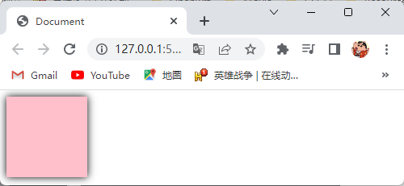

# 18.CSS的文字阴影属性

- CSS使用 `text-shadow` 属性给文本添加阴影效果。

- 语法：

  ```css
  选择器 {
      text-shadow: h-shadow v-shadow blur color;
  }
  ```

- `text-shadow` 属性的属性值取值分别为：

  - `h-shadow`（水平阴影的位置）：像素值（设置阴影在x轴上距离原点多少像素）。

  - `v-shadow`（垂直阴影的位置）：像素值（设置阴影在y轴上距离原点多少像素）。

    > 阴影在文本里的坐标轴如图所示：
    >
    > 

  - `blur`（模糊距离）：像素值（设置阴影的模糊距离为多少像素，默认值0px）。

  - `color`（阴影的颜色）：

    - 预定义的颜色值：`red`、`green`、`blue`、`black`、`white`、`gray` 等。
    - 十六进制颜色表示法：`#FF0000`、`#FF6600` 等。

    - RGB颜色表示法：`rgb(255,0,0)`、`rgb(100%,0,0)` 等。

    - RGBA颜色表示法：`rgba(255,0,0,0)`、`rgba(100%,0,0,0)` 等。

- 注意点：
  - 其他的属性值可以省略，但是水平阴影的位置和垂直阴影的位置的属性值必须要。
  - 使用 `text-shadow` 属性时，必须按上面语法格式中的顺序书写，不能更换顺序，并且各个属性值之间以空格隔开。
  - 文本的阴影是不占用空间的，不会影响其他文本排列。

- 演示代码：

  ```html
  <!DOCTYPE html>
  <html lang="en">
    <head>
      <meta charset="UTF-8" />
      <title>Document</title>
      <style>
        p {
          font-size: 28px;
          font-weight: 700;
          text-shadow: 0px 0px 10px black;
        }
      </style>
    </head>
    <body>
      <p>火影忍者</p>
    </body>
  </html>
  ```

- 演示结果：

  

# 19.CSS的浮动属性

## 19.1传统网页布局的三种方式

- 网页布局的本质就是用CSS来摆放盒子，把盒子摆放到相应位置。
- CSS提供了三种传统布局方式（简单来说就是盒子是如何进行排列的）：
  - 标准流：
    - 标准流又称文档流，是浏览器在渲染显示网页内容时默认采用的一套排版规则，规定了应该以何种方式排列元素。
    - 常见的标准流排版规则：
      - 块级元素：从上往下，垂直布局，独占一行。
      - 行内元素或行内块元素：从左往右，水平布局，碰到父元素边缘则自动换行。
  - 浮动：可以让原本垂直布局的块级元素变成水平布局。
  - 定位：可以让元素自由的摆放在网页的任意位置，一般用于盒子之间的层叠情况。
- 布局口诀：竖向上布局找标准流，横向上布局找浮动，空间上布局找定位。

## 19.2为什么需要浮动

- 当多个块级元素需要水平排列成一行时，可以把块级元素转换成行内块元素，但是两个行内块元素中间会有空白间隙，这是因为浏览器解析行内块或行内元素的时候，如果标签换行书写就会产生一个空格的距离，如果标签不换行书写就不会产生一个空格的距离，但是这样代码的可读性会极差，这时就需要浮动了，浮动可以让多个块级元素水平排列成一行，且中间没有空隙，如下图所示：

  

- 当两个块级元素需要水平排列成一行，且其中一个左对齐另一个右对齐时，可以把块级元素转换成行内块元素，并且给要右对齐的行内块元素添加左外边距，这样的做法当用户缩小浏览器页面时，要右对齐的行内块元素不会随着浏览器页面的缩小而移动，这时就需要浮动了，浮动可以让两个块级元素水平排列成一行，且其中一个左对齐另一个右对齐，并且不需要设置左外边距，还可以让要右对齐的行内块元素随着浏览器页面的缩小而移动，如下图所示：

  

## 19.3浮动的作用

- 早期浮动的作用就是图文环绕，如下图所示：

  

- 现在浮动的作用就是网页布局，也就是可以让多个块级元素在一行内排列显示，如下图所示：

  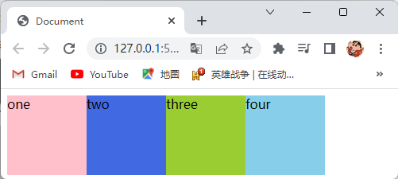

## 19.4浮动属性

- CSS使用 `float` 属性给盒子创建浮动框，并将其移动到一边，直到左边缘或右边缘触及到块级元素或另一个浮动框的边缘。

- 语法：

  ```css
  选择器 {
      float: 属性值;
  }
  ```

- 浮动属性的属性值取值为：

  - `none`（盒子不浮动）。
  - `left`（盒子向左浮动）。
  - `right`（盒子向右浮动）。

- 演示代码：

  ```html
  <!DOCTYPE html>
  <html lang="en">
  <head>
    <meta charset="UTF-8">
    <title>Document</title>
    <style>
      div {
        width: 100px;
        height: 100px;
        background-color: pink;
      }
      .left {
        float: left;
      }
      .right {
        float: right;
      }
    </style>
  </head>
  <body>
    <div class="left">盒子向左浮动</div>
    <div class="right">盒子向右浮动</div>
  </body>
  </html>
  ```

- 演示结果：

  

## 19.5浮动的特性

- 浮动的盒子会脱离标准流的控制（浮），并且移动到指定位置（动），我们俗称为脱标，而且浮动的盒子会不再保留原先的位置，如下图所示：

  

- 如果多个盒子都设置了浮动，则它们会按照属性值在一行内显示并且顶端对齐排列，如下图所示：

  

- 浮动的盒子是互相贴靠在一起的（不会有缝隙），如果父级盒子宽度装不下这些浮动的盒子，那么多出的盒子会另起一行对齐，如下图所示：

  

- 任何元素都可以浮动，不管原先是什么显示模式的元素，添加了浮动之后都具有行内块元素的特性。

- 浮动的元素不能通过 `text-align: center;` 属性或者 `margin: 0 auto;` 属性来实现水平居中。

- 浮动的元素只会压住它下面标准流的元素，但是不会压住下面标准流元素里面的文字或图片，因为浮动产生的目的最初是为了做文字环绕效果的， 文字会围绕浮动元素，如下图所示：

  

- 浮动的元素只会影响浮动的元素后面的标准流，不会影响前面的标准流，如下图所示：

  

- 一个盒子浮动了，理论上其余的兄弟盒子也要浮动，如：一个盒子里面有多个子盒子，如果其中一个盒子浮动了，那么其他兄弟盒子也应该浮动，以防止引起问题。

- 浮动的元素是不会发生外边距合并的。

- 浮动找浮动，下一个浮动的元素会在上一个浮动的元素的后面左右浮动。

## 19.6浮动元素经常和标准流父级搭配使用

- 为了约束浮动元素的位置，我们网页布局一般采取的策略是，先用标准流的父元素排列上下位置，之后内部的子元素再采取浮动排列左右位置，这符合网页布局第一准侧，如下图所示：

  

## 19.7常见的网页布局

- 常见的网页布局，如下图所示：

  

  

- 演示代码：

  ```html
  <!DOCTYPE html>
  <html lang="en">
    <head>
      <meta charset="UTF-8" />
      <title>Document</title>
      <style>
        * {
          padding: 0%;
          margin: 0%;
        }
        .top {
          height: 50px;
          background-color: gray;
        }
        .banner {
          width: 1245px;
          height: 100px;
          background-color: gray;
          margin: 15px auto;
        }
        .box {
          width: 1245px;
          height: 200px;
          margin: 15px auto;
        }
        .box li {
          float: left;
          width: 300px;
          height: 200px;
          background-color: gray;
          list-style: none;
          margin-right: 15px;
        }
        .box .last {
          margin-right: 0px;
        }
        .footer {
          height: 200px;
          background-color: gray;
        }
      </style>
    </head>
    <body>
      <div class="top">top</div>
      <div class="banner">banner</div>
      <div class="box">
        <ul>
          <li></li>
          <li></li>
          <li></li>
          <li class="last"></li>
        </ul>
      </div>
      <div class="footer">footer</div>
    </body>
  </html>
  ```

- 演示结果：

  

## 19.8为什么需要清除浮动

- 浮动的盒子经常和标准流父级搭配使用，但是父盒子很多情况下不方便给高度，如：一个产品列表，随着时期的不同，产品数量也不同，所需的父盒子大小也会随之改变，那么直接固定父盒子高度的形式显然就是不行的，但是子盒子浮动又不占有位置，最后父级盒子高度为0时，就会影响下面的标准流盒子，如下图所示：

  

## 19.9清除浮动的本质

- 清除浮动的本质就是清除浮动元素造成的影响，如果父盒子本身有高度，则不需要清除浮动，清除浮动之后，父盒子就会根据浮动的子盒子自动检测高度，父盒子有了高度，就不会影响下面的标准流的盒子了。

## 19.10清除浮动属性

- CSS使用 `clear` 属性来清除浮动元素造成的影响。

- 语法：

  ```css
  选择器 {
      clear: 属性值;
  }
  ```

- 清除浮动属性的属性值取值为：

  - `left`（不允许左侧有浮动元素，清除左侧浮动的影响）。
  - `right`（不允许右侧有浮动元素，清除右侧浮动的影响）。
  - `both`（同时清除左右两侧浮动的影响）。

- 注意点：
  - 在实际工作中，我们几乎只用清除浮动属性的 `both` 属性值。
  - 清除浮动的策略是闭合浮动，也就是只让浮动在父盒子内部影响，不影响父盒子外面的其他盒子。

## 19.11清除浮动的方法

### 19.11.1额外标签法

- 额外标签法也称为隔墙法（W3C推荐的做法，实际开发中不推荐），也就是在最后一个浮动的盒子后面添加一个额外的空标签，并给该标签添加清除浮动属性。

- 额外标签法的优缺点如下：

  - 优点：通俗易懂，书写方便。
  - 缺点：添加了无意义的标签，结构化较差。

- 注意点：在最后一个浮动的盒子后面添加一个额外的空标签，该标签的显示模式必须为块级元素。

- 演示代码：

  ```html
  <!DOCTYPE html>
  <html lang="en">
  <head>
    <meta charset="UTF-8">
    <title>Document</title>
    <style>
      .box {
        border: 5px solid black;
      }
      .fl {
        float: left;
        width: 200px;
        height: 100px;
        background-color: pink;
        margin-right: 15px;
      }
      .footer {
        height: 200px;
        background-color: purple;
      }
    </style>
  </head>
  <body>
    <div class="box">
      <div class="fl">浮动的子元素</div>
      <div class="fl">浮动的子元素</div>
      <!-- 在最后一个浮动的盒子后面添加一个额外的空标签，并给该标签添加清除浮动属性 -->
      <div style="clear: both;"></div>
    </div>
    <div class="footer">标准流的盒子</div>
  </body>
  </html>
  ```

- 演示结果：

  

### 19.11.2给父盒子添加 `overflow` 属性

- 可以给父盒子添加 `overflow` 属性，并将其属性值设置为 `hidden`、`auto`、`scroll` 的其中一个。

- 给父盒子添加 `overflow` 属性的优缺点如下：

  - 优点：没有增加标签，结构更简单，直接给标签添加 `overflow` 属性即可清除浮动。
  - 缺点：无法显示溢出的部分。

- 演示代码：

  ```html
  <!DOCTYPE html>
  <html lang="en">
  <head>
    <meta charset="UTF-8">
    <title>Document</title>
    <style>
      .box {
        border: 5px solid black;
        /* 给父盒子添加overflow属性 */
        overflow: hidden;
      }
      .fl {
        float: left;
        width: 200px;
        height: 100px;
        background-color: pink;
        margin-right: 15px;
      }
      .footer {
        height: 200px;
        background-color: purple;
      }
    </style>
  </head>
  <body>
    <div class="box">
      <div class="fl">浮动的子元素</div>
      <div class="fl">浮动的子元素</div>
    </div>
    <div class="footer">标准流的盒子</div>
  </body>
  </html>
  ```

- 演示结果：

  

### 19.11.3单伪元素清除法

- 单伪元素清除法就是额外标签法的升级版，也就是使用CSS的伪元素方法给父盒子里的末尾添加一个行内盒子，我们将它转换为块级盒子，并且给该盒子添加清除浮动属性，就间接实现了额外标签法。

- 单伪元素清除法的优缺点如下：

  - 优点：没有增加标签，结构更简单，直接给标签加类名即可清除浮动。
  - 缺点：需要单独照顾低版本浏览器。

- 演示代码：

  ```html
  <!DOCTYPE html>
  <html lang="en">
  <head>
    <meta charset="UTF-8">
    <title>Document</title>
    <style>
      .box {
        border: 5px solid black;
      }
      /* 使用CSS的伪元素方法给父盒子里的末尾添加一个行内盒子，我们将它转换为块级盒子，并且给该盒子添加清除浮动属性，就间接实现了额外标签法 */
      .box::after {
        content: "";
        /* 将该盒子转换为块级盒子 */
        display: block;
        /* 设置该盒子的高度为0px */
        height: 0;
        /* 给该盒子添加清除浮动属性 */
        clear: both;
        /* 将该盒子隐藏 */
        visibility: hidden;
      }
      /* 单独照顾低版本的浏览器 */
      .box {
        *zoom: 1;
      }
      .fl {
        float: left;
        width: 200px;
        height: 100px;
        background-color: pink;
        margin-right: 15px;
      }
      .footer {
        height: 200px;
        background-color: purple;
      }
    </style>
  </head>
  <body>
    <div class="box">
      <div class="fl">浮动的子元素</div>
      <div class="fl">浮动的子元素</div>
    </div>
    <div class="footer">标准流的盒子</div>
  </body>
  </html>
  ```

- 演示结果：

  

### 19.11.4双伪元素清除法

- 双伪元素清除法也是额外标签法的升级版，也就是使用CSS的伪元素方法给父盒子里的首尾两端分别添加一个行内盒子，我们将它们转换为表格，并且给最后一个盒子添加清除浮动属性，就间接实现了额外标签法。
- 双伪元素清除法的优缺点如下：
  - 优点：代码比单伪元素清除法更简洁。
  - 缺点：需要单独照顾低版本浏览器。

- 演示代码：

  ```html
  <!DOCTYPE html>
  <html lang="en">
  <head>
    <meta charset="UTF-8">
    <title>Document</title>
    <style>
      .box {
        border: 5px solid black;
      }
      /* 使用CSS的伪元素方法给父盒子里的首尾两端分别添加一个行内盒子，我们将它们转换为表格，并且给最后一个盒子添加清除浮动属性，就间接实现了额外标签法 */
      .box::before,
      .box::after {
        content: "";
        /* 将这两个盒子都转换为表格 */
        display: table;
      }
      /* 给最后一个盒子添加清除浮动属性 */
      .box::after {
        clear: both;
      }
      /* 单独照顾低版本的浏览器 */
      .box {
        *zoom: 1;
      }
      .fl {
        float: left;
        width: 200px;
        height: 100px;
        background-color: pink;
        margin-right: 15px;
      }
      .footer {
        height: 200px;
        background-color: purple;
      }
    </style>
  </head>
  <body>
    <div class="box">
      <div class="fl">浮动的子元素</div>
      <div class="fl">浮动的子元素</div>
    </div>
    <div class="footer">标准流的盒子</div>
  </body>
  </html>
  ```

- 演示结果：

  

# 20.CSS属性的书写顺序

- CSS属性的书写建议遵循以下顺序：

  1. 布局定位属性：`display`、`position`、`float`、`clear`、`visibility`、`overflow`。
  2. 自身属性：`width`、`hight`、`margin`、`padding`、`border`、`background`。
  3. 文本属性：`color`、`font`、`text-decoration`、`text-align`、`vertical-align`、`white-space`、`break-word`。
  4. 其他属性：`content`、`cursor`、`border-radius`、`box-shadow`、`text-shadow`、`background:linear-gradient`。

- 演示代码：

  ```css
  选择器 {
      display: block;
  	position: relative;
  	float: left;
  	width: 100px;
  	height: 100px;
  	margin: 0 10px;
  	padding: 20px 0;
  	font-family: Arial, 'Helvetica Neue', Helvetica, sans-serif;
  	color: #333;
  	background-color: rgba(0,0,0,.5);
  	border-radius: 10px;
  }
  ```

# 21.CSS的定位属性

## 21.1为什么需要定位

- 定位可以让盒子自由的在某个盒子内移动位置或者固定屏幕中某个位置，并且可以压住其他盒子，如下图所示：

  

  

  

## 21.2定位的组成

- 定位是由定位模式和边偏移组成的。

- 定位模式：

  - 定位模式用于指定一个元素在文档中的定位方式。

  - CSS使用 `position` 属性来设置元素在文档中的定位方式。

  - 语法：

    ```css
    选择器 {
        position: 属性值;
    }
    ```

  - `position` 属性的属性值取值为：

    - `static`（设置元素在文档中的定位方式为静态定位）。
    - `relative`（设置元素在文档中的定位方式为相对定位）。
    - `absolute`（设置元素在文档中的定位方式为绝对定位）。
    - `fixed`（设置元素在文档中的定位方式为固定定位）。
    - `sticky`（设置元素在文档中的定位方式为粘性定位）。

  - 注意点：如果只设置了定位方式，没有设置边偏移，那么元素的位置不会改变。

- 边偏移：

  - 边偏移就是设置定位的盒子移动到最终的位置。

  - CSS使用 `top`、`bottom`、`left`、`right` 属性来设置定位的盒子的顶端偏移、底端偏移、左侧偏移、右侧偏移。

  - 语法：

    ```css
    选择器 {
        top: 属性值;
        bottom: 属性值;
        left: 属性值;
        right: 属性值;
    }
    ```

  - `top`、`bottom`、`left`、`right` 属性的属性值分别取值为：

    - `top` 属性：像素值（设置定位的元素相对于父元素上边线的距离）。
    - `bottom` 属性：像素值（设置定位的元素相对于父元素下边线的距离）。
    - `left` 属性：像素值（设置定位的元素相对于父元素左边线的距离）。
    - `right` 属性：像素值（设置定位的元素相对于父元素右边线的距离）。

  - 边偏移的顶端偏移、底端偏移、左侧偏移、右侧偏移，如下图所示：

    

  - 注意点：
    - `top`、`bottom`、`left`、`right` 属性的属性值可以为负值。
    - 设置边偏移时，如果 `left` 和 `right` 属性都有，以 `left` 属性为准，如果 `top` 和 `bottom` 属性都有，以 `top` 属性为准，所以我们在设置定位的盒子的边偏移时，水平方向和垂直方向各选一个使用即可，选取的原则一般为就近原则。

## 21.3静态定位

- 静态定位是元素的默认定位方式，简单理解就是无定位的意思。

- 静态定位的特点：静态定位按照标准流特性摆放位置，它的偏移值不生效。

- 演示代码：

  ```html
  <!DOCTYPE html>
  <html lang="en">
    <head>
      <meta charset="UTF-8" />
      <title>Document</title>
      <style>
        div {
          /* 设置静态定位 */
          position: static;
          top: 100px;
          left: 100px;
          width: 100px;
          height: 100px;
          background-color: pink;
        }
      </style>
    </head>
    <body>
      <p>一个段落一个段落一个段落一个段落一个段落一个段落一个段落一个段落一个段落一个段落一个段落一个段落一个段落一个段落一个段落一个段落一个段落一个段落</p>
      <div></div>
      <p>一个段落一个段落一个段落一个段落一个段落一个段落一个段落一个段落一个段落一个段落一个段落一个段落一个段落一个段落一个段落一个段落一个段落一个段落</p>
    </body>
  </html>
  ```

- 演示结果：

  

## 21.4相对定位

- 相对定位是元素在移动位置的时候，是相对于它原来的位置来说的定位（自恋型）。

- 相对定位的特点：

  - 设置了相对定位的盒子，是相对于自己原来的位置来移动的，移动位置的时候的参照点是自己原来的位置点，如下图所示：

    

  - 设置了相对定位的盒子，它在标准流的位置会继续占有，后面的盒子仍然以标准流的方式对待它，如下图所示：

    

  - 设置了相对定位的盒子需要配合边偏移属性来实现移动。

- 演示代码：

  ```html
  <!DOCTYPE html>
  <html lang="en">
    <head>
      <meta charset="UTF-8" />
      <title>Document</title>
      <style>
        .box {
          /* 设置为相对定位 */
          position: relative;
          top: 50px;
          left: 150px;
          width: 100px;
          height: 100px;
          background-color: pink;
        }
        .box1 {
          width: 200px;
          height: 100px;
          background-color: purple;
        }
      </style>
    </head>
    <body>
      <div class="box"></div>
      <div class="box1"></div>
    </body>
  </html>
  ```

- 演示结果：

  

## 21.5绝对定位

- 绝对定位是元素在移动位置的时候，是相对于它祖先元素来说的定位（拼爹型）。

- 绝对定位的特点：

  - 设置了绝对定位的盒子，如果没有祖先元素或者祖先元素没有定位，则以浏览器窗口为参照进行定位，如下图所示：

    

  - 设置了绝对定位的盒子，如果祖先元素有定位（相对、绝对、固定定位），则以最近一级的有定位的祖先元素为参考点移动位置，如下图所示：

    

  - 设置了绝对定位的盒子，它不会继续占有标准流的位置（脱标），并且脱标的程度大于浮动（会压住浮动），如下图所示：

    

- 演示代码：

  ```html
  <!DOCTYPE html>
  <html lang="en">
    <head>
      <meta charset="UTF-8" />
      <title>Document</title>
      <style>
        .box {
          position: relative;
          width: 300px;
          height: 200px;
          background-color: pink;
        }
        .box1 {
          position: absolute;
          top: 150px;
          width: 200px;
          height: 100px;
          background-color: gray;
        }
        .fl {
          float: left;
          width: 100px;
          height: 20px;
          padding: 80px;
          background-color: purple;
        }
      </style>
    </head>
    <body>
      <div class="box">
        祖先元素
        <div class="box1">绝对定位的盒子</div>
      </div>
      <div class="fl">浮动的盒子</div>
    </body>
  </html>
  ```

- 演示结果：

  

## 21.6子绝父相

- 子绝父相的意思是子级是绝对定位的话，那么父级就要用相对定位。
- 子绝父相的由来：子级是绝对定位时，它不会占有位置，可以放到父盒子里面的任何一个地方，不会影响其他的兄弟盒子，但是父盒子需要添加定位，来限制子盒子在父盒子内显示，又因为父盒子在布局时，需要占有位置，因此父元素只能是相对定位。
- 注意点：子绝父相不是永远不变的，如果父盒子不需要占有位置，子绝父绝也会遇到。

## 21.7固定定位

- 固定定位是元素在移动位置的时候，是相对于浏览器的可视窗口来说的定位（死心眼定位）。

- 固定定位的特点：

  - 设置了固定定位的盒子，是以浏览器的可视窗口为参照点来移动元素，跟父元素没有任何关系，并且不随滚动条滚动，如下图所示：

    

  - 设置了固定定位的盒子，它不会继续占有标准流的位置（脱标），并且脱标的程度大于浮动（会压住浮动），如下图所示：

    

- 固定定位的小技巧：

  - 设置盒子永远贴着版心的右侧，不会随着浏览器视图的缩放而拉开，步骤如下：
    1. 给固定定位的盒子设置 `left: 50%;` 属性，使其移动到浏览器可视区域一半的位置。
    2. 给固定定位的盒子设置 `margin-left: 版心宽度的一半;` 属性，使其移动到版心的右侧。

- 演示代码：

  ```html
  <!DOCTYPE html>
  <html lang="en">
    <head>
      <meta charset="UTF-8" />
      <title>Document</title>
      <style>
        .box {
          width: 800px;
          height: 1200px;
          margin: 0px auto;
          background-color: pink;
        }
        .box1 {
          position: fixed;
          top: 8px;
          left: 50%;
          width: 100px;
          height: 200px;
          margin-left: 400px;
          background-color: skyblue;
        }
      </style>
    </head>
    <body>
      <div class="box">版心</div>
      <div class="box1">固定定位的盒子</div>
    </body>
  </html>
  ```

- 演示结果：

  

## 21.8粘性定位

- 粘性定位可以被认为是相对定位和固定定位的混合。

- 粘性定位的特点：

  - 设置了粘性定位的盒子，它会随着滚动条滚动，并且它在标准流的位置会继续占有，后面的盒子仍然以标准流的方式对待它（相对定位的特点），如下图所示：

    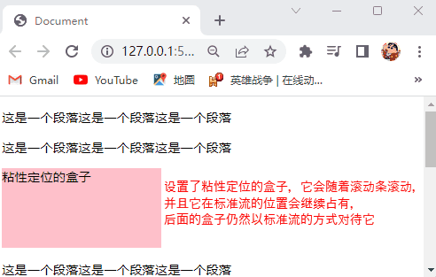

  - 设置了粘性定位的盒子，是以浏览器的可视窗口为参照点，跟父元素没有关系（固定定位的特点），如下图所示：

    

  - 设置了粘性定位的盒子，它的边偏移不会改变盒子的位置，它的边偏移的作用是当粘性定位的盒子随着滚动条滚动，直到粘性定位的盒子的边到浏览器可视区域的边的距离和设置的边偏移的值一样，这时粘性定位的盒子就不会随着滚动条滚动（固定定位的特点），如下图所示：

    

- 注意点：

  - 设置粘性定位，必须添加边偏移才会有效。
  - 粘性定位兼容性较差，IE不支持。
  - 设置了粘性定位的盒子，它的边偏移不会改变盒子的位置，但是我们可以通过使用盒子的外边距来改变粘性定位的盒子的位置。

- 演示代码：

  ```html
  <!DOCTYPE html>
  <html lang="en">
    <head>
      <meta charset="UTF-8" />
      <title>Document</title>
      <style>
        div {
          position: sticky;
          top: 30px;
          width: 200px;
          height: 100px;
          margin-left: 100px;
          background-color: pink;
        }
      </style>
    </head>
    <body>
      <p>&nbsp;</p>
      <p>&nbsp;</p>
      <p>&nbsp;</p>
      <p>&nbsp;</p>
      <p>&nbsp;</p>
      <div>粘性定位的盒子</div>
      <p>&nbsp;</p>
      <p>&nbsp;</p>
      <p>&nbsp;</p>
      <p>&nbsp;</p>
      <p>&nbsp;</p>
      <p>&nbsp;</p>
      <p>&nbsp;</p>
      <p>&nbsp;</p>
      <p>&nbsp;</p>
      <p>&nbsp;</p>
    </body>
  </html>
  ```

- 演示结果：

  

## 21.9定位的叠放次序

- 在使用定位布局时，可能会出现元素重叠的情况，此时可以使用 `z-index` 属性来控制元素的前后次序（z轴）。

- 语法：

  ```css
  选择器 {
      z-index: 属性值;
  }
  ```

- `z-index` 属性的属性值取值为：

  - `auto`（默认值，按照书写顺序，后来居上）。
  - 正整数、负整数、0（数值越大，定位的盒子越靠上）。

- 注意点：

  - 数字后面不能加单位。
  - 只有定位的盒子才有 `z-index` 属性。

- 演示代码：

  ```html
  <!DOCTYPE html>
  <html lang="en">
    <head>
      <meta charset="UTF-8" />
      <title>Document</title>
      <style>
        div {
          position: absolute;
          width: 100px;
          height: 100px;
        }
        .box {
          background-color: pink;
        }
        .box1 {
          top: 30px;
          background-color: red;
        }
        .box2 {
          top: 160px;
          background-color: skyblue;
        }
        .box3 {
          z-index: 1;
          top: 190px;
          background-color: yellow;
        }
        .box4 {
          top: 220px;
          background-color: purple;
        }
      </style>
    </head>
    <body>
      <div class="box">one</div>
      <div class="box1">two</div>
      <div class="box2">three</div>
      <div class="box3">four</div>
      <div class="box4">five</div>
    </body>
  </html>
  ```

- 演示结果：

  

## 21.10绝对定位的盒子居中算法

- 加了绝对定位的盒子不能通过 `margin:0 auto;` 属性来实现水平居中，但是可以通过以下步骤来实现：

  - 给绝对定位的盒子设置 `left: 50%;` 属性，使其移动到浏览器可视区域一半的位置。
  - 给绝对定位的盒子设置 `margin-left: -绝对定位的盒子宽度的一半;` 属性，使其水平居中。

- 演示代码：

  ```html
  <!DOCTYPE html>
  <html lang="en">
    <head>
      <meta charset="UTF-8" />
      <title>Document</title>
      <style>
        div {
          position: absolute;
          left: 50%;
          width: 300px;
          height: 100px;
          margin-left: -150px;
          background-color: pink;
        }
      </style>
    </head>
    <body>
      <div>水平居中对齐</div>
    </body>
  </html>
  ```

- 演示结果：

  

## 21.11定位的特性

- 添加了绝对定位或固定定位的盒子，不管该盒子原先是什么显示模式的盒子，都会具有行内块元素的特性。

- 添加了相对定位或粘性定位的盒子，该盒子原先是什么显示模式的盒子，就是什么显示模式的盒子。

- 添加了绝对定位或固定定位的盒子，不会发生外边距合并，因为它们脱标了。

- 添加了绝对定位或固定定位的盒子，会压住下面标准流所有的内容，如下图所示：

  

# 22.CSS的显示与隐藏属性

## 22.1 `display` 属性

- CSS使用 `display` 属性来设置元素的显示与隐藏。

- 语法：

  ```css
  选择器 {
      display: 属性值;
  }
  ```

- `display` 属性的属性值取值为：

  - `none`（使元素隐藏）。
  - `black`（除了可以将元素转换为块级元素之外，同时还有显示元素的意思）。

- 注意点：使用 `display` 属性隐藏元素之后，该元素不会再占用原来的位置（脱标）。

- 演示代码：

  ```html
  <!DOCTYPE html>
  <html lang="en">
    <head>
      <meta charset="UTF-8" />
      <title>Document</title>
      <style>
        div {
          width: 200px;
          height: 200px;
          background-color: pink;
        }
        .bg {
          background-color: skyblue;
        }
        .yc {
          display: none;
        }
      </style>
    </head>
    <body>
      <div class="yc">熊大</div>
      <div class="bg">熊二</div>
    </body>
  </html>
  ```

- 演示结果：

  

## 22.2 `visibility` 属性

- CSS使用 `visibility` 属性来设置元素的显示与隐藏。

- 语法：

  ```css
  选择器 {
      visibility: 属性值;
  }
  ```

- `visibility` 属性的属性值取值为：

  - `hidden`（使元素隐藏）。
  - `visible`（使元素显示）。

- 注意点：使用 `visibility` 属性隐藏元素之后，该元素会继续占用原来的位置。

- 演示代码：

  ```html
  <!DOCTYPE html>
  <html lang="en">
    <head>
      <meta charset="UTF-8" />
      <title>Document</title>
      <style>
        div {
          width: 200px;
          height: 200px;
          background-color: pink;
        }
        .bg {
          background-color: skyblue;
        }
        .yc {
          visibility: hidden;
        }
      </style>
    </head>
    <body>
      <div class="yc">熊大</div>
      <div class="bg">熊二</div>
    </body>
  </html>
  ```

- 演示结果：

  

## 22.3 `overflow` 属性

- CSS使用 `overflow` 属性指定了如果内容溢出一个元素的框（超过其指定高度及宽度）时，会发生什么。

  > 注：溢出部分指的是元素里的内容部分超出了元素的范围。

- 语法：

  ```css
  选择器 {
      overflow: 属性值;
  }
  ```

- `overflow` 属性的属性值取值为：

  - `visible`（默认值，溢出的部分可见）。
  - `hidden`（溢出的部分不可见）。
  - `scroll`（不管是否有溢出，都会显示滚动条）。
  - `auto`（如果有溢出显示滚动条，如果没有溢出不显示滚动条）。

- 注意点：给有定位的盒子使用 `overflow` 属性时，要注意 `overflow` 属性会隐藏溢出的部分。

- 演示代码：

  ```html
  <!DOCTYPE html>
  <html lang="en">
    <head>
      <meta charset="UTF-8" />
      <title>Document</title>
      <style>
        div {
          width: 200px;
          height: 100px;
          margin-bottom: 50px;
          border: 2px solid pink;
        }
        .one {
          /* 溢出的部分可见 */
          overflow: visible;
        }
        .two {
          /* 溢出的部分不可见 */
          overflow: hidden;
        }
        .three {
          /* 不管是否有溢出，都会显示滚动条 */
          overflow: scroll;
        }
        .four {
          /* 如果有溢出显示滚动条，如果没有溢出不显示滚动条 */
          overflow: auto;
        }
      </style>
    </head>
    <body>
      <div class="one">这是一个文字这是一个文字这是一个文字这是一个文字这是一个文字这是一个文字这是一个文字这是一个文字这是一个文字这是一个文字这是一个文字这是一个文字</div>
      <div class="two">这是一个文字这是一个文字这是一个文字这是一个文字这是一个文字这是一个文字这是一个文字这是一个文字这是一个文字这是一个文字这是一个文字这是一个文字</div>
      <div class="three">这是一个文字这是一个文字</div>
      <div class="four">这是一个文字这是一个文字这是一个文字这是一个文字这是一个文字这是一个文字这是一个文字这是一个文字这是一个文字这是一个文字这是一个文字这是一个文字</div>
    </body>
  </html>
  ```

- 演示结果：

  

# 23.CSS的高级技巧

## 23.1精灵图

### 23.1.1什么是精灵图

- 将多张小图片，合并成一张大图片，这张大图片称之为精灵图。

### 23.1.2为什么需要精灵图 

- 一个网页中往往会应用很多小的背景图像作为修饰，当网页中的图像过多时，服务器就会频繁地接收和发送 请求图片，造成服务器请求压力过大，这将大大降低页面的加载速度，因此，为了有效地减少服务器接收和发送请求的次数，提高页面的加载速度，出现了CSS精灵技术（也称 CSS Sprites、CSS 雪碧）。
- CSS精灵技术的核心原理就是将网页中的一些小背景图像整合到一张大图中，这样服务器只需要一次请求就可以了。

### 23.1.3精灵图的使用

- 使用精灵图的步骤：
  1. 创建一个盒子，设置该盒子的尺寸和小背景图片的尺寸相同。
  2. 通过使用 `background-image` 属性将精灵图设置为盒子的背景图片。
  3. 通过使用 `background-position` 属性来修改背景图片的位置使其小背景图片显示出来。

- 注意点：因为一般情况下都是将精灵图往上往左移动，所以两个坐标数值基本是负值。

- 演示代码：

  ```html
  <!DOCTYPE html>
  <html lang="en">
    <head>
      <meta charset="UTF-8" />
      <title>Document</title>
      <style>
        div {
          width: 56px;
          height: 56px;
          background: url(./imgs/sprites.png) no-repeat -184px 0px;
        }
      </style>
    </head>
    <body>
      <div></div>
    </body>
  </html>
  ```

- 演示结果：

  

## 23.2字体图标

### 23.2.1字体图标的产生

- 精灵图有很多优点，但是有一些缺点很明显，分别是：
  - 图片文件还是比较大。
  - 图片本身放大或缩小会失真。
  - 一旦图片制作完成想要更换非常复杂。
- 我们可以使用字体图标来解决精灵图的缺点，因为字体图标的本质属于字体，但是显示的是图标，这样我们就可以使用文本属性来修改图标。
- 字体图标的使用场景：主要用于显示网页中通用、常用的一些小图标。

### 23.2.2字体图标的优点

- 字体图标的优点有：
  - 轻量级：一个图标字体要比一系列的图像要小，一旦字体加载了，图标就会马上渲染出来，减少了服务器请求。
  - 灵活性：本质其实是文字，可以很随意的改变颜色、产生阴影、透明效果、旋转等。
  - 兼容性：几乎支持所有的浏览器，请放心使用。
- 注意点：字体图标不能替代精灵技术，只是对工作中图标技术的提升和优化，如果遇到一些结构和样式比较简单的小图标，就用字体图标，如果遇到一些结构和样式复杂一点的小图片，就用精灵图。

### 23.2.3字体图标的使用

- 字体图标的使用步骤：

  1. 下载字体图标：

     - 推荐两个下载字体图标的网站：

       - IcoMoon字库：https://icomoon.io/。

         > 注：IcoMoon成立于2011年，推出了第一个自定义图标字体生成器，它允许用户选择所需要的图标，使它们成 一字型，该字库内容种类繁多，非常全面，唯一的遗憾是国外服务器，打开网速较慢。

       - 阿里iconfont字库：https://www.iconfont.cn/。

         > 注：这个是阿里巴巴M2UX的一个iconfont字体图标字库，包含了淘宝图标库和阿里巴巴图标库，可以使用AI制作图标上传生成，重点是免费！

     - 在IcoMoon字库下载字体图标，演示如下：

       

     - 在阿里iconfont字库下载字体图标，演示如下：

       
  
  2. 引入字体图标：
  
     - 引入从IcoMoon字库下载的字体图标，演示如下：
  
       
  
     - 引入从阿里iconfont字库下载的字体图标，演示如下：
  
       
  
  3. 字体图标的追加：
  
     - IcoMoon字库字体图标的追加，演示如下：
  
       
  
     - 阿里Iconfont字库字体图标的追加，演示如下：
  
       

- 演示代码：

  ```html
  <!DOCTYPE html>
  <html lang="en">
    <head>
      <meta charset="UTF-8" />
      <title>Document</title>
      <style>
        @font-face {
          font-family: "icomoon";
          src: url("fonts/icomoon.eot?puu3aa");
          src: url("fonts/icomoon.eot?puu3aa#iefix") format("embedded-opentype"),
            url("fonts/icomoon.ttf?puu3aa") format("truetype"),
            url("fonts/icomoon.woff?puu3aa") format("woff"),
            url("fonts/icomoon.svg?puu3aa#icomoon") format("svg");
          font-weight: normal;
          font-style: normal;
          font-display: block;
        }
        span {
          font-family: icomoon;
          font-size: 30px;
          color: red;
        }
      </style>
    </head>
    <body>
      <span></span>
    </body>
  </html>
  ```

- 演示结果：

  

### 23.2.4字体图标的加载原理

- 字体图标的加载原理：将全部的字体图标放入一个字体文件中，这样我们只需要调用一次服务器，即可获得全部的字体图标。

## 23.3CSS实现三角形

- CSS实现三角形的原理：给一个宽高为0的盒子设置边框，那么只要边框足够粗，就可以呈现三角形效果，如果只需要一个三角形，那么对其他三个边框设置透明色即可。
- 注意点：三角形的大小由边框的粗细来控制。

- 演示代码：

  ```html
  <!DOCTYPE html>
  <html lang="en">
    <head>
      <meta charset="UTF-8" />
      <title>Document</title>
      <style>
        div {
          width: 0;
          height: 0;
        }
        .box {
          border-top: 20px solid pink;
          border-bottom: 20px solid red;
          border-left: 20px solid black;
          border-right: 20px solid green;
        }
        .box1 {
          border: 20px solid transparent;
          border-bottom-color: pink;
        }
      </style>
    </head>
    <body>
      <div class="box"></div>
      <hr>
      <div class="box1"></div>
    </body>
  </html>
  ```

- 演示结果：

  

## 23.4CSS用户界面样式

### 23.4.1什么是用户界面样式

- 用户界面样式就是更改一些用户操作样式，以便提高用户的体验。

### 23.4.2鼠标样式

- CSS使用 `cursor` 属性来设置鼠标光标在元素上时显示的样式。

- 语法：

  ```css
  选择器 {
      cursor: 属性值;
  }
  ```

- `cursor` 属性的属性值取值为：

  - `default`（默认值，设置鼠标光标在元素上时显示为箭头）。
  - `pointer`（设置鼠标光标在元素上时显示为小手，提示用户可以点击）。
  - `text`（设置鼠标光标在元素上时显示为工字形，提示用户可以选择文字）。
  - `move`（设置鼠标光标在元素上时显示为十字光标，提示用户可以移动）。
  - `not-allowed`（设置鼠标光标在元素上时显示为禁止图标，提示用户不可以点击）。

- 演示代码：

  ```html
  <!DOCTYPE html>
  <html lang="en">
    <head>
      <meta charset="UTF-8" />
      <title>Document</title>
    </head>
    <body>
      <ul>
        <li style="cursor: default;">默认鼠标样式</li>
        <li style="cursor: pointer;">小手鼠标样式</li>
        <li style="cursor: text;">工字形鼠标样式</li>
        <li style="cursor: move;">十字光标鼠标样式</li>
        <li style="cursor: not-allowed;">禁止图标鼠标样式</li>
      </ul>
    </body>
  </html>
  ```

- 演示结果：

  

### 23.4.3轮廓线

- CSS使用 `outline` 属性来设置表单控件获取光标时显示的默认样式的边框是否去除。

- 语法：

  ```css
  选择器 {
      outline: 属性值;
  }
  ```

- `outline` 属性的属性值取值为：

  - `none`（去除表单控件获取光标时显示的默认样式的边框）。
  - 0（去除表单控件获取光标时显示的默认样式的边框）。

- 演示代码：

  ```html
  <!DOCTYPE html>
  <html lang="en">
    <head>
      <meta charset="UTF-8" />
      <title>Document</title>
      <style>
        input {
          display: block;
        }
        .one {
          outline: none;
        }
      </style>
    </head>
    <body>
      <input type="text"><br>
      <input type="text" class="one">
    </body>
  </html>
  ```

- 演示结果：

  

### 23.4.4防止拖拽文本域

- CSS使用 `resize` 属性来设置文本域是否可以拖拽。

- 语法：

  ```css
  选择器 {
      resize: 属性值;
  }
  ```

- `resize` 属性的属性值取值为：`none`（设置文本域不可以被拖拽）。

- 演示代码：

  ```html
  <!DOCTYPE html>
  <html lang="en">
    <head>
      <meta charset="UTF-8" />
      <title>Document</title>
      <style>
        #one {
          resize: none;
        }
      </style>
    </head>
    <body>
      <textarea name="" id="" cols="30" rows="10"></textarea><br>
      <textarea name="" id="one" cols="30" rows="10"></textarea>
    </body>
  </html>
  ```

- 演示结果：

  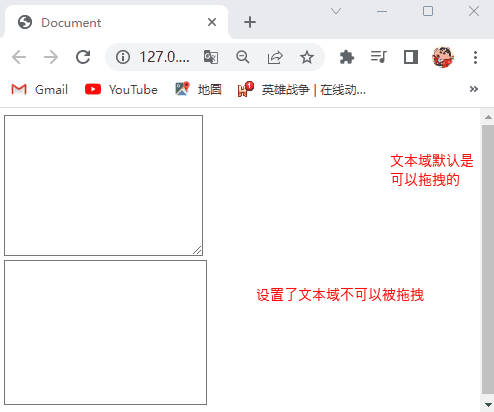

## 23.5 `vertical-align` 属性

- CSS使用 `vertical-align` 属性来设置行内或行内块显示模式的元素的垂直对齐方式。

- 语法：

  ```css
  选择器 {
      vertical-align: 属性值;
  }
  ```

- `vertical-align` 属性的属性值取值为：

  - `baseline`（默认值，设置行内或行内块元素基于基线对齐）。

    > 注1：基线如下图所示：
    >
    > 
    >
    > 注2：只有文本才拥有基线。

  - `top`（设置行内或行内块元素基于顶线对齐）。

  - `middle`（设置行内或行内块元素基于中线对齐）。

  - `bottom`（设置行内或行内块元素基于底线对齐）。

- `vertical-align` 属性的应用场景：

  - 用于设置图片与文字垂直对齐的问题，如图所示：

    

  - 用于设置图片与表单控件垂直对齐的问题，如图所示：

    

- 注意点：`vertical-align` 属性，只能给行内或行内块元素设置。

- `vertical-align` 属性的小bug：

  - 当给一个盒子添加一张图片，并且给该盒子设置了边框，此时图片底侧会有一个空白缝隙，是因为行内块元素会和文字的基线对齐，如下图所示：

    

  - 解决方案：
    - 给图片添加 `vertical-align` 属性，将其垂直对齐方式改成基于顶线对齐、基于中线对齐、基于底线对齐。
    - 将图片转换成块级元素。

- 演示代码：

  ```html
  <!DOCTYPE html>
  <html lang="en">
    <head>
      <meta charset="UTF-8" />
      <title>Document</title>
      <style>
        div {
          border: 2px solid pink;
        }
        img {
          border: 1px solid red;
          vertical-align: middle;
        }
      </style>
    </head>
    <body>
      <div>
         NoobCaptain
      </div>
    </body>
  </html>
  ```

- 演示结果：

  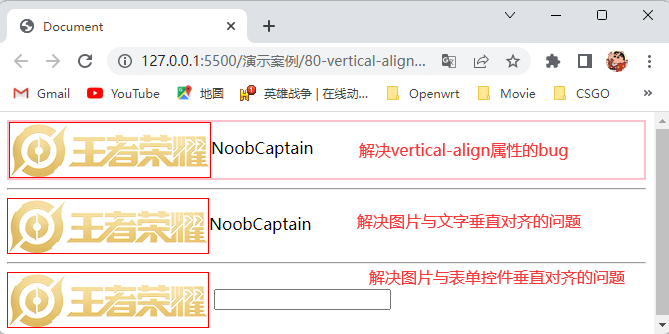

## 23.6溢出文字用省略号代替

### 23.6.1单行文本溢出显示省略号

- 设置单行文本溢出显示省略号的步骤：

  1. 使用 `white-space: nowrap;` 属性将文本强制一行内显示。
  2. 使用 `overflow: hidden;` 属性将文本溢出的部分隐藏。
  3. 使用 `text-overflow: ellipsis;` 属性将溢出的文字用省略号替代。

- 演示代码：

  ```html
  <!DOCTYPE html>
  <html lang="en">
    <head>
      <meta charset="UTF-8" />
      <title>Document</title>
      <style>
        div {
          width: 100px;
          height: 100px;
          background-color: pink;
          /* 将文本强制一行内显示 */
          white-space: nowrap;
          /* 将文本溢出的部分隐藏 */
          overflow: hidden;
          /* 将溢出的文字用省略号替代 */
          text-overflow: ellipsis;
        }
      </style>
    </head>
    <body>
      <div>这是一段文字这是一段文字这是一段文字这是一段文字这是一段文字</div>
    </body>
  </html>
  ```

- 演示结果：

  

### 23.6.2多行文本溢出显示省略号

- 设置多行文本溢出显示省略号的步骤：
  1. 使用 `overflow: hidden;` 属性将文本溢出的部分隐藏。
  2. 使用 `text-overflow: ellipsis;` 属性将溢出的文字用省略号替代。
  3. 使用 `display: -webkit-box;` 属性将盒子模型改为弹性伸缩盒子模型。
  4. 使用 `-webkit-line-clamp: 数字;` 属性设置在一个块级元素中显示多少行文本。
  5. 使用 `-webkit-box-orient: vertical;` 属性设置或检索弹性伸缩盒子模型里的子元素的排列方式。

- 注意点：

  - 多行文本溢出显示省略号，有较大兼容性问题，适合于webkit浏览器或移动端。

  - `-webkit-line-clamp: 数字;` 属性控制省略号在第几行显示。

  - 设置多行文本溢出显示省略号时，如果设置了第二行文本溢出显示省略号，那么如果有第三行的文字它会照常显示，这时我们需要将元素的高度设置为刚刚好能显示两行的高度，如下图所示：

    

- 演示代码：

  ```html
  <!DOCTYPE html>
  <html lang="en">
    <head>
      <meta charset="UTF-8" />
      <title>Document</title>
      <style>
        div {
          float: left;
          width: 100px;
          height: 45px;
          background-color: pink;
          overflow: hidden;
          text-overflow: ellipsis;
          display: -webkit-box;
          -webkit-line-clamp: 2;
          -webkit-box-orient: vertical;
        }
      </style>
    </head>
    <body>
      <div>这是一段文字这是一段文字这是一段文字</div>
    </body>
  </html>
  ```

- 演示结果：

  

## 23.7常见的布局技巧

### 23.7.1外边距负值的运用

- 当多个盒子在一行上紧挨着排列时，给每个盒子都设置一个边框，这时紧挨着的两个盒子的边框会相对于其他边框更粗，这时我们可以使用 `margin` 属性使其紧挨着的两个盒子的边框重叠在一起，这样边框就不会变粗了，如下图所示：

  

- 演示代码：

  ```html
  <!DOCTYPE html>
  <html lang="en">
    <head>
      <meta charset="UTF-8" />
      <title>Document</title>
      <style>
        li {
          float: left;
          width: 100px;
          height: 200px;
          border: 1px solid pink;
          margin-left: -1px;
          list-style: none;
        }
      </style>
    </head>
    <body>
      <ul>
        <li></li>
        <li></li>
        <li></li>
        <li></li>
        <li></li>
      </ul>
    </body>
  </html>
  ```

- 演示结果：

  

### 23.7.2定位的运用

- 当我们使用 `margin` 属性使其紧挨着的两个盒子的边框重叠在一起时，如果我们想设置当鼠标经过盒子时盒子的边框颜色变色，这时会出现重叠在下面的边框不会显示出来，这时我们可以设置当鼠标经过盒子时给盒子添加相对定位，这样盒子的边框都会显示出来，如下图所示：

  

- 演示代码：

  ```html
  <!DOCTYPE html>
  <html lang="en">
    <head>
      <meta charset="UTF-8" />
      <title>Document</title>
      <style>
        li {
          float: left;
          width: 100px;
          height: 200px;
          border: 1px solid pink;
          margin-left: -1px;
          list-style: none;
        }
        li:hover {
          position: relative;
          border-color: green;
        }
      </style>
    </head>
    <body>
      <ul>
        <li></li>
        <li></li>
        <li></li>
        <li></li>
        <li></li>
      </ul>
    </body>
  </html>
  ```

- 演示结果：

  

### 23.7.3浮动的特性运用

- 我们可以使用浮动的特性来做文字环绕的效果。

- 演示代码：

  ```html
  <!DOCTYPE html>
  <html lang="en">
    <head>
      <meta charset="UTF-8" />
      <title>Document</title>
      <style>
        div {
          width: 500px;
          height: 50px;
          background-color: pink;
        }
        img {
          float: left;
          height: 50px;
        }
      </style>
    </head>
    <body>
      <div>
        
        王者荣耀王者荣耀王者荣耀王者荣耀王者荣耀王者荣耀王者荣耀王者荣耀
      </div>
    </body>
  </html>
  ```

- 演示结果：

  

### 23.7.4行内块显示模式的运用

- 在做页码跳转的时候我们可以使用行内块显示模式的特性来简化代码。

- 演示代码：

  ```html
  <!DOCTYPE html>
  <html lang="en">
    <head>
      <meta charset="UTF-8" />
      <title>Document</title>
      <style>
        div {
          text-align: center;
        }
        a {
          display: inline-block;
          width: 35px;
          height: 35px;
          background-color: #ccc;
          color: black;
          font-size: 14px;
          text-decoration: none;
          text-align: center;
          line-height: 35px;
        }
        .before,
        .next {
          width: 100px;
        }
        .clear {
          background-color: #fff;
        }
        input {
          width: 33px;
          height: 33px;
          border: 1px solid #ccc;
          outline: none;
        }
        button {
          width: 45px;
          height: 35px;
          border: 0;
          background-color: #ccc;
        }
      </style>
    </head>
    <body>
      <div>
        <a href="#" class="before">&lt;&lt;上一页</a>
        <a href="#">1</a>
        <a href="#">2</a>
        <a href="#">3</a>
        <a href="#">4</a>
        <a href="#">5</a>
        <a href="#">6</a>
        <a href="#">7</a>
        <a href="#">8</a>
        <a href="#">9</a>
        <a href="#" class="clear">···</a>
        <a href="#" class="next">下一页&gt;&gt;</a>
        到第
        <input type="text" name="" id="">
        页
        <button>确定</button>
      </div>
    </body>
  </html>
  ```

- 演示结果：

  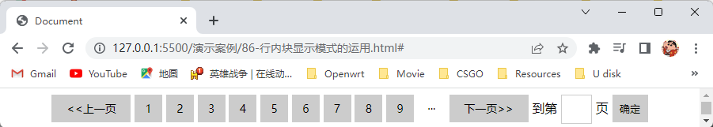

### 23.7.5CSS三角形的运用

- 我们可以将一个CSS三角形的下边框和左边框的粗细设置为0，并让上边框粗一点，右边框细一点，这样我们就可以得到一个直角三角形，然后我们可以将直角三角形和长方形组合形成一个梯形。

- 演示代码：

  ```html
  <!DOCTYPE html>
  <html lang="en">
    <head>
      <meta charset="UTF-8" />
      <title>Document</title>
      <style>
        div {
          position: relative;
          width: 198px;
          height: 28px;
          border: 1px solid red;
          line-height: 30px;
        }
        .one {
          display: inline-block;
          width: 120px;
          height: 28px;
          background-color: red;
          text-align: center;
          color: #fff;
          font-weight: 700;
        }
        i {
          position: absolute;
          left: 105px;
          width: 0;
          height: 0;
          border-width: 28px 15px 0px 0px;
          border-style: solid;
          border-color: transparent white transparent transparent;
        }
      </style>
    </head>
    <body>
      <div>
        <span class="one">￥1399<i></i></span>
        <span>￥1899</span>
      </div>
    </body>
  </html>
  ```

- 演示结果：

  

## 23.8CSS初始化

- 不同浏览器对有些标签的默认值是不同的，为了消除不同浏览器对HTML文本呈现的差异，照顾浏览器的兼容，我们需要对CSS初始化。

- 演示代码：

  ```css
  /* 把我们所有标签的内外边距清零 */
  * {
      margin: 0;
      padding: 0;
      box-sizing: border-box;
  }
  /* em和i斜体的文字不倾斜 */
  em,
  i {
      font-style: normal;
  }
  /* 去掉li的小圆点 */
  li {
      list-style: none;
  }
  
  img {
      /* border: 0; 照顾低版本浏览器如果图片外面包含了链接会有边框的问题 */
      border: 0;
      /* 取消图片底侧有空白缝隙的问题 */
      vertical-align: middle;
  }
  
  button {
      /* 当我们鼠标经过button按钮的时候，鼠标变成小手 */
      cursor: pointer;
  }
  
  a {
      color: #666;
      text-decoration: none;
  }
  
  a:hover {
      color: #c81623;
  }
  
  button,
  input {
      /* "\5B8B\4F53"就是宋体的意思，这样浏览器兼容性比较好 */
      font-family: Microsoft YaHei, Heiti SC, tahoma, arial, Hiragino Sans GB, "\5B8B\4F53", sans-serif;
      /* 去除表单控件的边框 */
      border: 0px;
      outline: none;
  }
  
  body {
      /* CSS3的抗锯齿形让文字显示的更加清晰 */
      -webkit-font-smoothing: antialiased;
      background-color: #fff;
      font: 12px/1.5 Microsoft YaHei, Heiti SC, tahoma, arial, Hiragino Sans GB, "\5B8B\4F53", sans-serif;
      color: #666;
  }
  
  .hide,
  .none {
      display: none;
  }
  
  /* 清除浮动 */
  .clearfix:after {
      visibility: hidden;
      clear: both;
      display: block;
      content: ".";
      height: 0;
  }
  .clearfix {
      *zoom: 1;
  }
  ```


# 24.CSS3

## 24.1CSS3的新特性

## 24.2CSS3新增的复合选择器之交集选择器

- 交集选择器就是选择满足多个选择器的条件的标签。

- 语法：

  ```css
  选择器1选择器2···选择器n {
      声明
      ···
  }
  ```

- 交集选择器的运行规则：选择页面中既能被选择器1选中也能被选择器2选中一直到能被选择器n选中的标签，并给其设置样式。

- 注意点：

  - 交集选择器中的选择器之间是紧挨着的，没有东西分隔。
  - 交集选择器中的选择器，如果有标签选择器，标签选择器必须写在最前面。

- 演示代码：

  ```html
  <!DOCTYPE html>
  <html lang="en">
    <head>
      <meta charset="UTF-8" />
      <title>Document</title>
      <style>
        /* 选择既能被div>span>a子代选择器选中，又能被.one类选择器选中的标签 */
        div>span>a.one {
          color: red;
        }
      </style>
    </head>
    <body>
      <div>
        <span>
          <a href="#" class="one">带有one类名的标签</a>
        </span>
        <a href="#" class="one">带有one类名的标签</a>
      </div>
    </body>
  </html>
  ```

- 演示结果：

  

## 24.3CSS3新增的基础选择器之属性选择器

- 属性选择器可以根据标签特定的属性来选择标签。

- 属性选择器有以下5种功能：

  |  属性选择器  | 说明                                                        |
  | :----------: | ----------------------------------------------------------- |
  |    [att]     | 选择所有标签中含有att属性的标签                             |
  | [att="val"]  | 选择所有标签中含有att属性，且att属性的属性值等于val的标签   |
  | [att^="val"] | 选择所有标签中含有att属性，且att属性的属性值以val开头的标签 |
  | [att$="val"] | 选择所有标签中含有att属性，且att属性的属性值以val结尾的标签 |
  | [att*="val"] | 选择所有标签中含有att属性，且att属性的属性值中含有val的标签 |

- 语法：

  ```css
  [条件] {
      声明
      ···
  }
  ```

- 注意点：

  - 属性选择器用 `[]` 表示。
  - 属性选择器的权重为 `(0,0,1,0)`。

- 演示代码：

  ```html
  <!DOCTYPE html>
  <html lang="en">
    <head>
      <meta charset="UTF-8" />
      <title>Document</title>
      <style>
        /* 选择带有value属性的标签 */
        [value] {
          color: red;
        }
        /* 选择带有value属性且属性值为one的标签 */
        [value="one"] {
          color: green;
        }
        /* 选择带有value属性且属性值为two的标签 */
        [value^="tw"] {
          color: blue;
        }
        /* 选择带有value属性且属性值为three的标签 */
        [value$="ree"] {
          color: skyblue;
        }
        /* 选择带有value属性且属性值为four的标签 */
        [value*="ou"] {
          color: pink;
        }
      </style>
    </head>
    <body>
      <div value="">带有value属性的标签</div>
      <div value="one">带有value属性且属性值为one的标签</div>
      <div value="two">带有value属性且属性值为two的标签</div>
      <div value="three">带有value属性且属性值为three的标签</div>
      <div value="four">带有value属性且属性值为four的标签</div>
    </body>
  </html>
  ```

- 演示结果：

  

## 24.4CSS3新增的复合选择器之结构伪类选择器

- 结构伪类选择器是根据标签在HTML中的结构关系来选择标签。

- 结构伪类选择器的作用：用于选择父元素中的第几个子元素，并给其设置样式。

- 结构伪类选择器有以下7种：

  |   结构伪类选择器    | 说明                                               |
  | :-----------------: | -------------------------------------------------- |
  |    E:first-child    | 选择父元素中的第一个子元素，并且该子元素必须为E    |
  |    E:last-child     | 选择父元素中的最后一个子元素，并且该子元素必须为E  |
  |   E:nth-child(n)    | 选择父元素中的第n个子元素，并且该子元素必须为E     |
  | E:nth-last-child(n) | 选择父元素中的倒数第n个子元素，并且该子元素必须为E |
  |   E:first-of-type   | 选择父元素中的指定类型E的第一个子元素              |
  |   E:last-of-type    | 选择父元素中的指定类型E的最后一个子元素            |
  |  E:nth-of-type(n)   | 选择父元素中的指定类型E的第n个子元素               |

- 语法：

  ```css
  父元素选择器 基础选择器结构伪类选择器 {
      声明
      ···
  }
  ```

- `nth-child` 结构伪类选择器和 `nth-of-type` 结构伪类选择器的运行规则：

  - `nth-child` 结构伪类选择器：先找到父元素选择器选中的父元素，并给该父元素里面的所有子元素进行排序，然后找到第n个子元素，并判断该子元素能否能被设置的基础选择器选择，如果能被选择，则选中该子元素，如果不能被选择，则不会选中该子元素。
  - `nth-of-type` 结构伪类选择器：先找到父元素选择器选中的父元素，再找到该父元素里所有能被设置的基础选择器选择的子元素，并给这些子元素进行排序，然后找到第n个子元素并选中。

- 注意点：

  - 如果去除语法中的基础选择器，那么 `nth-child` 结构伪类选择器和 `nth-of-type` 结构伪类选择器的运行规则都是先找到父元素选择器选中的父元素，并给该父元素里面的所有子元素进行排序，然后找到第n个子元素并选中。
  - 结构伪类选择器的权重为 `(0,0,1,0)`。

  - 如果父元素内都是同一种标签（如：列表标签），则优先使用 `nth-child` 结构伪类选择器，否则就只能使用 `nth-of-type` 结构伪类选择器。

  - `E:nth-child(n)`、`E:nth-child(n)`、`E:nth-child(n)` 里面的n可以为数字，关键字，公式。

    > 注1：如果n为数字则表示按照排序（从1开始排序）选择第n个子元素。
    >
    > 注2：如果n为关键字even（偶数）则表示按照排序（从1开始排序）选择所有序号为偶数的子元素，如果n为关键字odd（奇数）则表示按照排序（从1开始排序）选择所有序号为奇数的子元素。
    >
    > 注3：如果n为公式，则表示按照排序（从1开始排序）选择所有序号为公式得出来的值的子元素，公式必须由n表示，并且n从0开始计算，且n会自增，自增到超出了子元素的个数才停止，常见的公式如下：
    >
    > | 公式 |                        说明                         |
    > | :--: | :-------------------------------------------------: |
    > |  n   | 表示选择所有的子元素，因为n是从0开始计算，且n会自增 |
    > |  2n  |        表示选择序号为2、4、6、···、n的子元素        |
    > | 2n+1 |        表示选择序号为1、3、5、···、n的子元素        |
    > |  5n  |       表示选择序号为5、10、15、···、n的子元素       |
    > | n+5  |        表示选择序号为5、6、7、···、n的子元素        |
    > | -n+3 |            表示选择序号为2、1、0的子元素            |

- 演示代码：

  ```html
  <!DOCTYPE html>
  <html lang="en">
    <head>
      <meta charset="UTF-8" />
      <title>Document</title>
      <style>
        .one :first-child {
          background-color: red;
        }
        .one :last-child {
          background-color: blue;
        }
        .one :nth-child(3) {
          background-color: pink;
        }
        .two :nth-child(2n) {
          background-color: skyblue;
        }
        .three p:first-of-type {
          background-color: red;
        }
        .three p:last-of-type {
          background-color: blue;
        }
        .three p:nth-of-type(3) {
          background-color: pink;
        }
        .four p:nth-of-type(2n) {
          background-color: skyblue;
        }
      </style>
    </head>
    <body>
      <ul class="one">
        <li>1</li>
        <li>2</li>
        <li>3</li>
        <li>4</li>
        <li>5</li>
      </ul>
      <ul class="two">
        <li>1</li>
        <li>2</li>
        <li>3</li>
        <li>4</li>
        <li>5</li>
        <li>6</li>
      </ul>
      <section class="three">
        <div>第一个div标签</div>
        <div>第二个div标签</div>
        <p>第一个p标签</p>
        <p>第二个p标签</p>
        <p>第三个p标签</p>
        <p>第四个p标签</p>
      </section>
      <section class="four">
        <div>第一个div标签</div>
        <div>第二个div标签</div>
        <p>第一个p标签</p>
        <p>第二个p标签</p>
        <p>第三个p标签</p>
        <p>第四个p标签</p>
      </section>
    </body>
  </html>
  ```

- 演示结果：

  

## 24.5CSS3新增的复合选择器之伪元素选择器

- 伪元素选择器就是使用CSS创建一个新标签元素，从而不需要HTML标签，使其简化HTML结构。

- 伪元素选择器有以下2种：

  | 伪元素选择器 |              说明              |
  | :----------: | :----------------------------: |
  |   ::before   | 在元素内容的最前面添加一个元素 |
  |   ::after    | 在元素内容的最后面添加一个元素 |

- 语法：

  ```css
  选择器伪元素选择器 {
      声明
      ···
  }
  ```

- `::before` 伪元素选择器和 `::after` 伪元素选择器的运行规则：

  - `::before` 伪元素选择器：先找到选择器选中的元素，然后在该元素的内容的前面，使用CSS添加一个元素。
  - `::after` 伪元素选择器：先找到选择器选中的元素，然后在该元素的内容的后面，使用CSS添加一个元素。

- 注意点：

  - `::before` 伪元素选择器和 `::after` 伪元素选择器，创建的元素的显示模式为行内元素。
  - 使用 `::before` 伪元素选择器和 `::after` 伪元素选择器创建的元素，在文档树中是找不到的，所以我们称为伪元素。
  - 伪元素选择器的声明中必须要有 `content` 属性，`content` 属性的属性值为 `'要给元素添加的内容'`。
  - 伪元素选择器的权重为 `(0,0,0,1)`。

- 演示代码：

  ```html
  <!DOCTYPE html>
  <html lang="en">
    <head>
      <meta charset="UTF-8" />
      <title>Document</title>
      <style>
        div {
          width: 800px;
          height: 100px;
          background-color: pink;
        }
        div::before {
          content: '给div元素的内容的最前面添加一个元素';
        }
        div::after {
          content: '给div元素的内容的最后面添加一个元素';
        }
      </style>
    </head>
    <body>
      <div>
        <span>div元素的内容</span>
      </div>
    </body>
  </html>
  ```

- 演示结果：

  

## 24.6CSS3新增的盒子模型

- CSS使用 `box-sizing` 属性来设置盒子的盒子模型。

- 语法：

  ```css
  选择器 {
      box-sizing: 属性值;
  }
  ```

- `box-sizing` 属性的属性值的取值为：

  - `content-box`（默认值，将盒子设置为传统盒子模型，此时盒子的实际大小会被内边距区域和边框区域撑大，所以传统盒子模型的大小的计算方式为内容区域的大小+内边距区域的大小+边框区域的大小）。
  - `border-box`（将盒子设置为CSS3盒子模型，此时盒子的实际大小不会被内边距区域和边框区域撑大，所以CSS3盒子模型的大小就为内容区域的大小）。

- 注意点：如果我们将盒子设置为CSS3盒子模型，此时盒子的实际大小不会被内边距区域和边框区域撑大，但是如果内边距区域的大小和边框区域的大小加起来超过了内容区域的大小，那么盒子将会变回传统盒子模型。

- 演示代码：

  ```html
  <!DOCTYPE html>
  <html lang="en">
    <head>
      <meta charset="UTF-8" />
      <title>Document</title>
      <style>
        .box {
          width: 200px;
          height: 200px;
          background-color: pink;
          padding: 20px;
          border: 20px solid red;
        }
        p {
          box-sizing: border-box;
        }
        h1 {
          width: 100px;
          height: 100px;
          background-color: pink;
          padding: 50px;
          border: 50px solid red;
          box-sizing: border-box;
        }
      </style>
    </head>
    <body>
      <div class="box">将盒子设置为传统盒子模型，此时盒子的实际大小会被内边距区域和边框区域撑大</div>
      <p class="box">将盒子设置为CSS3盒子模型，此时盒子的实际大小不会被内边距区域和边框区域撑大</p>
      <h1></h1>
    </body>
  </html>
  ```

- 演示结果：

  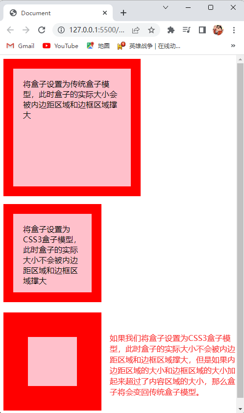

## 24.7CSS3新增的滤镜属性

- CSS使用 `filter` 属性来给元素添加不同的滤镜。

- 语法：

  ```css
  选择器 {
      filter: 属性值;
  }
  ```

- `filter` 属性的属性值取值为：`blur()`（给元素添加高斯模糊滤镜，括号里面的取值为 `数字+px`，数值越大元素越模糊）。

- `filter` 属性的应用场景：一般是给图像添加模糊效果。

- 演示代码：

  ```html
  <!DOCTYPE html>
  <html lang="en">
    <head>
      <meta charset="UTF-8" />
      <title>Document</title>
      <style>
        img {
          filter: blur(5px);
        }
      </style>
    </head>
    <body>
      
    </body>
  </html>
  ```

- 演示结果：

  

## 24.8CSS3新增的 `calc()` 函数

- 我们可以使用CSS函数 `calc()` 在声明CSS属性的属性值时执行一些计算。

- 语法：

  ```css
  选择器 {
      CSS属性: calc();
  }
  ```

- 我们可以在 `calc()` 的括号里面进行加减乘除运算。

- 注意点：在 `calc()` 的括号里面进行加减乘除运算时，运算符的左右两边要有空格，如：`calc(被除数 / 除数)`。

- 演示代码：

  ```html
  <!DOCTYPE html>
  <html lang="en">
    <head>
      <meta charset="UTF-8" />
      <title>Document</title>
      <style>
        div {
          width: 150px;
          height: 150px;
          background-color: pink;
        }
        p {
          width: calc(150px - 50px);
          height: calc(100% - 50px);
          background-color: skyblue;
        }
      </style>
    </head>
    <body>
      <div>
        <p>该盒子的宽高是由calc()函数计算出来的</p>
      </div>
    </body>
  </html>
  ```

- 演示结果：

  

## 24.9CSS3新增的过渡属性

### 24.9.1什么是过渡

- 过渡（transition）是CSS3中具有颠覆性的特征之一，使我们可以在不使用Flash动画或JavaScript的情况下，当元素从一种样式变换为另一种样式时，为元素添加过渡动画效果。

  > 注1：过渡动画就是让元素从一种样式渐渐的过渡到另一种样式。
  >
  > 注2：元素的样式就是由元素的属性来设置的。

### 24.9.2CSS3的过渡属性

- CSS3使用 `transition` 属性当元素从一种样式变换为另一种样式时，为元素添加过渡动画效果。

- 语法：

  ```css
  选择器 {
      transition: 过渡的属性 过渡的时长 运动曲线 何时开始;
  }
  ```

- `transition` 属性的属性值分别取值为：

  - 过渡的属性：

    - 当前元素发生了变化的CSS属性（给发生了变化的CSS属性添加过渡动画效果），如：`width`、`height`、`background-color`属性。
    - `all`（给当前元素的所有属性都添加过渡动画效果）。

  - 过渡的时长：`数字+s`（设置过渡的时长为多少秒）。

    > 注：s是一个时间单位，表示为秒。

  - 运动曲线：
    - linear（设置过渡的运动曲线为匀速）。
    - ease（默认值，设置过渡的运动曲线为逐渐慢下来）。
    - ease-in（设置过渡的运动曲线为加速）。
    - ease-out（设置过渡的运动曲线为减速）。
    - ease-in-out（设置过渡的运动曲线为先加速后减速）。
  - 何时开始：`数字+s`（设置过渡动画效果延迟多少秒开始，默认值为0秒）。

- 注意点：
  - 过渡属性中其他的属性值可以省略，但是过渡的属性和过渡的时长必须要有。
  - 过渡属性的属性值的书写顺序必须按照语法来书写。
  - 因为过渡属性是当元素从一种样式变换为另一种样式时，为元素添加过渡动画效果的，所以当我们给元素设置好了样式时，还需要给该元素设置另外一种样式，此时我们经常搭配 `:hover` 链接伪类选择器使用，给当鼠标悬停在该元素上时，为该元素设置不同的样式。
  - 如何看出当前元素发生了变化的CSS属性，只需要看给该元素设置的CSS属性，在该元素的 `:hover` 伪类选择器中有没有相同的属性，并且属性的属性值不一样，如果有则该CSS属性发生了变化，如果没有则该元素的CSS属性没有发生变化，如：给该元素设置了 `width: 10px;` 属性，并且在该元素的 `:hover` 伪类选择器中也设置了 `width: 20px` 属性，此时给该元素设置的CSS属性，在该元素的 `:hover` 伪类选择器中也有相同的属性，并且属性的属性值不一样，所以该元素的 `width` 属性发生了变化。
  - 如果想要给当前元素多个发生了变化的CSS属性添加过渡动画效果，我们可以使用逗号进行分割，如：`transition: 过渡的属性1 过渡的时长 运动曲线 何时开始,过渡的属性2 过渡的时长 运动曲线 何时开始;`。
  - 如果当前元素没有变化的CSS属性，此时又给该元素设置了过渡属性，这时过渡属性不会生效。
  - 过渡属性是给需要添加过渡动画效果的元素的本身加的，如果过渡属性加到该元素的 `:hover` 链接伪类选择器中时，那么当鼠标移入到该元素时，会有过渡动画效果，但是当鼠标移出该元素时，不会有过渡动画效果，但是如果过渡属性是给需要添加过渡动画效果的元素的本身加的，那么当鼠标移入移出该元素时都会有过渡动画效果。

- 演示代码：

  ```html
  <!DOCTYPE html>
  <html lang="en">
    <head>
      <meta charset="UTF-8" />
      <title>Document</title>
      <style>
        * {
          margin: 0;
          padding: 0;
          box-sizing: border-box;
        }
        div {
          width: 500px;
          height: 100px;
          border: 1px solid red;
          margin-bottom: 30px;
        }
        .one {
          width: 300px;
          height: 98px;
          background-color: pink;
          transition: width 1s;
        }
        .one:hover {
          width: 498px;
        }
        .two {
          width: 300px;
          height: 98px;
          background-color: pink;
          transition: width 1s;
        }
        .two:hover {
          width: 300px;
        }
        .three {
          width: 300px;
          height: 98px;
          background-color: pink;
        }
        .three:hover {
          width: 498px;
          transition: width 1s;
        }
      </style>
    </head>
    <body>
      <div>
        <p class="one"></p>
      </div>
      <div>
        <p class="two"></p>
      </div>
      <div>
        <p class="three"></p>
      </div>
    </body>
  </html>
  ```

- 演示结果：

  

## 24.10CSS3新增的2D转换

### 24.10.1什么是转换

- 转换（transform）是CSS3中具有颠覆性的特征之一，它可以实现元素的位移、旋转、缩放等效果。

  > 注1：位移：就是可以改变元素在页面中的位置，类似定位。
  >
  > 注2：旋转：指的是让元素顺时针旋转或者逆时针旋转。
  >
  > 注3：缩放：就是可以让元素放大还是缩小。

### 24.10.2什么是2D转换

- 2D转换就是改变元素在平面内的形态，如：位移、旋转、缩放。

  > 注1：位移：就是可以改变元素在平面中的位置，类似定位。
  >
  > 注2：旋转：就是让元素在平面中顺时针旋转或者逆时针旋转。
  >
  > 注3：缩放：就是可以让元素在平面中放大还是缩小。

### 24.10.22D转换之位移

- CSS使用 `transform` 属性来改变元素在平面中的位置的位置。

- 语法：

  ```css
  选择器 {
      transform: translate(x坐标,y坐标);
  }
  ```

- `transform` 属性的属性值取值为：

  - x坐标：像素值（设置元素在x轴上距离原点多少像素）、`数字+%`。
  - y坐标：像素值（设置元素在y轴上距离原点多少像素）、`数字+%`。

- 添加了 `transform` 属性的盒子在位移时，是相对于自己原来的位置来移动的，它的坐标轴如图所示：

  

- 注意点：
  - x坐标的值和y坐标的值中间要用逗号隔开。
  - 使用 `transform` 属性移动元素时，该元素不会影响到其他元素的位置。
  - 如果 `transform` 属性的属性值是百分比单位时，则该百分比单位是相对于设置了 `transform` 属性的盒子的宽度和高度，如：一个宽高都为100px的盒子设置了 `transform: translate(50%,30%)` 属性，则该盒子沿x轴向右移动50px，沿y轴向下移动30px。
  - `transform` 属性对行内元素不生效。
  - 如果只指定了一个坐标，另一个坐标省略，则这个坐标为x坐标。
  - 如果我们只想设置x坐标，我们可以将 `transform: translate(x坐标,y坐标);` 改成 `transform: translateX(x坐标);` 这样我们就可以只设置x坐标了。
  - 如果我们只想设置y坐标，我们可以将 `transform: translate(x坐标,y坐标);` 改成 `transform: translateY(y坐标);` 这样我们就可以只设置y坐标了。

- `transform` 属性的小技巧：

  - 当我们给绝对定位的盒子设置水平居中对齐时，我们需要给绝对定位的盒子设置 `left: 50%;` 属性，还需要给绝对定位的盒子设置 `margin-left: -绝对定位的盒子宽度的一半;` 属性，这时我们需要自己计算出绝对定位的盒子宽度的一半，此时我们可以使用 `transform: translateX(-50%);` 属性替换掉 `margin-left: -绝对定位的盒子宽度的一半;` 属性，这样我们就不用自己计算出绝对定位的盒子宽度的一半，还能使绝对定位的盒子水平居中对齐，这是因为 `transform` 属性的属性值是百分比单位时，则该百分比单位是相对于设置了 `transform` 属性的盒子的宽度和高度。

- 演示代码：

  ```html
  <!DOCTYPE html>
  <html lang="en">
    <head>
      <meta charset="UTF-8" />
      <title>Document</title>
      <style>
        div {
          position: absolute;
          left: 50%;
          width: 200px;
          height: 200px;
          background-color: pink;
          transform: translateX(-50%);
        }
      </style>
    </head>
    <body>
      <div></div>
    </body>
  </html><!DOCTYPE html>
  <html lang="en">
    <head>
      <meta charset="UTF-8" />
      <title>Document</title>
      <style>
        div {
          position: absolute;
          left: 50%;
          width: 200px;
          height: 200px;
          background-color: pink;
          transform: translateX(-50%);
        }
      </style>
    </head>
    <body>
      <div></div>
    </body>
  </html>
  ```

- 演示结果：

  

### 24.10.32D转换之旋转

- CSS使用 `transform` 属性来使元素在平面中旋转。

- 语法：

  ```css
  选择器 {
      transform: rotate(度数);
  }
  ```

- `transform` 属性的属性值取值为：

  - 度数：`数字+deg`（设置元素旋转多少度）。

    > 注：deg是度数单位，表示度数。

- 元素旋转时是围绕2D转换的中心点旋转的，2D转换的中心点如下图所示：

  

- 注意点：度数为正时，元素顺时针旋转，度数为负时，元素逆时针旋转。

- 演示代码：

  ```html
  <!DOCTYPE html>
  <html lang="en">
    <head>
      <meta charset="UTF-8" />
      <title>Document</title>
      <style>
        div {
          width: 100px;
          height: 100px;
          background-color: pink;
          transform: rotate(45deg);
        }
      </style>
    </head>
    <body>
      <div></div>
    </body>
  </html>
  ```

- 演示结果：

  


### 24.10.42D转换的中心点

- CSS使用 `transform-origin` 属性来改变2D转换的中心点在元素中的位置。

- 语法：

  ```css
  选择器 {
      transform-origin: x坐标 y坐标;
  }
  ```

- `transform` 属性的属性值取值为：

  - x坐标：`left`（左对齐）、`center`（水平居中对齐）、`right`（右对齐）、像素值（设置2D转换的中心点在x轴上距离原点多少像素）、`数字+%`。
  - y坐标：`top`（顶对齐）、`center`（垂直居中对齐）、`botttom`（底对齐）、像素值（设置2D转换的中心点在y轴上距离原点多少像素）、`数字+%`。

- 2D转换的中心点在元素中的坐标轴，如图所示：

  

- 注意点：

  - x坐标的值和y坐标的值中间要用空格隔开。
  - 2D转换的中心点默认在元素的中心，也就是 `transform-origin: 50% 50%;`。
  - 如果 `transform-origin` 属性的属性值是百分比单位时，则该百分比单位是相对于设置了 `transform-origin` 属性的盒子的宽度和高度，如：一个宽高都为100px的盒子设置了 `transform-origin: 50% 30%;` 属性，则2D转换的中心点沿x轴移动50px，沿y轴移动30px。

- 演示代码：

  ```html
  <!DOCTYPE html>
  <html lang="en">
    <head>
      <meta charset="UTF-8" />
      <title>Document</title>
      <style>
        div {
          width: 100px;
          height: 100px;
          margin: 50px auto;
          background-color: pink;
          transform-origin: left bottom;
          transition: transform 1s;
        }
        div:hover {
          transform: rotate(90deg);
        }
      </style>
    </head>
    <body>
      <div></div>
    </body>
  </html>
  ```

- 演示结果：

  

### 24.10.52D转换之缩放

- CSS使用 `transform` 属性来设置元素在平面中放大或缩小。

- 语法：

  ```css
  选择器 {
      transform-scale: (放大或缩小元素的宽度为元素本身宽度的多少倍,放大或缩小元素的高度为元素本身高度的多少倍);
  }
  ```

- `transform` 属性的属性值取值为：

  - 放大或缩小元素的宽度为元素本身宽度的多少倍：数字。

    > 注1：如果数字为1则放大元素的宽度为元素本身宽度的1倍。
    > 注2：如果数字为2则放大元素的宽度为元素本身宽度的2倍。
    > 注3：如果数字为0.5则缩小元素的宽度为元素本身宽度的0.5倍。

  - 放大或缩小元素的高度为元素本身高度的多少倍：数字。

    > 注1：如果数字为1则放大元素的高度为元素本身高度的1倍。
    > 注2：如果数字为2则放大元素的高度为元素本身高度的2倍。
    > 注3：如果数字为0.5则缩小元素的高度为元素本身高度的0.5倍。

- 注意点：

  - 放大或缩小元素的宽度为元素本身宽度的多少倍数的值和放大或缩小元素的高度为元素本身高度的多少倍数的值中间要用逗号分隔。
  - 如果只写一个参数，那么第二个参数和第一个参数一样，如：`transform-scale: (2);` 等价于 `transform-scale: (2,2);`。
  - 使用 `transform` 属性缩放元素时，是可以设置缩放的基准点的，默认以2D转换的中心点进行缩放，并且缩放不会影响其他盒子的位置（以上两个特点都是直接设置 `width` 和 `height` 属性都无法做到的）。

- 演示代码：

  ```html
  <!DOCTYPE html>
  <html lang="en">
    <head>
      <meta charset="UTF-8" />
      <title>Document</title>
      <style>
        div {
          width: 100px;
          height: 100px;
          margin: 100px auto;
          background-color: pink;
          transition: transform 1s;
        }
        div:hover {
          transform: scale(2);
        }
      </style>
    </head>
    <body>
      <div></div>
    </body>
  </html>
  ```

- 演示结果：

  

### 24.10.62D转换综合写法

- 2D转换综合写法可以让元素同时有多个2D转换效果。

- 语法：

  ```css
  选择器 {
      transform: translate(属性值1,属性值2) rotate(属性值3) scale(属性值4);
  }
  ```

- 2D转换综合写法的属性值取值为：各个2D转换的属性值。

- 注意点：

  - 如果要让元素同时有多个2D转换效果，但是不使用2D转换综合写法，而是单独为元素一个一个写2D转换，那么写在下面的2D转换会生效，上面的2D转换不会生效，是因为层叠性。

  - 使用2D转换综合写法时，要按照上面的语法格式书写，不然会出现如图所示的情况（先旋转会改变坐标轴方向，使其先旋转，再按照旋转后的坐标轴进行移动）：

    

  - 我们可以根据需求来添加或减少2D转换综合写法中的2D转换，如：我们只需要让元素有位移和旋转的效果，我们可以这样写 `transform: translate(属性值1,属性值2) rotate(属性值3);`，但是要注意如果该元素需要有位移效果，那么位移的2D转换要写在最前面。

- 演示代码：

  ```html
  <!DOCTYPE html>
  <html lang="en">
    <head>
      <meta charset="UTF-8" />
      <title>Document</title>
      <style>
        div {
          width: 100px;
          height: 100px;
          background-color: pink;
          transition: all 1s;
        }
        div:hover {
          transform: translate(150px,150px) rotate(180deg);
        }
      </style>
    </head>
    <body>
      <div></div>
    </body>
  </html>
  ```

- 演示结果：

  

## 24.11CSS3新增的动画

### 24.11.1什么是动画

- 动画（animation）是CSS3中具有颠覆性的特征之一，可通过设置多个节点来精确控制一个或一组动画，常用来实现复杂的动画效果。

  > 注：动画效果就是实现多个状态间的变化过程，动画过程可控（重复播放、最终画面、是否暂停）。

- 动画的本质是快速切换大量图片时在人脑中形成的具有连续性的动画。
- 构成动画的最小单元为帧或动画帧。

### 24.11.2动画的使用

- 动画的使用步骤如下：

  1. 定义动画：

     - CSS使用 `@keyframes` 来定义动画。

     - 语法：

       ```css
       @keyframes 动画的名称 {
       	0%{
       		声明
       		···
       	}
           ···
       	100%{
       		声明
       		···
       	}
       }
       ```

     - 动画的名称由用户自定义。

     - 动画序列：

       - `@keyframes` 中的 `0%` 表示动画的开始，`100%` 表示动画的结束，这样的规则就是动画序列。

       - 在 `@keyframes` 中的百分比后的大括号中规定某项CSS样式，就能创建由当前样式逐渐改为新样式的动画效果，如以下所示：

         ```css
         @keyframes move {
             0% {
                 /* 创建当前样式 */
                 transform: translate(0,0);
             }
             100% {
                 /* 创建新样式 */
                 transform: translate(300px,0);
             }
         }
         ```

       - 动画是使元素从一种样式逐渐变化为另一种样式的效果，你可以改变任意多的样式和任意多的次数，如以下所示：

         ```css
         @keyframes move {
             0% {
                 /* 创建当前样式 */
                 width: 100px;
                 height: 100px;
                 transform: translate(0,0);
             }
             /* 可以改变任意多的次数 */
             25% {
                 /* 创建新样式，可以改变任意多的样式 */
                 width: 150px;
                 height: 150px;
                 transform: translate(200px,0);
             }
             100% {
                 /* 创建新样式 */
                 width: 200px;
                 height: 200px;
                 transform: translate(300px,0);
             }
         }
         ```

       - `@keyframes` 中的百分比就是动画总时间的划分，如：我们这个动画的总时长为 `10S`，我在 `@keyframes` 中设置了 `0%`、`25%`、`100%`，并且在每个百分比后面的大括号中设置了样式，也就代表着该动画在 `0S` 时为 `0%` 后面的大括号中的样式，在 `2.5S` 时为 `25%` 后面的大括号中的样式，在 `10S` 时为 `100%` 后面的大括号中的样式。

     - 注意点：

       - `@keyframes` 中的百分比要为整数。
       - `@keyframes` 中的 `0%` 可以用 `from` 代替，`100%` 可以用 `to` 代替。
       - 如果 `@keyframes` 中的 `0%` 后的大括号中没有设置样式，则默认以调用了动画的元素的样式为动画开始时的样式。

  2. 调用动画：

     - CSS使用 `animation-name`、`animation-duration`、`animation-timing-function`、`animation-delay`、`animation-iteration-count`、`animation-direction`、`animation-play-state`、`animation-fill-mode` 属性来给元素添加定义动画时设置好了的动画和给元素设置该动画的一些功能。

     - 语法：

       ```css
       选择器 {
           animation-name: 属性值;
           animation-duration: 属性值;
           animation-timing-function: 属性值;
           animation-delay: 属性值;
           animation-iteration-count: 属性值;
           animation-direction: 属性值;
           animation-play-state: 属性值;
           animation-fill-mode: 属性值;
       }
       ```

     - `animation-name`、`animation-duration`、`animation-timing-function`、`animation-delay`、`animation-iteration-count`、`animation-direction`、`animation-play-state`、`animation-fill-mode` 属性的属性值分别取值为：

       - `animation-name` 属性：定义动画时设置的动画的名称（给元素添加定义动画时设置好了的动画）。
       - `animation-duration` 属性：`数字+s`（默认值为0s，设置动画的总时长）。
       - `animation-timing-function` 属性：`ease`（默认值，设置动画以低速开始，然后加快，在结束前变慢）、`linear`（设置动画从头到尾的速度是相同的）、`ease-in`（设置动画以低速开始）、`ease-out`（设置动画以低速结束）、`ease-in-out`（设置动画以低速开始和结束）、`steps(数字)`（设置动画分几步来完成）。
       - `animation-delay` 属性：`数字+s`（默认值为0s，设置动画延迟多少秒开始）。
       - `animation-iteration-count` 属性：数字（默认值为1，设置动画播放多少次）、`infinite`（设置动画无限播放）。
       - `animation-direction` 属性：`normal`（默认值。设置动画播放完毕时，不会逆向播放）、`alternate`（设置动画播放完毕时，会逆向播放）。
       - `animation-play-state` 属性：`running`（默认值，设置动画正在运行）、`paused`（设置动画暂停运行）。
       - `animation-fill-mode` 属性：`backwards`（默认值，设置动画播放完毕时，元素回到动画播放开始时的位置）、`forwards`（设置动画播放完毕时，元素保持在动画播放完毕时的位置）。

     - 注意点：

       - 其他属性可以省略，但是 `animation-name` 属性和 `animation-duration` 属性不可以省略。
       - `animation-play-state: paused;` 属性经常配合 `:hover` 链接伪类选择器使用，用于鼠标移入暂停动画。
       - 给元素设置了 `animation-fill-mode: forwards;` 属性时，就不能再给元素设置 `animation-iteration-count` 属性和 `animation-direction` 属性。

  3. 调用动画复合属性：

     - 调用动画复合属性可以把上面的调用动画属性综合来写，这样可以更节约代码。

     - 语法：

       ```css
       选择器 {
           animation: animation-name animation-duration animation-timing-function animation-delay animation-iteration-count animation-direction animation-fill-mode;
       }
       ```

     - 调用动画复合属性的属性值取值为：各个属性的属性值。

     - 注意点：

       - 一般给元素添加动画时用的是调用动画复合属性。
       - 调用动画复合属性中其他属性的属性值可以省略，但是 `animation-name` 属性的属性值和 `animation-duration` 属性的属性值不可以省略。
       - 调用动画复合属性中不包含 `animation-play-state` 属性。
       - 设置了 `animation-fill-mode` 属性的属性值为 `forwards` 时，就不能设置 `animation-iteration-count` 属性的属性值和 `animation-direction` 属性的属性值。
       - 如果想要给元素添加多个动画，我们可以使用逗号进行分割，如：`animation: run 1s ease,move 1s ease`，这样就给元素调用了 `run` 动画和 `move` 动画。

- 演示代码：

  ```html
  <!DOCTYPE html>
  <html lang="en">
    <head>
      <meta charset="UTF-8" />
      <title>Document</title>
      <style>
        @keyframes move {
          from {
            transform: translate(0,0);
          }
          25% {
            transform: translate(300px,0);
          }
          50% {
            transform: translate(300px,300px);
          }
          75% {
            transform: translate(0,300px);
          }
          to {
            transform: translate(0,0);
          }
        }
        div {
          width: 100px;
          height: 100px;
          background-color: pink;
          animation: move 5s linear 0s infinite alternate;
        }
        div:hover {
          animation-play-state: paused;
        }
      </style>
    </head>
    <body>
      <div></div>
    </body>
  </html>
  ```

- 演示结果：

  

  

## 24.12CSS3新增的3D转换

### 24.12.1什么是3D转换

- 3D转换就是改变元素在空间内的形态，如：位移、旋转。

  > 注1：位移：就是可以改变元素在三维空间中的位置。
  >
  > 注2：旋转：就是让元素在三维空间内顺时针旋转或者逆时针旋转。
  >

- 3D转换比2D转换多了一条Z轴。

  > 注：Z轴位置与视线方向相同。

### 24.12.23D转换之位移

- CSS使用 `transform` 属性来改变元素在三维空间中的位置。

- 语法：

  ```css
  选择器 {
      transform: translate3d(x坐标,y坐标,z坐标);
  }
  ```

- `transform` 属性的属性值取值为：

  - x坐标：像素值（设置元素在x轴上距离原点多少像素）、`数字+%`。
  - y坐标：像素值（设置元素在y轴上距离原点多少像素）、`数字+%`。
  - z坐标：像素值（设置元素在z轴上距离原点多少像素）。

- 添加了 `transform` 属性的盒子在位移时，是相对于自己原来的位置来移动的，它的三维坐标轴如图所示：

  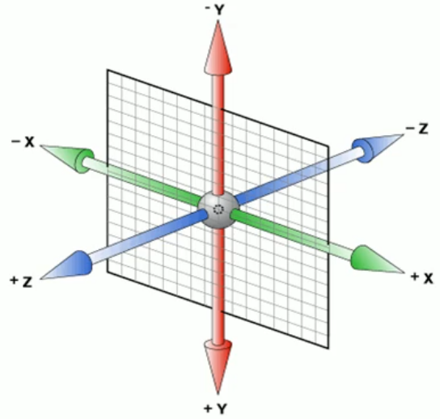

  > 注1：三维坐标系其实就是指立体空间，立体空间是由3个轴共同组成的。
  >
  > 注2：三维坐标系中x轴是水平向右，x轴右边是正值，左边是负值。
  >
  > 注3：三维坐标系中y轴是垂直向下，y轴下边是正值，上边是负值。
  >
  > 注4：三维坐标系中z轴是垂直于屏幕，z轴往外面是正值，往里面是负值。

- 注意点：
  - x坐标的值和y坐标的值和z坐标的值不能省略。
  - x坐标的值和y坐标的值和z坐标的值中间要用逗号隔开。
  - z坐标的值一般为像素值。
  - 如果我们只想设置x坐标，我们可以将 `transform: translate3d(x坐标,y坐标,z坐标);` 改成 `transform: translateX(x坐标);` 这样我们就可以只设置x坐标了。
  - 如果我们只想设置y坐标，我们可以将 `transform: translate3d(x坐标,y坐标,z坐标);` 改成 `transform: translateY(y坐标);` 这样我们就可以只设置y坐标了。
  - 如果我们只想设置z坐标，我们可以将 `transform: translate3d(x坐标,y坐标,z坐标);` 改成 `transform: translateZ(z坐标);` 这样我们就可以只设置z坐标了。

- 演示代码：

  ```html
  <!DOCTYPE html>
  <html lang="en">
    <head>
      <meta charset="UTF-8" />
      <title>Document</title>
      <style>
        div {
          width: 100px;
          height: 100px;
          background-color: pink;
          transform: translate3d(100px,100px,100px);
        }
      </style>
    </head>
    <body>
      <div></div>
    </body>
  </html>
  ```

- 演示结果：

  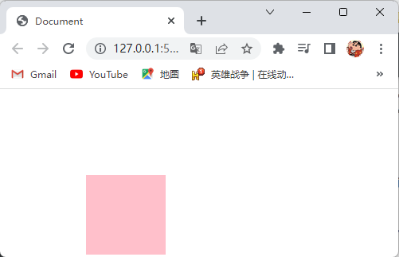

### 24.12.3透视

- 透视就是透视距离也称为视距，所谓的视距就是人的眼睛到屏幕的距离，视距越小看到的物体越大，视距越大看到的物体越小，如下图所示：

  

  > 注1：d就是视距。
  >
  > 注2：z就是z轴，物体距离屏幕的距离，z轴越大（正值）我们看到的物体就越大。

- CSS使用 `perspective` 属性来设置透视，设置了透视我们可以在2D平面产生近大远小的视觉立体也就是3D效果，并且可以看到元素在z轴上的变化。

- 语法：

  ```css
  选择器 {
      perspective: 属性值;
  }
  ```

- `perspective` 属性的属性值取值为：像素值（设置人的眼睛距离屏幕多少像素）。

- 注意点：

  - `perspective` 属性要写到被观察元素的父盒子里，如：我们给一个元素设置了 `transform: translate3d(x坐标,y坐标,z坐标);` 属性，那么我们的 `perspective` 属性就要给该元素的父元素设置，一般我们直接给 `<body>` 标签设置 `perspective` 属性。
  - `perspective` 属性的属性值取值建议在 `800px~1200px` 之间，因为这个距离符合人眼识别情况。

- 演示代码：

  ```html
  <!DOCTYPE html>
  <html lang="en">
    <head>
      <meta charset="UTF-8" />
      <title>Document</title>
      <style>
        body {
          perspective: 800px;
        }
        div {
          width: 100px;
          height: 100px;
          background-color: pink;
          margin: 100px auto;
          transform: translateZ(300px);
        }
      </style>
    </head>
    <body>
      <div></div>
    </body>
  </html>
  ```

- 演示结果：

  

### 24.12.43D转换之旋转

- CSS使用 `transform` 属性来使元素在三维空间内旋转。

- 语法：

  ```css
  选择器 {
      transform: rotateX(度数);
      transform: rotateY(度数);
      transform: rotateZ(度数);
      transform: rotate3d(x轴,y轴,z轴,度数);
  }
  ```

- `transform` 属性的属性值取值为：

  - 度数：`数字+deg`（设置元素旋转多少度）。
  - X轴和Y轴和Z轴：`0~1之间的数字`（设置自定义轴的位置）。

- `transform: rotateX(度数);` 是设置元素沿着元素的三维坐标轴的x轴进行旋转，`transform: rotateY(度数);` 是设置元素沿着元素的三维坐标轴的y轴进行旋转，`transform: rotateZ(度数);` 是设置元素沿着元素的三维坐标轴的z轴进行旋转，`transform: rotate3d(x轴,y轴,z轴,度数);` 是设置元素沿着元素在三维坐标轴中设置的自定义轴进行旋转，元素的三维坐标轴如下图所示：

  

- 注意点：

  - 度数为正时，元素是沿着轴的顺时针旋转，度数为负时，元素是沿着轴的逆时针旋转，判断旋转方向用左手握着旋转轴，拇指指向轴的正值方向，此时手指弯曲的方向就为轴的顺时针方向。

  - 我们可以通过设置透视来使得元素在旋转时，会在2D平面产生近大远小的视觉立体，如下图所示：

    

  - 如果我们将 `transform: rotate3d(x轴,y轴,z轴,度数);` 设置为 `transform: rotate3d(1,0,0,45deg);` 那么就是设置元素沿着x轴的顺时针方向旋转45度，如果我们将 `transform: rotate3d(x轴,y轴,z轴,度数);` 设置为 `transform: rotate3d(1,1,0,45deg);` 那么就是设置元素沿着对角线轴的顺时针方向旋转45度。

- 演示代码：

  ```html
  <!DOCTYPE html>
  <html lang="en">
    <head>
      <meta charset="UTF-8" />
      <title>Document</title>
      <style>
        body {
          perspective: 800px;
        }
        img {
          display: block;
          width: 800px;
          margin: 50px auto;
          transform: rotate3d(1,1,0,-60deg);
        }
      </style>
    </head>
    <body>
      
    </body>
  </html>
  ```

- 演示结果：

  

### 24.12.53D呈现

- CSS使用 `transform-style` 属性来实现元素的3D呈现。

- 语法：

  ```css
  选择器 {
      transform-style: 属性值;
  }
  ```

- `transform-style` 属性的属性值取值为：

  - `flat`（默认值，设置元素为2D呈现）。
  - `preserve-3d`（设置元素为3D呈现）。

- 注意点：

  - `transform-style` 属性要添加给元素的父元素，这样才能使元素处于3D呈现。

  - 元素为2D呈现，如下图所示：

    

  - 元素为3D呈现，如下图所示：

    

- 演示代码：

  ```html
  <!DOCTYPE html>
  <html lang="en">
    <head>
      <meta charset="UTF-8" />
      <title>Document</title>
      <style>
        body {
          perspective: 800px;
        }
        .box {
          position: relative;
          width: 100px;
          height: 100px;
          margin: 0 auto;
          transform-style: preserve-3d;
          transition: all .5s;
        }
        .box:hover {
          transform: rotateY(80deg);
        }
        .box div {
          position: absolute;
          top: 0;
          left: 0;
          width: 100%;
          height: 100%;
          background-color: pink;
        }
        .box div:last-child{
          background-color: skyblue;
          transform: rotateX(45deg);
        }
      </style>
    </head>
    <body>
      <div class="box">
        <div></div>
        <div></div>
      </div>
    </body>
  </html>
  ```

- 演示结果：

  

### 24.12.63D转换之缩放

- CSS使用 `transform` 属性来使元素在三维空间内缩放。

- 语法：

  ```css
  选择器 {
      transform: scaleX(设置元素在x轴上放大或缩小元素本身的多少倍);
      transform: scaleY(设置元素在y轴上放大或缩小元素本身的多少倍);
      transform: scaleZ(设置元素在z轴上放大或缩小元素本身的多少倍);
      transform: scale3d(设置元素在x轴上放大或缩小元素本身的多少倍,设置元素在y轴上放大或缩小元素本身的多少倍,设置元素在z轴上放大或缩小元素本身的多少倍);
  }
  ```

- `transform` 属性的属性值取值为：

  - 设置元素在x轴上放大或缩小元素本身的多少倍：数字。

    > 注1：如果数字为1则元素在x轴上放大元素本身的1倍。
    > 注2：如果数字为2则元素在x轴上放大元素本身的2倍。
    > 注3：如果数字为0.5则元素在x轴上缩小元素本身的0.5倍。

  - 设置元素在y轴上放大或缩小元素本身的多少倍：数字。

    > 注1：如果数字为1则元素在y轴上放大元素本身的1倍。
    > 注2：如果数字为2则元素在y轴上放大元素本身的2倍。
    > 注3：如果数字为0.5则元素在y轴上缩小元素本身的0.5倍。

  - 设置元素在z轴上放大或缩小元素本身的多少倍：数字。

    > 注1：如果数字为1则元素在z轴上放大元素本身的1倍。
    > 注2：如果数字为2则元素在z轴上放大元素本身的2倍。
    > 注3：如果数字为0.5则元素在z轴上缩小元素本身的0.5倍。

- 添加了 `transform` 属性的盒子在缩放时，它的三维坐标轴如下图所示：

  

- 注意点：

  - 设置元素在x轴上放大或缩小元素本身的多少倍的值和设置元素在y轴上放大或缩小元素本身的多少倍的值和设置元素在z轴上放大或缩小元素本身的多少倍的值中间要用逗号分隔。
  - `transform: scale3d(设置元素在x轴上放大或缩小元素本身的多少倍,设置元素在y轴上放大或缩小元素本身的多少倍,设置元素在z轴上放大或缩小元素本身的多少倍);` 属性中的三个值一个都不能少，否则 `transform` 属性不生效。
  - 使用 `transform` 属性缩放元素时，是可以设置缩放的基准点的，默认以2D转换的中心点进行缩放，并且缩放不会影响其他盒子的位置（以上两个特点都是直接设置 `width` 和 `height` 属性都无法做到的）。

- 演示代码：

  ```html
  <!DOCTYPE html>
  <html lang="en">
  <head>
      <meta charset="UTF-8">
      <title>Document</title>
      <style>
          div {
              width: 100px;
              height: 100px;
              background-color: pink;
              transition: all 1s;
              margin: 200px auto;
              transform-origin: top left;
          }
          div:hover {
              transform: scale3d(3,3,3);
          }
      </style>
  </head>
  <body>
      <div></div>
  </body>
  </html>
  ```

- 演示结果：

  

### 24.12.73D转换综合写法

- 3D转换综合写法可以让元素同时有多个3D转换效果。

- 语法：

  ```css
  选择器 {
      transform: translate3d(属性值1,属性值2,属性值3) rotate3d(属性值4,属性值5,属性值6,属性值7) transform: scale3d(属性值8,属性值9,属性值10);
  }
  ```

- 3D转换综合写法的属性值取值为：各个3D转换的属性值。

- 注意点：

  - 如果要让元素同时有多个3D转换效果，但是不使用3D转换综合写法，而是单独为元素一个一个写3D转换，那么写在下面的3D转换会生效，上面的3D转换不会生效，是因为层叠性。

  - 使用3D转换综合写法时，要按照上面的语法格式书写，不然会出现如图所示的情况（先旋转会改变坐标轴方向，使其先旋转，再按照旋转后的坐标轴进行移动）：

    

  - 我们可以根据需求来添加或减少3D转换综合写法中的3D转换，如：我们只需要让元素有位移和旋转的效果，我们可以这样写 `transform: translate3d(属性值1,属性值2,属性值3) rotate3d(属性值4,属性值5,属性值6,属性值7);`，但是要注意如果该元素需要有位移效果，那么位移的3D转换要写在最前面。

- 演示代码：

  ```html
  <!DOCTYPE html>
  <html lang="en">
    <head>
      <meta charset="UTF-8" />
      <title>Document</title>
      <style>
        body {
          perspective: 800px;
        }
        div {
          width: 100px;
          height: 100px;
          margin: 0px auto;
          background-color: pink;
          transition: all 3s;
        }
        div:hover {
          transform: translateY(300px) rotateX(60deg);
        }
      </style>
    </head>
    <body>
      <div>元素</div>
    </body>
  </html>
  ```

- 演示结果：

  

## 24.13浏览器私有前缀

- 因为CSS3属性在老版本的浏览器中有兼容性的问题，所以我们需要使用浏览器私有前缀写法来使得老版本的浏览器兼容CSS3属性。
- 浏览器私有前缀有：
  - `-webkit-`：表示Chrome浏览器和Safari浏览器的私有前缀。
  - `-moz-`：表示firefox浏览器的私有前缀。
  - `-ms-`：表示IE浏览器的私有前缀。
  - `-o-`：表示Opera浏览器的私有前缀。

- 浏览器私有前缀的使用：在CSS3属性前面添加浏览器私有前缀这样老版本的浏览器就能兼容CSS3属性了，如：`-webkit-transform: translate(x坐标,y坐标);` 这样老版本的Chrome浏览器就能兼容 `transform` 属性了。

- 如果想让所有老版本的浏览器都兼容CSS3属性，可以按照下面的写法来写CSS3属性：

  ```css
  选择器 {
      -webkit-transform: translate(x坐标,y坐标);
      -moz-transform: translate(x坐标,y坐标);
      -ms-transform: translate(x坐标,y坐标);
      -o-transform: translate(x坐标,y坐标);
      transform: translate(x坐标,y坐标);
  }
  ```

- 注意点：如果是新版本的浏览器，CSS3属性的前面就不需要写浏览器私有前缀了。

# 25.品优购项目

## 25.1项目搭建

- 一个项目先从创建文件夹开始：
  1. 创建个项目文件夹。
  2. 在项目文件夹的根目录里创建个文件夹，文件夹名字为 `images`，该文件夹是样式类图片文件夹，是用来存放样式类图片。
  3. 在项目文件夹的根目录里创建个文件夹，文件夹名字为 `css`，该文件夹是样式文件夹，是用来存放CSS文件的。
  4. 在项目文件夹的根目录里创建个文件夹，文件夹名字为 `upload`，该文件夹是产品类图片文件夹，是用来存放产品类图片。
  5. 在项目文件夹的根目录里创建个文件夹，文件夹名字为 `fonts`，该文件夹是字体类文件夹，是用来存放字体图标文件的。
  6. 在项目文件夹的根目录里创建个文件夹，文件夹名字为 `js`，该文件夹是脚本文件夹，是用来存放JavaScript文件的。
  7. 在项目文件夹的根目录里创建个HTML文件，文件名为 `index.html`，该文件是网站的首页。

- 网站的favicon图标存放在项目文件夹的根目录中。
- CSS初始化样式文件的命名为 `base.css`。
- 页面的CSS样式文件的命名和页面文件的名字一样，如：`index.html` 首页文件的CSS样式文件命名为 `index.css`。
- 模块化开发：
  - 模块化就是将一个项目按照功能划分成一个一个模块，每个模块之间互不影响。
  - 模块化开发就是当一些样式和结构在很多页面上都会出现时，如：页面的头部和底部，大部分页面都有，此时就可以把这些结构和样式单独作为一个模块，然后重复使用，这些样式存放在 `common.css` 文件里。
  - 模块化开发具有重复使用、修改方便等优点。

- 注册页面比较隐私，为了保护用户信息，我们不需要对注册页面做SEO优化。

## 25.2Web服务器

### 25.2.1什么是服务器

- 服务器（我们也会称之为主机）是提供计算服务的设备，它也是一台计算机，在网络环境下，根据服务器提供的服务类型不同，服务器又分为文件服务器、数据库服务器、应用程序服务器、Web服务器等。

### 25.2.2Web服务器

- Web服务器一般是指网站服务器，是指驻留于因特网上某种类型计算机的程序，可以向浏览器等Web客户端提供文档，也可以放置网站文件，让全世界浏览，可以放置数据文件，让全世界下载。
- 根据服务器在网络中所在的位置不同，又可分为本地服务器和远程服务器。

### 25.2.3本地服务器

- 我们可以把自己的电脑设置为本地服务器，这样同一个局域网内的同学就可以访问你的品优购网站了，就业班学ajax的时候，再进行讲解。

### 25.2.4远程服务器

- 本地服务器访问网站主要在局域网中访问，如果想要在互联网中访问网站，那么就需要将网站上传到远程服务器中。
- 远程服务器通常是别的公司为我们提供的一台电脑（主机），我们只要把网站项目上传到这台电脑上，任何人都可以利用域名访问我们的网站了。
- 将网站项目上传到远程服务器的步骤：
  1. 去免费空间网站注册账号。
  2. 记录下主机名、用户名、密码、域名。
  3. 利用cutftp软件上传网站到远程服务器。
  4. 在浏览器中输入域名，即可访问我们的品优购网站了。

## 25.3网页的favicon图标

### 25.3.1什么是favicon图标

- favicon图标一般用于作为缩略的网站标志，它显示在浏览器的地址栏或者标签上，如下图所示：

  

- favicon图标的后缀名为 `.ico`。

### 25.3.2怎么制作favicon图标

- 我们可以借助于第三方转换网站（https://www.bitbug.net/）将png格式的图片转换为favicon图标。

- 演示如下：

  

### 25.3.3怎么使用favicon图标

- HTML使用 `<link />` 标签来设置网页的favicon图标。

- 语法：

  ```html
  <link />
  ```

- `<link />` 标签的属性，如下表所示：

  | 属性名 |    属性值     | 说明                                                         |
  | :----: | :-----------: | ------------------------------------------------------------ |
  |  rel   | shortcut icon | 定义当前文档与被链接文档之间的关系，该属性值表示被链接的文档是一个favicon图标 |
  |  href  |     路径      | 设置要使用的favicon图标的路径                                |
  |  type  | image/x-icon  | 定义被链接文档的MIME类型为image/x-icon                       |

- 注意点：

  - `<link />` 标签的 `rel` 属性和 `href` 属性不能省略，但是 `type` 属性可以省略。
  - `<link />` 标签理论上可以放在HTML文档的任何地方，但一般会放到文档的 `<head>` 标签里。

- 演示代码：

  ```html
  <!DOCTYPE html>
  <html lang="en">
    <head>
      <meta charset="UTF-8" />
      <title>Document</title>
      <link rel="shortcut icon" href="favicon.ico" type="image/x-icon">
    </head>
    <body></body>
  </html>
  ```

- 演示结果：

  

## 25.4网站的SEO优化

### 25.4.1什么是SEO

- SEO（Search Engine Optimization）汉译为搜索引擎优化，是一种利用搜索引擎的规则提高网站在有关搜索引擎内自然排名的方式。
- SEO优化的目的是对网站进行深度的优化，从而帮助网站获取免费的流量，进而在搜索引擎上提升网站的排名，提高网站的知名度。

### 25.4.2SEO优化有TDK三大标签

- 页面必须有三个标签用来符合SEO优化，分别是：

  - `<title>` 标签：

    - `<title>` 标签具有不可替代性，是我们内页的第一个重要标签，是搜索引擎了解网页的入口和对网页主题归属的最佳判断点。
    - `<title>` 标签的内容建议为网站名（产品名）-网站的介绍，如：京东(JD.COM)-正品低价、品质保障、配送及时、轻松购物！
    - 注意点：`<title>` 标签的内容尽量不要超过30个汉字。

  - `description` 网站说明：

    - `description` 网站说明，是简要说明我们的网站主要是做什么的。

    - HTML使用 `<meta />` 标签来设置网站的网站说明。

    - 语法：

      ```html
      <meta />
      ```

    - `<meta />` 标签的属性，如下表所示：

      | 属性名  |   属性值    | 说明                                                         |
      | :-----: | :---------: | ------------------------------------------------------------ |
      |  name   | description | 设置该标签为网站说明标签。                                   |
      | content | 用户自定义  | 设置网站说明，如：京东JD.COM-专业的综合网上购物商城，为您提供正品低价的购物选择、优质便捷的服务体验。商品来自全球数十万品牌商家，囊括家电、手机、电脑、服装、居家、母婴、美妆、个护、食品、生鲜等丰富品类，满足各种购物需求。 |

    - 注意点：`<meta />` 标签是写在 `<head>` 标签里的。

  - `keywords` 网站关键字：

    - `keywords` 网站关键字，是网站的关键词，也是搜索引擎的关注点之一。

    - HTML使用 `<meta />` 标签来设置网站的关键词。

    - 语法：

      ```html
      <meta />
      ```

    - `<meta />` 标签的属性，如下表所示：

      | 属性名  |   属性值   | 说明                                                         |
      | :-----: | :--------: | ------------------------------------------------------------ |
      |  name   |  keywords  | 设置该标签为网站关键字标签。                                 |
      | content | 用户自定义 | 设置网站的关键词，如：网上购物,网上商城,家电,手机,电脑,服装,居家,母婴,美妆,个护,食品,生鲜,京东 |

    - 注意点：

      - `<meta />` 标签是写在 `<head>` 标签里的。
      - 关键词的数量最好为6～8个。
      - 关键词之间用英文逗号隔开，采用关键词1,关键词2的形式，如：网上购物,网上商城,家电,手机,电脑,服装,居家,母婴,美妆,个护,食品,生鲜,京东。

- 演示代码：

  ```html
  <!DOCTYPE html>
  <html lang="en">
    <head>
      <meta charset="UTF-8" />
      <meta name="description" content="京东(JD.COM)-专业的综合网上购物商城，为您提供正品低价的购物选择、优质便捷的服务体验。商品来自全球数十万品牌商家，囊括家电、手机、电脑、服装、居家、母婴、美妆、个护、食品、生鲜等丰富品类，满足各种购物需求。">
      <meta name="keywords" content="网上购物,网上商城,家电,手机,电脑,服装,居家,母婴,美妆,个护,食品,生鲜,京东">
      <title>京东(JD.COM)-正品低价、品质保障、配送及时、轻松购物！</title>
    </head>
    <body></body>
  </html>
  ```

### 25.4.3LOGO的SEO优化

- LOGO的SEO优化的步骤：

  1. 使用 `<div>` 标签创建一个盒子，并给该盒子设置个类名，类名为 `logo`。
  2. 在盒子里面放一个 `<h1>` 标签，并在 `<h1>` 标签里面放个 `<a>` 标签。
  3. 将 `<a>` 标签设置为点击返回首页，并且把logo图片设置为 `<a>` 标签的背景图片。
  4. 为了搜索引擎能够收录我们，我们要在 `<a>` 标签里面放文字（网站的名称），但是文字不要显示出来，要让文字不显示有以下两种方法：
     - 使用 `text-indent: -9999px;` 属性将文字移到盒子的外面，然后使用 `overflow: hidden;` 属性将溢出的部分隐藏。
     - 将字体大小设置为0，这样就看不见文字了。
  5. 给 `<a>` 标签设置个 `title` 属性，属性值为网站的名称。

- 演示代码：

  ```html
  <!DOCTYPE html>
  <html lang="en">
  <head>
      <meta charset="UTF-8">
      <title>Document</title>
      <style>
          .logo a {
              display: block;
              width: 200px;
              height: 100px;
              background: url(./imgs/logo.png) no-repeat;
              font-size: 0px;
          }
      </style>
  </head>
  <body>
      <div class="logo">
          <h1>
              <a href="index.html" title="王者荣耀">王者荣耀</a>
          </h1>
      </div>
  </body>
  </html>
  ```

- 演示结果：

  
