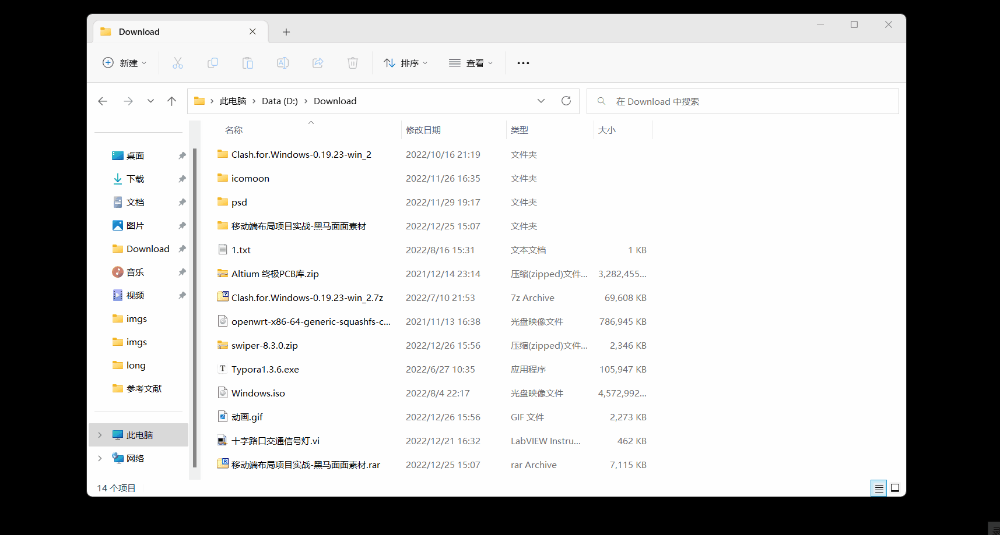

# 1.移动端Web开发

## 1.1移动端基础

### 1.1.1PC端和移动端有什么不同

- PC端和移动端网页的不同在于：PC端屏幕大，且网页固定版心，移动端屏幕小，且网页宽度多数为100%。

  > 注意点：移动端多指手机。

- 一个企业在开发PC端网页和移动端网页时，他们会把PC端网页单独放一个网址，移动端网页单独放一个网址，如：京东PC端网页的网址是 `https://www.jd.com`，京东移动端网页的网址是 `https://m.jd.com/`。

### 1.1.2移动端浏览器现状

- PC端浏览器有：IE（目前IE已经被Edge取代）、Chrome、Firefox、Safari、Opera。
- 移动端浏览器有：UC浏览器、QQ浏览器、欧朋浏览器、百度手机浏览器、360安全浏览器、谷歌浏览器、搜狗手机浏览器、猎豹浏览器、以及其他杂牌浏览器，这些浏览器使用的内核都是 `Webkit` 内核，是因为国内尚无自主研发的内核，所以我们想让CSS3属性兼容所有老版本的移动端浏览器时，只需要在CSS3属性前面添加 `-webkit-` 私有前缀就行。

### 1.3.3移动端屏幕现状

- 近年来移动端设备的屏幕尺寸非常多，碎片化严重，如：安卓端移动设备的分辨率有 `480x800`、`480x854`、`540x960`、`720x1280`、`1080x1920` 等，苹果端移动设备的分辨率有：`640x960`、`640x1136`、`750x1334`、`1242x2208` 等，但是作为开发者我们不需要关注这些分辨率，因为我们的常用尺寸单位是 `px`。

### 1.1.4常见的移动端屏幕尺寸

| 移动端设备            | 尺寸（英寸） | 物理像素点 | 开发尺寸（px） | 物理像素比（dpr） |
| :-------------------- | :----------: | :--------: | :------------: | :---------------: |
| iphone3G              |     3.5      |  320×480   |    320*480     |        1.0        |
| iphone4/4S            |     3.5      |  640×960   |    320*480     |        2.0        |
| iphone5/5S/5C         |     4.0      |  640×1136  |    320*568     |        2.0        |
| iphone6               |     4.7      |  750×1334  |    375*667     |        2.0        |
| iphone6 Plus          |     5.5      | 1080×1920  |    414*736     |        2.6        |
| iphone7               |     4.7      |  750×1334  |    375*667     |        2.0        |
| iphone7 Plus          |     5.5      | 1080×1920  |    414*736     |        2.6        |
| iPhone 8              |     4.7      |  750×1334  |    375*667     |        2.0        |
| iPhone 8 Plus         |     5.5      | 1080×1920  |    414*736     |        2.6        |
| iPhone X              |     5.8      | 1125×2436  |    375*812     |        3.0        |
| iPhone XS             |     5.8      | 1125×2436  |    375*812     |        3.0        |
| iPhone XS Max         |     6.5      | 1242×2688  |    414*896     |        3.0        |
| iPhone XR             |     6.1      |  828×1792  |    414*896     |        2.0        |
| iPhone 11             |     6.1      |  828×1792  |    414*896     |        2.0        |
| iPhone 11 PRO         |     5.8      | 1125×2436  |    375*812     |        3.0        |
| iPhone 11 Pro Max     |     6.5      | 1242×2688  |    414*896     |        3.0        |
| iPhone 12 mini        |     5.4      | 1080×2340  |    375*812     |       2.88        |
| iPhone 12/12Pro       |     6.1      | 1170×2532  |    390*844     |        3.0        |
| iPhone 12 Pro Max     |     6.7      | 1284×2778  |    428*926     |        3.0        |
| iPhone 13 mini        |     5.4      | 1080×2340  |    375*812     |       2.88        |
| iPhone 13/13Pro       |     6.1      | 1170×2532  |    390*844     |        3.0        |
| iPhone 13 Pro Max     |     6.7      | 1284×2778  |    428*926     |        3.0        |
| iPad Mini             |     7.9      | 1488×2266  |    768*1024    |        1.0        |
| iPad Pro 11           |      11      | 1668×2388  |    834*1194    |        2.0        |
| iPad Pro 12.9         |     12.9     | 2048×2732  |   1024*1366    |        2.0        |
| Nexus 4               |     4.7      |  768×1280  |    384*640     |        2.0        |
| Nexus 5X              |     5.2      | 1080×1920  |    411*731     |        2.6        |
| Nexus 7               |     7.0      |  800×1280  |    600*960     |        1.3        |
| Samsung Galaxy Note 4 |     5.7      | 1440×2560  |    480*853     |        3.0        |
| Sony Xperia Z Ultra   |     6.4      | 1080×1920  |    540*960     |        2.0        |
| HTC One M8            |     4.4      | 1080×1920  |    360*640     |        3.0        |

### 1.1.5移动端调试方法

- 谷歌浏览器的模拟手机调试，如下图所示：

  

## 1.2视口

### 1.2.1什么是视口

- 视口（viewport）就是浏览器显示页面内容的屏幕区域，视口可以分为布局视口、视觉视口和理想视口。

### 1.2.2布局视口

- 为了解决早期PC端网页在手机上显示的问题，移动端浏览器都默认设置了一个布局视口，布局视口如下图所示：

  

- ios、Android基本都将布局视口分辨率设置为980px，所以PC上的网页大多也能在手机上呈现，但是网页元素看上去会非常小，一般可以通过手动缩放网页，如下图所示：

  

### 1.2.3视觉视口

- 视觉视口就是用户正在看到的网站的区域，如下图所示：

  

- 我们可以通过缩放去操作视觉视口，但不会影响布局视口，布局视口仍保持原来的宽度，如下图所示：

  

### 1.2.4理想视口

- 理想视口是为了使网站在移动端中有最理想的浏览和阅读宽度而设定的，我们通过视口标签来设置理想视口，视口标签的主要目的是把布局视口的宽度设置为和视觉视口的宽度一致，简单理解就是设备有多宽，我们的布局视口就有多宽，这样就形成了理想视口。

  > 注：理想视口，对移动设备来讲，是最理想的视口尺寸。

### 1.2.5视口标签

- HTML使用 `<meta />` 标签来设置理想视口。

- 语法：

  ```html
  <meta />
  ```

- `<meta />` 标签的属性，如下表所示：

  | 属性名  | 属性值                                                       | 说明                 |
  | :-----: | :----------------------------------------------------------- | -------------------- |
  |  name   | viewport                                                     | 设置该标签为视口标签 |
  | content | width=device-width（设置布局视口的宽度，这里设置的是视觉视口有多宽布局视口就有多宽） initial-scale=数字（设置初始缩放比，数字一般为1.0，数字要大于0） maximum-scale=数字（设置最大缩放比，数字一般为1.0，数字要大于0） minimum-scale=数字（设置最小缩放比，数字一般为1.0，数字要大于0） user-scalable=yes或no（设置用户是否可以手动缩放，yes为用户可以手动缩放，no为用户不可以手动缩放） | 设置理想视口         |

- 标准的理想视口写法为 `<meta name="viewport" content="width=device-width, initial-scale=1.0, maximum-scale=1.0, minimum-scale=1.0, user-scalable=no" />`。

- 注意点：

  - `<meta />` 标签是写在 `<head>` 标签里的。
  - `content` 属性的属性值要用逗号进行分隔。

- 演示代码：

  ```html
  <!DOCTYPE html>
  <html lang="en">
  <head>
      <meta charset="UTF-8">
      <meta name="viewport" content="width=device-width, initial-scale=1.0, maximum-scale=1.0, minimum-scale=1.0, user-scalable=no" />
      <title>Document</title>
  </head>
  <body>
      NoobCaptain
  </body>
  </html>
  ```

- 演示结果：

  

## 1.3二倍图

### 1.3.1物理像素和物理像素比

- 物理像素点指的是屏幕显示的最小颗粒，是物理真实存在的，这是厂商在出厂时就设置好了，如：苹果6\7\8的物理像素点是 `750×1334`。

- 1CSS像素（px）能显示多少个物理像素点就称为物理像素比或屏幕像素比，如：苹果6\7\8的屏幕尺寸是4.7英寸，它只能显示 `375px×667px` 的网页区域，但是苹果6\7\8物理像素点是 `750×1334` 所以苹果6\7\8的物理像素比就为 `2.0`。

  > 注：物理像素比=物理像素点/CSS像素。

- 物理像素比提出的原因是在早期，PC端及移动端都是1CSS像素显示1个物理像素点，但是随着Retina（视网膜屏幕）显示技术的普及，可以将更多的物理像素点压缩至一块屏幕里，从而达到更高的分辨率，并提高屏幕显示的细腻程度，此时1CSS像素就可以显示多个物理像素点，所以提出了物理像素比，如下图所示：

  

- 因为我们要使用理想视口，所以布局视口和视觉视口的大小一样，又因为移动端的屏幕尺寸是不变的，所以它能显示的网页区域也是不变的，所以我们在布局移动端的时候，要按照它能显示的网页区域的大小来布局，如：给的移动端网页设计稿的大小和苹果6\7\8物理像素点一样都为 `750×1334`，设计稿里面有个 `100px*100px` 的盒子，我们在布局苹果6\7\8移动端时盒子的大小就应该为 `(100/像素比)px*(100px/像素比)px`，一般给的移动端网页设计稿的大小都会和移动端能显示的网页区域的大小一样。

### 1.3.2多倍图

- 对于一张 `50px*50px` 的图片如果直接布局到移动端，因为我们要使用理想视口，所以布局视口和视觉视口的大小一样，又因为屏幕分辨率比视觉视口能显示的网页区域的大小大，所以图片会按照物理像素比放大，这就会使得图片变得模糊，为了使图片不模糊，我们可以将 `50px*50px` 的图片替换成 `(50×物理像素比)px*(50×物理像素比)px` 的图片，然后将 `(50×物理像素比)px*(50×物理像素比)px` 的图片缩小到 `50px*50px` 这样图片就不会模糊了，如：我们要把 `50px*50px` 的图片布局到苹果6/7/8移动端中，此时因为我们要使用理想视口，所以布局视口和视觉视口的大小一样，又因为苹果6/7/8的物理像素点为 `750×1334`，苹果6/7/8的视觉视口为 `375px×667px`，所以苹果6/7/8的屏幕分辨率比视觉视口能显示的网页区域的大小大，所以图片会按照物理像素比被放大2倍，这就会使得图片变得模糊，为了使图片不模糊，我们可以将 `50px*50px` 的图片替换成 `(50×2)px*(50×2)px` 的图片，然后将 `(50×2)px*(50×2)px` 的图片缩小到 `50px*50px` 这样图片就不会模糊了。

- 注意点：

  - 背景图片也同样要注意缩放问题。

  - 字体不用考虑缩放问题，因为字体是矢量的，不会失真。

- 演示代码：

  ```html
  <!DOCTYPE html>
  <html lang="en">
  <head>
      <meta charset="UTF-8">
      <meta name="viewport" content="width=device-width, initial-scale=1.0">
      <title>Document</title>
  </head>
  <body>
      
      
  </body>
  </html>
  ```

- 演示结果：

  

### 1.3.3背景图片缩放属性

- CSS使用 `background-size` 属性来设置定背景图片的尺寸。

- 语法：

  ```css
  选择器 {
      background-size: 设置背景图片的宽度 设置背景图片的高度;
  }
  ```

- 背景图片缩放属性的属性值取值为：

  - 设置背景图片的宽度：像素值（设置背景图片的宽度为多少像素）、`数字+%`（设置背景图片的宽度为元素的宽度的百分之几）。
  - 设置背景图片的高度：像素值（设置背景图片的高度为多少像素）、`数字+%`（设置背景图片的高度为元素的高度的百分之几）。
  - `contain`（将背景图片等比例缩放，直到背景图片的宽度或高度等于元素的宽度或高度）。
  - `cover`（将背景图片等比例缩放，直到背景图片铺满整个元素）。

- 注意点：如果 `background-size` 属性只设置了一个属性值，且该属性值为像数值或 `数字+%`，那么该值一定是设置背景图片的宽度，且图片会等比例缩放直到达到设定的宽度。

- 演示代码：

  ```html
  <!DOCTYPE html>
  <html lang="en">
  <head>
      <meta charset="UTF-8">
      <meta name="viewport" content="width=device-width, initial-scale=1.0">
      <title>Document</title>
      <style>
          div {
              width: 300px;
              height: 400px;
              border: 1px solid pink;
              background: url(./imgs/apple100.jpg) no-repeat;
              background-size: contain;
          }
      </style>
  </head>
  <body>
      <div></div>
  </body>
  </html>
  ```

- 演示结果：

  

## 1.4移动端开发选择

- 开发移动端的主流方案有：

  - 单独制作移动端页面，通常情况下，PC端的页面和移动端的页面是分别存放在两个不同的网址中的，在PC端页面的网址域名前面加m（mobile）就可以打开移动端页面了，或者通过判断设备，如果是移动设备打开，则跳到移动端页面，如下图所示：

    

  - 响应式兼容PC移动端就是通过判断屏幕宽度来改变样式，以适应不同终端，但是有缺点那就是制作麻烦， 需要花很大精力去调兼容性问题，如下图所示：

    

## 1.5移动端技术解决方案

### 1.5.1移动端的CSS初始化

- 移动端CSS初始化推荐使用 `normalize.css`，因为 `normalize.css` 保护了有价值的默认值、修复了浏览器的bug。
- `normalize.css` 下载地址：http://necolas.github.io/normalize.css/。

### 1.5.2特殊样式

- 当在移动端时我们点击超链接时会有淡蓝色的颜色，如下图所示：

  

- 当在移动端时如果不想我们点击超链接时会有淡蓝色的颜色，我们可以给超链接标签添加 `-webkit-tap-highlight-color: transparent;` 属性，该属性是将淡蓝色变成透明色。

- 在iOS移动端时，我们不能给按钮和表单控件自定义样式，此时我们需要给按钮和表单控件添加 `-webkit-appearance: none;` 属性，这样我们才能给按钮和表单控件自定义样式。

- 当在移动端时如果长按页面中的超链接或图片时会弹出菜单，如下图所示：

  

- 当在移动端时如果不想长按页面中的超链接或图片时会弹出菜单，我们可以给超链接标签和图片标签添加 ` -webkit-touch-callout: none;` 属性。

## 1.6移动端常见的布局

### 1.6.1移动端技术选型

- 单独制作移动端页面采用流式布局、flex弹性布局、less+rem+媒体查询布局、混合布局。
- 响应式页面兼容移动端采用媒体查询、Bootstrap。

### 1.6.2移动端Web开发之流式布局

- 流式布局，就是百分比布局，也称非固定像素布局，通过盒子的宽度设置成百分比来根据屏幕的宽度来进行伸缩，不受固定像素的限制，内容向两侧填充。

- 注意点：

  - 要设置盒子的最小宽度和最大宽度，防止盒子宽度很小或很大时会影响到盒子里面的内容。
  - 设置盒子的最小宽度使用 `min-width` 属性。
  - 设置盒子的最大宽度使用 `max-width` 属性。
  - 设置盒子的最小高度使用 `min-height` 属性。
  - 设置盒子的最大高度使用 `max-height` 属性。

- 演示代码：

  ```html
  <!DOCTYPE html>
  <html lang="en">
  <head>
      <meta charset="UTF-8">
      <meta name="viewport" content="width=device-width, initial-scale=1.0">
      <title>Document</title>
      <style>
          * {
              margin: 0;
          }
          .box {
              width: 100%;
              max-width: 1280px;
              min-width: 320px;
              height: 200px;
              margin: 0 auto;
          }
          .box :nth-child(1) {
              float: left;
              width: 50%;
              height: 100%;
              background-color: pink;
          }
          .box :nth-child(2) {
              float: left;
              width: 50%;
              height: 100%;
              background-color: skyblue;
          }
      </style>
  </head>
  <body>
      <div class="box">
          <div></div>
          <div></div>
      </div>
  </body>
  </html>
  ```

- 演示结果：

  

### 1.6.3京东移动端案例

#### 1.6.3.1多倍精灵图

- 多倍精灵图的原理和多倍图的原理一样，我们需要先将精灵图缩小然后在测量其距离。

#### 1.6.3.2图片格式

- `DPG` 图片压缩技术是京东自主研发的，经测试该技术，可直接节省用户近50%的浏览流量，极大的提升了用户的网页打开速度，能够兼容 `jpeg`，实现全平台、全部浏览器的兼容支持，经过内部和外部上万张图片的人眼浏览测试后发现，压缩后的图片和 `webp` 的清晰度对比没有差距。
- `webp` 图片格式是谷歌开发的一种旨在加快图片加载速度的图片格式，图片压缩体积大约只有 `JPEG` 的 `2/3`，并能节省大量的服务器宽带资源和数据空间。

### 1.6.4移动端Web开发之flex布局

#### 1.6.4.1流式布局与flex布局

- 流式布局的优缺点：
  - 优点：兼容性好。
  - 缺点：布局繁琐，局限性，不能再移动端很好的布局。
- flex布局的优缺点：
  - 优点：操作方便，布局极为简单，移动端应用很广泛。
  - 缺点：PC端浏览器支持情况较差，IE11或更低版本，不支持或仅部分支持。

#### 1.6.4.2flex布局原理

- flex是flexible Box的缩写，意为弹性布局，用来为盒状模型提供最大的灵活性，任何一个容器都可以指定为flex布局。
- flex布局也叫伸缩布局、弹性布局、伸缩盒布局、弹性盒布局。
- flex布局的作用就是将父盒子定义为flex容器，来控制子盒子的位置和排列方式，避免浮动布局中脱离标准流现象发生。

- 采用flex布局的父盒子，称为flex容器（Flex container），简称容器，它的所有子盒子自动成为容器成员，称为flex项目（Flex item），简称项目。

- flex布局由flex容器、flex项目、主轴、交叉轴（也叫侧轴）组成的，如下图所示：

  

#### 1.6.4.3flex布局给父元素设置的属性

- flex布局给父元素设置的属性有：

  - `display` 属性设置该父元素为flex布局。
  - `flex-direction` 属性设置主轴的方向。
  - `justify-content` 属性设置主轴上的子元素的对齐方式。
  - `flex-wrap` 属性设置子元素是否换行。
  - `align-items` 属性设置侧轴上的子元素排列方式（单行）。
  - `align-content` 属性设置侧轴上的子元素的排列方式（多行）。
  - `flex-flow` 复合属性，相当于同时设置了 `flex-direction` 属性和 `flex-wrap` 属性。

- 语法：

  ```css
  选择器 {
      display: 属性值;
      flex-direction: 属性值;
      justify-content: 属性值;
      flex-wrap: 属性值;
      align-content: 属性值;
      align-items: 属性值;
      flex-flow: flex-direction属性 flex-wrap属性;
  }
  ```

- `display`、`flex-direction`、`justify-content`、`flex-wrap`、`align-content`、`align-items`、`flex-flow` 属性的属性值分别取值为：

  - `display` 属性：`flex`（设置该元素为flex布局）。
  - `flex-direction` 属性：`row`（默认值，设置主轴方向为水平方向的从左到右），`row-reverse`（设置主轴的方向为水平方向的从右到左），`column`（设置主轴的方向为垂直方向的从上到下），`column-reverse`（设置主轴的方向为垂直方向的从下到上）。
  - `justify-content` 属性：`flex-start`（默认值，设置在主轴上的子元素紧挨着主轴的头部对齐），`flex-end`（设置在主轴上的子元素紧挨着主轴的尾部对齐），`center`（设置在主轴上的子元素在主轴上居中对齐），`space-around`（设置在主轴上的子元素沿着主轴均匀对齐，空白间距均分在子元素的两侧），`space-between`（设置在主轴上的子元素沿着主轴均匀对齐，空白间距均分在相邻的子元素之间），`space-evenly`（设置在主轴上的子元素沿着主轴均匀对齐，子元素和父元素之间间距相等）
  - `flex-wrap` 属性：`nowrap`（默认值，设置子元素在父元素内只能一行排列），`wrap`（设置子元素在父元素内可以多行排列）。
  - `align-items` 属性：`flex-start`（设置在侧轴上的子元素紧挨着侧轴的头部对齐），`flex-end`（设置在侧轴上的子元素紧挨着侧轴的尾部对齐），`center`（设置在侧轴上的子元素在侧轴上居中对齐），`stretch`（默认值，设置在侧轴上的子元素拉伸到父元素的高度）
  - `align-content` 属性：`flex-start`（设置在侧轴上的子元素紧挨着侧轴的头部对齐），`flex-end`（设置在侧轴上的子元素紧挨着侧轴的尾部对齐），`center`（设置在侧轴上的子元素在侧轴上居中对齐），`stretch`（默认值，设置在侧轴上的子元素拉伸到父元素的高度），`space-around`（设置在侧轴上的子元素沿着侧轴均匀对齐，空白间距均分在子元素的两侧），`space-between`（设置在侧轴上的子元素沿着侧轴均匀对齐，空白间距均分在相邻的子元素之间）。
  - `flex-flow` 复合属性：
    - `flex-direction` 属性：`flex-direction` 属性的属性值。
    - `flex-wrap` 属性：`flex-wrap` 属性的属性值。

- 注意点：

  - 当给父元素设为flex布局之后，父元素里面的子元素的 `float`（浮动）、`clear`（清除浮动）、`vertical-align`（垂直居中）属性将失效。
  - 当给父元素设为flex布局之后，只能控制它的子元素的位置和排列方式，它的下一层元素不能被控制，如：孙元素不受控制。
  - 当给父元素设为flex布局之后，子元素无论是什么显示模式都会转换成行内块显示模式，并且父元素独占一行。
  - 主轴和侧轴是会变化的，就看 `flex-direction` 属性设置主轴为什么方向，剩下的方向就是侧轴，如：主轴设置为垂直方向，那么水平方向就是侧轴，而我们的子元素是跟着主轴来排列的，如：主轴的方向为水平方向的从右到左，那么子盒子就是从右开始往左排，最后一个盒子在最左边，其他主轴方向的子盒子排列同理。
  - 使用 `justify-content` 属性之前一定要确定好主轴的方向。
  - 使用 `flex-wrap` 属性的 `nowrap` 属性值时，如果第一个子元素的宽度和第二个子元素的宽度加起来大于父元素的宽度，那么会缩小第一个和第二个子元素的宽度，直到这两个子元素能在父元素内一行排列时。
  - 使用 `align-items`、`align-content` 属性时，一定要确定好侧轴的方向。
  - 使用 `align-items`、`align-content` 属性的 `stretch` 属性值时，要确保子元素没有指定高度，否则没有效果。
  - `align-items` 属性和 `align-content` 属性的区别：
    - `align-items` 属性：适用于子元素只有一行的情况下。
    - `align-items` 属性：适用于子元素有换行（多行）的情况下，如果子元素只有一行的情况下，使用 `align-items` 属性，则 `align-items` 属性不生效。
  - `flex-flow` 复合属性的属性值中间要用逗号隔开。

- 演示代码：

  ```html
  <!DOCTYPE html>
  <html lang="en">
  <head>
      <meta charset="UTF-8">
      <meta name="viewport" content="width=device-width, initial-scale=1.0">
      <title>Document</title>
      <style>
          .box,
          .box1 {
              display: flex;
              width: 300px;
              height: 300px;
              background-color: pink;
              margin-bottom: 10px;
          }
          span {
              width: 100px;
              height: 100px;
              background-color: skyblue;
          }
          .box {
              flex-wrap: wrap;
              align-content: center;
          }
          .box1 {
              flex-flow: column wrap;
              align-content: space-between;
          }
      </style>
  </head>
  <body>
      <div class="box">
          <span>1</span>
          <span>2</span>
          <span>3</span>
          <span>4</span>
      </div>
      <div class="box1">
          <span>1</span>
          <span>2</span>
          <span>3</span>
          <span>4</span>
      </div>
  </body>
  </html>
  ```

- 演示结果：

  

#### 1.6.4.4flex布局给子元素设置的属性

- flex布局给父元素设置的属性有：

  - `flex` 属性设置子元素自身分配多少份的剩余空间。
  - `align-self` 属性设置子元素自身在侧轴方向上的对齐方式。
  - `order` 属性设置子元素自身的排列顺序。

- 语法：

  ```css
  选择器 {
      flex: 属性值;
      align-self: 属性值;
      order: 属性值;
  }
  ```

- `flex`、`align-self`、`order` 属性的属性值分别取值为：

  - `flex` 属性：数字（设置子元素自身分配多少份的剩余空间），`数字+%`（设置子元素自身的宽度为父元素的宽度的百分之几）。
  - `align-self` 属性：`auto`（默认值，继承flex容器（父元素）的 `align-items` 属性的属性值），`flex-start`（设置子元素自身紧挨着侧轴的头部对齐），`flex-end`（设置子元素自身紧挨着侧轴的尾部对齐），`center`（设置子元素自身在侧轴上居中对齐），`stretch`（设置子元素自身拉伸到父元素的高度）。
  - `order` 属性：数字（设置子元素自身在Flex容器内的排列顺序，数字越小排列越靠前，数字越小排列越靠后，默认值为0）。

- 注意点：

  - 使用 `align-self` 属性的 `stretch` 属性值时，要确保子元素没有指定高度，否则没有效果。
  - `order` 属性和 `z-index` 属性不一样。

- 演示代码：

  ```html
  <!DOCTYPE html>
  <html lang="en">
  <head>
      <meta charset="UTF-8">
      <meta name="viewport" content="width=device-width, initial-scale=1.0">
      <title>Document</title>
      <style>
          .box,
          .box1 {
              display: flex;
              width: 600px;
              height: 200px;
              background-color: pink;
              margin-bottom: 10px;
          }
          .box span:nth-child(n+2) {
              width: 100px;
              height: 100px;
              background-color: skyblue;
          }
          .box span:first-child {
              flex: 1;
              height: 100px;
              background-color: green;
          }
          .box span:last-child {
              order: -2;
          }
          .box1 span {
              width: 100px;
              height: 100px;
              background-color: skyblue;
          }
          .box1 span:first-child {
              align-self: flex-end;
          }
      </style>
  </head>
  <body>
      <div class="box">
          <span>1</span>
          <span>2</span>
          <span>3</span>
      </div>
      <div class="box1">
          <span>1</span>
          <span>2</span>
          <span>3</span>
          <span>4</span>
      </div>
  </body>
  </html>
  ```

- 演示结果：

  

### 1.6.5携程移动端首页

####  1.6.5.1背景颜色渐变属性

- CSS使用 `background` 属性设置背景颜色渐变。

- 语法：

  ```css
  选择器 {
  	background: linear-gradient(起始方向,渐变颜色1,渐变颜色2,···);
  }
  ```

- `background` 属性的属性值取值为：

  - 起始方向：`top`（默认值，设置背景颜色从上往下渐变）、`bottom`（设置背景颜色从下往上渐变）、`left`（设置背景颜色从左往右渐变）、`right`（设置背景颜色从右往左渐变）、度数（设置背景颜色从多少度开始渐变）。

    > 注1：设置起始方向的值为度数时，度数设置的方向，如下图所示：
    >
    > 
    >
    > 注2：如上图所示，如果度数设置为 `90deg` 那么表示设置背景颜色从右往左渐变。

  - 渐变颜色：

    - `transparent`（默认值，透明，无颜色）。

    - 预定义的颜色值：`red`、`green`、`blue`、`black`、`white`、`gray` 等。

    - 十六进制颜色表示法：`#FF0000`、`#FF6600` 等。

    - RGB颜色表示法：`rgb(255,0,0)`、`rgb(100%,0,0)` 等。

    - RGBA颜色表示法：`rgba(255,0,0,0)`、`rgba(100%,0,0,0)` 等。
  
  
    > 注：渐变颜色可以有多个，设置了多少个就表示从起始方向开始渐变多少个颜色，起始方向开始的颜色为第一个设置的渐变颜色。

- 注意点：设置背景颜色渐变必须添加浏览器私有前缀，如：`background: -webkit-linear-gradient(left, red , blue);`。

- 演示代码：

  ```html
  <!DOCTYPE html>
  <html lang="en">
  <head>
      <meta charset="UTF-8">
      <meta name="viewport" content="width=device-width, initial-scale=1.0">
      <title>Document</title>
      <style>
          div {
              width: 300px;
              height: 100px;
              background: -webkit-linear-gradient(right,pink,skyblue);
          }
      </style>
  </head>
  <body>
      <div></div>
  </body>
  </html>
  ```

- 演示结果：

  

### 1.6.6移动端Web开发之rem布局

#### 1.6.6.1流式布局与flex布局与rem布局

- 流式布局和flex布局主要针对于宽度布局，它们的高度是固定的，并且它们的页面中的文字不能随着屏幕大小的变化而变化，`rem` 布局就很好的解决了此问题，因为 `rem` 布局是相对于 `<html>` 标签中的文字大小来改变元素的大小的，所以我们可以通过媒体查询使其 `<html>` 标签根据不同的屏幕大小设置不同的 `<html>` 标签的字体大小，从而使其在不同的屏幕下元素的高度和宽度等比例缩放。

#### 1.6.6.2rem单位

- `rem`（root em）是一个相对单位，类似于 `em`，`em` 是相对于父元素的字体大小，`rem` 是相对于 `<html>` 标签的字体大小，如：`<html>` 标签设置了 `font-size: 12px;` 属性，然后元素设置了 `width: 2rem;` 属性，这就表示着设置元素的宽度为 `24px`。
- `rem` 计算公式：`1rem=1×<html>标签的字体大小`，如：`<html>` 标签设置了 `font-size: 12px;` 属性，那么 `2rem=2×12=24px`。
- `rem` 相较于 `em`，`rem` 是相对于 `<html>` 标签的字体大小，`<html>` 标签只有一个，可以通过修改 `<html>` 标签的字体大小来改变整个页面中的元素的宽度和高度，而 `em` 是相对于父元素的字体大小，父元素的字体大小可能不一致，所以修改起来没有 `rem` 简便。

#### 1.6.6.3媒体查询

- CSS使用 `@media` 属性来设置媒体查询。
- 媒体查询的作用：可以针对不同的媒体类型定义不同的样式，并且还可以针对不同的视口尺寸设置不同的样式。

- 语法：

  ```css
  @media 关键词 媒体类型 关键词 (媒体特性1) 关键词 (媒体特性2) 关键词 (媒体特性3) ··· {
      选择器 {
          声明
          ···
      }
  }
  ```

- 媒体查询的属性值取值为：

  - 媒体类型：`all`（默认值，设置该媒体查询适用于所有设备）、`screen`（设置该媒体查询适用于电脑屏幕、平板电脑、智能手机等）、`print`（设置该媒体查询适用于打印机和打印预览页面）、`speech`（设置该媒体查询适用于阅读器和阅读模式）。

    > 注：将不同的终端设备划分成不同的类型，称为媒体类型。

  - 关键词：`and`（相当于且的意思）、`not`（相当于非的意思）、`only`（相当于只有的意思）。

    > 注：关键词是将媒体类型和媒体特性连接到一起做为媒体查询的条件或者是将多个媒体特性连接到一起做为媒体查询的条件。

  - 媒体特性：`width: 像素值`（设置视口的宽度为多少时触发媒体查询设置的CSS样式）、`height: 像素值`（设置视口的高度为多少时触发媒体查询设置的CSS样式）、`min-width: 像素值`（设置视口的宽度大于等于多少时触发媒体查询设置的CSS样式）、`max-width: 像素值`（设置视口的宽度小于等于多少时触发媒体查询设置的CSS样式）、`min-height: 像素值`（设置视口的高度大于等于多少时触发媒体查询设置的CSS样式）、`max-height: 像素值`（设置视口的高度小于等于多少时触发媒体查询设置的CSS样式）。

- 注意点：

  - 媒体查询的触发条件为，媒体查询中的一个或多个表达式为真时才会触发，如：`not (width: 12px)` 是当视口宽度不等于12px时才为真，此时才会触发媒体查询。

    > 注：媒体查询中的表达式是写在 `@media` 后面的，也就是 `关键词 媒体类型 关键词 (媒体特性1) 关键词 (媒体特性2) 关键词 (媒体特性3) ···`。

  - 媒体类型和关键词和媒体特性都可以按需省略，如：`@media not screen`。

  - 媒体特征必须用小括号包裹。

  - 书写多个媒体查询的媒体特征为 `min-width: 像素值` 或 `min-height: 像素值` 时，为了防止混乱从像数值最小的开始写到像数值最大的为止。

  - 书写多个媒体查询的媒体特征为 `max-width: 像素值` 或 `max-height: 像素值` 时，为了防止混乱从像数值最大的开始写到像数值最小的为止。

- 演示代码：

  ```html
  <!DOCTYPE html>
  <html lang="en">
  <head>
      <meta charset="UTF-8">
      <meta name="viewport" content="width=device-width, initial-scale=1.0">
      <title>Document</title>
      <style>
          @media screen and (min-width: 540px) {
              body {
                  background-color: pink;
              }
          }
          @media screen and (min-width: 640px) {
              body {
                  background-color: skyblue;
              }
          }
          @media screen and (min-width: 740px) {
              body {
                  background-color: green;
              }
          }
      </style>
  </head>
  <body></body>
  </html>
  ```

- 演示结果：

  

#### 1.6.6.4媒体查询+rem单位实现rem布局

- 因为媒体查询可以针对不同的媒体类型定义不同的样式，并且还可以针对不同的视口尺寸设置不同的样式，又因为 `rem` 是相对于 `<html>` 标签的字体大小来计算的，所以我们可以通过媒体查询使得在不同的视口尺寸时，设置不同的 `<html>` 标签的字体大小，然后页面中的元素使用 `rem` 作为尺寸单位，从而在不同的视口宽度时等比例缩放页面中的元素，这就是 `rem` 布局。

- 媒体查询+ `rem` 单位实现 `rem` 布局的步骤：

  1. 确定网页设计稿的宽度和视口宽度一致。

  2. 将视口宽度划分成10份，每一份作为 `<html>` 标签的字体大小，也就是设置 `<html>` 标签的字体大小为 `视口宽度/划分成的份数`，如：如果视口宽度为375px，将视口宽度划分成10份，那么 `<html>` 标签的字体大小就要设置为 `375/10=37.5px`。

     > 注：划分标准不一可以是20份也可以是10份。

  3. 设置元素的宽度高度时，先算出元素宽度高度的 `rem` 值，然后再给元素的宽度高度设置。

     > 注：计算公式：`元素宽度高度的rem值=网页设计稿里元素的宽度高度 / <html> 标签的字体大小`。

  4. 通过使用媒体查询在不同的视口宽度时设置不同的 `<html>` 标签的字体大小，如：我们使用媒体查询在视口宽度为390px时，将其 `<html>` 标签的字体大小设置为 `视口宽度/划分成的份数`，在视口宽度为320px时，将其 `<html>` 标签的字体大小设置为 `视口宽度/划分成的份数`。

     > 注：这里的划分成的份数和第二步划分成的份数是一样的，如：你在视口宽度为375px时，将其划分成10份，那么在视口宽度为320px时和在视口宽度为390px时，也要将其划分成10份。

- 演示代码：

  ```html
  <!DOCTYPE html>
  <html lang="en">
  <head>
      <meta charset="UTF-8">
      <meta name="viewport" content="width=device-width, initial-scale=1.0">
      <title>Document</title>
      <style>
          @media screen and (min-width: 400px) {
              html {
                  font-size: 16px;
              }
          }
          @media screen and (min-width: 800px) {
              html {
                  font-size: 28px;
              }
          }
          div {
              width: 100%;
              height: 5rem;
              background-color: pink;
          }
      </style>
  </head>
  <body>
      <div>购物车</div>
  </body>
  </html>
  ```

- 演示结果：

  

#### 1.6.6.5媒体查询之引入资源

- 我们可以使用媒体查询来针对不同的媒体类型引入不同的CSS样式表，并且还可以针对不同的视口尺寸引入不同的CSS样式表，原理就是直接在 `<link />` 标签中使用媒体查询判断设备的尺寸，然后引用不同的CSS样式表。

- 语法：

  ```html
  <link />
  ```

- `<link />` 标签的属性，如下表所示：

  | 属性名 |      属性值      | 说明                                                         |
  | :----: | :--------------: | ------------------------------------------------------------ |
  |  rel   |    stylesheet    | 定义当前文档与被链接文档之间的关系，该属性值表示被链接的文档是一个样式表文件 |
  | media  | 媒体查询的属性值 | 设置媒体查询                                                 |
  |  href  |       路径       | 设置被链接的文档的路径                                       |

- 演示代码：

  ```html
  <!DOCTYPE html>
  <html lang="en">
  <head>
      <meta charset="UTF-8">
      <meta name="viewport" content="width=device-width, initial-scale=1.0">
      <title>Document</title>
      <link rel="stylesheet" media="screen and (min-width: 400px)" href="./css/style400.css">
      <link rel="stylesheet" media="screen and (min-width: 600px)" href="./css/style600.css">
  </head>
  <body>
      <div>1</div>
      <div>2</div>
  </body>
  </html>
  ```

- 演示结果：

  

#### 1.6.6.6Less基础

##### 1.6.6.6.1维护CSS的弊端

- CSS是一门非程序式语言，它没有变量、函数、SCOPE（作用域）等概念，这就使得CSS需要书写大量看似没有逻辑的代码，使得CSS冗余度是比较高的，也不方便后期的维护及扩展，还有重要的一点是CSS没有很好的计算能力。

##### 1.6.6.6.2Less的简介

- Less（Leaner Style Sheets） 是一门CSS扩展语言，也称为CSS预处理器或CSS预处理语言，Less做为CSS的一种形式的扩展，它并没有减少CSS的功能，而是在现有的CSS语法上，为CSS加入程序式语言的特性，如：它在CSS的语法基础之上，引入了变量，Mixin（混入），运算以及函数等功能，这大大的简化了CSS的编写，并且降低了CSS的维护成本，就像它的名称所说的那样，Less可以让我们用更少的代码做更多的事情。
- Less的中文网址：https://less.bootcss.com/。
- 注意点：常见的CSS预处理器除了Less还有Sass和Stylus。

##### 1.6.6.6.3Less的安装

- 如果使用的是VSCode编译器就不需要安装Less，因为该编译器自带Less。

- 如果不用VSCode编译器就需要按照以下步骤来安装Less：

  1. 下载node.js安装包，如下图所示：

     

     > 注：node.js的中文网址：http://nodejs.p2hp.com/。

  2. 安装node.js，如下图所示：

     

  3. 检查nodejs是否安装成功，只需要在终端中输入 `node -v` 命令后按回车键即可查看，如下图所示：

     

  4. 安装Less，只需要在终端中输入 `npm install -g less` 命令后按回车键即可，如下图所示：

     

  5. 检查Less是否安装成功，只需要在终端中输入 `lessc -v` 命令后按回车键即可查看，如下图所示：

     

##### 1.6.6.6.4Less的使用

- Less的使用步骤：

  1. 新建一个后缀名为 `.less` 的文件，这个文件就是Less文件，我们在这文件里面书写Less语句。
  2. 因为浏览器不识别Less代码，所以网页要引入Less文件编译出来的CSS文件。

- Less的编译：

  - 本质上，Less包含一套自定义的语法及一个解析器，用户根据这些语法定义自己的样式规则，这些规则最终会通过解析器，编译生成对应的CSS文件，所以我们需要把我们的Less文件，编译成为CSS文件，这样我们的HTML页面才能使用。

  - Less的编译步骤：在VSCode编译器中安装Easy LESS插件，插件安装完毕后，重新启动下VSCode编译器，然后我们只要保存Less文件，就会编译出CSS文件，如下图所示：

    

    > 注1：如果不想保存Less文件就编译出CSS文件，那么我们可以在Less文件里的第一行书写禁止编译代码 `out: false`。
    >
    > 注2：保存Less文件后，编译出的CSS文件是存放在和Less文件相同的路径中的，如果想修改编译出的CSS文件的存放路径，我们可以在Less文件里的第一行书写导出代码 `//out: 编译出来的CSS文件的存放路径`。

##### 1.6.6.6.5Less的变量

- 变量就是用于存放数据的容器，我们通过变量名来获取数据，数据是可以修改，简单来说就是变量是一个装东西的盒子，里面装的东西是数据，装的数据是可以修改的，变量名就是这个盒子的名称，我们通过变量名来获取盒子里装的数据。

- Less定义变量的语法：

  ```less
  @变量名: 值;
  ```

- 取值为：

  - 变量名：用户自定义。
  - 值：用户自定义。

- Less使用变量的语法：

  ```less
  @变量名;
  ```

- 注意点：

  - 变量名必须有 `@` 为前缀，且变量名不能包含特殊字符并且不能以数字开头，如：`@color: pink;`。
  - 变量区分大小写，如：`@color` 和 `@Color` 是两个不同的变量。

- 演示代码：

  ```less
  @color: pink;
  div {
      width: 100px;
      height: 100px;
      background-color: @color;
  }
  ```

- 演示代码编译出的CSS文件：

  ```css
  div {
    width: 100px;
    height: 100px;
    background-color: pink;
  }
  ```

- 将演示代码编译出的CSS文件引入到HTML页面：

  ```html
  <!DOCTYPE html>
  <html lang="en">
  <head>
      <meta charset="UTF-8">
      <meta name="viewport" content="width=device-width, initial-scale=1.0">
      <title>Document</title>
      <link rel="stylesheet" href="./12-Less的变量.css">
  </head>
  <body>
      <div></div>
  </body>
  </html>
  ```

- 演示结果：

  

##### 1.6.6.6.6Less的嵌套

- Less的嵌套语法的作用是快速生成后代选择器。

- 语法：

  ```less
  父元素选择器 {
      父元素的CSS属性
      子元素选择器 {
          子元素的CSS属性
          ···
      }
  }
  ```

- 如果要给父元素添加交集、伪类、伪元素选择器，则使用下面的语法：

  ```less
  父元素选择器 {
      父元素的CSS属性
      &交集、伪类、伪元素选择器 {
          父元素的交集、伪类、伪元素选择器的CSS属性
          ···
      }
  }
  ```

  > 注：`&` 的意思是不生成后代选择器，表示为父元素选择器，通常配合伪类选择器或伪元素选择器使用。

- 演示代码：

  ```less
  @color: pink;
  div {
      width: 100px;
      height: 100px;
      background-color: @color;
      a {
          color: #fff;
          &:hover {
              color: skyblue;
          }
      }
  }
  ```

- 演示代码编译出的CSS文件：

  ```css
  div {
    width: 100px;
    height: 100px;
    background-color: pink;
  }
  div a {
    color: #fff;
  }
  div a:hover {
    color: skyblue;
  }
  ```

- 将演示代码编译出的CSS文件引入到HTML页面：

  ```html
  <!DOCTYPE html>
  <html lang="en">
  <head>
      <meta charset="UTF-8">
      <meta name="viewport" content="width=device-width, initial-scale=1.0">
      <title>Document</title>
      <link rel="stylesheet" href="./13-Less的嵌套.css">
  </head>
  <body>
      <div>
          <a href="#">123</a>
      </div>
  </body>
  </html>
  ```

- 演示结果：

  

##### 1.6.6.6.7Less的运算

- Less提供了加（+）、减（-）、乘（*）、除（/）算术运算，任何数字、颜色或者变量都可以参与运算。

- 语法：

  ```less
  (值 运算符 值)
  ```

- 取值：

  - 运算符：`+`（加）、`-`（减）、`*`（乘）、`/`（除）。
  - 值：像数值、数字、`数字+%`、`数字+rem` 等。

- 注意点：

  - 运算符的左右两侧必须要有一个空格隔开。
  - 如果两个值参与运算，只有一个值有单位，则最后的结果就以这个单位为准，如：`15px-10=5px`。
  - 如果两个值参与运算，两个值都有单位且单位不同，则最后的结果就以第一个单位为准，如：`15px-5rem=10px`。

- 演示代码：

  ```less
  @width: (20px * 10);
  div {
      width: (@width - 50);
      height: ((5 + 5) * 15px);
      background-color: pink;
      color: #666 - #222;
  }
  ```

- 演示代码编译出的CSS文件：

  ```css
  div {
    width: 150px;
    height: 150px;
    background-color: pink;
    color: #444444;
  }
  ```

- 将演示代码编译出的CSS文件引入到HTML页面：

  ```html
  <!DOCTYPE html>
  <html lang="en">
  <head>
      <meta charset="UTF-8">
      <meta name="viewport" content="width=device-width, initial-scale=1.0">
      <title>Document</title>
      <link rel="stylesheet" href="./14-Less的运算.css">
  </head>
  <body>
      <div>
          123
      </div>
  </body>
  </html>
  ```

- 演示结果：

  

##### 1.6.6.6.8Less的导入

- Less的导入的作用是在Less文件中可以导入其他文件中的内容。

- 语法：

  ```less
  @import "要导入的文件的路径";
  ```

- 注意点：如果导入的文件是Less文件，可以省略后缀名 `.less`。

- 演示代码：

  ```less
  @import "./14-Less的运算";
  div {
      border: 1px solid red;
  }
  ```

- 演示代码编译出的CSS文件：

  ```css
  div {
    width: 150px;
    height: 150px;
    background-color: pink;
    color: #444444;
  }
  div {
    border: 1px solid red;
  }
  ```

- 将演示代码编译出的CSS文件引入到HTML页面：

  ```html
  <!DOCTYPE html>
  <html lang="en">
  <head>
      <meta charset="UTF-8">
      <meta name="viewport" content="width=device-width, initial-scale=1.0">
      <title>Document</title>
      <link rel="stylesheet" href="./15-Less的导入.css">
  </head>
  <body>
      <div></div>
  </body>
  </html>
  ```

- 演示结果：

  

#### 1.6.6.7媒体查询+rem单位+Less实现rem布局

- 媒体查询+ `rem` 单位+Less实现 `rem` 布局和媒体查询+ `rem` 单位实现 `rem` 布局的原理是一样的，它们的区别在于媒体查询+ `rem` 单位+Less实现 `rem` 布局比媒体查询+ `rem` 单位实现 `rem` 布局多了一个Less，这个Less的作用是用于计算的，如：在媒体查询+ `rem` 单位实现 `rem` 布局中我们需要手动计算 `<html>` 标签的字体大小和元素宽度高度的 `rem` 值，有了Less之后我们就不需要手动计算其字体大小和 `rem` 值了。

- 媒体查询+ `rem` 单位+Less实现 `rem` 布局的步骤和媒体查询+ `rem` 单位实现 `rem` 布局的步骤一样，只是需要使用Less来编写CSS代码，在需要手动计算的地方，使用Less来计算就好了。

- 演示代码：

  ```less
  @font: (750px / 10);
  @media screen and (min-width: 400px) {
      html {
          font-size: (400px / 10);
      }
  }
  @media screen and (min-width: 750px) {
      html {
          font-size: @font;
      }
  }
  div {
      width: (100rem / @font);
      height: (100rem / @font);
      background-color: pink;
  }
  ```

- 演示代码编译出的CSS文件：

  ```css
  @media screen and (min-width: 400px) {
    html {
      font-size: 40px;
    }
  }
  @media screen and (min-width: 750px) {
    html {
      font-size: 75px;
    }
  }
  div {
    width: 1.33333333rem;
    height: 1.33333333rem;
    background-color: pink;
  }
  ```

- 将演示代码编译出的CSS文件引入到HTML页面：

  ```html
  <!DOCTYPE html>
  <html lang="en">
  <head>
      <meta charset="UTF-8">
      <meta name="viewport" content="width=device-width, initial-scale=1.0">
      <title>Document</title>
      <link rel="stylesheet" href="./16-媒体查询+rem单位+Less实现rem布局.css">
  </head>
  <body>
      <div></div>
  </body>
  </html>
  ```

- 演示结果：

  

### 1.6.7苏宁易购移动端首页

#### 1.6.7.1IE适配

- HTML使用 `<meta />` 标签来实现IE适配。

- 语法：

  ```html
  <meta />
  ```

- `<meta />` 标签的属性，如下表所示：

  |   属性名   |     属性值      | 说明                                    |
  | :--------: | :-------------: | --------------------------------------- |
  | http-equiv | X-UA-Compatible | 指定IE浏览器解析网页时使用IE8以上的版本 |
  |  content   |     IE=edge     | 设置文档兼容性模式为edge                |

- 注意点：`<meta />` 标签是写在 `<head>` 标签里的。

- 演示代码：

  ```html
  <!DOCTYPE html>
  <html lang="en">
  <head>
      <meta charset="UTF-8">
      <meta http-equiv="X-UA-Compatible" content="IE=edge">
      <title>Document</title>
  </head>
  <body></body>
  </html>
  ```

### 1.6.8黑马面面案例

#### 1.6.8.1Swiper插件

- Swiper是一个轮播图插件。

- Swiper插件中文官网地址为：https://www.swiper.com.cn/。

- Swiper插件下载，如下图所示：

  

- Swiper插件的使用步骤：

  1. 解压下载的Swiper插件，把里面的 `swiper-bundle.min.css` 和 `swiper-bundle.min.js` 文件分别复制到项目的CSS文件夹和JS文件夹，然后在HTML页面中引入这两个文件，如下图所示：

     

  2. 在官网找到类似所需的轮播图案例，复制其HTML样式和CSS样式和JS语法到HTML页面中，在复制其HTML结构时，要用一个盒子将这些HTML结构装起来，如下图所示：

     

  3. 如果使用的是Swiper7.0以上的版本要把HTML页面中的 `swiper-container` 类名改成 `swiper`，如下图所示：

     

  4. 根据需求修改模块，如下图所示：

     

- 演示代码：

  ```html
  <!DOCTYPE html>
  <html lang="en">
    <head>
      <meta charset="UTF-8" />
      <meta http-equiv="X-UA-Compatible" content="IE=edge" />
      <meta name="viewport" content="width=device-width, initial-scale=1.0" />
      <title>Document</title>
      <link rel="stylesheet" href="./css/swiper-bundle.min.css" />
      <!-- Demo styles -->
      <style>
        .get_job_focus {
          width: 800px;
          height: 600px;
          margin: 0 auto;
        }
        .swiper {
          width: 100%;
          height: 100%;
        }
        .swiper-slide {
          text-align: center;
          font-size: 18px;
          background: #fff;
  
          /* Center slide text vertically */
          display: -webkit-box;
          display: -ms-flexbox;
          display: -webkit-flex;
          display: flex;
          -webkit-box-pack: center;
          -ms-flex-pack: center;
          -webkit-justify-content: center;
          justify-content: center;
          -webkit-box-align: center;
          -ms-flex-align: center;
          -webkit-align-items: center;
          align-items: center;
          transition: 300ms;
          transform: scale(0.8);
        }
        .swiper-slide a {
          width: 400px;
          height: 400px;
        }
        .swiper-slide a img {
          width: 100%;
          height: 100%;
        }
        .swiper-slide-active,
        .swiper-slide-duplicate-active {
          transform: scale(1);
        }
      </style>
    </head>
    <body>
      <div class="get_job_focus">
        <!-- Swiper -->
        <div class="swiper">
          <div class="swiper-wrapper">
            <div class="swiper-slide">
              <a href="#">
                
              </a>
            </div>
            <div class="swiper-slide">
              <a href="#">
                
              </a>
            </div>
            <div class="swiper-slide">
              <a href="#">
                
              </a>
            </div>
            <div class="swiper-slide">
              <a href="#">
                
              </a>
            </div>
            <div class="swiper-slide">
              <a href="#">
                
              </a>
            </div>
            <div class="swiper-slide">
              <a href="#">
                
              </a>
            </div>
            <div class="swiper-slide">
              <a href="#">
                
              </a>
            </div>
            <div class="swiper-slide">
              <a href="#">
                
              </a>
            </div>
            <div class="swiper-slide">
              <a href="#">
                
              </a>
            </div>
            <div class="swiper-slide">
              <a href="#">
                
              </a>
            </div>
            <div class="swiper-slide">
              <a href="#">
                
              </a>
            </div>
            <div class="swiper-slide">
              <a href="#">
                
              </a>
            </div>
          </div>
        </div>
      </div>
      <script src="./js/swiper-bundle.min.js"></script>
      <!-- Initialize Swiper -->
      <script>
        var swiper = new Swiper(".swiper", {
          slidesPerView: 2,
          spaceBetween: 30,
          centeredSlides: true,
          loop: true,
        });
      </script>
    </body>
  </html>
  ```

- 演示结果：

  

#### 1.6.8.2元素透明度属性

- CSS使用 `opacity` 属性来设置一个元素的透明度。

- 语法：

  ```css
  选择器 {
      opacity: 属性值;
  }
  ```

- `opacity` 属性的属性值取值为：`0~1`（设置元素的透明度，数字越小越透明，数字为 `1` 时不透明，数字为 `0` 时完全透明）。

- 注意点：`opacity` 属性会让整体元素透明，包括元素里面的内容。

- 演示代码：

  ```html
  <!DOCTYPE html>
  <html lang="en">
  <head>
      <meta charset="UTF-8">
      <meta http-equiv="X-UA-Compatible" content="IE=edge">
      <meta name="viewport" content="width=device-width, initial-scale=1.0">
      <title>Document</title>
      <style>
          div {
              width: 100px;
              height: 100px;
              background-color: pink;
              opacity: .5;
          }
      </style>
  </head>
  <body>
      <div>123</div>
  </body>
  </html>
  ```

- 演示结果：

  

#### 1.6.8.3利用Git在Github上部署静态网页

- Git是一个开源的分布式版本控制系统，可以有效、高速地处理从很小到非常大的项目版本管理。

- Git官网：https://git-scm.com/。

- 下载Git安装包，如下图所示：

  

- 安装Git，如下图所示：

  

- 安装Git之后，使用 `git config --global user.name "用户名"` 和 `git config --global user.email "邮箱地址"` 命令设置自己的用户名和邮件地址，如下图所示：

  

- 利用Git在Github上部署静态网页的步骤：

  1. 注册Github账号，如下图所示：

     

  2. 登录Github并创建一个新的存储库，如下图所示：

     

  3. 在项目根目录中，鼠标右击，然后鼠标单击Git Bash Here，然后使用在Github创建好新的存储库时，出现的命令，将整个项目上传到新的存储库，如下图所示：

     

  4. 使用Github部署静态网页，如下图所示：

     


### 1.6.9移动端Web开发之响应式布局

#### 1.6.9.1响应式布局与流式布局与flex布局与rem布局

- 响应式布局是使用媒体查询针对不同宽度的设备进行布局和样式的设置，从而使页面适配不同的设备，这样只需要写一个页面就可以适配移动端和PC端，而流式布局与flex布局与rem布局，它们都需要单独写移动端的页面。

#### 1.6.9.2响应式开发原理

- 响应式布局的开发原理是使用媒体查询针对不同宽度的设备进行布局和样式的设置，从而能使页面能够适配移动端和PC端的设备。

- 设备划分，如下表所示：

  |          设备          |    尺寸区间     |
  | :--------------------: | :-------------: |
  |    超小屏幕（手机）    |     <768px      |
  |     小屏幕（平板）     | >=768px~<992px  |
  | 中等屏幕（桌面显示器） | >=992px~<1200px |
  | 大屏幕（大桌面显示器） |    >=1200px     |

#### 1.6.9.3响应式布局容器

- 响应式布局需要一个父级做为布局容器，来配合子级元素来实现变化效果，其原理就是在不同屏幕下，通过媒体查询来改变这个布局容器的大小，再改变里面子元素的排列方式和大小，从而实现不同屏幕下，看到不同的页面布局和样式变化。

- 常见的响应式布局容器的宽度如下：

  - 超小屏幕（如：手机，屏幕小于768px）：设置响应式布局容器的宽度为100%。
  - 小屏幕（如：平板，屏幕大于等于768px）：设置响应式布局容器的宽度为750px。
  - 中等屏幕（如：桌面显示器，屏幕大于等于992px）：设置响应式布局容器的宽度为970px。
  - 大屏幕（如：大桌面显示器，屏幕大于等于1200px）：设置响应式布局容器的宽度为1170px。

- 注意点：响应式布局容器的宽度可以根据实际情况自己设定。

- 演示代码：

  ```html
  <!DOCTYPE html>
  <html lang="en">
  <head>
      <meta charset="UTF-8">
      <meta http-equiv="X-UA-Compatible" content="IE=edge">
      <meta name="viewport" content="width=device-width, initial-scale=1.0">
      <title>Document</title>
      <style>
          * {
              padding: 0;
              margin: 0;
          }
          .container {
              width: 750px;
              margin: 0 auto;
          }
          .container ul li {
              float: left;
              width: 93.75px;
              height: 30px;
              background-color: green;
              color: #fff;
              font-size: 16px;
              list-style: none;
              text-align: center;
              line-height: 30px;
          }
          @media screen and (max-width: 767px) {
              .container {
                  width: 100%;
              }
              .container ul li {
                  width: 33.33%;
              }
          }
          @media screen and (min-width: 768px) {
              .container {
                  width: 750px;
              }
          }
          @media screen and (min-width: 992px) {
              .container {
                  width: 970px;
              }
          }
          @media screen and (min-width: 1200px) {
              .container {
                  width: 1170px;
              }
          }
      </style>
  </head>
  <body>
      <div class="container">
          <ul>
              <li>导航1</li>
              <li>导航2</li>
              <li>导航3</li>
              <li>导航4</li>
              <li>导航5</li>
              <li>导航6</li>
              <li>导航7</li>
              <li>导航8</li>
          </ul>
      </div>
  </body>
  </html>
  ```

- 演示结果：

  

#### 1.6.9.4BootStrap前端开发框架

##### 1.6.9.4.1BootStrap的简介

- BootStrap来自Twitter（推特），是目前最受欢迎的前端框架，BootStrap是基于HTML、CSS和JavaScript的，它简洁灵活，使得Web开发更加快捷。
- 框架顾名思义就是一套架构，它有一套比较完整的网页功能解决方案，而且控制权在框架本身，有预制样式库、组件和插件，使用者要按照框架所规定的某种规则进行开发。
- BootStrap的优点：
  - 标准化的HTML+CSS编码规范。
  - 提供了一套简洁、直观、强悍的组件。
  - 有自己的生态圈，不断的更新迭代。
  - 让开发更简单，提高了开发的效率。
- BootStrap的版本：
  - 2.x.x：停止维护，兼容性好，代码不够简洁，功能不够完善。
  - 3.x.x：目前使用最多，稳定，但是放弃了IE6~IE7，对IE8支持但是界面效果不好，偏向用于开发响应式布局、移动设备优先的Web项目。
  - 4.x.x：最新版，目前还不是很流行。
- BootStrap网站：
  - 官网：https://getbootstrap.com/。
  - 中文官网：https://www.bootcss.com/。

##### 1.6.9.4.2BootStrap的使用

- BootStrap下载，如下图所示：

  

- BootStrap的使用：

  1. 把下载的BootStrap文件解压，在项目中创建一个BootStrap文件夹，并且把BootStrap解压文件里面的CSS、Font、JS文件夹放入到BootStrap文件夹里，如下图所示：

     

  2. 在页面中引入BootStrap文件夹里的CSS文件夹里面的bootstrap.min.css文件，如下图所示：

     

     > 注：文件后缀名带 `.min` 格式的，是指代码格式化压缩到一行了。

  3. 直接复制BootStrap中文官网中预先定义好的样式来使用，我们还可以自己修改原来的BootStrap的样式，但是要注意权重问题，如下图所示：

     

##### 1.6.9.4.3BootStrap的响应式布局容器

- BootStrap需要为页面内容和栅格系统包裹一个类名为 `container` 的容器，该类名的容器为响应式布局容器，当屏幕宽度大于等于1200px时，该容器的宽度为1170px，当屏幕宽度大于等于992px时，该容器的宽度为970px，当屏幕宽度大于等于768px时，该容器的宽度为750px，当屏幕宽度小于768px时，该容器的宽度为100%，还有一款类名为 `container-fluid` 的容器，该类名的容器为流式布局，无论屏幕有多宽该容器的宽度都为100%。

- 演示代码：

  ```html
  <!DOCTYPE html>
  <html lang="en">
  <head>
      <meta charset="UTF-8">
      <meta http-equiv="X-UA-Compatible" content="IE=edge">
      <meta name="viewport" content="width=device-width, initial-scale=1.0">
      <title>Document</title>
      <link rel="stylesheet" href="./BootStrap/css/bootstrap.min.css">
      <style>
          .container {
              margin: 0;
              padding: 0;
          }
          p {
              height: 30px;
              background-color: pink;
          }
      </style>
  </head>
  <body>
      <div class="container">
          <p></p>
      </div>
  </body>
  </html>
  ```

- 演示结果：

  

##### 1.6.9.4.4BootStrap的栅格系统

- 栅格系统（grid systems）又称网格系统，它是指将页面布局划分为等宽的列，然后通过列数的定义来模块化页面布局，BootStrap提供了一套响应式、移动设备优先的流式栅格系统，随着屏幕或视口（viewport）尺寸的增加，系统会自动分为最多12列，简单来说就是BootStrap里面的响应式布局容器的宽度是固定的，但是在不同屏幕尺寸下，BootStrap的响应式布局容器的宽度会改变，这时栅格系统会根据BootStrap的响应式布局容器的宽度，将其划分为等宽的12列。

- BootStrap的栅格系统的使用：

  - 栅格系统用于通过一系列的行（row）与列（column）的组合来创建页面布局，你的内容就可以放入这些创建好的布局中。

  - BootStrap的栅格系统中的每一行用一个类名为 `row` 的容器来定义，该容器写在BootStrap的响应式布局容器里。

  - BootStrap的栅格系统中的每一列用以下类前缀为类名的容器来定义，该容器写在BootStrap的栅格系统中的行里：

    |                                     | 超小屏幕（手机） | 小屏幕（平板） | 中等屏幕（桌面显示器） | 大屏幕（大桌面显示器） |
    | ----------------------------------- | ---------------- | -------------- | ---------------------- | ---------------------- |
    | 响应断点                            | <768px           | >=768px        | >=992px                | >=1200px               |
    | 别名                                | xs               | sm             | md                     | lg                     |
    | BootStrap的响应式布局容器的宽度     | 100%             | 750px          | 970px                  | 1170px                 |
    | 类前缀                              | col-xs-列数      | col-sm-列数    | col-md-列数            | col-lg-列数            |
    | BootStrap的响应式布局容器分为多少列 | 12               | 12             | 12                     | 12                     |

    > 注：上表中的类前缀的意思是，如：用 `col-xs-6` 类前缀作为类名的容器表示当屏幕尺寸小于768px时，该容器作为一列占BootStrap的响应式布局容器的6列，也就是占BootStrap的响应式布局容器的一半，其它的以此类推。

  - 注意点：

    - 给BootStrap的响应式布局容器里添加类名为 `row` 的容器可以去除BootStrap的响应式布局容器默认的15px的内边距。
    - 别名xs是英文extra small（超小）的缩写，别名sm是英文small（小）的缩写，别名md是英文medium（中等）的缩写，别名lg是英文large（大）的缩写。
    - 如果类前缀中设置的列数大于BootStrap的响应式布局容器分的列数，那么多的列数会另起一行进行排列，如果类前缀中设置的列数小于BootStrap的响应式布局容器分的列数，那么少的列数会显示空白。
    - 每一列默认左右都有15px的内边距。
    - 可以同时为一列指定多个类前缀，以便在不同的屏幕宽度下划分不同份数，如：给一个容器设置该 `col-xs-6 col-sm-5` 类名，那么该容器在屏幕宽度小于768px时，占BootStrap的响应式布局容器的6列，该容器在屏幕宽度大于等于768px时，占BootStrap的响应式布局容器的5列。
    - 当给一列只指定一个类前缀时，如果符合该类前缀的屏幕宽度时，按照类前缀中所设置的列数进行设置，不符合该类前缀的屏幕宽度时，按照列数为12进行设置，如：给一个容器设置该 `col-xs-6` 类名，那么该容器在屏幕尺寸小于768px时，占BootStrap的响应式布局容器的6列，该容器在屏幕尺寸大于等于768px时，占BootStrap的响应式布局容器的12列。

  - 演示代码：

    ```html
    <!DOCTYPE html>
    <html lang="en">
    <head>
        <meta charset="UTF-8">
        <meta http-equiv="X-UA-Compatible" content="IE=edge">
        <meta name="viewport" content="width=device-width, initial-scale=1.0">
        <title>Document</title>
        <link rel="stylesheet" href="./BootStrap/css/bootstrap.min.css">
        <style>
            [class^="col"] {
                height: 30px;
                border: 1px solid #fff;
            }
            .container [class="row"]:first-child {
                background-color: pink;
            }
            .container [class="row"]:nth-child(2) {
                background-color: skyblue;
            }
            .container [class="row"]:nth-child(3) {
                background-color: green;
            }
            .container [class="row"]:last-child {
                background-color: purple;
            }
        </style>
    </head>
    <body>
        <div class="container">
            <div class="row">
                <div class="col-xs-3 col-sm-3 col-md-3 col-lg-3">1</div>
                <div class="col-xs-3 col-sm-3 col-md-3 col-lg-3">2</div>
                <div class="col-xs-3 col-sm-3 col-md-3 col-lg-3">3</div>
                <div class="col-xs-3 col-sm-3 col-md-3 col-lg-3">4</div>
            </div>
            <div class="row">
                <div class="col-xs-6 col-sm-6 col-md-6 col-lg-6">1</div>
                <div class="col-xs-3 col-sm-3 col-md-3 col-lg-3">2</div>
                <div class="col-xs-3 col-sm-3 col-md-3 col-lg-3">3</div>
                <div class="col-xs-3 col-sm-3 col-md-3 col-lg-3">4</div>
            </div>
            <div class="row">
                <div class="col-xs-4 col-sm-4 col-md-4 col-lg-4">1</div>
                <div class="col-xs-2 col-sm-2 col-md-2 col-lg-2">2</div>
                <div class="col-xs-2 col-sm-2 col-md-2 col-lg-2">3</div>
                <div class="col-xs-2 col-sm-2 col-md-2 col-lg-2">4</div>
            </div>
            <div class="row">
                <div class="col-lg-3">1</div>
                <div class="col-lg-3">2</div>
                <div class="col-lg-3">3</div>
                <div class="col-lg-3">4</div>
            </div>
        </div>
    </body>
    </html>
    ```

  - 演示结果：

    

- BootStrap的栅格系统的列嵌套：

  - 栅格系统内置的栅格系统将内容再次嵌套，简单理解就是一个列内可以再分成12个小列，我们可以在一个列内再添加BootStrap的栅格系统的行和列，从而实现列嵌套。

  - 演示代码：

    ```html
    <!DOCTYPE html>
    <html lang="en">
    <head>
        <meta charset="UTF-8">
        <meta http-equiv="X-UA-Compatible" content="IE=edge">
        <meta name="viewport" content="width=device-width, initial-scale=1.0">
        <title>Document</title>
        <link rel="stylesheet" href="./BootStrap/css/bootstrap.min.css">
        <style>
            [class^="col"] {
                height: 30px;
                background-color: pink;
            }
            .skyblue {
                background-color: skyblue;
            }
            .purple {
                background-color: purple;
            }
        </style>
    </head>
    <body>
        <div class="container">
            <div class="row">
                <div class="col-xs-3 col-sm-3 col-md-3 col-lg-3">
                    <div class="row">
                        <div class="col-xs-6 col-sm-6 col-md-6 col-lg-6 skyblue">1</div>
                        <div class="col-xs-6 col-sm-6 col-md-6 col-lg-6 purple">2</div>
                    </div>
                </div>
                <div class="col-xs-3 col-sm-3 col-md-3 col-lg-3">3</div>
                <div class="col-xs-3 col-sm-3 col-md-3 col-lg-3">4</div>
                <div class="col-xs-3 col-sm-3 col-md-3 col-lg-3">5</div>
            </div>
        </div>
    </body>
    </html>
    ```

  - 演示结果：

    

- BootStrap的栅格系统的列偏移：

  - 给BootStrap的栅格系统的列添加以下类名可以将列向右侧偏移，简单理解就是给BootStrap的栅格系统的列添加一个左侧外边距：

    |          | 超小屏幕（手机）   | 小屏幕（平板）     | 中等屏幕（桌面显示器） | 大屏幕（大桌面显示器） |
    | -------- | ------------------ | ------------------ | ---------------------- | ---------------------- |
    | 响应断点 | <768px             | >=768px            | >=992px                | >=1200px               |
    | 别名     | xs                 | sm                 | md                     | lg                     |
    | 类名     | col-xs-offset-列数 | col-sm-offset-列数 | col-md-offset-列数     | col-lg-offset-列数     |

    > 注：上表中的类名的意思是，如：给BootStrap的栅格系统的列添加 `col-xs-offset-6` 类名表示当屏幕尺寸小于768px时，该列会向右侧偏移6列，其它的以此类推。

  - 演示代码：

    ```html
    <!DOCTYPE html>
    <html lang="en">
    <head>
        <meta charset="UTF-8">
        <meta http-equiv="X-UA-Compatible" content="IE=edge">
        <meta name="viewport" content="width=device-width, initial-scale=1.0">
        <title>Document</title>
        <link rel="stylesheet" href="./BootStrap/css/bootstrap.min.css">
        <style>
            [class^="col"] {
                height: 30px;
                background-color: pink;
            }
        </style>
    </head>
    <body>
        <div class="container">
            <div class="row">
                <div class="col-xs-3 col-sm-3 col-md-3 col-lg-3">左侧</div>
                <div class="col-xs-3 col-sm-3 col-md-3 col-lg-3 col-xs-offset-6 col-sm-offset-6 col-md-offset-6 col-lg-offset-6">右侧</div>
            </div>
            <div class="row">
                <div class="col-xs-8 col-sm-8 col-md-8 col-lg-8 col-xs-offset-2 col-sm-offset-2 col-md-offset-2 col-lg-offset-2">中间</div>
            </div>
        </div>
    </body>
    </html>
    ```

  - 演示结果：

    

- BootStrap的栅格系统的列排序：

  - 给BootStrap的栅格系统的列添加以下类名可以将改变列的顺序：

    |          | 超小屏幕（手机）                     | 小屏幕（平板）                       | 中等屏幕（桌面显示器）               | 大屏幕（大桌面显示器）               |
    | -------- | ------------------------------------ | ------------------------------------ | ------------------------------------ | ------------------------------------ |
    | 响应断点 | <768px                               | >=768px                              | >=992px                              | >=1200px                             |
    | 别名     | xs                                   | sm                                   | md                                   | lg                                   |
    | 类名     | col-xs-push-列数<br>col-xs-pull-列数 | col-sm-push-列数<br>col-sm-pull-列数 | col-md-push-列数<br>col-md-pull-列数 | col-lg-push-列数<br>col-lg-pull-列数 |

    > 注：上表中的类名的意思是，如：给BootStrap的栅格系统的列添加 `col-xs-push-6` 类名表示当屏幕尺寸小于768px时，该列会被推向右侧，推的距离为6列，给BootStrap的栅格系统的列添加 `col-xs-pull-6` 类名表示当屏幕尺寸小于768px时，该列会被拉向左侧，拉的距离为6列，其它的以此类推。

  - 演示代码：

    ```html
    <!DOCTYPE html>
    <html lang="en">
    <head>
        <meta charset="UTF-8">
        <meta http-equiv="X-UA-Compatible" content="IE=edge">
        <meta name="viewport" content="width=device-width, initial-scale=1.0">
        <title>Document</title>
        <link rel="stylesheet" href="./BootStrap/css/bootstrap.min.css">
        <style>
            [class^="col"] {
                height: 30px;
                background-color: pink;
            }
        </style>
    </head>
    <body>
        <div class="container">
            <div class="row">
                <div class="col-xs-2 col-sm-2 col-md-2 col-lg-2 col-xs-push-10 col-sm-push-10 col-md-push-10 col-lg-push-10">左侧</div>
                <div class="col-xs-10 col-sm-10 col-md-10 col-lg-10 col-xs-pull-2 col-sm-pull-2 col-md-pull-2 col-lg-pull-2">右侧</div>
            </div>
        </div>
    </body>
    </html>
    ```

  - 演示结果：

    

- BootStrap的栅格系统的响应式工具：

  - 给BootStrap的栅格系统的列添加以下类名可以将列显示或隐藏：

    |          | 超小屏幕（手机）        | 小屏幕（平板）           | 中等屏幕（桌面显示器）   | 大屏幕（大桌面显示器）   |
    | -------- | ----------------------- | ------------------------ | ------------------------ | ------------------------ |
    | 响应断点 | <768px                  | >=768px                  | >=992px                  | >=1200px                 |
    | 别名     | xs                      | sm                       | md                       | lg                       |
    | 类名     | hidden-xs<br>visible-xs | hidden-sm<br/>visible-sm | hidden-md<br/>visible-md | hidden-lg<br/>visible-lg |

    > 注：上表中的类名的意思是，如：给BootStrap的栅格系统的列添加 `hidden-xs` 类名表示当屏幕尺寸小于768px时，该列会被隐藏，给BootStrap的栅格系统的列添加 `visible-xs` 类名表示当屏幕尺寸小于768px时，该列会被显示，其它的以此类推。

  - 演示代码：

    ```html
    <!DOCTYPE html>
    <html lang="en">
    <head>
        <meta charset="UTF-8">
        <meta http-equiv="X-UA-Compatible" content="IE=edge">
        <meta name="viewport" content="width=device-width, initial-scale=1.0">
        <title>Document</title>
        <link rel="stylesheet" href="./BootStrap/css/bootstrap.min.css">
        <style>
            [class^="col"] {
                height: 30px;
                background-color: pink;
            }
        </style>
    </head>
    <body>
        <div class="container">
            <div class="row">
                <div class="col-xs-3 col-sm-3 col-md-3 col-lg-3 hidden-xs">1</div>
                <div class="col-xs-3 col-sm-3 col-md-3 col-lg-3">2</div>
                <div class="col-xs-3 col-sm-3 col-md-3 col-lg-3 visible-md">3</div>
                <div class="col-xs-3 col-sm-3 col-md-3 col-lg-3">4</div>
            </div>
        </div>
    </body>
    </html>
    ```

  - 演示结果：

    

### 1.6.10阿里百秀案例

#### 1.6.10.1BootStrap的字体图标

- 直接复制BootStrap中文官网中预先定义好的字体图标的类名来添加字体图标，但是要注意我们只需要给容器添加字体图标的类名即可，BootStrap就会将字体图标以该容器的伪元素形式呈现，如下图所示：

  

- 演示代码：

  ```html
  <!DOCTYPE html>
  <html lang="en">
  <head>
      <meta charset="UTF-8">
      <meta http-equiv="X-UA-Compatible" content="IE=edge">
      <meta name="viewport" content="width=device-width, initial-scale=1.0">
      <title>Document</title>
      <link rel="stylesheet" href="./BootStrap/css/bootstrap.min.css">
  </head>
  <body>
      <span class="glyphicon glyphicon-plus"></span>
  </body>
  </html>
  ```

- 演示结果：

  

### 1.6.11移动端Web开发之vw和vh布局

#### 1.6.11.1vw和vh布局与流式布局与flex布局与rem布局

- 流式布局和flex布局主要针对于宽度布局，它们的高度是固定的，并且它们的页面中的文字不能随着屏幕大小的变化而变化，`vw和vh` 布局就很好的解决了此问题，因为 `vw和vh` 布局和 `rem` 布局类似，它们不同的地方在于 `rem` 布局是相对于 `<html>` 标签中的文字大小来改变元素的大小的，而 `vw和vh` 布局是相对于视口宽度和视口高度来改变元素的大小的，所以我们可以通过 `vw和vh` 布局，使其在不同的屏幕下元素的宽度和高度等比例缩放，就不用像 `rem` 布局一样还需要使用媒体查询使其 `<html>` 标签根据不同的屏幕大小设置不同的 `<html>` 标签的字体大小，从而使其在不同的屏幕下元素的高度和宽度等比例缩放。

#### 1.6.11.2vw和vh单位

- `vw和vh` 它们都是相对单位，`vw`（viewport width）是相对于视口宽度的单位，如：苹果6\7\8的屏幕尺寸是4.7英寸，它只能显示 `375px×667px` 的网页区域，那么此时给元素设置了 `width: 1vw;` 属性，这就表示着设置元素的宽度为 `3.75px`；`vh`（viewport height）是相对于视口高度的单位，如：苹果6\7\8的屏幕尺寸是4.7英寸，它只能显示 `375px×667px` 的网页区域，那么此时给元素设置了 `height: 1vh;` 属性，这就表示着设置元素的高度为 `6.67px`。

- `vw和vh` 计算公式：
  - `vw`：`1vw=1%的视口宽度`，如：苹果6\7\8的屏幕尺寸是4.7英寸，它只能显示 `375px×667px` 的网页区域，那么 `1vw=0.01×375=3.75px`。
  - `vh`：`1vh=1%的视口高度`，如：苹果6\7\8的屏幕尺寸是4.7英寸，它只能显示 `375px×667px` 的网页区域，那么 `1vh=0.01×667=6.67px`。

- `vw和vh` 相较于 `rem`，`rem` 是相对于 `<html>` 标签的字体大小，需要通过媒体查询来修改 `<html>` 标签的字体大小来改变整个页面中的元素的宽度和高度，而 `vw和vh` 是相对于视口宽度和视口高度的，所以不需要使用媒体查询，`vw和vh` 会通过视口宽度和视口高度的改变来改变整个页面中的元素的宽度和高度，所以 `vw和vh` 布局相较于 `rem` 布局更加便捷。
- 注意点：`vw和vh` 单位和 `%` 单位的区别，`vw和vh` 单位是相对于视口宽度和视口高度的单位，而 `%` 单位是相对于父元素来说的。

#### 1.6.11.3vw单位+vh单位实现vw和vh布局

- 因为 `vw和vh` 单位是相对于视口宽度和视口高度来计算的，所以直接使用 `vw和vh` 单位就可以实现在不同视口尺寸中页面元素会随着视口尺寸的缩放而缩放。

- `vw` 单位+ `vh` 单位实现 `vw和vh` 布局的步骤：

  1. 确定网页设计稿的宽度和视口宽度一致。

  2. 设置元素的宽度高度时，先算出元素宽度高度的 `vw` 值，然后再给元素的宽度高度设置。

     > 注：计算公式：`元素宽度高度的vw值=网页设计稿里元素的宽度高度 / 1%的视口宽度`。

- 注意点：因为我们本质是根据视口宽度来等比例缩放页面元素的宽度和高度，所以开发中使用 `vw` 单位就基本够用了，`vh` 单位很少使用。

- 演示代码：

  ```html
  <!DOCTYPE html>
  <html lang="en">
  <head>
      <meta charset="UTF-8">
      <meta http-equiv="X-UA-Compatible" content="IE=edge">
      <meta name="viewport" content="width=device-width, initial-scale=1.0">
      <title>Document</title>
      <style>
          div {
              width: 10vw;
              height: 10vw;
              background-color: pink;
          }
      </style>
  </head>
  <body>
      <div></div>
  </body>
  </html>
  ```

- 演示结果：

  

#### 1.6.11.3vw单位+vh单位+Less实现vw和vh布局

- `vw` 单位+ `vh` 单位+Less实现 `vw和vh` 布局和 `vw` 单位+ `vh` 单位实现 `vw和vh` 布局的原理是一样的，它们的区别在于 `vw` 单位+ `vh` 单位+Less实现 `vw和vh` 布局比 `vw` 单位+ `vh` 单位实现 `vw和vh` 布局多了一个Less，这个Less的作用是用于计算的，如：在 `vw` 单位+ `vh` 单位实现 `vw和vh` 布局中我们需要手动计算元素宽度高度的 `vw` 值，有了Less之后我们就不需要手动计算元素宽度高度的 `vw` 值了。

- `vw` 单位+ `vh` 单位+Less实现 `vw和vh` 布局的步骤和 `vw` 单位+ `vh` 单位实现 `vw和vh` 布局的步骤一样，只是需要使用Less来编写CSS代码，在需要手动计算的地方，使用Less来计算就好了。

- 注意点：因为我们本质是根据视口宽度来等比例缩放页面元素的宽度和高度，所以开发中使用 `vw` 单位就基本够用了，`vh` 单位很少使用。

- 演示代码：

  ```less
  div {
      width: (50 / 3.75vw);
      height: (50 / 3.75vw);
      background-color: pink;
  }
  ```

- 演示代码编译出的CSS文件：

  ```css
  div {
    width: 13.33333333vw;
    height: 13.33333333vw;
    background-color: pink;
  }
  ```

- 将演示代码编译出的CSS文件引入到HTML页面：

  ```html
  <!DOCTYPE html>
  <html lang="en">
  <head>
      <meta charset="UTF-8">
      <meta http-equiv="X-UA-Compatible" content="IE=edge">
      <meta name="viewport" content="width=device-width, initial-scale=1.0">
      <title>Document</title>
      <link rel="stylesheet" href="./29-vw单位+vh单位+Less实现vw和vh布局.css">
  </head>
  <body>
      <div></div>
  </body>
  </html>
  ```

- 演示结果：

  

### 1.6.12B站案例

#### 1.6.12.1px2vw插件

- px2vw插件可以将像素值转换成 `vw` 单位。

- px2vw插件的安装和使用，如下图所示：

  
