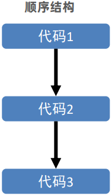
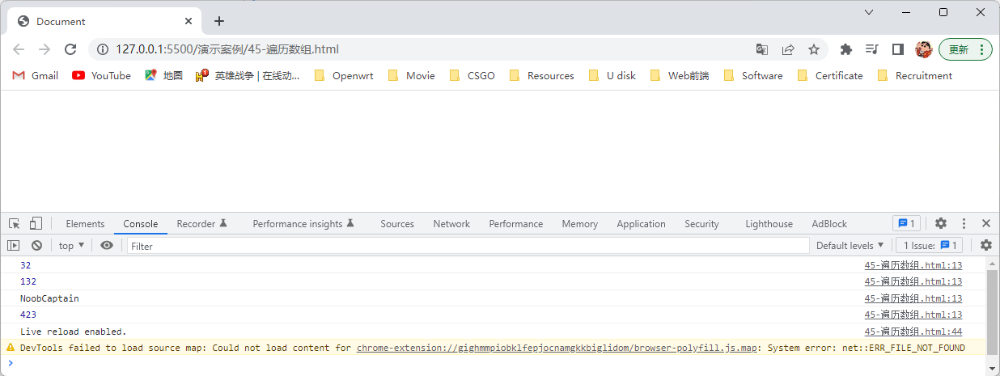
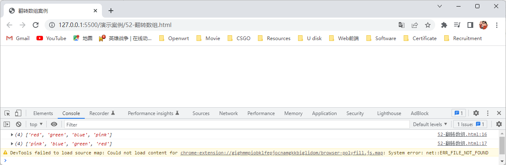
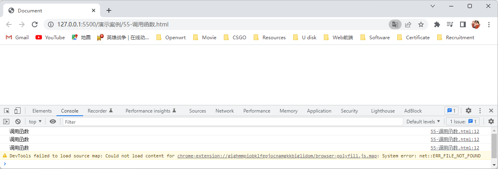
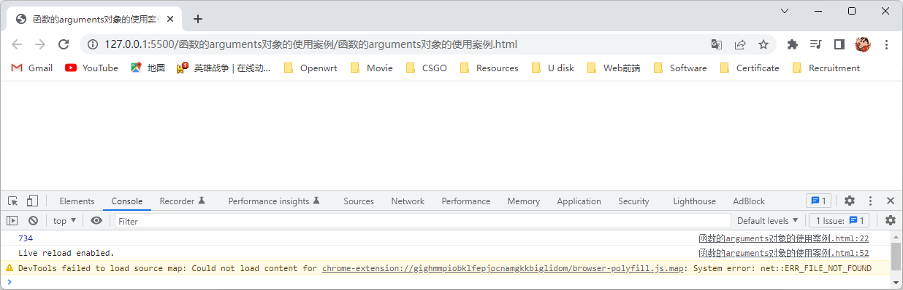
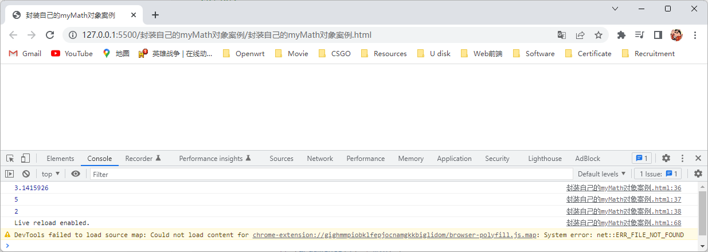

# 1.计算机编程语言

## 1.1编程语言

### 1.1.1编程

- 编程就是让计算机为解决某个问题而使用某种程序设计语言编写程序代码，并最终得到结果的过程。

- 计算机程序就是计算机所执行的一系列的指令集合，而程序全部都是用我们所掌握的语言来编写的，所以人们要控制计算机一定要通过计算机语言向计算机发出命令。

  > 注：计算机指的是任何能够执行代码的设备，可能是智能手机、ATM机、黑莓PI、服务器等等。

### 1.1.2计算机语言

- 计算机语言指用于人与计算机之间通讯的语言，它是人与计算机之间传递信息的媒介。
- 计算机语言的种类非常的多，总的来说可以分成机器语言，汇编语言和高级语言三大类，实际上计算机最终所执行的都是机器语言，它是由 `0` 和 `1` 组成的二进制数，二进制是计算机语言的基础。

### 1.1.3编程语言

- 我们可以通过类似于人类语言的语言来控制计算机，让计算机为我们做事情，这样的语言就叫做编程语言（Programming Language）。
- 编程语言是用来控制计算机的一系列指令，它有固定的格式和词汇（不同编程语言的格式和词汇不一样），必须遵守。
- 如今通用的编程语言有以下两种形式：
  - 汇编语言：汇编语言和机器语言实质是相同的，都是直接对硬件操作，只不过指令采用了英文缩写的标识符，容易识别和记忆。
  - 高级语言：高级语言主要是相对于低级语言而言，它并不是特指某一种具体的语言，而是包括了很多编程语言，常用的有C语言、C++、Java、C#、Python、PHP、JavaScript、Go语言、Objective-C、Swift等。


### 1.1.4翻译器

- 因为计算机不能直接执行任何除机器语言以外的语言，所以我们用编程语言所编制的代码不能直接被计算机执行，必须将其翻译成机器语言后才能被执行，为此我们需要一个翻译器，翻译器就是可以将我们用编程语言所编写的代码翻译成机器语言，这也被称为二进制化，翻译器将我们用编程语言所编写的代码翻译成机器语言的方式有两种，一种是编译，一种是解释，两种方式之间的区别在于翻译的时间点不同，编译是将我们用编程语言所编制的代码，全部翻译成机器语言，然后形成中间代码文件，将翻译后的机器语言存入到中间代码文件中，然后计算机在执行我们用编程语言所编制的代码时，就会直接执行中间代码文件中的机器语言，解释是在计算机执行我们用编程语言所编制的代码时，会将其第一行代码翻译成机器语言，然后通过计算机执行，然后将其第二行代码翻译成机器语言，然后通过计算机执行，以此类推一直到代码的最后一行，因为翻译器有两种将我们用编程语言所编写的代码翻译成机器语言的方式，所以编程语言可以分为编译型语言和解释型语言，我们所学的JavaScript编程语言就属于解释型语言。

- 计算机执行编译型语言所编制的代码和解释型语言所编制的代码的过程，如下图所示：

  

### 1.1.5编程语言和标记语言的区别

- 编程语言具有很强的逻辑和行为能力，在编程语言里，你会看到很多 `if else`、`for`、`while` 等具有逻辑性和行为能力的指令，这是主动的。
- 标记语言（HTML）不用于向计算机发出指令，常用于格式化和链接，标记语言的存在是用来被读取的，他是被动的。

## 1.2计算机基础

### 1.2.1计算机的组成

- 计算机的组成，如下图所示：

  

### 1.2.2数据存储

- 计算机内部使用二进制的 `0` 和 `1` 来表示数据，所有的数据，包括文件、图片等最终都是以二进制数据（ `0` 和 `1` ）的形式存放在硬盘中的，所有的程序，包括操作系统，本质上都是各种数据，所以也以二进制数据的形式存放在硬盘中，平时我们所说的安装软件，其实就是把程序文件复制到硬盘中，硬盘、内存都是保存的二进制数据。

### 1.2.3数据存储单位

- 数据存储单位有：`bit`（位）、`Byte`（字节）、`KB`（千字节）、`MB`（兆字节）、`GB`（吉字节）、`TB`（太字节）···
- 数据存储单位从小到大的排列顺序为：`bit`（位）< `Byte`（字节）< `KB`（千字节）< `MB`（兆字节）< `GB`（吉字节）< `TB`（太字节）···
- 数据存储单位的换算公式：
  - `bit`（位）：`1bit` 可以保存一个 `0` 或者 `1`（ `bit` 是最小的数据存储单位）。
  - `1Byte`（字节）= `8bit`（位）。
  - `1kb`（千字节）= `1024Byte`（字节）。
  - `1MB`（兆字节）= `1024KB`（千字节）。
  - `1GB`（吉字节）= `1024MB`（兆字节）。
  - `1TB`（太字节）= `1024GB`（吉字节）。
  - ···

### 1.2.4程序运行

- 打开某个程序时，是先从硬盘中把程序的代码加载到内存中，然后再通过CPU执行内存中的代码，之所以要内存的一个重要原因，是因为CPU运行太快了，如果只从硬盘中读数据，会浪费CPU的性能，所以才使用存取速度更快的内存来保存运行时的数据。

# 2.JavaScript简介

## 2.1JavaScript的创始人

- JavaScript的创始人是布兰登·艾奇（Brendan Eich，1961年～Now），布兰登·艾奇用了10天就完成了JavaScript的设计，最初JavaScript命名为LiveScript，后来在与Sun公司合作之后才将其改名为JavaScript。

## 2.2JavaScript是什么

- JavaScript是世界上最流行的语言之一，是一种运行在客户端（浏览器）的编程语言，是用来实现人机交互效果的。

  > 注：因为Script是脚本的意思，所以JavaScript也称为脚本语言，又因为JavaScript编程语言属于解释型语言，所以在计算机执行我们用JavaScript编程语言所编制的代码时，会将其第一行代码翻译成机器语言，然后通过计算机执行，然后将其第二行代码翻译成机器语言，然后通过计算机执行，以此类推一直到代码的最后一行。

## 2.3JavaScript的作用

- JavaScript的作用如下：
  - 网页特效：监听用户的一些行为让网页做出对应的反馈。
  - 表单验证：针对表单数据的合法性进行判断。
  - 数据交互：获取后台的数据，将其渲染到前端页面中。
  - 服务器端编程：Node.js。
  - ···

## 2.4JavaScript的组成

- JavaScript由ECMAScript和Web APIs组成，其中Web APIs由DOM和BOM组成，如下图所示：

  

- ECMAScript是由ECMA国际（原欧洲计算机制造商协会）进行标准化的一门编程语言，这种语言在万维网上应用广泛，它往往被称为JavaScript（网景公式开发的）或JScript（微软公司开发的)，但实际上这两者都是ECMAScript编程语言的实现和扩展，ECMAScript规定了JavaScript的编程语法和基础核心知识，是所有浏览器厂商共同遵守的一套JavaScript语法工业标准。

- 页面文档对象模型（Document Object Model，简称DOM）是W3C组织推荐的处理可扩展标记语言的标准编程接口，通过DOM提供的接口可以对页面中的各种元素进行操作，如：控制元素的大小、控制元素的位置、控制元素的颜色等。

- 浏览器对象模型（Browser Object Model，简称BOM）它提供了独立于内容的、可以与浏览器进行互动的对象结构，通过BOM可以操作浏览器，如：让浏览器弹出对框、控制浏览器跳转、获取浏览器的分辨率等。

## 2.5HTML和CSS和JavaScript的关系

- HTML和CSS是标记语言（描述类语言），它们的作用如下所示：
  - HTML是决定网页结构和内容（决定看到什么），相当于人的身体。
  - CSS是决定网页呈现给用户的模样（决定好不好看）， 相当于给人穿衣服、化妆。
- JavaScript是编程语言（编程类语言），它的作用如下所示：
  - JavaScript是实现业务逻辑和页面控制（决定功能），相当于人的各种动作。

## 2.6浏览器是怎么执行JavaScript的

- 因为浏览器是由渲染引擎和JavaScript引擎组成的，其中渲染引擎是用来解析HTML和CSS的，我们也称渲染引擎为内核，如：Chrome浏览器的内核就是blink，而JavaScript引擎是用来读取网页中的JavaScript代码，然后将读取到的网页中的JavaScript代码进行翻译后执行的，我们也称JavaScript引擎为JavaScript解释器，如：Chrome浏览器的JavaScript引擎是V8引擎，所以浏览器本身并不会执行JavaScript代码，而是通过内置的JavaScript引擎来执行JavaScript代码的。


## 2.7JavaScript权威网站MDN

- 我们可以通过使用JavaScript权威网站MDN，来查询JavaScript中的编程语法。

  > 注：MDN官网网址：https://developer.mozilla.org/zh-CN/。

## 2.8JavaScript的书写位置

### 2.8.1写在HTML文档内部

- 写在HTML文档内部就是将JavaScript代码写在HTML文档中，但是要注意JavaScript代码要写在HTML文档中的 `<script>` 标签中。

- 语法：

  ```html
  <script>
      // JavaScript代码
  </script>
  ```

- 注意点：

  - `<script>` 标签理论上是可以放在HTML文档中的任何地方，但一般会放到HTML文档中的 `<body>` 结束标签的上方，是因为浏览器是从上往下加载HTML文档的，并且JavaScript是用来操作HTML文档中的HTML标签的，所以如果 `<script>` 标签写在HTML文档中的HTML标签的上方，就会导致在浏览器加载HTML文档时，先加载JavaScript代码，再去加载HTML标签，这就可能会导致JavaScript在操作HTML文档中的HTML标签时，会因为HTML文档中的HTML标签还没有被加载从而导致操作失败。
  - 将JavaScript代码写在HTML文档中虽然代码结构清晰，但是并没有实现HTML与JavaScript完全分离。

- 演示代码：

  ```html
  <!DOCTYPE html>
  <html lang="en">
  <head>
      <meta charset="UTF-8">
      <meta http-equiv="X-UA-Compatible" content="IE=edge">
      <meta name="viewport" content="width=device-width, initial-scale=1.0">
      <title>Document</title>
  </head>
  <body>
      <script>
          alert('Hello World~!');
      </script>
  </body>
  </html>
  ```

- 演示结果：

  

### 2.8.2写在JavaScript文件中

- 写在JavaScript文件中就是将JavaScript代码写在后缀名为 `.js` 的文件中，我们称这个文件为JavaScript文件，然后通过使用HTML文档中的 `<script>` 标签的 `src` 属性来将JavaScript文件中的JavaScript代码引入到HTML文档中。

- 语法：

  ```html
  <script src = '路径'></script>
  ```

- 路径取值：JavaScript文件的路径。

- 注意点：

  - `<script>` 标签理论上是可以放在HTML文档中的任何地方，但一般会放到HTML文档中的 `<body>` 结束标签的上方，是因为浏览器是从上往下加载HTML文档的，并且JavaScript是用来操作HTML文档中的HTML标签的，所以如果 `<script>` 标签写在HTML文档中的HTML标签的上方，就会导致在浏览器加载HTML文档时，先加载JavaScript代码，再去加载HTML标签，这就可能会导致JavaScript在操作HTML文档中的HTML标签时，会因为HTML文档中的HTML标签还没有被加载从而导致操作失败。
  - 因为JavaScript代码是通过 `<script>` 标签的 `src` 属性来引入到HTML文档中的，所以 `<script>` 标签中间不可以写JavaScript代码。
  - 将JavaScript代码写在JavaScript文件中，就实现了HTML与JavaScript完全分离。

- 演示代码之JavaScript文件：

  ```javascript
  alert('Hello World~!');
  ```

- 演示代码之HTML文件：

  ```html
  <!DOCTYPE html>
  <html lang="en">
  <head>
      <meta charset="UTF-8">
      <meta http-equiv="X-UA-Compatible" content="IE=edge">
      <meta name="viewport" content="width=device-width, initial-scale=1.0">
      <title>Document</title>
  </head>
  <body>
      <script src="./js/02-写在JavaScript文件中.js"></script>
  </body>
  </html>
  ```

- 演示结果：

  

### 2.8.3写在HTML文档中的HTML标签内部

- 写在HTML文档中的HTML标签内部就是将单行或少量的JavaScript代码写在HTML文档中的HTML标签的事件属性中。

  > 注：HTML标签的事件属性是以 `on` 开头的属性，如：`onclick`。

- 语法：

  ```html
  <标签名 onclick="JavaScript代码"></标签名>
  ```

- 标签名取值：用户自定义，可以是任何标签。

- 注意点：

  - JavaScript代码要写在HTML标签的事件属性的双引号中间，且JavaScript代码的写法要符合JavaScript规范。
  - 将单行或少量的JavaScript代码写在HTML文档中的HTML标签的事件属性中时，会导致JavaScript代码可读性差，简单来说就是当HTML标签中编写了大量的JavaScript代码时，会不方便阅读。
  - 将单行或少量的JavaScript代码写在HTML文档中的HTML标签的事件属性中时，要注意引号，因为在HTML文档中我们推荐使用双引号，在JavaScript中我们推荐使用单引号，所以这会导致引号多层嵌套匹配时，会非常容易弄混。

- 演示代码：

  ```html
  <!DOCTYPE html>
  <html lang="en">
  <head>
      <meta charset="UTF-8">
      <meta http-equiv="X-UA-Compatible" content="IE=edge">
      <meta name="viewport" content="width=device-width, initial-scale=1.0">
      <title>Document</title>
  </head>
  <body>
      <button onclick="alert('Hello World~!');">点击</button>
  </body>
  </html>
  ```

- 演示结果：

  

## 2.9JavaScript的注释和结束符

### 2.9.1JavaScript的注释

- JavaScript注释是为了给代码添加具有解释性、描述性的信息，主要是用来帮助开发人员理解代码的，浏览器执行代码时会忽略掉所有的注释。

- JavaScript有两种注释方式：

  1. JavaScript使用 `//` 来设置单行注释。

     - 语法：

       ```javascript
       // 要注释的内容
       ```

     - 注意点：在VSCode编辑器中可以使用 `Ctrl+/` 快捷键快速设置单行注释。

     - 演示代码：

       ```html
       <!DOCTYPE html>
       <html lang="en">
       <head>
           <meta charset="UTF-8">
           <meta http-equiv="X-UA-Compatible" content="IE=edge">
           <meta name="viewport" content="width=device-width, initial-scale=1.0">
           <title>Document</title>
       </head>
       <body>
           <script>
               // alert('Hello World~!');
           </script>
       </body>
       </html>
       ```

     - 演示结果：

       

  2. JavaScript使用 `/* */` 来设置多行注释。

     - 语法：

       ```javascript
       /* 要注释的内容 */
       ```

     - 注意点：在VSCode编辑器中可以使用 `Shift+Alt+A` 快捷键快速设置多行注释。

     - 演示代码：

       ```html
       <!DOCTYPE html>
       <html lang="en">
       <head>
           <meta charset="UTF-8">
           <meta http-equiv="X-UA-Compatible" content="IE=edge">
           <meta name="viewport" content="width=device-width, initial-scale=1.0">
           <title>Document</title>
       </head>
       <body>
           <script>
               /* 
               alert('Hello World~!');
               alert('Hello World~!');
               alert('Hello World~!');
                */
           </script>
       </body>
       </html>
       ```

     - 演示结果：

       

### 2.9.2JavaScript的结束符

- JavaScript使用 `;` 来表示语句的结束，这个 `;` 就是JavaScript的结束符，因为浏览器的JavaScript引擎可以自动推断语句的结束位置，所以在实际开发中，JavaScript的结束符可写可不写。

- 演示代码：

  ```html
  <!DOCTYPE html>
  <html lang="en">
  <head>
      <meta charset="UTF-8">
      <meta http-equiv="X-UA-Compatible" content="IE=edge">
      <meta name="viewport" content="width=device-width, initial-scale=1.0">
      <title>Document</title>
  </head>
  <body>
      <script>
          alert('123');
          alert('456')
          alert('789');
      </script>
  </body>
  </html>
  ```

- 演示结果：

  

## 2.10JavaScript的输入和输出语法

### 2.10.1什么是语法

- 语法就是人和计算机交互的规则，我们需要按照这个规则去写代码，这样计算机才能看懂我们写的代码。

### 2.10.2什么是输入和输出

- 输出和输入可以理解为人和计算机的交互，用户通过键盘、鼠标等设备，向计算机输入信息，计算机处理后再展示结果给用户，这便是一次输入和输出的过程。

### 2.10.3JavaScript的输入语法

- JavaScript使用 `prompt()` 方法来让浏览器显示一个输入框，用于用户向计算机输入信息，输入框中包含一条文字信息，是用来提示用户要输入什么信息的。

- 语法：

  ```javascript
  prompt(输入框中提示用户的文字信息);
  ```

- 输入框中提示用户的文字信息的取值：用户自定义，可以是变量、数字、字符串等。

- 注意点：`prompt()` 方法它返回的是用户输入的信息。

- 演示代码：

  ```html
  <!DOCTYPE html>
  <html lang="en">
  <head>
      <meta charset="UTF-8">
      <meta http-equiv="X-UA-Compatible" content="IE=edge">
      <meta name="viewport" content="width=device-width, initial-scale=1.0">
      <title>Document</title>
  </head>
  <body>
      <script>
          prompt('请输入一个数字');
      </script>
  </body>
  </html>
  ```

- 演示结果：

  

### 2.10.4JavaScript的输出语法

- JavaScript有三种输出语法：

  1. JavaScript使用 `document.write()` 方法来向网页中输出内容。

     - 语法：

       ```javascript
       document.write(要向网页中输出的内容);
       ```

     - 要向网页中输出的内容的取值：用户自定义，可以是变量、数字、字符串等。

     - 注意点：如果向网页中输出的内容中有HTML标签，那么在输出时，会将HTML标签解析成网页元素。

     - 演示代码：

       ```html
       <!DOCTYPE html>
       <html lang="en">
       <head>
           <meta charset="UTF-8">
           <meta http-equiv="X-UA-Compatible" content="IE=edge">
           <meta name="viewport" content="width=device-width, initial-scale=1.0">
           <title>Document</title>
       </head>
       <body>
           <script>
               document.write('<strong>向网页中输出内容</strong>');
           </script>
       </body>
       </html>
       ```

     - 演示结果：

       

  2. JavaScript使用 `alert()` 方法来让浏览器弹出一个警告框，警告框中包含一条警告内容，用于向用户输出警告内容。

     - 语法：

       ```javascript
       document.write(要向用户输出的警告内容);
       ```

     - 要向用户输出的警告内容的取值：用户自定义，可以是变量、数字、字符串等。

     - 注意点：如果向用户输出的警告内容中有HTML标签，那么在输出时，是不会将HTML标签解析成网页元素的，而是直接输出这个HTML标签。

     - 演示代码：

       ```html
       <!DOCTYPE html>
       <html lang="en">
       <head>
           <meta charset="UTF-8">
           <meta http-equiv="X-UA-Compatible" content="IE=edge">
           <meta name="viewport" content="width=device-width, initial-scale=1.0">
           <title>Document</title>
       </head>
       <body>
           <script>
               alert('<strong>向用户输出的警告信息</strong>');
           </script>
       </body>
       </html>
       ```

     - 演示结果：

       

  3. JavaScript使用 `console.log()` 方法来向控制台输出内容。

     - 语法：

       ```
       console.log(要向控制台输出的内容);
       ```

     - 要向控制台输出的内容的取值：用户自定义，可以是变量、数字、字符串等。

     - 注意点：

       - 如果向控制台输出的内容中有HTML标签，那么在输出时，是不会将HTML标签解析成网页元素的，而是直接输出这个HTML标签。

       - 向控制台输出的内容是给程序员看的，并不是给用户看的。

       - 打开控制台的方法，如下图所示：

         

     - 演示代码：

       ```html
       <!DOCTYPE html>
       <html lang="en">
       <head>
           <meta charset="UTF-8">
           <meta http-equiv="X-UA-Compatible" content="IE=edge">
           <meta name="viewport" content="width=device-width, initial-scale=1.0">
           <title>Document</title>
       </head>
       <body>
           <script>
               console.log('向控制台输出的内容');
           </script>
       </body>
       </html>
       ```

     - 演示结果：

       

## 2.11字面量

- 在计算机科学中字面量是计算机中描述的事和物，如：计算机中的数字就是数字字面量，计算机中的字符串就是字符串字面量，计算机中的数组就是数组字面量，计算机中的对象就是对象字面量等。

# 3.变量

## 3.1什么是变量

- 变量不是数据的本身，变量就是计算机用来存储数据的容器，我们可以通过变量名来获取容器中的数据，并且容器中的数据是可以修改，简单来说就是变量是一个用来装东西的盒子，里面装的东西是数据，装的数据是可以修改的，变量名就是这个盒子的名称，我们可以通过变量名来获取盒子里装的数据。

## 3.2变量的基本使用

### 3.2.1声明变量

- 要想使用变量，我们首先就需要创建变量，创建变量也称为声明变量或定义变量，我们可以使用JavaScript中的 `let` 关键字来声明变量。

  > 注：关键字是指有特殊含义的字符，如：JavaScript中的 `let` 字符是有特殊含义的，它是用来声明变量的，所以JavaScript中的 `let` 字符是属于关键字，JavaScript中的关键字有 `break`、`case`、`catch`、`continue`、`default`、`delete`、`do`、`else`、`finally`、`for`、`function`、`if`、`in`、`instanceof`、`new`、`return`、`switch`、`this`、`throw`、`try`、`typeof`、`var`、`void`、`while`、`with` 等。

- 语法：

  ```javascript
  let 变量名;
  ```

  > 注：声明变量由声明关键字 `let` 和变量名组成的。

- 变量名的取值：用户自定义，要遵从变量名的命名规则与规范。

- 注意点：

  - 变量名我们也称为标识名。

    > 注：标识符就是指开发人员为变量、属性、函数、参数取的名字。

  - 使用 `let` 关键字声明变量后，计算机会自动为变量分配内存空间，不需要程序员为其分配内存空间。

### 3.2.2变量赋值

- 声明了一个变量后，该变量里面是没有值的，所以我们需要使用 `=` 来给该变量进行赋值。

- 语法：

  ```javascript
  let 变量名;
  变量名 = 变量值;
  ```

- 取值：

  |        |                   取值                   |
  | :----: | :--------------------------------------: |
  | 变量名 | 用户自定义，要遵从变量名的命名规则与规范 |
  | 变量值 |     用户自定义，可以是数字、字符串等     |

- 注意点：

  - 变量值就是程序员要存储到变量中的数据。
  - `=` 是赋值运算符，是用来把右边的值赋给左边的变量的，简单来说就是把右边的变量值存放到左边的变量中。
  - 如果我们想要获取变量中的数据时，只需要通过变量名就能获取到变量中的数据。

- 演示代码：

  ```html
  <!DOCTYPE html>
  <html lang="en">
  <head>
      <meta charset="UTF-8">
      <meta http-equiv="X-UA-Compatible" content="IE=edge">
      <meta name="viewport" content="width=device-width, initial-scale=1.0">
      <title>Document</title>
  </head>
  <body>
      <script>
          let num;
          num = 1;
          console.log(num);
      </script>
  </body>
  </html>
  ```

- 演示结果：

  

### 3.2.3变量初始化

- 变量初始化就是在声明变量的时候直接给该变量进行赋值，这种操作我们就称为变量初始化。

- 语法：

  ```javascript
  let 变量名 = 变量值;
  ```

- 取值：

  |        |                   取值                   |
  | :----: | :--------------------------------------: |
  | 变量名 | 用户自定义，要遵从变量名的命名规则与规范 |
  | 变量值 |     用户自定义，可以是数字、字符串等     |

- 演示代码：

  ```html
  <!DOCTYPE html>
  <html lang="en">
  <head>
      <meta charset="UTF-8">
      <meta http-equiv="X-UA-Compatible" content="IE=edge">
      <meta name="viewport" content="width=device-width, initial-scale=1.0">
      <title>Document</title>
  </head>
  <body>
      <script>
          let num = 1;
          console.log(num);
      </script>
  </body>
  </html>
  ```

- 演示结果：

  

### 3.2.4变量的使用案例

- 声明一个变量 `num`，用于存放用户购买的商品数量，商品数量为20件，再声明一个变量 `uname`，用于存放用户的姓名，用户的姓名为张三，依次向控制台输出这两个变量。

- 演示代码：

  ```html
  <!DOCTYPE html>
  <html lang="en">
  <head>
      <meta charset="UTF-8">
      <meta http-equiv="X-UA-Compatible" content="IE=edge">
      <meta name="viewport" content="width=device-width, initial-scale=1.0">
      <title>变量的使用案例</title>
  </head>
  <body>
      <script>
          let num = 20;
          let uname = '张三';
          console.log(num);
          console.log(uname);
      </script>
  </body>
  </html>
  ```

- 演示结果：

  

### 3.2.5更新变量

- 当我们声明了一个变量，并给其赋了值，这时我们还可以通过变量赋值的方式将该变量的值进行修改，这种操作我们就称为更新变量。

- 语法：

  ```javascript
  let 变量名 = 变量值1;
  变量名 = 变量值2;
  ```

- 取值：

  |        |                   取值                   |
  | :----: | :--------------------------------------: |
  | 变量名 | 用户自定义，要遵从变量名的命名规则与规范 |
  | 变量值 |     用户自定义，可以是数字、字符串等     |

- 注意点：

  - 变量的值以最后一次赋的值为准。
  - 更新变量只需要通过变量赋值的方式就可以将变量的值进行修改了，而不需要通过再次声明同一个变量并给该变量进行赋值来进行修改，并且 `let` 关键字也不允许多次声明同一个变量。

- 演示代码：

  ```html
  <!DOCTYPE html>
  <html lang="en">
  <head>
      <meta charset="UTF-8">
      <meta http-equiv="X-UA-Compatible" content="IE=edge">
      <meta name="viewport" content="width=device-width, initial-scale=1.0">
      <title>Document</title>
  </head>
  <body>
      <script>
          let num = 1;
          num = 2;
          console.log(num);
      </script>
  </body>
  </html>
  ```

- 演示结果：

  

### 3.2.6同时声明多个变量

- 同时声明多个变量，只需要在声明变量时，将多个变量之间用逗号隔开，这样就可以同时声明多个变量了。

- 语法：

  ```javascript
  let 变量名1 = 变量值1,变量名2 = 变量值2,···,变量名n = 变量值n;
  ```

- 取值：

  |        |                   取值                   |
  | :----: | :--------------------------------------: |
  | 变量名 | 用户自定义，要遵从变量名的命名规则与规范 |
  | 变量值 |     用户自定义，可以是数字、字符串等     |

- 注意点：

  - 为了更好的可读性，我们还是一行只声明一个变量。
  - 如果想输出多个变量，只需要在输出变量时，将多个变量之间用逗号隔开，这样就可以同时输出多个变量了。

- 演示代码：

  ```html
  <!DOCTYPE html>
  <html lang="en">
  <head>
      <meta charset="UTF-8">
      <meta http-equiv="X-UA-Compatible" content="IE=edge">
      <meta name="viewport" content="width=device-width, initial-scale=1.0">
      <title>Document</title>
  </head>
  <body>
      <script>
          let num1 = 1,num2 = 2;
          console.log(num1,num2);
      </script>
  </body>
  </html>
  ```

- 演示结果：

  

### 3.2.7弹出姓名案例

- 浏览器弹出一个输入框，提示用户输入姓名，然后将用户输入的姓名，向网页中输出。

- 演示代码：

  ```html
  <!DOCTYPE html>
  <html lang="en">
  <head>
      <meta charset="UTF-8">
      <meta http-equiv="X-UA-Compatible" content="IE=edge">
      <meta name="viewport" content="width=device-width, initial-scale=1.0">
      <title>Document</title>
  </head>
  <body>
      <script>
          let str = prompt('请输入姓名');
          document.write(str);
      </script>
  </body>
  </html>
  ```

- 演示结果：

  

### 3.2.8两个变量的值相互交换案例

- 两个变量的值相互交换案例的实现步骤：

  1. 声明一个临时变量 `temp`。
  2. 将变量1里的变量值赋值给临时变量。
  3. 将变量2里的变量值赋值给变量1。
  4. 将临时变量里的变量值赋值给变量2。

- 演示代码：

  ```html
  <!DOCTYPE html>
  <html lang="en">
  <head>
      <meta charset="UTF-8">
      <meta http-equiv="X-UA-Compatible" content="IE=edge">
      <meta name="viewport" content="width=device-width, initial-scale=1.0">
      <title>两个变量的值相互交换案例</title>
  </head>
  <body>
      <script>
          // 声明一个临时变量temp。
          let temp,apple1 = '红苹果',apple2 = '绿苹果';
          // 将变量1里的变量值赋值给临时变量。
          temp = apple1;
          // 将变量2里的变量值赋值给变量1。
          apple1 = apple2;
          // 将临时变量里的变量值赋值给变量2。
          apple2 = temp;
          console.log(apple1);
          console.log(apple2);
      </script>
  </body>
  </html>
  ```

- 演示结果：

  

## 3.3变量的本质

- 变量的本质就是程序在内存中申请的一块用来存储数据的小空间，而变量名就指向了这个小空间，类似于我们酒店的房间，酒店就是内存，酒店里的一个房间就可以看做是一个变量，房间的房间号就可以看作是变量名。

  > 注：内存就是计算机存储数据的地方，相当于一个空间。

- 变量的本质，如下图所示：

  

## 3.4变量名的命名规则与规范

### 3.4.1什么是规则

- 规则是必须要遵守的，如果不遵守就会报错。

### 3.4.2什么是规范

- 规范是建议遵守的，如果不遵守也不会报错。

### 3.4.3变量名的命名规则

- 不能用关键字和保留字来命名变量名。

  > 注：保留字实际上就是预留的关键字，意思是现在虽然还不是关键字，但是未来可能会成为关键字，JavaScript中的保留字有 `boolean`、`byte`、`char`、`class`、`const`、`debugger`、`double`、`enum`、`export`、`extends`、`fimal`、`float`、`goto`、`implements`、`import`、`int`、`interface`、`long`、`mative`、`package`、`private`、`protected`、`public`、`short`、`static`、`super`、`synchronized`、`throws`、`transient`、`volatile` 等

- 变量名只能由字母（A-Z，a-z）、数字（0~9）、下划线（_）、美元符号（$）组成。

- 变量名不能以数字开头。

- 变量名严格区分大小写，如：变量 `num` 和变量 `Num` 是不一样的。

- 变量名不能是 `name`。

### 3.4.4变量名的命名规范

- 变量名起名要有意义。
- 变量名要遵守小驼峰命名法，也就是第一个单词字母小写，后面的每个单词首字母要大写，如：变量 `userName`。

## 3.5输出用户信息案例

- 让用户输入自己的名字、年龄、性别，然后再输出到网页中。

- 输出用户信息案例的实现步骤：

  1. 弹出输入框，让用户输入姓名，然后用变量保存起来。
  2. 弹出输入框，让用户输入性别，然后用变量保存起来。
  3. 弹出输入框，让用户输入年龄，然后用变量保存起来。
  4. 在网页中分别输出刚才的三个变量。

- 演示代码：

  ```html
  <!DOCTYPE html>
  <html lang="en">
  <head>
      <meta charset="UTF-8">
      <meta http-equiv="X-UA-Compatible" content="IE=edge">
      <meta name="viewport" content="width=device-width, initial-scale=1.0">
      <title>输出用户信息案例</title>
  </head>
  <body>
      <script>
          // 弹出输入框，让用户输入姓名，然后用变量保存起来。
          let userName = prompt('请输入您的姓名');
          // 弹出输入框，让用户输入性别，然后用变量保存起来。
          let gender = prompt('请输入您的性别');
          // 弹出输入框，让用户输入年龄，然后用变量保存起来。
          let age = prompt('请输入您的年龄');
          // 在网页中分别输出刚才的三个变量。
          document.write(userName,gender,age);
      </script>
  </body>
  </html>
  ```

- 演示结果：

  

## 3.6用 `let` 关键字和 `var` 关键字声明变量的区别

- 在以前旧版本的JavaScript中，我们还可以使用 `var` 关键字来声明变量，但是用 `var` 关键字来声明变量会有一些BUG，BUG如下：

  - 我们可以先给变量赋值，再对变量进行声明，这是不合理的。
  - 我们可以先使用变量，再对变量进行声明，这是不合理的。
  - 我们可以对声明过的变量，进行重复声明，这是不合理的。
  - 用 `var` 关键字声明的变量，是没有块级作用域的。

- 现在我们使用 `let` 关键字来声明变量就完美解决了上述BUG，用 `let` 关键字来声明变量必须先声明变量，才能给变量赋值，否则会报错，必须先声明变量才能使用变量，否则会报错，而且用 `let` 关键字声明过的变量，就不能再重复声明了，否则会报错，用 `let` 关键字声明过的变量，是有块级作用域的。

- 演示代码：

  ```html
  <!DOCTYPE html>
  <html lang="en">
  <head>
      <meta charset="UTF-8">
      <meta http-equiv="X-UA-Compatible" content="IE=edge">
      <meta name="viewport" content="width=device-width, initial-scale=1.0">
      <title>Document</title>
  </head>
  <body>
      <script>
          // 用var关键字来声明变量，我们可以先给变量赋值，再对变量进行声明，这是不合理的。
          num1 = 1;
          var num1;
          console.log(num1);
          // 用var关键字来声明变量，我们可以先使用变量，再对变量进行声明，这是不合理的。
          console.log(num2);
          var num2 = 2;
          // 用var关键字来声明变量，我们可以对声明过的变量，进行重复声明，这是不合理的。
          var num3 = 3;
          var num3 = 4;
          console.log(num3);
      </script>
  </body>
  </html>
  ```

- 演示结果：

  

## 3.7声明变量的特殊情况

- 声明变量时有三种特殊情况：

  - 只声明变量不对其赋值时，输出变量会显示 `undefined`（未定义的）。
  - 不声明变量但给变量赋值时，输出变量会显示赋值的值。
  - 不声明变量并且不给变量赋值时，输出变量会报错。

- 演示代码：

  ```html
  <!DOCTYPE html>
  <html lang="en">
  <head>
      <meta charset="UTF-8">
      <meta http-equiv="X-UA-Compatible" content="IE=edge">
      <meta name="viewport" content="width=device-width, initial-scale=1.0">
      <title>Document</title>
  </head>
  <body>
      <script>
          // 只声明变量不对其赋值时，输出变量会显示undefined（未定义的）。
          let myname;
          console.log(myname);
          // 不声明变量但给变量赋值时，输出变量会显示赋值的值。
          tel = 23333;
          console.log(tel);
          // 不声明变量并且不给变量赋值时，输出变量会报错。
          console.log(age);
      </script>
  </body>
  </html>
  ```

- 演示结果：

  

# 4.数组

## 4.1什么是数组

- 数组是指一组数据的集合，其中数组中的每个数据都被称为数组元素，在数组中可以存储任意类型的数据，因为变量只能存储一个数据，而数组可以将一组相关的数据一起存储，并提供方便的访问方式，所以数组是一种将一组数据存储在单个变量名下的优雅方式。

## 4.2数组的基本使用

### 4.2.1声明数组

- 声明数组有两种方式：

  1. JavaScript使用数组字面量 `[]` 来声明数组。

     - 语法：

       ```javascript
       let 数组名 = [];
       ```

       > 注：语法的含义是我们用数组字面量 `[]` 来声明数组，然后将该数组通过赋值的方式，赋给变量，然后我们称这个变量为数组。

     - 数组名的取值：用户自定义，要遵从变量名的命名规则与规范。

     - 注意点：数组字面量是 `[]`。

  2. JavaScript使用 `new Array()` 方法来声明数组。

     - 语法：

       ```javascript
       let 数组名 = new Array();
       ```

       > 注：语法的含义是我们用 `new Array()` 方法来声明数组，然后将该数组通过赋值的方式，赋给变量，然后这个我们称这个变量为数组。

     - 数组名的取值：用户自定义，要遵从变量名的命名规则与规范。

     - 注意点：`new Array()` 方法要注意大小写。

### 4.2.2数组初始化

- 数组初始化就是在声明数组的时候直接给该数组进行赋值，这种操作我们就称为数组初始化。

- 给数组进行赋值只需要在数组字面量 `[]` 中填写数据或在 `new Array()` 方法中的 `()` 内填写数据即可。

- 语法：

  ```javascript
  let 数组名 = [数据1,数据2,···,数据n];
  let 数组名 = new Array(数据1,数据2,···,数据n);
  ```

- 取值：

  |        |                   取值                   |
  | :----: | :--------------------------------------: |
  | 数组名 | 用户自定义，要遵从变量名的命名规则与规范 |
  |  数据  |     用户自定义，可以是数字、字符串等     |

- 注意点：

  - 可以给数组赋任意类型的数据。
  - 如果不给数组进行赋值，那么该数组就是一个空数组。
  - 如果要给数组赋多个值时，多个值之间要用逗号隔开。

  - 在给用 `new Array()` 方法声明的数组进行赋值时，如果 `new Array()` 方法中的 `()` 内只有一个数据，且该数据是数字类型，则表示的是给数组赋多少个空的数据，如：`let arr = new Array(2);` 代码就表示给 `arr` 数组赋2个空的数据。

- 演示代码：

  ```html
  <!DOCTYPE html>
  <html lang="en">
  <head>
      <meta charset="UTF-8">
      <meta http-equiv="X-UA-Compatible" content="IE=edge">
      <meta name="viewport" content="width=device-width, initial-scale=1.0">
      <title>Document</title>
  </head>
  <body>
      <script>
          let arr1 = [3,1,'wuhu',true];
          let arr2 = new Array(3,1,'wuhu',true);
          let arr3 = new Array(3);
          console.log(arr1);
          console.log(arr2);
          console.log(arr3);
      </script>
  </body>
  </html>
  ```

- 演示结果：

  

### 4.2.3获取数组中的数据

- 因为数组中的数据都是按顺序进行保存的，所以数组中的每个数据都有一个属于自己的编号，在数组中我们称数据的编号为索引号或下标，并且我们可以通过索引号来获取数组中的数据。

- 语法：

  ```javascript
  数组名[下标];
  ```

- 取值：

  |        |                   取值                   |
  | :----: | :--------------------------------------: |
  | 数组名 | 用户自定义，要遵从变量名的命名规则与规范 |
  |  下标  |       要获取的数据，在数组中的编号       |

- 注意点：

  - 数据在数组中的编号是从 `0` 开始的，如下图所示：

    

  - 如果通过索引号来获取数组中不存在的数据时，输出的结果会是 `undefined`。

- 演示代码：

  ```html
  <!DOCTYPE html>
  <html lang="en">
  <head>
      <meta charset="UTF-8">
      <meta http-equiv="X-UA-Compatible" content="IE=edge">
      <meta name="viewport" content="width=device-width, initial-scale=1.0">
      <title>Document</title>
  </head>
  <body>
      <script>
          let arr = [5,2,'NoobCaptain',123];
          console.log(arr[0]);
          console.log(arr[1]);
          console.log(arr[2]);
          console.log(arr[3]);
          console.log(arr[4]);
      </script>
  </body>
  </html>
  ```

- 演示结果：

  

### 4.2.4获取数组的长度

- 因为数组是由若干个数据组成的，所以这些数据的个数就是数组的长度，我们可以通过使用数组的 `length` 属性来获取数组的长度。

- 语法：

  ```javascript
  let 数组名 = [数据1,数据2,···,数据n];
  数组名.length;
  ```

- 数组名的取值：用户自定义，要遵从变量名的命名规则与规范。

- 注意点：

  - 如果数组中有一个空的数据，那么它也算作一个数据。
  - 数组的长度是数组中的数据的个数，而索引号是数据的编号，不要弄混了。
  - 当我们数组中的数据个数发生了变化时，数组的 `length` 属性也会跟着一起变化。

- 演示代码：

  ```html
  <!DOCTYPE html>
  <html lang="en">
  <head>
      <meta charset="UTF-8">
      <meta http-equiv="X-UA-Compatible" content="IE=edge">
      <meta name="viewport" content="width=device-width, initial-scale=1.0">
      <title>Document</title>
  </head>
  <body>
      <script>
          let arr = [5,2,'NoobCaptain',123];
          console.log(arr.length);
      </script>
  </body>
  </html>
  ```

- 演示结果：

  

# 5.常量

- 使用 `const` 关键字声明的变量，我们就称之为常量，因为常量里的值是不允许改变的，所以当某个变量永远不会发生改变时，我们就可以使用 `const` 关键字来声明这个变量。

- 语法：

  ```javascript
  const 常量名 = 常量值;
  ```

- 取值：

  |        |                   取值                   |
  | :----: | :--------------------------------------: |
  | 常量名 | 用户自定义，要遵从变量名的命名规则与规范 |
  | 常量值 |     用户自定义，可以是数字、字符串等     |

- 注意点：

  - 在声明常量的时候必须同时给其赋值，否则会报错。
  - 声明了一个常量，就不能再给这个常量进行赋值了，因为常量里的值是不允许改变的，否则会报错。

- 演示代码：

  ```html
  <!DOCTYPE html>
  <html lang="en">
  <head>
      <meta charset="UTF-8">
      <meta http-equiv="X-UA-Compatible" content="IE=edge">
      <meta name="viewport" content="width=device-width, initial-scale=1.0">
      <title>Document</title>
  </head>
  <body>
      <script>
          const PI = 3.14;
          console.log(PI);
          PI = 4.1;
          console.log(PI);
      </script>
  </body>
  </html>
  ```

- 演示结果：

  

# 6.数据类型

## 6.1数据类型

### 6.1.1为什么需要数据类型

- 在计算机中，不同的数据所需占用的存储空间是不同的，为了便于把数据分成所需内存大小不同的数据，充分利用存储空间，于是定义了不同的数据类型，简单来说数据类型就是数据的类别型号，如：`'张三'`，`18` 这些数据的类型是不一样的。

### 6.1.2数据类型的分类

- JavaScript把数据类型整体分为两大类，分别是简单数据类型和复杂数据类型。
- 简单数据类型有：
  - 数字类型（Number）。
  - 字符串类型（String）。
  - 布尔类型（Boolean）。
  - 未定义类型（Undefined）。
  - 空类型（Null）。
- 复杂数据类型有：对象类型（Object）。

### 6.1.3简单数据类型-数字类型

- 数字类型就是我们在数学中学习到的数字如：整数、小数、正数、负数。

- 因为在计算机中，数字的进制有二进制、八进制、十进制，十六进制，所以JavaScript在数字的前面加 `0` 来表示该数字的进制为八进制，在数字的前面加 `0x` 来表示该数字的进制为十六进制，在数字的前面什么都不加来表示该数字的进制为十进制，而我们在数学中学习到的数字，它的进制就是十进制，所以JavaScript在输出数字时，只能输出十进制的数字，如果JavaScript想要输出八进制的数字和十六进制的数字时，JavaScript会将它们转换为十进制的数字后，再输出。

  > 注1：二进制，逢二进一，最小是0，最大是1。
  >
  > 注2：八进制，逢八进一，最小是0，最大是7。
  >
  > 注3：十进制，逢十进一，最小是0，最大是9。
  >
  > 注4：十六进制，逢十六进一，最小是0，最大是e，10到15用a到e来表示。

- JavaScript通过使用 `Number.MAX_VALUE` 属性来获取数字类型能显示的最大值，其数字类型能显示的最大值为 `1.7976931348623157e+308`。

- JavaScript通过使用 `Number.MIN_VALUE` 属性来获取数字类型能显示的最小值，其数字类型能显示的最小值为 `5e-324`。

- 因为在计算机中变量是用来存储值的所在处，所以它有名字和数据类型，变量的数据类型决定了如何将代表这些值的位存储到计算机的内存中，又因为JavaScript是一种弱数据类型的语言或者说动态语言，所以这意味着不用提前声明变量的数据类型，变量的数据类型会在程序运行的过程中自动确定，但是要注意只有在程序运行完毕后，变量的数据类型才能被真正的确定，简单来说就是JavaScript代码在运行时，变量的数据类型是由JavaScript引擎根据 `=` 右边变量值的数据类型来判断的，只有在JavaScript代码运行完毕后，变量的数据类型才能被真正的确定，如：在JavaScript代码运行时，`let age = 18;` 代码中的 `age` 变量的数据类型就会被判断为数字类型，此时JavaScript代码还没有运行完毕，后面又运行了 `age = 'NoobCaptain';` 代码，此时 `age` 变量的数据类型就会被判断为字符串类型，此时JavaScript代码运行完毕，就表示 `age` 变量的数据类型可以确定为字符串类型。

  > 注：Java属于强数据类型的语言，在声明变量时就必须声明变量的数据类型，如：`int num = 1;` 代码表示 `num` 变量只能存储整数。

- 如果变量中的数字类型的数据大于数字类型能显示的最大值，则输出该变量时，会输出 `Infinity`（无穷大）。

- 如果变量中的数字类型的数据小于数字型能显示的最小值，则输出该变量时，会输出 `-Infinity`（无穷小）。

- 如果变量中的数据不是数据类型中的任意一种时，则输出该变量时，会输出 `NaN`（Not a Number，非数值）。

  > 注：`NaN` 表示一个计算错误，它是由一个不正确的或一个未定义的数学计算所得到的结果。

- JavaScript使用 `isNaN()` 方法来判断一个变量的数据类型是否为数字类型，如果该变量的数据类型为数字类型，则返回 `false`，如果该变量的数据类型不是数字类型，则返回 `true`。

  > 注：`isNaN()` 方法的，语法为 `isNaN(要判断变量的数据类型是否为数字类型的变量名)`，要判断变量的数据类型是否为数字类型的变量名的取值为用户自定义可以是变量、数字、字符串等。

- 数字可以有很多操作，如：加减乘除等，所以数字经常和算术运算符一起，算术运算符就是在算术运算时所使用到的符号，如：`+、-、*、/、%`，其中 `+` 是将两个数字相加，`-` 是将两个数字相减，`*` 是将两个数字相乘，`/` 是将两个数字相除，`%` 是取两个数相除后的余数。

  > 注：运算符（operator）也被称为操作符，是用于实现赋值、比较和执行算数运算等功能的符号，如：`=、+、-、*、/、&&、||` 等。

  - 语法：

    ```javascript
    数字 + 数字;
    数字 - 数字;
    数字 * 数字;
    数字 / 数字;
    数字 % 数字;
    ```

  - 数字取值：用户自定义，可以是变量、数字等。

  - 注意点：

    - 算术运算符的左右两侧必须要用一个空格隔开，如：`1 + 2`。

    - 同时使用多个运算符编写程序时，会按照某种顺序先后执行，我们称为优先级，如：当使用多个算术运算符编写程序时，如：`1 + 2 * 3 / 4;`，此时会按照先乘除后加减的顺序来执行。

      > 注1：JavaScript中优先级越高就越先被执行，优先级相同时以书写的顺序从左向右执行。
      >
      > 注2：算术运算符的优先级是，`*、/、%` 算术运算符优先级相同，`+、-` 算术运算符优先级相同，`*、/、%` 算术运算符的优先级大于 `+、-` 算术运算符的优先级，我们可以使用 `()` 运算符来提升优先级，`()` 运算符的优先级是最大的，如：当使用多个算术运算符编写程序时，我们可以使用 `()` 运算符来提升优先级，如：`(1 + 2) * 3 / 4;`，此时会按照先乘除后加减有括号就先算括号里面的顺序来执行。

    - 两个小数的算术运算的最高精度是17位小数，这个算术运算的精度远远不如两个整数的算术运算的精度，是因为计算机要把数字转换为二进制来存储，这就会导致两个小数的算术运算的精度不会很高，所以两个小数的算术运算会有误差，所以不要直接判断两个小数的算术运算的结果是否等于某个数字。

    - `NaN` 是有粘性的所以任何对 `NaN` 的操作都会返回 `NaN`。

- 演示代码：

  ```html
  <!DOCTYPE html>
  <html lang="en">
  <head>
      <meta charset="UTF-8">
      <meta http-equiv="X-UA-Compatible" content="IE=edge">
      <meta name="viewport" content="width=device-width, initial-scale=1.0">
      <title>Document</title>
  </head>
  <body>
      <script>
          let num1 = 011;
          let num2 = 12;
          let num3 = 0xa;
          console.log(num1,num2,num3);
          let num4 = Number.MAX_VALUE;
          let num5 = Number.MIN_VALUE;
          console.log(num4,num5);
          let num6 = Number.MAX_VALUE * 2;
          let num7 = -Number.MAX_VALUE * 2;
          let num8 = 'Noob' - 1;
          console.log(num6,num7,num8);
          let num9 = 12;
          let num10 = 'Noob';
          console.log(isNaN(num9),isNaN(num10));
          let num11 = 1 + 2;
          let num12 = 1 - 2;
          let num13 = 1 * 2;
          let num14 = 1 / 1;
          let num15 = 3 % 5;
          let num16 = 0.1 + 0.2;
          console.log(num11,num12,num13,num14,num15,num16,num16 == 0.3);
      </script>
  </body>
  </html>
  ```

- 演示结果：

  

### 6.1.4简单数据类型-字符串类型

- 字符串类型是指用单引号或双引号或反引号包裹起来的一串字符，我们称这一串字符为字符串，如：`'你好'`、`'123'`、`'abc'`，又因为HTML标签中的属性的属性值是用双引号包裹起来的，所以在JavaScript中我们更推荐使用单引号把字符串包裹起来，如果没有用单引号或双引号或反引号把字符串包裹起来，那么JavaScript就会把这些字符串认为是JavaScript代码，而JavaScript中并没有这些语法，所以会报错。

  > 注：字符串可以是中文，英文，数字。

- 注意点：

  - 无论是用单引号还是双引号还是反引号来把字符串包裹起来，引号都必须成对使用，如：`'NOOB` 这样是错误的，正确的是 `'NOOB'`。

  - 单引号和双引号是可以互相嵌套，但是不可以单引号嵌套单引号或双引号嵌套双引号，如：`'N'OO'B'`、`"N"OO"B"` 这些是错误的，`'N"OO"B'`、`"N'OO'B` 这些是对的。

  - 如果用单引号或双引号或反引号把变量包裹起来，那么这个变量就变成了字符串，就已经不是变量了。

  - 如果单引号或双引号或反引号没有包裹任何文本，那么这种情况就叫做空字符串。

  - 字符串中可以写转义符，转义符就类似于HTML里面的特殊字符，字符串中也有特殊字符，我们称之为转义符，转义符都是以 `\` 开头的，如：`let str = 'NO\'OB';` 代码，输出 `str` 变量时，会输出 `NO'OB`。

    > 注：常用的转义符如下表所示：
    >
    > | 转义符 | 说明                         |
    > | :----: | ---------------------------- |
    > |   \n   | 表示换行符，n是newline的意思 |
    > |   \\   | 表示斜杆                     |
    > |   \'   | 表示单引号                   |
    > |   \"   | 表示双引号                   |
    > |   \t   | 表示缩进，t是tab的意思       |
    > |   \b   | 表示空格，b是blank的意思     |

- 我们可以使用 `+` 运算符来将字符串和任何数据类型进行拼接，其拼接方式为 `字符串 + 任何数据类型`，但是要注意在拼接前JavaScript会把与字符串相加的任何数据类型转换成字符串，然后再将其与字符串拼接，拼接成一个新的字符串，如：`let myname = 'Noob' + 'Captain';` 代码，输出 `myname` 变量时，会输出 `NoobCaptain`、`let myname = 'Noob' + 12;` 代码，输出 `myname` 变量时，会输出 `Noob12`、`let num= '100' + '100';` 代码，输出 `num` 变量时，会输出100100，又因为我们经常会将字符串和变量进行拼接，原因是变量可以很方便地修改里面的值，但是要注意变量是不能被单引号或双引号或反引号包裹的，因为变量被单引号或双引号或反应号包裹时，变量就会变成字符串，就已经不是变量了，所以当字符串和变量进行拼接时，变量不能被单引号或双引号或反引号包裹。

- 除了可以使用 `+` 运算符来将字符串和任何数据类型进行拼接，我们还可以在字符串中使用模板字符串 `${}` 来将字符串和任何数据类型进行拼接，其拼接方式为\`字符串${任何数据类型}\`，但是要注意这个字符串只能是用反引号包裹的，并且拼接前JavaScript会把模板字符串中的任何数据类型转换成字符串，然后再将其与字符串拼接，拼接成一个新的字符串，如：let myname = \`Noob${'Captain'}\`;代码，输出 `myname` 变量时，会输出 `NoobCaptain`、let myname = \`Noob${12}\`;代码，输出 `myname` 变量时，会输出 `Noob12`、let num = \`100${100}\`;代码，输出 `num` 变量时，会输出100100。

- 因为字符串是由若干个字符组成的，这些字符的数量就是字符串的长度，所以我们可以通过字符串的 `length` 属性来获取整个字符串的长度。

  - 语法：

    ```javascript
    let 变量名 = 'NoobCaptain';
    变量名.length;
    ```

  - 变量名的取值：用户自定义，要遵从变量名的命名规则与规范。

  - 注意点：

    - 空格也算一个字符。
    - `length` 属性只有在变量的数据类型是字符串类型时才会生效。

- 演示代码：

  ```html
  <!DOCTYPE html>
  <html lang="en">
  <head>
      <meta charset="UTF-8">
      <meta http-equiv="X-UA-Compatible" content="IE=edge">
      <meta name="viewport" content="width=device-width, initial-scale=1.0">
      <title>Document</title>
  </head>
  <body>
      <script>
          let str1 = 'N"OO"B';
          let str2 = "N'OO'B";
          console.log(str1,str2);
          console.log('str2');
          let str3 = '';
          console.log(str3);
          let str4 = 'NO\'OB';
          console.log(str4);
          let str5 = 'Noob' + 'Captain';
          let str6 = 'Noob' + '12';
          let str7 = '100' + '100';
          console.log(str5,str6,str7);
          let str8 = `Noob${'Captain'}`;
          let str9 = `Noob${12}`;
          let str10 = `100${12}`;
          console.log(str8,str9,str10);
          let str11 = 'NoobC a ptain';
          console.log(str11.length);
      </script>
  </body>
  </html>
  ```

- 演示结果：

  

### 6.1.5页面输出用户信息案例

- 让浏览器弹出对话框，让用户输入名字和年龄，然后页面显示大家好，我叫xxx，今年xx岁了。

- 页面输出用户信息案例的实现步骤：

  1. 弹出输入框，让用户输入姓名，然后用变量保存起来。
  2. 弹出输入框，让用户输入年龄，然后用变量保存起来。
  3. 通过字符串拼接，然后向页面输出大家好，我叫xxx，今年xx岁了。

- 演示代码：

  ```html
  <!DOCTYPE html>
  <html lang="en">
  <head>
      <meta charset="UTF-8">
      <meta http-equiv="X-UA-Compatible" content="IE=edge">
      <meta name="viewport" content="width=device-width, initial-scale=1.0">
      <title>页面输出用户信息案例</title>
  </head>
  <body>
      <script>
          // 弹出输入框，让用户输入姓名，然后用变量保存起来。
          let uname = prompt('请输入您的姓名');
          // 弹出输入框，让用户输入年龄，然后用变量保存起来。
          let age = prompt('请输入您的年龄');
          // 通过字符串拼接，然后向页面输出大家好，我叫xxx，今年xx岁了。
          document.write(`大家好，我叫${uname}，今年${age}岁了`);
      </script>
  </body>
  </html>
  ```

- 演示结果：

  

### 6.1.6简单数据类型-布尔类型

- 布尔类型有两个固定的值分别是 `true` 和 `false`，其中 `true` 表示真（对），而 `false` 表示假（错）。

- 注意点：当布尔类型和任意数据类型进行算术运算时，会将布尔类型的 `true` 转换成数字类型的 `1`，将布尔类型的 `false` 转换成数字类型的 `0`，但是要注意当布尔类型和字符串类型进行相加时，会将 `true` 或 `false` 转换成字符串类型来相加。

- 演示代码：

  ```html
  <!DOCTYPE html>
  <html lang="en">
  <head>
      <meta charset="UTF-8">
      <meta http-equiv="X-UA-Compatible" content="IE=edge">
      <meta name="viewport" content="width=device-width, initial-scale=1.0">
      <title>Document</title>
  </head>
  <body>
      <script>
          let bool1 = true + 1;
          let bool2 = false + 1;
          let bool3 = true + true;
          console.log(bool1,bool2,bool3);
      </script>
  </body>
  </html>
  ```

- 演示代码：

  

### 6.1.7简单数据类型-未定义类型

- 未定义类型是一个比较特殊的类型，它只有一个值 `undefined`。

- 注意点：

  - 当声明了一个变量，并且没有给该变量赋值时，该变量就会有一个默认值 `undefined`。
  - 当未定义类型和任意数据类型进行算术运算时，会将未定义类型转换成 `NaN`，但是要注意当未定义类型和字符串类型进行相加时，会将 `undefined` 转换成字符串类型来相加。
  - 我们在开发中经常声明一个变量，等待传送过来的数据，如果我们不知道这个数据是否传递过来了，此时我们可以通过检测这个变量是不是未定义类型，就可以判断用户是否有数据传递过来。

- 演示代码：

  ```html
  <!DOCTYPE html>
  <html lang="en">
  <head>
      <meta charset="UTF-8">
      <meta http-equiv="X-UA-Compatible" content="IE=edge">
      <meta name="viewport" content="width=device-width, initial-scale=1.0">
      <title>Document</title>
  </head>
  <body>
      <script>
          let unde1;
          console.log(unde1);
          let unde2;
          console.log(unde2 + 'Noob');
          let unde3;
          console.log(unde3 + 1);
      </script>
  </body>
  </html>
  ```

- 演示结果：

  

### 6.1.8简单数据类型-空类型

- 空类型是一个比较特殊的类型，它只有一个值 `null`。

- 注意点：

  - `null` 在JavaScript中仅仅是一个代表无、空、或值未知的特殊值。
  - 当空类型和任意数据类型进行算术运算时，会将空类型转换成布尔类型的 `false`，又因当布尔类型和任意数据类型进行算术运算时，会将布尔类型的 `false` 转换成数字类型的 `0`，所以当空类型和任意数据类型进行算术运算时，会将空类型转换成数字类型的 `0`，但是要注意当空类型和字符串类型进行相加时，会将 `null` 转换成字符串类型来相加。
  - 在实际开发中，如果有一个变量里面存放的是一个对象，但是如果该对象还没有创建好时，就可以给这个变量赋 `null` 值，因为在JavaScript中是把空类型当作尚未创建的对象来处理的，所以给这个变量赋 `null` 值时，可以理解为 `let 变量名 = {}`，所以在检测变量的数据类型时，如果该变量的值是 `null`，就会返回对象数据类型。
  - 空类型和未定义类型的区别：
    - 空类型表示的是变量赋了值，只是赋给变量的值是空值。
    - 未定义类型表示变量没有赋值。

- 演示代码：

  ```html
  <!DOCTYPE html>
  <html lang="en">
  <head>
      <meta charset="UTF-8">
      <meta http-equiv="X-UA-Compatible" content="IE=edge">
      <meta name="viewport" content="width=device-width, initial-scale=1.0">
      <title>Document</title>
  </head>
  <body>
      <script>
          let null1 = null;
          console.log(null1);
          let null2 = null;
          console.log(null2 + 'Noob');
          let null3 = null;
          console.log(null3 + 2);
          let null4 = null;
          console.log(null4 + true);
      </script>
  </body>
  </html>
  ```

- 演示结果：

  

## 2.6检测数据类型

- JavaScript使用 `typeof` 关键字来检测数据类型。

- 它有以下两种语法格式：

  1. 作为运算符来检测数据类型语法：

     ```javascript
     typeof 要检测的对象;
     ```

  2. 作为方法来检测数据类型语法：

     ```javascript
     typeof(要检测的对象);
     ```

- 要检测的对象取值：用户自定义，可以是变量、数字、字符串等。

- 注意点：

  - 推荐使用第一种语法格式。
  - 使用 `typeof` 关键字来检测要检测的对象的数据类型时，如果要检测的对象的数据类型是数字类型那么就会返回 `number`，如果要检测的对象的数据类型是字符串类型那么就会返回 `string`，如果要检测的对象的数据类型是布尔类型那么就会返回 `boolean`，如果要检测的对象的数据类型是未定义类型那么就会返回 `undefined`、如果要检测的对象的数据类型是对象类型那么就会返回 `object`。
  - 因为在JavaScript中是把空类型当作尚未创建的对象来处理的，所以如果要检测的对象的数据类型是空类型，那么 `typeof` 关键字检测到的数据类型是对象类型。
  - `prompt()` 方法它返回的是用户输入的信息，该信息是字符串类型的。
  - 浏览器的控制台用蓝色来表示数字类型和布尔类型，用黑色来表示字符串类型，用灰色来表示未定义类型和空类型。

- 演示代码：

  ```html
  <!DOCTYPE html>
  <html lang="en">
  <head>
      <meta charset="UTF-8">
      <meta http-equiv="X-UA-Compatible" content="IE=edge">
      <meta name="viewport" content="width=device-width, initial-scale=1.0">
      <title>Document</title>
  </head>
  <body>
      <script>
          let num = 12;
          console.log(typeof num);
          let str = 'NoobCaptain';
          console.log(typeof str);
          let bool = true;
          console.log(typeof bool);
          let unde;
          console.log(typeof unde);
          let nu = null;
          console.log(typeof nu);
          let pro = prompt('请输入数字');
          console.log(typeof pro);
      </script>
  </body>
  </html>
  ```

- 演示结果：

  

# 7.类型转换

## 7.1什么是类型转换

- 我们使用表单、`prompt()` 方法获取过来的数据默认都是字符串类型的，此时我们不能将这个数据直接进行算术运算，需要将其转换成数字类型，才能进行算术运算，简单来说类型转换就是把一种数据类型转换成另外一种数据类型。

## 7.2隐式转换

- 算术运算符被执行时，系统内部会自动将数据类型进行转换，这种转换被称为隐式转换。

- 隐式转换的规则：

  - 当 `+` 算术运算符被执行时，`+` 算术运算符的两边只要有一边的数据是字符串类型的，那么无论另一边的数据是什么数据类型都会将其转换为字符串类型。
  - 除了 `+` 算术运算符以外的算术运算符，如：`-、*、/、%`，当这些算术运算符被执行时，这些算术运算符的两边只要有数据是字符串类型的都会将其转换为数字类型，并且如果该字符串类型的数据是小数，那么在将其转换为数字类型时，会保留小数点后15位的数字，并且第16位的数字会进行四舍五入，如果该字符串类型的数据有其它不是数字的字符时，那么转换的结果会是 `NaN`。
  - 当 `+` 算术运算符作为正号来执行时，那么就可以将字符串类型的数据转换为数字类型的数据，并且如果该字符串类型的数据是小数，那么在将其转换为数字类型时，会保留小数点后15位的数字，并且第16位的数字会进行四舍五入，如果该字符串类型的数据有其它不是数字的字符时，那么转换的结果会是 `NaN`。
  - 当布尔类型和任意数据类型进行算术运算时，会将布尔类型的 `true` 转换成数字类型的 `1`，将布尔类型的 `false` 转换成数字类型的 `0`，但是要注意当布尔类型和字符串类型进行相加时，会将 `true` 或 `false` 转换成字符串类型来相加。
  - 当未定义类型和任意数据类型进行算术运算时，会将未定义类型转换成 `NaN`，但是要注意当未定义类型和字符串类型进行相加时，会将 `undefined` 转换成字符串类型来相加。
  - 当空类型和任意数据类型进行算术运算时，会将空类型转换成布尔类型的 `false`，又因当布尔类型和任意数据类型进行算术运算时，会将布尔类型的 `false` 转换成数字类型的 `0`，所以当空类型和任意数据类型进行算术运算时，会将空类型转换成数字类型的 `0`，但是要注意当空类型和字符串类型进行相加时，会将 `null` 转换成字符串类型来相加。
  - 当进行算术运算时，算术运算符的两边只要有数据是空字符串时，那么会将这个空字符串转换成布尔类型的 `false`，又因当布尔类型和任意数据类型进行算术运算时，会将布尔类型的 `false` 转换成数字类型的 `0`，所以当空字符串和任意数据类型进行算术运算时，会将空字符串转换成数字类型的 `0`，但是要注意当空字符串和字符串类型进行相加时，是不会发生隐式转换的。

- 隐式转换的缺点就是转换类型不明确，需要靠经验才能总结。

- 演示代码：

  ```html
  <!DOCTYPE html>
  <html lang="en">
  <head>
      <meta charset="UTF-8">
      <meta http-equiv="X-UA-Compatible" content="IE=edge">
      <meta name="viewport" content="width=device-width, initial-scale=1.0">
      <title>Document</title>
  </head>
  <body>
      <script>
          console.log('11' + 11);
          console.log('11' + true);
          console.log('11' - '11');
          console.log('11' - 11);
          console.log('11.234' - 11);
          console.log('123qe' - 32);
          console.log(+'123');
      </script>
  </body>
  </html>
  ```

- 演示结果：

  

## 7.3显示转换

- 编写程序时过度依靠系统内部的隐式转换是不严谨的，因为隐式转换规律并不清晰，大多是靠经验总结的规律，所以为了避免因隐式转换带来的问题，我们需要使用显示转换，显示转换就是通过使用JavaScript中的方法来将数据类型进行转换。

- JavaScript使用 `parseInt()` 方法、`parseFloat()` 方法、`Number()` 方法，来将字符串类型转换为数字类型。

- 语法：

  ```javascript
  parseInt(要将字符串类型转换为数字类型的对象);
  ```

  ```javascript
  parseFloat(要将字符串类型转换为数字类型的对象);
  ```

  ```javascript
  Number(要将字符串类型转换为数字类型的对象);
  ```

- 要将字符串类型转换为数字类型的对象的取值：用户自定义，可以是变量、字符串类型。

- 注意点：

  - `parseInt()` 方法和 `parseFloat()` 方法要注意大小写。
  - 使用 `parseInt()` 方法将字符串类型转换为数字类型时，如果要将字符串类型转换为数字类型的对象是小数时，那么会直接舍去小数，只保留整数，不会进行四舍五入。
  - 使用 `parseFloat()` 方法或 `Number()` 方法将字符串类型转换为数字类型时，如果要将字符串类型转换为数字类型的对象是小数时，那么会保留小数点后15位的数字，并且第16位的数字会进行四舍五入。
  - 使用 `parseInt()` 方法或 `parseFloat()` 方法将字符串类型转换为数字类型时，如果要将字符串类型转换为数字类型的对象不是以数字开头时，转换的结果会是 `NaN`，如果要将字符串类型转换为数字类型的对象是以数字开头，其它字符结尾时，转换的结果会保留开头的数字，舍去结尾的其它字符。
  - 使用 `Number()` 方法将字符串类型转换为数字类型时，如果要将字符串类型转换为数字类型的对象中有不是数字的字符时，转换的结果会是 `NaN`。

- JavaScript使用 `String()` 方法，来将任意数据类型转换为字符串类型。

- 语法：

  ```javascript
  String(要将任意数据类型转换为字符串类型的对象);
  ```

- 要将任意数据类型转换为字符串类型的对象的取值：用户自定义，可以是变量、数字类型等。

- JavaScript使用数字类型或布尔类型的 `toString()` 方法，来将数字类型或布尔类型转换为字符串类型。

- 语法：

  ```javascript
  let 变量名 = 要将数字类型或布尔类型转换为字符串类型的对象;
  变量名.toString();
  ```

- 要将数字类型或布尔类型转换为字符串类型的对象的取值：用户自定义，可以是数字类型、布尔类型。

- JavaScript使用 `Boolean()` 方法来将任意数据类型转换为布尔类型。

- 语法：

  ```javascript
  Boolean(要将任意数据类型转换为布尔类型的对象);
  ```

- 要将任意数据类型转换为布尔类型的对象的取值：用户自定义，可以是变量、字符串类型等。

- 注意点：代表空、否定的值会被转换为 `false`，如：`''`、`0`、`NaN`、`null`、`undefined`，这些值都会被转换为 `false` 其余值都会被转换为 `true`。

- 演示代码：

  ```html
  <!DOCTYPE html>
  <html lang="en">
  <head>
      <meta charset="UTF-8">
      <meta http-equiv="X-UA-Compatible" content="IE=edge">
      <meta name="viewport" content="width=device-width, initial-scale=1.0">
      <title>Document</title>
  </head>
  <body>
      <script>
          console.log(parseInt('12'));
          console.log(parseInt('12.66'));
          console.log(parseInt('12rem'));
          console.log(parseInt('rem12'));
          console.log(parseFloat('12'));
          console.log(parseFloat('12.66'));
          console.log(parseFloat('12rem'));
          console.log(parseFloat('rem12'));
          console.log(Number('12'));
          console.log(Number('12.66'));
          console.log(Number('12rem'));
          console.log(Number('rem12'));
          console.log(String(true));
          console.log(String(11));
          console.log(String(undefined));
          console.log(String(null));
          let num = 12;
          let bool = true;
          console.log(num.toString(),bool.toString());
          let un = undefined;
          let nu = null;
          let str = '你好';
          console.log(Boolean(num),Boolean(un),Boolean(nu),Boolean(str));
      </script>
  </body>
  </html>
  ```

- 演示结果：

  

## 7.4简单加法器案例

- 计算两个数的值， 用户输入第一个值后，继续弹出第二个输入框并输入第二个值，最后通过弹出窗口显示出两次输入值相加的结果。

- 简单加法器案例的实现步骤：

  1. 先弹出第一个输入框，提示用户输入第一个值，并且用变量保存起来。
  2. 再弹出第二个输入框，提示用户输入第二个值，并且用变量保存起来。
  3. 把这两个值相加，并将结果赋给新的变量。
  4. 弹出警示框，把计算的结果输出。

- 演示代码：

  ```html
  <!DOCTYPE html>
  <html lang="en">
  <head>
      <meta charset="UTF-8">
      <meta http-equiv="X-UA-Compatible" content="IE=edge">
      <meta name="viewport" content="width=device-width, initial-scale=1.0">
      <title>简单加法器案例</title>
  </head>
  <body>
      <script>
          // 先弹出第一个输入框，提示用户输入第一个值，并且用变量保存起来。
          let num1 = prompt('请输入第一个值：');
          // 再弹出第二个输入框，提示用户输入第二个值，并且用变量保存起来。
          let num2 = prompt('请输入第二个值：');
          // 把这两个值相加，并将结果赋给新的变量。
          let num = +num1 + +num2;
          // 弹出警示框，把计算的结果输出。
          alert(`计算结果为：${num}`);
      </script>
  </body>
  </html>
  ```

- 演示结果：

  

## 7.5用户订单信息案例

- 用户输入商品价格和商品数量，以及收货地址，可以自动打印订单信息。

- 用户订单信息案例的实现步骤：

  1. 先弹出第一个输入框，提示用户输入商品价格，并且用变量保存起来。
  2. 再弹出第二个输入框，提示用户输入商品数量，并且用变量保存起来。
  3. 再弹出第一个输入框，提示用户输入收货地址，并且用变量保存起来。
  4. 向网页中打印订单信息。

- 演示代码：

  ```html
  <!DOCTYPE html>
  <html lang="en">
  <head>
      <meta charset="UTF-8">
      <meta http-equiv="X-UA-Compatible" content="IE=edge">
      <meta name="viewport" content="width=device-width, initial-scale=1.0">
      <title>用户订单信息案例</title>
      <style>
          caption {
              font-weight: 700;
              font-size: 24px;
          }
          table {
              border-collapse: collapse;
              width: 600px;
              text-align: center;
          }
          table,
          th,
          td {
              border: 1px solid black;
          }
      </style>
  </head>
  <body>
      <script>
          // 先弹出第一个输入框，提示用户输入商品价格，并且用变量保存起来。
          let price = prompt('请输入商品价格');
          // 再弹出第二个输入框，提示用户输入商品数量，并且用变量保存起来。
          let num = prompt('请输入商品数量');
          // 再弹出第一个输入框，提示用户输入收货地址，并且用变量保存起来。
          let address = prompt('请输入收货地址');
          // 向网页中打印订单信息。
          document.write(`
          <table>
              <caption>订单确认</caption>
              <tr>
                  <th>商品名称</th>
                  <th>商品价格</th>
                  <th>商品数量</th>
                  <th>总价</th>
                  <th>收货地址</th>
              </tr>
              <tr>
                  <td>小米12</td>
                  <td>${price}</td>
                  <td>${num}</td>
                  <td>${+price * +num}</td>
                  <td>${address}</td>
              </tr>
          </table>
          `);
      </script>
  </body>
  </html>
  ```

- 演示结果：

  

# 8.运算符

## 8.1赋值运算符

- 赋值运算符就是用来把数据赋值给变量的运算符。

- 赋值运算符有：

  - `=`：它的作用是将右边的值赋值给变量，如：`let num = 1;` 代码，输出 `num` 变量时，会输出1。
  - `+=`：它的作用是将变量和右边的值相加，然后再将相加后的值赋值给变量，如：`let num = 1;num += 1;` 代码，输出 `num` 变量时，会输出2，`let num = 1;num += 1;` 代码等价于 `let num = 1;num = num + 1;` 代码。
  - `-=`：它的作用是将变量和右边的值相减，然后再将相减后的值赋值给变量，如：`let num = 1;num -= 1;` 代码，输出 `num` 变量时，会输出0，`let num = 1;num -= 1;` 代码等价于 `let num = 1;num = num - 1;` 代码。
  - `*=`：它的作用是将变量和右边的值相乘，然后再将相乘后的值赋值给变量，如：`let num = 1;num *= 1;` 代码，输出 `num` 变量时，会输出1，`let num = 1;num *= 1;` 代码等价于 `let num = 1;num = num * 1;` 代码。
  - `/=`：它的作用是将变量和右边的值相除，然后再将相除后的值赋值给变量，如：`let num = 1;num /= 1;` 代码，输出 `num` 变量时，会输出1，`let num = 1;num /= 1;` 代码等价于 `let num = 1;num = num / 1;` 代码。
  - `%=`：它的作用是将变量和右边的值相除然后取余数，然后再将取的余数赋值给变量，如：`let num = 1;num %= 1;` 代码，输出 `num` 变量时，会输出0，`let num = 1;num %= 1;` 代码等价于 `let num = 1;num = num % 1;` 代码。

- 注意点：

  - 赋值运算符的左右两侧必须要用一个空格隔开，如：`let a = 10;`。
  - 赋值运算符的执行过程是将赋值运算符右边的值赋予给左边，要求左边必须是一个变量。

- 演示代码：

  ```html
  <!DOCTYPE html>
  <html lang="en">
  <head>
      <meta charset="UTF-8">
      <meta http-equiv="X-UA-Compatible" content="IE=edge">
      <meta name="viewport" content="width=device-width, initial-scale=1.0">
      <title>Document</title>
  </head>
  <body>
      <script>
          let num1 = 1;
          num1 += 1;
          let num2 = 1;
          num2 -= 1;
          let num3 = 1;
          num3 *= 1;
          let num4 = 1;
          num4 /= 1;
          let num5 = 1;
          num5 %= 1;
          console.log(num1,num2,num3,num4,num5);
      </script>
  </body>
  </html>
  ```

- 演示结果：

  

## 8.2自增和自减运算符

- 当需要给变量的值加1或减1时，我们可以使用 `++` 自增运算符和 `--` 自减运算符来完成，如：`let num = 1;num++;` 代码，输出 `num` 变量时，会输出2，`let num = 1;num++;` 代码等价于 `let num = 1;num = num + 1;` 代码。

- 注意点：

  - 自增和自减运算符必须和变量配合使用。
  - `++` 自增运算符和 `--` 自减运算符是可以放在变量名的前面，也可以放在变量的后面的，放在变量名的前面时，我们可以将其称为前置自增运算符和前置自减运算符，放在变量名的后面时，我们可以将其称为后置自增运算符和后置自减运算符，如：`let num = 1;++num;` 代码中的自增运算符我们就可以称为前置自增运算符，`let num = 1;num--;` 代码中的自减运算符我们就可以称为后置自减运算符，前置自增自减运算符和后置自增自减运算符在单独使用时是没有区别的，如：`let num = 1;num--;` 代码等价于 `let num = 1;--num;` 代码，但是如果前置自增自减运算符和后置自增自减运算符参与了运算，那么前置自增自减运算符会先自增或自减然后再返回值，如：`let num = 1;console.log(++i + 1);` 代码中的 `num` 变量的值会先加1，然后再参与运算，在输出时，会输出3，后置自增自减运算符会先返回值然后再自增或自减，如：`let num = 1;console.log(i++ + 1);` 代码中的 `num` 变量的值会先参与运算，然后再加1，在输出时，会输出2。

- 演示代码：

  ```html
  <!DOCTYPE html>
  <html lang="en">
  <head>
      <meta charset="UTF-8">
      <meta http-equiv="X-UA-Compatible" content="IE=edge">
      <meta name="viewport" content="width=device-width, initial-scale=1.0">
      <title>Document</title>
  </head>
  <body>
      <script>
          let num1 = 1;
          num1++;
          console.log(num1);
          let num2 = 1;
          ++num2;
          console.log(num2);
          let num3 = 1;
          console.log(++num3 + 1);
          let num4 = 1;
          console.log(num4++ + 1);
      </script>
  </body>
  </html>
  ```

- 演示结果：

  

## 8.3比较运算符

- 比较运算符也称关系运算符是两个数据进行比较时所使用的运算符，比较运算后会返回一个布尔值（ `true` / `false` ）作为比较运算的结果。

- 比较运算符有：

  - `>`：它的作用是判断左边的值是否大于右边的值，如果大于返回 `true`，否则返回 `false`，如：`console.log(1 > 2);` 代码，在输出时，会输出 `false`。
  - `<`：它的作用是判断左边的值是否小于右边的值，如果小于返回 `true`，否则返回 `false`，如：`console.log(1 < 2);` 代码，在输出时，会输出 `true`。
  - `>=`：它的作用是判断左边的值是否大于等于右边的值，如果大于等于返回 `true`，否则返回 `false`，如：`console.log(1 >= 2);` 代码，在输出时，会输出 `false`。
  - `<=`：它的作用是判断左边的值是否小于等于右边的值，如果小于等于返回 `true`，否则返回 `false`，如：`console.log(1 <= 2);` 代码，在输出时，会输出 `true`。
  - `==`：它的作用是判断左右两边的值是否相等，如果相等返回 `true`，否则返回 `false`，如：`console.log(1 == 2);` 代码，在输出时，会输出 `false`。
  - `===`：它的作用是判断左右两边的值是否相等，并且还要判断左右两边的值的数据类型是否相等，如果都相等返回 `true`，否则返回 `false`，如：`console.log(1 === 2);` 代码，在输出时，会输出 `false`。
  - `!=`：它的作用是判断左右两边的值是否不相等，如果不相等返回 `true`，否则返回 `false`，如：`console.log(1 != 2);` 代码，在输出时，会输出 `true`。
  - `!==`：它的作用是判断左右两边的值是否不相等，并且还要判断左右两边的值的数据类型是否不相等，如果左右两边的值不相等或左右两边的值的数据类型不相等就返回 `true`，否则返回 `false`，如：`console.log(1 !== 2);` 代码，在输出时，会输出 `true`。

- 注意点：

  - 比较运算符的左右两侧必须要有一个空格隔开，如：`1 < 2`。
  - 字符串也是可以比较的，只是它们是比较字符所对应的ASCII码，比较规则是先比较左边字符串的第一个字符和右边字符串的第一个字符，然后再比较左边字符串的第二个字符和右边字符串的第二个字符，以此类推一直到左右两边的字符串中的字符都比较完，如：`console.log('aa' > 'aab');` 代码，在输出时，会输出 `false`。
  - `NaN` 不等于任何值，包括它自己本身，如：`console.log(NaN === NaN);` 代码，在输出时，会输出 `false`，并且只要 `NaN` 参与了比较，比较的结果都是 `false`，如：`console.log(NaN > 1);` 代码，在输出时，会输出 `false`。
  - 不要比较小数，因为小数有精度问题，如：`console.log(0.3 === (0.1 + 0.2));` 代码，在输出时，会输出 `false`。
  - 使用 `==` 比较运算符和 `!=` 比较运算符来判断两边的值是否相等或是否不相等时，如果其中有字符串类型的数据，那么会将字符串类型的数据转换成数字类型的数据，所以再实际开发中，我们更喜欢使用 `===` 比较运算符和 `!==` 比较运算符来判断两边的值是否相等或是否不相等。
  - `underfunded` 和 `null` 的值是相等的，因为它们都表示为空，但是 `underfunded` 和 `null` 的数据类型不是相等的，因为 `underfunded` 是未定义类型，`null` 是空类型。

- 演示代码：

  ```html
  <!DOCTYPE html>
  <html lang="en">
  <head>
      <meta charset="UTF-8">
      <meta http-equiv="X-UA-Compatible" content="IE=edge">
      <meta name="viewport" content="width=device-width, initial-scale=1.0">
      <title>Document</title>
  </head>
  <body>
      <script>
          console.log(1 > 2);
          console.log(1 < 2);
          console.log(1 >= 2);
          console.log(1 <= 2);
          console.log(1 == 2);
          console.log(1 != 2);
          console.log(1 === 2);
          console.log(1 !== 2);
          console.log('aa' > 'aab');
          console.log(NaN === NaN);
          console.log(NaN > 1);
          console.log(0.3 === (0.1 + 0.2));
      </script>
  </body>
  </html>
  ```

- 演示结果：

  

## 8.4逻辑运算符

- 逻辑运算符是用来进行多重条件判断的。

- 逻辑运算符，如下表所示：

  | 逻辑运算符 |          名称           | 日常读法 | 特点                                                         |       案例       |  结果   |
  | :--------: | :---------------------: | :------: | :----------------------------------------------------------- | :--------------: | :-----: |
  |    `&&`    | 逻辑与，简称：与（and） |   并且   | 只有当逻辑与运算符的左右两边的值都判断为真时，逻辑与运算符才会返回右边的真值，否则只要有一边的值判断为假，那么就返回这个假值。 | `1 > 2 && 1 < 2` | `false` |
  |    `||`    | 逻辑或，简称：或（or）  |   或者   | 只有当逻辑或运算符的左右两边的值都判断为假时，逻辑与运算符才会返回右边的假值，否则只要有一边的值判断为真，那么就返回这个真值。 | `1 > 2 || 1 < 2` | `true`  |
  |    `!`     | 逻辑非，简称：非（not） |   取反   | 逻辑非运算符右边的值如果判断为假，那么就返回 `true`，如果判断为真那么就返回 `false`。 |    `!(1 < 2)`    | `false` |

- 注意点：

  - `&&` 逻辑与运算符和 `||` 逻辑或运算符的左右两侧必须要用一个空格隔开，如：`1 > 2 && 1 < 2`，`!` 逻辑非运算符的左右两侧不需要用空格隔开，如：`!(1 < 2)`。
  - 代表空、否定的值会被判断为假，如：`''`、`0`、`NaN`、`null`、`undefined`，这些值都会被判断为假其余值都会被判断为真。

- 演示代码：

  ```html
  <!DOCTYPE html>
  <html lang="en">
  <head>
      <meta charset="UTF-8">
      <meta http-equiv="X-UA-Compatible" content="IE=edge">
      <meta name="viewport" content="width=device-width, initial-scale=1.0">
      <title>Document</title>
  </head>
  <body>
      <script>
          console.log(1 > 2 && 1 < 2);
          console.log(1 > 2 || 1 < 2);
          console.log(!(1 < 2));
          console.log(!1);
          console.log(!0);
      </script>
  </body>
  </html>
  ```

- 演示结果：

  

## 8.5短路运算

### 8.5.1短路运算的概述

- 短路运算也称逻辑中断，是当使用逻辑运算符 `&&` 和 `||` 时，如果逻辑运算符左边的值可以确定逻辑运算符的运算结果时，就不再继续运算逻辑运算符右边的值了，如：`0 && 1 < 2` 已经知道逻辑与运算符左边的值判断为假，所以逻辑与运算符的运算结果就已经可以确定是 `0` 了，就不会再运算逻辑与运算符右边的值了，`1 || 1 < 2` 已经知道逻辑或运算符左边的值判断为真，所以逻辑或运算符的运算结果就已经可以确定是 `1` 了，就不会再运算逻辑或运算符右边的值了。
- 注意点：逻辑运算符 `!` 是没有短路运算的。

### 8.5.2逻辑与运算符的短路运算

- 逻辑与运算符的短路运算，是当使用逻辑与运算符时，如果左边的值判断为真，则返回右边的值，如果左边的值判断为假，则返回左边的值。

- 演示代码：

  ```html
  <!DOCTYPE html>
  <html lang="en">
  <head>
      <meta charset="UTF-8">
      <meta http-equiv="X-UA-Compatible" content="IE=edge">
      <meta name="viewport" content="width=device-width, initial-scale=1.0">
      <title>Document</title>
  </head>
  <body>
      <script>
          console.log(1 && 2);
          console.log(1 + 2 && 2 + 1);
          console.log(1 && 2 && 2 + 1);
          console.log(0 && 1);
          console.log(1 - 1 && 1 + 2);
          console.log(0 && 1 && 1 + 2);
      </script>
  </body>
  </html>
  ```

- 演示结果：

  

### 8.5.3逻辑或运算符的短路运算

- 逻辑或运算符的短路运算，是当使用逻辑或运算符时，如果左边的值判断为真，则返回左边的值，如果左边的值判断为假，则返回右边的值。

- 演示代码：

  ```html
  <!DOCTYPE html>
  <html lang="en">
  <head>
      <meta charset="UTF-8">
      <meta http-equiv="X-UA-Compatible" content="IE=edge">
      <meta name="viewport" content="width=device-width, initial-scale=1.0">
      <title>Document</title>
  </head>
  <body>
      <script>
          console.log(1 || 2);
          console.log(1 + 2 || 2 + 1);
          console.log(1 || 2 || 2 + 1);
          console.log(0 || 1);
          console.log(1 - 1 || 1 + 2);
          console.log(0 || 1 || 1 + 2);
      </script>
  </body>
  </html>
  ```

- 演示结果：

  

## 8.6运算符的优先级

- 运算符的优先级，如下表所示：

  | 优先级 |            运算符            | 顺序                   |
  | :----: | :--------------------------: | ---------------------- |
  |   1    |            小括号            | `()`                   |
  |   2    | 一元运算符（只有一个操作数） | 先 `!` 后 `++、--`     |
  |   3    |          算术运算符          | 先 `*、/、%` 后 `+、-` |
  |   4    |          关系运算符          | `>、>=、<、<=`         |
  |   5    |          相等运算符          | `==、!=、===、!==`     |
  |   6    |          逻辑运算符          | 先 `&&` 后 `||`        |
  |   7    |          赋值运算符          | `=`                    |
  |   8    |          逗号运算符          | `,`                    |

- 注意点：优先级越高就越先执行。

- 演示代码：

  ```html
  <!DOCTYPE html>
  <html lang="en">
  <head>
      <meta charset="UTF-8">
      <meta http-equiv="X-UA-Compatible" content="IE=edge">
      <meta name="viewport" content="width=device-width, initial-scale=1.0">
      <title>Document</title>
  </head>
  <body>
      <script>
          let num = 10;
          console.log(5 == num / 2 && (2 + 2 * num).toString() === '22');
      </script>
  </body>
  </html>
  ```

- 演示结果：

  

# 9.运算符、多元运算符、表达式、多元表达式、返回值、语句

## 9.1运算符

- 运算符（operator）也被称为操作符，是用于实现赋值、比较和执行算数运算等功能的符号，如：`=、+、-、*、/、&&、||` 等。

## 9.2多元运算符

- 我们可以根据运算符要操作多少个数据来分为一元运算符、二元运算符、三元运算符，如：`let num = 1;num++;` 代码中的自增运算符，只操作了一个数据，所以我们也可以称自增运算符为一元运算符，二元运算符和三元运算符以此类推。
- 属于一元运算符的有：`!`、`+`（作为正号来解析时才属于一元运算符）、`-`（作为负号来解析时才属于一元运算符）、`++`、`--`。
- 属于二元运算符的有：`>`、`<`、`>=`、`<=`、`==`、`===`、`!=`、`!==`、`&&`、`||`。
- 属于三元运算符的有：`? :`。

## 9.3表达式

- 表达式是由数字、运算符等，以能求得数值的有意义排列方法所得的组合，简单理解就是表达式是由数字、运算符等组成的式子，如：`1 + 1`、`2 * 2` 等，这些式子就被称为表达式。

## 9.4多元表达式

- 我们可以根据表达式中的运算符要操作多少个数据来分为一元表达式、二元表达式、三元表达式，如：`let num = 1;num++;` 代码中表达式的运算符，只操作了一个数据，所以我们也可以称代码中的表达式为一元表达式，二元表达式和三元表达式以此类推。

## 9.5返回值

- 表达式执行完毕时会返回一个值，我们称这个值为返回值，如：`let num = 1;num++;` 代码中的表达式，在执行完毕时会返回2，我们称这个2为返回值，因为表达式会返回一个值，所以可以将表达式赋值给变量。

## 9.6语句

- 语句是一段可以执行的代码，如：`prompt();` 方法可以被执行，所以我们称这一段代码为语句。
- 表达式和语句的区别在于：
  - 表达式：有返回值，表达式可以赋值给变量。
  - 语句：不一定有返回值，有些语句没有返回值所以就不能赋值给变量。

# 10.流程控制

## 10.1流程控制的概述

- 流程控制就是在一个程序执行的过程中，各条代码的执行顺序对程序的结果是有直接影响的，很多时候我们要通过控制代码的执行顺序来实现我们要完成的功能，简单来说就是流程控制是来控制我们的代码按照什么结构顺序来执行的。
- 流程控制主要有三种结构，分别是顺序结构、分支结构、循环结构，这三种结构代表三种代码的执行顺序。

## 10.2流程控制之顺序结构

- 顺序结构是程序中最简单、最基本的流程控制，它没有特定的语法结构，程序会按照代码的先后顺序，依次执行，程序中大多数的代码都是这样执行的。

- 顺序结构的流程图如下：

  

## 10.3流程控制之分支结构

### 10.3.1分支结构的概述

- 分支结构就是由上到下执行代码的过程中，可以让我们有选择性的执行想要的代码，从而得到不同的结果。

- 分支结构的流程图如下：

  

- JavaScript提供了三种分支结构语句，分别是 `if` 语句和三元运算符和 `switch` 语句。

### 10.3.2 `if` 语句

- JavaScript使用 `if` 语句来实现分支结构，其中 `if` 语句有三种使用方式分别是单分支使用、双分支使用、多分支使用。

- 单分支使用语法：

  ```javascript
  if (条件) {
      // 条件满足时要执行的代码
  }
  ```

  > 注：`if` 是如果的意思。

- 双分支使用语法：

  ```javascript
  if (条件) {
      // 条件满足时要执行的代码
  } else {
      // 条件不满足时要执行的代码
  }
  ```

  > 注：`if` 是如果的意思，`else` 是否则的意思。

- 多分支使用语法：

  ```javascript
  if (条件1) {
      // 代码1
  } else if (条件2) {
      // 代码2
  } else if (条件3) {
      // 代码3
  } ··· {
      // 代码4
  } else {
      // 代码5
  }
  ```

- `if` 语句三种使用方式的执行流程：

  - 单分支使用时的执行流程：如果 `if` 语句括号里面的条件为真（ `true` ）则执行大括号里面的代码，然后再执行 `if` 语句后面的代码，如果 `if` 语句括号里面的条件为假（ `false` ）则不执行大括号里面的代码，直接继续执行 `if` 语句后面的代码，如下图所示：

    

  - 双分支使用时的执行流程：如果 `if else` 语句括号里面的条件为真（ `true` ）则执行 `if` 大括号里面的代码，然后再执行 `if else` 语句后面的代码，如果 `if else` 语句括号里面的条件为假（ `false` ）则执行 `else` 大括号里面的代码，然后再执行 `if else` 语句后面的代码，如下图所示：

    

  - 多分支使用时的执行流程：如果 `if else if` 语句里面的条件1为真（ `true` ）则执行代码1，然后再执行 `if else if` 语句后面的代码，如果 `if else if` 语句里面的条件1为假（ `false` ）则判断条件2是否为真（ `true` ），如果条件2为真（ `true` ）则执行代码2，然后再执行 `if else if` 语句后面的代码，如果条件2为假（ `false` ）则判断条件3是否为真，如果条件3为真（`true`）则执行代码3，然后再执行 `if else if` 语句后面的代码，以此类推一直到 `if else if` 语句中的所有条件都为假（`false`）时，则执行 `else` 大括号里面的代码，然后再执行 `if else if` 语句后面的代码，如下图所示：

    

- 注意点：

  - `if` 语句中的括号内的结果如果不是布尔类型时，会发生隐式转换，会将括号内的结果转换成布尔类型。

  - 单分支使用 `if` 语句时，如果 `if` 语句中的大括号内只有一个语句，此时大括号可以省略，如以下代码所示：

    ```javascript
    if (true) {
        console.log(1);
    }
    // 此时if语句中的大括号内只有一个语句，所以大括号可以省略。
    if (true) console.log(1);
    ```

    > 注：不推荐这样使用。

- 演示代码：

  ```html
  <!DOCTYPE html>
  <html lang="en">
  <head>
      <meta charset="UTF-8">
      <meta http-equiv="X-UA-Compatible" content="IE=edge">
      <meta name="viewport" content="width=device-width, initial-scale=1.0">
      <title>Document</title>
  </head>
  <body>
      <script>
          if (1) console.log('条件成立');
          if (0) {
              console.log('条件成立');
          } else {
              console.log('条件不成立');
          }
          if ('') {
              console.log('条件1成立');
          } else if ('123') {
              console.log('条件2成立');
          } else {
              console.log('条件都不成立');
          }
      </script>
  </body>
  </html>
  ```

- 演示结果：

  

### 10.3.3进入网吧案例

- 弹出一个输入框，要求用户输入年龄，如果年龄大于等于18岁，允许进入网吧。

- 进入网吧案例的实现步骤：

  1. 弹出输入框，让用户输入年龄，程序把这个值取过来保存到变量中。
  2. 使用 `if` 语句来判断年龄，如果年龄大于18就执行 `if` 语句大括号里面的输出语句。

- 演示代码：

  ```html
  <!DOCTYPE html>
  <html lang="en">
  <head>
      <meta charset="UTF-8">
      <meta http-equiv="X-UA-Compatible" content="IE=edge">
      <meta name="viewport" content="width=device-width, initial-scale=1.0">
      <title>进入网吧案例</title>
  </head>
  <body>
      <script>
          // 弹出输入框，让用户输入年龄，程序把这个值取过来保存到变量中。
          let age = prompt('请输入您的年龄');
          // 使用if语句来判断年龄，如果年龄大于18就执行 `if` 语句大括号里面的输出语句。
          if (age >= 18) {
              alert('允许进入网吧');
          }
          alert('if语句后面的代码');
      </script>
  </body>
  </html>
  ```

- 演示结果：

  

### 10.3.4判断闰年案例

- 接收用户输入的年份，如果是闰年就弹出闰年，否则弹出是平年。

- 判断闰年案例的实现步骤：

  1. 弹出输入框，让用户输入年份，把这个值取过来保存到变量中。
  2. 使用双分支 `if else` 语句来判断是否是闰年，如果是闰年，就执行 `if` 大括号里面的输出语句，否则就执行 `else` 大括号里面的输出语句，该 `if else` 语句中的条件用到了算法，此算法是能被4整除且不能整除100的为闰年（如：2004年就是闰年，1901年不是闰年），或者能够被400整除的就是闰年。

- 演示代码：

  ```html
  <!DOCTYPE html>
  <html lang="en">
  <head>
      <meta charset="UTF-8">
      <meta http-equiv="X-UA-Compatible" content="IE=edge">
      <meta name="viewport" content="width=device-width, initial-scale=1.0">
      <title>判断闰年案例</title>
  </head>
  <body>
      <script>
          // 弹出输入框，让用户输入年份，把这个值取过来保存到变量中。
          let year = prompt('请输入年份');
          // 使用双分支if else语句来判断是否是闰年，如果是闰年，就执行if大括号里面的输出语句，否则就执行else大括号里面的输出语句，该if else语句中的条件用到了算法，此算法是能被4整除且不能整除100的为闰年（如：2004年就是闰年，1901年不是闰年），或者能够被400整除的就是闰年。
          if (year % 4 == 0 && year % 100 != 0 || year % 400 == 0) {
              alert('闰年');
          } else {
              alert('平年');
          }
          alert('if语句后面的代码');
      </script>
  </body>
  </html>
  ```

- 演示结果：

  

### 10.3.5判断成绩级别案例

- 接收用户输入的分数，根据分数输出对应的等级字母A、B、C、D、E。

- 判断成绩级别案例的实现步骤：

  1. 按照从大到小判断的思路。
  2. 弹出输入框，让用户输入分数，把这个值取过来保存到变量中。
  3. 使用多分支 `if else if` 语句来分别判断输出不同的值。

- 演示代码：

  ```html
  <!DOCTYPE html>
  <html lang="en">
  <head>
      <meta charset="UTF-8">
      <meta http-equiv="X-UA-Compatible" content="IE=edge">
      <meta name="viewport" content="width=device-width, initial-scale=1.0">
      <title>判断成绩级别案例</title>
  </head>
  <body>
      <script>
          // 弹出输入框，让用户输入分数，把这个值取过来保存到变量中。
          let num = prompt('请输入您的成绩');
          // 使用多分支if else if语句来分别判断输出不同的值。
          if (num >= 90) {
              alert('A');
          } else if (num >= 80) {
              alert('B')
          } else if (num >= 70) {
              alert('C')
          } else if (num >= 60) {
              alert('D')
          } else {
              alert('E');
          }
          alert('if语句后面的代码');
      </script>
  </body>
  </html>
  ```

- 演示结果：

  

### 10.3.6三元运算符

- 由 `? :` 三元运算符组成的三元表达式也能实现一些简单的分支结构。

- 语法：

  ```javascript
  条件 ? 条件满足时要执行的代码 : 条件不满足时要执行的代码;
  ```

- 三元表达式的执行流程：如果三元表达式中的条件为真（ `true` ）则执行条件满足时要执行的代码，如果三元表达式中的条件为假（ `false` ）则执行条件不满足时要执行的代码。

- 注意点：

  - 三元表达式就类似于双分支 `if else` 语句的简写。

  - 因为三元表达式是有返回值的，所以我们可以使用三元表达式来取值。

    - 语法：

      ```javascript
      条件 ? 值1 : 值2;
      ```

    - 三元表达式的执行流程：如果三元表达式中的条件为真（ `true` ）则返回值1，如果三元表达式中的条件为假（ `false` ）则返回值2。

- 演示代码：

  ```html
  <!DOCTYPE html>
  <html lang="en">
  <head>
      <meta charset="UTF-8">
      <meta http-equiv="X-UA-Compatible" content="IE=edge">
      <meta name="viewport" content="width=device-width, initial-scale=1.0">
      <title>Document</title>
  </head>
  <body>
      <script>
          1 > 2 ? console.log('条件成立') : console.log('条件不成立');
          console.log(1 > 2 ? 1 : 2);
      </script>
  </body>
  </html>
  ```

- 演示结果：

  

### 10.3.7判断2个数的最大值案例

- 用户输入2个数，控制台输出最大的值。
- 判断2个数的最大值案例的实现步骤：
  1. 弹出输入框，让用户输入第一个数，把这个值取过来保存到变量中。
  2. 弹出输入框，让用户输入第二个数，把这个值取过来保存到变量中。
  3. 使用三元表达式来得出最大值。

- 演示代码：

  ```html
  <!DOCTYPE html>
  <html lang="en">
  <head>
      <meta charset="UTF-8">
      <meta http-equiv="X-UA-Compatible" content="IE=edge">
      <meta name="viewport" content="width=device-width, initial-scale=1.0">
      <title>判断2个数的最大值案例</title>
  </head>
  <body>
      <script>
          // 弹出输入框，让用户输入第一个数，把这个值取过来保存到变量中。
          let num1 = prompt('请输入第一个数');
          // 弹出输入框，让用户输入第二个数，把这个值取过来保存到变量中。
          let num2 = prompt('请输入第二个数');
          // 使用三元表达式来得出最大值。
          num1 > num2 ? console.log(num1) : console.log(num2);
      </script>
  </body>
  </html>
  ```

- 演示结果：

  

### 10.3.8数字补零案例

- 用户输入数字，如果数字小于10，则在前面补0（如：01、02、···），如果数字大于10，则不需要补0（如：20、30、···）。

- 数字补零案例的实现步骤：

  1. 弹出输入框，让用户输入数字，把这个值取过来保存到变量中。
  2. 使用三元表达式来给数字补零。

- 演示代码：

  ```html
  <!DOCTYPE html>
  <html lang="en">
  <head>
      <meta charset="UTF-8">
      <meta http-equiv="X-UA-Compatible" content="IE=edge">
      <meta name="viewport" content="width=device-width, initial-scale=1.0">
      <title>数字补零案例</title>
  </head>
  <body>
      <script>
          // 弹出输入框，让用户输入数字，把这个值取过来保存到变量中。
          let num = prompt('请输入一个数');
          // 使用三元表达式来给数字补零。
          num = num < 10 ? 0 + num : num;
          console.log(num);
      </script>
  </body>
  </html>
  ```

- 演示结果：

  

### 10.3.9 `switch` 语句

- JavaScript使用 `switch` 语句来实现分支结构。

  > 注：`switch` 是开关的意思。

- 语法：

  ```javascript
  switch (数据) {
      case 值1:
          // 代码1
          break;
  	case 值2:
          // 代码2
          break;
  	case 值3:
          // 代码3
          break;
  	···
      default:
          // 代码4
  }
  ```

- `switch` 语句的执行流程：找到跟 `switch` 语句括号内的数据全等（值和数据类型都一致）的 `case` 关键字后面的值，然后执行里面对应的代码，然后再执行 `switch` 语句后面的代码，如果找不到跟 `switch` 语句括号内的数据全等（值和数据类型都一致）的 `case` 关键字后面的值时，则执行 `default` 关键字里面的代码，然后再执行 `switch` 语句后面的代码。

  > 注：`case` 是选项的意思。

- 注意点：

  - `switch` 语句括号内的数据，通常是变量。
  - `case` 关键字后面跟一个值，然后再跟个 `:`。
  - 如果没有 `break` 关键字的话，在执行 `case` 关键字里面的代码时，将会继续执行下一个 `case` 关键字里面的代码，`break` 关键字是退出 `switch` 语句的意思。
  - `switch` 语句和 `if` 语句的区别：
    - `switch` 语句：用于等值判断，`switch` 语句是直接找到对应的 `case` 关键字后面的值，然后执行里面对应的代码，这样效率更高，所以当分支比较多时，`switch` 语句的执行效率比较 `if` 语句高，而且结构更清晰。
    - `if` 语句：用于区间判断，`if` 语句中有几种条件，就得判断多少次，这样效率更低，所以当分支比较多时，`if` 语句的执行效率比 `switch` 语句低，但是当分支比较少时，`if` 语句的执行效率比 `switch` 语句高，而且结构更清晰。

- 演示代码：

  ```html
  <!DOCTYPE html>
  <html lang="en">
  <head>
      <meta charset="UTF-8">
      <meta http-equiv="X-UA-Compatible" content="IE=edge">
      <meta name="viewport" content="width=device-width, initial-scale=1.0">
      <title>Document</title>
  </head>
  <body>
      <script>
          let num = +prompt('请输入1~3的数字');
          switch (num) {
              case 1:
                  console.log(111);
                  break;
              case 2:
                  console.log(222);
                  break;
              case 3:
                  console.log(333);
                  break;
          }
      </script>
  </body>
  </html>
  ```

- 演示结果：

  

### 10.3.10简单计算器案例

- 用户输入2个数字，然后输入 `+ - * /` 中的任何一个，就可以计算结果了。

- 简单计算器案例的实现步骤：

  1. 弹出输入框，让用户输入第一数字，把这个值取过来保存到变量中。
  2. 弹出输入框，让用户输入 `+ - * /` 中的任何一个，把这个值取过来保存到变量中。
  3. 弹出输入框，让用户输入第二数字，把这个值取过来保存到变量中。
  4. 使用 `switch` 语句来实现计算。

- 演示代码：

  ```html
  <!DOCTYPE html>
  <html lang="en">
  <head>
      <meta charset="UTF-8">
      <meta http-equiv="X-UA-Compatible" content="IE=edge">
      <meta name="viewport" content="width=device-width, initial-scale=1.0">
      <title>简单计算器案例</title>
  </head>
  <body>
      <script>
          // 弹出输入框，让用户输入第一数字，把这个值取过来保存到变量中。
          let num1 = +prompt('请输入第一个数');
          // 弹出输入框，让用户输入+ - * /中的任何一个，把这个值取过来保存到变量中。
          let sp = prompt('请输入+、-、*、/中的任何一个');
          // 弹出输入框，让用户输入第二数字，把这个值取过来保存到变量中。
          let num2 = +prompt('请输入第二个数');
          // 使用switch语句来实现计算。
          switch (sp) {
              case '+':
                  console.log(num1 + num2);
                  break;
              case '-':
                  console.log(num1 - num2);
                  break;
              case '*':
                  console.log(num1 * num2);
                  break;
              case '/':
                  console.log(num1 / num2);
                  break;
          }
      </script>
  </body>
  </html>
  ```

- 演示结果：

  

## 10.4流程控制之循环结构

### 10.4.1循环结构的概述

- 循环结构就是由上到下执行代码的过程中，可以让我们根据不同的条件，重复执行某些代码。

- 循环结构的流程图如下：

  

- JavaScript提供了三种循环结构语句，分别是 `while` 循环语句、`do while` 循环语句、`for` 循环语句。

### 10.4.2 `while` 循环语句

- JavaScript使用 `while` 循环语句实现循环结构。

  > 注1：循环就是重复执行某些操作，`while` 是在什么什么期间的意思，所以 `while` 循环的意思就是在条件满足期间，重复执行某些代码。
  >
  > 注2：在程序中，一组被重复执行的代码被称之为循环体，能否继续重复执行，取决于循环的终止条件，由循环体和循环的终止条件组成的语句，被称之为循环语句。

- 语法：

  ```javascript
  while (条件) {
      // 循环体
  }
  ```

- `while` 循环语句的执行流程：先判断 `while` 循环语句括号内的条件是否为真，如果为真则执行循环体，然后再判断 `while` 循环语句括号内的条件是否为真，如果为真则执行循环体，以此类推一直到 `while` 循环语句括号内的条件为假，则退出 `while` 循环语句，然后执行 `while` 循环语句后面的代码。

- 注意点：

  - 因为循环的本质就是以某个变量为起始值，然后不断产生变化量，慢慢靠近终止条件的过程，所以 `while` 循环需要具备三要素，分别是变量起始值，终止条件，变量变化量，如果没有终止条件，循环会一直执行，就会造成死循环，变量变化量，一般都是自增自减变量。
  - 可以使用 `while (true) {}` 方法来构造无限循环，但是要注意要使用 `break` 关键字来退出循环。

- 演示代码：

  ```html
  <!DOCTYPE html>
  <html lang="en">
  <head>
      <meta charset="UTF-8">
      <meta http-equiv="X-UA-Compatible" content="IE=edge">
      <meta name="viewport" content="width=device-width, initial-scale=1.0">
      <title>Document</title>
  </head>
  <body>
      <script>
          let i = 1;// 变量起始值。
          while (i <= 3) {// while循环语句括号内的表达式就是终止条件。
              document.write('我要循环三次</br>');
              i++;// 变量变化量。
          }
          console.log('while循环语句后面的代码');
      </script>
  </body>
  </html>
  ```

- 演示结果：

  

### 10.4.3 `while` 循环语句综合案例

- 计算从1加到100的总和、1到100的所有奇数和、1到100的所有偶数和，并输出。

- `while` 循环语句综合案例的实现步骤：

  1. 我们需要三个存储结果的变量。
  2. 使用 `while` 循环语句，计算出结果。

- 演示代码：

  ```html
  <!DOCTYPE html>
  <html lang="en">
  <head>
      <meta charset="UTF-8">
      <meta http-equiv="X-UA-Compatible" content="IE=edge">
      <meta name="viewport" content="width=device-width, initial-scale=1.0">
      <title>while循环语句综合案例</title>
  </head>
  <body>
      <script>
          let i = 1;
          let sum = 0;
          let even = 0;
          let odd = 0;
          while (i <= 100) {
              sum += i;
              if (i % 2 === 0) {
                  even += i;
              } else {
                  odd += i;
              }
          }
          console.log(sum,even,odd);
      </script>
  </body>
  </html>
  ```

- 演示结果：

  

### 10.4.4 `continue` 关键字

- `continue` 关键字用于立即结束本次循环，继续执行剩余次数的循环。

- 注意点：因为 `continue` 关键字用于立即结束本次循环，所以在执行 `continue` 关键字时，`continue` 关键字后面的代码都不会被执行了，所以 `while` 循环语句的变量变化量，不能写在 `continue` 关键字的后面，如果写在了 `continue` 关键字的后面，在执行 `continue` 关键字时，`while` 循环语句的变量变化量就不会被执行，就会造成死循环。

- 演示代码：

  ```html
  <!DOCTYPE html>
  <html lang="en">
  <head>
      <meta charset="UTF-8">
      <meta http-equiv="X-UA-Compatible" content="IE=edge">
      <meta name="viewport" content="width=device-width, initial-scale=1.0">
      <title>Document</title>
  </head>
  <body>
      <script>
          let i = 1;
          while (i <= 5) {
              if (i === 3) {
                  i++;
                  continue;
              }
              console.log(`我正在吃第${i}个包子`);
              i++;
          }
      </script>
  </body>
  </html>
  ```

- 演示结果：

  

### 10.4.5 `break` 关键字

- `break` 关键字用于立即退出整个循环，剩余次数的循环就不会再执行了。

- 注意点：

  - 因为 `break` 关键字用于立即退出整个循环，所以在执行 `break` 关键字时，会退出整个循环。
  - `continue` 关键字和 `break` 关键字的区别：
    - `continue` 关键字：是退出本次循环，一般用于排除或者跳过某一个选项的时候使用。
    - `break` 关键字：是退出整个循环，一般用于结果已经得到，后续的循环不需要的时候使用。

- 演示代码：

  ```html
  <!DOCTYPE html>
  <html lang="en">
  <head>
      <meta charset="UTF-8">
      <meta http-equiv="X-UA-Compatible" content="IE=edge">
      <meta name="viewport" content="width=device-width, initial-scale=1.0">
      <title>Document</title>
  </head>
  <body>
      <script>
          let i = 1;
          while (i <= 5) {
              if (i === 3) {
                  break;
              }
              console.log(`我正在吃第${i}个包子`);
              i++;
          }
      </script>
  </body>
  </html>
  ```

- 演示结果：

  

### 10.4.6简易ATM机案例

- 用户可以选择存钱、取钱、查看余额和退出功能。

- 简易ATM机案例的实现步骤：

  1. 需要反复弹出输入框，所以输入框写到循环里面，退出的条件是用户输入了 4，如果是4，则结束循环，不在弹窗。
  2. 准备一个金额预先存储一个数额。
  3. 取钱则是减法操作，存钱则是加法操作，查看余额则是直接显示金额
  4. 输入不同的值，可以使用 `switch` 语句来执行不同的操作。

- 演示代码：

  ```html
  <!DOCTYPE html>
  <html lang="en">
  <head>
      <meta charset="UTF-8">
      <meta http-equiv="X-UA-Compatible" content="IE=edge">
      <meta name="viewport" content="width=device-width, initial-scale=1.0">
      <title>简易ATM机案例</title>
  </head>
  <body>
      <script>
          // 准备一个金额预先存储一个数额。
          let money = 1000;
          // 需要反复弹出输入框，所以输入框写到循环里面，退出的条件是用户输入了 4，如果是4，则结束循环，不在弹窗。
          while (true) {
              let num = +prompt(`
              请选择您的操作：
              1.取款。
              2.存款。
              3.查看余额。
              4.退出。
              `)
              if (num === 4) {
                  break;
              }
              // 输入不同的值，可以使用switch语句来执行不同的操作。
              switch (num) {
                  // 取钱则是减法操作，存钱则是加法操作，查看余额则是直接显示金额。
                  case 1:
                      let qk = +prompt('要取多少钱呢');
                      money -= qk;
                      break;
                  case 2:
                      let cq = +prompt('要存多少钱呢');
                      money += cq;
                      break;
                  case 3:
                      alert(money);
                      break;
              }
          }
      </script>
  </body>
  </html>
  ```

- 演示结果：

  

### 10.4.7 `do while` 循环语句

- JavaScript使用 `do while` 循环语句实现循环结构。

  > 注：在程序中，一组被重复执行的代码被称之为循环体，能否继续重复执行，取决于循环的终止条件，由循环体和循环的终止条件组成的语句，被称之为循环语句。

- 语法：

  ```javascript
  do {
      // 循环体
  } while (条件);
  ```

- `do while` 循环语句的执行流程：先执行一次 `do` 大括号里面的循环体，然后再判断 `do while` 循环语句括号内的条件是否为真，如果为真则执行 `do` 大括号里面的循环体，然后再判断 `do while` 循环语句括号内的条件是否为真，如果为真则执行 `do` 大括号里面的循环体，以此类推一直到 `do while` 循环语句括号内的条件为假，则退出 `do while` 循环语句，然后执行 `do while` 循环语句后面的代码。

- 注意点：

  - 因为循环的本质就是以某个变量为起始值，然后不断产生变化量，慢慢靠近终止条件的过程，所以 `do while` 循环需要具备三要素，分别是变量起始值，终止条件，变量变化量，如果没有终止条件，循环会一直执行，就会造成死循环，变量变化量，一般都是自增自减变量。
  - `do while` 循环语句也可以使用 `continue` 关键字和 `break` 关键字。
  - 可以使用 `do {} while (true)` 方法来构造无限循环，但是要注意要使用 `break` 关键字来退出循环。
  - `do while` 循环语句其实是 `while` 循环语句的一个变体，该循环会先执行一次循环体，然后再对条件进行判断，如果条件为真，就会重复执行循环体，否则退出循环。
  - `do while` 循环语句和 `while` 循环语句的区别：
    - `do while` 循环语句和 `while` 循环语句的不同之处在于执行顺序不一样，`while` 循环语句是先判断后执行循环体，`do while` 循环语句是先执行一次循环体，再判断执行。
    - `do while` 循环语句和 `while` 循环语句的不同之处在于执行次数不一样，`while` 循环语句可能一次也不执行循环体，`do while` 循环语句至少会执行一次循环体。

- 演示代码：

  ```html
  <!DOCTYPE html>
  <html lang="en">
  <head>
      <meta charset="UTF-8">
      <meta http-equiv="X-UA-Compatible" content="IE=edge">
      <meta name="viewport" content="width=device-width, initial-scale=1.0">
      <title>Document</title>
  </head>
  <body>
      <script>
          let i = 1;// 变量起始值。
          do {
              document.write('我要循环三次</br>');
              i++;// 变量变化量。
          } while (i <= 3);// do while循环语句括号内的表达式就是终止条件。
          console.log('do while循环语句后面的代码');
      </script>
  </body>
  </html>
  ```

- 演示结果：

  

### 10.4.8询问你爱我吗案例

- 弹出一个提示框，你爱我吗？如果输入我爱你，就提示结束，否则一直询问。

- 询问你爱我吗案例的实现步骤：

  1. 弹出输入框，要求用户输入。
  2. 判断条件比较复杂我们使用 `do while` 循环。
  3. `do while` 循环语句中的条件表达式只要输入的不是我爱你，就一直循环。

- 演示代码：

  ```html
  <!DOCTYPE html>
  <html lang="en">
  <head>
      <meta charset="UTF-8">
      <meta http-equiv="X-UA-Compatible" content="IE=edge">
      <meta name="viewport" content="width=device-width, initial-scale=1.0">
      <title>询问你爱我吗案例</title>
  </head>
  <body>
      <script>
          let str;
          do {
              // 弹出输入框，要求用户输入。
              str = prompt('你爱我吗？');
              // 判断条件比较复杂我们使用do while循环。
              // do while循环语句中的条件表达式只要输入的不是我爱你，就一直循环。
          } while (str != '我爱你');
          alert('我也爱你');
      </script>
  </body>
  </html>
  ```

- 演示结果：

  

### 10.4.9 `for` 循环语句

- JavaScript使用 `for` 循环语句实现循环结构。

  > 注：在程序中，一组被重复执行的代码被称之为循环体，能否继续重复执行，取决于循环的终止条件，由循环体和循环的终止条件组成的语句，被称之为循环语句。

- 语法：

  ```javascript
  for (变量起始值; 终止条件; 变量变化量) {
      // 循环体
  }
  ```

- `for` 循环语句的执行流程：先执行 `for` 循环语句括号内的变量起始值，但是要注意变量起始值在 `for` 循环中只执行一次，然后判断 `for` 循环语句括号内的终止条件是否为真，如果为真则执行循环体，然后再执行 `for` 循环语句括号内的变量变化量，然后再判断 `for` 循环语句括号内的终止条件是否为真，如果为真则执行循环体，然后再执行 `for` 循环语句括号内的变量变化量，然后再判断 `for` 循环语句括号内的终止条件是否为真，以此类推一直到 `for` 循环语句括号内的终止条件为假，则退出 `for` 循环语句，然后执行 `for` 循环语句后面的代码。

- 注意点：

  - 因为循环的本质就是以某个变量为起始值，然后不断产生变化量，慢慢靠近终止条件的过程，所以 `for` 循环需要具备三要素，分别是变量起始值，终止条件，变量变化量，如果没有终止条件，循环会一直执行，就会造成死循环，变量变化量，一般都是自增自减变量。
  - `for` 循环语句和 `while` 循环语句的区别在于 `while` 循环语句是将变量起始值，终止条件，变量变化量，分开来写的，而 `for` 循环语句是将变量起始值，终止条件，变量变化量，写在一起的，这样的写法可以让人一目了然，当明确了循环的次数的时候推荐使用 `for` 循环语句，当不明确循环的次数的时候推荐使用 `while` 循环语句。
  - `for` 循环语句也可以使用 `continue` 关键字和 `break` 关键字，在使用 `continue` 关键字时，不用担心 `for` 循环语句的变量变化量不会被执行，因为在 `for` 循环语句中执行 `continue` 关键字时，它会立即结束本次循环，然后执行 `for` 循环语句括号内的变量变化量。
  - 可以使用 `for(;;) {}` 方法来构造无限循环，但是要注意要使用 `break` 关键字来退出循环。

- 演示代码：

  ```html
  <!DOCTYPE html>
  <html lang="en">
  <head>
      <meta charset="UTF-8">
      <meta http-equiv="X-UA-Compatible" content="IE=edge">
      <meta name="viewport" content="width=device-width, initial-scale=1.0">
      <title>Document</title>
  </head>
  <body>
      <script>
          for (let i = 1; i <= 3; i++) {// for循环语句的括号内写的是变量起始值，终止条件，变量变化量。
              document.write('我要循环三次</br>');
          }
          console.log('for循环语句后面的代码');
      </script>
  </body>
  </html>
  ```

- 演示结果：

  

### 10.4.10一行打印五个星星案例

- 在一行上打印五个星星。

- 一行打印五个星星案例的实现步骤：

  1. 创建一个空变量。
  2. 使用 `for` 循环语句采取追加字符串的方式，这样就可以在一行上打印五个星星。

- 演示代码：

  ```html
  <!DOCTYPE html>
  <html lang="en">
  <head>
      <meta charset="UTF-8">
      <meta http-equiv="X-UA-Compatible" content="IE=edge">
      <meta name="viewport" content="width=device-width, initial-scale=1.0">
      <title>一行打印五个星星案例</title>
  </head>
  <body>
      <script>
          // 创建一个空变量。
          let str;
          // 使用for循环语句采取追加字符串的方式，这样就可以在一行上打印五个星星。
          for (let i = 1; i <= 5; i++) {
              str += '⭐';
          }
          console.log(str);
      </script>
  </body>
  </html>
  ```

- 演示结果：

  

### 10.4.11断点调试

- 断点调试是指自己在程序的某一行设置一个断点，然后在调试时，程序运行到这一行就会停住，然后你就可以一步一步往下调试，调试过程中可以看到各个变量当前的值，如果调试到出错的代码行时，会显示错误并且停下，断点调试可以让我们更好的理解代码的运行，工作时可以更快的找到BUG。

  > 注：在某行代码上加的标记就叫断点，当程序执行到这行有标记的代码时就会暂停下来。

- 断点调试的使用步骤，如下图所示：

  

### 10.4.12循环嵌套

- 很多情况下，单层 `for` 循环语句并不能满足我们的需求，如：我们要打印一个5行5列的图形、打印一个倒直角三角形等，此时我们可以通过循环嵌套来实现。

  > 注：循环嵌套是指在一个循环语句中再定义一个循环语句的语法结构，如：在 `for` 循环语句中，可以再嵌套一个 `for` 循环语句，这样的 `for` 循环语句我们称之为双重 `for` 循环。

- 语法：

  ```javascript
  for (外层变量起始值; 外层终止条件; 外层变量变化量) {
      for (里层变量起始值; 里层终止条件; 里层变量变化量) {
          // 里层for循环语句循环体
      }
      // 外层for循环语句循环体
  }
  ```

- 双重 `for` 循环的执行流程：先执行外层 `for` 循环语句括号内的外层变量起始值，但是要注意该变量起始值在外层 `for` 循环中只执行一次，然后判断外层 `for` 循环语句括号内的外层终止条件是否为真，如果为真则执行里层 `for` 循环语句括号内的里层变量起始值，然后判断里层 `for` 循环语句括号内的里层终止条件是否为真，如果为真则执行里层 `for` 循环语句循环体，然后执行里层 `for` 循环语句括号内的里层变量变化量，然后判断里层 `for` 循环语句括号内的里层终止条件是否为真，如果为真则执行里层 `for` 循环语句循环体，以此类推一直到里层 `for` 循环语句括号内的里层终止条件为假，则退出里层 `for` 循环语句，然后执行外层 `for` 循环语句循环体，然后执行外层 `for` 循环语句括号内的外层变量变化量，然后判断外层 `for` 循环语句括号内的外层终止条件是否为真，如果为真则执行里层 `for` 循环语句括号内的里层变量起始值，然后判断里层 `for` 循环语句括号内的里层终止条件是否为真，如果为真则执行里层 `for` 循环语句循环体，然后执行里层 `for` 循环语句括号内的里层变量变化量，然后判断里层 `for` 循环语句括号内的里层终止条件是否为真，如果为真则执行里层 `for` 循环语句循环体，以此类推一直到里层 `for` 循环语句括号内的里层终止条件为假，则退出里层 `for` 循环语句，然后执行外层 `for` 循环语句循环体，然后执行外层 `for` 循环语句括号内的外层变量变化量，然后判断外层 `for` 循环语句括号内的外层终止条件是否为真，以此类推一直到外层 `for` 循环语句括号内的外层终止条件为假，则退出外层 `for` 循环语句，然后执行外层 `for` 循环语句后面的代码。

- 注意点：循环嵌套一般都是嵌套 `for` 循环语句，因为里层的循环语句要执行多次，而 `for` 循环语句在退出时，会删除变量起始值，这样下次再执行 `for` 循环语句时，就又可以重新执行变量的起始值，而 `while` 语句和 `do while` 语句在退出时，不会删除变量起始值，所以下次再执行 `while` 循环语句或 `do while` 循环语句时，当要重新执行变量的起始值时，会报错，因为用 `let` 关键字声明的变量不能重复声明。

- 演示代码：

  ```html
  <!DOCTYPE html>
  <html lang="en">
  <head>
      <meta charset="UTF-8">
      <meta http-equiv="X-UA-Compatible" content="IE=edge">
      <meta name="viewport" content="width=device-width, initial-scale=1.0">
      <title>Document</title>
  </head>
  <body>
      <script>
          let rows = prompt('请输入行数');
          let cols = prompt('请输入列数');
          let str = '';
          for (let i = 1; i <= rows; i++) {
              for (let j = 1; j <= cols; j++) {
                  str += '⭐';
              }
              str += '\n';
          }
          console.log(str);
      </script>
  </body>
  </html>
  ```

- 演示结果：

  

### 10.4.13打印倒三角形案例

- 打印出一个倒三角形。

- 打印倒三角形案例的实现步骤：

  1. 外层的 `for` 循环控制行数，循环10次可以打印10行。
  2. 里层的 `for` 循环控制每行星星的个数。
  3. 每行打印完毕后，都需要重新换一行。
  4. 输出结果。

- 演示代码：

  ```html
  <!DOCTYPE html>
  <html lang="en">
  <head>
      <meta charset="UTF-8">
      <meta http-equiv="X-UA-Compatible" content="IE=edge">
      <meta name="viewport" content="width=device-width, initial-scale=1.0">
      <title>打印倒三角形案例</title>
  </head>
  <body>
      <script>
          let str = '';
          // 外层的for循环控制行数，循环10次可以打印10行。
          for (let i = 1; i <= 10; i++) {
              // 里层的for循环控制每行星星的个数。
              for (let j = i; j <= 10; j++) {
                  str += '⭐';
              }
              // 每行打印完毕后，都需要重新换一行。
              str += '\n';
          }
          // 输出结果。
          console.log(str);
      </script>
  </body>
  </html>
  ```

- 演示结果：

  

### 10.4.14打印九九乘法表案例

- 打印出九九乘法表。

- 打印九九乘法表案例的实现步骤：

  1. 外层的 `for` 循环控制行数，循环9次可以打印9行。
  2. 里层的 `for` 循环控制每行的公式。
  3. 每行打印完毕后，都需要重新换一行。
  4. 输出结果。

- 演示代码：

  ```html
  <!DOCTYPE html>
  <html lang="en">
  <head>
      <meta charset="UTF-8">
      <meta http-equiv="X-UA-Compatible" content="IE=edge">
      <meta name="viewport" content="width=device-width, initial-scale=1.0">
      <title>打印九九乘法表案例</title>
  </head>
  <body>
      <script>
          let str = '';
          // 外层的for循环控制行数，循环9次可以打印9行。
          for (let i = 1; i <= 9; i++) {
              // 里层的for循环控制每行的公式。
              for (let j = 1; j <= i; j++) {
                  str += j + '×' + i + '=' + j * i + '\t';
              }
              // 每行打印完毕后，都需要重新换一行。
              str += '\n';
          }
          // 输出结果。
          console.log(str);
      </script>
  </body>
  </html>
  ```

- 演示结果：

  

# 11.数组操作

## 11.1遍历数组

- 遍历数组就是把数组中的每个数据从头到尾都访问一次，类似我们每天早上学生的点名。

- 获取数组中的数据时我们可以发现，从数组中取出每一个数据时，代码是重复的，不一样的是索引号在递增，所以我们可以通过 `for` 循环语句来遍历数组。

- 演示代码：

  ```html
  <!DOCTYPE html>
  <html lang="en">
  <head>
      <meta charset="UTF-8">
      <meta http-equiv="X-UA-Compatible" content="IE=edge">
      <meta name="viewport" content="width=device-width, initial-scale=1.0">
      <title>Document</title>
  </head>
  <body>
      <script>
          let arr = [32,132,'NoobCaptain',423];
          for (let i = 0; i < arr.length; i++) {
              console.log(arr[i]);
          }
      </script>
  </body>
  </html>
  ```

  > 注1：`for` 循环语句里的 `i`，它每循环一次就会自增，所以我们将 `i` 当下标使用。
  >
  > 注2：因为我们的数组索引号是从 `0` 开始，所以 `i` 也必须从 `0` 开始。

- 演示结果：

  

## 11.2数组求和及平均值案例

- 求数组 `[2,6,1,7,4]` 里面所有数据的和以及平均值。

- 数组求和及平均值案例的实现步骤：

  1. 声明一个求和变量 `sum`。
  2. 遍历这个数组，把里面每一个数据都加到 `sum` 变量里面。
  3. 用求和变量 `sum` 除以数组的长度就可以得到数组的平均值。

- 演示代码：

  ```html
  <!DOCTYPE html>
  <html lang="en">
  <head>
      <meta charset="UTF-8">
      <meta http-equiv="X-UA-Compatible" content="IE=edge">
      <meta name="viewport" content="width=device-width, initial-scale=1.0">
      <title>数组求和及平均值案例</title>
  </head>
  <body>
      <script>
          let arr = [2,6,1,7,4];
          // 声明一个求和变量sum。
          let sum = 0;
          let average = 0;
          // 遍历这个数组，把里面每一个数据都加到sum变量里面。
          for (let i = 0; i < arr.length; i++) {
              sum += arr[i];
          }
          // 用求和变量sum除以数组的长度就可以得到数组的平均值。
          average = sum / arr.length;
          console.log(sum,average);
      </script>
  </body>
  </html>
  ```

- 演示结果：

  

## 11.3求数组中的最大值案例

- 求数组 `[2,6,1,77,52,25,7]` 中的最大值。

- 求数组中的最大值案例的实现步骤：

  1. 声明一个保存最大值的变量 `max`。
  2. 默认最大值可以取数组中的第一个数据。
  3. 遍历这个数组，把里面的每个数据都和 `max` 变量相比较。
  4. 如这个数据大于 `max` 变量就把这个数据存到 `max` 变量里，否则继续下一轮比较。
  5. 输出结果。

- 演示代码：

  ```html
  <!DOCTYPE html>
  <html lang="en">
  <head>
      <meta charset="UTF-8">
      <meta http-equiv="X-UA-Compatible" content="IE=edge">
      <meta name="viewport" content="width=device-width, initial-scale=1.0">
      <title>求数组中的最大值案例</title>
  </head>
  <body>
      <script>
          let arr = [2,6,1,77,52,25,7];
          // 声明一个保存最大值的变量max。
          let max;
          // 默认最大值可以取数组中的第一个数据。
          max = arr[0];
          // 遍历这个数组，把里面的每个数据都和max变量相比较。
          for (let i = 1; i < arr.length; i++) {
              // 如这个数据大于 `max` 变量就把这个数据存到max变量里，否则继续下一轮比较。
              if (arr[i] > max) {
                  max = arr[i];
              }
          }
          // 输出结果。
          console.log(max);
      </script>
  </body>
  </html>
  ```

- 演示结果：

  

## 11.4数组转换为字符串案例

- 将数组 `['red','green','blue','pink']` 转换为字符串，并且用 `|` 进行分隔。

- 数组转换为字符串案例的实现步骤：

  1. 需要一个新变量用于存放转换完的字符串。
  2. 遍历原来的数组，分别把里面的数据取出来，加到字符串里面，同时在后面多加一个 `|`。

- 演示代码：

  ```html
  <!DOCTYPE html>
  <html lang="en">
  <head>
      <meta charset="UTF-8">
      <meta http-equiv="X-UA-Compatible" content="IE=edge">
      <meta name="viewport" content="width=device-width, initial-scale=1.0">
      <title>数组转换为字符串案例</title>
  </head>
  <body>
      <script>
          let arr = ['red','green','blue','pink'];
          // 需要一个新变量用于存放转换完的字符串。
          let str = '';
          // 遍历原来的数组，分别把里面的数据取出来，加到字符串里面，同时在后面多加一个|。
          for (let i = 0; i < arr.length; i++) {
              str += arr[i] + '|';
          }
          console.log(str);
      </script>
  </body>
  </html>
  ```

- 演示结果：

  

## 11.5操作数组

### 11.5.1什么是操作数组

- 数组的本质就是数据的集合，操作数组无非就是增、删、改、查数组中的数据。

### 11.5.2操作数组-查找数组中的数据

- 我们可以使用数组的 `indexOf()` 方法和 `lastIndexOf()` 方法，来查找数组中的数据，并返回该数据在数组中的索引号，其中 `indexOf()` 方法是从数组的开头位置向数组的末尾位置查找，`lastIndexOf()` 方法是从数组的末尾位置向数组的开头位置查找。

- 语法：

  ```javascript
  let 数组名 = ['pink','green','blue'];
  数组名.indexOf(要查找的数据,从数组的第几个数据开始查找);
  数组名.lastIndexOf(要查找的数据,从数组的第几个数据开始查找);
  ```

- 取值：

  |                            |                   取值                   |
  | :------------------------: | :--------------------------------------: |
  |           数组名           | 用户自定义，要遵从变量名的命名规则与规范 |
  |        要查找的数据        | 用户自定义，可以是字符串，数字，布尔值等 |
  | 从数组的第几个数据开始查找 |         第几个数据在数组中的下标         |

- 注意点：

  - `数组名.indexOf()` 方法和 `数组名.lastIndexOf()` 方法括号内的从数组的第几个数据开始查找是可写可不写的，如果没有写从数组的第几个数据开始查找，那么 `数组名.indexOf()` 方法就默认从数组的第一个数据（开头位置）开始向数组的最后一个数据（末尾位置）进行查找，`数组名.lastIndexOf()` 方法就默认从数组的最后一个数据（末尾位置）开始向数组的第一个数据（开始位置）进行查找，如果写了从数组的第几个数据开始查找，那么 `数组名.indexOf()` 方法就从设定的下标开始向数组的最后一个数据（末尾位置）进行查找，`数组名.lastIndexOf()` 方法就从设定的下标开始向数组的第一个数据（开头位置）进行查找。
  - `数组名.indexOf()` 方法和 `数组名.lastIndexOf()` 方法在执行完毕后，如果在数组中找到了要查找的数据，那么就会返回该数据在数组中的索引号，如果在数组中没有找到要查找的数据，那么就会返回 `-1`。
  - `数组名.indexOf()` 方法和 `数组名.lastIndexOf()` 方法它们只返回第一个满足条件的数据的索引号，如果后面还有满足条件的数据都不会返回其索引号。

- 演示代码：

  ```html
  <!DOCTYPE html>
  <html lang="en">
  <head>
      <meta charset="UTF-8">
      <meta http-equiv="X-UA-Compatible" content="IE=edge">
      <meta name="viewport" content="width=device-width, initial-scale=1.0">
      <title>Document</title>
  </head>
  <body>
      <script>
          let arr = ['yellow','pink','green','blue','pink','red','blue','purple'];
          console.log(arr.indexOf('green'));
          console.log(arr.lastIndexOf('green'));
          console.log(arr.indexOf('o'));
          console.log(arr.lastIndexOf('o'));
          console.log(arr.indexOf('green',3));
          console.log(arr.lastIndexOf('green',3));
      </script>
  </body>
  </html>
  ```

- 演示结果：

  

### 11.5.3数组去重案例

- 有一个数组 `['a','b','a','b','c','d']`，要求去除数组中重复的数据。

- 数组去重案例的实现步骤：

  1. 声明一个新数组。
  2. 遍历旧数组，然后拿着旧数组中的数据去查询新数组，如果该数据在新数组里面没有出现过，我们就添加，否则就不添加。

- 演示代码：

  ```html
  <!DOCTYPE html>
  <html lang="en">
  <head>
      <meta charset="UTF-8">
      <meta http-equiv="X-UA-Compatible" content="IE=edge">
      <meta name="viewport" content="width=device-width, initial-scale=1.0">
      <title>数组去重案例</title>
  </head>
  <body>
      <script>
          function unique(arr) {
              // 声明一个新数组。
              let newArr = [];
              // 遍历旧数组，然后拿着旧数组中的数据去查询新数组，如果该数据在新数组里面没有出现过，我们就添加，否则就不添加。
              for (let i = 0; i < arr.length; i++) {
                  if (newArr.indexOf(arr[i]) === -1) {
                      newArr.push(arr[i]);
                  }
              }
              return newArr;
          }
          console.log(unique(['a','b','a','b','c','d']));
      </script>
  </body>
  </html>
  ```

- 演示结果：

  

### 11.5.4操作数组-修改数组中的数据

- 修改数组中的数据，就相当于是给数组中的数据重新赋值，我们可以使用 `数组名[下标] = 值` 方法来给数组中的数据重新赋值。

- 语法：

  ```javascript
  let 数组名 = ['pink','red','green'];
  数组名[下标] = 值;
  ```

- 取值：

  |        |                   取值                   |
  | :----: | :--------------------------------------: |
  | 数组名 | 用户自定义，要遵从变量名的命名规则与规范 |
  |  下标  |       要修改的数据，在数组中的编号       |
  |   值   |     用户自定义，可以是数字，字符串等     |

- 注意点：

  - 不能直接给数组赋值，不然会覆盖掉数组。
  - 如果 `数组名[下标] = 值` 方法中的下标大于数组中的数据个数时，`数组名[下标] = 值` 方法就相当于在给数组新增数据。

- 演示代码：

  ```html
  <!DOCTYPE html>
  <html lang="en">
  <head>
      <meta charset="UTF-8">
      <meta http-equiv="X-UA-Compatible" content="IE=edge">
      <meta name="viewport" content="width=device-width, initial-scale=1.0">
      <title>Document</title>
  </head>
  <body>
      <script>
          let arr = [32,132,'NoobCaptain',423];
          arr[0] = 44;
          arr[4] = 666;
          console.log(arr);
      </script>
  </body>
  </html>
  ```

- 演示结果：

  

### 11.5.5操作数组-新增数组中的数据

- 我们可以使用数组的 `push()` 方法和 `unshift()` 方法，来给数组添加新的数据，其中 `push()` 方法是在数组的末尾位置添加一个或多个数据，`unshift()` 方法是在数组的开头位置添加一个或多个数据，

- 语法：

  ```javascript
  let 数组名 = [4,5,6,7];
  数组名.push(要添加的数据1,要添加的数据2,···,要添加的数据n);
  数组名.unshift(要添加的数据1,要添加的数据2,···,要添加的数据n);
  ```

- 取值：

  |              |                   取值                   |
  | :----------: | :--------------------------------------: |
  |    数组名    | 用户自定义，要遵从变量名的命名规则与规范 |
  | 要添加的数据 |     用户自定义，可以是数字，字符串等     |

- 注意点：`数组名.push()` 方法和 `数组名.unshift()` 方法在执行完毕后，会返回添加了新的数据的数组的数组长度。

- 演示代码：

  ```html
  <!DOCTYPE html>
  <html lang="en">
  <head>
      <meta charset="UTF-8">
      <meta http-equiv="X-UA-Compatible" content="IE=edge">
      <meta name="viewport" content="width=device-width, initial-scale=1.0">
      <title>Document</title>
  </head>
  <body>
      <script>
          let arr = [4,5,6,7];
          console.log(arr.push(8,9,10));
          console.log(arr.unshift(1,2,3));
          console.log(arr);
      </script>
  </body>
  </html>
  ```

- 演示结果：

  

### 11.5.6筛选数组案例

- 有一个包含工资的数组 `[1500, 1200, 2000, 2100, 1800]`，要求把数组中工资低于2000的筛选出来，放到新数组里面。

- 筛选数组案例的实现步骤：

  1. 声明一个新数组。
  2. 遍历工资数组。
  3. 将工资数组中的小于2000的工资添加进新数组。

- 演示代码：

  ```html
  <!DOCTYPE html>
  <html lang="en">
  <head>
      <meta charset="UTF-8">
      <meta http-equiv="X-UA-Compatible" content="IE=edge">
      <meta name="viewport" content="width=device-width, initial-scale=1.0">
      <title>筛选数组案例</title>
  </head>
  <body>
      <script>
          // 声明一个新数组。
          let newarr = [];
          let arr = [1500, 1200, 2000, 2100, 1800];
          // 遍历工资数组。
          for (let i = 0; i < arr.length; i++) {
              if (arr[i] < 2000) {
                  // 将工资数组中的小于2000的工资添加进新数组。
                  newarr.push(arr[i]);
              }
          }
          console.log(newarr);
      </script>
  </body>
  </html>
  ```

- 演示结果：

  

### 11.5.7操作数组-删除数组中的数据

- 我们可以使用数组的 `pop()` 方法和 `shift()` 方法和 `splice()` 方法，来删除数组中的数据，其中 `pop()` 方法是删除数组中最后一个数据，`shift()` 方法是删除数组中第一个数据，`splice()` 方法是删除多个数组中的数据。

- 语法：

  ```javascript
  let 数组名 = [1,2,3,4,5,6,7,8,9,0];
  数组名.pop();
  数组名.shift();
  数组名.splice(从数组的第几个数据开始删除,要删除几个数据);
  ```

- 取值：

  |                            |                   取值                   |
  | :------------------------: | :--------------------------------------: |
  |           数组名           | 用户自定义，要遵从变量名的命名规则与规范 |
  | 从数组的第几个数据开始删除 |         第几个数据在数组中的下标         |
  |       要删除几个数据       |          用户自定义，只能是数字          |

- 注意点：

  - `数组名.pop()` 方法和 `数组名.shift()` 方法一次只能删除一个数据。
  - `数组名.pop()` 方法和 `数组名.shift()` 方法的括号内是不用写任何东西的。
  - `数组名.pop()` 方法和 `数组名.shift()` 方法在执行完毕后，会返回删除的数据。
  - `数组名.splice()` 方法的括号内如果没有写要删除几个数据，那么会从设定的下标开始将后面的数据都删除。
  - `数组名.splice()` 方法在执行完毕后，会返回一个数组，该数组中包含了删除的数据。

- 演示代码：

  ```html
  <!DOCTYPE html>
  <html lang="en">
  <head>
      <meta charset="UTF-8">
      <meta http-equiv="X-UA-Compatible" content="IE=edge">
      <meta name="viewport" content="width=device-width, initial-scale=1.0">
      <title>Document</title>
  </head>
  <body>
      <script>
          let arr = [1,2,3,4,5,6,7,8,9,0];
          console.log(arr.pop());
          console.log(arr);
          console.log(arr.shift());
          console.log(arr);
          console.log(arr.splice(4));
          console.log(arr);
      </script>
  </body>
  </html>
  ```

- 演示结果：

  

### 11.5.8删除指定的数组中的数据案例

- 将数组 `[2,0,6,1,77,0,52,0,25,7]` 中的0删除。

- 删除指定的数组中的数据案例的实现步骤：遍历原来的旧数组，把数组中的是0的数据删除。

- 演示代码：

  ```html
  <!DOCTYPE html>
  <html lang="en">
  <head>
      <meta charset="UTF-8">
      <meta http-equiv="X-UA-Compatible" content="IE=edge">
      <meta name="viewport" content="width=device-width, initial-scale=1.0">
      <title>删除指定数组元素案例</title>
  </head>
  <body>
      <script>
          let arr = [2,0,6,1,77,0,52,0,25,7];
          // 遍历原来的旧数组，把数组中的是0的数据删除。
          for (let i = 0; i < arr.length; i++) {
              if (arr[i] === 0) {
                  arr.splice(i,1);
              }
          }
          console.log(arr);
      </script>
  </body>
  </html>
  ```

- 演示结果：

  

### 11.5.9操作数组综合案例

- 用户输入四个季度的数据，可以生成柱形图。

- 操作数组综合案例的实现流程：

  1. 利用循环，弹出4次输入框，同时将输入的数据存到数组里面。
  2. 遍历改数组，根据数据生成4个柱形图，渲染打印到页面中。

- 演示代码：

  ```html
  <!DOCTYPE html>
  <html lang="en">
  <head>
      <meta charset="UTF-8">
      <meta http-equiv="X-UA-Compatible" content="IE=edge">
      <meta name="viewport" content="width=device-width, initial-scale=1.0">
      <title>操作数组综合案例</title>
      <style>
          * {
              margin: 0;
              padding: 0;
          }
          .box {
              display: flex;
              width: 700px;
              height: 300px;
              border-left: 1px solid pink;
              border-bottom: 1px solid pink;
              margin: 50px auto;
              justify-content: space-around;
              align-items: flex-end;
              text-align: center;
          }
          .box>div {
              display: flex;
              width: 50px;
              background-color: pink;
              flex-direction: column;
              justify-content: space-between;
          }
          .box div span {
  
              margin-top: -20px;
          }
          .box div h4 {
              margin-bottom: -35px;
              width: 70px;
              margin-left: -10px;
          }
      </style>
  </head>
  <body>
      <script>
          let arr = [];
          // 利用循环，弹出4次输入框，同时将输入的数据存到数组里面。
          for (let i = 1; i <= 4; i++) {
              arr.push(prompt(`请输入第${i}季度的数据:`));
          }
          document.write(` <div class="box">`);
          // 遍历改数组，根据数据生成4个柱形图，渲染打印到页面中。
          for (let i = 0; i < arr.length; i++) {
              document.write(`
                <div style="height: ${arr[i]}px;">
                  <span>${arr[i]}</span>
                  <h4>第${i + 1}季度</h4>
                </div>          
              `);
          }
          document.write(` </div>`);
      </script>
  </body>
  </html>
  ```

- 演示结果：

  

## 11.6操作数组的长度

- 我们可以通过给数组的 `length` 属性赋值来修改数组的长度。

  > 注：`length` 属性是可读写的。

- 语法：

  ```javascript
  let 数组名 = [1,2,3,4,5];
  数组名.length = 值;
  ```

- 取值：

  |        |                   取值                   |
  | :----: | :--------------------------------------: |
  | 数组名 | 用户自定义，要遵从变量名的命名规则与规范 |
  |   值   |          用户自定义，只能是数字          |

- 注意点：

  - 如果修改数组的长度比原先数组的长度大时，会在数组的末尾添加空的数据，一直添加到数组的长度为修改后的数组的长度，并且如果获取数组中的空的数据，那么会获取到 `undefined`。
  - 如果修改数组的长度比原先数组的长度小时，会从数组的末尾开始删除数据，一直删除到数组的长度为修改后的数组的长度。

- 演示代码：

  ```html
  <!DOCTYPE html>
  <html lang="en">
  <head>
      <meta charset="UTF-8">
      <meta http-equiv="X-UA-Compatible" content="IE=edge">
      <meta name="viewport" content="width=device-width, initial-scale=1.0">
      <title>Document</title>
  </head>
  <body>
      <script>
          let arr1 = [1,2,3,4,5];
          arr1.length = 8;
          console.log(arr1);
          console.log(arr1[6]);
          let arr2 = [1,2,3,4,5];
          arr2.length = 3;
          console.log(arr2);
      </script>
  </body>
  </html>
  ```

- 演示结果：

  

## 11.7冒泡排序

- 冒泡排序是一种算法，把一系列的数据按照一定的顺序进行排列显示，如：从小到大或从大到小。

  > 注：冒泡排序是一种简单的排序算法，它重复地走访过要排序的数列，一次比较两个元素，如果他们的顺序错误就把他们交换过来，走访数列的工作是重复地进行直到没有再需要交换，也就是说该数列已经排序完成，这个算法的名字由来是因为越小的元素会经由交换慢慢浮到数列的顶端。

- 冒泡排序的过程演示，如下图所示：

  

- 演示代码：

  ```html
  <!DOCTYPE html>
  <html lang="en">
  <head>
      <meta charset="UTF-8">
      <meta http-equiv="X-UA-Compatible" content="IE=edge">
      <meta name="viewport" content="width=device-width, initial-scale=1.0">
      <title>Document</title>
  </head>
  <body>
      <script>
          let arr = [4,35,1,34,5,1,2,6,9,10,21];
          for (let i = 0; i < arr.length; i++) {// 外层循环管趟数
              for (let j = 0; j <= arr.length - i -1; j++) {//内层循环管每一趟的交换次数
                  if (arr[j] > arr[j + 1]) {// 内部交换2个变量的值前一个和后面一个数组元素相比较
                      let temp = arr[j];
                      arr[j] = arr[j + 1];
                      arr[j + 1] = temp;
                  }
              }
          }
          console.log(arr);
      </script>
  </body>
  </html>
  ```

- 演示结果：

  

## 11.8翻转数组

- 翻转数组就是将数组的内容反过来。

- 演示代码：

  ```html
  <!DOCTYPE html>
  <html lang="en">
  <head>
      <meta charset="UTF-8">
      <meta http-equiv="X-UA-Compatible" content="IE=edge">
      <meta name="viewport" content="width=device-width, initial-scale=1.0">
      <title>翻转数组案例</title>
  </head>
  <body>
      <script>
          let arr = ['red','green','blue','pink',];
          let newArr = [];
          for (let i = arr.length - 1; i >= 0; i--) {
              newArr[newArr.length] = arr[i];
          }
          console.log(arr);
          console.log(newArr);
      </script>
  </body>
  </html>
  ```

- 演示结果：

  

## 11.9操作数组进行翻转和排序

- 我们可以通过使用数组的 `reverse()` 方法来翻转数组，并且我们还可以使用数组的 `sort()` 方法来对数组中的数据进行排序。

- 语法：

  ```javascript
  let 数组名 = [3,5,2,1,6,4];
  数组名.reverse();
  数组名.sort(排序方式);
  ```

- 取值：

  |          |                             取值                             |
  | :------: | :----------------------------------------------------------: |
  |  数组名  |           用户自定义，要遵从变量名的命名规则与规范           |
  | 排序方式 | `function(a,b) {return a - b;}` （升序排序）或 `function(a,b) {return b - a;}` （降序排序） |

  > 注：升序排序就是从小到大排序，降序排序就是从大到小排序。

- 注意点：

  - `数组名.reverse()` 方法中的括号内是不用写任何东西的。
  - 使用 `数组名.sort()` 方法时，数组中的数据，必须全部都是数字类型，否则 `数组名.sort()` 方法就不能对数组中的数据进行排序了。
  - `数组名.sort()` 方法的括号内如果没有写排序方式，那么 `数组名.sort()` 方法只能对数组中的数据都是个位数的数组进行升序排序，但是如果 `数组名.sort()` 方法的括号内写了排序方式，那么 `数组名.sort()` 方法不管数组中的数据是个位数还是多位数，都能将该数组进行排序。

- 演示代码：

  ```html
  <!DOCTYPE html>
  <html lang="en">
  <head>
      <meta charset="UTF-8">
      <meta http-equiv="X-UA-Compatible" content="IE=edge">
      <meta name="viewport" content="width=device-width, initial-scale=1.0">
      <title>Document</title>
  </head>
  <body>
      <script>
          let arr1 = [1,2,3,4,5,6];
          arr1.reverse();
          console.log(arr1);
          let arr2 = [3,5,2,1,6,4];
          arr2.sort();
          console.log(arr2);
          let arr3 = [32,54,3,66,1,4];
          arr3.sort(function(a,b) {
              return a - b;
          });
          console.log(arr3);
          let arr4 = [22,4,1,55,3];
          arr4.sort(function(a,b) {
              return b - a;
          });
          console.log(arr4);
      </script>
  </body>
  </html>
  ```

- 演示结果：

  

## 11.10数组转换为字符串

- 我们可以通过使用数组的 `toString()` 方法或 `join()` 方法来把数组转换为字符串，其中 `toString()` 方法把数组转换为字符串时，是用逗号来分隔数组中的数据的，`join()` 方法把数组转换为字符串时，是可以设置分隔数组中的数据的分隔符。

- 语法：

  ```javascript
  let 数组名 = ['pink','green','red'];
  数组名.toString();
  数组名.join('分隔符');
  ```

- 取值：

  |        |                   取值                   |
  | :----: | :--------------------------------------: |
  | 数组名 | 用户自定义，要遵从变量名的命名规则与规范 |
  | 分隔符 |      用户自定义，可以是 `-`，`&` 等      |

- 注意点：

  - `数组名.toString()` 方法的括号内是不用写任何东西的。
  - `数组名.join()` 方法括号内的分隔符是可写可不写的，如果没有写分隔符，那么 `数组名.join()` 方法在把数组转换为字符串时，是用逗号来分隔数组中的数据的，如果写了分隔符，那么 `数组名.join()` 方法在把数组转换为字符串时，是用设置的分隔符来分隔数组中的数据的。
  - `数组名.toString()` 方法和 `数组名.join()` 方法在执行完毕后，会返回字符串。

- 演示代码：

  ```html
  <!DOCTYPE html>
  <html lang="en">
  <head>
      <meta charset="UTF-8">
      <meta http-equiv="X-UA-Compatible" content="IE=edge">
      <meta name="viewport" content="width=device-width, initial-scale=1.0">
      <title>Document</title>
  </head>
  <body>
      <script>
          let arr1 = ['pink','green','red'];
          console.log(arr1.toString());
          let arr2 = ['pink','green','red'];
          console.log(arr2.join('-'));
      </script>
  </body>
  </html>
  ```

- 演示结果：

  

# 12.函数

## 12.1函数的概述

- 函数就是封装了一段需要重复调用执行的代码，通过调用函数就可以实现代码的重复使用，这么做的优势是有利于精简代码方便复用，如：在程序中可能会定义非常多的相同代码或者功能相似的代码，这些代码可能需要大量重复使用，虽然 `for` 循环语句也能实现一些简单的重复操作，但是 `for` 循环语句是写完既执行，不能很方便控制执行的位置，此时我们就可以使用函数来实现代码的重复使用，函数可以随时调用，随时执行，并且可以重复调用，我们之前学习的 `alert()` 方法、`pop()` 方法等这些都是函数，只不过是已经封装好了，可以让我们直接使用。

## 12.2函数使用

### 12.2.1声明函数

- 我们可以使用JavaScript中的 `function` 关键字来声明函数。

  > 注：`function` 就是函数的意思。

- 语法：

  ```javascript
  function 函数名() {
  	// 函数体
  }
  ```

  > 注1：函数体是函数的构成部分，函数体其实就是需要重复调用执行的代码，声明函数就是将函数体封装进函数，这样只有到调用函数的时候，函数中的函数体才会被执行。
  >
  > 注2：函数的封装就是把函数体通过声明函数的方式封装进函数，对外只提供一个简单的函数接口，简单来说封装就类似于将电脑配件整合组装到机箱中，类似快递打包。

- 函数名的取值：用户自定义，要遵从变量名的命名规则与规范，并且由于函数一般是为了实现某个功能才定义的，所以我们通常会在函数名的前面加上动词，如：`getSum`。

  > 注：函数名常加的动词，如下表所示：
  >
  > | 动词 | 含义                   |
  > | :--: | ---------------------- |
  > | can  | 判断是否可执行某个动作 |
  > | has  | 判断是否含义某个值     |
  > |  is  | 判断是否为某个值       |
  > | get  | 获取某个值             |
  > | set  | 设置某个值             |
  > | load | 加载某些数据           |

### 12.2.2调用函数

- 我们使用 `函数名()` 方法来调用函数。

- 语法：

  ```javascript
  函数名();
  ```

- 函数名的取值：用户自定义，但是要和声明的函数的函数名一致。

- 注意点：

  - 调用函数的时候千万不要忘记添加括号。
  - 声明的函数，只有在调用函数的时候才会执行函数中的函数体，函数本身并不会执行函数中的函数体。

- 演示代码：

  ```html
  <!DOCTYPE html>
  <html lang="en">
  <head>
      <meta charset="UTF-8">
      <meta http-equiv="X-UA-Compatible" content="IE=edge">
      <meta name="viewport" content="width=device-width, initial-scale=1.0">
      <title>Document</title>
  </head>
  <body>
      <script>
          function shuChu() {
              console.log('调用函数');
          }
          shuChu();
          shuChu();
          shuChu();
      </script>
  </body>
  </html>
  ```

- 演示结果：

  

### 12.2.3函数案例

- 封装一个函数，计算两个数的和。
- 封装一个函数，计算1~100之间的所有数的和。

- 演示代码：

  ```html
  <!DOCTYPE html>
  <html lang="en">
  <head>
      <meta charset="UTF-8">
      <meta http-equiv="X-UA-Compatible" content="IE=edge">
      <meta name="viewport" content="width=device-width, initial-scale=1.0">
      <title>函数案例</title>
  </head>
  <body>
      <script>
        	// 封装一个函数，计算两个数的和。  
          function getSum1() {
              let num1 = prompt('请输入第一个数');
              let num2 = prompt('请输入第二个数');
              console.log(num1 + num2);
          }
          // 封装一个函数，计算1~100之间的所有数的和。
          function getSum2() {
              let num = 0;
              for (let i = 1; i <= 100; i++) {
                  num += i;
              }
              console.log(num);
          }
          getSum1();
          getSum2();
      </script>
  </body>
  </html>
  ```

- 演示结果：

  

  

## 12.3函数的参数

### 12.3.1形参和实参

- 在声明函数时，可以在函数名右边的括号中添加一些参数，这些参数被称为形参，而在调用该函数时，同样也需要传递相应的参数，这些参数被称为实参。

  > 注1：声明函数时写在函数名右边括号内的参数叫形参，形参就是形式上的参数。
  >
  > 注2：调用函数时写在函数名右边括号内的参数叫实参，实参就是实际上的参数。
  >
  > 注3：函数中的形参可以理解为是在函数内声明的变量，如：`let num`，实参可以理解为是给这个变量赋值，如：`num = 10`。

- 形参和实参的作用：当函数中的函数体内部的某些值不能固定时，我们可以通过形参和实参传递不同的值进去。

- 语法：

  ```javascript
  function 函数名(形参1,形参1,···,形参n) {
  	// 函数体
  }
  函数名(实参1,实参2,···，实参n);
  ```

- 取值：

  |        | 取值                                                         |
  | :----: | :----------------------------------------------------------- |
  | 函数名 | 用户自定义，要遵从变量名的命名规则与规范，并且由于函数一般是为了实现某个功能才定义的，所以我们通常会在函数名的前面加上动词，如：`getSum`。 |
  |  形参  | 用户自定义，要遵从变量名的命名规则与规范                     |
  |  实参  | 用户自定义，可以是变量，字符串，布尔值，数组等               |

- 函数的形参和实参的执行流程：如果函数有形参和实参时，那么在调用函数时，会将函数名右边括号内的实参，传递给形参，而形参可以理解为是在函数内声明的变量，所以将实参传递给形参时，相当于将实参赋值给了形参，然后如果函数中的函数体内部调用了该形参，就相当于调用了该形参中的值。

- 注意点：

  - 函数的形参和实参可写可不写。

  - 函数的形参和实参没有个数限制。

  - 多个形参之间用逗号分隔，多个实参之间用逗号分隔。

  - 形参和实参是一一对应的，如：形参1对应实参1。

  - 如果函数只有形参而没有实参时，会因为形参可以理解为是在函数内声明的变量，所以形参的默认值会是 `undefined`，此时我们可以给形参赋默认值，让这个函数在只有形参而没有实参时，形参的默认值不会是 `undefined`，如以下代码所示：

    ```javascript
    function fun(num1 = 默认值,num2 = 默认值) {// 给形参赋默认值，
        console.log(num1);
        console.log(num2);
    }
    fun();
    ```

    > 注：默认值为用户自定义，可以是数字，字符串，布尔值等

  - 当函数有形参和实参，并且我们给形参赋了默认值时，会优先将实参赋值给形参，只有当没有实参给形参赋值时，形参才会赋默认值。

  - 我们学习过的 `alert('打印')` 方法和 `parseInt('11')` 方法等它们的本质都是将实参传递给形参。

- 演示代码：

  ```html
  <!DOCTYPE html>
  <html lang="en">
  <head>
      <meta charset="UTF-8">
      <meta http-equiv="X-UA-Compatible" content="IE=edge">
      <meta name="viewport" content="width=device-width, initial-scale=1.0">
      <title>Document</title>
  </head>
  <body>
      <script>
          function shuChu1(str) {
              console.log(str);
          }
          shuChu1();
          function shuChu2(str = '默认值') {
              console.log(str);
          }
          shuChu2();
          function shuChu3(str1 = '默认值',str2 = '默认值') {
              console.log(str1);
              console.log(str2);
          }
          shuChu3('起飞');
      </script>
  </body>
  </html>
  ```

- 演示结果：

  

### 12.3.2函数封装数组求和案例

- 学生的分数时一个数组，计算每个学生的总分。

- 函数封装数组求和案例的实现步骤：

  1. 封装一个求和函数。
  2. 传递过去的参数是一个数组。
  3. 函数内部遍历数组求和。

- 演示代码：

  ```html
  <!DOCTYPE html>
  <html lang="en">
  <head>
      <meta charset="UTF-8">
      <meta http-equiv="X-UA-Compatible" content="IE=edge">
      <meta name="viewport" content="width=device-width, initial-scale=1.0">
      <title>函数封装数组求和案例</title>
  </head>
  <body>
      <script>
          // 封装一个求和函数。
          function getSum(arr = []) {
              let sum = 0;
              // 函数内部遍历数组求和。
              for (let i = 0; i < arr.length; i++) {
                  sum += arr[i];
              }
              console.log(sum);
          }
        	// 传递过去的参数是一个数组。  
          getSum([44,22,51,35,88,99]);
      </script>
  </body>
  </html>
  ```

- 演示结果：

  

### 12.3.3函数的形参和实参个数不匹配问题

- 因为函数的形参和实参是要一一对应的，所以当形参和实参的个数不匹配时，会出现以下情况：

  - 当实参个数等于形参个数则正常输出结果。
  - 当实参个数多于形参个数则实参和形参一一对应过后，多余的实参不会参与传递。
  - 当实参个数少于形参个数则实参和形参一一对应过后，多余的形参的值会是默认值。

- 注意点：形参个数和实参个数可以不匹配，但是结果会不可预计，所以我们尽量要匹配。

- 演示代码：

  ```html
  <!DOCTYPE html>
  <html lang="en">
  <head>
      <meta charset="UTF-8">
      <meta http-equiv="X-UA-Compatible" content="IE=edge">
      <meta name="viewport" content="width=device-width, initial-scale=1.0">
      <title>Document</title>
  </head>
  <body>
      <script>
          function shuChu1(str = '默认值') {
              console.log(str);
          }
          shuChu1('起飞');
          function shuChu2(str = '默认值') {
              console.log(str);
          }
          shuChu2('起飞','芜湖起飞');
          function shuChu3(str1 = '默认值',str2 = '默认值') {
              console.log(str1);
              console.log(str2);
          }
          shuChu3('起飞');
      </script>
  </body>
  </html>
  ```

- 演示结果：

  

## 12.4函数的返回值

### 12.4.1函数的返回值的概念

- 函数只是实现某种功能的，最终的结果是需要返回给函数的调用者的，返回给函数的调用者的值，我们就称为函数的返回值，当一个函数被调用时，会返回一个结果给函数的调用者，那么这个函数就称为有返回值的函数，函数是可以有返回值，也可以没有返回值的，这个需要根据需求来决定。

  > 注：函数的调用者就是调用函数语句（ `函数名()` ）。

### 12.4.2 `return` 关键字

- 我们可以使用JavaScript中的 `return` 关键字来将函数的结果，返回给函数的调用者。

- 语法：

  ```javascript
  function 函数名() {
      ···
      return 需要返回的结果;
  }
  函数名(); // 此时调用函数就可以得到函数体内return关键字后面的需要返回的结果
  ```

- 取值：

  |                | 取值                                                         |
  | :------------: | :----------------------------------------------------------- |
  |     函数名     | 用户自定义，要遵从变量名的命名规则与规范，并且由于函数一般是为了实现某个功能才定义的，所以我们通常会在函数名的前面加上动词，如：`getSum`。 |
  | 需要返回的结果 | 用户自定义，可以是变量，字符串，布尔值，数组等               |

- `return` 关键字在函数中的执行流程：当执行函数中的函数体时，如果遇到了 `return` 关键字，那么函数会立刻停止执行，也就是说 `return` 关键字后面的代码都不会被执行，然后会把 `return` 关键字后面的需要返回的结果返回给函数的调用者，简单来说就是将 `return` 关键字后面的需要返回的结果赋值给函数的调用者（ `函数名() = return 后面的结果;` ）。

- 注意点：

  - 如果函数中的函数体内部没有 `return` 关键字或者 `return` 关键字后面没有需要返回的结果，那么函数的返回值就会为 `undefined`。
  - `return` 关键字只能返回一个结果，如果用逗号隔开多个结果，那么以最后一个结果为准，但是我们可以利用数组来返回多个结果。

- 演示代码：

  ```html
  <!DOCTYPE html>
  <html lang="en">
  <head>
      <meta charset="UTF-8">
      <meta http-equiv="X-UA-Compatible" content="IE=edge">
      <meta name="viewport" content="width=device-width, initial-scale=1.0">
      <title>Document</title>
  </head>
  <body>
      <script>
          function getSum(num1,num2) {
              return num1 + num2;
              console.log('return语句后面的语句');
          }
          console.log(getSum(1,3));
  
          function getNum1(num1,num2) {
              return num1,num2;
          }
          console.log(getNum1(3,2));
          
          function getNum2(num1,num2) {
              return [num1,num2];
          }
          let re = getNum2(34,23);
          console.log(re);
  
          function noRe() {}
          console.log(noRe());
      </script>
  </body>
  </html>
  ```

- 演示结果：

  

### 12.4.3有返回值的函数案例

- 求一组数组中的最大值和最小值。

- 有返回值的函数案例的实现步骤：

  1. 封装一个求最大最小值的函数。
  2. 返回最大最小值。

- 演示代码：

  ```html
  <!DOCTYPE html>
  <html lang="en">
  <head>
      <meta charset="UTF-8">
      <meta http-equiv="X-UA-Compatible" content="IE=edge">
      <meta name="viewport" content="width=device-width, initial-scale=1.0">
      <title>有返回值的函数案例</title>
  </head>
  <body>
      <script>
          // 封装一个求最大最小值的函数。
          function getArrayMaxMin(arr) {
              let max = arr[0];
              let min = arr[0];
              for (let i = 1; i < arr.length; i++) {
                  if (max < arr[i]) {
                      max = arr[i];
                  } else if (min > arr[i]) {
                      min = arr[i];
                  }
              }
              // 返回最大最小值。
              return [max,min];
          }
          console.log(getArrayMaxMin([33,32,41,56,2,7,45]));
      </script>
  </body>
  </html>
  ```

- 演示结果：

  

### 12.4.4 `break、continue、return` 关键字的区别

- `break、continue、return` 关键字的区别在于 `break` 关键字是结束整个循环的，`continue` 关键字是结束本次循环，继续执行下一次循环的，`return` 关键字不仅可以结束整个循环，还可以结束整个函数，并且返回 `return` 关键字后面需要返回的结果给函数的调用者。

## 12.5函数的 `arguments` 对象

### 12.5.1函数的 `arguments` 对象的基本使用

- 当我们不确定有多少个实参会进行传递的时候，我们就无法确定需要多少个形参，所以我们可以使用 `arguments` 对象来获取实参，在JavaScript中 `arguments` 对象实际上是函数的一个内置对象，所有的函数都内置了 `arguments` 对象，`arguments` 对象中以伪数组的形式存储了要传递给形参的所有实参。

  > 注：伪数组并不是真正意义上的数组，因为它没有真正数组的一些方法，如：`pop()` 方法、`push()` 方法等，但是它具有一些数组的特性，如：具有数组的 `length` 属性等。

- 语法：

  ```javascript
  function 函数名() {
      console.log(arguments);
  }
  函数名(实参1,实参2,···,实参n);
  ```

- 取值：

  |        | 取值                                                         |
  | :----: | :----------------------------------------------------------- |
  | 函数名 | 用户自定义，要遵从变量名的命名规则与规范，并且由于函数一般是为了实现某个功能才定义的，所以我们通常会在函数名的前面加上动词，如：`getSum`。 |
  |  实参  | 用户自定义，可以是变量，字符串，布尔值，数组等               |

- 注意点：

  - 只有函数才有 `arguments` 对象，而且每个函数都内置好了 `arguments` 对象。
  - `arguments` 对象中以伪数组的形式存储了要传递给形参的所有实参。

- 演示代码：

  ```html
  <!DOCTYPE html>
  <html lang="en">
  <head>
      <meta charset="UTF-8">
      <meta http-equiv="X-UA-Compatible" content="IE=edge">
      <meta name="viewport" content="width=device-width, initial-scale=1.0">
      <title>Document</title>
  </head>
  <body>
      <script>
          function fn() {
              console.log(arguments);
              console.log(arguments.length);
              for (let i = 0; i < arguments.length; i++) {
                  console.log(arguments[i]);
              }
          }
          fn(1,3,4);
      </script>
  </body>
  </html>
  ```

- 演示结果：

  

### 12.5.2函数的 `arguments` 对象的使用案例

- 利用函数求任意个数的最大值。
- 函数的 `arguments` 对象的使用的实现步骤：
  1. 封装一个求最大值的函数。
  2. 返回最大值。

- 演示代码：

  ```
  <!DOCTYPE html>
  <html lang="en">
  <head>
      <meta charset="UTF-8">
      <meta http-equiv="X-UA-Compatible" content="IE=edge">
      <meta name="viewport" content="width=device-width, initial-scale=1.0">
      <title>函数的arguments对象的使用案例</title>
  </head>
  <body>
      <script>
          // 封装一个求最大值的函数。
          function getMax() {
              let max = arguments[0];
              for (let i = 0; i < arguments.length; i++) {
                  if (max < arguments[i]) {
                      max = arguments[i];
                  }
              }
              // 返回最大值。
              return max;
          }
          console.log(getMax(3,24,6,734));
      </script>
  </body>
  </html>
  ```

- 演示结果：

  

## 12.6作用域

### 12.6.1作用域的概述

- 通常来说，一段程序代码中所用到的名字（变量名）并不总是有效和可用的，而限定这个名字（变量名）的可用性的代码范围就是这个名字（变量名）的作用域，简单来说就是作用域会限制变量在某个范围内起作用和效果，作用域的使用提高了程序逻辑的局部性，增强了程序的可靠性，减少了名字冲突。

- JavaScript中的作用域有两种分别是全局作用域和局部作用域，局部作用域又分为函数作用域和块作用域。

### 12.6.2全局作用域

- 全局作用域作用于所有代码执行的环境，如：在全局作用域中声明的变量能在整个 `<script>` 标签内部或者一个独立的JavaScript文件中使用。

- 在全局作用域中声明的变量我们就叫做全局变量，简单来说就是在函数外部声明的变量都叫做全局变量，全局变量可以在整个 `<script>` 标签内部或者一个独立的JavaScript文件中使用，在函数中的函数体内如果不声明变量直接给变量赋值，那么这个变量也当作全局变量看，但是强烈不建议使用。

- 演示代码：

  ```html
  <!DOCTYPE html>
  <html lang="en">
  <head>
      <meta charset="UTF-8">
      <meta http-equiv="X-UA-Compatible" content="IE=edge">
      <meta name="viewport" content="width=device-width, initial-scale=1.0">
      <title>Document</title>
  </head>
  <body>
      <script>
          let num = 55;
          function fn() {
              num1 = 66;
              console.log(num);
          }
          fn();
          console.log(num);
          console.log(num1);
      </script>
  </body>
  </html>
  ```

- 演示代码：

  

### 12.6.3局部作用域

#### 12.6.3.1函数作用域

- 函数作用域作用于函数内部的代码环境，在函数作用域中声明的变量只能在函数内部使用。

- 在函数作用域中声明的变量我们叫做局部变量，因为函数作用域属于局部作用域，简单来说就是在函数中的函数体内声明的变量都叫做局部变量，在函数作用域中声明的变量只能在函数内部使用，函数的形参也可以看作是在函数作用域中声明的变量。

- 注意点：

  - 不同函数内部声明的变量是无法互相访问的。

  - 函数执行完毕后，函数内部的变量会被清空。

- 演示代码：

  ```html
  <!DOCTYPE html>
  <html lang="en">
  <head>
      <meta charset="UTF-8">
      <meta http-equiv="X-UA-Compatible" content="IE=edge">
      <meta name="viewport" content="width=device-width, initial-scale=1.0">
      <title>Document</title>
  </head>
  <body>
      <script>
          function fn() {
              let num = 2;
              console.log(num);
          }
          fn();
          console.log(num);
      </script>
  </body>
  </html>
  ```

- 演示结果：

  

#### 12.6.3.2块作用域

- 在JavaScript中使用 `{}` 包裹的代码就叫做代码块，块作用域作用于代码块内部的代码环境，在块作用域中声明的变量只能在代码块内部使用。

- 在块作用域中声明的变量我们叫做局部变量，因为块作用域属于局部作用域，简单来说就是在代码块内声明的变量都叫做局部变量，在块作用域中声明的变量只能在代码块内部使用，在块作用域中用 `var` 关键字声明的变量是全局变量不是局部变量，因为用 `var` 关键字声明的变量是没有块作用域的，只有用 `let` 关键字和 `const` 关键字声明的变量和常量才有块作用域。

- 注意点：

  - 函数的代码块不属于块作用域，它属于函数作用域。

  - 不同块作用域内部声明的变量是无法互相访问的。

- 演示代码：

  ```html
  <!DOCTYPE html>
  <html lang="en">
  <head>
      <meta charset="UTF-8">
      <meta http-equiv="X-UA-Compatible" content="IE=edge">
      <meta name="viewport" content="width=device-width, initial-scale=1.0">
      <title>Document</title>
  </head>
  <body>
      <script>
          if (true) {
              let num1 = 10;
              var num2 = 20;
              console.log(num1);
              console.log(num2);
          }
          console.log(num2);
          console.log(num1);
      </script>
  </body>
  </html>
  ```

- 演示结果：

  

### 12.6.4全局变量和局部变量的区别

- 全局变量和局部变量的区别如下：
  - 全局变量：能在整个 `<script>` 标签内部或者一个独立的JavaScript文件中使用，全局变量只有在浏览器关闭时才会被销毁，因此比较占内存。
  - 局部变量：只能在函数内部或代码块内部使用，当局部变量所在的函数被调用时，函数内部才会声明局部变量，并给该变量赋值，当函数执行完毕后，局部变量就会被销毁，因此更节省内存空间，当局部变量所在的代码块被执行时，代码块内部才会声明局部变量，并给该变量赋值，当代码块执行完毕后，局部变量就会被销毁，因此更节省内存空间。

### 12.6.5作用域链

- 当作用域中嵌套了作用域，那么这种嵌套关系的作用域串联起来就形成了作用域链，如：在 `<script>` 标签内部写了一个函数，又在这个函数内部写了一个函数，那么就相当于全局作用域中嵌套了函数作用域，这个函数作用域中又嵌套了一个函数作用域，这种嵌套关系就形成了作用域链，又因为作用域链的本质就是底层的变量查找机制，所以当内部函数调用了变量时，会先在当前的作用域中查找看有没有声明这个变量，如果有就返回这个变量，如果没有就在外部函数的作用域中查找看有没有声明这个变量，如果有就返回这个变量，如果没有就在全局作用域中查找看有没有声明这个变量，如果有就返回这个变量，如果没有就报错。

  > 注：底层的变量查找机制就是当最底层的局部作用域中调用了变量，那么会先在当前的作用域中查找看有没有声明这个变量，如果有就返回这个变量，如果没有就逐级查找父级作用域中有没有声明这个变量，如果有就返回这个变量，如果没有就一直查找到全局作用域中，如果在全局作用域中还是没有查找到这个变量的声明，那么就相当于调用了一个没有声明的变量，那么就会报错。

- 注意点：子作用域中能够访问父作用域中声明的变量，但是父作用域中不能够访问子作用域中声明的变量。

- 演示代码：

  ```html
  <!DOCTYPE html>
  <html lang="en">
  <head>
      <meta charset="UTF-8">
      <meta http-equiv="X-UA-Compatible" content="IE=edge">
      <meta name="viewport" content="width=device-width, initial-scale=1.0">
      <title>Document</title>
  </head>
  <body>
      <script>
          let num = 20
          function fun1() {
              let num = 10;
              function infun1() {
                  console.log(num);
              }
              infun1();
          }
          fun1();
          function fun2() {
              function infun2() {
                  console.log(num);
              }
              infun2();
          }
          fun2();
          function fun3() {
              let num = 10;
              function infun3() {
                  let str = '起飞';
                  console.log(num);
              }
              infun3();
              console.log(str);
          }
          fun3();
      </script>
  </body>
  </html>
  ```

- 演示结果：

  

## 12.7预解析

### 12.7.1预解析的概述

- JavaScript代码是由浏览器中的JavaScript解析器来执行的，JavaScript解析器在运行JavaScript代码的时候分为两步分别是先预解析代码然后再代码执行。

  > 注1：预解析就是在当前作用域下，JavaScript代码执行之前，浏览器会默认把使用 `var` 关键字声明的变量和使用 `function` 关键字声明的函数在内存中进行提前声明，预解析只会发生在使用 `var` 关键字声明的变量和使用 `function` 关键字声明的函数上，所以预解析分为变量预解析和函数预解析。
  >
  > 注2：JavaScript代码的执行顺序就是按照代码书写的顺序从上往下执行。

### 12.7.2变量预解析

- 变量预解析也称变量提升，就是变量的声明会被提升到当前作用域的最上面，但是变量的赋值不会提升。

- 注意点：使用 `let` 关键字声明的变量和使用 `const` 声明的常量，不会发生变量预解析，因为变量预解析只会发生在使用 `var` 关键字声明的变量上。

- 演示代码：

  ```html
  <!DOCTYPE html>
  <html lang="en">
  <head>
      <meta charset="UTF-8">
      <meta http-equiv="X-UA-Compatible" content="IE=edge">
      <meta name="viewport" content="width=device-width, initial-scale=1.0">
      <title>Document</title>
  </head>
  <body>
      <script>
          console.log(num1);
          var num1 = 10;
          /* 
              上面的代码通过变量预解析就相当于下面的代码：
              var num1;
              console.log(num1);
              num1 = 10;
              因为经过变量预解析，变量的声明会被提升到当前作用域的最上面，而变量的赋值不会提升所以还在console.log()语句的下面，所以console.log()语句输出的变量的值是undefined
           */
          console.log(num2);
          let num2 = 10;
          /* 
              上面的代码不会通过变量预解析，因为变量预解析只会发生在使用var关键字声明的变量上，所以使用let关键字声明的变量和使用const声明的常量，不会发生变量预解析，又因为使用let关键字声明的变量，不会发生变量预解析，所以上面的代码会报错
           */
      </script>
  </body>
  </html>
  ```

- 演示结果：

  

### 12.7.3函数预解析

- 函数预解析也称函数提升，就是函数的声明会被提升到当前作用域的最上面，但是不会提升调用函数语句。

- 演示代码：

  ```html
  <!DOCTYPE html>
  <html lang="en">
  <head>
      <meta charset="UTF-8">
      <meta http-equiv="X-UA-Compatible" content="IE=edge">
      <meta name="viewport" content="width=device-width, initial-scale=1.0">
      <title>Document</title>
  </head>
  <body>
      <script>
          fn();
          function fn() {
              console.log(11);
          }
          /* 
              上面的代码通过函数预解析就相当于下面的代码：
              function fn() {
                  console.log(11);
              }
              fn();
              因为经过函数预解析，函数的声明会被提升到当前作用域的最上面，而调用函数语句不会提升，所以调用函数语句会在函数的声明的下面，所以在代码执行时会先执行函数的声明再执行调用函数语句，所以我们可以将调用函数语句写在函数的声明的上面，因为函数预解析会将函数的声明提升到当前作用域的最上面
           */
      </script>
  </body>
  </html>
  ```

- 演示结果：

  

## 12.8匿名函数

### 12.8.1匿名函数的概述

- 匿名函数就是没有函数名的函数，而我们之前学的函数是有函数名的，所以也称具名函数。

### 12.8.2匿名函数的使用

#### 12.8.2.1声明匿名函数

- 我们可以使用JavaScript中的 `function` 关键字来声明匿名函数。

  > 注：`function` 就是函数的意思。

- 语法：

  ```javascript
  function() {
  	// 函数体
  }
  ```

  > 注：匿名函数就是没有函数名的函数，所以在声明时不需要写函数名。

#### 12.8.2.2调用匿名函数

- 因为匿名函数是没有函数名的，所以我们无法直接调用匿名函数，但是我们可以通过使用函数表达式来调用匿名函数。

- 语法：

  ```javascript
  let 变量名 = function() {
      // 函数体
  }
  变量名();
  ```

  > 注：将匿名函数通过赋值的方式赋值给变量，并且通过 `变量名()` 方法来调用匿名函数，我们将这个称为函数表达式。

- 变量名的取值：用户自定义，要遵从变量名的命名规则与规范。

- 注意点：

  - 函数表达式可以理解成给匿名函数赋一个函数名，然后通过使用 `函数名()` 方法来调用函数。
  - 匿名函数也是可以使用形参和实参、`arguments` 对象、`return` 关键字的。
  - 因为函数表达式是将匿名函数通过赋值的方式赋值给变量，所以该变量中存储的是匿名函数，所以在调用变量时，调用的是变量里面的值，而不是调用匿名函数。
  - 因为在函数表达式中是将匿名函数通过赋值的方式赋值给变量的，所以在执行函数表达式时，匿名函数的预解析是按照变量预解析的规则来的，所以 `变量名()` 方法只能写在 `let 变量名 = function() {// 函数体}` 的后面，否则会报错。

- 演示代码：

  ```html
  <!DOCTYPE html>
  <html lang="en">
  <head>
      <meta charset="UTF-8">
      <meta http-equiv="X-UA-Compatible" content="IE=edge">
      <meta name="viewport" content="width=device-width, initial-scale=1.0">
      <title>Document</title>
  </head>
  <body>
      <script>
          let fun1 = function(str) {
              console.log(str);
          }
          fun1('芜湖起飞');
          fun2();
          let fun2 = function() {
              console.log();
          }
          /* 
              上面的代码通过预解析就相当于下面的代码：
              let fun2;
              fun2();
              fun2 = function() {
                  console.log();
              }
              因为在函数表达式中是将匿名函数通过赋值的方式赋值给变量的，所以在执行函数表达式时，匿名函数的预解析是按照变量预解析的规则来的，所以变量名()方法只能写在let 变量名 = function() {// 函数体}的后面，否则会报错。
           */
      </script>
  </body>
  </html>
  ```

- 演示结果：

  

## 12.9立即执行函数

### 12.9.1立即执行函数的概述

- 立即执行函数就是在声明函数的同时立即执行该函数。

### 12.9.2立即执行具名函数

- 立即执行具名函数就是在声明具名函数的同时立即执行该函数。

- 语法：

  ```javascript
  // 语法1
  (function 函数名(){
      // 函数体
  }());
  // 语法2
  (function 函数名(){
      // 函数体
  })();
  ```

- 函数名的取值：用户自定义，要遵从变量名的命名规则与规范。

- 注意点：

  - 多个立即执行具名函数之间要用分号隔开，否则会报错。

  - 立即执行具名函数是无需调用具名函数的，它会立即执行具名函数，但是它的本质上就是在声明具名函数的同时立即调用该函数。

  - 立即执行具名函数的作用是防止变量污染。

    > 注：变量污染就是在同一个作用域中声明了多个相同的变量，此时下面的变量会覆盖掉上面的变量或者报错，我们使用立即执行具名函数就可以防止变量污染。

  - 立即执行具名函数也是可以使用形参和实参、`arguments` 对象的，但是要注意因为 `return` 关键字是返回需要返回的结果给函数的调用者的，而立即执行具名函数是无需调用具名函数的，它会立即执行具名函数，所以使用不了 `return` 关键字。

- 演示代码：

  ```html
  <!DOCTYPE html>
  <html lang="en">
  <head>
      <meta charset="UTF-8">
      <meta http-equiv="X-UA-Compatible" content="IE=edge">
      <meta name="viewport" content="width=device-width, initial-scale=1.0">
      <title>Document</title>
  </head>
  <body>
      <script>
          (function shuChu() {
              console.log(123);
          })();
          (function shuChu() {
              console.log(123);
          }());
          (function shuChu() {
              let num = 123;
              console.log(num);
          })();
          (function shuChu() {
              let num = 123;
              console.log(num);
          }());
      </script>
  </body>
  </html>
  ```

- 演示结果：

  

### 12.9.3立即执行匿名函数

- 立即执行匿名函数就是在声明匿名函数的同时立即执行该函数。

- 语法：

  ```javascript
  // 语法1
  (function(){
      // 函数体
  }());
  // 语法2
  (function(){
      // 函数体
  })();
  ```

- 注意点：

  - 多个立即执行匿名函数之间要用分号隔开，否则会报错。

  - 立即执行匿名函数是无需调用匿名函数的，它会立即执行匿名函数，但是它的本质上就是在声明匿名函数的同时立即调用该函数。

  - 立即执行匿名函数的作用是防止变量污染。

    > 注：变量污染就是在同一个作用域中声明了多个相同的变量，此时下面的变量会覆盖掉上面的变量或者报错，我们使用立即执行匿名函数就可以防止变量污染。

  - 立即执行匿名函数也是可以使用形参和实参、`arguments` 对象的，但是要注意因为 `return` 关键字是返回需要返回的结果给函数的调用者的，而立即执行匿名函数是无需调用匿名函数的，它会立即执行匿名函数，所以使用不了 `return` 关键字。

- 演示代码：

  ```html
  <!DOCTYPE html>
  <html lang="en">
  <head>
      <meta charset="UTF-8">
      <meta http-equiv="X-UA-Compatible" content="IE=edge">
      <meta name="viewport" content="width=device-width, initial-scale=1.0">
      <title>Document</title>
  </head>
  <body>
      <script>
          (function() {
              console.log(123);
          })();
          (function() {
              console.log(123);
          }());
          (function() {
              let num = 123;
              console.log(num);
          })();
          (function() {
              let num = 123;
              console.log(num);
          }());
      </script>
  </body>
  </html>
  ```

- 演示结果：

  

## 12.10函数可以调用另外一个函数

- 因为每个函数都是独立的代码块，用于完成特殊任务，因此经常会用到函数相互调用的情况。

- 注意点：匿名函数也可以调用另外一个匿名函数。

- 演示代码：

  ```html
  <!DOCTYPE html>
  <html lang="en">
  <head>
      <meta charset="UTF-8">
      <meta http-equiv="X-UA-Compatible" content="IE=edge">
      <meta name="viewport" content="width=device-width, initial-scale=1.0">
      <title>Document</title>
  </head>
  <body>
      <script>
          function fn1() {
              console.log(111);
              fn2();
              console.log('fn1');
          }
          function fn2() {
              console.log(222);
              console.log('fn2');
          }
          fn1();
      </script>
  </body>
  </html>
  ```

  > 注：演示代码中的代码执行流程：先逐条执行代码到调用函数语句 `fn1()`，此时会跳转执行函数名为 `fn1` 的函数中的函数体，然后在执行函数名为 `fn1` 的函数中的函数体时碰到了另一个调用函数语句 `fn2()`，此时会跳转执行函数名为 `fn2` 的函数中的函数体，待执行完函数名为 `fn2` 的函数中的函数体时，才会跳转回函数名为 `fn1` 的函数中的函数体，然后继续执行调用函数语句 `fn2()` 后面的语句。

- 演示结果：

  

## 12.11转换时间案例

- 用户输入秒数，可以自动转换为时分秒。
- 转换时间案例的实现步骤：
  1. 用户输入总秒数。
  2. 计算时分秒里面包含数字补0。
  3. 打印输出。

- 演示代码：

  ```html
  <!DOCTYPE html>
  <html lang="en">
  <head>
      <meta charset="UTF-8">
      <meta http-equiv="X-UA-Compatible" content="IE=edge">
      <meta name="viewport" content="width=device-width, initial-scale=1.0">
      <title>转换时间案例</title>
  </head>
  <body>
      <script>
          // 用户输入总秒数。
          let seconds = prompt('请输入总秒数');
          // 计算时分秒里面包含数字补0。
          function getTime(t) {
              let h = parseInt(t / 60 / 60 % 24);
              let m = parseInt(t / 60 % 60);
              let s = parseInt(t % 60);
              h < 10 ? '0' + h : h;
              m < 10 ? '0' + m : m;
              s < 10 ? '0' + s : s;
              return `转换后的时间为${h}小时${m}分钟${s}秒`;
          }
          let time = getTime(seconds);
          // 打印输出。
          document.write(time);
      </script>
  </body>
  </html>
  ```

- 演示结果：

  

# 13.对象

## 13.1对象的概述

- 对象是JavaScript中的一个复杂数据类型，可以将其理解为是一种无序的数据集合，对象是用来描述一个具体的事物的，如：我们可以用对象来描述一个人的静态特征和动态行为，因为这个对象中存储了这个人的静态特征和动态行为，如：这个对象中存储了这个人的姓名、性别、年龄、身高、爱好等，这些就是静态特征，睡觉、玩游戏等，这些就是动态行为，但是我们不能用对象来描述明星、女朋友、班主任等，因为它们是泛指某一类的，并不是一个具体的事物。

  > 注：数字是有序的数据集合。

- 对象由属性和方法组成：

  - 对象的属性就是描述这个事物的静态特征，如：一个手机的长宽高、屏幕尺寸等，这些都是属性。

    > 注：静态特征就相当于是事物的信息。

  - 对象的方法就是描述这个事物的动态行为，如：一个手机可以打电话、发短信等，这些都是方法。

    > 注：动态行为就相当于是事物的功能。

- 对象的应用场景：在保存一个值时，我们可以使用变量，在保存多个值或一组值时，我们可以使用数组，但是如果要保存一个人的完整信息时，使用变量保存就要创建多个变量，使用数组保存则表达结构不清晰，这时我们就可以使用对象，因为对象表达结构更清晰，更强大，如下面代码所示：

  ```javascript
  // 使用变量保存张三丰的个人信息
  let myName = '张三丰',sex = '男',age = 18;
  ```

  ```javascript
  // 使用数组保存张三丰的个人信息
  let arr = ['张三丰','男',18];
  ```

  ```javascript
  // 使用对象保存张三丰的个人信息
  let person = {
      myname： '张三丰',
      sex: '男',
      age: 18
  }
  ```

## 12.2对象的使用

### 12.2.1声明对象

- 声明对象有两种方式：

  1. JavaScript使用对象字面量 `{}` 来声明对象。

     - 语法：

       ```javascript
       let 对象名 = {}
       ```

       > 注：语法的含义是我们用对象字面量 `{}` 来声明对象，然后将该对象通过赋值的方式，赋给变量，然后我们称这个变量为对象。

     - 对象名的取值：用户自定义，要遵从变量名的命名规则与规范。

     - 注意点：对象字面量是 `{}`。

  2. JavaScript使用 `new Object()` 方法来声明对象。

     > 注：`Object` 就是对象的意思。

     - 语法：

       ```javascript
       let 对象名 = new Object();
       ```

     - 对象名的取值：用户自定义，要遵从变量名的命名规则与规范。

     - 注意点：`new Object()` 方法要注意大小写。

### 12.2.2对象初始化

- 对象初始化就是在声明对象的时候直接给该对象添加属性和方法。

- 给对象添加属性和方法只需要在对象字面量中 `{}` 中填写属性和方法即可。

- 语法：

  ```javascript
  let 对象名 = {
      属性名1: 属性值1,
      属性名2: 属性值2,
      ···
      方法名1：function() {
          // 函数体
      },
  	方法名2：function() {
          // 函数体
      }
      ···
  }
  ```

- 取值：

  |        | 取值                                                         |
  | :----: | :----------------------------------------------------------- |
  | 对象名 | 用户自定义，要遵从变量名的命名规则与规范                     |
  | 属性名 | 用户自定义，要遵从变量名的命名规则与规范，因为对象的属性就是描述这个事物的静态特征的，所以一般为名词 |
  | 属性值 | 用户自定义，可以是字符串，数字，布尔值等                     |
  | 方法名 | 用户自定义，要遵从变量名的命名规则与规范，因为对象的方法就是描述这个事物的动态行为的，所以一般为动词 |

- 注意点：

  - 没有属性和方法的对象我们称为空对象。

  - 对象的属性是由属性名和属性值两部分构成的，它们之间用 `:` 隔开，如：`myname: '张三丰'`。

  - 对象的方法是由方法名和匿名函数两部分构成的，它们之间用 `:` 隔开，如：`getSum: function() {// 函数体}`。

    > 注：对象的方法中的函数必须是匿名函数。

  - 属性名和方法名可以使用 `''` 包裹起来，但是一般情况下可以不用，除非遇到名称中有特殊符号的时候才需要使用，如：`'user-name': '张三丰'`。

    > 注：特殊符号有空格、`-` 等。

  - 对象中的多个属性或多个方法之间要用逗号进行分隔，对象的最后一个属性或者最后一个方法可以不加逗号。
  - 属性和变量都是用来存储数据的，它们的区别在于变量需要单独声明赋值，是单独存在的，调用变量的时候只需要写变量名即可，而属性相当于是对象里面的变量，属性在对象里面是不需要单独声明的，调用属性的时候要用 `对象名.属性名` 的形式来调用，属性是用来描述该对象的静态特征的。
  - 方法和函数都是用于实现某种功能的，它们的区别在于函数需要单独声明，是单独存在的，并且要通过调用函数语句才能调用函数，而方法相当于是对象里面的函数，方法在对象里面是不需要单独声明的，调用方法的时候要用 `对象名.方法名()` 的形式来调用，方法是用来描述该对象的动态行为的。

- 演示代码：

  ```html
  <!DOCTYPE html>
  <html lang="en">
  <head>
      <meta charset="UTF-8">
      <meta http-equiv="X-UA-Compatible" content="IE=edge">
      <meta name="viewport" content="width=device-width, initial-scale=1.0">
      <title>Document</title>
  </head>
  <body>
      <script>
          let obj = {
              myname: '可可',
              type: '阿拉斯加犬',
              age: 5,
              color: '棕色',
              jineng: function() {
                  console.log('汪汪汪');
                  console.log('演电影');
              }
          }
          console.log(obj);
      </script>
  </body>
  </html>
  ```

- 演示结果：

  

## 12.3操作对象

### 12.3.1什么是操作对象

- 对象的本质就是一种无序的数据集合，操作对象无非就是增、删、改、查对象中的属性和方法。

### 12.3.2操作对象-查找对象中的属性和方法

- 查找对象中的属性和方法就是获取对象中的属性的属性值和调用对象中的方法中的匿名函数，我们使用 `对象名.要获取对象中的属性的属性名` 方法、`对象名['要获取对象中的属性的属性名']` 方法、`对象名.要调用对象中的方法的方法名()` 方法、`对象名['要调用对象中的方法的方法名']()` 方法来获取对象中的属性的属性值和调用对象中的方法中的匿名函数。

- 语法：

  ```javascript
  let 对象名 = {
      'user-name': '可可',
      type: '阿拉斯加犬',
      age: 5,
      color: '棕色',
      jineng: function() {
          console.log('汪汪汪');
          console.log('演电影');
      }
      'say-he': function() {
          console.log('你好');
      }
  }
  对象名.要获取对象中的属性的属性名
  对象名['要获取对象中的属性的属性名'];
  对象名.要调用对象中的方法的方法名();
  对象名.['要调用对象中的方法的方法名']();
  ```

- 取值：

  |                            | 取值                                         |
  | :------------------------: | :------------------------------------------- |
  |           对象名           | 用户自定义，要遵从变量名的命名规则与规范     |
  | 要获取对象中的属性的属性名 | 用户自定义，但是要对象中有带有该属性名的属性 |
  | 要调用对象中的方法的方法名 | 用户自定义，但是要对象中有带有该方法名的方法 |

- 注意点：
  - `对象名.要获取对象中的属性的属性名` 方法中的 `.` 我们可以理解为的，如：`obj.myname` 表示调用 `obj` 对象中的 `myname` 属性。
  - `对象名['要获取对象中的属性的属性名']` 方法中的要获取对象中的属性的属性名必须要用单引号包裹起来。
  - `对象名.要调用对象中的方法的方法名()` 方法中的要调用对象中的方法的方法名的后面必须要有 `()`。
  - `对象名['要调用对象中的方法的方法名']()` 方法中的要调用对象中的方法的方法名必须要用单引号包裹起来。
  - 调用对象中的方法时，因为对象中的方法的本质就是函数，所以是可以使用形参和实参、`arguments` 对象、`return` 关键字的。
  - `对象名.要获取对象中的属性的属性名` 方法和 `对象名['要获取对象中的属性的属性名']` 方法的作用是一样的，它们的区别在于 `对象名['要获取对象中的属性的属性名']` 方法可以获取对象中用 `''` 包裹起来的属性的属性值，而 `对象名.要获取对象中的属性的属性名` 方法不能够获取，因为如果对象中有一个属性的属性名是 `'user-name'` 时，我们使用 `对象名.要获取对象中的属性的属性名` 方法来获取这个属性的属性值时，会被解析成 `对象名.user - name` 相当于是获取对象中的 `user` 属性的属性值然后减去 `name` 变量的值，所以 `对象名.要获取对象中的属性的属性名` 方法不能够获取用 `''` 包裹起来的属性的属性值，`对象名.要调用对象中的方法的方法名()` 方法和 `对象名['要调用对象中的方法的方法名']()` 方法同理。

- 演示代码：

  ```html
  <!DOCTYPE html>
  <html lang="en">
  <head>
      <meta charset="UTF-8">
      <meta http-equiv="X-UA-Compatible" content="IE=edge">
      <meta name="viewport" content="width=device-width, initial-scale=1.0">
      <title>Document</title>
  </head>
  <body>
      <script>
          let obj = {
              'user-name': '可可',
              type: '阿拉斯加犬',
              age: 5,
              color: '棕色',
              jineng: function(num) {
                  console.log('汪汪汪');
                  console.log('演电影');
                  console.log(num);
              },
              'say-he': function() {
                  console.log('你好');
              }
          }
          console.log(obj['user-name'],obj.type,obj.age,obj.color);
          obj.jineng(1);
          obj['say-he']();
      </script>
  </body>
  </html>
  ```

- 演示结果：

  

### 12.3.3操作对象-修改对象中的属性和方法

- 修改对象中的属性和方法就相当于是给对象中的属性和方法重新赋值，我们使用 `对象名.要修改的对象中的属性的属性名 = 值` 方法、`对象名['要修改的对象中的属性的属性名'] = 值` 方法、`对象名.要修改的对象中的方法的方法名 = 函数` 方法、`对象名['要修改的对象中的方法的方法名'] = 函数` 方法来给对象中的属性和方法重新赋值。

- 语法：

  ```javascript
  let 对象名 = {
      'user-name': '可可',
      type: '阿拉斯加犬',
      age: 5,
      color: '棕色',
      jineng: function() {
          console.log('汪汪汪');
          console.log('演电影');
      }
      'say-he': function() {
          console.log('你好');
      }
  }
  对象名.要修改的对象中的属性的属性名 = 值;
  对象名['要修改的对象中的属性的属性名'] = 值;
  对象名.要修改的对象中的方法的方法名 = 函数;
  对象名['要修改的对象中的方法的方法名'] = 函数;
  ```

- 取值：

  |                              | 取值                                                         |
  | :--------------------------: | :----------------------------------------------------------- |
  |            对象名            | 用户自定义，要遵从变量名的命名规则与规范                     |
  | 要修改的对象中的属性的属性名 | 用户自定义，但是要对象中有带有该属性名的属性                 |
  | 要修改的对象中的方法的方法名 | 用户自定义，但是要对象中有带有该方法名的方法                 |
  |              值              | 用户自定义，可以是数字，字符串，布尔值等                     |
  |             函数             | 用户自定义，只能是匿名函数，因为对象的方法中的函数必须是匿名函数 |

- 注意点：`对象名.要修改的对象中的属性的属性名 = 值` 方法和 `对象名['要修改的对象中的属性的属性名'] = 值` 方法的作用是一样的，它们的区别在于 `对象名['要修改的对象中的属性的属性名'] = 值` 方法可以给对象中用 `''` 包裹起来的属性进行重新赋值，而 `对象名.要修改的对象中的属性的属性名 = 值` 方法不能给对象中用 `''` 包裹起来的属性进行重新赋值，因为如果对象中有一个属性的属性名是 `'user-name'` 时，我们使用 `对象名.要修改的对象中的属性的属性名 = 值` 方法来给对象中用 `''` 包裹起来的属性进行重新赋值时，会被解析成 `对象名.user - name = 值` 相当于是给获取对象中的 `user` 属性的属性值然后减去 `name` 变量的值，进行重新赋值，所以 `对象名.要修改的对象中的属性的属性名 = 值` 方法不能给对象中用 `''` 包裹起来的属性进行重新赋值，`对象名.要修改的对象中的方法的方法名 = 函数` 方法和 `对象名['要修改的对象中的方法的方法名'] = 函数` 方法同理。

- 演示代码：

  ```html
  <!DOCTYPE html>
  <html lang="en">
  <head>
      <meta charset="UTF-8">
      <meta http-equiv="X-UA-Compatible" content="IE=edge">
      <meta name="viewport" content="width=device-width, initial-scale=1.0">
      <title>Document</title>
  </head>
  <body>
      <script>
          let obj = {
              'user-name': '可可',
              type: '阿拉斯加犬',
              age: 5,
              color: '棕色',
              jineng: function() {
                  console.log('汪汪汪');
                  console.log('演电影');
              },
              'say-he': function() {
                  console.log('你好');
              }
          }
          obj.type = '萨摩耶';
          obj['user-name'] = '哈哈';
          obj.jineng = function() {
              console.log('呜呜呜');
              console.log('唱歌');
          }
          obj['say-he'] = function() {
              console.log('芜湖');
          }
          console.log(obj['user-name'],obj.type,obj.age,obj.color);
          obj.jineng();
          obj['say-he']();
      </script>
  </body>
  </html>
  ```

- 演示结果：

  

### 12.3.4操作对象-增加对象中的属性和方法

- 增加对象中的属性和方法就相当于是给对象添加新的属性和新的方法，我们使用 `对象名.要给对象添加新的属性的属性名 = 值` 方法、`对象名['要给对象添加新的属性的属性名'] = 值` 方法、`对象名.要给对象添加新的方法的方法名 = 函数` 方法、`对象名['要给对象添加新的方法的方法名'] = 函数` 方法来给对象添加新的属性和新的方法。

- 语法：

  ```javascript
  let 对象名 = {
      'user-name': '可可',
      type: '阿拉斯加犬',
      age: 5,
      color: '棕色',
      jineng: function() {
          console.log('汪汪汪');
          console.log('演电影');
      }
      'say-he': function() {
          console.log('你好');
      }
  }
  对象名.要给对象添加新的属性的属性名 = 值;
  对象名['要给对象添加新的属性的属性名'] = 值;
  对象名.要给对象添加新的方法的方法名 = 函数;
  对象名['要给对象添加新的方法的方法名'] = 函数;
  ```

- 取值：

  |                              | 取值                                                         |
  | :--------------------------: | :----------------------------------------------------------- |
  |            对象名            | 用户自定义，要遵从变量名的命名规则与规范                     |
  | 要给对象添加新的属性的属性名 | 用户自定义，但是要对象中没有带有该属性名的属性               |
  | 要给对象添加新的方法的方法名 | 用户自定义，但是要对象中没有带有该方法名的方法               |
  |              值              | 用户自定义，可以是数字，字符串，布尔值等                     |
  |             函数             | 用户自定义，只能是匿名函数，因为对象的方法中的函数必须是匿名函数 |

- 注意点：

  - 增加对象中的属性和方法的语法和修改对象中的属性和方法的语法是一样的，它们的语法判断标准就是对象中有没有这个属性和这个方法，如果对象中有这个属性和这个方法那么就是修改对象中的属性和方法，如果对象中没有这个属性和这个方法那么就是增加对象中的属性和方法。

  - `对象名.要给对象添加新的属性的属性名 = 值` 方法和 `对象名['要给对象添加新的属性的属性名'] = 值` 方法的作用是一样的，它们的区别在于 `对象名['要给对象添加新的属性的属性名'] = 值` 方法可以给对象添加用 `''` 包裹起来的属性，而 `对象名.要给对象添加新的属性的属性名 = 值` 方法不能给对象添加用 `''` 包裹起来的属性，`对象名.要修改的对象中的方法的方法名 = 函数` 方法和 `对象名['要修改的对象中的方法的方法名'] = 函数` 方法同理。

  - 使用 `new Object()` 方法声明的对象，该对象里面是没有属性和方法的，所以使用 `new Object()` 方法声明的对象是空对象，我们可以使用增加对象中的属性和方法的语法来初始化该对象，如以下代码所示：

    ```javascript
    let obj = new Object();
    obj['user-name'] = '大黄';
    obj1.type = '中华田园犬';
    obj1.jineng = function() {
    	console.log('打滚');
    }
    obj1['say-he'] = function() {
    	console.log('嘿哈');
    }
    ```

- 演示代码：

  ```html
  <!DOCTYPE html>
  <html lang="en">
  <head>
      <meta charset="UTF-8">
      <meta http-equiv="X-UA-Compatible" content="IE=edge">
      <meta name="viewport" content="width=device-width, initial-scale=1.0">
      <title>Document</title>
  </head>
  <body>
      <script>
          let obj = {
              'user-name': '可可',
              type: '阿拉斯加犬',
              age: 5,
              color: '棕色',
              jineng: function() {
                  console.log('汪汪汪');
                  console.log('演电影');
              },
              'say-he': function() {
                  console.log('你好');
              }
          }
          obj.type = '萨摩耶';
          obj['user-name'] = '哈哈';
          obj.jineng = function() {
              console.log('呜呜呜');
              console.log('唱歌');
          }
          obj['say-he'] = function() {
              console.log('芜湖');
          }
          console.log(obj['user-name'],obj.type,obj.age,obj.color);
          obj.jineng();
          obj['say-he']();
          let obj1 = new Object();
          obj1['user-name'] = '大黄';
          obj1.type = '中华田园犬';
          obj1.jineng = function() {
              console.log('打滚');
          }
          obj1['say-he'] = function() {
              console.log('嘿哈');
          }
          console.log(obj1['user-name'],obj1.type);
          obj1.jineng();
          obj1['say-he']();
      </script>
  </body>
  </html>
  ```

- 演示结果：

  

### 12.3.5操作对象-删除对象中的属性和方法

- 删除对象中的属性和方法就是删除对象中的属性和方法，我们使用 `delete 对象名.要删除的对象中的属性的属性名` 方法、`delete 对象名['要删除的对象中的属性的属性名']` 方法、`delete 对象名.要删除的对象中的方法的方法名` 方法、`delete 对象名['要删除的对象中的方法的方法名']` 方法来删除对象中的属性和方法。

- 语法：

  ```javascript
  let 对象名 = {
      'user-name': '可可',
      type: '阿拉斯加犬',
      age: 5,
      color: '棕色',
      jineng: function() {
          console.log('汪汪汪');
          console.log('演电影');
      }
      'say-he': function() {
          console.log('你好');
      }
  }
  delete 对象名.要删除的对象中的属性的属性名;
  delete 对象名['要删除的对象中的属性的属性名'];
  delete 对象名.要删除的对象中的方法的方法名;
  delete 对象名['要删除的对象中的方法的方法名'];
  ```

- 取值：

  |                              | 取值                                         |
  | :--------------------------: | :------------------------------------------- |
  |            对象名            | 用户自定义，要遵从变量名的命名规则与规范     |
  | 要删除的对象中的属性的属性名 | 用户自定义，但是要对象中有带有该属性名的属性 |
  | 要删除的对象中的方法的方法名 | 用户自定义，但是要对象中有带有该方法名的方法 |

- 注意点：`delete 对象名.要删除的对象中的属性的属性名` 方法和 `delete 对象名['要删除的对象中的属性的属性名']` 方法的作用是一样的，它们的区别在于 `delete 对象名['要删除的对象中的属性的属性名']` 方法可以删除对象中用 `''` 包裹起来的属性，而 `delete 对象名.要删除的对象中的属性的属性名` 方法不能删除对象中用 `''` 包裹起来的属性，`delete 对象名.要删除的对象中的方法的方法名` 方法和 `delete 对象名['要删除的对象中的方法的方法名']` 方法同理。

- 演示代码：

  ```html
  <!DOCTYPE html>
  <html lang="en">
  <head>
      <meta charset="UTF-8">
      <meta http-equiv="X-UA-Compatible" content="IE=edge">
      <meta name="viewport" content="width=device-width, initial-scale=1.0">
      <title>Document</title>
  </head>
  <body>
      <script>
          let obj = {
              'user-name': '可可',
              type: '阿拉斯加犬',
              age: 5,
              color: '棕色',
              jineng: function() {
                  console.log('汪汪汪');
                  console.log('演电影');
              },
              'say-he': function() {
                  console.log('你好');
              }
          }
          delete obj.type;
          delete obj['user-name'];
          delete obj.jineng;
          delete obj['say-he'];
          console.log(obj);
      </script>
  </body>
  </html>
  ```

- 演示结果：

  

## 12.4构造函数

- 构造函数就是一种特殊的函数，主要用来初始化对象，即为对象添加属性和方法，它总与 `new` 关键字一起使用，我们可以把对象中一些公共的属性和方法抽取出来，然后封装到这个函数里面，这个函数我们就叫做构造函数，简单来说就是因为我们学习的两个声明对象的方法一次只能创建一个对象，并且对象里面很多的属性和方法都是大量相同的，所以我们要声明多个对象时，我们只能一个个复制，因此我们可以利用函数的方法，来重复这些相同的代码，又因为这个函数不一样，里面封装的不是普通代码而是对象，所以我们把这个函数叫做构造函数，所以构造函数就是把我们对象里面一些相同的属性和方法抽象出来封装到函数里面。

- 语法：

  ```javascript
  function 构造函数名() {
      this.属性名1 = 属性值1;// this表示当前的意思
      this.属性名2 = 属性值2;
      ···
      this.方法名1 = function() {
          // 函数体
      }
      this.方法名2 = function() {
          // 函数体
      }
      ···
  }
  new 构造函数名();// 构造函数声明对象语句
  let 对象名 = new 构造函数名();// 然后通过赋值的方式给声明的对象赋对象名
  ```

- 取值：

  |            | 取值                                                         |
  | :--------: | :----------------------------------------------------------- |
  | 构造函数名 | 用户自定义，要遵从变量名的命名规则与规范，并且首字母要大写   |
  |   对象名   | 用户自定义，要遵从变量名的命名规则与规范                     |
  |   属性名   | 用户自定义，要遵从变量名的命名规则与规范，因为对象的属性就是描述这个事物的静态特征的，所以一般为名词 |
  |   属性值   | 用户自定义，可以是字符串，数字，布尔值等                     |
  |   方法名   | 用户自定义，要遵从变量名的命名规则与规范，因为对象的方法就是描述这个事物的动态行为的，所以一般为动词 |

- 构造函数声明对象的执行流程：先声明一个构造函数并且该构造函数中封装了对象的公共部分，然后执行构造函数声明对象语句，其中构造函数声明对象语句分两部分组成分别是 `new` 关键字和调用构造函数语句，在执行构造函数声明对象语句时，其中的 `new` 关键字就会声明一个空对象，然后我们声明的构造函数中的 `this` 关键字就会指向这个空对象，然后构造函数声明对象语句中的调用构造函数语句，就会调用我们声明的构造函数，并执行其中的代码给这个空对象添加属性和方法，然后我们声明的构造函数就会返回这个对象给构造函数声明对象语句，然后我们就可以通过赋值的方式给这个对象赋对象名。

- 注意点：

  - 构造函数声明对象语句分两部分组成分别是 `new` 关键字和调用构造函数语句，其中 `new` 关键字是用来创建空对象的，调用构造函数语句是用来的调用构造函数的，注意 `new` 关键字要写在调用构造函数语句的前面，并且 `new` 关键字和调用构造函数语句之间要用空格分隔，如：`new Star();`。
  - 当写了一句构造函数声明对象语句时，我们就创建了一个对象，当写了多句构造函数声明对象语句时，我们就创建了多个对象。
  - 构造函数的本质就是函数，所以是可以使用形参和实参、`arguments` 对象。
  - 构造函数不需要 `return` 关键字就可以返回结果，返回的结果是一个对象。
  - 构造函数中的属性名和方法名的前面必须添加 `this` 关键字，如：`this.name = '张三丰';`、`this.getSum = function() {函数体}`。

  - 构造函数中的每个属性和方法之间要用分号结束。

  - 使用 `new Object()` 方法声明的对象，就是使用构造函数来声明对象，只不过 `Object` 构造函数中没有写属性和方法，所以使用 `new Object()` 方法声明的对象是一个空对象。

  - 构造函数和对象的区别：
    - 构造函数是抽象了对象的公共部分，将其封装到了函数里面，所以它泛指的是某一大类（class），如：明星。
    - 对象是描述一个具体事物的，如：刘德华，我们使用构造函数声明对象的过程，我们也称为对象的实例化。


  - `new` 关键字在构造函数声明对象中的执行过程如下：
    1. 构造函数声明对象语句中的 `new` 关键字会在内存中声明一个新的空对象。
    2. 构造函数中的 `this` 关键字就会指向上一步声明的空对象。
    3. 构造函数声明对象语句中的调用构造函数语句，就会调用构造函数并且执行构造函数中的代码，给这个空对象添加属性和方法。
    4. 构造函数会返回这个对象给构造函数声明对象语句，所以构造函数不需要 `return` 关键字。

- 演示代码：

  ```html
  <!DOCTYPE html>
  <html lang="en">
  <head>
      <meta charset="UTF-8">
      <meta http-equiv="X-UA-Compatible" content="IE=edge">
      <meta name="viewport" content="width=device-width, initial-scale=1.0">
      <title>Document</title>
  </head>
  <body>
      <script>
          function Star(name, type, blood,attack) {
              this.name = name;
              this.type = type;
              this.blood = blood;
              this.attack = attack;
              this.run = function(run) {
                  console.log(run);
              }
          }
          let lp = new Star('廉颇','力量型','500血量','近战攻击');
          console.log(lp.name,lp.type,lp.blood,lp.attack);
          lp.run('跑步');
          let hy = new Star('后裔','射手型','100血量','远程攻击');
          console.log(hy.name,hy.type,hy.blood,hy.attack);
          hy.run('走路');
      </script>
  </body>
  </html>
  ```

  > 注：演示代码中构造函数声明对象的流程：演示代码中的构造函数中封装了对象的公共部分，然后我们在执行构造函数声明对象语句时，构造函数声明对象语句中的 `new` 关键字就会声明一个空对象，然后演示代码中的构造函数中的 `this` 关键字就会指向我们刚刚声明的空对象，然后构造函数声明对象语句中的调用构造函数语句，就会调用演示代码中的构造函数，并执行其中的代码给这个空对象添加属性和方法，又因为构造函数是可以传递参数的，所以在执行构造函数里面的代码时，会将调用构造函数语句中的实参传递给构造函数中的形参，这样就可以给对象中的属性和方法赋不一样的值了，然后构造函数会返回这个对象给构造函数声明对象语句，然后我们就可以通过赋值的方式给这个对象赋对象名，然后我们可以通过查找对象中的属性和方法来调用对象的属性和方法。

- 演示结果：

  

## 12.5遍历对象

- 因为对象是一种无序的数据集合，并且对象没有像数组一样的 `length` 属性，所以我们无法确定对象的长度，所以我们不能使用 `for` 循环语句来遍历对象，但是我们可以使用 `for in` 语句来遍历对象。

- 语法：

  ```javascript
  for (声明变量 in 对象名) {
      // 代码
  }
  ```

- 取值：

  |          | 取值                                                         |
  | :------: | :----------------------------------------------------------- |
  |  对象名  | 用户自定义，要遵从变量名的命名规则与规范                     |
  | 声明变量 | 就是用 `let` 关键字声明的一个普通变量，我们一般用 `k` 或者 `key` 来做这个变量的变量名 |

- `for in` 语句的执行流程：先声明一个变量 `k`，然后将对象中的第一个属性名或方法名，赋值给变量 `k`，然后执行 `for in` 语句中的代码，然后将第二个属性名或方法名，赋值给变量 `k`，然后执行 `for in` 语句中的语句，以此类推一直到对象中的所有属性名和方法名都赋值过给变量 `k`，就退出 `for in` 语句。

- 注意点：由于 `for in` 语句是将对象中的属性名或方法名赋值给变量 `k` 的，所以变量 `k` 中存储的属性名或方法名是字符串类型，所以我们在遍历对象时不能用 `对象名.k` 方法来获取对象中的属性，因为它会解析成 `对象名.'属性名'` 这样是语法错误的，所以不能用 `对象名.k` 方法来获取对象中的属性和方法，但是我们可以用 `对象名[k]` 方法来获取对象中的属性，因为它会解析成 `对象名['属性名']` 这样是语法正确的。

- 演示代码：

  ```html
  <!DOCTYPE html>
  <html lang="en">
  <head>
      <meta charset="UTF-8">
      <meta http-equiv="X-UA-Compatible" content="IE=edge">
      <meta name="viewport" content="width=device-width, initial-scale=1.0">
      <title>Document</title>
  </head>
  <body>
      <script>
          let obj = {
              name: '可可',
              type: '阿拉斯加犬',
              age: 5,
              color: '棕色',
              jineng: function() {
                  console.log('汪汪汪');
                  console.log('演电影');
              }
          }
          for (let k in obj) {
              console.log(k);
              console.log(obj[k]);
          }
      </script>
  </body>
  </html>
  ```

- 演示结果：

  

## 12.6遍历数组对象

- 数组对象就是将多个对象存储在数组中，我们可以通过遍历数组和遍历对象的方式来遍历里面的对象。

- 演示代码：

  ```html
  <!DOCTYPE html>
  <html lang="en">
  <head>
      <meta charset="UTF-8">
      <meta http-equiv="X-UA-Compatible" content="IE=edge">
      <meta name="viewport" content="width=device-width, initial-scale=1.0">
      <title>Document</title>
  </head>
  <body>
      <script>
          let arr = [
              {name: '小明',age: 18, gender: '男'},
              {name: '小红',age: 14, gender: '女'},
              {name: '小黄',age: 16, gender: '男'},
              {name: '小紫',age: 12, gender: '女'}
          ];
          for (let i = 0; i < arr.length; i++) {
              for (let k in arr[i]) {
                  console.log(arr[i][k]);
              }
              console.log(arr[i].name);
          }
      </script>
  </body>
  </html>
  ```

- 演示结果：

  

## 12.7内置对象

### 12.7.1内置对象的概述

- 内置对象就是JavaScript自带的一些对象，这些对象供开发者使用，并提供了一些常用的或是最基本而必要的功能，如：取最大最小值，内置对象最大的优点就是能帮助我们快速开发，JavaScript提供了多个内置对象分别为 `Math`、`Date`、`Array`、`String` 等，我们之前使用 `console.log()` 方法、`document.write()` 方法等，就是使用了内置对象中的方法。
- JavaScript中的对象分为以下三种：
  - 自定义对象：就是我们自己创建的对象。
  - 内置对象：就是JavaScript自带的一些对象。
  - 浏览器对象：就是浏览器提供的一些对象。

### 12.7.2查文档

- 学习一个内置对象的使用，只要学会其常用成员的使用即可，我们可以通过查文档学习，文档可以通过MDN来查询。

  > 注：MDN的网址：https://developer.mozilla.org/zh-CN/。

- 通过查文档的形式来学习内置对象中的方法，如下图所示：

  

### 12.7.3 `Math` 内置对象

- `Math` 内置对象是JavaScript提供的一个数学对象，它提供了一系列做数学运算的方法，如：数学相关的运算（求绝对值、取整、最大值等）就可以使用 `Math` 内置对象中的属性和方法。

- `Math` 内置对象中一些常用的属性和方法如下：

  - `Math.PI`：`Math` 内置对象中的 `PI` 属性是用来表示圆周率的。
  - `Math.max()`：`Math` 内置对象中的 `max()` 方法是用来求最大值的。
  - `Math.min()`：`Math` 内置对象中的 `min()` 方法是用来求最小值的。
  - `Math.ceil()`：`Math` 内置对象中的 `ceil()` 方法是用来向上取整的。
  - `Math.floor()`：`Math` 内置对象中的 `floor()` 方法是用来向下取整的。
  - `Math.random()`：`Math` 内置对象中的 `random()` 方法是用来取一个0~1之间，并且包括0不包括1的随机小数。

- 注意点：

  - `Math` 内置对象中还有很多的属性和方法，我们可以通过查文档的方式来查询 `Math` 内置对象中的属性和方法，还可以通过查文档的方式来查询 `Math` 内置对象中的属性和方法的返回值和注意事项。

  - 因为对象中的方法的本质就是函数，所以是可以使用形参和实参的。

  - `Math.random()` 方法的括号内不用写参数。

  - 如果我们想要得到两个数之间的随机整数并且包含这两个整数，我们可以使用以下代码：

    ```javascript
    function getRandom(min,max) {
        return Math.floor(Math.random() * (max - min + 1)) + min;
    }
    ```

- 演示代码：

  ```html
  <!DOCTYPE html>
  <html lang="en">
  <head>
      <meta charset="UTF-8">
      <meta http-equiv="X-UA-Compatible" content="IE=edge">
      <meta name="viewport" content="width=device-width, initial-scale=1.0">
      <title>Document</title>
  </head>
  <body>
      <script>
          console.log(Math.PI);
          console.log(Math.max(6,5,25));
          console.log(Math.max(-4,-1,-10));
          console.log(Math.min(6,5,25));
          console.log(Math.min(-4,-1,-10));
          console.log(Math.ceil(1.2));
          console.log(Math.ceil(-1.2));
          console.log(Math.floor(1.9));
          console.log(Math.floor(-1.9));
          console.log(Math.random());
          console.log(Math.floor(Math.random() * (10 - 0 + 1)) + 0);
      </script>
  </body>
  </html>
  ```

- 演示结果：

  

### 12.7.4随机点名案例

- 请把 `['赵云', '黄忠', '关羽', '张飞', '马超', '刘备', '曹操']` 数组中的数据随机显示一个数据到页面中。

- 随机点名案例的实现步骤：

  1. 利用随机函数随机生成一个数字作为索引号。
  2. 使用 `数组[随机数]` 方法生成到页面中。

- 演示代码：

  ```html
  <!DOCTYPE html>
  <html lang="en">
  <head>
      <meta charset="UTF-8">
      <meta http-equiv="X-UA-Compatible" content="IE=edge">
      <meta name="viewport" content="width=device-width, initial-scale=1.0">
      <title>随机点名案例</title>
  </head>
  <body>
      <script>
          let arr = ['赵云', '黄忠', '关羽', '张飞', '马超', '刘备', '曹操'];
          // 利用随机函数随机生成一个数字作为索引号。
          let random = Math.floor(Math.random() * arr.length);
          // 使用数组[随机数]方法生成到页面中。
          document.write(arr[random]);
      </script>
  </body>
  </html>
  ```

- 演示结果：

  

### 12.7.5猜数字案例

- 程序随机生成一个1~10之间的数字，并让用户输入一个数字，如果大于该数字，就提示数字大了，继续猜，如果小于该数字，就提示数字小了，继续猜，如果等于该数字，就提示猜对了，结束程序，但是只有3次猜的机会。

- 猜数字案例的实现步骤：

  1. 随机生成一个1~10的整数。
  2. 因为只有3次猜的机会，所以用 `for` 循环语句。

- 演示代码：

  ```html
  <!DOCTYPE html>
  <html lang="en">
  <head>
      <meta charset="UTF-8">
      <meta http-equiv="X-UA-Compatible" content="IE=edge">
      <meta name="viewport" content="width=device-width, initial-scale=1.0">
      <title>猜数字案例</title>
  </head>
  <body>
      <script>
          function getRandom(min,max) {
              return Math.floor(Math.random() * (max - min + 1)) + min;
          }
          // 随机生成一个1~10的整数。
          let random = getRandom(1,10);
          // 因为只有3次猜的机会，所以用for循环语句。
          let flag = true;
          for (let i = 0; i < 3; i++) {
              let num = +prompt('请输入1~10之间的数字');
              if (num > random) {
                  alert('你猜大了');
              } else if (num < random) {
                  alert('你猜小了');
              } else {
                  flag = false;
                  alert('你猜对了');
                  break;
              }
          }
          if (flag) {
              alert('次数用完了');
          }
      </script>
  </body>
  </html>
  ```

- 演示结果：

  

### 12.7.6随机生成颜色案例

- 随机生成一个颜色，格式为十六进制和RGB格式。

- 随机生成颜色案例的实现步骤：

  1. 封装一个随机生成一个颜色，格式为十六进制和RGB格式的函数。
  2. 调用函数。

- 演示代码：

  ```html
  <!DOCTYPE html>
  <html lang="en">
  <head>
      <meta charset="UTF-8">
      <meta http-equiv="X-UA-Compatible" content="IE=edge">
      <meta name="viewport" content="width=device-width, initial-scale=1.0">
      <title>随机生成颜色案例</title>
  </head>
  <body>
      <script>
          function getRandomColor(flag = true) {
              if (flag) {
                  let arr = [0,1,2,3,4,5,6,7,8,9,'a','b','c','d','e','f'];
                  let str = '#';
                  for (let i = 1; i <= 6; i++) {
                      let random = Math.floor(Math.random() * arr.length);
                      str += arr[random];
                  }
                  return str;
              } else {
                  let r = Math.floor(Math.random() * 256);
                  let g = Math.floor(Math.random() * 256);
                  let b = Math.floor(Math.random() * 256);
                  return `rgb(${r},${g},${b})`;
              }
          }
          console.log(getRandomColor(false));
          console.log(getRandomColor());
      </script>
  </body>
  </html>
  ```

- 演示结果：

  

### 12.7.7封装自己的 `myMath` 对象案例

- 利用对象封装自己的数学对象，自己的数学对象里面有 `PI` 属性和 `max()` 方法和 `min()` 方法。

- 封装自己的 `myMath` 对象案例的实现步骤：

  1. 声明一个 `myMath` 对象。
  2. 给对象添加 `PI` 属性。
  3. 给对象添加 `max()` 方法。
  4. 给对象添加 `min()` 方法。

- 演示代码：

  ```html
  <!DOCTYPE html>
  <html lang="en">
  <head>
      <meta charset="UTF-8">
      <meta http-equiv="X-UA-Compatible" content="IE=edge">
      <meta name="viewport" content="width=device-width, initial-scale=1.0">
      <title>封装自己的myMath对象案例</title>
  </head>
  <body>
      <script>
          // 声明一个myMath对象。
          let myMath = {
              // 给对象添加PI属性。
              PI: 3.1415926,
              // 给对象添加max()方法。
              max: function() {
                  let max = arguments[0];
                  for (let i = 1; i < arguments.length; i++) {
                      if (arguments[i] > max) {
                          max = arguments[i];
                      }
                  }
                  return max;
              },
              // 给对象添加min()方法。
              min: function() {
                  let min = arguments[0];
                  for (let i = 1; i < arguments.length; i++) {
                      if (arguments[i] < min) {
                          min = arguments[i];
                      }
                  }
                  return min;
              }
          }
          console.log(myMath.PI);
          console.log(myMath.max(3,2,5));
          console.log(myMath.min(3,2,5));
      </script>
  </body>
  </html>
  ```

- 演示结果：

  

### 12.7.8 `Date` 内置对象

#### 12.7.8.1 `Date` 内置对象的概述

- `Date` 内置对象和 `Math` 内置对象不一样，`Date` 内置对象是一个构造函数，所以我们需要使用利用构造函数创建对象语句来创建我们的 `Date` 内置对象后才能使用，也就是我们需要实例化 `Date` 内置对象后才能使用 `Date` 内置对象，`Date` 内置对象是用来处理日期和时间的。

- 语法：

  ```javascript
  let 对象名 = new Date();// 实例化Date内置对象
  ```

- 对象名的取值：用户自定义，要遵从变量名的命名规则与规范。

- 注意点：

  - 在执行实例化 `Date` 内置对象时，如果构造函数声明对象语句中的调用构造函数语句里没有参数，那么 `Date` 构造函数返回给构造函数声明对象语句的是当前系统的时间，而是不是返回对象，如果构造函数创建对象语句中的调用构造函数语句里有时间参数，那么 `Date` 构造函数返回给构造函数声明对象语句的是调用构造函数语句里的时间参数。

    > 注1：时间参数有两种写法一种是数字类型用逗号分隔时间，如：`1999,05,14,09,12,32`，还有一种是字符串类型用横杠分隔日期，用冒号分隔时间，日期和时间之间用空格分隔，如：`1999-05-14 09:12:32`。
    >
    > 注2：因为JavaScript中是用0~11的数字来表示1月到12月的，所以如果构造函数声明对象语句中的调用构造函数语句里有时间参数，并且该时间参数是数字类型的，那么 `Date` 构造函数返回给构造函数声明对象语句的时间参数中的月份会大一个月，如：如果构造函数声明对象语句中的调用构造函数语句里的时间参数为 `1999,05,14,09,12,32`，那么 `Date` 构造函数返回给构造函数声明对象语句的时间参数中的月份会大一个月，也就是返回 `Mon Jun（六月）1999 09:12:32 GMT+0800（中国标准时间）`。

  - 在执行实例化 `Date` 内置对象时，我们是声明了 `Date` 内置对象的，只是 `Date` 构造函数返回给构造函数声明对象语句的不是一个对象，但是我们还是可以使用 `Date` 内置对象中的属性和方法的。

  - `Date` 内置对象中还有很多的属性和方法，我们可以通过查文档的方式来查询 `Date` 内置对象中的属性和方法，还可以通过查文档的方式来查询 `Date` 内置对象中的属性和方法的返回值和注意事项。

- 演示代码：

  ```html
  <!DOCTYPE html>
  <html lang="en">
  <head>
      <meta charset="UTF-8">
      <meta http-equiv="X-UA-Compatible" content="IE=edge">
      <meta name="viewport" content="width=device-width, initial-scale=1.0">
      <title>Document</title>
  </head>
  <body>
      <script>
          let date1 = new Date();
          console.log(date1);
          let date2 = new Date(1999,05,14,09,12,32);
          console.log(date2);
          let date3 = new Date('1999-05-14 09:12:32');
          console.log(date3);
          let date4 = new Date();
          console.log(date4.getFullYear());
      </script>
  </body>
  </html>
  ```

- 演示结果：

  

#### 12.7.8.2日期格式化

- 因为在执行实例化 `Date` 内置对象时，`Date` 构造函数返回给构造函数声明对象语句的不是一个对象，而是当前系统时间或则是构造函数声明对象语句中的调用构造函数语句里的时间参数，而这两个返回值显示的日期格式都是 `Mon Jun 1999 09:12:32 GMT+0800（中国标准时间）` 格式，这种格式不方便我们查看，所以我们需要将日期格式化，日期格式化就是以不同的格式来显示日期，如：我们可以以这样的 `2023年2月13日星期一15:3:45` 格式来显示日期，我们可以通过 `Date` 内置对象里的获取日期指定部分的方法来实现日期格式化。

- `Date` 内置对象里的获取日期指定部分的方法如下：

  |     方法名      |                  说明                  |
  | :-------------: | :------------------------------------: |
  | `getFullYear()` | 获取 `Date` 构造函数返回值中的年份数字 |
  |  `getMonth()`   | 获取 `Date` 构造函数返回值中的月份数字 |
  |   `getDate()`   | 获取 `Date` 构造函数返回值中的日份数字 |
  |   `getday()`    | 获取 `Date` 构造函数返回值中的星期数字 |
  |  `getHours()`   | 获取 `Date` 构造函数返回值中的小时数字 |
  | `getMinutes()`  | 获取 `Date` 构造函数返回值中的分钟数字 |
  | `getSeconds()`  | 获取 `Date` 构造函数返回值中的秒钟数字 |

- 注意点：

  - `Date` 内置对象里的获取日期指定部分的方法的括号内都不需要写参数。
  - 因为JavaScript中是用0~11的数字来表示1月到12月的，所以当 `Date` 构造函数的返回值是当前系统时间时，如果我们使用 `Date` 内置对象里的 `getMonth()` 方法来获取 `Date` 构造函数返回值中的月份数字时，获取的月份数字会比 `Date` 构造函数的返回值中的月份数字还少一，所以我们需要将获取的月份数字加一，但是如果 `Date` 构造函数的返回值是构造函数声明对象语句中的调用构造函数语句里的时间参数时，我们使用 `Date` 内置对象里的 `getMonth()` 方法来获取 `Date` 构造函数返回值中的月份数字时，获取的月份数字不会比 `Date` 构造函数的返回值中的月份数字还小一。
  - 因为JavaScript中是用0~6的数字来表示星期天到星期六的，所以我们使用 `Date` 内置对象里的 `getday()` 方法来获取 `Date` 构造函数返回值中的星期时，如果 `Date` 构造函数返回值中的星期是星期天，那么我们就获取到了数字 `0`。
  - 我们还可以通过 `Date` 内置对象中的 `toLocaleString()` 方法来获取已经格式化好的当前系统时间，它是以 `2023/2/13 15:3:45` 的格式来显示当前系统时间。
  - 我们还可以通过 `Date` 内置对象中的 `toLocaleDateString()` 方法来获取已经格式化好的当前系统时间的年月日，它是以 `2023/2/13` 的格式来显示当前系统时间的年月日。
  - 我们还可以通过 `Date` 内置对象中的 `toLocaleTimeString()` 方法来获取已经格式化好的当前系统时间的时分秒，它是以 `15:3:45` 的格式来显示当前系统时间的时分秒。

- 演示代码：

  ```html
  <!DOCTYPE html>
  <html lang="en">
  <head>
      <meta charset="UTF-8">
      <meta http-equiv="X-UA-Compatible" content="IE=edge">
      <meta name="viewport" content="width=device-width, initial-scale=1.0">
      <title>Document</title>
  </head>
  <body>
      <script>
          let date = new Date();
          let year = date.getFullYear();
          let month = date.getMonth() + 1;
          let dates = date.getDate();
          let arr = ['星期天','星期一','星期二','星期三','星期四','星期五','星期六'];
          let day = date.getDay();
          let h = date.getHours();
          let m = date.getMinutes();
          let s = date.getSeconds();
          console.log(year,month,dates,day,h,m,s);
          console.log('今天是：' + year + '年' + month + '月' + dates + '日' + arr[day] + h + ':' + m + ':' + s);
          console.log(date.toLocaleString());
          console.log(date.toLocaleDateString());
          console.log(date.toLocaleTimeString());
      </script>
  </body>
  </html>
  ```

- 演示结果：

  

#### 12.7.8.3输出当前时间案例

- 写一个函数，格式化日期对象，只需要其时间不需要日期，并且时间的显示格式为 `HH:MM:SS`。

- 输出当前时间案例的实现步骤：

  1. 声明一个函数。
  2. 实例化 `Date` 内置对象。
  3. 获取当前系统的时间中的小时数字。
  4. 判断小时数字是否小于10如果小于10就要在小时数字的前面加个0。
  5. 获取当前系统的时间中的分钟数字。
  6. 判断分钟数字是否小于10如果小于10就要在分钟数字的前面加个0。
  7. 获取当前系统的时间中的秒钟数字。
  8. 判断秒钟数字是否小于10如果小于10就要在秒钟数字的前面加个0。
  9. 输出当前的时间。
  10. 调用函数。

- 演示代码：

  ```html
  <!DOCTYPE html>
  <html lang="en">
  <head>
      <meta charset="UTF-8">
      <meta http-equiv="X-UA-Compatible" content="IE=edge">
      <meta name="viewport" content="width=device-width, initial-scale=1.0">
      <title>输出当前时间案例</title>
  </head>
  <body>
      <script>
          // 声明一个函数。
          function getTime() {
              // 实例化Date内置对象。
              let time = new Date();
              // 获取当前系统的时间中的小时数字。
              let h = time.getHours();
              // 判断小时数字是否小于10如果小于10就要在小时数字的前面加个0。
              h = h < 10 ? '0' + h : h;
              // 获取当前系统的时间中的分钟数字。
              let m = time.getMinutes();
              // 判断分钟数字是否小于10如果小于10就要在分钟数字的前面加个0。
              m = m < 10 ? '0' + m : m;
              // 获取当前系统的时间中的秒钟数字。
              let s = time.getSeconds();
              // 判断秒钟数字是否小于10如果小于10就要在秒钟数字的前面加个0。
              s = s < 10 ? '0' + s : s;
              // 输出当前的时间。
              console.log(h + ':' + m + ':' +s);
          }
          // 调用函数。
          getTime();
      </script>
  </body>
  </html>
  ```

- 演示结果：

  

#### 12.7.8.4获取日期的总的毫秒数

- 获取日期的总的毫秒数，就是获取当前时间距离1970年1月1号过了多少毫秒，我们也称获取日期的总的毫秒数为时间戳。

  > 注：1000毫秒 = 1秒。

- JavaScript使用 `Date` 内置对象中的 `valueOf()` 方法或 `getTime()` 方法来获取时间戳。

- 语法：

  ```javascript
  let date = new Date();// 实例化Date内置对象
  console.log(date.valueOf());// 获取时间戳
  console.log(date.getTime());// 获取时间戳
  ```

- 注意点：

  - 使用 `Date` 内置对象中的 `valueOf()` 方法或 `getTime()` 方法来获取时间戳时，`valueOf()` 方法和 `getTime()` 方法的括号内都不需要写参数。
  - 我们还可以使用一个简单的写法来获取时间戳，那就是 `let date = +new Date();`，并且如果构造函数声明对象语句中的调用构造函数语句里没有时间参数，那么 `Date` 构造函数就会返回时间戳给构造函数声明对象语句，如果构造函数声明对象语句中的调用构造函数语句里有时间参数，那么 `Date` 构造函数就会返回调用构造函数语句里的时间参数距离1970年1月1号过了多少毫秒给构造函数声明对象语句。
  - HTML5还新增了一个获取时间戳的方法，那就是 `Date.now()`，该方法不需要实例化 `Date` 内置对象，就可以使用。

- 演示代码：

  ```html
  <!DOCTYPE html>
  <html lang="en">
  <head>
      <meta charset="UTF-8">
      <meta http-equiv="X-UA-Compatible" content="IE=edge">
      <meta name="viewport" content="width=device-width, initial-scale=1.0">
      <title>Document</title>
  </head>
  <body>
      <script>
          let date = new Date();
          console.log(date.valueOf());
          console.log(date.getTime());
          let date1 = +new Date();
          console.log(date1);
          let date2 = +new Date('2023-2-13 16:30:00');
          console.log(date2);
          console.log(Date.now());
      </script>
  </body>
  </html>
  ```

- 演示结果：

  

#### 12.7.8.5倒计时案例

- 用户输入一个未来的时间，然后开始倒计时到用户输入的未来时间。

- 倒计时案例的实现步骤：

  1. 获取当前时间距离1970年1月1号过了多少毫秒。
  2. 获取用户输入的时间距离1970年1月1号过了多少毫秒。
  3. 将当前时间距离1970年1月1号过了多少毫秒减去用户输入的时间距离1970年1月1号过了多少毫秒再除以1000就得到了当前时间距离用户输入的时间还剩多少秒。
  4. 将当前时间距离用户输入的时间还剩多少秒转换为还剩多少天。
  5. 将当前时间距离用户输入的时间还剩多少秒转换为还剩多少小时。
  6. 将当前时间距离用户输入的时间还剩多少秒转换为还剩多少分钟。
  7. 将当前时间距离用户输入的时间还剩多少秒转换为还剩多少秒钟。
  8. 调用函数。

- 演示代码：

  ```html
  <!DOCTYPE html>
  <html lang="en">
  <head>
      <meta charset="UTF-8">
      <meta http-equiv="X-UA-Compatible" content="IE=edge">
      <meta name="viewport" content="width=device-width, initial-scale=1.0">
      <title>倒计时案例</title>
  </head>
  <body>
      <script>
          function countDown(time) {
              let nowTime = +new Date();// 获取当前时间距离1970年1月1号过了多少毫秒。
              let inputTime = +new Date(time);// 获取用户输入的时间距离1970年1月1号过了多少毫秒
              let times = (inputTime - nowTime) / 1000;// 将当前时间距离1970年1月1号过了多少毫秒减去用户输入的时间距离1970年1月1号过了多少毫秒再除以1000就得到了当前时间距离用户输入的时间还剩多少秒。
              let d = parseInt(times / 60 / 60 / 24);// 将当前时间距离用户输入的时间还剩多少秒转换为还剩多少天。
              d = d < 10 ? '0' + d : d;
              let h = parseInt(times / 60 / 60 % 24);// 将当前时间距离用户输入的时间还剩多少秒转换为还剩多少小时。
              h = h < 10 ? '0' + h : h;
              let m = parseInt(times / 60 % 60);// 将当前时间距离用户输入的时间还剩多少秒转换为还剩多少分钟。
              m = m < 10 ? '0' + m : m;
              let s = parseInt(times % 60);// 将当前时间距离用户输入的时间还剩多少秒转换为还剩多少秒钟。
              s = s < 10 ? '0' + s : s;
              return d + '天' + h + '时' + m + '分' + s + '秒';
          }
          // 调用函数。
          console.log(countDown('2023-3-1 16:40:00'));
      </script>
  </body>
  </html>
  ```

- 演示结果：

  

### 12.7.9 `Array` 内置对象

#### 12.7.9.1 `Array` 内置对象的概述

- 在JavaScript中，数组不是基本数据类型，而是具有数组特征的 `Array` 内置对象，所以 `Array` 内置对象就相当于是数组，又因为 `Array` 内置对象和 `Date` 内置对象一样，都是一个构造函数，所以我们需要实例化 `Array` 内置对象后才能使用 `Array` 内置对象，我们之前学的两种声明数组的方式，就相当于是在实例化 `Array` 内置对象，其中使用数组字面量来声明数组的方式是使用 `new` 关键字来声明数组的方式的简单写法，`Array` 内置对象支持在单个变量名下存储多个数据，并具有执行常见数组操作的属性和方法，如：我们之前学习的数组的 `length` 属性和 `push()` 方法、`pop()` 方法等。

#### 12.7.9.2检测对象是否为数组

- JavaScript有以下两种方法来检测一个对象是否为数组：

  - `instanceof` 运算符：

    - JavaScript使用 `instanceof` 运算符来判断一个对象是否为数组。

    - 语法：

      ```javascript
      对象名 instanceof Array
      ```

    - 对象名的取值：用户自定义，要遵从变量名的命名规则与规范。

    - `instanceof` 运算符的判断流程：判断对象是否为数组，如果为数组则返回真（true），如果不为数组则返回假（false）。

    - 演示代码：

      ```html
      <!DOCTYPE html>
      <html lang="en">
      <head>
          <meta charset="UTF-8">
          <meta http-equiv="X-UA-Compatible" content="IE=edge">
          <meta name="viewport" content="width=device-width, initial-scale=1.0">
          <title>Document</title>
      </head>
      <body>
          <script>
              let arr1 = [];
              let arr2 = new Array();
              let obj = {};
              console.log(arr1 instanceof Array);
              console.log(arr2 instanceof Array);
              console.log(obj instanceof Array);
          </script>
      </body>
      </html>
      ```

    - 演示结果：

      

  - `Array.isArray()` 方法：

    - JavaScript使用 `Array.isArray()` 方法来判断一个对象是否为数组。

    - 语法：

      ```javascript
      Array.isArray(对象名);
      ```

    - 对象名的取值：用户自定义，要遵从变量名的命名规则与规范。

    - `Array.isArray()` 方法的判断流程：判断对象是否为数组，如果为数组则返回真（true），如果不为数组则返回假（false）。

    - 注意点：`Array.isArray()` 方法是HTML5中才提供的方法，要注意兼容性的问题。

    - 演示代码：

      ```html
      <!DOCTYPE html>
      <html lang="en">
      <head>
          <meta charset="UTF-8">
          <meta http-equiv="X-UA-Compatible" content="IE=edge">
          <meta name="viewport" content="width=device-width, initial-scale=1.0">
          <title>Document</title>
      </head>
      <body>
          <script>
              let arr1 = [];
              let arr2 = new Array();
              let obj = {};
              console.log(Array.isArray(arr1));
              console.log(Array.isArray(arr2));
              console.log(Array.isArray(obj));
          </script>
      </body>
      </html>
      ```

    - 演示结果：

      

### 12.7.10 `String` 内置对象

#### 12.7.10.1 `String` 内置对象的概述

- `String` 内置对象和 `Date` 内置对象一样，都是一个构造函数，所以我们需要实例化 `String` 内置对象后才能使用 `String` 内置对象，我们之前给变量赋字符串类型的值时，就相当于是在实例化 `String` 内置对象，因为该变量会经过基本包装类型的操作将其包装成 `String` 内置对象，如：`let str = 'Noob';` 代码我们可以理解为 `let str = new String('Noob');` 代码。

  > 注：基本包装类型：
  >
  > - 基本包装类型就是把简单数据类型包装成复杂数据类型，这样简单数据类型就有了属性和方法，因为只有对象（复杂数据类型）才有属性和方法，如：字符串类型的变量，为什么会有 `length` 属性呢，就是因为字符串类型的变量经过了基本包装类型的操作，把字符串类型的变量包装成了 `String` 内置对象，所以字符串类型的变量才会有 `length` 属性。
  >
  > - 基本包装类型把简单数据类型包装成复杂数据类型的过程如下：
  >
  >   ```javascript
  >   let str = 'Noob';
  >   // 我们在声明一个字符串类型的变量时，基本包装类型就会经过以下的步骤把字符串类型的变量包装成为String内置对象
  >   let temp = new String('Noob');// 1.生成一个临时变量，把字符串类型的变量包装为String内置对象
  >   str = temp;// 2.把临时变量的值，赋值给我们声明的字符串类型的变量
  >   temp = null;// 3.销毁临时变量
  >   ```
  >
  > - 注意点：
  >
  >   - 为了方便操作简单数据类型，JavaScript还可以把数字类型的变量、布尔类型的变量包装成复杂数据类型。
  >   - 基本包装类型是由JavaScript自动执行的。

- 注意点：我们在实例化 `String` 内置对象时，我们是声明了 `String` 内置对象的，只是 `String` 构造函数返回给构造函数声明对象语句的不是一个对象，而是我们给变量赋字符串类型的值时，该变量的字符串类型的值，但是我们还是可以使用 `String` 内置对象中的属性和方法的。

- 演示代码：

  ```html
  <!DOCTYPE html>
  <html lang="en">
  <head>
      <meta charset="UTF-8">
      <meta http-equiv="X-UA-Compatible" content="IE=edge">
      <meta name="viewport" content="width=device-width, initial-scale=1.0">
      <title>Document</title>
  </head>
  <body>
      <script>
          let str = 'Noob';
          console.log(str);
          console.log(str.charAt(0));
      </script>
  </body>
  </html>
  ```

- 演示结果：

  

#### 12.7.10.2字符串不可变

- 字符串不可变指的是字符串类型的变量里的值是不可变的，虽然看上去可以改变内容，但其实只是改变了地址，也就是在内存中新开辟了一个内存空间，用来存放改变的内容，然后将字符串类型的变量指向新开辟的内存空间，但是原来的内容还是在之前的内存空间中的，如下图所示：

  

- 注意点：因为字符串不可变的原因，所以我们在大量拼接字符串时，会有效率问题，也就是当我们大量拼接字符串时，拼接的字符串需要大量的时间来进行拼接，因为需要不断的开辟新的内存空间。

- 演示代码：

  ```html
  <!DOCTYPE html>
  <html lang="en">
  <head>
      <meta charset="UTF-8">
      <meta http-equiv="X-UA-Compatible" content="IE=edge">
      <meta name="viewport" content="width=device-width, initial-scale=1.0">
      <title>Document</title>
  </head>
  <body>
      <script>
          let str1 = 'abc';
          str = 'hello';
          let str2 = '';
          for (let i = 0; i < 5000000; i++) {
              str2 += i;
          }
          console.log(str2);
      </script>
  </body>
  </html>
  ```

- 演示结果：

  

#### 12.7.10.3根据字符返回位置

- 我们可以使用 `String` 内置对象里的 `indexOf()` 方法和 `lastIndexOf()` 方法，来查找字符串中的字符，并返回该字符在字符串中的索引号，其中 `indexOf()` 方法是从字符串的开头位置向字符串的末尾位置查找，`lastIndexOf()` 方法是从字符串的末尾位置向字符串的开头位置查找。

  > 注：字符在字符串中的位置也是用索引号来表示的。

- 语法：

  ```javascript
  let 对象名 = '春风吹满地';
  对象名.indexOf(要查找的字符,从字符串的第几个字符开始查找);
  对象名.lastIndexOf(要查找的字符,从字符串的第几个字符开始查找);
  ```

- 取值：

  |                              | 取值                                       |
  | :--------------------------: | ------------------------------------------ |
  |            对象名            | 用户自定义，要遵从变量名的命名规则与规范。 |
  |         要查找的字符         | 用户自定义，只能是字符串型。               |
  | 从字符串的第几个字符开始查找 | 第几个字符在字符串中的下标                 |

- 注意点：

  - `对象名.indexOf()` 方法和 `对象名.lastIndexOf()` 方法括号内的从字符串的第几个字符开始查找是可写有可不写的，如果没有写从字符串的第几个字符开始查找，那么 `对象名.indexOf()` 方法就默认从字符串的第一个字符（开头位置）开始向字符串的最后一个字符（末尾位置）进行查找，`对象名.lastIndexOf()` 方法就默认从字符串的最后一个字符（末尾位置）开始向字符串的第一个字符（开始位置）进行查找，如果写了从字符串的第几个字符开始查找，那么 `对象名.indexOf()` 方法就从设定的下标开始向字符串的最后一个元素（末尾位置）进行查找，`对象名.lastIndexOf()` 方法就从设定的下标开始向字符串的第一个元素（开头位置）进行查找。
  - `对象名.indexOf()` 方法和 `对象名.lastIndexOf()` 方法在执行完毕后，如果在字符串中找到了要查找的字符，那么就会返回该字符在字符串中的索引号，如果在字符串中没有找到要查找的字符，那么就会返回 `-1`。
  - `对象名.indexOf()` 方法和 `对象名.lastIndexOf()` 方法它们只返回第一个满足条件的字符的索引号，如果后面还有满足条件的字符都不会返回其索引号。

- 演示代码：

  ```html
  <!DOCTYPE html>
  <html lang="en">
  <head>
      <meta charset="UTF-8">
      <meta http-equiv="X-UA-Compatible" content="IE=edge">
      <meta name="viewport" content="width=device-width, initial-scale=1.0">
      <title>Document</title>
  </head>
  <body>
      <script>
          let str = '改革春风吹满地，吹满地';
          console.log(str.indexOf('春'));
          console.log(str.lastIndexOf('春'));
          console.log(str.indexOf('o'));
          console.log(str.indexOf('春',3));
          console.log(str.lastIndexOf('春',3));
      </script>
  </body>
  </html>
  ```

- 演示结果：

  


#### 12.7.10.4返回字符位置案例

- 查找字符串 `'abcoefoxyozzopp'` 中所有 `o` 出现的位置以及次数。

- 返回字符位置案例的实现步骤：

  1. 先查找第一个 `o` 出现的位置。
  2. 判断 `indexOf()` 方法返回的结果是不是 `-1`，如果不是就继续往后查找，如果是就不用继续往后查找。
  3. 因为 `indexOf()` 方法只返回第一个满足条件的字符的索引号，所以我们要继续往后查找，就要将 `indexOf()` 方法中的从字符串的第几个字符开始查找参数，设置为第一个满足条件的字符的索引号加一。
  4. 声明一个计数器，每出现一个 `o` 的位置就加一。

- 演示代码：

  ```html
  <!DOCTYPE html>
  <html lang="en">
  <head>
      <meta charset="UTF-8">
      <meta http-equiv="X-UA-Compatible" content="IE=edge">
      <meta name="viewport" content="width=device-width, initial-scale=1.0">
      <title>返回字符位置案例</title>
  </head>
  <body>
      <script>
          let str = 'abcoefoxyozzopp';
          let index = str.indexOf('o');// 先查找第一个o出现的位置。
          let num = 0;
          while (index !== -1) {// 判断indexOf方法返回的结果是不是-1，如果不是就继续往后查找，如果是就不用继续往后查找。
              console.log(index);
              num++;// 声明一个计数器，每出现一个o的位置就加一。
              index = str.indexOf('o',index + 1);// 因为indexOf方法只返回第一个满足条件的字符的索引号，所以我们要继续往后查找，就要将indexOf方法中的从字符串的第几个字符开始查找参数，设置为第一个满足条件的字符的索引号加一。
          }
      </script>
  </body>
  </html>
  ```

- 演示结果：

  

#### 12.7.10.5根据位置返回字符

- 我们可以使用 `String` 内置对象里的 `charAt()` 方法和 `charCodeAt()` 方法来返回字符串中指定位置的字符和返回字符串中指定位置的字符的ASCII码，其中 `charAt()` 方法是返回字符串中指定位置的字符，`charCodeAt()` 方法是返回字符串中指定位置的字符的ASCII码。

- 语法：

  ```javascript
  let str = 'pink';
  str.charAt(索引号);
  str.charCodeAt(索引号);
  ```

- 注意点：

  - 因为字符在字符串中的位置也是用索引号来表示的，所以我们可以通过 `charAt()` 方法和 `charCodeAt()` 方法中的索引号，来返回字符串中指定位置的字符和返回字符串中指定位置的字符的ASCII码。
  - `charAt()` 方法在执行完毕后，返回的是字符串中指定位置的字符。
  - `charCodeAt()` 方法在执行完毕后，返回的是字符串中指定位置的字符的ASCII码。
  - HTML5中新添加了 `数组名[索引号]` 的方式，来返回字符串中指定位置的字符，但是要注意兼容性问题。

- 演示代码：

  ```html
  <!DOCTYPE html>
  <html lang="en">
  <head>
      <meta charset="UTF-8">
      <meta http-equiv="X-UA-Compatible" content="IE=edge">
      <meta name="viewport" content="width=device-width, initial-scale=1.0">
      <title>Document</title>
  </head>
  <body>
      <script>
          let str = 'pink';
          console.log(str.charAt(3));
          console.log(str.charCodeAt(3));
          console.log(str[3]);
      </script>
  </body>
  </html>
  ```

- 演示结果：

  

#### 12.7.10.6判断字符串中出现最多次的字符案例

- 判断一个字符串 `'abcoefoxyozzopp'` 中出现次数最多的字符，并统计其次数。

- 判断字符串中出现最多次的字符案例的实现步骤：

  1. 声明一个对象。
  2. 使用 `charAt()` 方法来遍历字符串。
  3. 判断字符串中的每个字符在对象中有没有设置成属性名，如果没有就创建一个并且赋值为1，如果有就让其属性值加一，通过这个方法我们就可以得到一个对象，该对象中存储着字符串中没有重复出现的字符，重复出现的字符会统计出现的次数。
  4. 遍历对象获取在字符串中出现次数最多的字符。

- 演示代码：

  ```html
  <!DOCTYPE html>
  <html lang="en">
  <head>
      <meta charset="UTF-8">
      <meta http-equiv="X-UA-Compatible" content="IE=edge">
      <meta name="viewport" content="width=device-width, initial-scale=1.0">
      <title>判断字符串中出现最多次的字符案例</title>
  </head>
  <body>
      <script>
          let arr = 'abcoefoxyozzopp';
          // 声明一个对象。
          let obj = {};
          // 使用charAt()方法来遍历字符串
          for (let i = 0; i < arr.length; i++) {
              let chars = arr.charAt(i);
              // 判断字符串中的每个字符在对象中有没有设置成属性名，如果没有就创建一个并且赋值为1，如果有就让其属性值加一，通过这个方法我们就可以得到一个对象，该对象中存储着字符串中没有重复出现的字符，重复出现的字符会统计出现的次数。
              if (obj[chars]) {
                  obj[chars]++
              } else {
                  obj[chars] = 1;
              }
          }
          console.log(obj);
          // 遍历对象获取在字符串中出现次数最多的字符。
          let max = 0;
          for (let k in obj) {
              if (obj[k] > max) {
                  max = obj[k];
                  ch = k;
              }
          }
          console.log('出现次数最多的字符是：' + ch);
      </script>
  </body>
  </html>
  ```

- 演示结果：

  

#### 12.7.10.7拼接字符串方法

- 我们可以通过使用 `String` 内置对象里的 `concat()` 方法来拼接两个或多个字符串。

- 语法：

  ```javascript
  let str = 'Hello';
  str.concat(要拼接的字符串1,要拼接的字符串2,···,要拼接的字符串n);
  ```

- 要拼接的字符串取值：用户自定义，但是只能是字符串。

- 注意点：`concat()` 方法执行完毕后，返回的是拼接完成的字符串。

- 演示代码：

  ```html
  <!DOCTYPE html>
  <html lang="en">
  <head>
      <meta charset="UTF-8">
      <meta http-equiv="X-UA-Compatible" content="IE=edge">
      <meta name="viewport" content="width=device-width, initial-scale=1.0">
      <title>Document</title>
  </head>
  <body>
      <script>
          let str = 'Hello';
          console.log(str.concat('Word','haha'));
      </script>
  </body>
  </html>
  ```

- 演示结果：

  

#### 12.7.10.8提取字符串中的字符方法

- 我们可以通过使用 `String` 内置对象里的 `substr()` 方法来提取一个或多个字符串中的字符。

- 语法：

  ```javascript
  let str = 'Hello';
  str.substr(从字符串中的第几个字符开始提取,提取几个字符);
  ```

- 取值：

  |                                | 取值                         |
  | :----------------------------: | ---------------------------- |
  | 从字符串中的第几个字符开始提取 | 第几个字符在字符串中的索引号 |
  |          提取几个字符          | 用户自定义，只能是数字       |

- 注意点：`substr()` 方法执行完毕后，返回的是提取的字符。

- 演示代码：

  ```html
  <!DOCTYPE html>
  <html lang="en">
  <head>
      <meta charset="UTF-8">
      <meta http-equiv="X-UA-Compatible" content="IE=edge">
      <meta name="viewport" content="width=device-width, initial-scale=1.0">
      <title>Document</title>
  </head>
  <body>
      <script>
          let str = 'Hello';
          console.log(str.substr(1,3));
      </script>
  </body>
  </html>
  ```

- 演示结果：

  

#### 12.7.10.9替换字符串里的字符方法

- 我们可以通过使用 `String` 内置对象里的 `replace()` 方法来替换掉字符串中的字符。

- 语法：

  ```javascript
  let str = 'Hello';
  str.replace(要被替换掉的字符串中的字符,要替换为的字符);
  ```

- 取值：

  |                            | 取值                   |
  | :------------------------: | ---------------------- |
  | 要被替换掉的字符串中的字符 | 用户自定义，只能是字符 |
  |       要替换为的字符       | 用户自定义，只能是字符 |

- `replace()` 方法的执行流程：先从字符串中的第一个字符开始往字符串中的最后一个字符进行查找，如果查找到了要被替换掉字符串中的字符参数，那么就将这个字符替换为要替换为的字符参数。

- 注意点：

  - `replace()` 方法只会替换掉满足条件的第一个字符。

  - `replace()` 方法执行完毕后，会返回替换好的字符串。

- 演示代码：

  ```html
  <!DOCTYPE html>
  <html lang="en">
  <head>
      <meta charset="UTF-8">
      <meta http-equiv="X-UA-Compatible" content="IE=edge">
      <meta name="viewport" content="width=device-width, initial-scale=1.0">
      <title>Document</title>
  </head>
  <body>
      <script>
          let str1 = 'Hello';
          console.log(str1.replace('l','e'));
          // replace()方法只会替换掉满足条件的第一个字符，但是我们可以通过遍历字符串来替换掉字符串中所有要被替换掉的字符
          let str2 = 'Hello';
          while (str2.indexOf('l') !== -1) {
              str2 = str2.replace('l','e');
          }
          console.log(str2);
      </script>
  </body>
  </html>
  ```

- 演示结果：

  

#### 12.7.10.10字符串转换为数组方法

- 我们可以通过使用 `String` 内置对象里的 `split()` 方法来将字符串转换为数组。

- 语法：

  ```javascript
  let str = 'Hello,pink,bag';
  str.split(分隔符);
  ```

- 分隔符取值：用户自定义，只能是字符串型。

- `split()` 方法的执行流程：先从字符串中的第一个字符开始往字符串中的最后一个字符进行查找，如果查找到了分隔符参数，就将分隔符参数前面的字符分为一组，以此类推一直查找到最后一个字符串中的分隔符参数，这时除了将分隔符参数前面的字符分为一组，也要将分隔符参数后面的字符分为一组。

- 注意点：`split()` 方法执行完毕后，会返回一个数组。

- 演示代码：

  ```html
  <!DOCTYPE html>
  <html lang="en">
  <head>
      <meta charset="UTF-8">
      <meta http-equiv="X-UA-Compatible" content="IE=edge">
      <meta name="viewport" content="width=device-width, initial-scale=1.0">
      <title>Document</title>
  </head>
  <body>
      <script>
          let str1 = 'Hello,pink,bag';
          console.log(str1.split(','));
          let str2 = 'Hello&pink&bag';
          console.log(str2.split('&'));
      </script>
  </body>
  </html>
  ```

- 演示结果：

  

#### 12.7.10.11去除字符串开头和结尾的空格方法

- 我们可以通过使用 `String` 内置对象里的 `trim()` 方法来去除字符串中开头的空格和结尾的空格。

- 语法：

  ```javascript
  let str = 'Hello,pink,bag';
  str.trim();
  ```

- 注意点：`trim()` 方法执行完毕后，会返回一个去除了开头和结尾的空格的字符串。

- 演示代码：

  ```html
  <!DOCTYPE html>
  <html lang="en">
  <head>
      <meta charset="UTF-8">
      <meta http-equiv="X-UA-Compatible" content="IE=edge">
      <meta name="viewport" content="width=device-width, initial-scale=1.0">
      <title>Document</title>
  </head>
  <body>
      <script>
          const str = '     Hello word   ';
          console.log(str.trim());
      </script>
  </body>
  </html>
  ```

- 演示结果：

  

# 13.简单数据类型和复杂数据类型

## 13.1简单数据类型和复杂数据类型的概述

- 简单数据类型：就是值本身，然后因为在存储时，变量中存储的是值本身，所以我们也称简单数据类型为基本数据类型或者值类型，如：字符串类型（String）、数字类型（Number）、布尔类型（Boolean）、未定义类型、空类型。

  > 注：空类型它会返回一个空对象，这是因为作者在创建JavaScript时留下来的BUG，所以如果有一个变量我们以后打算存储为对象，又暂时没想好放啥时，我们就可以给 `null` 值。

- 复杂数据类型：就是对象，然后因为在存储时，变量中存储的仅仅是地址，而该地址指向对象，所以我们也称复杂数据类型为引用类型，如：通过 `new` 关键字声明的对象，也就是 `Object` 对象、`Array` 对象、`Date` 对象等。

## 13.2堆和栈

- 堆和栈在内存空间中分配的区别：

  - 栈：由操作系统自动分配释放存放函数的参数值、局部变量的值等，其操作方式类似于数据结构中的栈，JavaScript将简单数据类型存放到栈里面。
  - 堆：在JavaScript中堆用于存储复杂数据类型，堆一般由程序员分配释放，若程序员不释放，就由垃圾回收机制回收。

- 堆和栈在内存空间中分配的区别如图所示：

  

- 注意点：在JavaScript中是没有堆和栈的概念的，我们只是通过堆和栈的方式，来让大家更容易理解代码的一些执行方式，便于将来学习其他语言。

## 13.3简单数据类型的内存分配

- 简单数据类型是存储到栈里面的，所以我们在声明一个简单数据类型的变量时，会在栈里面开辟一个空间用来存储简单数据类型，然后变量名会指向这个空间，如下图所示：

  


## 13.4复杂数据类型的内存分配

- 复杂数据类型是存储在堆里面的，所以我们在声明一个复杂数据类型的变量时，首先会在堆里开辟一个空间用来存储复杂数据类型，然后又会在栈里面开辟一个空间用来存储复杂数据类型在堆里面的地址，并且变量名会指向这个空间，又因为这个空间里存储着复杂数据类型在堆里面的地址，所以这个空间就会指向在堆中的复杂数据类型，如下图所示：

  

  > 注：复杂数据类型在堆里面的地址是由系统自动生成的，并且该地址用十六进制的形式来表示。

## 13.5简单数据类型传参

- 函数的形参也可以看做是一个变量，所以当我们把一个简单数据类型的变量作为实参传给函数的形参时，其实就是把简单数据类型的变量在栈空间里的值复制了一份给形参，那么在函数内部对形参做任何的修改时，都不会影响到的函数外部的简单数据类型的变量。

- 演示代码：

  ```html
  <!DOCTYPE html>
  <html lang="en">
  <head>
      <meta charset="UTF-8">
      <meta http-equiv="X-UA-Compatible" content="IE=edge">
      <meta name="viewport" content="width=device-width, initial-scale=1.0">
      <title>Document</title>
  </head>
  <body>
      <script>
          let x = 10;
          function fn(a) {
              a++;
              a++;
              console.log(a);
          }
          fn(x);
          console.log(x);
      </script>
  </body>
  </html>
  ```

- 演示结果：

  

## 13.6复杂数据类型传参

- 函数的形参也可以看做是一个变量，当我们把复杂数据类型的变量传给形参时，其实是把复杂数据类型的变量在栈空间里保存的复杂数据类型在堆里面的地址复制给了形参，所以形参和实参其实保存的是同一个复杂数据类型在堆里面的地址，所以它们操作的是同一个复杂数据类型。

- 演示代码：

  ```html
  <!DOCTYPE html>
  <html lang="en">
  <head>
      <meta charset="UTF-8">
      <meta http-equiv="X-UA-Compatible" content="IE=edge">
      <meta name="viewport" content="width=device-width, initial-scale=1.0">
      <title>Document</title>
  </head>
  <body>
      <script>
          let obj = {
              name: '张学友'
          }
          function fn(x) {
              console.log(x.name);
              x.name = '刘德华';
              console.log(x.name);
          }
          console.log(obj.name);
          fn(obj);
          console.log(obj.name);
      </script>
  </body>
  </html>
  ```

- 演示结果：

  