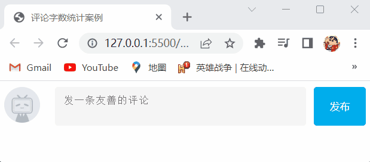
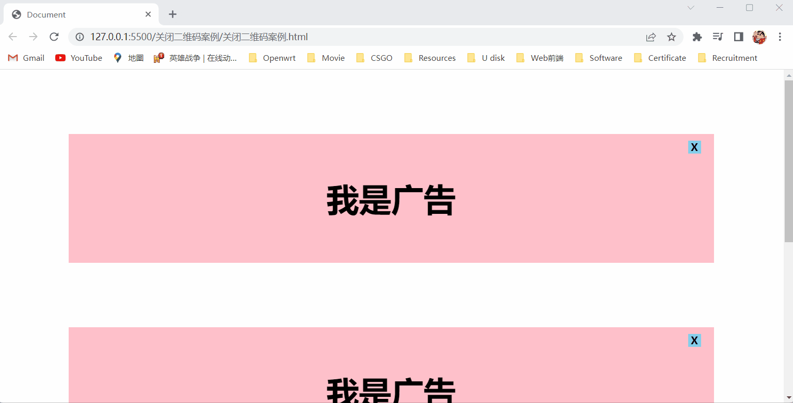
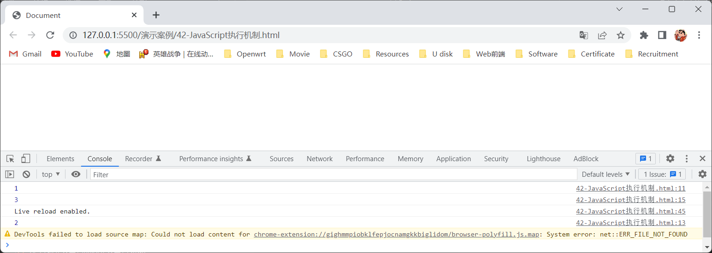

# 1.声明变量和常量

- 我们之前学习了三种声明变量和常量的方法分别是使用 `var` 关键字声明变量、使用 `let` 关键字声明变量、使用 `const` 关键字声明常量，在开发中我们优先使用常量，因为很多变量在我们声明的时候就知道它不会被更改了，所以在开发中我们优先使用常量，并且我们可以先使用常量，后面如果发现这个常量是需要被修改的时候，就可以将这个常量改成变量。

- 注意点：

  - 常量里的值是不允许改变的，但是如果常量中存储的是对象，我们是可以操作这个对象的，并不会发生报错，因为对象是存储在堆里面的，而这个常量存储的是这个对象在堆里面的地址，所以我们操作对象的时候并没有修改这个常量里的值。
  - 当我们声明一个常量，并且该常量存储的是一个对象时，如果我们给这个常量赋另外一个对象时，会报错，是因为常量里的值是不允许改变的，当给这个常量赋另外一个对象时，就相当于修改了这个常量中存储的地址。

- 演示案例：

  ```html
  <!DOCTYPE html>
  <html lang="en">
  <head>
      <meta charset="UTF-8">
      <meta http-equiv="X-UA-Compatible" content="IE=edge">
      <meta name="viewport" content="width=device-width, initial-scale=1.0">
      <title>Document</title>
  </head>
  <body>
      <script>
          const obj1 = {
              uname: '张三'
          }
          obj1.age = 18;
          obj1.uname = '李四';
          console.log(obj1);
          const obj2 = [];
          obj2 = [1,2,3];
          console.log(obj2);
      </script>
  </body>
  </html>
  ```

- 演示结果：

  

# 2.Web APIs简介

## 2.1Web APIs和JavaScript的关联性

### 1.1.1JavaScript的组成

- JavaScript的组成如下图所示：

  

### 1.1.2JavaScript基础阶段以及Web APIs阶段

- 在JavaScript基础阶段我们学习了ECMAScript标准规定的基本语法，但是只学习了基本语法，是做不了常用的网页交互效果的，所以我们学习基本语法是为学习后面的Web APIs所做的铺垫，Web APIs是W3C组织的标准，并且Web APIs是我们JavaScript所独有的，我们主要学习Web APIs中的DOM和BOM，学习完Web APIs中的DOM和BOM我们就能做出常用的网页交互效果了。

## 1.2API和Web APIs

### 1.2.1API

- API（Application Programming Interface，应用程序编程接口）是一些预先定义的函数，目的是提供应用程序与开发人员基于某软件或硬件得以访问一组例程的能力，而无需访问源码，或理解内部工作机制的细节，简单理解就是API是给程序员提供的一种工具，以便能更轻松的实现想要完成的功能，而不必纠结其功能是怎么实现的，如：我们要实现手机充电这个功能时，我们并不需要关心手机内部的变压器怎么变压，手机内部的电池怎么存储电能、手机充电线怎么制作，我们只用知道我们拿着充电线插进充电接口就可以充电了，这个充电接口就相当于API。

### 1.2.2Web APIs

- Web API是浏览器提供的一套操作浏览器功能和页面元素的API（BOM和DOM），现阶段我们主要针对于浏览器讲解常用的API，主要针对浏览器做交互效果，如：我们想要浏览器弹出一个警示框，我们就可以直接使用操作浏览器功能的API（BOM）中的 `alert()` 方法就能实现弹出一个警示框，而不需要我们写一连串的代码。

- 因为Web API有很多，所以我们将这个阶段称为Web APIs，我们还可以通过查阅MDN文档来查看更多的Web API。

  > 注：MDN详细API网址：https://developer.mozilla.org/zh-CN/docs/Web/API。

- 注意点：

  - Web API一般都有输入和输出（函数的传参和返回值）。
  - Web API很多都是函数。
  - 学习Web API可以结合前面学习的内置对象方法的思路学习。

# 3.DOM

## 3.1DOM简介

### 3.1.1什么是DOM

- 文档对象模型（Document Object Model，简称：DOM），是W3C组织推荐的处理可扩展标记语言（HTML或者XML）的标准编程接口，W3C组织已经定义了一系列的DOM接口，通过这些DOM接口就可以改变网页的内容、结构和样式，简单来说就是DOM是浏览器提供的一套专门用来操作网页内容的功能，我们可以通过使用DOM来实现网页与用户的交互。

### 3.1.2DOM树

- DOM树是将HTML文档以树状结构直观的表现出来，我们也可以称之为文档树或DOM树，如下图所示：

  

  > 注1：文档：一个页面就是一个文档，在DOM中使用 `document` 来表示。
  >
  > 注2：元素：页面中的所有标签都是元素，在DOM中使用 `element` 来表示。
  >
  > 注3：节点：网页中的所有内容都是节点（标签、属性、文本、注释等），在DOM中使用 `node` 来表示。

- DOM树的作用直观的体现了标签与标签之间的关系。

### 3.1.3DOM对象

- DOM对象就是浏览器根据HTML标签所生成的JavaScript对象，我们称这个对象为DOM对象，简单来说就是网页中的每一个HTML标签都有一个DOM对象，我们可以通过这个DOM对象来操作该HTML标签，因为该HTML标签中的所有标签属性都可以在这个DOM对象中找到，而且如果我们修改了这个DOM对象中的属性，它就会自动映射到该HTML标签上，所以DOM的核心思想就是把网页中的每一个HTML标签都当作对象来处理。
- 在DOM中提供了一个 `document` 对象，该对象提供的属性和方法都是用来访问和操作网页中的内容的，并且网页中的所有内容都在该 `document` 对象中。
- 在DOM中HTML标签用元素（element）来表示，所以HTML标签的DOM对象也叫做元素的DOM对象。

## 3.2获取网页中的元素的DOM对象

### 3.2.1为什么需要获取网页中的元素的DOM对象

- 因为DOM在实际开发中主要是用来操作网页中的元素的，而我们可以通过网页中的元素的DOM对象来操作该网页中的元素，所以我们需要先获取网页中的元素的DOM对象，才能操作该网页中的元素，又因为网页中的所有内容都在DOM提供的 `document` 对象中，所以我们需要使用 `document` 对象中的属性和方法来获取网页中的元素的DOM对象。

### 3.2.2根据CSS选择器来获取网页中的元素的DOM对象

- 根据CSS选择器来获取DOM元素有以下两种：

  1. 我们使用 `document` 对象中的 `querySelector()` 方法来根据CSS选择器获取该CSS选择器在网页中选择的第一个元素的DOM对象。

     - 语法：

       ```javascript
       const 对象名 = docment.querySelector('CSS选择器');
       ```

       > 注：因为DOM对象是没有对象名的，所以我们如果要使用DOM对象中的属性和方法时，需要给DOM对象赋对象名。

     - 取值：

       |           | 取值                                                         |
       | :-------: | ------------------------------------------------------------ |
       |  对象名   | 用户自定义，要遵从变量名的命名规则与规范                     |
       | CSS选择器 | 用户自定义，只能是我们学习的CSS选择器，如：类选择器、标签名选择器等 |

     - 注意点：

       - `docment.querySelector('CSS选择器')` 方法在执行完毕后，会返回CSS选择器在网页中匹配到的第一个元素的DOM对象，如果没有匹配到，那么就返回 `null`。
       - `docment.querySelector('CSS选择器')` 方法中的CSS选择器可以书写多个CSS选择器，如：`docment.querySelector('ul li');` 代码，表示获取网页中第一个 `<ul>` 标签中的第一个 `<li>` 标签的DOM对象。
       - 我们获取的元素的DOM对象是动态的，也就是说如果元素发生了改变，我们获得的元素的DOM对象也会跟着改变。
       
   - 演示案例：
     
     ```html
       <!DOCTYPE html>
       <html lang="en">
       <head>
           <meta charset="UTF-8">
           <meta http-equiv="X-UA-Compatible" content="IE=edge">
           <meta name="viewport" content="width=device-width, initial-scale=1.0">
           <title>Document</title>
       </head>
       <body>
           <ul>
               <li>12</li>
               <li>23</li>
               <li>34</li>
               <li>45</li>
           </ul>
           <script>
               const li = document.querySelector('ul li');
               const div = document.querySelector('div');
               console.log(li);
               console.log(div);
               console.log(li.innerHTML);
           </script>
       </body>
       </html>
     ```
     
   - 演示结果：
     
     
     
2. 我们使用 `document` 对象中的 `querySelectorAll()` 方法来根据CSS选择器获取该CSS选择器在网页中选择的所有元素的DOM对象。
  
   - 语法：
   
     ```javascript
       const 数组名 = docment.querySelectorAll('CSS选择器');
     ```
   
   - 取值：
   
     |           | 取值                                                         |
       | :-------: | ------------------------------------------------------------ |
       |  数组名   | 用户自定义，要遵从变量名的命名规则与规范                     |
       | CSS选择器 | 用户自定义，是我们学习的CSS选择器，如：类选择器、标签名选择器等 |
   
   - 注意点：
   
     - `docment.querySelectorAll('CSS选择器')` 方法要注意大小写。
       - `docment.querySelectorAll('CSS选择器')` 方法在执行完毕后，会返回CSS选择器在网页中匹配到的所有元素的DOM对象，所以它返回的是一个伪数组，这个伪数组中存放着多个元素的DOM对象，当我们要使用该伪数组中的某一个元素的DOM对象时，只需要用 `数组名[某一个元素的DOM对象在伪数组中的索引号]` 方法就可以使用该伪数组中的某一个元素的DOM对象了，当我们要使用该伪数组中的所有元素的DOM对象时，只需要遍历该伪数组即可，如果没有匹配到，那么就返回一个空的伪数组。
       - `docment.querySelectorAll('CSS选择器')` 方法中的CSS选择器可以书写多个CSS选择器，如：`docment.querySelectorAll('ul li');` 代码，表示获取网页中所有 `<ul>` 标签中的所有 `<li>` 标签的DOM对象。
   
     - `docment.querySelectorAll('CSS选择器')` 方法在执行完毕后，如果只获取过来一个元素的DOM对象时，它也是返回一个伪数组。
       - 我们获取的元素的DOM对象是动态的，也就是说如果元素发生了改变，我们获得的元素的DOM对象也会跟着改变。
   
   - 演示案例：
   
     ```html
       <!DOCTYPE html>
       <html lang="en">
       <head>
           <meta charset="UTF-8">
           <meta http-equiv="X-UA-Compatible" content="IE=edge">
           <meta name="viewport" content="width=device-width, initial-scale=1.0">
           <title>Document</title>
       </head>
       <body>
           <ul>
               <li>12</li>
               <li>23</li>
               <li>34</li>
               <li>45</li>
           </ul>
           <ul>
               <li>1</li>
               <li>2</li>
               <li>3</li>
               <li>4</li>
           </ul>
           <script>
               const li = document.querySelectorAll('ul li');
               const div = document.querySelectorAll('div');
               console.log(li);
               console.log(div);
               console.log(li[0].innerHTML);
               for (let i = 0; i < li.length; i++) {
                   console.log(li[i].innerHTML);
               }
           </script>
       </body>
       </html>
     ```
   
   - 演示结果：
   
     

### 3.2.3其它方法来获取网页中的元素的DOM对象

- 其它方法来获取网页中的元素的DOM对象有：

  1. 根据ID获取网页中的元素的DOM对象：

     - 我们可以使用 `document` 对象中的 `getElementById()` 方法来根据ID获取网页中第一个带有该ID的元素的DOM对象。

       > 注：`getElementById()` 中的 `get` 是获得的意思，`element` 是元素的意思，`by` 是通过的意思。

     - 语法：

       ```javascript
       const 对象名 = document.getElementById('ID');
       ```

       > 注：因为DOM对象是没有对象名的，所以我们如果要使用DOM对象中的属性和方法时，需要给DOM对象赋对象名。

     - 取值：

       |        | 取值                                     |
       | :----: | ---------------------------------------- |
       | 对象名 | 用户自定义，要遵从变量名的命名规则与规范 |
       |   ID   | 要获取的元素里的ID属性的属性值           |

     - 注意点：

       - `document.getElementById('ID')` 方法要注意大小写。
       - `document.getElementById('ID')` 方法在执行完毕后，会返回ID在网页中匹配到的第一个元素的DOM对象，如果没有匹配到，就返回 `null`。
       - 我们获取的元素的DOM对象是动态的，也就是说如果元素发生了改变，我们获得的元素的DOM对象也会跟着改变。

     - 演示案例：

       ```html
       <!DOCTYPE html>
       <html lang="en">
       <head>
           <meta charset="UTF-8">
           <meta http-equiv="X-UA-Compatible" content="IE=edge">
           <meta name="viewport" content="width=device-width, initial-scale=1.0">
           <title>Document</title>
       </head>
       <body>
           <ul>
               <li>12</li>
               <li id="2">23</li>
               <li id="2">34</li>
               <li>45</li>
           </ul>
           <script>
               const li = document.getElementById('2');
               const div = document.getElementById('1');
               console.log(li);
               console.log(div);
               console.log(li.innerHTML);
           </script>
       </body>
       </html>
       ```

     - 演示结果：

       

  2. 根据标签名获取网页中的元素的DOM对象：

     - 我们可以使用 `document` 对象中的 `getElementsByTagName()` 方法来根据标签名获取网页中所有带有该标签名的元素的DOM对象。

       > 注：`getElementsByTagName()` 中的 `get` 是获得的意思，`element` 是元素的意思，`by` 是通过的意思，`TagName` 是标签名的意思。

     - 语法：

       ```javascript
       const 数组名 = document.getElementsByTagName('标签名');
       ```

     - 取值：

       |        | 取值                                     |
       | :----: | ---------------------------------------- |
       | 数组名 | 用户自定义，要遵从变量名的命名规则与规范 |
       | 标签名 | 要获取的元素里的标签名                   |

     - 注意点：

       - `document.getElementsByTagName('标签名')` 方法要注意大小写。
       - `document.getElementsByTagName('标签名')` 方法在执行完毕后，会返回标签名在网页中匹配到的所有元素的DOM对象，所以它返回的是一个伪数组，这个伪数组中存放着多个元素的DOM对象，当我们要使用该伪数组中的某一个元素的DOM对象时，只需要用 `数组名[某一个元素的DOM对象在伪数组中的索引号]` 方法就可以使用该伪数组中的某一个元素的DOM对象了，当我们要使用该伪数组中的所有元素的DOM对象时，只需要遍历该伪数组即可，如果没有匹配到，那么就返回一个空的伪数组。

       - `docment.getElementsByTagName('标签名')` 方法在执行完毕后，如果只获取过来一个元素的DOM对象时，它也是返回一个伪数组。
       - 我们获取的元素的DOM对象是动态的，也就是说如果元素发生了改变，我们获得的元素的DOM对象也会跟着改变。

       - 我们可以通过使用 `document.getElementsById('ID')` 方法来获取父元素的DOM对象，并使用该DOM对象中的 `getElementsByTagName('标签名')` 方法来根据标签名获取该父元素中内部所有带有该标签名的子元素的DOM对象，所以 `element.getElementsByTagName('标签名')` 方法返回的也是一个伪数组。

     - 演示案例：

       ```html
       <!DOCTYPE html>
       <html lang="en">
       <head>
           <meta charset="UTF-8">
           <meta http-equiv="X-UA-Compatible" content="IE=edge">
           <meta name="viewport" content="width=device-width, initial-scale=1.0">
           <title>Document</title>
       </head>
       <body>
           <ul id="1">
               <li>12</li>
               <li>23</li>
               <li>34</li>
               <li>45</li>
           </ul>
           <ul>
               <li>1</li>
               <li>2</li>
               <li>3</li>
               <li>4</li>
           </ul>
           <script>
               const li = document.getElementsByTagName('li');
               const ul = document.getElementById('1');
               const li1 = ul.getElementsByTagName('li');
               const div = document.querySelectorAll('div');
               console.log(li);
               console.log(li1);
               console.log(div);
               console.log(li[0].innerHTML);
               for (let i = 0; i < li.length; i++) {
                   console.log(li[i].innerHTML);
               }
           </script>
       </body>
       </html>
       ```

     - 演示结果：

       

  3. 根据类名获取网页中的元素的DOM对象：

     - 我们可以使用 `document` 对象中的 `getElementsByClassName()` 方法来根据类名获取网页中所有带有该类名的元素的DOM对象。

       > 注：`getElementsByClassName()` 中的 `get` 是获得的意思，`element` 是元素的意思，`by` 是通过的意思，`ClassName` 是类名的意思。

     - 语法：

       ```javascript
       const 数组名 = document.getElementsByClassName('类名');
       ```

     - 取值：

       |        | 取值                                     |
       | :----: | ---------------------------------------- |
       | 数组名 | 用户自定义，要遵从变量名的命名规则与规范 |
       |  类名  | 要获取的元素里的 `class` 属性的属性值    |

     - 注意点：

       - `document.getElementsByClassName('类名')` 方法要注意大小写。
       - `document.getElementsByClassName('类名')` 方法在执行完毕后，会返回类名在网页中匹配到的所有元素的DOM对象，所以它返回的是一个伪数组，这个伪数组中存放着多个元素的DOM对象，当我们要使用该伪数组中的某一个元素的DOM对象时，只需要用 `数组名[某一个元素的DOM对象在伪数组中的索引号]` 方法就可以使用该伪数组中的某一个元素的DOM对象了，当我们要使用该伪数组中的所有元素的DOM对象时，只需要遍历该伪数组即可，如果没有匹配到，那么就返回一个空的伪数组。

       - `docment.getElementsByClassName('类名')` 方法在执行完毕后，如果只获取过来一个元素的DOM对象时，它也是返回一个伪数组。
       - 我们获取的元素的DOM对象是动态的，也就是说如果元素发生了改变，我们获得的元素的DOM对象也会跟着改变。

       - 我们可以通过使用 `document.getElementsById('ID')` 方法来获取父元素的DOM对象，并使用该DOM对象中的 `getElementsByClassName('类名')` 方法来根据类名获取该父元素中内部所有带有该类名的子元素的DOM对象，所以 `element.getElementsByClassName('类名')` 方法返回的也是一个伪数组。

     - 演示案例：

       ```html
       <!DOCTYPE html>
       <html lang="en">
       <head>
           <meta charset="UTF-8">
           <meta http-equiv="X-UA-Compatible" content="IE=edge">
           <meta name="viewport" content="width=device-width, initial-scale=1.0">
           <title>Document</title>
       </head>
       <body>
           <ul id="1">
               <li class="two">12</li>
               <li class="two">23</li>
               <li class="two">34</li>
               <li class="two">45</li>
           </ul>
           <ul>
               <li class="two">1</li>
               <li class="two">2</li>
               <li class="two">3</li>
               <li class="two">4</li>
           </ul>
           <script>
               const li = document.getElementsByClassName('two');
               const ul = document.getElementById('1');
               const li1 = ul.getElementsByClassName('two');
               const div = document.getElementsByClassName('div');
               console.log(li);
               console.log(li1);
               console.log(div);
               console.log(li[0].innerHTML);
               for (let i = 0; i < li.length; i++) {
                   console.log(li[i].innerHTML);
               }
           </script>
       </body>
       </html>
       ```

     - 演示结果：

       

  4. 获取网页中特殊元素的DOM对象：

     - 我们可以使用 `document` 对象中的 `body` 属性来获取网页中的 `<body>` 标签的DOM对象。

     - 语法：

       ```javascript
       const 对象名 = document.body;
       ```

       > 注：因为DOM对象是没有对象名的，所以我们如果要使用DOM对象中的属性和方法时，需要给DOM对象赋对象名。

     - 我们可以使用 `document` 对象中的 `documentElement` 属性来获取网页中的 `<html>` 标签的DOM对象。

     - 语法：

       ```javascript
       const 对象名 = document.documentElement;
       ```

       > 注：因为DOM对象是没有对象名的，所以我们如果要使用DOM对象中的属性和方法时，需要给DOM对象赋对象名。

     - 对象名的取值：用户自定义，要遵从变量名的命名规则与规范。

     - 注意点：

       - `document.documentElement` 属性要注意大小写。
       - `document.body` 属性和 `document.documentElement` 属性在执行完毕后，会分别返回网页中的 `<body>` 标签的DOM对象和网页中的 `<html>` 标签的DOM对象。
       - 我们获取的元素的DOM对象是动态的，也就是说如果元素发生了改变，我们获得的元素的DOM对象也会跟着改变。

     - 演示案例：

       ```html
       <!DOCTYPE html>
       <html lang="en">
       <head>
           <meta charset="UTF-8">
           <meta http-equiv="X-UA-Compatible" content="IE=edge">
           <meta name="viewport" content="width=device-width, initial-scale=1.0">
           <title>Document</title>
       </head>
       <body>
           <script>
               const body = document.body;
               const html = document.documentElement;
               console.log(body);
               console.log(html);
           </script>
       </body>
       </html>
       ```

     - 演示结果：

       

### 3.2.4 `console.dir()` 方法

- 当我们用 `console.log()` 方法输出元素的DOM对象时，只会输出该DOM对象中的 `outerHTML` 属性的属性值，并不会输出该DOM对象，如果想要输出该DOM对象，我们需要使用 `console.dir(该DOM对象的对象名)` 方法来输出，输出该DOM对象可以让我们更好的查看该DOM对象里面的属性和方法。

- 演示案例：

  ```html
  <!DOCTYPE html>
  <html lang="en">
  <head>
      <meta charset="UTF-8">
      <meta http-equiv="X-UA-Compatible" content="IE=edge">
      <meta name="viewport" content="width=device-width, initial-scale=1.0">
      <title>Document</title>
  </head>
  <body>
      <ul>
          <li>123</li>
          <li>456</li>
      </ul>
      <div>789</div>
      <script>
          const li = document.querySelectorAll('li');
          const div = document.querySelector('div');
          console.log(li[0]);
          console.log(div);
          console.dir(li[0]);
          console.dir(div);
      </script>
  </body>
  </html>
  ```

- 演示结果：

  

## 3.3操作元素内容

- 因为DOM对象都是浏览器根据标签生成的，所以操作标签，本质上就是操作DOM对象，所以我们可以使用元素的DOM对象中的 `innerText` 属性或 `innerHTML` 属性来获取元素的内容，并且我们还可以通过修改元素的DOM对象中的 `innerText` 属性或 `innerHTML` 属性来修改元素的内容。

- 语法：

  ```javascript
  element.innerText;// 获取元素的内容
  element.innerText = 要修改的值;// 修改元素的内容
  element.innerHTML;// 获取元素的内容
  element.innerHTML = 要修改的值;// 修改元素的内容
  ```

- 要修改的值的取值：用户自定义，可以是数字，字符串等。

- 注意点：

  - 在操作元素之前我们需要先获取该元素的DOM对象，才能操作该元素。
  - `innerText` 属性和 `innerHTML` 属性的区别：
    - `innerText` 属性：在修改元素中的内容时，如果要修改的内容中有HTML标签的，是不会将该HTML标签解析成网页元素的，而是直接输出这个HTML标签，并且如果要修改的内容中有换行和空格也会照常输出，但是如果是在获取元素中的内容时，是不会获取到HTML标签的。
    - `innerHTML` 属性：在修改元素中的内容时，如果要修改的内容中有HTML标签的，是会将该HTML标签解析成网页元素的，并且如果要修改的内容中有换行和空格也会照常输出，并且在获取元素中的内容时，是会保留HTML标签的。

- 演示代码：

  ```html
  <!DOCTYPE html>
  <html lang="en">
  <head>
      <meta charset="UTF-8">
      <meta http-equiv="X-UA-Compatible" content="IE=edge">
      <meta name="viewport" content="width=device-width, initial-scale=1.0">
      <title>Document</title>
  </head>
  <body>
      <div id="one">
          <strong>123</strong>
          <br>
          456
      </div>
      <div id="two">
          <strong>123</strong>
          <br>
          456
      </div>
      <script>
          const div1 = document.querySelector('#one');
          console.log(div1.innerText);
          div1.innerText = '<strong>123</strong> 456';
          console.log(div1.innerText);
          const div2 = document.querySelector('#two');
          console.log(div2.innerHTML);
          div2.innerHTML = '<strong>123</strong> 456';
          console.log(div2.innerHTML);
      </script>
  </body>
  </html>
  ```

- 演示结果：

  

## 3.4年会抽奖案例

- 从数组随机抽取一等奖、二等奖和三等奖，显示到对应的标签里面。
- 年会抽奖案例的实现步骤：
  1. 声明一个数组，里面存放着名字。
  2. 从数组中随机获取一个名字给一等奖。
  3. 从数组中随机获取一个名字给二等奖。
  4. 从数组中随机获取一个名字给三等奖。

- 演示代码：

  ```html
  <!DOCTYPE html>
  <html lang="en">
  <head>
      <meta charset="UTF-8">
      <meta http-equiv="X-UA-Compatible" content="IE=edge">
      <meta name="viewport" content="width=device-width, initial-scale=1.0">
      <title>年会抽奖案例</title>
  </head>
  <body>
      <div>
          一等奖：<span id="one"></span>
      </div>
      <div>
          二等奖：<span id="two"></span>
      </div>
      <div>
          三等奖：<span id="three"></span>
      </div>
      <script>
          // 声明一个数组，里面存放着名字。
          const arr = ['张三','李四','王五'];
          // 从数组中随机获取一个名字给一等奖。
          let random = Math.floor(Math.random() * arr.length);
          const one = document.querySelector('#one');
          one.innerHTML = `<strong>${arr[random]}</strong>`;
          arr.splice(random,1);
          // 从数组中随机获取一个名字给二等奖。
          random = Math.floor(Math.random() * arr.length);
          const two = document.querySelector('#two');
          two.innerHTML = `<strong>${arr[random]}</strong>`;
          arr.splice(random,1);
          // 从数组中随机获取一个名字给三等奖。
          random = Math.floor(Math.random() * arr.length);
          const three = document.querySelector('#three');
          three.innerHTML = `<strong>${arr[random]}</strong>`;
      </script>
  </body>
  </html>
  ```

- 演示结果：

  

## 3.5操作元素属性

### 3.5.1操作元素常用属性

- 我们可以使用元素的DOM对象中的 `src` 属性来获取或修改该元素的 `src` 属性。

- 语法：

  ```javascript
  element.src;// 获取元素的src属性
  element.src = 要修改的值;// 修改元素的src属性;
  ```

- 要修改的值的取值：用户自定义，可以是数字，字符串等。

- 注意点：

  - 在操作元素之前我们需要先获取该元素的DOM对象，才能操作该元素。
  - 我们还可以通过以上方法来操作元素的 `title` 属性、`id` 属性等。

- 演示代码：

  ```html
  <!DOCTYPE html>
  <html lang="en">
  <head>
      <meta charset="UTF-8">
      <meta http-equiv="X-UA-Compatible" content="IE=edge">
      <meta name="viewport" content="width=device-width, initial-scale=1.0">
      <title>Document</title>
      <style>
          div {
              width: 100px;
              height: 100px;
              background-color: pink;
          }
      </style>
  </head>
  <body>
      <div title="我是一个盒子"></div>
      <script>
          const div = document.querySelector('div');
          console.log(div.title);
          div.title = '我是一个粉色的盒子';
          console.log(div.title);
      </script>
  </body>
  </html>
  ```

- 演示结果：

  

### 3.5.2操作元素样式属性

- 操作元素样式属性有以下三种方法：

  1. 我们可以使用元素的DOM对象中的 `style` 属性来获取或修改该元素的行内式样式属性（行内式CSS属性）。

     - 语法：

       ```javascript
       element.style;// 获取元素的行内式样式属性
       element.style = 要修改的值;// 修改元素的行内式样式属性;
       ```

     - 要修改的值的取值：用户自定义，可以是数字，字符串等。

     - 注意点：

       - 在操作元素之前我们需要先获取该元素的DOM对象，才能操作该元素。
       - 如果要修改的值为CSS属性我们可以将该CSS属性的属性名写在 `style` 的后面并且用 `.` 将其连接，然后将该CSS属性的属性值写在 `=` 的后面，如：`element.style.width = '100px';`，但是要注意如果该CSS属性的属性名有 `-` 那么我们要采取小驼峰命名法，如：`element.style.backgroundColor = 'pink';`，还要注意如果该CSS属性的属性值有CSS单位，那么必须加上CSS单位，如：`element.style.width = '100px';`。
       - 因为行内式样式属性的权重较高，所以如果有其它嵌入式样式属性或引入式样式属性和行内式样式属性一样时，行内式样式属性会覆盖掉嵌入式样式属性或引入式样式属性。
  
     - 演示代码：
  
       ```html
       <!DOCTYPE html>
       <html lang="en">
       <head>
           <meta charset="UTF-8">
           <meta http-equiv="X-UA-Compatible" content="IE=edge">
           <meta name="viewport" content="width=device-width, initial-scale=1.0">
           <title>Document</title>
           <style>
               div {
                   width: 100px;
                   height: 100px;
                   background-color: pink;
               }
           </style>
       </head>
       <body>
           <div style=""></div>
           <script>
               const div = document.querySelector('div');
               console.log(div.style);
               div.style.backgroundColor = 'green';
               console.log(div.style);
           </script>
       </body>
       </html>
       ```
  
     - 演示结果：
  
       
  
  2. 我们可以使用元素的DOM对象中的 `className` 属性来获取或修改该元素的 `class` 属性，使其能配合CSS选择器，让其可以修改多个样式属性，因为通过使用 `style` 属性修改多个样式属性会比较繁琐。
  
     - 语法：
  
       ```javascript
       element.className;// 获取元素的class属性
       element.className = 要修改的值;// 修改元素的class属性;
       ```
  
     - 要修改的值的取值：用户自定义，可以是数字，字符串等。
  
     - 注意点：
  
       - 在操作元素之前我们需要先获取该元素的DOM对象，才能操作该元素。
       - 由于 `class` 是关键字，所以使用元素的DOM对象中的 `className` 属性来获取或修改该元素的 `class` 属性。
       - 因为修改元素的 `class` 属性是将新值替换旧值，所以如果需要给元素添加一个新类名，需要保留该元素之前的类名。

     - 演示代码：
  
       ```html
       <!DOCTYPE html>
       <html lang="en">
       <head>
           <meta charset="UTF-8">
           <meta http-equiv="X-UA-Compatible" content="IE=edge">
           <meta name="viewport" content="width=device-width, initial-scale=1.0">
           <title>Document</title>
           <style>
               .cs {
                   width: 100px;
                   height: 100px;
                   background-color: pink;
               }
               .xg {
                   width: 200px;
                   background-color: green;
               }
           </style>
       </head>
       <body>
           <div class="cs"></div>
           <script>
               const div = document.querySelector('div');
               console.log(div.className);
               div.className = 'cs xg';
               console.log(div.className);
           </script>
       </body>
       </html>
       ```

     - 演示结果：

       

  3. 我们可以使用元素的DOM对象中的 `classList.add()` 方法来给该元素添加指定类名、`classList.remove()` 方法来给该元素删除指定类名、`classList.toggle()` 方法来判断该元素是否有指定类名，如果有就删除指定类名，如果没有就添加指定类名。

     - 语法：
  
       ```javascript
       element.classList.add('类名');// 给元素添加指定类名
       element.classList.remove('类名');// 给元素删除指定类名
       element.classList.toggle('类名');// 判断元素是否有指定类名，如果有就删除指定类名，如果没有就添加指定类名
       ```

     - 类名的取值：用户自定义，可以是数字，字符串等。

     - 注意点：

       - 在操作元素之前我们需要先获取该元素的DOM对象，才能操作该元素。
  
       - `className` 属性和 `classList` 方法的区别在于 `className` 属性在修改元素的 `class` 属性时，是将新值替换旧值，所以如果需要给元素添加一个新类名，就需要保留该元素之前的类名，而 `classList` 方法是将类名追加进元素的 `class` 属性中，所以不会影响元素之前的类名。
     
     - 演示代码：
     
       ```html
       <!DOCTYPE html>
       <html lang="en">
       <head>
           <meta charset="UTF-8">
           <meta http-equiv="X-UA-Compatible" content="IE=edge">
           <meta name="viewport" content="width=device-width, initial-scale=1.0">
           <title>Document</title>
           <style>
               .cs {
                   width: 100px;
                   height: 100px;
                   background-color: pink;
               }
               .xg {
                   width: 200px;
                   background-color: green;
               }
           </style>
       </head>
       <body>
           <div class=""></div>
           <script>
               const div = document.querySelector('div');
               div.classList.add('cs');
               console.log(div.className);
               div.classList.remove('cs');
               console.log(div.className);
               div.classList.toggle('xg');
               console.log(div.className);
           </script>
       </body>
       </html>
       ```
     
     - 演示结果：
     
       

### 3.5.3轮播图随机案例

- 当我们刷新页面，页面中的轮播图会显示不同的图片以及样式。

- 轮播图随机案例的实现步骤：

  1. 准备一个数组对象，里面包含详细信息。
  2. 随机选择一个数字，选出数组对应的对象，更换图片，底部盒子背景颜色，以及文字内容。
  3. 利用这个随机数字，让小圆点添加高亮的类。

- 演示代码：

  ```html
  <!DOCTYPE html>
  <html lang="en">
  <head>
    <meta charset="UTF-8" />
    <meta http-equiv="X-UA-Compatible" content="IE=edge" />
    <meta name="viewport" content="width=device-width, initial-scale=1.0" />
    <title>轮播图随机案例</title>
    <style>
      * {
        box-sizing: border-box;
      }
      .slider {
        width: 560px;
        height: 400px;
        overflow: hidden;
      }
      .slider-wrapper {
        width: 100%;
        height: 320px;
      }
      .slider-wrapper img {
        width: 100%;
        height: 100%;
        display: block;
      }
      .slider-footer {
        height: 80px;
        background-color: rgb(100, 67, 68);
        padding: 12px 12px 0 12px;
        position: relative;
      }
      .slider-footer .toggle {
        position: absolute;
        right: 0;
        top: 12px;
        display: flex;
      }
      .slider-footer .toggle button {
        margin-right: 12px;
        width: 28px;
        height: 28px;
        appearance: none;
        border: none;
        background: rgba(255, 255, 255, 0.1);
        color: #fff;
        border-radius: 4px;
        cursor: pointer;
      }
      .slider-footer .toggle button:hover {
        background: rgba(255, 255, 255, 0.2);
      }
      .slider-footer p {
        margin: 0;
        color: #fff;
        font-size: 18px;
        margin-bottom: 10px;
      }
      .slider-indicator {
        margin: 0;
        padding: 0;
        list-style: none;
        display: flex;
        align-items: center;
      }
      .slider-indicator li {
        width: 8px;
        height: 8px;
        margin: 4px;
        border-radius: 50%;
        background: #fff;
        opacity: 0.4;
        cursor: pointer;
      }
      .slider-indicator li.active {
        width: 12px;
        height: 12px;
        opacity: 1;
      }
    </style>
  </head>
  <body>
    <div class="slider">
      <div class="slider-wrapper">
        
      </div>
      <div class="slider-footer">
        <p></p>
        <ul class="slider-indicator">
          <li></li>
          <li></li>
          <li></li>
          <li></li>
          <li></li>
          <li></li>
          <li></li>
          <li></li>
        </ul>
        <div class="toggle">
          <button class="prev">&lt;</button>
          <button class="next">&gt;</button>
        </div>
      </div>
    </div>
    <script>
      // 准备一个数组对象，里面包含详细信息。
      const sliderData = [
        { url: './images/slider01.jpg', title: '对人类来说会不会太超前了？', color: 'rgb(100, 67, 68)' },
        { url: './images/slider02.jpg', title: '开启剑与雪的黑暗传说！', color: 'rgb(43, 35, 26)' },
        { url: './images/slider03.jpg', title: '真正的jo厨出现了！', color: 'rgb(36, 31, 33)' },
        { url: './images/slider04.jpg', title: '李玉刚：让世界通过B站看到东方大国文化', color: 'rgb(139, 98, 66)' },
        { url: './images/slider05.jpg', title: '快来分享你的寒假日常吧~', color: 'rgb(67, 90, 92)' },
        { url: './images/slider06.jpg', title: '哔哩哔哩小年YEAH', color: 'rgb(166, 131, 143)' },
        { url: './images/slider07.jpg', title: '一站式解决你的电脑配置问题！！！', color: 'rgb(53, 29, 25)' },
        { url: './images/slider08.jpg', title: '谁不想和小猫咪贴贴呢！', color: 'rgb(99, 72, 114)' },
      ];
      // 随机选择一个数字，选出数组对应的对象，更换图片，底部盒子背景颜色，以及文字内容。
      const random = parseInt(Math.random() * sliderData.length);
      const img = document.querySelector('.slider-wrapper img');
      img.src = sliderData[random].url;
      const p = document.querySelector('.slider-footer p');
      p.innerHTML = sliderData[random].title;
      const footer = document.querySelector('.slider-footer');
      footer.style.backgroundColor = sliderData[random].color;
      // 利用这个随机数字，让小圆点添加高亮的类。
      const li = document.querySelector(`.slider-indicator li:nth-child(${random + 1})`);
      li.classList.add('active');
    </script>
  </body>
  </html>
  ```

- 演示结果：

  

### 3.5.4操作表单元素属性

- 我们可以使用表单元素的DOM对象中的 `type` 属性来获取或修改该表单元素的 `type` 属性。

- 语法：

  ```javascript
  element.type;// 获取表单元素的type属性
  element.type = 要修改的值;// 修改表单元素的type属性;
  ```

- 要修改的值的取值：用户自定义，可以是数字，字符串等。

- 注意点：

  - 在操作表单元素之前我们需要先获取该表单元素的DOM对象，才能操作该表单元素。
  - 我们还可以通过以上方法来操作表单元素的 `value` 属性、`checked` 属性等。
  - 表单元素的DOM对象中的 `innerText` 属性和 `innerHTML` 属性都无法获取表单元素的内容，但是我们可以使用表单元素的DOM对象中的 `value` 属性来获取表单元素的内容。
  - 因为表单元素中有些属性是添加了就有效果，移除了就没有效果，所以我们使用布尔值来表示，如果这些属性的属性值为 `true` 就表示添加了这些属性，如果是 `false` 就表示移除了这些属性，这些属性的属性值一般默认为 `false`，如：表单元素的 `disabled` 属性、`checked` 属性等，这些属性是添加了就有效果，移除了就没有效果，所以我们可以操控这些属性给其赋 `true` 值就表示添加了该属性，给其赋 `false` 值就表示移除了该属性，注意也可以给其赋字符串来表示 `true`，赋空字符串来表示 `false`，因为会发生隐式转换，但是不提倡这样做。

- 演示代码：

  ```html
  <!DOCTYPE html>
  <html lang="en">
  <head>
      <meta charset="UTF-8">
      <meta http-equiv="X-UA-Compatible" content="IE=edge">
      <meta name="viewport" content="width=device-width, initial-scale=1.0">
      <title>Document</title>
  </head>
  <body>
      <input type="text" value="我要买电脑">
      <input type="checkbox" id="one">
      <script>
          const ipt = document.querySelector('input');
          console.log(ipt.type);
          ipt.type = 'password';
          console.log(ipt.type);
          console.log(ipt.value);
          ipt.value = '给你买'
          console.log(ipt.value);
          const ckb = document.querySelector('one');
          console.log(ckb.checked);
          ckb.checked = true;
      </script>
  </body>
  </html>
  ```

- 演示结果：

  

### 3.5.5自定义属性

- 元素除了有自带的属性，如：`class` 属性、`id` 属性等，我们还可以给元素添加自定义属性。

- 语法：

  ```html
  <div date-自定义属性的属性名="自定义属性的属性值">
  ```

- 取值：

  |                    | 取值                                     |
  | :----------------: | ---------------------------------------- |
  | 自定义属性的属性名 | 用户自定义，要遵从变量名的命名规则与规范 |
  | 自定义属性的属性值 | 用户自定义，可以是数字、字符串等         |

- 注意点：

  - 自定义属性一律要使用 `data-` 来开头，如：`<div date-id="1">`。
  - 所有的元素都可以添加自定义属性。
  - 自定义属性的作用就是为了保存并使用数据，有些数据可以保存到页面中而不用保存到数据库中。

### 3.5.5操作元素自定义属性

#### 3.5.5.1获取元素的所有自定义属性

- 我们可以使用元素的DOM对象中的 `dataset` 对象来获取该元素的所有自定义属性。

- 语法：

  ```javascript
  element.dataset;// 获取元素的所有自定义属性
  ```

- 注意点：

  - 在操作元素之前我们需要先获取该元素的DOM对象，才能操作该元素。
  - 因为我们是使用元素的DOM对象中的 `dataset` 对象来获取该元素的所有自定义属性，所以该元素的所有自定义属性都以对象的属性的形式存储在该元素的DOM对象中的 `dataset` 对象中。
  - 因为元素的所有自定义属性都以对象的属性的形式存储在该元素的DOM对象中的 `dataset` 对象中，所以我们想获取该元素的某一个自定义属性时，只需要使用 `element.dataset.要获取的自定义属性的属性名` 方法或 `element.dataset['要获取的自定义属性的属性名']` 方法来获取即可，但是要注意如果要获取的自定义属性的属性名中有 `-` 就要采取小驼峰命名法，如：`element.dataset.userName;`。

- 演示代码：

  ```html
  <!DOCTYPE html>
  <html lang="en">
  <head>
      <meta charset="UTF-8">
      <meta http-equiv="X-UA-Compatible" content="IE=edge">
      <meta name="viewport" content="width=device-width, initial-scale=1.0">
      <title>Document</title>
  </head>
  <body>
      <div data-id="one" data-prm="123" data-user-name="haha"></div>
      <script>
          const div = document.querySelector('div');
          console.log(div.dataset);
          console.log(div.dataset.id);
          console.log(div.dataset['prm']);
          console.log(div.dataset.userName);
      </script>
  </body>
  </html>
  ```

- 演示结果：

  

#### 3.5.5.2修改元素的自定义属性

- 因为元素的所有自定义属性都以对象的属性的形式存储在该元素的DOM对象中的 `dataset` 对象中，所以我们想修改该元素的某一个自定义属性时，只需要使用 `element.dataset.要修改的自定义属性的属性名 = 要修改的值` 方法或 `element.dataset['要修改的自定义属性的属性名'] = 要修改的值` 方法来修改即可，但是要注意如果要修改的自定义属性的属性名中有 `-` 就要采取小驼峰命名法，如：`element.dataset.userName = 要修改的值;`。

- 语法：

  ```javascript
  element.dataset.要修改的自定义属性的属性名 = 要修改的值;// 修改元素的自定义属性
  element.dataset['要修改的自定义属性的属性名'] = 要修改的值;// 修改元素的自定义属性
  ```

- 取值：

  |                            | 取值                             |
  | :------------------------: | -------------------------------- |
  | 要修改的自定义属性的属性名 | 用户自定义                       |
  |         要修改的值         | 用户自定义，可以是数字、字符串等 |

- 注意点：在操作元素之前我们需要先获取该元素的DOM对象，才能操作该元素。

- 演示代码：

  ```html
  <!DOCTYPE html>
  <html lang="en">
  <head>
      <meta charset="UTF-8">
      <meta http-equiv="X-UA-Compatible" content="IE=edge">
      <meta name="viewport" content="width=device-width, initial-scale=1.0">
      <title>Document</title>
  </head>
  <body>
      <div data-id="one" data-prm="123" data-user-name="haha"></div>
      <script>
          const div = document.querySelector('div');
          console.log(div.dataset.id);
          div.dataset.id = 'two';
          console.log(div.dataset.id);
          console.log(div.dataset.prm);
          div.dataset.prm = '456';
          console.log(div.dataset.prm);
          console.log(div.dataset.userName);
          div.dataset.userName = 'wuwu';
          console.log(div.dataset.userName);
      </script>
  </body>
  </html>
  ```

- 演示结果：

  

### 3.5.6操作元素属性的其它方法

- 我们可以使用元素的DOM对象中的 `getAttribute()` 方法来获取该元素中的指定属性、`setAttribute()` 方法来修改该元素中的指定属性、`removeAttribute()` 方法来删除该元素中的指定属性。

- 语法：

  ```javascript
  element.getAttribute('属性名');// 获取该元素中的指定属性
  element.setAttribute('属性名','要修改的值');// 修改该元素中的指定属性
  element.removeAttribute('属性名');// 删除该元素中的指定属性
  ```

- 取值：

  |            | 取值                             |
  | :--------: | -------------------------------- |
  |   属性名   | 用户自定义，可以是数字，字符串等 |
  | 要修改的值 | 用户自定义，可以是数字、字符串等 |

- 注意点：

  - 在操作元素之前我们需要先获取该元素的DOM对象，才能操作该元素。
  - 当要获取或修改或删除元素的自定义属性时，属性名的前面要加上 `data-`，如：`element.getAttribute('data-user-name');`。

- 演示代码：

  ```html
  <!DOCTYPE html>
  <html lang="en">
  <head>
      <meta charset="UTF-8">
      <meta http-equiv="X-UA-Compatible" content="IE=edge">
      <meta name="viewport" content="width=device-width, initial-scale=1.0">
      <title>Document</title>
  </head>
  <body>
      <div id="one" class="xg" data-user-name="haha"></div>
      <script>
          const div = document.querySelector('div');
          console.log(div.getAttribute('id'));
          console.log(div.getAttribute('class'));
          console.log(div.getAttribute('data-user-name'));
          div.setAttribute('class','yb');
          console.log(div.getAttribute('class'));
          div.removeAttribute('class');
          console.log(div.getAttribute('class'));
      </script>
  </body>
  </html>
  ```

- 演示结果：

  

## 3.6定时器-间隔函数

- 间隔函数就是用来设置每间隔多长时间就会执行回调函数。

  > 注：回调函数就是当一个函数作为一个实参传入另一个函数时，当另一个函数执行完毕后才会执行传入的函数，我们就称这个传入的函数为回调函数，简单来说就是当一个函数作为一个实参传入另一个函数时，这个函数就是回调函数。

- 语法

  ```javascript
  setInterval(回调函数,间隔时间);// 调用间隔函数
  ```

- 取值：

  |          | 取值                   |
  | :------: | ---------------------- |
  | 回调函数 | 用户自定义，只能是函数 |
  | 间隔时间 | 用户自定义，只能是数字 |

- 间隔函数的执行流程：在执行调用间隔函数语句时，会先将回调函数和间隔时间传入进该间隔函数，此时该间隔函数就会每间隔传入进来的间隔时间，就执行一次传入进来的回调函数，一直到我们手动停止该间隔函数。

- 注意点：

  - 间隔时间的时间单位是毫秒。
  - 如果不写间隔时间那么间隔函数就默认以每间隔0毫秒就执行回调函数。
  - 回调函数可以写在调用间隔函数语句的括号内，也可以写在调用间隔函数语句的外面，但是如果写在调用间隔函数语句的外面，就要将回调函数的函数名写在调用间隔函数语句的括号内，要注意只写回调函数的函数名，如果给其加了括号，那么就是调用回调函数了，就不会每间隔一段时间就调用回调函数，但是如果以字符串类型将回调函数的函数名加括号写在调用间隔函数语句内，也是可以使用的，但是不推荐。
  - 回调函数可以是具名函数也可以是匿名函数。
  - 在执行间隔函数时，间隔函数会返回一个数字给调用间隔函数语句，该数字可以理解为间隔函数的ID，我们需要通过这个ID来停止间隔函数，要停止间隔函数我们需要使用 `clearInterval(间隔函数的ID)` 方法来停止。
  - 因为间隔函数我们可能需要关闭之后再调用，所以间隔函数返回给调用间隔函数语句的数字是不固定的，所以我们要用 `let` 声明的变量来保存这个数字。

- 演示代码：

  ```html
  <!DOCTYPE html>
  <html lang="en">
  <head>
      <meta charset="UTF-8">
      <meta http-equiv="X-UA-Compatible" content="IE=edge">
      <meta name="viewport" content="width=device-width, initial-scale=1.0">
      <title>Document</title>
  </head>
  <body>
      <script>
          setInterval(function one() {
              console.log('1');
          }, 1000);
          let two = function() {
              console.log(2);
          }
          setInterval(two,1000);
          let three = function() {
              console.log(3);
          }
          setInterval(three(),1000);
          let four = function() {
              console.log(4);
          }
          setInterval('four()',1000)
          let five = function() {
              console.log(5);
          }
          let num = setInterval(four,1000);
          clearInterval(num);
      </script>
  </body>
  </html>
  ```

- 演示结果：

  

## 3.7用户倒计时案例

- 按钮5秒之后才可以使用。
- 用户倒计时案例的实现步骤：
  1. 把按钮禁用。
  2. 获取元素。
  3. 使用间隔函数。

- 演示代码：

  ```html
  <!DOCTYPE html>
  <html lang="en">
  <head>
      <meta charset="UTF-8">
      <meta http-equiv="X-UA-Compatible" content="IE=edge">
      <meta name="viewport" content="width=device-width, initial-scale=1.0">
      <title>用户倒计时案例</title>
  </head>
  <body>
      <textarea name="" id="" cols="30" rows="10">
          用户注册协议
          欢迎注册成为京东用户！在您注册过程中，您需要完成我们的注册流程并通过点击同意的形式在线签署以下协议，请您务必仔细阅读、充分理解协议中的条款内容后再点击同意（尤其是以粗体或下划线标识的条款，因为这些条款可能会明确您应履行的义务或对您的权利有所限制）。
          【请您注意】如果您不同意以下协议全部或任何条款约定，请您停止注册。您停止注册后将仅可以浏览我们的商品信息但无法享受我们的产品或服务。如您按照注册流程提示填写信息，阅读并点击同意上述协议且完成全部注册流程后，即表示您已充分阅读、理解并接受协议的全部内容，并表明您同意我们可以依据协议内容来处理您的个人信息，并同意我们将您的订单信息共享给为完成此订单所必须的第三方合作方（详情查看
      </textarea>
      <br>
      <button class="btn" disabled>我已经阅读用户协议(5)</button>
      <script>
          const btn = document.querySelector('.btn');
          let i = 5;
          let num = setInterval(function() {
              i--;
              btn.innerHTML = `我已经阅读用户协议(${i})`;
              if (i < 0) {
                  clearInterval(num);
                  btn.innerHTML = `同意`;
                  btn.disabled = false;
              }
          },1000);
      </script>
  </body>
  </html>
  ```

- 演示结果：

  

## 3.8轮播图定时案例

- 每隔一秒钟切换一个图片。

- 轮播图定时案例的实现步骤：

  1. 准备一个数组对象，里面包含详细信息。

  2. 设置间隔函数。

  3. 使用排他思想将，让小圆点添加高亮的类。

     > 注：排他思想：就是先排除其他元素的样式，然后再设置当前元素的样式，如：如果有同一组元素，我们想要某一个元素实现某种样式，就需要用到循环的排他思想算法，将所有元素的样式全部清除（排除其他人），然后给当前元素设置样式（留下我自己），注意顺序不能颠倒，首先干掉其他元素的样式，再设置当前元素的样式。

- 演示代码：

  ```html
  <!DOCTYPE html>
  <html lang="en">
  <head>
    <meta charset="UTF-8" />
    <meta http-equiv="X-UA-Compatible" content="IE=edge" />
    <meta name="viewport" content="width=device-width, initial-scale=1.0" />
    <title>轮播图定时案例</title>
    <style>
      * {
        box-sizing: border-box;
      }
      .slider {
        width: 560px;
        height: 400px;
        overflow: hidden;
      }
      .slider-wrapper {
        width: 100%;
        height: 320px;
      }
      .slider-wrapper img {
        width: 100%;
        height: 100%;
        display: block;
      }
      .slider-footer {
        height: 80px;
        background-color: rgb(100, 67, 68);
        padding: 12px 12px 0 12px;
        position: relative;
      }
      .slider-footer .toggle {
        position: absolute;
        right: 0;
        top: 12px;
        display: flex;
      }
      .slider-footer .toggle button {
        margin-right: 12px;
        width: 28px;
        height: 28px;
        appearance: none;
        border: none;
        background: rgba(255, 255, 255, 0.1);
        color: #fff;
        border-radius: 4px;
        cursor: pointer;
      }
      .slider-footer .toggle button:hover {
        background: rgba(255, 255, 255, 0.2);
      }
      .slider-footer p {
        margin: 0;
        color: #fff;
        font-size: 18px;
        margin-bottom: 10px;
      }
      .slider-indicator {
        margin: 0;
        padding: 0;
        list-style: none;
        display: flex;
        align-items: center;
      }
      .slider-indicator li {
        width: 8px;
        height: 8px;
        margin: 4px;
        border-radius: 50%;
        background: #fff;
        opacity: 0.4;
        cursor: pointer;
      }
      .slider-indicator li.active {
        width: 12px;
        height: 12px;
        opacity: 1;
      }
    </style>
  </head>
  <body>
    <div class="slider">
      <div class="slider-wrapper">
        
      </div>
      <div class="slider-footer">
        <p>对人类来说会不会太超前了？</p>
        <ul class="slider-indicator">
          <li class="active"></li>
          <li></li>
          <li></li>
          <li></li>
          <li></li>
          <li></li>
          <li></li>
          <li></li>
        </ul>
        <div class="toggle">
          <button class="prev">&lt;</button>
          <button class="next">&gt;</button>
        </div>
      </div>
    </div>
    <script>
      // 准备一个数组对象，里面包含详细信息。
      const sliderData = [
        { url: './images/slider01.jpg', title: '对人类来说会不会太超前了？', color: 'rgb(100, 67, 68)' },
        { url: './images/slider02.jpg', title: '开启剑与雪的黑暗传说！', color: 'rgb(43, 35, 26)' },
        { url: './images/slider03.jpg', title: '真正的jo厨出现了！', color: 'rgb(36, 31, 33)' },
        { url: './images/slider04.jpg', title: '李玉刚：让世界通过B站看到东方大国文化', color: 'rgb(139, 98, 66)' },
        { url: './images/slider05.jpg', title: '快来分享你的寒假日常吧~', color: 'rgb(67, 90, 92)' },
        { url: './images/slider06.jpg', title: '哔哩哔哩小年YEAH', color: 'rgb(166, 131, 143)' },
        { url: './images/slider07.jpg', title: '一站式解决你的电脑配置问题！！！', color: 'rgb(53, 29, 25)' },
        { url: './images/slider08.jpg', title: '谁不想和小猫咪贴贴呢！', color: 'rgb(99, 72, 114)' },
      ];
      // 设置间隔函数。
      const img = document.querySelector('img');
      const p = document.querySelector('p');
      const footer = document.querySelector('.slider-footer');
      let i = 0;
      setInterval(function() {
        i++;
        if (i > sliderData.length) {
          i = 0;
        }
        img.src = sliderData[i].url;
        p.innerHTML = sliderData[i].title;
        footer.style.backgroundColor = sliderData[i].color;
        // 使用排他思想将，让小圆点添加高亮的类。
        document.querySelector('.active').classList.remove('active');// 将所有元素的样式全部清除（排除其他人）。
        document.querySelector(`li:nth-child(${i + 1})`).classList.add('active');// 给当前元素设置样式（留下我自己）。
      },1000);
    </script>
  </body>
  </html>
  ```

- 演示结果：

  

## 3.9事件监听

### 3.9.1什么是事件

- 事件是在编程时系统内发生的动作或者发生的事情，如：用户在网页上单击一个按钮。

### 3.9.2什么是事件监听

- 事件监听就是让程序检测是否有事件产生，一旦有事件触发，就立即调用一个函数做出响应，事件监听也称为绑定事件或者注册事件，如：鼠标经过元素显示下拉菜单，鼠标点击可以播放轮播图等。

### 3.9.3事件监听

- 我们可以使用元素的DOM对象中的 `addEventListener()` 方法来给该元素添加事件监听。

- 语法：

  ```javascript
  element.addEventListener('事件类型',要执行的函数);
  ```

- 取值：

  |              | 取值                                       |
  | :----------: | ------------------------------------------ |
  |   事件类型   | 用户自定义，只能是 `click`、`mouseover` 等 |
  | 要执行的函数 | 用户自定义，只能是函数                     |

- 注意点：

  - 在操作元素之前我们需要先获取该元素的DOM对象，才能操作该元素。
  - 事件监听三要素：
    - 事件源：那个元素要添加事件监听，就通过该元素的DOM对象中的 `element.addEventListener('事件类型',要执行的函数)` 方法来给该元素添加事件监听。
    - 事件类型：给元素添加了事件监听后，设置该元素以什么方式来触发事件调用的函数，如：可以鼠标单击该元素来触发事件调用的函数等。
    - 事件调用的函数：当元素被触发时会被执行的函数，元素触发一次就执行一次。
  - `element.addEventListener('事件类型',要执行的函数)` 方法中的事件类型要加单引号。
  - 要执行的函数可以写在 `element.addEventListener()` 方法的括号内，也可以写在 `element.addEventListener()` 方法的外面，但是如果写在 `element.addEventListener()` 方法的外面，就要将要执行的函数的函数名写在 `element.addEventListener()` 方法的括号内，要注意只写要执行的函数的函数名，如果给其加了括号，那么就是调用要执行的函数了，此时如果触发了事件要执行的函数是无法被调用的。
  - 要执行的函数可以是具名函数也可以是匿名函数。

- 演示代码：

  ```html
  <!DOCTYPE html>
  <html lang="en">
  <head>
      <meta charset="UTF-8">
      <meta http-equiv="X-UA-Compatible" content="IE=edge">
      <meta name="viewport" content="width=device-width, initial-scale=1.0">
      <title>Document</title>
      <style>
          div {
              float: left;
              width: 100px;
              height: 100px;
              background-color: pink;
          }
          .r {
              background-color: red;
          }
          .g {
              background-color: green;
          }
      </style>
  </head>
  <body>
      <div></div>
      <div class="r"></div>
      <div class="g"></div>
      <script>
          const div = document.querySelector('div');
          function wu() {
              console.log(1);
          }
          div.addEventListener('click',wu);
          const r = document.querySelector('.r');
          r.addEventListener('click',function() {
              console.log(2);
          });
          const g = document.querySelector('.g');
          let gr = function() {
              console.log(3);
          }
          g.addEventListener('click',gr());
      </script>
  </body>
  </html>
  ```

- 演示结果：

  

### 3.9.4随机点名案例

- 点击按钮随机抽取一个名字。

- 随机点名案例的实现步骤：

  - 点击开始按钮随机抽取数组的一个数据，放到页面中。
  - 点击结束按钮删除数组当前抽取的一个数据。
  - 当抽取到最后一个数据的时候，两个按钮同时禁用。

- 演示代码：

  ```html
  <!DOCTYPE html>
  <html lang="en">
  <head>
      <meta charset="UTF-8">
      <meta name="viewport" content="width=device-width, initial-scale=1.0">
      <title>Document</title>
      <style>
          * {
              margin: 0;
              padding: 0;
          }
          h2 {
              text-align: center;
          }
          .box {
              width: 600px;
              margin: 50px auto;
              display: flex;
              font-size: 25px;
              line-height: 40px;
          }
          .qs {
  
              width: 450px;
              height: 40px;
              color: red;
  
          }
          .btns {
              text-align: center;
          }
          .btns button {
              width: 120px;
              height: 35px;
              margin: 0 50px;
          }
      </style>
  </head>
  <body>
      <h2>随机点名</h2>
      <div class="box">
          <span>名字是：</span>
          <div class="qs">这里显示姓名</div>
      </div>
      <div class="btns">
          <button class="start">开始</button>
          <button class="end">结束</button>
      </div>
      <script>
          const arr = ['马超', '黄忠', '赵云', '关羽', '张飞'];
          const qs = document.querySelector('.qs');
          const start = document.querySelector('.start');
          const end = document.querySelector('.end');
          let timeId = 0;
          let random = 0;
          // 点击开始按钮随机抽取数组的一个数据，放到页面中。
          start.addEventListener('click',function() {
              timeId = setInterval(function() {
                  random = parseInt(Math.random() * arr.length);
                  qs.innerHTML = arr[random];
              },35);
              // 当抽取到最后一个数据的时候，两个按钮同时禁用。
              if (arr.length === 1) {
                  start.disabled = end.disabled = true
              }
          });
          // 点击结束按钮删除数组当前抽取的一个数据。
          end.addEventListener('click',function() {
              clearInterval(timeId);
              arr.splice(random,1);
          });
      </script>
  </body>
  </html>
  ```

- 演示结果：

  

### 3.9.5事件监听的版本

- 事件监听的L0版本：

  - 我们可以使用元素的DOM对象中的 `onclick` 属性来给该元素添加鼠标单击该元素时就会触发要执行的函数的事件监听。

  - 语法：

    ```javascript
    element.onclick = 要执行的函数;
    ```

  - 要执行的函数的取值：用户自定义，只能是具名函数或匿名函数。

  - 注意点：

    - 在操作元素之前我们需要先获取该元素的DOM对象，才能操作该元素。

    - 元素的DOM对象中的 `onclick` 属性就相当于是事件监听的事件类型，只是在事件类型的前面加个 `on`，所以在元素的DOM对象中还有很多其它的事件监听的事件类型，如：`onmouseover`、`onmouseenter` 等。

  - 演示代码：

    ```html
    <!DOCTYPE html>
    <html lang="en">
    <head>
        <meta charset="UTF-8">
        <meta http-equiv="X-UA-Compatible" content="IE=edge">
        <meta name="viewport" content="width=device-width, initial-scale=1.0">
        <title>Document</title>
        <style>
            div {
                width: 100px;
                height: 100px;
                background-color: pink;
            }
        </style>
    </head>
    <body>
        <div></div>
        <script>
            const div = document.querySelector('div');
            div.onclick = function() {
                console.log(1);
            }
        </script>
    </body>
    </html>
    ```

  - 演示结果：

    

- 事件监听的L1版本：

  - 我们可以使用元素的DOM对象中的 `attachEvent()` 方法来给该元素添加事件监听。

  - 语法：

    ```javascript
    element.attachEvent('事件类型',要执行的函数);
    ```

  - 取值：

    |              | 取值                                       |
    | :----------: | ------------------------------------------ |
    |   事件类型   | 用户自定义，只能是 `click`、`mouseover` 等 |
    | 要执行的函数 | 用户自定义，只能是具名函数或匿名函数       |

  - 注意点：

    - 在操作元素之前我们需要先获取该元素的DOM对象，才能操作该元素。

    - 事件类型的前面要加上 `on`，如：`onclick`、`onmouseover` 等。

    - `element.attachEvent('事件类型',要执行的函数)` 方法只能在IE浏览器上运行，因为该方法时IE浏览器独有的，所以在其它浏览器运行该方法时会报错，又因为IE浏览器被淘汰了，所以我们只需要了解 `element.attachEvent('事件类型',要执行的函数)` 方法即可。

  - 演示代码：

    ```html
    <!DOCTYPE html>
    <html lang="en">
    <head>
        <meta charset="UTF-8">
        <meta http-equiv="X-UA-Compatible" content="IE=10">
        <meta name="viewport" content="width=device-width, initial-scale=1.0">
        <title>Document</title>
        <style>
            div {
                width: 100px;
                height: 100px;
                background-color: pink;
            }
        </style>
    </head>
    <body>
        <div></div>
        <script>
            const div = document.querySelector('div');
            div.attachEvent('onclick',function() {
                console.log(1);
            });
        </script>
    </body>
    </html>
    ```

  - 演示结果：

    

- 事件监听的L2版本：

  - 事件监听的L2版本就是我们上面所学的使用元素的DOM对象中的 `addEventListener()` 方法来给该元素添加事件监听。

  - 事件监听的L2版本和事件监听的L0版本的区别：

    - 事件监听的L0版本：它的特点是注册事件的唯一性，也就是同一个元素同一个事件只能注册一个要执行的函数，最后注册的要执行的函数将会覆盖前面注册的要执行的函数。
    - 事件监听的L2版本：它的特点是同一个元素同一个事件可以注册多个要执行的函数，它们会按造注册的顺序来依次执行。
    
  - 演示代码：
  
    ```html
    <!DOCTYPE html>
    <html lang="en">
    <head>
        <meta charset="UTF-8">
        <meta http-equiv="X-UA-Compatible" content="IE=edge">
        <meta name="viewport" content="width=device-width, initial-scale=1.0">
        <title>Document</title>
        <style>
            div {
                float: left;
                width: 100px;
                height: 100px;
                background-color: pink;
            }
            .r {
                background-color: red;
            }
            .g {
                background-color: green;
            }
        </style>
    </head>
    <body>
        <div></div>
        <div class="r"></div>
        <script>
            const div = document.querySelector('div');
            const r = document.querySelector('.r');
            div.onclick = function() {
                console.log(1);
            }
            div.onclick = function() {
                console.log(2);
            }
            r.addEventListener('click',function() {
                console.log(3);
            });
            r.addEventListener('click',function() {
                console.log(4);
            });
        </script>
    </body>
    </html>
    ```
    
  - 演示结果：
  
    

## 3.10事件类型

- 事件监听中除了 `click` 事件类型外，还有很多其它的事件类型，如下表所示：

  |   事件类型   | 说明                                     |
  | :----------: | ---------------------------------------- |
  |   `click`    | 当鼠标点击元素时，触发事件调用的函数     |
  | `mouseenter` | 当鼠标经过元素时，触发事件调用的函数     |
  | `mouseleave` | 当鼠标离开元素时，触发事件调用的函数     |
  |   `focus`    | 当表单元素得到光标时，触发事件调用的函数 |
  |    `blur`    | 当表单元素失去光标时，触发事件调用的函数 |
  |  `Keydown`   | 当键盘按下时，触发事件调用的函数         |
  |   `Keyup`    | 当键盘抬起时，触发事件调用的函数         |
  |   `input`    | 当输入框文本改变时，触发事件调用的函数   |

- 我们可以按照不同的功能来分类事件类型，如：鼠标事件、焦点事件、键盘事件、文本事件。

## 3.11完整轮播图案例

- 当点击左右的按钮，可以切换轮播图。

- 完整轮播图案例的实现步骤：

  1. 右侧按钮点击，变量++，如果大于等于8，则复原0。

  2. 左侧按钮点击，变量--，如果小于0，则复原最后一张。

  3. 利用JavaScript自动调用事件监听。

     > 注：当给一个元素添加了事件监听后，除了用户可以手动触发要执行的函数，我们还可以使用调用函数语句来触发要执行的函数这就是自动调用事件监听，如以下代码所示：
     >
     > ```html
     > <!DOCTYPE html>
     > <html lang="en">
     > <head>
     >     <meta charset="UTF-8">
     >     <meta http-equiv="X-UA-Compatible" content="IE=edge">
     >     <meta name="viewport" content="width=device-width, initial-scale=1.0">
     >     <title>Document</title>
     >     <style>
     >         div {
     >             width: 100px;
     >             height: 100px;
     >             background-color: pink;
     >         }
     >     </style>
     > </head>
     > <body>
     >     <div></div>
     >     <script>
     >         const div = document.querySelector('div');
     >         div.addEventListener('click',function() {
     >             console.log(1);
     >         });
     >         setInterval(function() {
     >             div.click();// 自动调用事件监听
     >         },1000);
     >     </script>
     > </body>
     > </html>
     > ```
     >
     > 
     >
     > 为什么演示中的事件监听会自动调用，是因为当我们给元素添加事件监听时可以等价于以下代码：
     >
     > ```javascript
     > const div = document.querySelector('div');
     > div.addEventListener('click',function() {
     >     console.log(1);
     > });
     > //以上代码等价于
     > const div = document.querySelector('div');
     > div.click = function() {
     >     console.log(1);
     > }
     > ```
     >
     > 通过上面代码可以看出我们是把一个要执行的函数存储在了元素的DOM对象中的 `click` 属性中，所以我们可以通过调用函数语句来调用要执行的函数，又因为元素的DOM对象中的 `click` 属性就相当于是事件监听的事件类型，所以用户也可以手动触发要执行的函数，在元素的DOM对象中还有很多其它的事件监听的事件类型，如：`mouseover`、`mouseenter` 等。

  4. 鼠标经过暂停定时器。

  5. 鼠标离开开启定时器。

- 演示代码：

  ```html
  <!DOCTYPE html>
  <html lang="en">
  <head>
    <meta charset="UTF-8" />
    <meta http-equiv="X-UA-Compatible" content="IE=edge" />
    <meta name="viewport" content="width=device-width, initial-scale=1.0" />
    <title>完整轮播图案例</title>
    <style>
      * {
        box-sizing: border-box;
      }
      .slider {
        width: 560px;
        height: 400px;
        overflow: hidden;
      }
      .slider-wrapper {
        width: 100%;
        height: 320px;
      }
      .slider-wrapper img {
        width: 100%;
        height: 100%;
        display: block;
      }
      .slider-footer {
        height: 80px;
        background-color: rgb(100, 67, 68);
        padding: 12px 12px 0 12px;
        position: relative;
      }
      .slider-footer .toggle {
        position: absolute;
        right: 0;
        top: 12px;
        display: flex;
      }
      .slider-footer .toggle button {
        margin-right: 12px;
        width: 28px;
        height: 28px;
        appearance: none;
        border: none;
        background: rgba(255, 255, 255, 0.1);
        color: #fff;
        border-radius: 4px;
        cursor: pointer;
      }
      .slider-footer .toggle button:hover {
        background: rgba(255, 255, 255, 0.2);
      }
      .slider-footer p {
        margin: 0;
        color: #fff;
        font-size: 18px;
        margin-bottom: 10px;
      }
      .slider-indicator {
        margin: 0;
        padding: 0;
        list-style: none;
        display: flex;
        align-items: center;
      }
      .slider-indicator li {
        width: 8px;
        height: 8px;
        margin: 4px;
        border-radius: 50%;
        background: #fff;
        opacity: 0.4;
        cursor: pointer;
      }
      .slider-indicator li.active {
        width: 12px;
        height: 12px;
        opacity: 1;
      }
    </style>
  </head>
  <body>
    <div class="slider">
      <div class="slider-wrapper">
        
      </div>
      <div class="slider-footer">
        <p>对人类来说会不会太超前了？</p>
        <ul class="slider-indicator">
          <li class="active"></li>
          <li></li>
          <li></li>
          <li></li>
          <li></li>
          <li></li>
          <li></li>
          <li></li>
        </ul>
        <div class="toggle">
          <button class="prev">&lt;</button>
          <button class="next">&gt;</button>
        </div>
      </div>
    </div>
    <script>
      const sliderData = [
        { url: './images/slider01.jpg', title: '对人类来说会不会太超前了？', color: 'rgb(100, 67, 68)' },
        { url: './images/slider02.jpg', title: '开启剑与雪的黑暗传说！', color: 'rgb(43, 35, 26)' },
        { url: './images/slider03.jpg', title: '真正的jo厨出现了！', color: 'rgb(36, 31, 33)' },
        { url: './images/slider04.jpg', title: '李玉刚：让世界通过B站看到东方大国文化', color: 'rgb(139, 98, 66)' },
        { url: './images/slider05.jpg', title: '快来分享你的寒假日常吧~', color: 'rgb(67, 90, 92)' },
        { url: './images/slider06.jpg', title: '哔哩哔哩小年YEAH', color: 'rgb(166, 131, 143)' },
        { url: './images/slider07.jpg', title: '一站式解决你的电脑配置问题！！！', color: 'rgb(53, 29, 25)' },
        { url: './images/slider08.jpg', title: '谁不想和小猫咪贴贴呢！', color: 'rgb(99, 72, 114)' },
      ];
      let i = 0;
      const img = document.querySelector('.slider-wrapper img');
      const p = document.querySelector('.slider-footer p');
      const footer = document.querySelector('.slider-footer');
      const next = document.querySelector('.toggle .next');
      function toggle() {
        img.src = sliderData[i].url;
        p.innerHTML = sliderData[i].title;
        footer.style.backgroundColor = sliderData[i].color;
        document.querySelector('.slider-indicator .active').classList.remove('active');
        document.querySelector(`.slider-indicator li:nth-child(${i + 1})`).classList.add('active');
      }
      // 右侧按钮点击，变量++，如果大于等于8，则复原0。
      next.addEventListener('click',function() {
        i++;
        i = i >= sliderData.length ? 0 : i;
        toggle();
      });
      // 左侧按钮点击，变量--，如果小于0，则复原最后一张。
      const prev = document.querySelector('.toggle .prev');
      prev.addEventListener('click',function() {
        i--;
        i = i < 0 ? sliderData.length - 1 : i;
        toggle();
      });
      // 利用JavaScript自动调用事件监听。
      let timeId = setInterval(function() {
        next.click();
      },1000);
      // 鼠标经过暂停定时器。
      const slider = document.querySelector('.slider');
      slider.addEventListener('mouseenter',function() {
        clearInterval(timeId);
      });
      // 鼠标离开开启定时器。
      slider.addEventListener('mouseleave',function() {
        clearInterval(timeId);
        timeId = setInterval(function() {
          next.click();
        },1000);
      });
    </script>
  </body>
  </html>
  ```

- 演示结果：

  

## 3.12小米输入框案例

- 当表单得到焦点，显示下拉菜单，失去焦点隐藏下来菜单。

- 小米输入框案例的实现步骤：

  1. 开始下拉菜单要进行隐藏。
  2. 表单获得焦点，则显示下拉菜单，并且文本框变色。
  3. 表单失去焦点，反向操作。

- 演示代码：

  ```html
  <!DOCTYPE html>
  <html lang="en">
  <head>
      <meta charset="UTF-8">
      <meta http-equiv="X-UA-Compatible" content="IE=edge">
      <meta name="viewport" content="width=device-width, initial-scale=1.0">
      <title>小米搜索框案例</title>
      <style>
          * {
              margin: 0;
              padding: 0;
              box-sizing: border-box;
          }
          ul {
  
              list-style: none;
          }
          .mi {
              position: relative;
              width: 223px;
              margin: 100px auto;
          }
          .mi input {
              width: 223px;
              height: 48px;
              padding: 0 10px;
              font-size: 14px;
              line-height: 48px;
              border: 1px solid #e0e0e0;
              outline: none;
          }
          .mi .search {
              border: 1px solid #ff6700;
          }
          .result-list {
              /* 开始下拉菜单要进行隐藏。 */
              display: none;
              position: absolute;
              left: 0;
              top: 48px;
              width: 223px;
              border: 1px solid #ff6700;
              border-top: 0;
              background: #fff;
          }
          .result-list a {
              display: block;
              padding: 6px 15px;
              font-size: 12px;
              color: #424242;
              text-decoration: none;
          }
          .result-list a:hover {
              background-color: #eee;
          }
      </style>
  </head>
  <body>
      <div class="mi">
          <input type="search" placeholder="小米笔记本">
          <ul class="result-list">
              <li><a href="#">全部商品</a></li>
              <li><a href="#">小米11</a></li>
              <li><a href="#">小米10S</a></li>
              <li><a href="#">小米笔记本</a></li>
              <li><a href="#">小米手机</a></li>
              <li><a href="#">黑鲨4</a></li>
              <li><a href="#">空调</a></li>
          </ul>
      </div>
      <script>
          // 表单获得焦点，则显示下拉菜单，并且文本框变色。
          const ipt = document.querySelector('[type=search]');
          const ul = document.querySelector('.result-list');
          ipt.addEventListener('focus',function() {
              ul.style.display = 'block';
              ipt.classList.add('search');
          });
          // 表单失去焦点，反向操作。
          ipt.addEventListener('blur',function() {
              ul.style.display = 'none';
              ipt.classList.remove('search');
          });
      </script>
  </body>
  </html>
  ```

- 演示结果：

  

## 3.13评论字数统计案例

- 用户输入文字，可以计算用户输入的字数。

- 评论字数统计案例的实现步骤：

  1. 判断用输入事件。
  2. 不断取得文本框里面的字符长度。
  3. 把获得数字给下面文本框。

- 演示代码：

  ```html
  <!DOCTYPE html>
  <html lang="en">
  <head>
    <meta charset="UTF-8">
    <meta http-equiv="X-UA-Compatible" content="IE=edge">
    <meta name="viewport" content="width=device-width, initial-scale=1.0">
    <title>评论字数统计案例</title>
    <style>
      .wrapper {
        min-width: 400px;
        max-width: 800px;
        display: flex;
        justify-content: flex-end;
      }
      .avatar {
        width: 48px;
        height: 48px;
        border-radius: 50%;
        overflow: hidden;
        background: url(./images/avatar.jpg) no-repeat center / cover;
        margin-right: 20px;
      }
      .wrapper textarea {
        outline: none;
        border-color: transparent;
        resize: none;
        background: #f5f5f5;
        border-radius: 4px;
        flex: 1;
        padding: 10px;
        transition: all 0.5s;
        height: 30px;
      }
      .wrapper textarea:focus {
        border-color: #e4e4e4;
        background: #fff;
        height: 50px;
      }
      .wrapper button {
        background: #00aeec;
        color: #fff;
        border: none;
        border-radius: 4px;
        margin-left: 10px;
        width: 70px;
        cursor: pointer;
      }
      .wrapper .total {
        margin-right: 80px;
        color: #999;
        margin-top: 5px;
        opacity: 0;
        transition: all 0.5s;
      }
    </style>
  </head>
  <body>
    <div class="wrapper">
      <i class="avatar"></i>
      <textarea id="tx" placeholder="发一条友善的评论" rows="2" maxlength="200"></textarea>
      <button>发布</button>
    </div>
    <div class="wrapper">
      <span class="total">0/200字</span>
    </div>
    <script>
      // 判断用输入事件。
      const tx = document.querySelector('#tx');
      const total = document.querySelector('.wrapper .total');
      tx.addEventListener('focus',function() {
        total.style.opacity = 1;
      });
      tx.addEventListener('blur',function() {
        total.style.opacity = 0;
      });
      // 不断取得文本框里面的字符长度。
      tx.addEventListener('input',function() {
        // 把获得数字给下面文本框。
        total.innerHTML = `${tx.value.length}/200字`;
      });
    </script>
  </body>
  </html>
  ```

- 演示结果：

  

## 3.14事件对象

### 3.14.1什么是事件对象

- 事件对象就是一个对象，只是里面存储的是事件触发时的相关信息，如：当元素绑定了鼠标单击事件类型时，如果用鼠标单击了元素，事件对象中就存储了鼠标单击时，在元素的那个位置等相关信息，当元素绑定了键盘事件类型时，如果按下了键盘，事件对象中就存储了按下了键盘的那个键等相关信息，所以事件对象中存储的是事件触发时的相关信息。

### 3.14.2获取事件对象

- 当我们给元素注册了事件时，事件对象就会被JavaScript自动创建，JavaScript会将事件对象传递给要执行的函数，所以要执行的函数的括号内的第一个形参中存储的就是事件对象，又因为事件对象是没有对象名的，所以要执行的函数的括号内的第一个形参的名字就是事件对象的对象名，一般我们会将要执行的函数的括号内的第一个形参的名字设置为 `event`、`evt`、`e`。

- 语法：

  ```javascript
  element.addEventListener('事件类型',function(e) {
      console.log(e);
  });
  ```

- 事件类型的取值：用户自定义，只能是 `click`、`mouseover` 等。

- 注意点：在操作元素之前我们需要先获取该元素的DOM对象，才能操作该元素。

- 演示代码：

  ```html
  <!DOCTYPE html>
  <html lang="en">
  <head>
      <meta charset="UTF-8">
      <meta http-equiv="X-UA-Compatible" content="IE=edge">
      <meta name="viewport" content="width=device-width, initial-scale=1.0">
      <title>Document</title>
      <style>
          div {
              width: 100px;
              height: 100px;
              background-color: pink;
          }
      </style>
  </head>
  <body>
      <div></div>
      <script>
          const div = document.querySelector('div');
          div.addEventListener('click',function(e) {
              console.log(e);
          });
      </script>
  </body>
  </html>
  ```

- 演示结果：

  

### 3.14.3事件对象中的常用属性

- 当我们给元素注册了事件时，如果触发了该事件，事件对象中就会存储事件触发时的相关信息，如：事件对象中的 `type` 属性就存储着该元素注册的是什么事件类型，事件对象中还有很多属性，它们存储的信息，如下表所示：

  | 事件对象的属性 | 存储的信息                            |
  | :------------: | ------------------------------------- |
  |    `e.type`    | 元素注册的是什么事件类型              |
  |  `e.clientX`   | 光标相对于浏览器可见窗口左上角的X坐标 |
  |  `e.clientY`   | 光标相对于浏览器可见窗口左上角的Y坐标 |
  |  `e.offsetX`   | 光标相对于元素左上角的X坐标           |
  |  `e.offsetY`   | 光标相对于元素左上角的Y坐标           |
  |    `e.key`     | 用户按下的键盘键的值                  |

- 演示代码：

  ```html
  <!DOCTYPE html>
  <html lang="en">
  <head>
      <meta charset="UTF-8">
      <meta http-equiv="X-UA-Compatible" content="IE=edge">
      <meta name="viewport" content="width=device-width, initial-scale=1.0">
      <title>Document</title>
      <style>
          div {
              width: 100px;
              height: 100px;
              background-color: pink;
          }
      </style>
  </head>
  <body>
      <div></div>
      <script>
          const div = document.querySelector('div');
          div.addEventListener('click',function(e) {
              console.log(e.type);
              console.log(e.clientX);
              console.log(e.clientY);
              console.log(e.offsetX);
              console.log(e.offsetY);
          });
      </script>
  </body>
  </html>
  ```

- 演示结果：

  

### 3.14.5评论回车发布案例

- 按下回车键盘，可以发布信息。

- 评论回车发布案例的实现步骤：

  1. 使用键盘事件 `keydown` 或者 `keyup` 都可以。
  2. 如果用户按下的是回车键盘并且发布的信息不是空格，则发布信息。
  3. 让留言信息模块显示，把拿到的数据渲染到对应标签内部。

- 演示代码：

  ```html
  <!DOCTYPE html>
  <html lang="en">
  <head>
    <meta charset="UTF-8">
    <meta http-equiv="X-UA-Compatible" content="IE=edge">
    <meta name="viewport" content="width=device-width, initial-scale=1.0">
    <title>评论回车发布</title>
    <style>
      .wrapper {
        min-width: 400px;
        max-width: 800px;
        display: flex;
        justify-content: flex-end;
      }
      .avatar {
        width: 48px;
        height: 48px;
        border-radius: 50%;
        overflow: hidden;
        background: url(./images/avatar.jpg) no-repeat center / cover;
        margin-right: 20px;
      }
      .wrapper textarea {
        outline: none;
        border-color: transparent;
        resize: none;
        background: #f5f5f5;
        border-radius: 4px;
        flex: 1;
        padding: 10px;
        transition: all 0.5s;
        height: 30px;
      }
      .wrapper textarea:focus {
        border-color: #e4e4e4;
        background: #fff;
        height: 50px;
      }
      .wrapper button {
        background: #00aeec;
        color: #fff;
        border: none;
        border-radius: 4px;
        margin-left: 10px;
        width: 70px;
        cursor: pointer;
      }
      .wrapper .total {
        margin-right: 80px;
        color: #999;
        margin-top: 5px;
        opacity: 0;
        transition: all 0.5s;
      }
      .list {
        min-width: 400px;
        max-width: 800px;
        display: flex;
      }
      .list .item {
        width: 100%;
        display: flex;
      }
      .list .item .info {
        flex: 1;
        border-bottom: 1px dashed #e4e4e4;
        padding-bottom: 10px;
      }
      .list .item p {
        margin: 0;
      }
      .list .item .name {
        color: #FB7299;
        font-size: 14px;
        font-weight: bold;
      }
      .list .item .text {
        color: #333;
        padding: 10px 0;
      }
      .list .item .time {
        color: #999;
        font-size: 12px;
      }
    </style>
  </head>
  <body>
    <div class="wrapper">
      <i class="avatar"></i>
      <textarea id="tx" placeholder="发一条友善的评论" rows="2" maxlength="200"></textarea>
      <button>发布</button>
    </div>
    <div class="wrapper">
      <span class="total">0/200字</span>
    </div>
    <div class="list">
      <div class="item" style="display: none;">
        <i class="avatar"></i>
        <div class="info">
          <p class="name">清风徐来</p>
          <p class="text">大家都辛苦啦，感谢各位大大的努力，能圆满完成真是太好了[笑哭][支持]</p>
          <p class="time">2022-10-10 20:29:21</p>
        </div>
      </div>
    </div>
    <script>
      const tx = document.querySelector('#tx');
      const total = document.querySelector('.wrapper .total');
      const item = document.querySelector('.item');
      const text = document.querySelector('.item .text');
      tx.addEventListener('focus',function() {
        total.style.opacity = 1;
      });
      tx.addEventListener('blur',function() {
        total.style.opacity = 0;
      });
      tx.addEventListener('input',function() {
        total.innerHTML = `${tx.value.length}/200字`;
      });
      // 使用键盘事件keydown或者keyup都可以。
      tx.addEventListener('keyup',function(e) {
        // 如果用户按下的是回车键盘并且发布的信息不是空格，则发布信息。
        if (e.key === 'Enter') {
          if (tx.value.trim()) {
            // 让留言信息模块显示，把拿到的数据渲染到对应标签内部。
            item.style.display = 'block';
            text.innerHTML = tx.value;
          }
          tx.value = '';
        }
      });
    </script>
  </body>
  </html>
  ```

- 演示结果：

  

### 3.14.6环境对象

- 环境对象指的是函数内部特殊的变量 `this`，`this` 代表着当前函数运行时所处的环境，如：当一个元素注册了事件时，事件中的要执行的函数在运行时，是运行在元素的DOM对象中的，所以要执行的函数中的 `this` 变量中就存储着当前函数运行时所处的环境，也就是存储着元素的DOM对象，又因为 `this` 变量中存储的是对象，所以也称 `this` 变量为环境对象，我们也可以理解成谁调用了函数，函数内部的 `this` 就指向谁，如：当一个元素注册了事件时，事件中的要执行的函数是被元素的DOM对象所调用的，所以要执行的函数中的 `this` 就指向元素的DOM对象。

- 语法：

  ```javascript
  function 函数名() {
  	console.log(this);
  }
  函数名();
  ```

- 函数名的取值：用户自定义，要遵从变量名的命名规则与规范，并且由于函数一般是为了实现某个功能才定义的，所以我们通常会在函数名的前面加上动词，如：`getSum`。

- 注意点：

  - 如果直接调用函数，函数中的 `this` 会指向 `window` 对象，因为调用函数语句的完整写法是 `window.函数名()`，所以直接调用函数，函数中的 `this` 会指向 `window` 对象，只是我们在写调用函数语句时，是可以省略 `window` 的。
  - 在函数定义时是确定不了函数中的 `this` 指向谁的，只有函数被调用的时候才能确定函数中的 `this` 指向谁。

- 演示代码：

  ```html
  <!DOCTYPE html>
  <html lang="en">
  <head>
      <meta charset="UTF-8">
      <meta http-equiv="X-UA-Compatible" content="IE=edge">
      <meta name="viewport" content="width=device-width, initial-scale=1.0">
      <title>Document</title>
      <style>
          div {
              width: 100px;
              height: 100px;
              background-color: pink;
          }
      </style>
  </head>
  <body>
      <div></div>
      <script>
          const div = document.querySelector('div');
          div.addEventListener('click',function() {
              console.log(this);
              this.style.backgroundColor = 'yellow';
          });
          function fn() {
              console.log(this);
          }
          fn();
      </script>
  </body>
  </html>
  ```

- 演示结果：

  

## 3.15Tab栏切换案例

- 鼠标经过不同的选项卡，底部可以显示不同的内容。

- Tab栏切换案例的实现步骤：

  1. 设定一个当前类，可以让当前元素高亮。
  2. 鼠标经过当前选项卡，先移除其余元素身上的当前类，而只给当前元素添加类。

- 演示代码：

  ```html
  <!DOCTYPE html>
  <html lang="en">
  <head>
    <meta charset="UTF-8" />
    <meta http-equiv="X-UA-Compatible" content="IE=edge" />
    <meta name="viewport" content="width=device-width, initial-scale=1.0" />
    <title>Tab栏切换案例</title>
    <style>
      * {
        margin: 0;
        padding: 0;
      }
      .tab {
        width: 590px;
        height: 340px;
        margin: 20px;
        border: 1px solid #e4e4e4;
      }
      .tab-nav {
        width: 100%;
        height: 60px;
        line-height: 60px;
        display: flex;
        justify-content: space-between;
      }
      .tab-nav h3 {
        font-size: 24px;
        font-weight: normal;
        margin-left: 20px;
      }
      .tab-nav ul {
        list-style: none;
        display: flex;
        justify-content: flex-end;
      }
      .tab-nav ul li {
        margin: 0 20px;
        font-size: 14px;
      }
      .tab-nav ul li a {
        text-decoration: none;
        border-bottom: 2px solid transparent;
        color: #333;
      }
      .tab-nav ul li a.active {
        border-color: #e1251b;
        color: #e1251b;
      }
      .tab-content {
        padding: 0 16px;
      }
      .tab-content .item {
        display: none;
      }
      .tab-content .item.active {
        display: block;
      }
    </style>
  </head>
  <body>
    <div class="tab">
      <div class="tab-nav">
        <h3>每日特价</h3>
        <ul>
          <li><a class="active" href="javascript:;">精选</a></li>
          <li><a href="javascript:;">美食</a></li>
          <li><a href="javascript:;">百货</a></li>
          <li><a href="javascript:;">个护</a></li>
          <li><a href="javascript:;">预告</a></li>
        </ul>
      </div>
      <div class="tab-content">
        <div class="item active"></div>
        <div class="item"></div>
        <div class="item"></div>
        <div class="item"></div>
        <div class="item"></div>
      </div>
    </div>
    <script>
      const a = document.querySelectorAll('.tab-nav a');
      for (let i = 0; i < a.length; i++) {
        a[i].addEventListener('mouseenter',function() {
          // 设定一个当前类，可以让当前元素高亮。
          document.querySelector('.tab-nav .active').classList.remove('active');
          this.classList.add('active');
          // 鼠标经过当前选项卡，先移除其余元素身上的当前类，而只给当前元素添加类。
          document.querySelector('.tab-content .active').classList.remove('active');
          document.querySelector(`.tab-content .item:nth-child(${i + 1})`).classList.add('active');
        });
      }
    </script>
  </body>
  </html>
  ```

- 演示结果：

  

## 3.16全选反选案例

- 用户点击全选，则下面复选框全部选择，取消全选则全部取消，复选款全选，则全选需要显示。

- 全选反选案例的实现步骤：

  1. 点击全选复选框就全选下面的小复选框，取消全选则全部取消。

  2. 利用 `:checked` 伪类选择器检查小复选框被选中的个数，是不是等于小复选框总的个数，然后把结果给全选按钮。

     > 注：`:checked` 伪类选择器：
     >
     > - `:checked` 伪类选择器用于选择被选中的表单元素，并为其设置样式。
     >
     > - 语法：
     >
     >   ```css
     >   选择器:checked {
     >       声明
     >       ···
     >   }
     >   ```
     >
     > - 注意点：被选中的表单元素就是单选框表单元素或复选框表单元素被选中的时候。
     >
     > - 演示代码：
     >
     >   ```html
     >   <!DOCTYPE html>
     >   <html lang="en">
     >   <head>
     >       <meta charset="UTF-8">
     >       <meta http-equiv="X-UA-Compatible" content="IE=edge">
     >       <meta name="viewport" content="width=device-width, initial-scale=1.0">
     >       <title>Document</title>
     >       <style>
     >           input:checked {
     >               width: 30px;
     >               height: 30px;
     >           }
     >       </style>
     >   </head>
     >   <body>
     >       <input type="checkbox">
     >   </body>
     >   </html>
     >   ```
     >
     > - 演示结果：
     >
     >   

- 演示代码：

  ```html
  <!DOCTYPE html>
  <html>
  <head lang="en">
    <meta charset="UTF-8">
    <title></title>
    <style>
      * {
        margin: 0;
        padding: 0;
      }
      table {
        border-collapse: collapse;
        border-spacing: 0;
        border: 1px solid #c0c0c0;
        width: 500px;
        margin: 100px auto;
        text-align: center;
      }
      th {
        background-color: #09c;
        font: bold 16px "微软雅黑";
        color: #fff;
        height: 24px;
      }
      td {
        border: 1px solid #d0d0d0;
        color: #404060;
        padding: 10px;
      }
      .allCheck {
        width: 80px;
      }
      .ck:checked {
        width: 20px;
        height: 20px;
      }
    </style>
  </head>
  <body>
    <table>
      <tr>
        <th class="allCheck">
          <input type="checkbox" name="" id="checkAll"> <span class="all">全选</span>
        </th>
        <th>商品</th>
        <th>商家</th>
        <th>价格</th>
      </tr>
      <tr>
        <td>
          <input type="checkbox" name="check" class="ck">
        </td>
        <td>小米手机</td>
        <td>小米</td>
        <td>￥1999</td>
      </tr>
      <tr>
        <td>
          <input type="checkbox" name="check" class="ck">
        </td>
        <td>小米净水器</td>
        <td>小米</td>
        <td>￥4999</td>
      </tr>
      <tr>
        <td>
          <input type="checkbox" name="check" class="ck">
        </td>
        <td>小米电视</td>
        <td>小米</td>
        <td>￥5999</td>
      </tr>
    </table>
    <script>
      const checkAll = document.querySelector('#checkAll');
      const ck = document.querySelectorAll('.ck');
      checkAll.addEventListener('click',function() {
        if (this.checked === true) {
          for (let i = 0; i < ck.length; i++) {
            ck[i].checked = this.checked;
          }
        } else {
          for (let i = 0; i < ck.length; i++) {
            ck[i].checked = this.checked;
          }
        }
      });
      for (let i = 0; i < ck.length; i++) {
        ck[i].addEventListener('click',function() {
          checkAll.checked = document.querySelectorAll('.ck:checked').length === ck.length;
        });
      }
    </script>
  </body>
  </html>
  ```

- 演示结果：

  

## 3.17事件流

### 3.17.1什么是事件流

- 事件流指的是事件完整执行过程中的流动路径，事件完整执行过程中的流动路径，如下图所示：

  

- 由上图可以看出，当元素触发事件时，会经历两个阶段，分别是捕获阶段和冒泡阶段，简单来说捕获阶段是父元素到子元素，冒泡阶段是子元素到父元素。

### 3.17.2捕获阶段和冒泡阶段

- 捕获阶段就是从DOM的根元素开始去执行对应的事件，冒泡阶段就是从对应的事件开始去寻找DOM对象，如：当一个元素注册了事件，那么当该元素的事件被触发时，该元素的事件流会先经历捕获阶段，然后再经历冒泡阶段，也就是该元素的事件流，会先从DOM的根元素开始依次往下去寻找，一直到找到该元素时，就触发该元素的事件，然后再从该元素开始依次往上去寻找，一直到找到DOM的根元素，就完成了该元素的事件流，但是要注意，如果该元素的父元素也注册了和该元素相同的事件，并且该父元素的事件被设置成只能在事件流的捕获阶段时，才能被触发，那么该父元素的事件，会在该元素的事件流的捕获阶段时被触发，并且还要注意，如果该元素的父元素也注册了和该元素相同的事件，并且该父元素的事件被设置成只能在事件流的冒泡阶段时，才能被触发，那么该父元素的事件，会在该元素的事件流的冒泡阶段时被触发。

- 用事件监听的L2版本给元素添加事件监听时，事件监听的L2版本默认会将该元素的事件设置成只能在事件流的冒泡阶段时，才能被触发，但是我们也可以将其设置成只能在事件流的捕获阶段时，才能被触发。

- 语法：

  ```javascript
  element.addEventListener('事件类型',要执行的函数,是否将事件设置成只能在事件流的捕获阶段才能被触发);
  ```

- 取值：

  |                                                  | 取值                                                         |
  | :----------------------------------------------: | ------------------------------------------------------------ |
  |                     事件类型                     | 用户自定义，只能是 `click`、`mouseover` 等                   |
  |                   要执行的函数                   | 用户自定义，只能是函数                                       |
  | 是否将事件设置成只能在事件流的捕获阶段才能被触发 | `true`（将事件设置成只能在事件流的捕获阶段才能被触发）、默认值 `false`（将事件设置成只能在事件流的冒泡阶段才能被触发） |

- 注意点：

  - 在操作元素之前我们需要先获取该元素的DOM对象，才能操作该元素。
  - 用事件监听的L0版本给元素添加事件监听时，该事件只能在事件流的冒泡阶段时，才能被触发。
  - 因为用事件监听的L0版本给元素添加事件监听时，该事件只能在事件流的冒泡阶段时，才能被触发，并且用事件监听的L2版本给元素添加事件监听时，该事件默认也是只能在事件流的冒泡阶段时，才能被触发，所以给元素添加事件监听时，默认都是将事件设置成只能在事件流的冒泡阶段时，才能被触发，这就会导致如果父元素和子元素都添加了相同的事件时，我们触发子元素的事件，父元素的事件也会被触发，可是我们不想父元素的事件被触发，所以需要阻止冒泡。

- 演示代码：

  ```html
  <!DOCTYPE html>
  <html lang="en">
  <head>
      <meta charset="UTF-8">
      <meta http-equiv="X-UA-Compatible" content="IE=edge">
      <meta name="viewport" content="width=device-width, initial-scale=1.0">
      <title>Document</title>
      <style>
          .yeye {
              width: 200px;
              height: 200px;
              background-color: yellow;
          }
          .father {
              width: 150px;
              height: 150px;
              background-color: pink;
          }
          .son {
              width: 100px;
              height: 100px;
              background-color: green;
          }
          .one {
              width: 200px;
              height: 200px;
              background-color: pink;
          }
          .two {
              width: 150px;
              height: 150px;
              background-color: green;
          }
          .three {
              width: 100px;
              height: 100px;
              background-color: yellow;
          }
      </style>
  </head>
  <body>
      <div class="yeye">
          <div class="father">
              <div class="son"></div>
          </div>
      </div>
      <div class="one">
          <div class="two">
              <div class="three"></div>
          </div>
      </div>
      <script>
          const yeye = document.querySelector('.yeye');
          const father = document.querySelector('.father');
          const son = document.querySelector('.son');
          yeye.addEventListener('click',function() {
              console.log('我是爷爷');
          },true);
          father.addEventListener('click',function() {
              console.log('我是爸爸');
          },true);
          son.addEventListener('click',function() {
              console.log('我是儿子');
          });
          const one = document.querySelector('.one');
          const two = document.querySelector('.two');
          const three = document.querySelector('.three');
          one.addEventListener('click',function() {
              console.log('我是爷爷');
          });
          two.addEventListener('click',function() {
              console.log('我是爸爸');
          });
          three.addEventListener('click',function() {
              console.log('我是儿子');
          });
      </script>
  </body>
  </html>
  ```

- 演示结果:

  

### 3.17.3阻止冒泡

- 因为用事件监听的L0版本给元素添加事件监听时，该事件只能在事件流的冒泡阶段时，才能被触发，并且用事件监听的L2版本给元素添加事件监听时，该事件默认也是只能在事件流的冒泡阶段时，才能被触发，所以给元素添加事件监听时，默认都是将事件设置成只能在事件流的冒泡阶段时，才能被触发，这就会导致如果父元素和子元素都添加了相同的事件时，我们触发子元素的事件，父元素的事件也会被触发，可是我们不想父元素的事件被触发，所以我们可以使用该子元素的事件的事件对象中的 `stopPropagation()` 方法来阻止该子元素的事件流的冒泡阶段。

- 语法：

  ```javascript
  element.addEventListener('事件类型',function(e) {
      e.stopPropagation();
  });
  ```

- 事件类型的取值：用户自定义，只能是 `click`、`mouseover` 等。

- 注意点：在操作元素之前我们需要先获取该元素的DOM对象，才能操作该元素。

- 演示代码：

  ```html
  <!DOCTYPE html>
  <html lang="en">
  <head>
      <meta charset="UTF-8">
      <meta http-equiv="X-UA-Compatible" content="IE=edge">
      <meta name="viewport" content="width=device-width, initial-scale=1.0">
      <title>Document</title>
      <style>
          .yeye {
              width: 200px;
              height: 200px;
              background-color: yellow;
          }
          .father {
              width: 150px;
              height: 150px;
              background-color: pink;
          }
          .son {
              width: 100px;
              height: 100px;
              background-color: green;
          }
      </style>
  </head>
  <body>
      <div class="yeye">
          <div class="father">
              <div class="son"></div>
          </div>
      </div>
      <script>
          const yeye = document.querySelector('.yeye');
          const father = document.querySelector('.father');
          const son = document.querySelector('.son');
          yeye.addEventListener('click',function() {
              console.log('我是爷爷');
          });
          father.addEventListener('click',function() {
              console.log('我是爸爸');
          });
          son.addEventListener('click',function(e) {
              e.stopPropagation();
              console.log('我是儿子');
          });
      </script>
  </body>
  </html>
  ```

- 演示结果：

  

### 3.17.4解绑事件

- 如果使用了事件监听的L2版本给元素添加事件监听时，我们要解除该元素的事件监听时，可以使用该元素的DOM对象中的 `removeEventListener()` 方法。

- 语法：

  ```javascript
  element.addEventListener('事件类型',要执行的函数);// 给元素添加事件监听
  element.removeEventListener('要解绑的事件类型',要解绑的要执行的函数);// 给元素解除事件监听
  ```

- 取值：

  |                      | 取值                                           |
  | :------------------: | ---------------------------------------------- |
  |       事件类型       | 用户自定义，只能是 `click`、`mouseover` 等     |
  |     要执行的函数     | 用户自定义，只能是函数                         |
  |   要解绑的事件类型   | 用户自定义，只能是 `click`、`mouseover` 等     |
  | 要解绑的要执行的函数 | 用户自定义，只能是要解绑的要执行的函数的函数名 |

- 注意点：

  - 在操作元素之前我们需要先获取该元素的DOM对象，才能操作该元素。

  - 因为 `element.removeEventListener('要解绑的事件类型',要解绑的要执行的函数)` 方法中的要解绑的要执行的函数的取值只能是要解绑的要执行的函数的函数名，所以如果在元素注册事件时，如果要执行的函数是匿名函数，那么该匿名函数就无法被解绑，但是我们可以通过给该匿名函数赋函数名的方式来解决这个问题，如以下代码所示：

    ```javascript
    let fn = function() {
        console.log(1);
    }
    element.addEventListener('click',fn);// 给元素添加事件监听
    element.removeEventListener('click',fn);// 给元素解除事件监听
    ```

  - 如果是使用事件监听的L2版本来给元素注册事件时，如果要执行的函数是具名函数，那么该具名函数要写在 `element.addEventListener()` 方法的括号外面，我们才能在解绑该元素的注册事件时，解绑要执行的函数，如以下代码所示：

    ```javascript
    function fn() {
        console.log(1);
    }
    element.addEventListener('click',fn);// 给元素添加事件监听
    element.removeEventListener('click',fn);// 给元素解除事件监听
    ```

  - 当我们使用事件监听的L0版本给元素注册事件时，我们想要解绑事件只需要将要执行的函数改成 `null` 即可，如以下代码所示：

    ```javascript
    element.onclick = function() {// 给元素添加事件监听
        console.log(1);
    }
    element.onclick = null;// 给元素解除事件监听
    ```

- 演示代码：

  ```html
  <!DOCTYPE html>
  <html lang="en">
  <head>
      <meta charset="UTF-8">
      <meta http-equiv="X-UA-Compatible" content="IE=edge">
      <meta name="viewport" content="width=device-width, initial-scale=1.0">
      <title>Document</title>
      <style>
          .one {
              float: left;
              width: 100px;
              height: 100px;
              background-color: pink;
          }
          .two {
              float: left;
              width: 100px;
              height: 100px;
              background-color: green;
          }
          .three {
              float: left;
              width: 100px;
              height: 100px;
              background-color: yellow;
          }
      </style>
  </head>
  <body>
      <div class="one"></div>
      <div class="two"></div>
      <div class="three"></div>
      <script>
          const one = document.querySelector('.one');
          const two = document.querySelector('.two');
          const three = document.querySelector('.three');
          let fn1 = function() {
              console.log('我是爷爷');
          }
          one.addEventListener('click',fn1);
          one.removeEventListener('click',fn1);
          function fn2() {
              console.log('我是爸爸');
          }
          two.addEventListener('click',fn2);
          two.removeEventListener('click',fn2);
          three.onclick = function() {
              console.log('我是儿子');
          }
          three.onclick = null;
      </script>
  </body>
  </html>
  ```

- 演示结果：

  

### 3.17.5 `mouseover` 事件类型和 `mouseenter` 事件类型的区别，`mouseout` 事件类型和 `mouseleave` 事件类型的区别。

- 当我们给元素注册 `mouseover` 事件或 `mouseenter` 事件时，当鼠标经过该元素时，就会触发要执行的函数，它们的区别在于给元素注册 `mouseover` 事件时，如果该元素的父元素也注册了 `mouseover` 事件时，那么当鼠标经过父元素去触发该元素时，父元素的事件也会被触发，但是如果该元素注册的是 `mouseenter` 事件，该元素的父元素也是注册的 `mouseenter` 事件，那么当鼠标经过父元素去触发该元素时，父元素的事件不会被触发。

- 当我们给元素注册 `mouseout` 事件或 `mouseleave` 事件时，当鼠标离开该元素时，就会触发要执行的函数，它们的区别在于给元素注册 `mouseout` 事件时，如果该元素的父元素也注册了 `mouseout` 事件时，那么当我们触发该元素时，父元素的事件也会被触发，但是如果该元素注册的是 `mouseleave` 事件，该元素的父元素也是注册的 `mouseleave` 事件，那么当我们触发该元素时，父元素的事件不会被触发。

- 演示代码：

  ```html
  <!DOCTYPE html>
  <html lang="en">
  <head>
      <meta charset="UTF-8">
      <meta http-equiv="X-UA-Compatible" content="IE=edge">
      <meta name="viewport" content="width=device-width, initial-scale=1.0">
      <title>Document</title>
      <style>
          .yeye {
              float: left;
              width: 200px;
              height: 200px;
              background-color: yellow;
          }
          .father {
              width: 150px;
              height: 150px;
              background-color: pink;
          }
          .one {
              float: left;
              width: 200px;
              height: 200px;
              background-color: pink;
          }
          .two {
              width: 150px;
              height: 150px;
              background-color: green;
          }
      </style>
  </head>
  <body>
      <div class="yeye">
          <div class="father"></div>
      </div>
      <div class="one">
          <div class="two"></div>
      </div>
      <script>
          const yeye = document.querySelector('.yeye');
          const father = document.querySelector('.father');
          yeye.addEventListener('mouseover',function() {
              console.log('yeye');
          });
          father.addEventListener('mouseover',function() {
              console.log('father');
          });
          const one = document.querySelector('.one');
          const two = document.querySelector('.two');
          one.addEventListener('mouseenter',function() {
              console.log('one');
          });
          two.addEventListener('mouseenter',function() {
              console.log('two');
          });
      </script>
  </body>
  </html>
  ```

- 演示结果：

  

## 3.18事件委托

- 事件委托也称为事件代理，在jQuery中称为事件委派，它的作用是当多个元素需要注册同一个事件时，我们只需要给该元素的父元素注册同一个事件即可。

- 事件委托的原理：当我们给父元素注册了事件，该父元素中的子元素也会继承该事件，当我们触发了子元素的事件时，子元素的事件流在经过冒泡阶段时，会因为子元素和父元素都注册的是相同的事件，所以就会触发父元素的事件。

- 注意点：

  - 在操作元素之前我们需要先获取该元素的DOM对象，才能操作该元素。
  - 在事件对象中有一个 `target` 属性，它返回的是那个元素触发了该事件就返回该元素的DOM对象，如：当我们给父元素注册了事件，当我们触发了子元素的事件时，父元素的事件对象中的 `target` 对象就返回了该子元素的DOM对象。
  - 元素的DOM对象中有一个 `tagName` 属性，它存储的是该元素的标签名，并且标签名全部是大写。

- 演示代码：

  ```html
  <!DOCTYPE html>
  <html lang="en">
  <head>
      <meta charset="UTF-8">
      <meta http-equiv="X-UA-Compatible" content="IE=edge">
      <meta name="viewport" content="width=device-width, initial-scale=1.0">
      <title>Document</title>
  </head>
  <body>
      <ul>
          <li>11111</li>
          <li>22222</li>
          <li>33333</li>
          <li>44444</li>
          <li>55555</li>
          <p>我是P标签</p>
      </ul>
      <script>
          const ul = document.querySelector('ul');
          ul.addEventListener('click',function(e) {
              console.log(e.target);
              console.log(e.target.tagName);
              if (e.target.tagName === 'LI') {
                  e.target.style.color = 'red';
              }
          });
      </script>
  </body>
  </html>
  ```

- 演示结果：

  

## 3.19事件委托版本的Tab栏切换案例

- 优化程序，将Tab切换案例改为事件委托写法。

- Tab栏切换案例的实现步骤：

  1. 设定一个当前类，可以让当前元素高亮。
  2. 鼠标单击当前选项卡，先移除其余元素身上的当前类，而只给当前元素添加类。

- 演示代码：

  ```html
  <!DOCTYPE html>
  <html lang="en">
  <head>
    <meta charset="UTF-8" />
    <meta http-equiv="X-UA-Compatible" content="IE=edge" />
    <meta name="viewport" content="width=device-width, initial-scale=1.0" />
    <title>事件委托版本的Tab栏切换案例</title>
    <style>
      * {
        margin: 0;
        padding: 0;
      }
      .tab {
        width: 590px;
        height: 340px;
        margin: 20px;
        border: 1px solid #e4e4e4;
      }
      .tab-nav {
        width: 100%;
        height: 60px;
        line-height: 60px;
        display: flex;
        justify-content: space-between;
      }
      .tab-nav h3 {
        font-size: 24px;
        font-weight: normal;
        margin-left: 20px;
      }
      .tab-nav ul {
        list-style: none;
        display: flex;
        justify-content: flex-end;
      }
      .tab-nav ul li {
        margin: 0 20px;
        font-size: 14px;
      }
      .tab-nav ul li a {
        text-decoration: none;
        border-bottom: 2px solid transparent;
        color: #333;
      }
      .tab-nav ul li a.active {
        border-color: #e1251b;
        color: #e1251b;
      }
      .tab-content {
        padding: 0 16px;
      }
      .tab-content .item {
        display: none;
      }
      .tab-content .item.active {
        display: block;
      }
    </style>
  </head>
  <body>
    <div class="tab">
      <div class="tab-nav">
        <h3>每日特价</h3>
        <ul>
          <li><a class="active" href="javascript:;" data-id="0">精选</a></li>
          <li><a href="javascript:;" data-id="1">美食</a></li>
          <li><a href="javascript:;" data-id="2">百货</a></li>
          <li><a href="javascript:;" data-id="3">个护</a></li>
          <li><a href="javascript:;" data-id="4">预告</a></li>
        </ul>
      </div>
      <div class="tab-content">
        <div class="item active"></div>
        <div class="item"></div>
        <div class="item"></div>
        <div class="item"></div>
        <div class="item"></div>
      </div>
    </div>
    <script>
      const ul = document.querySelector('.tab-nav ul');
      const item = document.querySelectorAll('.tab-content .item')
      ul.addEventListener('click',function(e) {
        if (e.target.tagName === 'A') {
          // 设定一个当前类，可以让当前元素高亮。
          document.querySelector('.tab-nav .active').classList.remove('active');
          e.target.classList.add('active');
          // 鼠标单击当前选项卡，先移除其余元素身上的当前类，而只给当前元素添加类。
          const i = +e.target.dataset.id;
          document.querySelector('.tab-content .active').classList.remove('active');
          item[i].classList.add('active');
        }
      });
    </script>
  </body>
  </html>
  ```

- 演示结果：

  

## 3.20阻止默认行为

- 在某些情况下我们需要阻止元素默认行为的发生，如：`a` 链接元素会默认会注册一个鼠标单击事件，当我们鼠标单击 `a` 链接元素时，会跳转到其它页面，这就是 `a` 链接元素的默认行为，但是某些情况下我们需要阻止 `a` 链接元素的默认行为，所以我们可以使用`a` 链接元素注册的鼠标单击事件中的事件对象中的 `preventDefault()` 方法来阻止 `a` 链接元素默认行为的发生。

- 语法：

  ```javascript
  element.addEventListener('click',function(e) {
      e.preventDefault();
  });
  ```

- 注意点：

  - 在操作元素之前我们需要先获取该元素的DOM对象，才能操作该元素。
  - 除了 `a` 链接元素有默认行为，还有按钮也有默认行为，如：提交按钮、重置按钮等。

- 演示代码：

  ```html
  <!DOCTYPE html>
  <html lang="en">
  <head>
      <meta charset="UTF-8">
      <meta http-equiv="X-UA-Compatible" content="IE=edge">
      <meta name="viewport" content="width=device-width, initial-scale=1.0">
      <title>Document</title>
  </head>
  <body>
      <a href="http://www.baidu.com">百度一下</a>
      <script>
          const a = document.querySelector('a');
          a.addEventListener('click',function(e) {
              e.preventDefault();
          });
      </script>
  </body>
  </html>
  ```

- 演示结果：

  

## 3.21节点操作

### 3.21.1什么是DOM节点

- DOM树里的每一个内容都称之为DOM节点。
- DOM节点分为：
  - 元素节点：就是HTML文档中的标签，如：`<div>` 标签、`<body>` 标签等，但是要注意 `<html>` 标签称之为根节点。
  - 属性节点：就是元素中的属性，如：元素中的 `href` 属性、`id` 属性等。
  - 文本节点：就是元素中的文本，如：元素中的 `123` 文本等。

### 3.21.2查找元素节点

#### 3.21.2.1什么是查找元素节点

- 查找元素节点就是获取元素节点，之前我们获取元素节点都是直接获取，现在我们可以使用元素节点关系来获取元素节点，如：一个父元素节点中包含着子元素节点，我们在获取父元素节点时，都是直接获取的，但是我们现在可以使用父子元素节点关系来获取父元素节点。

  > 注：元素节点关系分为父子元素关系、兄弟元素关系，就和HTML标签的嵌套关系一样。

#### 3.21.2.2查找元素节点的父元素节点

- 我们可以使用元素节点的DOM对象中的 `parentNode` 属性，来获取该元素节点的父元素节点的DOM对象。

- 语法：

  ```
  node.parentNode;
  ```

- 注意点：

  - 在操作元素节点之前我们需要先获取该元素节点的DOM对象，才能操作该元素节点。
  - 如果元素节点没有父元素节点，那么该元素节点的 `parentNode` 属性中存储的是 `null`。
  - 因为元素节点的DOM对象中的 `parentNode` 属性，返回的是该元素节点的父元素节点的DOM对象，所以我们还可以使用该父元素节点中的 `parentNode` 属性来获取该父元素节点的父元素节点的DOM对象，如：`node.parentNode.parentNode`。

- 演示代码：

  ```html
  <!DOCTYPE html>
  <html lang="en">
  <head>
      <meta charset="UTF-8">
      <meta http-equiv="X-UA-Compatible" content="IE=edge">
      <meta name="viewport" content="width=device-width, initial-scale=1.0">
      <title>Document</title>
  </head>
  <body>
      <div class="yeye">
          <div class="father">
              <div class="son"></div>
          </div>
      </div>
      <script>
          const div = document.querySelector('.son');
          console.log(div.parentNode);
          console.log(div.parentNode.parentNode);
      </script>
  </body>
  </html>
  ```

- 演示结果：

  

#### 3.21.2.3查找元素节点的子元素节点

- 我们可以使用元素节点的DOM对象中的 `children` 属性，来获取该元素节点的所有子元素节点的DOM对象。

- 语法：

  ```
  node.children;
  ```

- 注意点：

  - 在操作元素节点之前我们需要先获取该元素节点的DOM对象，才能操作该元素节点。
  - 因为元素节点的DOM对象中的 `children` 属性是用来获取该元素节点的所有子元素节点的DOM对象，所以它返回的是一个伪数组，这个伪数组是动态的，并且这个伪数组中存放着多个子元素节点的DOM对象，当我们要使用该伪数组中的某一个子元素节点的DOM对象时，只需要用 `node.children[某一个子元素节点的DOM对象在伪数组中的索引号]` 方法就可以使用该伪数组中的某一个子元素节点的DOM对象了，当我们要使用该伪数组中的所有子元素节点的DOM对象时，只需要遍历该伪数组即可。
  - 如果元素节点没有子元素节点，那么该元素节点的 `children` 属性会返回一个空伪数组。
  - 我们可以使用元素节点的DOM对象中的 `firstElementChild` 属性，来获取该元素节点的第一个子元素节点的DOM对象。
  - 我们可以使用元素节点的DOM对象中的 `lastElementChild` 属性，来获取该元素节点的最后一个子元素节点的DOM对象。

- 演示代码：

  ```html
  <!DOCTYPE html>
  <html lang="en">
  <head>
      <meta charset="UTF-8">
      <meta http-equiv="X-UA-Compatible" content="IE=edge">
      <meta name="viewport" content="width=device-width, initial-scale=1.0">
      <title>Document</title>
  </head>
  <body>
      <ul>
          <li></li>
          <li></li>
          <li></li>
          <li></li>
      </ul>
      <script>
          const ul = document.querySelector('ul');
          console.log(ul.children);
          console.log(ul.children[2]);
          console.log(ul.firstElementChild);
          console.log(ul.lastElementChild);
      </script>
  </body>
  </html>
  ```

- 演示结果：

  

#### 3.21.2.4查找元素节点的兄弟元素节点

- 我们可以使用元素节点的DOM对象中的 `previousElementSibling` 属性和 `nextElementSibling` 属性，来获取该元素节点的上一个兄弟元素节点的DOM对象和获取该元素节点的下一个兄弟元素节点的DOM对象。

- 语法：

  ```
  node.previousElementSibling;
  node.nextElementSibling;
  ```

- 注意点：

  - 在操作元素节点之前我们需要先获取该元素节点的DOM对象，才能操作该元素节点。
  - 如果元素节点没有兄弟元素节点，那么该元素节点的 `previousElementSibling` 属性和 `nextElementSibling` 属性都存储的是 `null`。

- 演示代码：

  ```html
  <!DOCTYPE html>
  <html lang="en">
  <head>
      <meta charset="UTF-8">
      <meta http-equiv="X-UA-Compatible" content="IE=edge">
      <meta name="viewport" content="width=device-width, initial-scale=1.0">
      <title>Document</title>
  </head>
  <body>
      <div class="one"></div>
      <div class="two"></div>
      <div class="three"></div>
      <script>
          const div = document.querySelector('.two');
          console.log(div.previousElementSibling);
          console.log(div.nextElementSibling);
      </script>
  </body>
  </html>
  ```

- 演示结果：

  

#### 3.21.2.5关闭二维码案例

- 点击叉号关闭二维码。

- 关闭二维码案例的实现步骤：

  1. 获取三个关闭按钮。
  2. 关闭当前的父元素。

- 演示代码：

  ```html
  <!DOCTYPE html>
  <html lang="en">
  <head>
    <meta charset="UTF-8">
    <meta http-equiv="X-UA-Compatible" content="IE=edge">
    <meta name="viewport" content="width=device-width, initial-scale=1.0">
    <title>Document</title>
    <style>
      .box {
        position: relative;
        width: 1000px;
        height: 200px;
        background-color: pink;
        margin: 100px auto;
        text-align: center;
        font-size: 50px;
        line-height: 200px;
        font-weight: 700;
      }
      .box1 {
        position: absolute;
        right: 20px;
        top: 10px;
        width: 20px;
        height: 20px;
        background-color: skyblue;
        text-align: center;
        line-height: 20px;
        font-size: 16px;
        cursor: pointer;
      }
    </style>
  </head>
  <body>
    <div class="box">
      我是广告
      <div class="box1">X</div>
    </div>
    <div class="box">
      我是广告
      <div class="box1">X</div>
    </div>
    <div class="box">
      我是广告
      <div class="box1">X</div>
    </div>
    <script>
      // 获取三个关闭按钮。
      const closeBtn = document.querySelectorAll('.box1');
      for (let i = 0; i < closeBtn.length; i++) {
        closeBtn[i].addEventListener('click', function () {
          // 关闭当前的父元素。
          this.parentNode.style.display = 'none';
        });
      }
    </script>
  </body>
  </html>
  ```

- 演示结果：

  

### 3.12.3增加元素节点

#### 3.12.3.1什么是增加元素节点

- 增加元素节点就是在HTML页面中增加新的元素节点，如：点击发布按钮，可以新增一条信息。
- 增加元素节点分为两步分别是创建一个新的元素节点，然后把创建的新的元素节点放入到指定的元素节点的内部。

#### 3.12.3.2创建新的元素节点

- 我们使用 `document` 对象中的 `createElement()` 方法来创建新的元素节点。

- 语法：

  ```javascript
  const 对象名 = document.createElement('要创建新的元素节点的标签名');
  ```

  > 注：使用 `document.createElement('要创建新的元素节点的标签名')` 方法创建了新的元素节点后，该元素节点的DOM对象会返回给 `document.createElement('要创建新的元素节点的标签名')` 方法，又因为DOM对象是没有对象名的，所以我们如果要使用DOM对象中的属性和方法时，需要给DOM对象赋对象名。

- 取值：

  |                            |                            取值                             |
  | :------------------------: | :---------------------------------------------------------: |
  |           对象名           |          用户自定义，要遵从变量名的命名规则与规范           |
  | 要创建新的元素节点的标签名 | 用户自定义，只能是我们所学的标签的标签名，如：`div`、`p` 等 |

- 注意点：

  - 因为使用 `document.createElement('要创建新的元素节点的标签名')` 方法来创建新的元素节点时，该元素节点原先是不存在的，它是根据我们的需求动态生成的，所以我们也称为动态创建新的元素节点。
  - 使用 `document.createElement('要创建新的元素节点的标签名')` 方法，只是创建了新的元素节点，它还需要使用添加创建的新的元素节点的方法，才能把创建的新的元素节点添加到HTML页面中。

- 演示代码：

  ```html
  <!DOCTYPE html>
  <html lang="en">
  <head>
      <meta charset="UTF-8">
      <meta http-equiv="X-UA-Compatible" content="IE=edge">
      <meta name="viewport" content="width=device-width, initial-scale=1.0">
      <title>Document</title>
  </head>
  <body>
      <script>
          const div = document.createElement('div');
          console.dir(div);
      </script>
  </body>
  </html>
  ```

- 演示结果：

  

#### 3.12.3.3添加创建的新的元素节点

- 我们可以使用元素节点的DOM对象中的 `appendChild()` 方法，将创建的新的元素节点添加到该元素节点的最后一个子元素节点的后面，我们还可以使用元素节点的DOM对象中的 `insertBefore()` 方法，将创建的新的元素节点添加到该元素节点的指定子元素节点的前面。

- 语法：

  ```javascript
  node.appendChild(要添加的新的元素节点);
  node.insertBefore(要添加的新的元素节点,添加到那个子元素节点的前面);
  ```

- 取值：

  |                            | 取值                                                         |
  | :------------------------: | ------------------------------------------------------------ |
  |    要添加的新的元素节点    | 用户自定义，只能是新的元素节点在创建时，该新元素节点的DOM对象 |
  | 添加到那个子元素节点的前面 | 用户自定义，只能是要添加到那个子元素节点的前面时，该子元素节点的DOM对象 |

- 注意点：

  - 在操作元素节点之前我们需要先获取该元素节点的DOM对象，才能操作该元素节点。
  - 因为在使用 `document.createElement('要创建新的元素节点的标签名')` 方法来创建新的元素节点时，它是只创建了一个新的元素节点，所以当我们使用添加创建的新的元素节点的方法，将创建的新的元素节点添加到HTML页面中时，创建的新的元素节点就没有了，所以添加创建的新的元素节点的方法中的两个方法，在添加创建的新的元素节点时，只能使用其中一个，如果两个方法都有，写在最下面的方法才会生效。

- 演示代码：

  ```html
  <!DOCTYPE html>
  <html lang="en">
  <head>
      <meta charset="UTF-8">
      <meta http-equiv="X-UA-Compatible" content="IE=edge">
      <meta name="viewport" content="width=device-width, initial-scale=1.0">
      <title>Document</title>
  </head>
  <body>
      <ul>
          <li>我是哥哥</li>
      </ul>
      <script>
          const ul = document.querySelector('ul');
          const li = document.createElement('li');
          li.innerHTML = '我是弟弟';
          ul.appendChild(li);
          ul.insertBefore(li,ul.children[0]);
      </script>
  </body>
  </html>
  ```

- 演示结果：

  

#### 3.12.3.4渲染学成在线案例

- 按照数据渲染页面。

- 渲染学成在线案例的实现步骤：

  1. 准备好空的 `ul` 结构。
  2. 根据数据的个数，创建一个新的空 `li`。
  3. `li` 里面添加内容 `img`、标题等。
  4. 追加给 `ul`。

- 演示代码：

  ```html
  <!DOCTYPE html>
  <html lang="en">
    <head>
      <meta charset="UTF-8" />
      <meta name="viewport" content="width=device-width, initial-scale=1.0" />
      <meta http-equiv="X-UA-Compatible" content="ie=edge" />
      <title>渲染学成在线案例</title>
      <style>
        * {
          margin: 0;
          padding: 0;
        }
        .w {
          width: 1200px;
          margin: auto;
        }
        body {
          background-color: #f3f5f7;
        }
        li {
          list-style: none;
        }
        a {
          text-decoration: none;
        }
        .clearfix:before,
        .clearfix:after {
          content: "";
          display: table;
        }
        .clearfix:after {
          clear: both;
        }
        .clearfix {
          *zoom: 1;
        }
        .box {
          margin-top: 30px;
        }
        .box-hd {
          height: 45px;
        }
        .box-hd h3 {
          float: left;
          font-size: 20px;
          color: #494949;
        }
        .box-hd a {
          float: right;
          font-size: 12px;
          color: #a5a5a5;
          margin-top: 10px;
          margin-right: 30px;
        }
        .box-bd ul {
          width: 1225px;
        }
        .box-bd ul li {
          position: relative;
          top: 0;
          float: left;
          width: 228px;
          height: 270px;
          background-color: #fff;
          margin-right: 15px;
          margin-bottom: 15px;
          transition: all 0.3s;
        }
        .box-bd ul li a {
          display: block;
        }
        .box-bd ul li:hover {
          top: -8px;
          box-shadow: 0 15px 30px rgb(0 0 0 / 10%);
        }
        .box-bd ul li img {
          width: 100%;
        }
        .box-bd ul li h4 {
          margin: 20px 20px 20px 25px;
          font-size: 14px;
          color: #050505;
          font-weight: 400;
        }
        .box-bd .info {
          margin: 0 20px 0 25px;
          font-size: 12px;
          color: #999;
        }
        .box-bd .info span {
          color: #ff7c2d;
        }
      </style>
    </head>
  
    <body>
      <div class="box w">
        <div class="box-hd">
          <h3>精品推荐</h3>
          <a href="#">查看全部</a>
        </div>
        <div class="box-bd">
          <!-- 准备好空的ul结构。 -->
          <ul class="clearfix"></ul>
        </div>
      </div>
      <script>
        let data = [
          {src: "images/course01.png",title: "Think PHP 5.0 博客系统实战项目演练",num: 1125,},
          {src: "images/course02.png",title: "Android 网络动态图片加载实战",num: 357,},
          {src: "images/course03.png",title: "Angular2 大前端商城实战项目演练",num: 22250,},
          {src: "images/course04.png",title: "Android APP 实战项目演练",num: 389,},
          {src: "images/course05.png",title: "UGUI 源码深度分析案例",num: 124,},
          {src: "images/course06.png",title: "Kami2首页界面切换效果实战演练",num: 432,},
          {src: "images/course07.png",title: "UNITY 从入门到精通实战案例",num: 888,},
          {src: "images/course08.png",title: "Cocos 深度学习你不会错过的实战",num: 590,},
        ];
        const ul = document.querySelector(".box-bd ul");
        // 根据数据的个数，创建一个新的空li。
        for (let i = 0; i < data.length; i++) {
          const li = document.createElement("li");
          // li里面添加内容img、标题等。
          li.innerHTML = `
                  <a href="#">
                      
                      <h4>
                          ${data[i].title}
                      </h4>
                      <div class="info">
                          <span>高级</span> • <span>${data[i].num}</span>人在学习
                      </div>
                  </a>
              `;
          // 追加给ul。
          ul.appendChild(li);
        }
      </script>
    </body>
  </html>
  ```

- 演示结果：

  

### 3.12.4克隆元素节点

- 我们除了可以创建新的元素节点，也可以克隆元素节点，我们可以使用元素节点的DOM对象中的 `cloneNode()` 方法来克隆该元素节点。

- 语法：

  ```javascript
  const 对象名 = node.cloneNode(浅拷贝还是深拷贝);
  ```

  > 注：使用 `node.cloneNode(浅拷贝还是深拷贝)` 方法克隆了元素节点后，该克隆的元素节点的DOM对象会返回给 `node.cloneNode(浅拷贝还是深拷贝)` 方法，又因为DOM对象是没有对象名的，所以我们如果要使用DOM对象中的属性和方法时，需要给DOM对象赋对象名。

- 取值：

  |                  | 取值                                                     |
  | ---------------- | -------------------------------------------------------- |
  | 对象名           | 用户自定义，要遵从变量名的命名规则与规范                 |
  | 浅拷贝还是深拷贝 | 用户自定义，默认为 `false` 也就是浅拷贝，`true` 为深拷贝 |

- 注意点：

  - 在操作元素节点之前我们需要先获取该元素节点的DOM对象，才能操作该元素节点。
  - 浅拷贝就是只克隆元素节点的本身，并不克隆该元素节点中的后代节点，而深拷贝不仅克隆元素节点的本身，还会克隆该元素节点中的所有后代节点。
  - 使用 `node.cloneNode(浅拷贝还是深拷贝)` 方法，只是克隆了元素节点，它还需要使用添加创建的新的元素节点的方法，才能把克隆的元素节点添加到HTML页面中。
  - 因为在使用 `node.cloneNode(浅拷贝还是深拷贝)` 方法来克隆元素节点时，它是只克隆了一个元素节点，所以当我们使用添加创建的新的元素节点的方法，将克隆的元素节点添加到HTML页面中时，克隆的元素节点就没有了，所以添加创建的新的元素节点的方法中的两个方法，在添加克隆的元素节点时，只能使用其中一个，如果两个方法都有，写在最下面的方法才会生效。

- 演示代码：

  ```html
  <!DOCTYPE html>
  <html lang="en">
  <head>
      <meta charset="UTF-8">
      <meta http-equiv="X-UA-Compatible" content="IE=edge">
      <meta name="viewport" content="width=device-width, initial-scale=1.0">
      <title>Document</title>
  </head>
  <body>
      <ul>
          <li>我是哥哥</li>
      </ul>
      <script>
          const ul = document.querySelector('ul');
          const li1 = ul.children[0].cloneNode();
          const li2 = ul.children[0].cloneNode(true);
          console.log(li1);
          console.log(li2);
          ul.appendChild(li1);
          ul.insertBefore(li1,ul.children[0]);
      </script>
  </body>
  </html>
  ```

- 演示结果：

  

### 3.12.5删除元素节点

- 我们可以使用元素节点的DOM对象中的 `removeChild()` 方法来删除该元素节点中的指定子元素节点。

- 语法：

  ```javascript
  node.removeChild(要删除那个子元素节点);
  ```

- 要删除那个子元素节点的取值：用户自定义，只能是要删除那个子元素节点时，该子元素节点的DOM对象。

- 注意点：

  - 使用 `node.removeChild(要删除那个子元素节点)` 方法来删除元素节点中的指定子元素节点时，该方法会返回删除的子元素节点的DOM对象。
  - 如果元素节点中没有子元素节点可以删除，那么使用 `node.removeChild(要删除那个子元素节点)` 方法会报错。
  - 删除元素节点和隐藏元素节点（ `display: none;` ）是有区别的，隐藏元素节点该元素节点还是存在的，但是删除元素节点，则是从HTML文档中删除该元素节点。

- 演示代码：

  ```html
  <!DOCTYPE html>
  <html lang="en">
  <head>
      <meta charset="UTF-8">
      <meta http-equiv="X-UA-Compatible" content="IE=edge">
      <meta name="viewport" content="width=device-width, initial-scale=1.0">
      <title>Document</title>
  </head>
  <body>
      <ul>
          <li>芜湖起飞</li>
      </ul>
      <script>
          const ul = document.querySelector('ul');
          console.dir(ul.removeChild(ul.children[0]));;
      </script>
  </body>
  </html>
  ```

- 演示结果：

  

## 3.22学生信息表案例

- 点击录入按钮可以录入数据，点击删除可以删除当前的数据。

- 学生信息表案例的实现步骤：

  1. 声明一个空的数组。

  2. 点击录入模块：

     1. 给表单元素添加 `autocomplete="off"` 属性用来设置表单元素不会提示上一次提交的表单信息。

        > 注1：如果没给表单元素添加 `autocomplete="off"` 属性，表单元素就会提示上一次提交的表单信息，如下图所示：
        >
        > 
        >
        > 注2：如果给表单元素添加 `autocomplete="off"` 属性，表单元素就不会提示上一次提交的表单信息，如下图所示：
        >
        > 

     2. 取消表单元素默认提交事件。

        > 注：因为表单元素默认提交事件，是 `submit` 事件，所以取消表单元素默认提交事件，是在给表单元素注册 `submit` 事件的时候。

     3. 创建新的对象，里面存储表单获取过来的数据。

     4. 将创建的新对象追加给数组。

     5. 渲染数据，遍历数组，动态生成 `tr`，里面填写对应的 `td` 数据，并追加给 `tbody`。

     6. 重置表单元素，只需要使用表单元素的DOM对象中的 `reset()` 方法即可。

     7. 为了防止多次生成多条数据，要先清空 `tbody`。

  3. 点击删除模块：

     1. 采用事件委托形式，给 `tbody` 注册点击事件
     2. 点击链接，要删除的是对应数组里面的数据，而不是删除元素节点，我们使用元素节点的自定义属性来对应数组里面的数据。
     3. 前面渲染数据的时候，动态给 `a` 链接添加自定义属性 `data-id="i"`，这样点击当前对象时，就知道当前对象的数据在数组中的索引号了。
     4. 根据索引号，利用数组的 `splice()` 方法删除这条数据。
     5. 重新渲染。

  4. 点击新增需要验证表单：

     1. 获取所有需要填写的表单，他们共同特点都有 `name` 属性。
     2. 遍历这些表单，如果有一个值为空，则 `return` 返回提示输入为空中断程序。
     3. 注意书写的位置，应该放到新增数据的前面，阻止默认行为的后面。

- 演示代码：

  ```html
  <!DOCTYPE html>
  <html lang="en">
    <head>
      <meta charset="UTF-8" />
      <meta name="viewport" content="width=device-width, initial-scale=1.0" />
      <meta http-equiv="X-UA-Compatible" content="ie=edge" />
      <title>学生信息管理</title>
      <style>
        * {
          margin: 0;
          padding: 0;
        }
  
        a {
          text-decoration: none;
          color: #721c24;
        }
        h1 {
          text-align: center;
          color: #333;
          margin: 20px 0;
        }
        table {
          margin: 0 auto;
          width: 800px;
          border-collapse: collapse;
          color: #004085;
        }
        th {
          padding: 10px;
          background: #cfe5ff;
  
          font-size: 20px;
          font-weight: 400;
        }
        td,
        th {
          border: 1px solid #b8daff;
        }
        td {
          padding: 10px;
          color: #666;
          text-align: center;
          font-size: 16px;
        }
        tbody tr {
          background: #fff;
        }
        tbody tr:hover {
          background: #e1ecf8;
        }
        .info {
          width: 900px;
          margin: 50px auto;
          text-align: center;
        }
        .info input,
        .info select {
          width: 80px;
          height: 27px;
          outline: none;
          border-radius: 5px;
          border: 1px solid #b8daff;
          padding-left: 5px;
          box-sizing: border-box;
          margin-right: 15px;
        }
        .info button {
          width: 60px;
          height: 27px;
          background-color: #004085;
          outline: none;
          border: 0;
          color: #fff;
          cursor: pointer;
          border-radius: 5px;
        }
        .info .age {
          width: 50px;
        }
      </style>
    </head>
    <body>
      <h1>新增学员</h1>
      <!-- 给表单元素添加autocomplete="off"属性用来设置表单元素不会提示上一次提交的表单信息。 -->
      <form class="info" autocomplete="off">
        姓名：<input type="text" class="uname" name="uname" /> 年龄：<input
          type="text"
          class="age"
          name="age"
        />
        性别:
        <select name="gender" class="gender">
          <option value="男">男</option>
          <option value="女">女</option>
        </select>
        薪资：<input type="text" class="salary" name="salary" /> 就业城市：<select
          name="city"
          class="city"
        >
          <option value="北京">北京</option>
          <option value="上海">上海</option>
          <option value="广州">广州</option>
          <option value="深圳">深圳</option>
          <option value="曹县">曹县</option>
        </select>
        <button class="add">录入</button>
      </form>
      <h1>就业榜</h1>
      <table>
        <thead>
          <tr>
            <th>学号</th>
            <th>姓名</th>
            <th>年龄</th>
            <th>性别</th>
            <th>薪资</th>
            <th>就业城市</th>
            <th>操作</th>
          </tr>
        </thead>
        <tbody>
        </tbody>
      </table>
      <script>
        // 获取所有需要填写的表单，他们共同特点都有name属性。
        const items = document.querySelectorAll('[name]')
        // 声明一个空的数组。
        const arr = [];
        // 点击录入模块。
        const uname = document.querySelector('.uname');
        const age = document.querySelector('.age');
        const gender = document.querySelector('.gender');
        const salary = document.querySelector('.salary');
        const city = document.querySelector('.city');
        const tbody = document.querySelector('tbody');
        const info = document.querySelector('.info');
        info.addEventListener('submit',function(e) {
          // 取消表单元素默认提交事件。
          e.preventDefault();
          // 遍历这些表单，如果有一个值为空，则return返回提示输入为空中断程序。
          for (let i = 0; i < items.length; i++) {
            if (items[i].value === '') {
              return alert('请输入数据');
            }
          }
          // 创建新的对象，里面存储表单获取过来的数据。
          const obj = {
            stuId: arr.length + 1,
            uname: uname.value,
            age: age.value,
            gender: gender.value,
            salary: salary.value,
            city: city.value
          }
          // 将创建的新对象追加给数组。
          arr.push(obj);
          // 重置表单元素，只需要使用表单元素的DOM对象中的reset()方法即可。
          this.reset();
          render();
        });
        // 渲染数据，遍历数组，动态生成tr，里面填写对应的td数据，并追加给tbody。
        function render() {
          // 为了防止多次生成多条数据，要先清空tbody。
          tbody.innerHTML = '';
          for (let i = 0; i < arr.length; i++) {
            const tr = document.createElement('tr');
            // 渲染数据的时候，动态给a链接添加自定义属性data-id="i"，这样点击当前对象时，就知道当前对象的数据在数组中的索引号了。
            tr.innerHTML = `
              <tr>
                <td>${arr[i].stuId}</td>
                <td>${arr[i].uname}</td>
                <td>${arr[i].age}</td>
                <td>${arr[i].gender}</td>
                <td>${arr[i].salary}</td>
                <td>${arr[i].city}</td>
                <td>
                  <a href="javascript:">删除</a>
                </td>
              </tr>
            `;
            tbody.appendChild(tr);
          }
        }
        // 点击删除模块。
        // 采用事件委托形式，给tbody注册点击事件。
        tbody.addEventListener('click',function(e) {
          // 点击链接，要删除的是对应数组里面的数据，而不是删除元素节点，我们使用元素节点的自定义属性来对应数组里面的数据。
          if (e.target.tagName === 'A') {
            // 根据索引号，利用数组的splice()方法删除这条数据。
            arr.splice(e.target.dataset.id,1);
            // 重新渲染。
            render();
          }
        });
      </script>
    </body>
  </html>
  ```

- 演示结果：

  

## 3.23重绘和回流

- 浏览器在进行界面渲染时，是先解析（Parser）HTML，让其生成DOM树（DOM Tree），然后同时解析（Parser）CSS，让其生成样式规则（Style Rules），然后浏览器会根据DOM树和样式规则，生成渲染树（Render Tree），然后浏览器会根据生成的渲染树来得到元素的几何信息（位置、大小），然后浏览器会根据计算和获取的信息来进行整个页面的绘制，然后浏览器会将绘制好的页面展示在页面上，如下图所示：

  

- Layout（回流/重排）：当渲染树中有部分或全部元素的尺寸、结构、布局等发生了改变时，浏览器就会重新绘制该部分或全部元素，这个过程我们称为回流。

- Painting（重绘）：当元素的样式发生了改变时，它并不会影响该元素在文档流中的位置和文档布局，所以浏览器只会将该元素的样式进行重新绘制，我们称这个过程为重绘。

- 注意点：

  - 根据上面可以得到回流一定会引发重绘，而重绘不一定会引发回流。
  - 页面中会导致回流的操作有：
    - 页面的首次刷新。
    - 浏览器的窗口大小发生了改变。
    - 元素的大小或位置发生了改变。
    - 改变了字体的大小。
    - 内容的变化，如：`input` 框的输入，图片的大小等。
    - 激活CSS伪类，如：激活 `:hover` 伪类选择器。
    - 脚本操作DOM，如：添加或删除元素节点。
    - 简单理解就是影响到了布局，就会导致回流。
  - 页面中会导致重绘的操作：当文档流执行完毕后，又执行 `document.write()` 方法时，就会导致页面全部重绘。
  

# 4.BOM

## 4.1什么是BOM

- BOM（Browser Object Model）即浏览器对象模型，它提供了独立于内容而与浏览器窗口进行交互的对象，也就是BOM对象，我们可以通过BOM对象来操作浏览器。

## 4.2BOM对象

- BOM对象就是 `window` 对象，它是浏览器自带的对象，`window` 对象是一个全局对象，也可以说是JavaScript中的顶级对象，所以JavaScript中的 `alert()` 方法和 `console.log()` 方法等，都是 `window` 对象中的属性和方法，所以 `alert()` 方法的完整写法应该是 `window.alert()`，不过因为 `window` 对象是JavaScript中的顶级对象，所以 `window` 对象中的属性和方法，在调用的时候可以省略 `window`，又因为 `window` 对象是JavaScript中的顶级对象，所以BOM对象比DOM对象更大，所以BOM对象包含了DOM对象，并且BOM对象还包含了其它对象，如下图所示：

  

- 我们可以通过 `window` 对象来操作浏览器，如：使用 `window` 对象中的 `alert()` 方法来让浏览器弹出一个警示框。

- 注意点：

  - 所有通过 `var` 关键字在全局作用域中声明的变量或函数，都会变成 `window` 对象的属性和方法。

  - BOM缺乏标准，因为JavaScript语法的标准化组织是ECMA，BOM最初是Netscape浏览器标准的一部分。

  - DOM和BOM的区别：

    - 文档对象模型（DOM）：

      - DOM就是把文档当做一个对象来看待。

      - DOM的顶级对象是 `document`。

      - DOM主要学习的是操作页面元素。

      - DOM是W3C标准规范，也就是各个浏览器统一用的标准规范。

    - 浏览器对象模型（BOM）：
      - BOM就是把浏览器当做一个对象来看待。
      - BOM的顶级对象是 `window`。
      - BOM学习的是浏览器窗口交互的一些对象。
      - BOM是浏览器厂商在各自浏览器上定义的，所以兼容性较差。

## 4.3定时器-延迟函数

- 延迟函数就是用来设置延迟多长时间就会执行回调函数。

  > 注：回调函数就是当一个函数作为一个实参传入另一个函数时，当另一个函数执行完毕后才会执行传入的函数，我们就称这个传入的函数为回调函数，简单来说就是当一个函数作为一个实参传入另一个函数时，这个函数就是回调函数。

- 语法

  ```javascript
  setTimeout(回调函数,延迟时间);// 调用延迟函数
  ```

- 取值：

  |          | 取值                   |
  | :------: | ---------------------- |
  | 回调函数 | 用户自定义，只能是函数 |
  | 延迟时间 | 用户自定义，只能是数字 |

- 延迟函数的执行流程：在执行调用延迟函数语句时，会先将回调函数和延迟时间传入进该延迟函数，此时该延迟函数就会延迟传入进来的延迟时间，然后才执行传入进来的回调函数。

- 注意点：

  - 延迟时间的时间单位是毫秒。
  - 如果不写延迟时间那么延迟函数就默认以延迟0毫秒就执行回调函数。
  - 回调函数可以写在调用延迟函数语句的括号内，也可以写在调用延迟函数语句的外面，但是如果写在调用延迟函数语句的外面，就要将回调函数的函数名写在调用延迟函数语句的括号内，要注意只写回调函数的函数名，如果给其加了括号，那么就是调用回调函数了，就不会延迟一段时间才调用回调函数，但是如果以字符串类型将回调函数的函数名加括号写在调用延迟函数语句内，也是可以使用的，但是不推荐。
  - 回调函数可以是具名函数也可以是匿名函数。
  - 因为延迟函数要延迟多少毫秒后，才会执行回调函数，所以延迟函数后面的代码会先执行。
  - 在执行延迟函数时，延迟函数会返回一个数字给调用延迟函数语句，该数字可以理解为延迟函数的ID，我们可以通过这个ID来清除延迟函数，要清除延迟函数我们需要使用 `clearTimeout(延迟函数的ID)` 方法来清除。
  - 因为延迟函数我们可能需要清除之后再调用，所以间隔函数返回给调用间隔函数语句的数字是不固定的，所以我们要用 `let` 声明的变量来保存这个数字。
  - 延迟函数和间隔函数的区别：
    - 延迟函数：延迟多少毫秒之后，才会执行一次回调函数，它只执行一次回调函数。
    - 间隔函数：每间隔多少毫秒，就会执行一次回调函数，一直到我们手动停止间隔函数，它会执行多次回调函数。

- 演示代码：

  ```html
  <!DOCTYPE html>
  <html lang="en">
  <head>
      <meta charset="UTF-8">
      <meta http-equiv="X-UA-Compatible" content="IE=edge">
      <meta name="viewport" content="width=device-width, initial-scale=1.0">
      <title>Document</title>
  </head>
  <body>
      <script>
          setTimeout(function() {
              console.log(11);
          },2000);
      </script>
  </body>
  </html>
  ```

- 演示结果：

  

## 4.4JavaScript执行机制

- JavaScript语言的一大特点就是单线程，也就是说同一个时间只能做一件事，这是因为JavaScript这门脚本语言诞生的使命所致，JavaScript是为处理页面中用户的交互，以及操作DOM而诞生的，如：我们对某个DOM元素进行添加和删除操作时，添加和删除操作是不能同时进行的，而是先进行添加操作，之后再进行删除操作，单线程就意味着，所有任务需要排队，只有上一个任务结束后，才会执行下一个任务，这样所导致的问题是，如果JavaScript执行的时间过长，这样就会造成页面的渲染不连贯，导致页面渲染加载阻塞的感觉，为了解决JavaScript是单线程的问题，利用多核CPU的计算能力，HTML5提出Web Worker标准，允许JavaScript脚本创建多个线程，于是JavaScript中出现了同步和异步。

- 同步就是上一个任务结束后，才能执行下一个任务，如：做饭的同步做法，我们要烧水煮饭，等水开了（10分钟之后），再去切菜，炒菜。

- 异步就是上一个任务在执行时，因为该任务需要花费很长时间才能执行完毕，所以我们可以在上一个任务执行的同时，去执行其它任务，如：做饭的异步做法，我们在烧水的同时，利用这10分钟，去切菜，炒菜。

- 同步和异步的本质区别就是这条流水线上各个流程的执行顺序不同。

- 因为JavaScript代码的执行顺序是从上往下执行，上一行代码执行完毕后，才会执行下一行代码，所以JavaScript代码的执行顺序和任务的排列顺序是一致，所以JavaScript代码的执行顺序是同步的，所以JavaScript的代码会放在主线程上执行，从而形成执行栈，又因为JavaScript代码的执行顺序是同步的，这样如果JavaScript代码中有一个延迟函数，那么我们需要等待这个延迟函数执行完毕后，才能执行下面的代码，这样就会造成页面的渲染不连贯，导致页面渲染加载阻塞的感觉，所以JavaScript为了实现异步操作，会在JavaScript代码的执行过程中，将需要耗时执行的代码交由浏览器去执行，当需要耗时执行的代码可以执行时，浏览器会将该代码放入到任务队列中，然后主线程会去读取任务列表中的代码，然后执行该代码，这样JavaScript就能在执行主线程的任务的同时执行需要耗时的代码，这就实现了异步操作，又因为如果JavaScript代码中有多个需要耗时执行的代码时，主线程需要不断的读取任务列表中的代码、然后执行该代码、然后再读取任务列表中的代码、然后再执行该代码，一直到主线程读取不到任务列表中的代码，这种机制我们称为事件循环（event loop），如下图所示：

  > 注1：在主线程上排队执行的任务我们称为同步任务，同步任务又称为非耗时任务，因为JavaScript是将不耗时的代码放入到主线程上去执行的。
  >
  > 注2：不在主线程上排队执行的任务我们称为异步任务，异步任务又称为耗时任务，因为JavaScript是将耗时的代码交由浏览器去执行的，所以不在主线程上排队执行。
  >
  > 注3：JavaScript中异步任务有：
  >
  > - 普通事件，如：`click`、`resize` 等，因为我们需要用户去触发这个事件，该事件中的代码才会被执行，所以需要时间让用户去触发，所以普通事件属于异步任务。
  > - 资源加载事件，如：`load`、`error` 等，因为如果资源庞大时，加载时间会变长，所以需要时间去触发，所以资源加载时间属于异步任务。
  > - 定时器，包括 `setInterval()`、`setTimeout()` 等，因为需要等待时间到了，定时器中的代码才会被执行，所以需要等待时间，所以定时器属于异步任务。

  

- 演示代码：

  ```html
  <!DOCTYPE html>
  <html lang="en">
  <head>
      <meta charset="UTF-8">
      <meta http-equiv="X-UA-Compatible" content="IE=edge">
      <meta name="viewport" content="width=device-width, initial-scale=1.0">
      <title>Document</title>
  </head>
  <body>
      <script>
          console.log(1);
          setTimeout(function() {
              console.log(2);
          },0);
          console.log(3);
      </script>
  </body>
  </html>
  ```

- 演示结果：

  

## 4.5页面加载事件

- `window` 对象也和DOM对象一样都有 `addEventListener()` 方法，`window` 对象中的 `addEventListener()` 方法是用来给浏览器添加事件监听的。

- 语法：

  ```javascript
  window.addEventListener('事件类型',要执行的函数);
  ```

- 取值：

  |              | 取值                                       |
  | :----------: | ------------------------------------------ |
  |   事件类型   | 用户自定义，只能是 `click`、`mouseover` 等 |
  | 要执行的函数 | 用户自定义，只能是函数                     |

- 页面加载事件有两个：

  - 事件类型名为 `load`：
    - `load` 事件是要等到页面中所有资源（如：图片、外联CSS文件和JavaScript文件等）加载完毕后，才会被触发，如果给 `window` 对象注册该事件，那么该事件要等到页面中所有资源加载完毕后，才会被触发，如果是给元素注册该事件，那么该事件就是要等待该元素加载完毕后，才会被触发。
  - 事件类型名为 `DOMContentLoaded`：
    - `DOMContentLoaded` 事件是等到页面中的HTML结构加载完毕后，才会被触发，如果给 `window` 对象注册该事件，那么该事件要等到页面中的HTML结构加载完毕后，才会被触发，如果是给元素注册该事件，那么该事件就是要等待该元素的HTML结构加载完毕后，才会被触发。

- 注意点：

  - `window` 对象中的 `addEventListener()` 方法和DOM对象中的 `addEventListener()` 方法，它们的使用方法都一样，注意点也都一样，并且都有事件对象和事件流，但是因为 `window` 对象是顶级对象，所以该对象没有父对象，所以该对象的事件流在捕获阶段和冒泡阶段时，不会触发父对象的事件。
  - 因为给 `window` 对象注册 `load` 事件，那么该事件要等到页面中所有资源加载完毕后，才会被触发，所以我们可以将JavaScript代码写到该事件的要执行的函数中，这样JavaScript代码就要等到页面中所有资源加载完毕后，才会被执行，这样我们就可以将JavaScript代码写到HTML文档中的任意位置。
  - 因为有些样式加载需要时间，可是我们希望在加载的时候，可以实现交互效果，这时就可以注册 `DOMContentLoaded` 事件，因为该事件是等到页面中的HTML结构加载完毕后，就会被触发。

- 演示代码：

  ```html
  <!DOCTYPE html>
  <html lang="en">
  <head>
      <meta charset="UTF-8">
      <meta http-equiv="X-UA-Compatible" content="IE=edge">
      <meta name="viewport" content="width=device-width, initial-scale=1.0">
      <title>Document</title>
      <script>
          window.addEventListener('load',function() {
              const button = document.querySelector('button');
              button.addEventListener('click',function() {
                  console.log(11);
              });
          });
      </script>
  </head>
  <body>
      <button>按钮</button>
  </body>
  </html>
  ```

- 演示结果：

  

## 4.6滚动条滚动事件

- 滚动条滚动事件，事件类型名为 `scroll`，该事件是当滚动条每滚动了1像素时，就会被触发，如果给 `window` 对象注册该事件，那么浏览器的滚动条每滚动了1像素时，该事件就会被触发，如果是给元素注册该事件，那么元素中的滚动条每滚动了1像素时，该事件就会被触发。

  > 注1：如果浏览器的高度或宽度不足以显示整个HTML页面时，就会自动出现滚动条。
  >
  > 注2：如果元素的高度或宽度不足以显示整个元素的内容，并且该元素还添加了 `overflow: scroll;` CSS属性时，就会自动出现滚动条。

- 注意点：在操作元素之前我们需要先获取该元素的DOM对象，才能操作该元素。

- 演示代码：

  ```html
  <!DOCTYPE html>
  <html lang="en">
  <head>
      <meta charset="UTF-8">
      <meta http-equiv="X-UA-Compatible" content="IE=edge">
      <meta name="viewport" content="width=device-width, initial-scale=1.0">
      <title>Document</title>
      <style>
          body {
              height: 300px;
          }
          div {
              width: 100px;
              height: 100px;
              overflow: scroll;
          }
      </style>
  </head>
  <body>
      <div>
          我是一段文字
          我是一段文字
          我是一段文字
          我是一段文字
          我是一段文字
          我是一段文字
          我是一段文字
          我是一段文字
          我是一段文字
      </div>
      <script>
          window.addEventListener('scroll',function() {
              console.log('浏览器滚动条滚动了');
          });
          const div = document.querySelector('div');
          div.addEventListener('scroll',function() {
              console.log('元素中的滚动条滚动了');
          });
      </script>
  </body>
  </html>
  ```

- 演示结果：

  

## 4.7 `scroll` 系列属性

- 当浏览器的滚动条向下滚动时，HTML页面被隐藏掉的部分，我们就称为HTML页面被卷去的部分，当元素中的滚动条向下滚动时，元素的内容被隐藏掉的部分，我们就称为元素的内容被卷去的部分，我们可以使用 `window` 对象中的 `pageYOffset` 属性来获取当浏览器的滚动条向下滚动时，HTML页面被卷去的部分的高度，我们可以使用 `window` 对象中的 `pageXOffset` 属性来获取当浏览器的滚动条向右滚动时，HTML页面被卷去的部分的高度，我们可以使用元素的DOM对象中的 `scrollTop` 属性来获取当元素中的滚动条向下滚动时，元素的内容被卷去的部分的高度，我们可以使用元素的DOM对象中的 `scrollLeft` 属性来获取当元素中的滚动条向下滚动时，元素的内容被卷去的部分的高度。

- 语法：

  ```javascript
  window.pageYOffset;
  window.pageXOffset;
  element.scrollTop;
  element.scrollLeft;
  ```

- 注意点：

  - 在操作元素之前我们需要先获取该元素的DOM对象，才能操作该元素。

  - `scroll` 系列属性要写在滚动条滚动事件中的要执行的函数里，因为如果写在外面，`scroll` 系列属性获取到的被卷去的部分的高度永远是0，因为页面加载出来是没有被卷去的部分的，所以获取的被卷去的部分的高度是0，当你滚动了滚动条时，获取的被卷去的部分的高度还是0，因为没有重新获取被卷去的部分的高度，所以要将 `scroll` 系列属性要写在滚动条滚动事件中的要执行的函数里，这样滚动条每滚动1像素，`scroll` 系列属性就会重新获取被卷去的部分的高度。

  - 使用 `scroll` 系列属性获取被卷去的部分的高度时，返回的是不带单位的数值。

  - 因为 `<html>` 标签是HTML文档中最大的标签，网页中的所有元素都属于 `<html>` 标签的内容，所以可以将 `<html>` 标签中的滚动条理解成是浏览器的滚动条，所以我们可以使用HTML标签的DOM对象中的 `scrollTop` 属性来获取当浏览器的滚动条向下滚动时，HTML页面被卷去的部分的高度，使用HTML标签的DOM对象中的 `scrollLeft` 属性来获取当浏览器的滚动条向右滚动时，HTML页面被卷去的部分的高度。

  - `scroll` 系列属性中的元素的DOM对象中的 `scrollTop` 属性和 `scrollLeft` 属性是可读写的，所以我们可以修改HTML标签的DOM对象中的 `scrollTop` 属性，让其等于0，这样就能实现点击按钮返回页面顶部的功能，`window` 对象中的 `pageYOffset` 属性和 `pageXOffset` 属性是只读的，但是我们可以通过使用 `window` 对象中的 `scrollTO(让HTML页面滚动到x轴上多少像素的位置,让HTML页面滚动到y轴上多少像素的位置)` 方法来让页面滚动到指定位置，元素的DOM对象中也有 `scrollTO(让元素的内容滚动到x轴上多少像素的位置,让元素的内容滚动到y轴上多少像素的位置)` 方法来让元素的内容滚动到指定位置。

    > 注：让HTML页面滚动到x轴上多少像素的位置，让HTML页面滚动到y轴上多少像素的位置，让元素的内容滚动到x轴上多少像素的位置，让元素的内容滚动到y轴上多少像素的位置的取值都是用户自定义，但是只能是数字并且该数字不能带单位。

- 演示代码：

  ```html
  <!DOCTYPE html>
  <html lang="en">
  <head>
      <meta charset="UTF-8">
      <meta http-equiv="X-UA-Compatible" content="IE=edge">
      <meta name="viewport" content="width=device-width, initial-scale=1.0">
      <title>Document</title>
      <style>
          body {
              height: 3000px;
          }
          div {
              width: 100px;
              height: 100px;
              overflow: scroll;
          }
          .one {
             margin-top: 500px; 
          }
      </style>
  </head>
  <body>
      <div>
          我是一段文字
          我是一段文字
          我是一段文字
          我是一段文字
          我是一段文字
          我是一段文字
          我是一段文字
          我是一段文字
          我是一段文字
      </div>
      <button>返回元素的内容的顶部</button>
      <br>
      <button class="one">返回HTML页面的顶部</button>
      <button class="one">返回HTML页面的顶部</button>
      <script>
          console.log(window.pageXOffset);
          const html = document.documentElement;
          window.addEventListener('scroll',function() {
              console.log('浏览器滚动条滚动了');
              console.log(this.pageYOffset);
              console.log(html.scrollTop);
          });
          const div = document.querySelector('div');
          div.addEventListener('scroll',function() {
              console.log('元素中的滚动条滚动了');
              console.log(this.scrollTop);
          });
          const button = document.querySelectorAll('button');
          button[0].addEventListener('click',function() {
              div.scrollTo(0,0);
          });
          button[1].addEventListener('click',function() {
              html.scrollTop = 0;
          });
          button[2].addEventListener('click',function() {
              html.scrollTo(0,0);
          });
      </script>
  </body>
  </html>
  ```

- 演示结果：

  

## 4.8显示导航和返回顶部案例

- 当页面滚动大于300像素的距离时候，就显示侧边栏，否则隐藏侧边栏，点击返回按钮，页面会返回顶部。

- 显示导航和返回顶部案例的实现步骤：

  1. 需要用到页面滚动事件。
  2. 检测页面被卷去的头部，如果大于300，就让侧边栏显示。
  3. 显示和隐藏配合CSS过渡，利用 `opacity` CSS属性添加渐变效果。
  4. 绑定点击事件。
  5. 利用 `scrollTop()` 方法让HTML页面返回顶部。

- 演示代码：

  ```html
  <!DOCTYPE html>
  <html lang="en">
  <head>
      <meta charset="UTF-8">
      <meta http-equiv="X-UA-Compatible" content="IE=edge">
      <meta name="viewport" content="width=device-width, initial-scale=1.0">
      <title>显示导航和返回顶部案例</title>
      <style>
          body {
              height: 3000px;
          }
          div {
              position: absolute;
              top: 400px;
              right: 300px;
              width: 50px;
              height: 300px;
              background-color: pink;
              opacity: 0;
              /* 显示和隐藏配合CSS过渡，利用opacityCSS属性添加渐变效果。 */
              transition: all 1s;
          }
          button {
              width: 50px;
              height: 50px;
          }
      </style>
  </head>
  <body>
      <div>
          <button>返回顶部</button>
      </div>
      <script>
          const div = document.querySelector('div');
          // 需要用到页面滚动事件。
          window.addEventListener('scroll',function() {
              // 检测页面被卷去的头部，如果大于300，就让侧边栏显示。
              div.style.opacity = window.pageYOffset > 300 ? 1 : 0;
          });
          // 绑定点击事件。
          div.firstElementChild.addEventListener('click',function() {
              // 利用scrollTo()方法让HTML页面返回顶部。
                  window.scrollTo(0,0);
          });
      </script>
  </body>
  </html>
  ```

- 演示结果：

  

## 4.9窗口尺寸事件

- 窗口尺寸事件，事件类型名为 `resize`，该事件是每当浏览器窗口尺寸发生了变化时，就会被触发，该事件是给 `window` 对象注册的，每当浏览器窗口尺寸发生了变化时，该事件就会被触发，给元素注册该事件是无效的。

- 注意点：在操作元素之前我们需要先获取该元素的DOM对象，才能操作该元素。

- 演示代码：

  ```html
  <!DOCTYPE html>
  <html lang="en">
  <head>
      <meta charset="UTF-8">
      <meta http-equiv="X-UA-Compatible" content="IE=edge">
      <meta name="viewport" content="width=device-width, initial-scale=1.0">
      <title>Document</title>
  </head>
  <body>
      <script>
          window.addEventListener('resize',function() {
              console.log(123);
          });
      </script>
  </body>
  </html>
  ```

- 演示结果：

  

## 4.10 `client` 系列属性

- 我们可以使用元素的DOM对象中的 `clientWidth` 属性来获取该元素不包含边框，包含内边距的宽度，`clientHeight` 属性来获取该元素不包含边框，包含内边距的高度。

- 语法：

  ```javascript
  element.clientWidth;
  element.clientHeight;
  ```

- 注意点：

  - 在操作元素之前我们需要先获取该元素的DOM对象，才能操作该元素。
  - `client` 系列属性是元素的DOM对象独有的属性。
  - 使用 `client` 系列属性获取元素的宽度或高度时，返回的是不带单位的数值。
  - 如果元素添加了 `box-sizing: border-box;` CSS属性，那么该元素的DOM对象中的 `clientWidth` 属性相当于获取该元素不包含边框、不包含内边距的宽度，`clientHeight` 属性相当于获取该元素不包含边框、不包含内边距的高度。
  - 因为 `<html>` 标签是HTML文档中最大的标签，网页中的所有元素都属于 `<html>` 标签的内容，所以可以将 `<html>` 标签的宽度和高度看作是HTML页面可视区域的宽度和高度，所以我们可以使用HTML标签的DOM对象中的 `clientWidth` 属性来获取HTML页面可视区域的宽度，使用HTML标签的DOM对象中的 `clientHeight` 属性来获取HTML页面可视区域的高度。

- 演示代码：

  ```html
  <!DOCTYPE html>
  <html lang="en">
  <head>
      <meta charset="UTF-8">
      <meta http-equiv="X-UA-Compatible" content="IE=edge">
      <meta name="viewport" content="width=device-width, initial-scale=1.0">
      <title>Document</title>
      <style>
          .one,
          .two {
              width: 100px;
              height: 100px;
              border: 10px solid red;
              padding: 10px;
              background-color: pink;
          }
          .one {
              box-sizing: border-box;
              background-color: yellow;
          }
      </style>
  <body>
      <div class="one"></div>
      <div class="two"></div>
      <script>
          const div1 = document.querySelector('.one');
          const div2 = document.querySelector('.two');
          console.log(div1.clientWidth);
          console.log(div1.clientHeight);
          console.log(div2.clientHeight);
          console.log(div2.clientHeight);
          console.log(document.documentElement.clientWidth);
          console.log(document.documentElement.clientHeight);
      </script>
  </body>
  </html>
  ```

- 演示结果：

  

## 4.11 `offset` 系列属性

- 我们可以使用元素的DOM对象中的 `offsetWidth` 属性来获取该元素包含边框，包含内边距的宽度，`offsetHeight` 属性来获取该元素包含边框，包含内边距的高度，`offsetParent` 属性来获取该元素的带有定位的父元素的DOM对象，`offsetTop` 属性来获取该元素的上边框距离带有定位的父元素的上边框有多少像素，`offsetLeft` 属性来获取该元素的左边框距离带有定位的父元素的左边框有多少像素。

- 语法：

  ```javascript
  element.offsetWidth;
  element.offsetHeight;
  element.offsetParent;
  element.offsetTop;
  element.offsetLeft;
  ```

- 注意点：

  - 在操作元素之前我们需要先获取该元素的DOM对象，才能操作该元素。
  - `offset` 系列属性是元素的DOM对象独有的属性。
  - 使用 `offset` 系列属性获取元素的宽度或高度或元素的上边框距离带有定位的父元素的上边框有多少像素或元素的左边框距离带有定位的父元素的左边框有多少像素时，返回的是不带单位的数值。
  - 如果元素添加了 `box-sizing: border-box;` CSS属性，那么该元素的DOM对象中的 `offsetWidth` 属性相当于获取该元素不包含边框、不包含内边距的宽度，`offsetHeight` 属性相当于获取该元素不包含边框、不包含内边距的高度。
  - 因为 `<html>` 标签是HTML文档中最大的标签，网页中的所有元素都属于 `<html>` 标签的内容，所以可以将 `<html>` 标签的宽度和高度看作是HTML页面可视区域的宽度和高度，所以我们可以使用HTML标签的DOM对象中的 `offsetWidth` 属性来获取HTML页面可视区域的宽度，使用HTML标签的DOM对象中的 `offsetHeight` 属性来获取HTML页面可视区域的高度。
  - 使用元素的DOM对象中的 `offsetParent` 属性来获取该元素的带有定位的父元素的DOM对象，`offsetTop` 属性来获取该元素的上边框距离带有定位的父元素的上边框有多少像素，`offsetLeft` 属性来获取该元素的左边框距离带有定位的父元素的左边框有多少像素时，如果该元素的父元素都没有定位时，则以 `<body>` 标签为准。

- 演示代码：

  ```html
  <!DOCTYPE html>
  <html lang="en">
  <head>
      <meta charset="UTF-8">
      <meta http-equiv="X-UA-Compatible" content="IE=edge">
      <meta name="viewport" content="width=device-width, initial-scale=1.0">
      <title>Document</title>
      <style>
          body {
              padding-top: 60px;
          }
          .one,
          .three {
              float: left;
              position: relative;
              width: 200px;
              height: 200px;
              border: 10px solid red;
              padding: 10px;
              background-color: pink;
          }
          .two {
              position: absolute;
              top: 30px;
              left: 30px;
              width: 100px;
              height: 100px;
              background-color: yellow;
          }
          .three {
              background-color: red;
              box-sizing: border-box;
          }
      </style>
  </head>
  <body>
      <div class="one">
          <div class="two"></div>
      </div>
      <div class="three"></div>
      <script>
          const div1 = document.querySelector('.one');
          const div2 = document.querySelector('.two');
          const div3 = document.querySelector('.three');
          console.log(div1.offsetWidth);
          console.log(div1.offsetHeight);
          console.log(div3.offsetWidth);
          console.log(div3.offsetHeight);
          console.log(div2.offsetParent);
          console.log(div2.offsetTop);
          console.log(div2.offsetLeft);
          console.log(div3.offsetTop);
      </script>
  </body>
  </html>
  ```

- 演示结果：

  

## 4.12仿京东固定导航栏案例

- 当页面滚动到秒杀模块，导航栏自动滑入，否则滑出。

- 仿京东固定导航栏案例的实现步骤：

  1. 用到页面滚动事件。
  2. 检测页面滚动大于等于秒杀模块的位置，则滑入，否则滑出。

- 演示代码：

  ```html
  <!DOCTYPE html>
  <html lang="en">
  <head>
      <meta charset="UTF-8">
      <meta http-equiv="X-UA-Compatible" content="IE=edge">
      <meta name="viewport" content="width=device-width, initial-scale=1.0">
      <title>仿京东固定导航栏案例</title>
      <style>
          body {
              height: 3000px;
          }
          .nav {
              position: fixed;
              top: -50px;
              width: 100%;
              height: 50px;
              background-color: pink;
              transition: all 1s;
          }
          .box {
              width: 200px;
              height: 200px;
              margin-top: 400px;
              background-color: skyblue;
          }
          .dh {
              position: absolute;
              top: 400px;
              right: 100px;
              width: 50px;
              height: 300px;
              background-color: red;
              opacity: 0;
              transition: all 1s;
          }
      </style>
  </head>
  <body>
      <div class="nav">导航栏</div>
      <div class="box">秒杀模块</div>
      <div class="dh">电梯导航</div>
      <script>
          const nav = document.querySelector('.nav');
          const box = document.querySelector('.box');
          const dh = document.querySelector('.dh');
          // 用到页面滚动事件。
          window.addEventListener('scroll',function() {
              // 检测页面滚动大于等于秒杀模块的位置，则滑入，否则滑出。
              nav.style.top = this.pageYOffset >= box.offsetTop ? 0 : '-50px';
              dh.style.opacity = this.pageYOffset >= box.offsetTop ? 1 : 0;
          });
      </script>
  </body>
  </html>
  ```

- 演示结果：

  


## 4.13实现B站点击小滑块移动效果案例

- 当点击链接，下面红色滑块跟着移动。

- 实现B站点击小滑块移动效果案例

  1. 用到事件委托。
  2. 点击链接得到当前元素的 `offsetLeft` 值。
  3. 修改 `line` 颜色块的 `left` 值 `=` 点击链接的 `offsetLeft`。
  4. 添加过渡效果。

- 演示代码：

  ```html
  <!DOCTYPE html>
  <html lang="en">
  <head>
      <meta charset="UTF-8">
      <meta http-equiv="X-UA-Compatible" content="IE=edge">
      <meta name="viewport" content="width=device-width, initial-scale=1.0">
      <title>实现B站点击小滑块移动效果案例</title>
      <style>
          * {
              padding: 0;
              margin: 0;
          }
          ul {
              position: relative;
              width: 250px;
              height: 20px;
          }
          ul li {
              float: left;
              list-style: none;
          }
          ul li a {
              display: block;
              width: 50px;
              height: 20px;
              text-align: center;
              text-decoration: none;
          }
          .line {
              position: absolute;
              bottom: 0px;
              left: 10px;
              width: 30px;
              height: 5px;
              background-color: pink;
              /* 添加过渡效果 */
              transition: all .5s;
          }
      </style>
  </head>
  <body>
      <ul>
          <li><a href="#">1</a></li>
          <li><a href="#">2</a></li>
          <li><a href="#">3</a></li>
          <li><a href="#">4</a></li>
          <li><a href="#">5</a></li>
          <div class="line"></div>
      </ul>
      <script>
          const ul = document.querySelector('ul');
          const line = document.querySelector('.line');
          // 用到事件委托。
          ul.addEventListener('click',function(e) {
              // 点击链接得到当前元素的offsetLeft值。
              if (e.target.tagName === 'A') {
                  // 修改line颜色块的left值=点击链接的offsetLeft。
                  line.style.transform= `translate(${e.target.offsetLeft}px)`;
              }
          });
      </script>
  </body>
  </html>
  ```

- 演示结果：

  

## 4.14 `getBoundingClientRect()` 方法

- 我们可以使用元素的DOM对象中的 `getBoundingClientRect()` 方法来获取该元素的宽度和高度和该元素的上边框距离视口区域的上边框有多少像素和该元素的左边框距离视口区域的左边框有多少像素。

- 语法：

  ```javascript
  element.getBoundingClientRect();
  ```

- 注意点：

  - 在操作元素之前我们需要先获取该元素的DOM对象，才能操作该元素。
  - `element.getBoundingClientRect()` 方法是元素的DOM对象独有的方法。
  - 使用元素的DOM对象中的 `getBoundingClientRect()` 方法来获取该元素的宽度和高度时，获取的宽度和高度都是包含边框，包含内边距的宽度和包含边框，包含内边距的高度，如果该元素添加了 `box-sizing: border-box;` CSS属性，那么使用元素的DOM对象中的 `getBoundingClientRect()` 方法来获取该元素的宽度和高度时，获取的宽度和高度都是不包含边框，不包含内边距的宽度和不包含边框，不包含内边距的高度。
  - 使用元素的DOM对象中的 `getBoundingClientRect()` 方法来获取该元素的宽度和高度和该元素的上边框距离视口区域的上边框有多少像素和该元素的左边框距离视口区域的左边框有多少像素时，`getBoundingClientRect()` 方法返回的是一个对象，该对象中存储着该元素的宽度和高度和该元素的上边框距离视口区域的上边框有多少像素和该元素的左边框距离视口区域的左边框有多少像素，并且这些数值都不带单位。
  - 因为 `<html>` 标签是HTML文档中最大的标签，网页中的所有元素都属于 `<html>` 标签的内容，所以可以将 `<html>` 标签的宽度和高度看作是HTML页面可视区域的宽度和高度，所以我们可以使用HTML标签的DOM对象中的 `getBoundingClientRect()` 方法来获取HTML页面可视区域的宽度和高度。
  - 因为元素的DOM对象中的 `getBoundingClientRect()` 方法可以获取该元素的上边框距离视口区域的上边框有多少像素和该元素的左边框距离视口区域的左边框有多少像素，但是当元素不在视口区域中时，`getBoundingClientRect()` 方法获取的像素都是负值。

- 演示代码：

  ```html
  <!DOCTYPE html>
  <html lang="en">
  <head>
      <meta charset="UTF-8">
      <meta http-equiv="X-UA-Compatible" content="IE=edge">
      <meta name="viewport" content="width=device-width, initial-scale=1.0">
      <title>Document</title>
      <style>
          body {
              height: 3000px;
          }
          .one,
          .two {
              width: 100px;
              height: 100px;
              border: 10px solid red;
              padding: 10px;
              background-color: pink;
          }
          .two {
              background-color: yellow;
              box-sizing: border-box;
          }
      </style>
  </head>
  <body>
      <div class="one"></div>
      <div class="two"></div>
      <script>
          const div1 = document.querySelector('.one');
          const div2 = document.querySelector('.two');
          console.log(div1.getBoundingClientRect());
          console.log(div2.getBoundingClientRect());
          console.log(document.documentElement.getBoundingClientRect());
          window.addEventListener('scroll',function() {
              console.log(div1.getBoundingClientRect());
              console.log(div2.getBoundingClientRect());
          });
      </script>
  </body>
  </html>
  ```

- 演示结果：

  

## 4.15电梯导航案例

- 点击不同的模块，页面可以自动跳转不同的位置。

- 电梯导航案例的实现步骤：

  1. 给 `<html>` 标签添加滚动条丝滑滚动的CSS属性 `scroll-behavior: smooth`。
  2. 点击导航中的模块，页面会滚动到对应的模块。
  3. 当页面滚动到指定位置时，显示导航模块。
  4. 当页面滚动到指定的模块，导航中的对应模块会高亮。

- 演示代码：

  ```html
  <!DOCTYPE html>
  <html lang="en">
  <head>
      <meta charset="UTF-8">
      <meta http-equiv="X-UA-Compatible" content="IE=edge">
      <meta name="viewport" content="width=device-width, initial-scale=1.0">
      <title>电梯导航案例</title>
      <style>
          * {
              margin: 0;
              padding: 0;
          }
          /* 给<html>标签添加滚动条丝滑滚动的CSS属性scroll-behavior: smooth */
          html {
              scroll-behavior: smooth;
          }
          body {
              height: 3000px;
          }
          .box {
              width: 800px;
              padding-top: 400px;
              margin: 0 auto;
          }
          .item {
              width: 800px;
              height: 300px;
              background-color: pink;
              margin-bottom: 50px;
          }
          ul {
              position: fixed;
              top: 50%;
              right: 50px;
              width: 50px;
              height: 300px;
              opacity: 0;
              transition: opacity .5s;
          }
          ul li {
              list-style: none;
          }
          a {
              text-decoration: none;
          }
          .gl {
              color: red;
              font-weight: 700;
          }
      </style>
  </head>
  <body>
      <div class="box">
          <div class="item">1</div>
          <div class="item">2</div>
          <div class="item">3</div>
          <div class="item">4</div>
          <div class="item">5</div>
      </div>
      <ul>
          <li><a href="#" class="gl">1</a></li>
          <li><a href="#">2</a></li>
          <li><a href="#">3</a></li>
          <li><a href="#">4</a></li>
          <li><a href="#">5</a></li>
          <li><a href="#">返回顶部</a></li>
      </ul>
      <script>
          const item = document.querySelectorAll('.item');
          const a = document.querySelectorAll('a');
          // 点击导航中的模块，页面会滚动到对应的模块。
          for (let i = 0; i < a.length; i++) {
              a[i].addEventListener('click',function(e) {
                  e.preventDefault();
                  document.querySelector('ul .gl').classList.remove('gl');
                  this.classList.add('gl');
                  if (i >= 5) {
                      window.scrollTo(0,0);
                  } else {
                      window.scrollTo(0,item[i].offsetTop);
                  }
              });
          }
          window.addEventListener('scroll',function() {
              // 当页面滚动到指定位置时，显示导航模块。
              document.querySelector('ul').style.opacity = this.pageYOffset >= a[0].getBoundingClientRect().top ? 1 : 0;
              // 当页面滚动到指定的模块，导航中的对应模块会高亮。
              if (this.pageYOffset >= item[0].offsetTop && this.pageYOffset < item[1].offsetTop) {
                  document.querySelector('ul .gl').classList.remove('gl');
                  a[0].classList.add('gl');
              } else if (this.pageYOffset >= item[1].offsetTop && this.pageYOffset < item[2].offsetTop) {
                  document.querySelector('ul .gl').classList.remove('gl');
                  a[1].classList.add('gl');
              } else if (this.pageYOffset >= item[2].offsetTop && this.pageYOffset < item[3].offsetTop) {
                  document.querySelector('ul .gl').classList.remove('gl');
                  a[2].classList.add('gl');
              } else if (this.pageYOffset >= item[3].offsetTop && this.pageYOffset < item[4].offsetTop) {
                  document.querySelector('ul .gl').classList.remove('gl');
                  a[3].classList.add('gl');
              } else if (this.pageYOffset >= item[4].offsetTop) {
                  document.querySelector('ul .gl').classList.remove('gl');
                  a[4].classList.add('gl');
              }
          });
      </script>
  </body>
  </html>
  ```

- 演示结果：

  

## 4.16动画函数封装案例

- JavaScript实现动画的核心原理就是通过定时器 `setInterval()` 不断移动盒子位置。

- 动画函数封装案例的实现步骤：

  1. 获得元素当前位置。
  2. 让元素在当前位置加上1个移动距离。
  3. 利用定时器不断重复这个操作。
  4. 加一个结束定时器的条件。
  5. 此元素需要添加定位，才能使用 `element.style.left`。

- 演示代码：

  ```html
  <!DOCTYPE html>
  <html lang="en">
  <head>
      <meta charset="UTF-8">
      <meta http-equiv="X-UA-Compatible" content="IE=edge">
      <meta name="viewport" content="width=device-width, initial-scale=1.0">
      <title>动画函数封装案例</title>
      <style>
          div {
              /* 此元素需要添加定位，才能使用element.style.left。 */
              position: absolute;
              top: 0;
              left: 0;
              width: 100px;
              height: 100px;
              background-color: pink;
          }
      </style>
  </head>
  <body>
      <div></div>
      <script>
          const div = document.querySelector('div');
          // 利用定时器不断重复这个操作。
          let num = setInterval(function() {
              // 加一个结束定时器的条件。
              if (div.offsetLeft === 300) {
                  clearInterval(num);
              } else {
                  // 获得元素当前位置。
                  // 让元素在当前位置加上1个移动距离。
                  div.style.left = `${div.offsetLeft + 2}px`;
              }
          },50);
      </script>
  </body>
  </html>
  ```

- 演示结果：

  

## 4.17 `location` 对象

- `window` 对象中有一个 `location` 属性，该属性用于获取或设置浏览器的URL，并且可以用于解析URL，因为该属性返回的是一个对象，所以我们将该属性也称为 `location` 对象。

  > 注：URL：
  >
  > - 统一资源定位符（Uniform Resource Locator，简称URL）是互联网上标准资源的地址，互联网上的每个文件都有一个唯一的URL，它包含的信息指出文件的位置以及浏览器应该怎么处理它。
  > - URL的格式一般为：`protocol://host[:port]/path/[?query]#fragment` 其中 `protocol` 表示的是通行协议，常用的有 `http`、`https`、`ftp`、`maito` 等，`host` 表示的是主机，也就是域名，如：`www.baidu.coom`，`port` 表示的是端口号，端口号可写可不写，如果不写就使用通行协议默认的端口号，如：`http` 通行协议的默认端口号为80，`path` 表示的是路径，该路径一般为主机上的一个目录或一个文件的路径，该路径由零或多个 `/` 来隔开的字符串，如：`css/index.css`，`query` 表示的是参数，该参数是可有可无的，该参数是用键值对的形式来表示，多个参数用 `&` 来进行分隔，如：`?name='1'&&age=17`，`fragment` 表示的片段，常见于链接或锚点，如：`#user`，`http://www.itcast.cn:80/index.html?name=andy&age=18#link` 就是一个完整的URL。

- `location` 对象中常用的属性有：

  | location对象的属性 | 作用                                                         |
  | :----------------: | ------------------------------------------------------------ |
  |       `href`       | 获取完整的URL地址，对其赋值时用于地址的跳转                  |
  |       `host`       | 获取URL地址中的主机（域名）                                  |
  |       `port`       | 获取URL地址中的端口号，如果没有端口号就返回空字符串          |
  |     `pathname`     | 获取URL地址中的路径                                          |
  |      `search`      | 获取URL地址中的参数，也就是获取URL地址中 `?` 后面的部分，如果没有参数就返回空字符串 |
  |       `hash`       | 获取URL地址中的片段，也就是获取URL地址中 `#` 后面的部分，如果没有片段就返回空字符串 |

- `location` 对象中常用的方法有：

  | location对象的方法 | 作用                                                         |
  | :----------------: | :----------------------------------------------------------- |
  |     `assign()`     | 用于跳转页面（也称为重定向页面），但是该方法会记录浏览历史，所以可以实现浏览器后退功能，该方法中的 `()` 里写的是要跳转到那个页面的URL地址 |
  |    `replace()`     | 用于跳转页面，但是该方法不记录浏览历史，所以不能实现浏览器后退功能，该方法中的 `()` 里写的是要跳转到那个页面的URL地址 |
  |     `reload()`     | 用于重新加载页面，相当于用户手动点击浏览器页面的刷新按钮或者按下键盘F5键，如果该方法中的 `()` 里写了 `true`，那么就是表示强制刷新页面，也就是所有页面中的所有图片等都会被重新加载 |

- 注意点：

  - 因为 `window` 对象是JavaScript中的顶级对象，所以 `window` 对象中的属性和方法，在调用的时候可以省略 `window`。
  - 学习获取URL地址中的片段，是为了后期学习 `vue` 路由的铺垫，经常用于不刷新页面，就可有显示不同的页面，如：网易云音乐。

- 演示代码：

  ```html
  <!DOCTYPE html>
  <html lang="en">
  <head>
      <meta charset="UTF-8">
      <meta http-equiv="X-UA-Compatible" content="IE=edge">
      <meta name="viewport" content="width=device-width, initial-scale=1.0">
      <title>Document</title>
  </head>
  <body>
      <a href="#/my">123</a>
      <button>百度</button>
      <button>百度</button>
      <button>刷新</button>
      <button>百度</button>
      <script>
          console.log(location.href);
          console.log(location.host);
          console.log(location.port);
          console.log(location.pathname);
          console.log(location.search);
          console.log(location.hash);
          const button = document.querySelectorAll('button');
          button[0].addEventListener('click',function() {
              location.href = 'http://www.baidu.com';
          });
          button[1].addEventListener('click',function() {
              location.assign('http://www.baidu.com');
          });
          button[2].addEventListener('click',function() {
              location.reload();
          });
          button[3].addEventListener('click',function() {
              location.replace('http://www.baidu.com');
          });
          const a = document.querySelector('a');
          a.addEventListener('click',function() {
              setTimeout(function() {
                  console.log(location.hash);
              },500);
          });
      </script>
  </body>
  </html>
  ```

- 演示结果：

  

## 4.185秒钟之后跳转页面案例

- 用户点击可以跳转，如果不点击，则5秒之后自动跳转，要求里面有秒数倒计时。

- 5秒钟之后跳转页面案例的实现步骤：

  1. 目标元素是链接。
  2. 利用定时器设置数字倒计时。
  3. 时间到了，自动跳转到新的页面。

- 演示代码：

  ```html
  <!DOCTYPE html>
  <html lang="en">
  <head>
      <meta charset="UTF-8">
      <meta http-equiv="X-UA-Compatible" content="IE=edge">
      <meta name="viewport" content="width=device-width, initial-scale=1.0">
      <title>5秒钟之后跳转页面案例</title>
      <style>
          span {
              color: red;
          }
      </style>
  </head>
  <body>
      <a href="http://www.baidu.com">支付成功<span>5</span>秒之后跳转页面</a>
      <script>
          // 目标元素是链接。
          const a = document.querySelector('a');
          let num = 5;
          // 利用定时器设置数字倒计时。
          let timeId = setInterval(function() {
              num--;
              a.innerHTML = `支付成功<span>${num}</span>秒之后跳转页面`;
              // 时间到了，自动跳转到新的页面。
              if (num === 0) {
                  clearInterval(timeId);
                  location.href = 'http://www.baidu.com';
              }
          },1000);
      </script>
  </body>
  </html>
  ```

- 演示结果：

  

## 4.19 `navigator` 对象

- `window` 对象中有一个 `navigator` 属性，该属性用于获取有关浏览器的信息，因为该属性返回的是一个对象，所以我们将该属性也称为 `navigator` 对象。

- `navigator` 对象中的属性有很多，我们最常用的是该对象中的 `userAgent` 属性，该属性可以返回由客户机发送服务器的 `user-agent` 头部的值，也就是获取用户用什么系统和浏览器打开了该页面，因此我们可以通过该属性来判断用户是用手机打开的该页面还是用电脑打开的该页面。

- 注意点：因为 `window` 对象是JavaScript中的顶级对象，所以 `window` 对象中的属性和方法，在调用的时候可以省略 `window`。

- 判断用户是不是用手机终端打开页面，如果是跳转到手机端页面上，代码如下：

  ```javascript
  !function() {
    	const userAgent = navigator.userAgent;
      const android = userAgent.match(/(Android);?[\s\/]+([\d.]+)?/);
      const iphone = userAgent.match(/(iPhone\sOS)\s([\d_]+)/);
      if (android || iphone) {
          location.href = '手机端页面网址';
      }
  }()
  ```

  > 注：`!function(){}()` 也是一种立即执行函数的写法。

## 4.20 `history` 对象

- `window` 对象中有一个 `history` 属性，该属性用于与浏览器历史记录进行交互，因为该属性返回的是一个对象，所以我们将该属性也称为 `history` 对象，因为 `history` 对象中包含有用户在浏览器窗口中访问过的URL，所有我们可以通过 `history` 对象中的方法来实现浏览器的前进后退的功能。

- `history` 对象中常用的方法有：

  | history对象的方法 | 作用                                                         |
  | :---------------: | ------------------------------------------------------------ |
  |     `back()`      | 实现浏览器的后退功能，该方法的 `()` 里什么都不用写           |
  |    `forward()`    | 实现浏览器的前进功能，该方法的 `()` 里什么都不用写           |
  |      `go()`       | 实现浏览器的前进后退功能，该方法的括号里如果写的是1则前进1个页面，如果是 `-1` 则后退1个页面 |

- 注意点：因为 `window` 对象是JavaScript中的顶级对象，所以 `window` 对象中的属性和方法，在调用的时候可以省略 `window`。

- 演示代码：

  ```html
  <!DOCTYPE html>
  <html lang="en">
  <head>
      <meta charset="UTF-8">
      <meta http-equiv="X-UA-Compatible" content="IE=edge">
      <meta name="viewport" content="width=device-width, initial-scale=1.0">
      <title>Document</title>
  </head>
  <body>
      <button>后退</button>
      <button>前进</button>
      <script>
          const button = document.querySelectorAll('button');
          button[0].addEventListener('click',function() {
              history.back();
          });
          button[1].addEventListener('click',function() {
              history.forward();
          });
      </script>
  </body>
  </html>
  ```

- 演示结果：

  

## 4.21本地存储

### 4.21.1什么是本地存储

- 以前我们页面中写的数据，一刷新页面后就没有了，所以随着互联网的快速发展，基于网页的应用也越来越普遍，同时也变的越来越复杂，为了满足各种各样的需求，会经常性的在本地存储大量的数据，HTML5规范就提出了相关的解决方案。

- 本地存储的特性：

  1. 数据存储在用户的浏览器中。
  2. 因为数据存储在用户的浏览器中，所以我们设置或读取数据都会很方便、甚至页面刷新后也不会丢失数据。
  3. 本地存储的容量较大，如：`sessionStorage` 可有存储约5M的数据、`localStorage` 可以存储约20M的数据。
  4. 只能存储字符串，但是可以将对象进行 `JSON.stringify()` 编码后我们就能在本地存储该对象。

- 本地存储的使用场景，如下图所示：

  

### 4.21.2本地存储分类之 `localStorage`

- 我们可以使用 `window` 对象中的 `localStorage` 对象中的方法来将数据永久存储在本地，也就是将数据永久存储在用户的浏览器中，该数据除非我们手动删除，否则就算关闭了浏览器，该数据也会存在。

- 语法：

  ```javascript
  localStorage.setItem('数据名','要存储的数据');// 将数据存储到用户的浏览器中
  ```

- 取值：

  |              | 取值                                     |
  | :----------: | ---------------------------------------- |
  |    数据名    | 用户自定义，要遵从变量名的命名规则与规范 |
  | 要存储的数据 | 用户自定义，只能是字符串                 |

- 使用 `localStorage.setItem('数据名','要存储的数据')` 方法来将数据存储到用户的浏览器中时，因为数据是以键值对的形式来存储和使用的，所以需要给要存储到用户的浏览器中的数据赋一个数据名，这样我们就能通过使用该数据的数据名来调用该数据，因此我们可以将 `localStorage.setItem('数据名','要存储的数据')` 方法理解成，把要存储的数据赋值给一个变量，然后将该变量存储到用户的浏览器中，然后我们要调用该数据时，我们只需要调用该变量即可。

- 注意点：

  - 因为 `window` 对象是JavaScript中的顶级对象，所以 `window` 对象中的属性和方法，在调用的时候可以省略 `window`。

  - 我们可以使用 `window` 对象中的 `localStorage` 对象中的 `getItem()` 方法来获取存储在用户的浏览器中的数据，`getItem()` 方法的 `()` 中写的是要获取的数据的数据名，注意要用引号包裹起来，如：`localStorage.getItem('user')`。

  - 我们可以使用 `window` 对象中的 `localStorage` 对象中的 `removeItem()` 方法来删除存储在用户的浏览器中的数据，`removeItem()` 方法的 `()` 中写的是要删除的数据的数据名，注意要用引号包裹起来，如：`localStorage.removeItem('user')`。

  - 我们可以使用 `window` 对象中的 `localStorage` 对象中的 `clear()` 方法来将存储在用户的浏览器中的数据全部删除，`clear()` 方法的 `()` 中不需要写东西，如：`localStorage.clear()`。

  - 我们可以使用 `window` 对象中的 `localStorage` 对象中的 `setItem()` 方法来修改存储在用户的浏览器中的数据，`setItem()` 方法的 `()` 中第一个写的是要修改的数据的数据名，第二个写的是要修改成的数据，注意这两个值都要用引号包裹起来，并且还要使用逗号将其分隔，如：`localStorage.setItem('user','王五')`，使用该方法来修改存储在用户的浏览器中的数据时，如果用户的浏览器中没有该数据，那么该方法就变成了将该数据存储在用户的浏览器中。

  - 使用 `window` 对象中的 `localStorage` 对象中的方法来将数据永久存储在用户的浏览器中时，该数据只能是字符串。

  - 使用 `window` 对象中的 `localStorage` 对象中的方法来将数据存储在用户的浏览器中时，该数据的生命周期是永久的，也就是使用 `window` 对象中的 `localStorage` 对象中的方法来将数据存储在用户的浏览器中时，该数据是永久的，除非我们手动删除，否则就算关闭了浏览器，该数据也会存在，并且在同一个浏览器中，该浏览器中的多个页面都可以共享该数据。

  - 使用谷歌调试工具来查看，使用 `window` 对象中的 `localStorage` 对象中的方法来将数据永久存储在本地的数据，如下图所示：

    

- 演示代码：

  ```html
  <!DOCTYPE html>
  <html lang="en">
  <head>
      <meta charset="UTF-8">
      <meta http-equiv="X-UA-Compatible" content="IE=edge">
      <meta name="viewport" content="width=device-width, initial-scale=1.0">
      <title>Document</title>
  </head>
  <body>
      <input type="text">
      <button>存储数据</button>
      <button>获取数据</button>
      <button>修改数据</button>
      <button>删除数据</button>
      <button>删除全部数据</button>
      <script>
          const input = document.querySelector('input');
          const button = document.querySelectorAll('button');
          button[0].addEventListener('click',function() {
              localStorage.setItem('num',input.value);
          });
          button[1].addEventListener('click',function() {
              console.log(localStorage.getItem('num'));
          });
          button[2].addEventListener('click',function() {
              localStorage.setItem('num','422');
          });
          button[3].addEventListener('click',function() {
              localStorage.removeItem('num');
          });
          button[4].addEventListener('click',function() {
              localStorage.clear();
          });
      </script>
  </body>
  </html>
  ```

- 演示结果：

  

### 4.21.3本地存储分类之 `sessionStorage`

- 我们可以使用 `window` 对象中的 `sessionStorage` 对象中的方法来将数据存储在本地，也就是将数据存储在用户的浏览器中。

- 语法：

  ```javascript
  sessionStorage.setItem('数据名','要存储的数据');// 将数据存储到用户的浏览器中
  ```

- 取值：

  |              | 取值                                     |
  | :----------: | ---------------------------------------- |
  |    数据名    | 用户自定义，要遵从变量名的命名规则与规范 |
  | 要存储的数据 | 用户自定义，只能是字符串                 |

- 使用 `sessionStorage.setItem('数据名','要存储的数据')` 方法来将数据存储到用户的浏览器中时，因为数据是以键值对的形式来存储和使用的，所以需要给要存储到用户的浏览器中的数据赋一个数据名，这样我们就能通过使用该数据的数据名来调用该数据，因此我们可以将 `sessionStorage.setItem('数据名','要存储的数据')` 方法理解成，把要存储的数据赋值给一个变量，然后将该变量存储到用户的浏览器中，然后我们要调用该数据时，我们只需要调用该变量即可。

- 注意点：

  - 因为 `window` 对象是JavaScript中的顶级对象，所以 `window` 对象中的属性和方法，在调用的时候可以省略 `window`。

  - 我们可以使用 `window` 对象中的 `sessionStorage` 对象中的 `getItem()` 方法来获取存储在用户的浏览器中的数据，`getItem()` 方法的 `()` 中写的是要获取的数据的数据名，注意要用引号包裹起来，如：`sessionStorage.getItem('user')`。

  - 我们可以使用 `window` 对象中的 `sessionStorage` 对象中的 `removeItem()` 方法来删除存储在用户的浏览器中的数据，`removeItem()` 方法的 `()` 中写的是要删除的数据的数据名，注意要用引号包裹起来，如：`sessionStorage.removeItem('user')`。

  - 我们可以使用 `window` 对象中的 `sessionStorage` 对象中的 `clear()` 方法来将存储在用户的浏览器中的数据全部删除，`clear()` 方法的 `()` 中不需要写东西，如：`sessionStorage.clear()`。

  - 我们可以使用 `window` 对象中的 `sessionStorage` 对象中的 `setItem()` 方法来修改存储在用户的浏览器中的数据，`setItem()` 方法的 `()` 中第一个写的是要修改的数据的数据名，第二个写的是要修改成的数据，注意这两个值都要用引号包裹起来，并且还要使用逗号将其分隔，如：`sessionStorage.setItem('user','王五')`，使用该方法来修改存储在用户的浏览器中的数据时，如果用户的浏览器中没有该数据，那么该方法就变成了将该数据存储在用户的浏览器中。

  - 使用 `window` 对象中的 `sessionStorage` 对象中的方法来将数据存储在用户的浏览器中时，该数据只能是字符串。

  - 使用 `window` 对象中的 `sessionStorage` 对象中的方法来将数据存储在用户的浏览器中时，该数据的生命周期为关闭浏览器窗口，也就是使用 `window` 对象中的 `sessionStorage` 对象中的方法来将数据存储在用户的浏览器中时，当浏览器窗口关闭时，该数据就会被删除，并且在同一个浏览器中，该浏览器中的多个页面都可以共享该数据。

  - 使用谷歌调试工具来查看，使用 `window` 对象中的 `sessionStorage` 对象中的方法来将数据存储在本地的数据，如下图所示：

    

  - 使用 `window` 对象中的 `localStorage` 对象中的方法来将数据永久存储在本地和使用 `window` 对象中的 `sessionStorage` 对象中的方法来将数据存储在本地的区别在于生命周期不一样：
    - 使用 `window` 对象中的 `localStorage` 对象中的方法来将数据存储在用户的浏览器中时，该数据的生命周期是永久的，也就是使用 `window` 对象中的 `localStorage` 对象中的方法来将数据存储在用户的浏览器中时，该数据是永久的，除非我们手动删除，否则就算关闭了浏览器，该数据也会存在。
    - 使用 `window` 对象中的 `sessionStorage` 对象中的方法来将数据存储在用户的浏览器中时，该数据的生命周期为关闭浏览器窗口，也就是使用 `window` 对象中的 `sessionStorage` 对象中的方法来将数据存储在用户的浏览器中时，当浏览器窗口关闭时，该数据就会被删除。

- 演示代码：

  ```html
  <!DOCTYPE html>
  <html lang="en">
  <head>
      <meta charset="UTF-8">
      <meta http-equiv="X-UA-Compatible" content="IE=edge">
      <meta name="viewport" content="width=device-width, initial-scale=1.0">
      <title>Document</title>
  </head>
  <body>
      <input type="text">
      <button>存储数据</button>
      <button>获取数据</button>
      <button>修改数据</button>
      <button>删除数据</button>
      <button>删除全部数据</button>
      <script>
          const input = document.querySelector('input');
          const button = document.querySelectorAll('button');
          button[0].addEventListener('click',function() {
              sessionStorage.setItem('num',input.value);
          });
          button[1].addEventListener('click',function() {
              console.log(sessionStorage.getItem('num'));
          });
          button[2].addEventListener('click',function() {
              sessionStorage.setItem('num','422');
          });
          button[3].addEventListener('click',function() {
              sessionStorage.removeItem('num');
          });
          button[4].addEventListener('click',function() {
              sessionStorage.clear();
          });
      </script>
  </body>
  </html>
  ```

- 演示结果：

  

### 4.21.4存储复杂数据类型

- 将数据存储到用户的浏览器中时，该数据只能是字符串，这就导致了一次只能存储一个数据，当要存储的数据量多的时候就会很麻烦，这时我们可以存储一个对象，这样一次就能存储多个数据了，但是因为将数据存储到用户的浏览器中时，该数据只能是字符串，所以我们要存储对象时，就要将该对象转换成字符串，也就是使用 `JSON.stringify(要转换成字符串的对象)` 方法来将该对象转换成字符串，这样我们就可以将该对象存储到用户的浏览器中了，又因为我们将该对象转换成了字符串存储在了用户的浏览器中，所以当我们获取存储在用户的浏览器中的该对象时，获取的该对象是字符串形式的，这样就导致我们不能直接使用该对象，所以我们需要使用 `JSON.parse(要转换成对象的字符串)` 方法来把字符串形式的该对象转换成对象形式，此时该对象是没有对象名的，所以我们需要给该对象赋对象名，这样我们就能使用该对象了。

- 演示代码：

  ```html
  <!DOCTYPE html>
  <html lang="en">
  <head>
      <meta charset="UTF-8">
      <meta http-equiv="X-UA-Compatible" content="IE=edge">
      <meta name="viewport" content="width=device-width, initial-scale=1.0">
      <title>Document</title>
  </head>
  <body>
      <script>
          const obj = {
              myname: '张三',
              age: 10,
              sex: '女'
          }
          localStorage.setItem('obj',JSON.stringify(obj));
          console.log(localStorage.getItem('obj'));
          console.log(JSON.parse(localStorage.getItem('obj')));
          const obj1 = JSON.parse(localStorage.getItem('obj'));
          console.log(obj1.age);
      </script>
  </body>
  </html>
  ```

- 演示结果：

  

## 4.22数组的 `map()` 方法

- 数组的 `map()` 方法是用来迭代数组的，首先它会遍历数组中的数据，然后每拿到该数组中的数据时，就会进行数据处理，数据处理完毕后，就会将该数据返回到一个新的数组中，然后当该数组中的所有数据都处理完毕，并且将处理完毕后的数据都返回到了新的数组中时，该新的数组就会返回给数组的 `map()` 方法。

- 语法：

  ```javascript
  数组名.map(function(ele,index) {
     // 数据处理
     return 返回给新数组的数据;
  });
  ```

- 取值：

  |                    | 取值                                               |
  | :----------------: | -------------------------------------------------- |
  |       数组名       | 用户自定义，要遵从变量名的命名规则与规范           |
  | 返回给新数组的数据 | 用户自定义，就是决定要返回给新数组的数据是什么数据 |

- 注意点：

  - 因为数组的 `map()` 方法会返回一个新数组，当你不打算使用返回的新数组时，这就违背了数组的  `map()` 方法的设计初衷了，所以如果你只想遍历数组，那么请使用其他方式。
  - `数组名.map(function(ele,index) {// 数据处理;return 返回给新数组的数据;})` 方法中的函数中的两个形参分别得到的是数组中的数据和数组中的数据的索引号，这两个形参的形参名是可以用户自定义的，只要是第一个形参就表示得到数组中的数据，第二形参就表示得到数组中的数据的索引号。

- 演示代码：

  ```html
  <!DOCTYPE html>
  <html lang="en">
  <head>
      <meta charset="UTF-8">
      <meta http-equiv="X-UA-Compatible" content="IE=edge">
      <meta name="viewport" content="width=device-width, initial-scale=1.0">
      <title>Document</title>
  </head>
  <body>
      <script>
          const arr = ['red','yellow','pink'];
          const newArr = arr.map(function(ele,index) {
              console.log(ele);
              console.log(index);
              return ele + '颜色';
          });
          console.log(newArr);
      </script>
  </body>
  </html>
  ```

- 演示结果：

  

## 4.23学生就业信息表案例

- 录入学生信息，页面刷新数据不丢失。
- 学生就业信息表案例的实现步骤：
  1. 读取本地存储数据：
     - 如果本地存储有数据，则返回 `JSON.parse()` 之后的对象。
     - 如果本地存储没有数据，则声明一个空的数组。
  2. 渲染模块：
     1. 因为可能有多个学生的数据，所以我们将这些学生的数据存储到一个数组中，而学生的数据又存储在对象中，所以我们需要遍历数组对象来获取学生的数据。
     2. 使用数组的 `map()` 方法来遍历数组对象，往 `<td>` 标签里面填写对应的数据，并且让其直接返回整个 `<tr>` 标签。
     3. 因为数组的 `map()` 方法返回的是一个数组，所以需要通过数组的 `join()` 方法转换将返回的结果转换为字符串。
     4. 通过 `<tbody>` 标签的DOM对象中的 `innerHTML` 属性，将返回的结果添加到 `<tbody>` 标签中，这是为了尽量减少DOM操作，所以此处我们不在使用创建节点，追加节点的方式来添加，而是使用后面VUE的做法。
  3. 录入模块：
     1. 事件是提交事件，同样阻止默认提交事件。
     2. 非空判断：获取所有需要填写的表单，他们共同特点是都有 `name` 属性，遍历这些表单，如果有一个值为空，则 `return` 返回提示输入为空中断程序。
     3. 创建新的对象，里面存储表单获取过来的数据，将其追加给数组。
     4. 放入本地存储里面，记得一定要把数组利用 `JSON.stringify()` 方法存储为字符串。
     5. 渲染页面。
     6. 重置表单。
  4. 点击删除模块：
     1. 采用事件委托形式，给 `<tbody>` 标签注册点击事件。
     2. 点击链接，要删除的是对应数组里面的这个数据，而不是删除DOM节点，根据索引号，利用数组的 `splice()` 方法来删除这条数据。
     3. 渲染数据的时候，我们需要动态给 `<a>` 标签添加自定义属性 `data-id="0"`，这样点击当前对象就知道索引号了。
     4. 写入本地存储，记得一定要把数组利用 `JSON.stringify()` 方法存储为字符串。
     5. 重新渲染。
  5. 关于 `stuId` 处理的问题，最好的做法是新增加序号应该是最后一条数据的序号加1，但是要判断，如果没有数据则是直接赋值为1。

- 演示代码：

  ```html
  <!DOCTYPE html>
  <html lang="en">
    <head>
      <meta charset="UTF-8" />
      <meta name="viewport" content="width=device-width, initial-scale=1.0" />
      <meta http-equiv="X-UA-Compatible" content="ie=edge" />
      <title>学生就业信息表案例</title>
      <style>
        * {
          margin: 0;
          padding: 0;
        }
        a {
          text-decoration: none;
          color: #721c24;
        }
        h1 {
          text-align: center;
          color: #333;
          margin: 20px 0;
        }
        table {
          margin: 0 auto;
          width: 800px;
          border-collapse: collapse;
          color: #004085;
        }
        th {
          padding: 10px;
          background: #cfe5ff;
  
          font-size: 20px;
          font-weight: 400;
        }
        td,
        th {
          border: 1px solid #b8daff;
        }
        td {
          padding: 10px;
          color: #666;
          text-align: center;
          font-size: 16px;
        }
        tbody tr {
          background: #fff;
        }
        tbody tr:hover {
          background: #e1ecf8;
        }
        .info {
          width: 900px;
          margin: 50px auto;
          text-align: center;
        }
        .info input,
        .info select {
          width: 80px;
          height: 27px;
          outline: none;
          border-radius: 5px;
          border: 1px solid #b8daff;
          padding-left: 5px;
          box-sizing: border-box;
          margin-right: 15px;
        }
        .info button {
          width: 60px;
          height: 27px;
          background-color: #004085;
          outline: none;
          border: 0;
          color: #fff;
          cursor: pointer;
          border-radius: 5px;
        }
        .info .age {
          width: 50px;
        }
      </style>
    </head>
    <body>
      <h1>新增学员</h1>
      <form class="info" autocomplete="off">
        姓名：<input type="text" class="uname" name="uname" /> 
        年龄：<input type="text" class="age" name="age" />
        性别:
        <select name="gender" class="gender">
          <option value="男">男</option>
          <option value="女">女</option>
        </select>
        薪资：<input type="text" class="salary" name="salary" />
        就业城市：<select name="city" class="city">
          <option value="北京">北京</option>
          <option value="上海">上海</option>
          <option value="广州">广州</option>
          <option value="深圳">深圳</option>
          <option value="曹县">曹县</option>
        </select>
        <button class="add">录入</button>
      </form>
      <h1>就业榜</h1>
      <table>
        <thead>
          <tr>
            <th>学号</th>
            <th>姓名</th>
            <th>年龄</th>
            <th>性别</th>
            <th>薪资</th>
            <th>就业城市</th>
            <th>操作</th>
          </tr>
        </thead>
        <tbody>
        </tbody>
      </table>
      <script>
        // 读取本地存储数据。
        // 如果本地存储有数据，则返回JSON.parse()之后的对象。
        // 如果本地存储没有数据，则声明一个空的数组。
        const arr = JSON.parse(localStorage.getItem('arr')) || [];
        // 渲染模块。
        function render() {
          // 使用数组的map()方法来遍历数组对象，往<td>标签里面填写对应的数据，并且让其直接返回整个<tr>标签。
          // 渲染数据的时候，我们需要动态给<a>标签添加自定义属性data-id="0"，这样点击当前对象就知道索引号了。
          const trArr = arr.map(function(ele,index) {
            return `
              <tr>
                <td>${ele.stuId}</td>
                <td>${ele.uname}</td>
                <td>${ele.age}</td>
                <td>${ele.gender}</td>
                <td>${ele.salary}</td>
                <td>${ele.city}</td>
                <td>
                  <a href="javascript:" data-id="${index}">删除</a>
                </td>
              </tr> 
            `
          });
          // 通过<tbody>标签的DOM对象中的innerHTML属性，将返回的结果添加到<tbody>标签中，这是为了尽量减少DOM操作，所以此处我们不在使用创建节点，追加节点的方式来添加，而是使用后面VUE的做法。
          const tbody = document.querySelector('tbody');
          // 因为数组的map()方法返回的是一个数组，所以需要通过数组的join()方法转换将返回的结果转换为字符串
          tbody.innerHTML = trArr.join('');;
        }
        render();
        // 录入模块。
        const info = document.querySelector('.info');
        const uname = document.querySelector('[name="uname"]');
        const age = document.querySelector('[name="age"]');
        const gender = document.querySelector('[name="gender"]');
        const salary = document.querySelector('[name="salary"]');
        const city = document.querySelector('[name="city"]');
        info.addEventListener('submit',function(e) {
          // 事件是提交事件，同样阻止默认提交事件。
          e.preventDefault();
          // 非空判断：获取所有需要填写的表单，他们共同特点是都有name属性，遍历这些表单，如果有一个值为空，则return返回提示输入为空中断程序。
          if (!uname.value || !age.value || !salary.value) {
            return console.log('输入为空');
          }
          // 创建新的对象，里面存储表单获取过来的数据，将其追加给数组。
          arr.push({
            // 关于stuId处理的问题，最好的做法是新增加序号应该是最后一条数据的序号加1，但是要判断，如果没有数据则是直接赋值为1。
            stuId: arr.length ? arr[arr.length - 1].stuId + 1 : 1,
            uname: uname.value,
            age: age.value,
            gender: gender.value,
            salary: salary.value,
            city: city.value
          });
          // 放入本地存储里面，记得一定要把数组利用JSON.stringify()方法存储为字符串。
          localStorage.setItem('arr',JSON.stringify(arr));
          // 渲染页面。
          render();
          // 重置表单。
          info.reset();
        });
        // 点击删除模块。
        // 采用事件委托形式，给<tbody>标签注册点击事件。
        const tbody = document.querySelector('tbody');
        tbody.addEventListener('click',function(e) {
          if (e.target.tagName === 'A') {
            if (confirm('确定要删除这条数据吗？')) {
              // 点击链接，要删除的是对应数组里面的这个数据，而不是删除DOM节点，根据索引号，利用数组的splice()方法来删除这条数据。
              arr.splice(e.target.dataset.id,1);
              // 写入本地存储，记得一定要把数组利用JSON.stringify()方法存储为字符串。
              localStorage.setItem('arr',JSON.stringify(arr));
              // 重新渲染。
              render();
            }
          }
        });
      </script>
    </body>
  </html>
  ```

- 演示结果：

  

# 5.移动端触屏事件

- 当用户使用移动端打开页面时，我们给元素注册的 `click`、`mouseenter` 等事件是不会被触发的，因为移动端有专门的触屏事件，如下表所示：

  |   触屏事件   | 作用                                                         |
  | :----------: | ------------------------------------------------------------ |
  | `touchstart` | 当手指触摸到页面中的元素时，触发事件调用的函数               |
  | `touchmove`  | 当手指触摸到页面中的元素时，手指每滑动1橡树就触发事件调用的函数 |
  |  `touchend`  | 当手指离开触摸的页面中的元素时，触发事件调用的函数           |

- 注意点：因为 `window` 是顶级对象，所以给 `window` 对象注册 `touchstart` 事件时，那么就是当手指触摸到屏幕时就会触发事件调用的函数，其它触屏事件也同理。

- 演示代码：

  ```html
  <!DOCTYPE html>
  <html lang="en">
  <head>
      <meta charset="UTF-8">
      <meta http-equiv="X-UA-Compatible" content="IE=edge">
      <meta name="viewport" content="width=device-width, initial-scale=1.0">
      <title>Document</title>
      <style>
          div {
              width: 100px;
              height: 100px;
              background-color: pink;
          }
      </style>
  </head>
  <body>
      <div></div>
      <script>
          const div = document.querySelector('div');
          div.addEventListener('touchstart',function() {
              console.log(1);
          });
          div.addEventListener('touchmove',function() {
              console.log(2);
          });
          div.addEventListener('touchend',function() {
              console.log(3);
          });
      </script>
  </body>
  </html>
  ```

- 演示结果：

  

# 6.移动端触屏事件的事件对象

- 移动端触屏事件也是有事件对象的，当我们给元素注册了触屏事件时，如果触发了该事件，事件对象中就会存储事件触发时的相关信息，因为移动端不像PC端一样只有一个鼠标，移动端可以用多个手指来触屏，这样就相当于移动端是有多个鼠标的，所以我们可以使用事件对象中的 `touches` 属性或 `targetTouches` 属性或 `changedTouches` 属性来获取正在触摸元素的所有手指的一个数组，该数组中以对象的形式存储着每一个手指触摸元素时的相关信息，我们可以使用 `e.toucher[某一个手指的相关信息在数组中的索引号]` 方法或  `e.targetTouches[某一个手指的相关信息在数组中的索引号]` 方法或 `e.changedTouches[某一个手指的相关信息在数组中的索引号]` 方法来获取某一个手指在触摸元素时，该手指的相关信息。
- 当我们给 `window` 对象注册了触屏事件时，如果触发了该事件，事件对象中就会存储事件触发时的相关信息，因为移动端不像PC端一样只有一个鼠标，移动端可以用多个手指来触屏，这样就相当于移动端是有多个鼠标的，所以我们可以使用事件对象中的 `touches` 属性或 `targetTouches` 属性或 `changedTouches` 属性来获取正在触摸屏幕的所有手指的一个数组，该数组中以对象的形式存储着每一个手指触摸屏幕时的相关信息，我们可以使用 `e.toucher[某一个手指的相关信息在数组中的索引号]` 方法或  `e.targetTouches[某一个手指的相关信息在数组中的索引号]` 方法或 `e.changedTouches[某一个手指的相关信息在数组中的索引号]` 方法来获取某一个手指在触摸屏幕时，该手指的相关信息。

- 注意点：当给元素或 `window` 对象注册 `touchstart` 或 `touchmove` 触屏事件时，该事件对象中的 `touches` 属性和 `targetTouches` 属性和 `changedTouches` 属性都能获取正在触摸的所有手指的一个数组，但是如果给元素或 `window` 对象注册 `touchend` 触屏事件时，只有该事件对象中的 `changedTouches` 属性能获取正在触摸的所有手指的一个数组，而该事件对象中的 `touches` 属性和 `targetTouches` 属性获取不到正在触摸的所有手指的一个数组。

- 演示代码：

  ```html
  <!DOCTYPE html>
  <html lang="en">
  <head>
      <meta charset="UTF-8">
      <meta http-equiv="X-UA-Compatible" content="IE=edge">
      <meta name="viewport" content="width=device-width, initial-scale=1.0">
      <title>Document</title>
      <style>
          div {
              width: 100px;
              height: 100px;
              background-color: pink;
          }
      </style>
  </head>
  <body>
      <div></div>
      <div></div>
      <script>
          const div = document.querySelectorAll('div');
          div[0].addEventListener('touchstart',function(e) {
              console.log(e.touches);
              console.log(e.targetTouches);
              console.log(e.changedTouches);
          });
          div[1].addEventListener('touchend',function(e) {
              console.log(e.touches);
              console.log(e.targetTouches);
              console.log(e.changedTouches);
          });
      </script>
  </body>
  </html>
  ```

- 演示结果：

  

# 7.JavaScript插件

## 7.1什么是JavaScript插件

- JavaScript插件就是JavaScript文件，它遵循一定规范编写，方便程序展示效果，拥有特定功能且方便调用，如：轮播图和瀑布流插件，JavaScript插件的特点是它一般是为了解决某个问题而专门存在的，其功能单一，并且比较小。
- 学习插件的基本过程：
  - 打开插件官网，了解这个插件可以完成什么需求。
  - 查看官网中的在线演示，找到符合自己需求的Demo。
  - 在官网中查看插件的基本使用流程。
  - 在官网中查看插件的APi文档，然后配置自己的插件。

## 7.2Swiper插件

- Swiper是一个轮播图插件，Swiper插件的中文官网地址为：https://www.swiper.com.cn/。

- Swiper插件的使用步骤：

  1. 打开Swiper插件官网，下载插件，如下图所示：

     

  2. 解压下载的Swiper插件，把里面的 `swiper-bundle.min.css` 和 `swiper-bundle.min.js` 文件分别复制到项目的CSS文件夹和JS文件夹，然后在HTML页面中引入这两个文件，如下图所示：

     

  3. 查看官网中的在线演示，找到符合自己需求的Demo，然后复制其HTML样式和CSS样式和JS语法到HTML页面中，在复制其HTML结构时，要用一个盒子将这些HTML结构装起来，如下图所示：

     

  4. 在官网中查看插件的APi文档，然后配置自己的插件，如下图所示：

     

# 8.JavaScript框架

- JavaScript框架顾名思义就是一套架构，它会基于自身的特点向用户提供一套较为完整的解决方案，框架的控制权在框架本身，使用者要按照框架所规定的某种规范进行开发，而JavaScript插件一般是为了解决某个问题而专门存在的，其功能单一，并且比较小。
- 前端常用的框架有Bootstrap、Vue、Angular、React等，这些框架既能开发PC端，也能开发移动端。
- 前端常用的插件有Swiper、Superslide、iScroll等。
- JavaScript框架和JavaScript插件的区别：
  - JavaScript框架：大而全，是一整套解决方案。
  - JavaScript插件：小而专一，是某个功能的解决方案。

- 学习框架的基本过程：
  - 打开框架官网，了解这个框架的作用。
  - 在官网中查看框架的基本使用流程
  - 在官网中查看框架的APi文档，然后配置自己的框架。

# 9.正则表达式

## 9.1什么是正则表达式

- 正则表达式（Regular Expression）是用于匹配字符串中字符组合的模式，在JavaScript中，正则表达式也是对象，如：我们要找到图片中戴帽子和眼镜的男人，此时戴帽子、戴眼镜、男人都是描述信息，所以我们可以通过这些信息就能够在人群中查找到确定的某个人，那么将这些用于查找的描述信息编写成一个模式，对应到计算机中就是所谓的正则表达式。
- 正则表达式的作用是用来查找、替换那些符合正则表达式的文本。
- 正则表达式在JavaScript中的使用场景如下：
  - 验证表单：用户名表单只能输入英文字母、数字或者下划线，这时我们就可以使用正则表达式来判断，用户名表单是不是输入的英文字母、数字或者下划线。
  - 过滤敏感词：我们可以使用正则表达式来判断用户输入的文本中是否有敏感词，如果有就将敏感词替换掉。
  - 我们可以使用正则表达式来提取字符串中我们想要的部分。

## 9.2正则表达式的使用

- 我们要找到图片中戴帽子和眼镜的男人，此时戴帽子、戴眼镜、男人都是描述信息，所以我们可以通过这些信息就能够在人群中查找到确定的某个人，那么将这些用于查找的描述信息编写成一个模式，对应到计算机中就是所谓的正则表达式，所以我们要查找字符串中我们所需的字符时，我们需要先定义一个规则，然后通过这个规则我们就能够在这个字符串中找到我们所需的字符了，也就是我们要查找字符串中我们所需的字符时，我们需要先定义一个正则表达式，然后通过这个正则表达式我们就能够在这个字符串中找到我们所需的字符了。

- 定义正则表达式的语法：

  ```javascript
  const 对象名 = /正则表达式/;
  ```

  > 注：因为在JavaScript中，正则表达式也是对象，所以我们需要给该对象赋对象名，才能使用对象中的属性和方法。

- 取值：

  |            | 取值                                                     |
  | ---------- | -------------------------------------------------------- |
  | 对象名     | 用户自定义，要遵从变量名的命名规则与规范                 |
  | 正则表达式 | 用户自定义，也就是定义规则，可以是字符串、数字、元字符等 |

- 注意点：

  - `//` 是正则表达式的字面量。
  - 我们可以使用正则表达式中的 `test(被检测的字符串)` 方法来判断被检测的字符串是否符合规则，也就是判断正则表达式与指定的字符串是否匹配，如果匹配就返回 `true` 给正则表达式中的 `test()` 方法，如果不匹配就返回 `false` 给正则表达式中的 `test()` 方法。
  - 我们可以使用正则表达式中的 `exec(被检测的字符串)` 方法来检索被检测的字符串中是否有符合规则的字符，也就是在一个指定字符串中执行一个搜索匹配，看看有没有匹配正则表达式的字符，如果有就返回一个数组给正则表达式中的 `exec(被检测的字符串)` 方法，该数组中包含被搜索到的字符和被检测的字符串和被搜索到的字符在被检测的字符串中的索引号，如果没有就返回一个 `null` 给正则表达式中的 `exec(被检测的字符串)` 方法。

- 演示代码：

  ```html
  <!DOCTYPE html>
  <html lang="en">
  <head>
    <meta charset="UTF-8">
    <meta http-equiv="X-UA-Compatible" content="IE=edge">
    <meta name="viewport" content="width=device-width, initial-scale=1.0">
    <title>Document</title>
  </head>
  <body>
    <script>
      const str = '213前端的是23人我打发撒旦发';
      const zz = /前端/;
      const zz1 = /高/;
      console.log(zz.exec(str));
      console.log(zz1.exec(str));
    </script>
  </body>
  </html>
  ```

- 演示结果：

  

## 9.3元字符

### 9.3.1什么是元字符

- 大多数的字符是仅能够描述它们本身的，这些字符我们称作普通字符，如：所有的字母和数字，也就是说当我们将普通字符写进正则表达式时，该正则表达式只能够匹配被检测的字符串中与普通字符相同的字符，而元字符是一些具有特殊含义的字符，可以极大提高正则表达式的匹配功能的灵活性，如：我们规定用户只能输入英文的26个英文字母，如果我们用普通字符来写正则表达式就会写成 `/[abcdefg···]/`，如果我们用元字符来写正则表达式那么只需要写成 `/[a-z]/` 即可，所以使用元字符来写正则表达式会更加方便。
- 正则表达式的在线测试工具网址：https://tool.oschina.net/regex。
- 元字符有很多我们可以将其分为：
  - 边界符：表示位置，开头和结尾，必须用什么开头，用什么结尾。
  - 量词：表示重复次数。
  - 字符类：如：用 `\d` 来表示 `0~9`。

### 9.3.2边界符

- 正则表达式中的边界符是用来提示字符所处的位置的，所以我们也称为位置符，边界符主要有以下两个字符：

  | 边界符 | 作用                                           |
  | :----: | ---------------------------------------------- |
  |  `^`   | 表示匹配行首的文本，也就是规定以那个字符为开头 |
  |  `$`   | 表示匹配行尾的文本，也就是规定以那个字符为结尾 |

- 注意点：如果 `^`  边界符和 `$` 边界符一起使用了，就表示必须是精确匹配。

- 演示代码：

  ```html
  <!DOCTYPE html>
  <html lang="en">
  <head>
    <meta charset="UTF-8">
    <meta http-equiv="X-UA-Compatible" content="IE=edge">
    <meta name="viewport" content="width=device-width, initial-scale=1.0">
    <title>Document</title>
  </head>
  <body>
    <script>
      console.log(/哈/.test('二哈'));// 只要字符串中有哈就返回true否则返回false
      console.log(/二哈/.test('二哈'));// 只要字符串中有二哈就返回true否则返回false
      console.log(/二哈/.test('很二哈哈'));// 只要字符串中有二哈就返回true否则返回false
      console.log(/^二哈/.test('很二哈哈'));// 只要字符串是以二哈开头就返回true否则返回false
      console.log(/^二哈/.test('二哈很傻'));// 只要字符串是以二哈开头就返回true否则返回false
      console.log(/^二哈$/.test('很二哈哈'));// 只要字符串是二哈就返回true否则返回false
      console.log(/^二哈$/.test('二哈二哈'));// 只要字符串是二哈就返回true否则返回false
      console.log(/^二哈$/.test('二哈'));// 只要字符串是二哈就返回true否则返回false
    </script>
  </body>
  </html>
  ```

- 演示结果：

  

### 9.3.3量词

- 正则表达式中的量词是用来设定某个模式出现的次数，某个模式可以是数字，字母等，量词主要有以下几种：

  |  量词   | 作用                                      |
  | :-----: | ----------------------------------------- |
  |   `*`   | 规定某个模式必须在字符串中出现0次或很多次 |
  |   `+`   | 规定某个模式必须在字符串中出现1次或很多次 |
  |   `?`   | 规定某个模式必须在字符串中出现0次或1次    |
  |  `{n}`  | 规定某个模式必须在字符串中出现n次         |
  | `{n,}`  | 规定某个模式必须在字符串中出现n次或很多次 |
  | `{n,m}` | 规定某个模式必须在字符串中出现n次到m次    |

- 注意点：逗号左右两侧千万不要出现空格。

- 演示代码：

  ```html
  <!DOCTYPE html>
  <html lang="en">
  <head>
    <meta charset="UTF-8">
    <meta http-equiv="X-UA-Compatible" content="IE=edge">
    <meta name="viewport" content="width=device-width, initial-scale=1.0">
    <title>Document</title>
  </head>
  <body>
    <script>
      console.log(/^哈*$/.test(''));// 只要字符串中是哈或字符串是很多个哈或字符串是个空字符串就会返回true否则返回false
      console.log(/^哈*$/.test('哈'));// 只要字符串中是哈或字符串是很多个哈或字符串是个空字符串就会返回true否则返回false
      console.log(/^哈*$/.test('哈哈'));// 只要字符串中是哈或字符串是很多个哈或字符串是个空字符串就会返回true否则返回false
      console.log(/^哈*$/.test('很二哈哈'));// 只要字符串中是哈或字符串是很多个哈或字符串是个空字符串就会返回true否则返回false
      console.log(/^哈+$/.test(''));// 只要字符串是哈或字符串是很多个哈就返回true否则返回false
      console.log(/^哈+$/.test('哈'));// 只要字符串是哈或字符串是很多个哈就返回true否则返回false
      console.log(/^哈+$/.test('哈哈'));// 只要字符串是哈或字符串是很多个哈就返回true否则返回false
      console.log(/^哈+$/.test('很二哈哈'));// 只要字符串是哈或字符串是很多个哈就返回true否则返回false
      console.log(/^哈?$/.test(''));// 只要字符串是哈或字符串是空字符串就返回true否则返回false
      console.log(/^哈?$/.test('哈'));// 只要字符串是哈或字符串是空字符串就返回true否则返回false
      console.log(/^哈?$/.test('哈哈'));// 只要字符串是哈或字符串是空字符串就返回true否则返回false
      console.log(/^哈?$/.test('很二哈哈'));// 只要字符串是哈或字符串是空字符串就返回true否则返回false
      console.log(/^哈{5}$/.test(''));// 只要字符串是哈哈哈哈哈5哈就返回true否则返回false
      console.log(/^哈{5}$/.test('哈'));// 只要字符串是哈哈哈哈哈5哈就返回true否则返回false
      console.log(/^哈{5}$/.test('哈哈'));// 只要字符串是哈哈哈哈哈5哈就返回true否则返回false
      console.log(/^哈{5}$/.test('很二哈哈'));// 只要字符串是哈哈哈哈哈5哈就返回true否则返回false
      console.log(/^哈{4,}$/.test(''));// 只要字符串是哈哈哈哈4个哈或字符串是4个哈以上就返回true否则返回false
      console.log(/^哈{4,}$/.test('哈'));// 只要字符串是哈哈哈哈4个哈或字符串是4个哈以上就返回true否则返回false
      console.log(/^哈{4,}$/.test('哈哈'));// 只要字符串是哈哈哈哈4个哈或字符串是4个哈以上就返回true否则返回false
      console.log(/^哈{4,}$/.test('很二哈哈'));// 只要字符串是哈哈哈哈4个哈或字符串是4个哈以上就返回true否则返回false
      console.log(/^哈{3.5}$/.test(''));// 只要字符串是哈哈哈3个哈或字符串是哈哈哈哈哈5个哈或字符串是哈哈哈哈4个哈就返回true否则返回false
      console.log(/^哈{3.5}$/.test('哈'));// 只要字符串是哈哈哈3个哈或字符串是哈哈哈哈哈5个哈或字符串是哈哈哈哈4个哈就返回true否则返回false
      console.log(/^哈{3.5}$/.test('哈哈'));// 只要字符串是哈哈哈3个哈或字符串是哈哈哈哈哈5个哈或字符串是哈哈哈哈4个哈就返回true否则返回false
      console.log(/^哈{3.5}$/.test('很二哈哈'));// 只要字符串是哈哈哈3个哈或字符串是哈哈哈哈哈5个哈或字符串是哈哈哈哈4个哈就返回true否则返回false
    </script>
  </body>
  </html>
  ```

- 演示结果：

  

### 9.3.4字符类

- 正则表达式中的字符类是用来匹配字符集合的，字符类主要有以下两个字符：

  | 字符类 | 作用                                                         |
  | :----: | ------------------------------------------------------------ |
  |  `[]`  | 匹配字符集合，如：正则表达式 `/[abc]/.test('a')` 表示被检测的字符串中只要包含了小写的 `a-z` 26个英文字母中的任意一个字符，就返回 `true` 否则就返回 `false` |
  |  `.`   | 匹配除换行符之外的任何单个字符，如：正则表达式 `/./.test('a')` 表示被检测的字符串只能是除换行符以外的任意一个字符，才会返回 `true` 否则就返回 `false` |

- 注意点：

  - 如果在 `[]` 里面加上连字符 `-` 就表示匹配一个范围，如：正则表达式 `/[a-z]/.test('a')` 表示被检测的字符串中只要包含了小写的 `a-z` 26个英文字母中的任意一个字符，就返回 `true` 否则就返回 `false`，正则表达式 `/[a-zA-Z]/.test('a')` 表示被检测的字符串中只要包含了小写的 `a-z` 26个英文字符中的任意一个字符或包含了大写的 `A-Z` 26个英文字符中的任意一个字符，就返回 `true` 否则就返回 `false`，正则表达式 `/^[1-9][0-9]{4,}/.test('a')` 表示被检测的字符串只能是大于等于10000的数字，才能返回 `true` 否则就返回 `false`。

  - 如果在 `[]` 里面加上取反符号 `^` 就表示匹配取反字符，如：正则表达式 `/[^a-z]/.test('a')` 表示被检测的字符串中只要包含了小写的 `a-z` 26个英文字母以外的任意一个字符，就返回 `true` 否则就返回 `false`，正则表达式 `/^[^a-z]$/.test('a')` 表示被检测的字符串只能是小写的 `a-z` 26个英文字母以外的任意一个字符，才会返回 `true` 否则就返回 `false`。

  - 字符类中还有个预定义，预定义指的是某些常见模式的简写方式，如下表所示：

    | 预定义 | 作用                                                         |
    | :----: | ------------------------------------------------------------ |
    |  `\d`  | 匹配0到9之间的任意数字，相当于[0-9]                          |
    |  `\D`  | 匹配0到9之间以外的字符，相当于[\^0-9]                        |
    |  `\w`  | 匹配任意的字母、数字、下划线，相当于[A-Za-z0-9_]             |
    |  `\W`  | 匹配除所有字母、数字、下划线以外的字符，相当于[\^A-Za-z0-9_] |
    |  `\s`  | 匹配空格、换行符、制表符、空格符等，相当于[\t\r\n\v\f]       |
    |  `\S`  | 匹配除空格、换行符、制表符、空格符以外的字符，相当于[\^\t\r\n\v\f] |

    > 注：匹配日期格式的正则表达式为 `/^\d{4}-\d{1,2}-\d{1,2}/`。

- 演示代码：

  ```html
  <!DOCTYPE html>
  <html lang="en">
  <head>
    <meta charset="UTF-8">
    <meta http-equiv="X-UA-Compatible" content="IE=edge">
    <meta name="viewport" content="width=device-width, initial-scale=1.0">
    <title>Document</title>
  </head>
  <body>
    <script>
      console.log(/[abc]/.test('a'));// 只要字符串中包含了小写的abc英文字母中的任意一个字符，就返回true否则就返回false
      console.log(/[abc]/.test('adgc'));// 只要字符串中包含了小写的abc英文字母中的任意一个字符，就返回true否则就返回false
      console.log(/[abc]/.test('ed'));// 只要字符串中包含了小写的abc英文字母中的任意一个字符，就返回true否则就返回false
      console.log(/\d/.test('de'));// 只要字符串中包含了0到9中的任意一个数字，就返回true否则就返回false
      console.log(/\d/.test('13asdf24'));// 只要字符串中包含了0到9中的任意一个数字，就返回true否则就返回false
      console.log(/\d/.test('24343221'));// 只要字符串中包含了0到9中的任意一个数字，就返回true否则就返回false
      console.log(/^[a-z]$/.test('a'));// 字符串只能是小写的a-z26个英文字母中的任意一个字符，才会返回true否则就返回false
      console.log(/^[a-z]$/.test('aa'));// 字符串只能是小写的a-z26个英文字母中的任意一个字符，才会返回true否则就返回false
      console.log(/^[a-z]$/.test('b'));// 字符串只能是小写的a-z26个英文字母中的任意一个字符，才会返回true否则就返回false
      console.log(/[^a-z]/.test('de'));// 只要字符串中包含了除小写的a-z26个英文字母以外的任意一个字符，就返回true否则就返回false
      console.log(/[^a-z]/.test('ABC'));// 只要字符串中包含了除小写的a-z26个英文字母以外的任意一个字符，就返回true否则就返回false
      console.log(/[^a-z]/.test('a'));// 只要字符串中包含了除小写的a-z26个英文字母以外的任意一个字符，就返回true否则就返回false
      console.log(/^[^a-z]$/.test('a'));// 字符串只能是除小写的a-z26个英文字母以外的任意一个字符，才会返回true否则就返回false
      console.log(/^[^a-z]$/.test('AA'));// 字符串只能是除小写的a-z26个英文字母以外的任意一个字符，才会返回true否则就返回false
      console.log(/^[^a-z]$/.test('A'));// 字符串只能是除小写的a-z26个英文字母以外的任意一个字符，才会返回true否则就返回false
      console.log(/./.test('\n'));// 字符串只能是除换行符以外的任意一个字符，才会返回true否则就返回false
      console.log(/./.test('2'));// 字符串只能是除换行符以外的任意一个字符，才会返回true否则就返回false
      console.log(/A.B/.test('ABB'));// 字符串只能是A除换行符以外的任意一个字符B，才会返回true否则就返回false
      console.log(/A.B/.test('A\nB'));// 字符串只能是A除换行符以外的任意一个字符B，才会返回true否则就返回false
    </script>
  </body>
  </html>
  ```

- 演示结果：

  

### 9.3.5用户名验证案例

- 用户名要求用户英文字母，数字，下划线或者短横线组成，并且用户名长度为6~16位。

- 用户名验证案例的实现步骤：

  1. 首先准备好这种正则表达式模式 `/^[a-zA-Z0-9-_]{6,16}$/`。

     > 注：要求用户名只能是中文的话要使用 `/^[\u4e00-\u9fa5]{2,8}$/` 正则表达式。

  2. 当表单失去焦点就开始验证。

  3. 如果符合正则规范，则让后面的 `<span>` 标签添加 `right` 类。

  4. 如果不符合正则规范，则让后面的 `<span>` 标签添加 `wrong` 类。

- 演示代码：

  ```html
  <!DOCTYPE html>
  <html lang="en">
  <head>
      <meta charset="UTF-8">
      <meta http-equiv="X-UA-Compatible" content="IE=edge">
      <meta name="viewport" content="width=device-width, initial-scale=1.0">
      <title>用户名验证案例</title>
      <style>
          span {
              display: inline-block;
              width: 250px;
              height: 30px;
              vertical-align: middle;
              line-height: 30px;
              padding-left: 15px;
          }
          .error {
              color: red;
              background: url(./images/error1.png) no-repeat left center;
          }
          .right {
              color: green;
              background: url(./images/right.png) no-repeat left center;
          }
      </style>
  </head>
  <body>
      <input type="text">
      <span></span>
      <script>
          // 首先准备好这种正则表达式模式/^[a-zA-Z0-9-_]{6,16}$/。
          const re = /^[a-zA-Z0-9-_]{6,16}$/;
          // 当表单失去焦点就开始验证。
          const input = document.querySelector('input');
          const span = document.querySelector('span');
          input.addEventListener('blur',function() {
              if(re.test(input.value)) {
                  // 如果符合正则规范，则让后面的<span>标签添加right类。
                  span.innerHTML = '输入正确';
                  span.className = 'right';
              } else {
                  // 如果不符合正则规范，则让后面的<span>标签添加wrong类。
                  span.innerHTML = '请输入6~16位的英文数字下划线';
                  span.className = 'error';
              }
          });
      </script>
  </body>
  </html>
  ```

- 演示结果：

  

## 9.4修饰符

- 修饰符是约束正则表达式执行时的某些细节行为，如：匹配时是否区分大小写、是否支持多行匹配等。

- 语法：

  ```javascript
  const 对象名 = /正则表达式/修饰符;
  ```

  > 注：因为在JavaScript中，正则表达式也是对象，所以我们需要给该对象赋对象名，才能使用对象中的属性和方法。

- 取值：

  |            | 取值                                                     |
  | ---------- | -------------------------------------------------------- |
  | 对象名     | 用户自定义，要遵从变量名的命名规则与规范                 |
  | 正则表达式 | 用户自定义，也就是定义规则，可以是字符串、数字、元字符等 |
  | 修饰符     | 用户自定义，只能是 `i`、`g` 等                           |

- 注意点：

  - 修饰符 `i` 是单词 `ignore` 的缩写，它的作用是当正则表达式匹配时，字母不区分大小写。

    > 注：我们也可以在正则表达式中使用 `|` 来实现字母不区分大小写的功能，如：正则表达式 `/java|JAVA/.test('JAVA')` 表示只要被检测的字符串中包含java或JAVA，就返回 `true` 否则返回 `false`，`|` 在正则表达式中表示或的意思。 

  - 修饰符 `g` 是单词 `global` 的缩写，它的作用是当正则表达式匹配时，匹配所有满足正则表达式的结果，简单来说就是全局匹配。

  - 我们还可以使用字符串中的 `replace(/正则表达式/,'替换的文本')` 方法来将字符串中能被正则表达式匹配到的字符替换成其它字符。

- 演示代码：

  ```html
  <!DOCTYPE html>
  <html lang="en">
  <head>
    <meta charset="UTF-8">
    <meta http-equiv="X-UA-Compatible" content="IE=edge">
    <meta name="viewport" content="width=device-width, initial-scale=1.0">
    <title>Document</title>
  </head>
  <body>
    <script>
      let str = 'java是一门编程语言，学好JAVA能找到好的java工作';
      str = str.replace(/java/i,'前端');
      console.log(str);
      str = str.replace(/java/ig,'前端');
      console.log(str);
    </script>
  </body>
  </html>
  ```

- 演示结果：

  

## 9.5过滤敏感词案例

- 要求用户不能输入敏感字。

- 过滤敏感词案例的实现步骤：

  1. 用户输入内容。
  2. 内容进行正则替换查找，找到敏感词，进行替换成**。
  3. 要全局替换使用修饰符 `g`。

- 演示代码：

  ```html
  <!DOCTYPE html>
  <html lang="en">
  <head>
      <meta charset="UTF-8">
      <meta http-equiv="X-UA-Compatible" content="IE=edge">
      <meta name="viewport" content="width=device-width, initial-scale=1.0">
      <title>过滤敏感词案例</title>
  </head>
  <body>
      <textarea name="" id="" cols="30" rows="10"></textarea>
      <button>发布</button>
      <div></div>
      <script>
          const tx = document.querySelector('textarea');
          const btn = document.querySelector('button');
          const div = document.querySelector('div');
          btn.addEventListener('click', function () {
            div.innerHTML = tx.value.replace(/牛逼|牛了/g,'**');
            tx.value = ''
          });
    </script>
  </body>
  </html>
  ```

- 演示结果：

  


## 9.6页面注册案例

- 实现注册功能。

- 页面注册案例的实现步骤：

  1. 发送验证码模块。

     1. 用户点击之后，显示05秒后重新获取。
     2. 时间到了，自动改为重新获取。

  2. 用户名验证模块。

     1. 使用 `change` 事件：

        > 注：当我们给表单元素注册了 `change` 事件时，当鼠标离开表单元素，并且表单元素的值发生了变化时，就会触发要执行的函数。
        >
        > - 演示代码：
        >
        >   ```html
        >   <!DOCTYPE html>
        >   <html lang="en">
        >   <head>
        >       <meta charset="UTF-8">
        >       <meta http-equiv="X-UA-Compatible" content="IE=edge">
        >       <meta name="viewport" content="width=device-width, initial-scale=1.0">
        >       <title>Document</title>
        >   </head>
        >   <body>
        >       <input type="text">
        >       <script>
        >           const ipt = document.querySelector('input');
        >           ipt.addEventListener('change',function() {
        >               console.log(1);
        >           });
        >       </script>
        >   </body>
        >   </html>
        >   ```
        >
        > - 演示结果：
        >
        >   

     2. 准备好这种正则表达式模式 `/^[a-zA-Z0-9_]{6,10}$/`。

     3. 如果符合正则规范，就返回 `true`。

     4. 如果不符合正则规范，就返回 `false`。

  3. 手机号验证模块：

     1. 使用 `change` 事件。
     2. 准备好这种正则表达式模式 `/^1(3\d|4[5-9]|5[0-35-9]|6[567]|7[0-8]|8\d|9[0-35-9])\d{8}$/`。
     3. 如果符合正则规范，就返回 `true`。
     4. 如果不符合正则规范，就返回 `false`。

  4. 验证码验证模块：

     1. 使用 `change` 事件。
     2. 准备好这种正则表达式模式 `/^\d{6}$/`。
     3. 如果符合正则规范，就返回 `true`。
     4. 如果不符合正则规范，就返回 `false`。

  5. 密码验证模块：

     1. 使用 `change` 事件。
     2. 准备好这种正则表达式模式 `/^[a-zA-Z0-9-_]{6,20}$/`。
     3. 如果符合正则规范，就返回 `true`。
     4. 如果不符合正则规范，就返回 `false`。

  6. 密码再验证模块：

     1. 使用 `change` 事件。
     2. 判断内容是否和密码验证模块中的内容一致如果一致返回 `true`，否则返回 `false`。

  7. 我同意模块：

     - 点击添加 `ck` 类名，再次点击删除 `ck` 类名。

  8. 表单提交模块：

     1. 使用 `submit` 事件。

     2. 使用 `classList.contains()` 方法来判断是否添加了 `ck` 类名，如果没有就阻止提交。

        > 注：我们可以使用元素的DOM对象中的 `classList.contains()` 方法来判断该元素是否有指定的类名。
        >
        > - 语法：
        >
        >   ```javascript
        >   element.classList.contains('指定类名');
        >   ```
        >
        > - 指定类名的取值：用户自定义，可以是数字，字符串等。
        >
        > - 注意点：
        >
        >   - 在操作元素之前我们需要先获取该元素的DOM对象，才能操作该元素。
        >   - `element.classList.contains('指定类名')` 方法的返回值是 `true` 和 `false`，如果元素中的 `class` 属性中有指定的类名，就返回 `true`，如果元素中的 `class` 属性中没有指定的类名，就返回 `false`。
        >
        > - 演示代码：
        >
        >   ```html
        >   <!DOCTYPE html>
        >   <html lang="en">
        >   <head>
        >       <meta charset="UTF-8">
        >       <meta http-equiv="X-UA-Compatible" content="IE=edge">
        >       <meta name="viewport" content="width=device-width, initial-scale=1.0">
        >       <title>Document</title>
        >   </head>
        >   <body>
        >       <div class="ck"></div>
        >       <script>
        >           const div = document.querySelector('div');
        >           console.log(div.classList.contains('ck'));
        >           console.log(div.classList.contains('one'));
        >       </script>
        >   </body>
        >   </html>
        >   ```
        >
        > - 演示结果：
        >
        >   

     3. 判断上面的模块是否输入了内容，如果没有就阻止提交。

- 演示代码：

  ```html
  <!DOCTYPE html>
  <html lang="en">
  <head>
      <meta charset="UTF-8">
      <meta http-equiv="X-UA-Compatible" content="IE=edge">
      <meta name="viewport" content="width=device-width, initial-scale=1.0">
      <title>注册案例</title>
      <style>
          * {
              margin: 0;
              padding: 0;
          }
          input {
              display: block;
              width: 400px;
              height: 40px;
          }
          .box1 {
              height: 25px;
              color: red;
              font-size: 12px;
          }
          i {
              display: block;
              width: 25px;
              height: 25px;
              background: url(./images/未勾选.png) no-repeat;
              background-size: contain;
          }
          .ck {
              background: url(./images/勾选.png) no-repeat;
              background-size: contain;
          }
      </style>
  </head>
  <body>
      <form autocomplete="off">
          <input type="text" name="uname" id="" placeholder="设置用户名称">
          <div class="box1"></div>
          <input type="text" name="tel" id="" placeholder="输入手机号码">
          <div class="box1"></div>
          <input type="text" name="yzm" id="" placeholder="短信验证码">
          <a href="#" class="code">发送验证码</a>
          <div class="box1"></div>
          <input type="password" name="pwd" id="" placeholder="设置6至20位字母、数字和符号组合">
          <div class="box1"></div>
          <input type="password" name="repwd" id="" placeholder="请再输入上面的密码">
          <div class="box1"></div>
          <div><i class="unck"></i>已阅读并同意《用户服务协议》</div>
          <button type="submit">提交按钮</button>
      </form>
      <script>
          // 发送验证码模块。
          // 用户点击之后，显示05秒后重新获取。
          (function() {
              const code = document.querySelector('a');
              let flag = true;
              code.addEventListener('click',function() {
                  if (flag) {
                      flag = false;
                      let i = 5;
                      code.innerText = `0${i}秒后重新获取`;
                      let timeId = setInterval(function() {
                          i--;
                          code.innerText = `0${i}秒后重新获取`;
                          // 时间到了，自动改为重新获取。
                          if(i === 0) {
                              clearInterval(timeId);
                              code.innerHTML = `重新获取`;
                              flag = true;
                          }
                      },1000);
                  }
              });
          })()
          // 用户名验证模块。
          const uname = document.querySelector('[name="uname"]');
          // 使用change事件。
          uname.addEventListener('change',verifyName);
          function verifyName() {
              const box1 = document.querySelectorAll('.box1');
              // 准备好这种正则表达式模式/^[a-zA-Z0-9_]{6,10}$/。
              const re = /^[a-zA-Z0-9_]{6,10}$/;
              if (!re.test(uname.value)) {
                  box1[0].innerHTML = '昵称长度为6到10个字符';
                  // 如果不符合正则规范，就返回false。
                  return false;
              } else {
                  box1[0].innerHTML = '';
                  // 如果符合正则规范，就返回true。
                  return true;
              }
          }
          // 手机号验证模块。
          const tel = document.querySelector('[name="tel"]');
          // 使用change事件。
          tel.addEventListener('change',verifyTel);
          function verifyTel() {
              const box1 = document.querySelectorAll('.box1');
              // 准备好这种正则表达式模式/^1(3\d|4[5-9]|5[0-35-9]|6[567]|7[0-8]|8\d|9[0-35-9])\d{8}$/。
              const re = /^1(3\d|4[5-9]|5[0-35-9]|6[567]|7[0-8]|8\d|9[0-35-9])\d{8}$/;
              if (!re.test(tel.value)) {
                  box1[1].innerHTML = '请输入正确的手机号';
                  // 如果不符合正则规范，就返回false。
                  return false;
              } else {
                  box1[1].innerHTML = '';
                  // 如果符合正则规范，就返回true。
                  return true;
              }
          }
          // 验证码验证模块。
          const yzm = document.querySelector('[name="yzm"]');
          // 使用change事件。
          yzm.addEventListener('change',verifyYzm);
          function verifyYzm() {
              const box1 = document.querySelectorAll('.box1');
              // 准备好这种正则表达式模式/^\d{6}$/。
              const re = /^\d{6}$/;
              if (!re.test(yzm.value)) {
                  box1[2].innerHTML = '请输入正确的验证码';
                  // 如果不符合正则规范，就返回false。
                  return false;
              } else {
                  box1[2].innerHTML = '';
                  // 如果符合正则规范，就返回true。
                  return true;
              }
          }
          // 密码验证模块。
          const pwd = document.querySelector('[name="pwd"]');
          // 使用change事件。
          pwd.addEventListener('change',verifyPwd);
          function verifyPwd() {
              const box1 = document.querySelectorAll('.box1');
              // 准备好这种正则表达式模式/^[a-zA-Z0-9-_]{6,20}$/。
              const re = /^[a-zA-Z0-9-_]{6,20}$/;
              if (!re.test(pwd.value)) {
                  box1[3].innerHTML = '设置6至20为字母、数字和符号组合';
                  // 如果不符合正则规范，就返回false。
                  return false;
              } else {
                  box1[3].innerHTML = '';
                  // 如果符合正则规范，就返回true。
                  return true;
              }
          }
          // 密码再验证模块。
          const repwd = document.querySelector('[name="repwd"]');
          // 使用change事件。
          repwd.addEventListener('change',verifyRepwd);
          function verifyRepwd() {
              const box1 = document.querySelectorAll('.box1');
              // 判断内容是否和密码验证模块中的内容一致如果一致返回true，否则返回false。
              if (repwd.value !== pwd.value) {
                  box1[4].innerHTML = '两次密码输入不一致';
                  return false;
              } else {
                  box1[4].innerHTML = '';
                  return true;
              }
          }
          // 我同意模块。
          const i = document.querySelector('i');
          // 点击添加ck类名，再次点击删除ck类名。
          i.addEventListener('click',function() {
              this.classList.toggle('ck');
          });
          // 提交模块。
          const form = document.querySelector('form');
          // 使用submit事件。
          form.addEventListener('submit',function(e) {
              // 使用classList.contains()方法来判断是否添加了ck类名，如果没有就阻止提交。
              if (!i.classList.contains('ck')) {
                  alert('请勾选同意协议');
                  e.preventDefault();
              }
              // 判断上面的模块是否输入了内容，如果没有就阻止提交。
              if (!verifyName()) e.preventDefault();
              if (!verifyTel()) e.preventDefault();
              if (!verifyYzm()) e.preventDefault();
              if (!verifyPwd()) e.preventDefault();
              if (!verifyRepwd()) e.preventDefault();
          })
      </script>
  </body>
  </html>
  ```

- 演示结果：

  

# 10.综合案例

- 实现登录页面功能。

- 综合案例的实现步骤：

  1. Tab切换模块：
     1. 使用事件委托。
     2. 触发事件时清除所有 `active` 类名。
     3. 给触发事件的元素添加 `active` 类名。
     4. 点击元素显示对应的模块。
  2. 登录模块：
     1. 阻止提交默认行为。
     2. 判断是否勾选隐私协议。
     3. 登录时将用户名存储到本地存储。
  3. 显示模块：
     1. 调用函数让其从本地存储中获取用户名然后渲染到页面。
     2. 点击退出登录删除本地存储中的用户名。

- 演示代码之登录页面：

  ```html
  <!DOCTYPE html>
  <html lang="en">
  <head>
      <meta charset="UTF-8">
      <meta http-equiv="X-UA-Compatible" content="IE=edge">
      <meta name="viewport" content="width=device-width, initial-scale=1.0">
      <title>综合案例之登录页面</title>
      <style>
          * {
              padding: 0;
              margin: 0;
              box-sizing: border-box;
          }
          .box {
              width: 500px;
              height: 300px;
              background-color: pink;
          }
          .active {
              color: red;
          }
      </style>
  </head>
  <body>
      <div class="box">
          <div class="box_head">
              <span class="active" data-id="0">账号密码登录</span>
              <span class="" data-id="1">二维码登录</span>
          </div>
          <div class="box_body">
              <div class="item">
                  <form action="" autocomplete="off">
                      账号<input type="text" name="" id="" required><br>
                      密码<input type="password" name="" id="" required><br>
                      <input type="checkbox">我同意隐私协议<br>
                      <button type="submit">登录</button><br>
                      <a href="../注册案例/注册案例.html">注册账号</a>
                  </form>
              </div>
              <div class="item" style="display: none;">
                  二维码登录
              </div>
          </div>
      </div>
      <script>
          // Tab切换模块。
          const div = document.querySelector('.box_head');
          const item = document.querySelectorAll('.item');
          // 使用事件委托。
          div.addEventListener('click',function(e) {
              if (e.target.tagName === 'SPAN') {
                  // 触发事件时清除所有active类名。
                  div.querySelector('.active').classList.remove('active');
                  // 给触发事件的元素添加active类名。
                  e.target.classList.add('active');
                  // 点击元素显示对应的模块。
                  for (let i = 0; i < item.length; i++) {
                      item[i].style.display = 'none';
                  }
                  item[e.target.dataset.id].style.display = 'block';
              }
          });
          // 登录模块。
          const ck = document.querySelector('[type="checkbox"]');
          const ipt = document.querySelector('[type="text"]');
          const form = document.querySelector('form');
          form.addEventListener('submit',function(e) {
              // 阻止提交默认行为。
              e.preventDefault();
              // 判断是否勾选隐私协议。
              if (!ck.checked) {
                  return alert('请勾选协议');
              }
              // 登录时将用户名存储到本地存储。
              localStorage.setItem('username',ipt.value);
              location.href = './综合案例之主页.html';
          })
      </script>
  </body>
  </html>
  ```

- 演示代码之主页：

  ```html
  <!DOCTYPE html>
  <html lang="en">
  <head>
      <meta charset="UTF-8">
      <meta http-equiv="X-UA-Compatible" content="IE=edge">
      <meta name="viewport" content="width=device-width, initial-scale=1.0">
      <title>综合案例之主页</title>
      <style>
          * {
              padding: 0;
              margin: 0;
              box-sizing: border-box;
          }
          li {
              float: left;
              width: 100px;
              height: 25px;
              background-color: pink;
              list-style: none;
          }
      </style>
  </head>
  <body>
      <ul>
          <li><a href="./综合案例之登录页面.html">请先登录</a></li>
          <li><a href="../注册案例/注册案例.html">免费注册</a></li>
          <li>123</li>
          <li>123</li>
          <li>123</li>
      </ul>
      <script>
          // 显示模块。
          const li1 = document.querySelector('ul li:first-child');
          const li2 = li1.nextElementSibling;
          // 调用函数让其从本地存储中获取用户名然后渲染到页面。
          function reden() {
              const username = localStorage.getItem('username');
              if (username) {
                  li1.innerHTML = `<a href="javascript:;">${username}</a>`;
                  li2.innerHTML = `<a href="javascript:;">退出登录</a>`;
              } else {
                  li1.innerHTML = '<a href="./综合案例之登录页面.html">请先登录</a>';
                  li2.innerHTML = '<a href="../注册案例/注册案例.html">免费注册</a>';
              }
          }
          reden();
          // 点击退出登录删除本地存储中的用户名。
          li2.addEventListener('click',function() {
              localStorage.removeItem('username');
              reden();
          });
      </script>
  </body>
  </html>
  ```

- 演示结果：

  

# 11.放大镜效果案例

- 实现放大镜效果。

- 放大镜效果案例的实现步骤：

  1. 鼠标经过小盒子，左侧中等盒子显示对应的中等图片：

     1. 获取对应的元素。
     2. 添加 `mouseover` 事件来实现事件委托。
     3. 鼠标经过小图片，让其父元素 `<li>` 标签添加 `active` 类。
     4. 让中等盒子的图片换成这个小图片的路径。

  2. 鼠标经过中等盒子，右侧大盒子显示：

     1. 给中等盒子添加 `mouseenter` 事件和 `mouseleave` 事件。
     2. 鼠标移入中等盒子时，大盒子显示。
     3. 鼠标移出中等盒子时，大盒子隐藏。
     4. 鼠标移出中等盒子时，大盒子不会立马消失，而是有200ms的延时，这样用户体验更好。

  3. 黑色遮罩盒子跟着鼠标来移动：

     1. 给中等盒子添加 `mousemove` 事件，事件触发时显示黑色遮罩的盒子。

     2. 不断把鼠标在中等盒子内的坐标给黑色遮罩盒子的 `left` 和 `top` 属性，这样黑色遮罩盒子就可以跟着移动了。

        > 注：通过获取鼠标在浏览器可视区域的坐标减去黑色遮罩盒子距离浏览器可视区域的距离，就可以得到鼠标在中等盒子内的坐标了，要注意Y坐标比较特殊，需要减去页面被卷去的头部。

     3. 限制黑色遮罩盒子只能在中等盒子内部移动。

  4. 大盒子图片移动的计算方法：

     1. 中等盒子是400px，大盒子是800px的图片，所以黑色遮罩盒子移动1px，大盒子中的图片就应该移动2px，只不过是负值。

- 演示代码：

  ```html
  <!DOCTYPE html>
  <html lang="en">
  <head>
      <meta charset="UTF-8">
      <meta http-equiv="X-UA-Compatible" content="IE=edge">
      <meta name="viewport" content="width=device-width, initial-scale=1.0">
      <title>放大镜效果案例</title>
      <style>
          * {
              padding: 0;
              margin: 0;
              box-sizing: border-box;
          }
          .box {
              position: relative;
          }
          .middle {
              float: left;
              position: relative;
          }
          .middle img {
              width: 400px;
              height: 400px;
          }
          li {
              list-style: none;
          }
          .small {
              float: left;
              margin-left: 15px;
          }
          .small ul li {
              margin-bottom: 5px;
          }
          .small ul li img {
              display: block;
              width: 76px;
              height: 76px;
          }
          .active {
              border: 2px solid red;
          }
          .large {
              position: absolute;
              left: 405px;
              top: 0px;
              width: 400px;
              height: 400px;
              background: url(./images/1.jpg);
              background-size: 800px 800px;
          }
          .layer {
              position: absolute;
              width: 200px;
              height: 200px;
              background-color: rgba(0, 0, 0, .5);
          }
      </style>
  </head>
  <body>
      <div class="box">
          <div class="middle">
              
              <div class="layer" style="display: none;"></div>
          </div>
          <div class="small">
              <ul>
                  <li class="active">
                      
                  </li>
                  <li>
                      
                  </li>
                  <li>
                      
                  </li>
                  <li>
                      
                  </li>
                  <li>
                      
                  </li>
              </ul>
          </div>
          <div class="large" style="display: none;"></div>
      </div>
      <script>
          // 鼠标经过小盒子，左侧中等盒子显示对应的中等图片。
          // 获取对应的元素。
          const large = document.querySelector('.large');
          const middle = document.querySelector('.middle');
          const small = document.querySelector('.small');
          // 添加mouseover事件来实现事件委托。
          small.addEventListener('mouseover',function(e) {
              if (e.target.tagName === 'IMG') {
                  this.querySelector('.active').classList.remove('active');
                  // 鼠标经过小图片，让其父元素<li>标签添加active类。
                  e.target.parentNode.classList.add('active');
                  // 让中等盒子的图片换成这个小图片的路径。
                  middle.children[0].src = e.target.src;
                  large.style.background = `url(${e.target.src})`;
              }
          });
          // 鼠标经过中等盒子，右侧大盒子显示。
          // 给中等盒子添加mouseenter事件和mouseleave事件。
          // 鼠标移入中等盒子时，大盒子显示。
          middle.addEventListener('mouseenter',show);
          // 鼠标移出中等盒子时，大盒子隐藏。
          middle.addEventListener('mouseleave',hide);
          let timerId = 0;
          function show() {
              clearTimeout(timerId);
              large.style.display = 'block'; 
          }
          function hide() {
              // 鼠标移出中等盒子时，大盒子不会立马消失，而是有200ms的延时，这样用户体验更好。
              timerId = setTimeout(function() {
                  large.style.display = 'none';
              },200);
          }
          large.addEventListener('mouseenter',show);
          large.addEventListener('mouseleave',hide);
          // 黑色遮罩盒子跟着鼠标来移动。
          const layer = document.querySelector('.layer');
          
          middle.addEventListener('mouseenter',function() {
              layer.style.display = 'block';
          });
          middle.addEventListener('mouseleave',function() {
              layer.style.display = 'none';
          });
          large.addEventListener('mouseenter',function() {
              layer.style.display = 'block';
          });
          large.addEventListener('mouseleave',function() {
              layer.style.display = 'none';
          });
          // 给中等盒子添加mousemove事件，事件触发时显示黑色遮罩的盒子。
          middle.addEventListener('mousemove',function(e) {
              // 不断把鼠标在中等盒子内的坐标给黑色遮罩盒子的left和top属性，这样黑色遮罩盒子就可以跟着移动了。
              let x = e.pageX - middle.getBoundingClientRect().left;
              let y = e.pageY - middle.getBoundingClientRect().top - document.documentElement.scrollTop;
              // 限制黑色遮罩盒子只能在中等盒子内部移动。
              if (x >= 0 && x <= 400 && y >= 0 && y <= 400) {
                  let maxX = 0,maxY = 0;
                  if (x < 100) maxX = 0;
                  if (x >= 100 && x <= 300) maxX = x - 100;
                  if (x > 300) maxX = 200;
                  if (y < 100) maxY = 0;
                  if (y >= 100 && y <= 300) maxY = y - 100;
                  if (y > 300) maxY = 200;
                  layer.style.left = maxX + 'px';
                  layer.style.top = maxY + 'px';
                  // 大盒子图片移动的计算方法。
                  // 中等盒子是400px，大盒子是800px的图片，所以黑色遮罩盒子移动1px，大盒子中的图片就应该移动2px，只不过是负值。
                  large.style.backgroundPositionX = -2 * maxX + 'px';
                  large.style.backgroundPositionY = -2 * maxY + 'px';
              }
          });
      </script>
  </body>
  </html>
  ```

- 演示结果：

  
