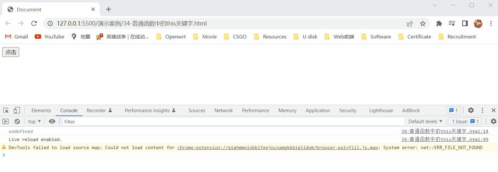

# 1.JavaScript垃圾回收机制

## 1.1什么是JavaScript垃圾回收机制

- 垃圾回收机制（Garbage Collection）简称：GC，在JavaScript中内存的分配和回收都是自动完成的，内存在不使用的时候会被垃圾回收器自动回收，正因为垃圾回收器的存在，所以许多人认为JavaScript不用太关心内存管理的问题，但是如果不了解JavaScript的内存管理机制，我们同样非常容易成内存泄漏（内存无法被回收）的情况。

  > 注：内存泄露就是程序中分配的内存由于某种原因程序未释放或无法释放就叫做内存泄漏，简单来说就是不再使用到的内存，没有及时释放，就叫做内存泄漏。

## 1.2内存的生命周期

- JavaScript环境中分配的内存，一般有以下生命周期：

  1. 内存分配：当我们声明变量、函数、对象的时候，系统会自动为他们分配内存。
  2. 内存使用：即读写内存，也就是使用变量、函数等。
  3. 内存回收：使用完毕，由垃圾回收器自动回收不再使用的内存。

  > 注1：全局变量一般不会回收，只有当关闭页面时，才会回收。
  >
  > 注2：一般情况下局部变量的值不再使用了，才会被自动回收掉。

## 1.3JavaScript垃圾回收机制的算法说明

- 堆栈空间分配的区别如下：

  - 栈（操作系统）：由操作系统自动分配释放函数的参数值、局部变量等，基本数据类型放到栈里面。
  - 堆（操作系统）：一般由程序员分配释放，若程序员不释放，就由垃圾回收机制回收，复杂数据类型放到堆里面。

- JavaScript垃圾回收机制有两种算法，如下所示：

  1. 引用计数法：

     - IE浏览器采用的是引用计数算法，也就是定义内存不再使用，简单来说就是看一个对象是否有指向它的引用，如果没有指向它的引用就回收该对象。

     - 引用计数算法的算法思路：

       1. 跟踪记录对象被引用的次数。
       2. 如果对象被引用了一次，那么就记录次数1，多次引用就会累加。
       3. 如果对象减少了一个引用就减1。
       4. 当对象的引用次数为0，则回收该对象，从而释放内存。

     - 引用计数法回收机制，如下图所示：

       

       

       

     - 注意点：引用计数法回收机制存在一个致命的问题，那就是嵌套引用，也就是如果两个对象相互引用，尽管它们都已不再使用了，但是垃圾回收器是不会将其进行回收的，这就会导致内存泄露，如下图所示：

       

       

  2. 标记清除法：

     - 现代的浏览器已经不再使用引用计数法了，现代浏览器通用的大多都是基于标记清除法的某些改进算法，它们的总体思路都是一致的，标记清除法将不再使用的对象定义为无法达到的对象。

     - 标记清除法的算法思路：从根部也就是从JavaScript的全局对象出发定时扫描内存中的对象，凡是能从根部到达的对象，都是还需要使用的对象，那些无法由根部出发触及到的对象会被标记为不再使用的对象，稍后将其进行回收。

     - 标记清除法回收机制，如下图所示：

       

     - 注意点：如果当两个对象相互引用时，并且它们都已经不再使用了，那么这两个对象就都不能从根部出发来找到这两个对象了，所以这两个对象都不会被打上√，所以稍后就会被标记清除法回收机制进行回收，所以标记清除法就解决了引用计数法中存在的问题。

# 2.函数进阶

## 2.1闭包

- 闭包就是一个函数对周围状态的引用捆绑在一起，内层函数中访问到其外层函数的作用，我们就叫做闭包，简单来说就是当内层函数使用外层函数中的变量时，就会形成闭包，所以可以理解成 `闭包 = 内层函数 + 外层函数的变量 `，如下图所示：

  

- 闭包的作用1：封闭数据，提供操作，使其外部也可以访问函数内部的变量。

- 语法1：

  ```javascript
  function fun() {
      let i = 10;
      function fn() {
          console.log(i);
      }
      return fn;
  }
  const fn = fun();
  fn();// 调用fn()得10，也就是外部可以使用函数内部的变量。
  ```

- 语法2：

  ```javascript
  // 语法2就是语法1的简约写法
  function fun() {
      let i = 10;
      return function fn() {
          console.log(i);
      }
  }
  const fn = fun();
  fn();// 调用fn()得10，也就是外部可以使用函数内部的变量。
  ```

- 闭包的作用2：实现数据的私有化，如：我们要做个统计函数调用次数，我们先声明一个变量，然后每当函数调用了一次，该变量就加1，但是如果该变量是全局变量，很容易就会被修改，此时我们可以使用闭包来实现数据的私有化。

- 语法：

  ``` javascript
  let count = 1;
  function fn() {
      count++;
      console.log(`函数被调用${count}次`);
  }
  fn();// 每调用一次fn函数count变量就会加1，所以就能统计出fn函数调用了多少次，但是因为count变量是全局变量会很容易被修改，导致fn函数调用的次数会不准确。
  ```

  ```javascript
  function fun() {
      let count = 1;
      function fn() {
      	count++;
          console.log(`函数被调用${count}次`);
      }
      return fn;
  }
  const fn = fun();
  fn();// 每调用一次fn函数count变量就会加1，所以就能统计出fn函数调用了多少次，又因为count变量是局部变量，所以count变量不容易被修改，所以fn函数调用的次数会准确，这就是使用闭包来实现数据的私有化。
  ```

- 注意点：闭包可能存在内存泄漏的问题，如以上代码，`fn` 函数执行完毕后，应该要回收掉局部作用域中的局部变量，但是我们根据标记清除法回收机制来回收时，会因为我们将 `fn` 函数存放到了全局变量 `fn` 中，全局变量要关闭页面后才能被回收，所以在页面没有关闭时，我们都可以从根部来找到全局变量 `fn`，然后通过全局变量 `fn` 来找到 `fn` 函数，然后因为 `fn` 函数要使用 `fun` 函数中的变量，所以可以找到 `fun` 函数中的变量，所以标记清除法回收机制来回收该变量时，会回收不了，因为该变量是能一直被找到的，但是当我们关闭页面时，会因为全局变量 `fn` 被回收了，这样就不能从根部来找到 `fun` 函数的变量了，所以 `fun` 函数的变量也会被回收。

- 演示代码：

  ```html
  <!DOCTYPE html>
  <html lang="en">
  <head>
      <meta charset="UTF-8">
      <meta http-equiv="X-UA-Compatible" content="IE=edge">
      <meta name="viewport" content="width=device-width, initial-scale=1.0">
      <title>Document</title>
  </head>
  <body>
      <script>
          function fun() {
              let count = 0;
              function fn() {
                  count++;
                  console.log(`函数被调用${count}次`);
              }
              return fn;
          }
          const fn = fun();
          fn();
          fn();
          fn();
          fn();
      </script>
  </body>
  </html>
  ```

- 演示结果：

  

## 2.2剩余参数

- 剩余参数是函数中的参数，它的作用和函数中的 `arguments` 对象基本相同，剩余参数允许我们将一个不定数量的实参表示为一个数组。

- 语法：

  ```javascript
  function 函数名(...剩余参数名) {
      console.log(剩余参数名);
  }
  函数名(实参1,实参2,···,实参n);
  ```

- 取值：

  |            | 取值                                                         |
  | :--------: | :----------------------------------------------------------- |
  |   函数名   | 用户自定义，要遵从变量名的命名规则与规范，并且由于函数一般是为了实现某个功能才定义的，所以我们通常会在函数名的前面加上动词，如：`getSum`。 |
  | 剩余参数名 | 用户自定义，要遵从变量名的命名规则与规范。                   |
  |    实参    | 用户自定义，可以是变量，字符串，布尔值，数组等               |

- 注意点：

  - 只有函数才有剩余参数。

  - `...` 是剩余参数的语法符号，它写在剩余参数名的前面，剩余参数是用于获取多余的实参的，如以下代码所示：

    ```javascript
    function fn(a,b...arr) {
        console.log(arr);// 剩余参数获取多余的实参3，4，5
    }
    fn(1,2,3,4,5);
    ```

  - 剩余参数是以数组的形式来存储多余的实参的。

  - 在声明函数时，如果函数名右边的括号中只写了剩余参数，那么该剩余参数可以获取传递给函数的所有实参。

  - 剩余参数和 `arguments` 对象的区别：

    - 剩余参数：用于获取多余的实参，并且以数组的形式来存储多余的实参。
    - `arguments` 对象：用于获取传递给函数的所有实参，并且以伪数组的形式来存储传递给函数的所有实参。

    > 注：因为剩余参数也可以获取传递给函数的所有实参，并且是以数组的形式来存储，所以以后推荐使用剩余参数。

- 演示代码：

  ```html
  <!DOCTYPE html>
  <html lang="en">
  <head>
      <meta charset="UTF-8">
      <meta http-equiv="X-UA-Compatible" content="IE=edge">
      <meta name="viewport" content="width=device-width, initial-scale=1.0">
      <title>Document</title>
  </head>
  <body>
      <script>
          function fn1(...arr) {
              console.log(arr);
          }
          fn1(1,2,3,4);
          function fn2(a,b,...arr) {
              console.log(arr);
          }
          fn2(1,2,3,4);
          function fn3(...arr) {
              console.log(arr);
              arr.push(5);
              console.log(arr);
              let sum = 0;
              arr.map(function(ele) {
                  sum += ele;
              });
              console.log(sum);
          }
          fn3(1,2,3,4);
      </script>
  </body>
  </html>
  ```

- 演示结果：

  

## 2.3展开运算符

- 展开运算符 `...` 是将一个数组进行展开。

- 语法：

  ```javascript
  ...要展开的数组名;
  ```

- 要展开的数组名的取值：用户自定义，要遵从变量名的命名规则与规范。

- 注意点：

  - 展开运算符 `...` 写在函数里面就是剩余参数，写在函数的外面就是展开运算符。
  - 展开运算符展开数组时，是不会修改原数组的，它会将展开的结果返回给展开运算符。
  - 将数组 `[1,2,3]`，使用展开运算符展开后，其展开的结果为 `1 2 3` 字符串，该 `1 2 3` 字符串还可以等价为 `1,2,3` 字符串。
  - 展开运算符的典型运用场景是求数组最大值或最小值、合并数组等。

- 演示代码：

  ```html
  <!DOCTYPE html>
  <html lang="en">
  <head>
      <meta charset="UTF-8">
      <meta http-equiv="X-UA-Compatible" content="IE=edge">
      <meta name="viewport" content="width=device-width, initial-scale=1.0">
      <title>Document</title>
  </head>
  <body>
      <script>
          const arr1 = [1,2,3,4,5];
          console.log(...arr1);
          console.log(Math.max(...arr1));
          console.log(Math.min(...arr1));
          const arr2 = [6,7,8,9,0];
          const arr3 = [...arr1,...arr2];
          console.log(arr3);
      </script>
  </body>
  </html>
  ```

- 演示结果：

  

## 2.4箭头函数

- 引入箭头函数的目的是为了能以更简短的函数写法来写出匿名函数，并且让该函数不绑定 `this` 关键字，因为箭头函数的语法比函数表达式写法更简洁，所以箭头函数更适用于那些本来需要匿名函数的地方。

- 语法：

  ```javascript
  // 函数表达式写法写出匿名函数
  const 匿名函数名 = function() {
      // 函数体
  }
  // 箭头函数写法写出匿名函数
  const 匿名函数名 = () => {
      // 函数体
  }
  ```

- 匿名函数名的取值：用户自定义，要遵从变量名的命名规则与规范。

- 注意点：

  - 使用箭头函数语法写出的匿名函数我们也称为箭头函数。

  - 箭头函数也有形参和实参，当箭头函数只有一个形参时，可以省略箭头函数中的小括号，如以下代码所示：

    ```javascript
    // 完整写法
    const fn = (x) => {
    	// 函数体
    }
    // 省略写法
    const fn = x => {
    	// 函数体
    }
    ```

  - 如果箭头函数中的函数体只有一行代码，那么可以省略箭头函数中的大括号，并且该行代码会作为返回值返回给箭头函数的调用者，如以下代码所示：

    ```javascript
    // 完整写法
    const fn = (x) => {
    	return x + x;
    }
    console.log(fn(1));// 会输出2
    // 省略写法
    const fn = x => x + x;
    console.log(fn(1));// 会输出2
    ```

  - 如果箭头函数想返回一个对象，那么该对象就要用小括号包裹起来，因为箭头函数的函数体是用大括号包裹起来的，而对象也是用大括号包裹起来的，所以如果不用小括号将对象包裹起来，那么将对象写入箭头函数的函数体中时，会有冲突，如以下代码所示：

    ```javascript
    // 完整写法
    const fn = name => {
    	return ({username: name});
    }
    console.log(fn('Noob'));// 会输出一个对象
    // 省略写法
    const fn = name => ({username: name});
    console.log(fn('Noob'));// 会输出一个对象
    ```

  - 箭头函数是没有 `arguments` 对象的，但是有剩余参数。

  - 在箭头函数出现之前，每个函数都是根据它是被如何调用的，来定义该函数的 `this` 关键字指向谁，但是箭头函数不会创建自己的 `this` 关键字，它只会沿用自己的作用域链的上一层的 `this` 关键字，如以下代码所示：

    ```javascript
    // 情况1
    function fun() {
        let i = 10;
        const fn = () => {
            console.log(this);// 因为箭头函数不会创建自己的this关键字，它只会沿用自己的作用域链的上一层的this关键字，也就是沿用fun函数的this关键字，又因为fun函数是被window对象调用的，所以fun函数的this关键字指向的是window对象，所以箭头函数中的this关键字也指向window对象
        }
        fn();
    }
    fun();
    // 情况2
    const obj = {
        name: '123',
        sayhey: function() {
            let i = 10;
        	const fn = () => {
            	console.log(this);// 因为箭头函数不会创建自己的this关键字，它只会沿用自己的作用域链的上一层的this关键字，也就是沿用上一层的匿名函数的this关键字，又因为上一层的匿名函数是被obj对象调用的，所以上一层的匿名函数的this关键字指向的是obj对象，所以箭头函数中的this关键字也指向obj对象
        	}
        	fn();
        }
    }
    obj.sayhey();
    ```

  - 在开发中使用箭头函数前需要考虑函数中 `this` 关键字会指向谁，在事件回调函数使用箭头函数时，`this` 关键字指向的是`window` 对象，因此DOM事件回调函数为了简便，还是不太推荐使用箭头函数。

- 演示代码：

  ```html
  <!DOCTYPE html>
  <html lang="en">
  <head>
      <meta charset="UTF-8">
      <meta http-equiv="X-UA-Compatible" content="IE=edge">
      <meta name="viewport" content="width=device-width, initial-scale=1.0">
      <title>Document</title>
  </head>
  <body>
      <script>
          const fn1 = x => {
              console.log(x);
          }
          fn1(1);
          const fn2 = x => x + x;
          console.log(fn2(1));
          const fn3 = name => ({username: name});
          console.log(fn3('Noob'));
          const fn4 = (...arr) => {
              console.log(arr);
          }
          fn4(1,2,3,4);
          function fun() {
              let i = 10;
              const fn = () => {
                  console.log(this);
              }
              fn();
          }
          fun();
          const obj = {
              name: '123',
              sayhey: function() {
                  let i = 10;
                  const fn = () => {
                      console.log(this);
                  }
                  fn();
              }
          }
          obj.sayhey();
      </script>
  </body>
  </html>
  ```

- 演示结果：

  

# 3.解构赋值

## 3.1数组解构

- 数组解构就是将数组的单元值快速批量赋值给一系列变量的简洁语法。

  > 注：数组的单元值其实就是数组的数组元素。

- 当我们要将数组的单元值批量赋值给一系列的变量时，就需要一个个取数组中的单元值然后将一个个数组中的单元值赋值给变量，如以下代码所示：

  ```javascript
  const arr = [100,60,80];
  let max = arr[0];
  let min = arr[1];
  let avg = arr[2];
  console.log(max);// 输出100
  console.log(min);// 输出60
  console.log(avg);// 输出80
  ```

- 以上代码可以将数组的单元值批量赋值给一系列的变量，但是语法繁琐，我们可以使用更简洁的方法那就是数组解构来将数组的单元值批量赋值给一系列的变量，如以下代码所示：

  ```javascript
  const arr = [100,60,80];
  const [max,min,avg] = arr;
  console.log(max);// 输出100
  console.log(min);// 输出60
  console.log(avg);// 输出80
  ```

  > 注：赋值运算符左侧的 `[]` 用于批量声明变量，然后赋值运算符会将右侧数组的单元值赋值给左侧的变量，左侧变量的顺序对应着右侧数组的单元值的位置，也就是说赋值运算符会将右侧数组的第一个单元值赋值给左侧变量的第一个变量，将右侧数组的第二个单元值赋值给左侧变量的第二个变量，以此类推一直到赋值完毕。

- 数组解构的典型应用就是将两个变量进行交换，如以下代码所示：

  ```javascript
  let a = 1;
  let b = 2;
  [b,a] = [a,b];
  console.log(a);// 输出2
  console.log(b);// 输出1
  ```

- 注意点：

  - 数组解构中的变量是属于全局变量所以在解构时要注意解构中的变量的变量名是否和外面的变量的变量名相同，如果相同就会报错。

  - 如果数组解构是以数组开头的，并且数组解构的前面有语句时，数组解构的前面的语句要用分号进行结尾，不然会报错，如以下代码所示：

    ```javascript
    let a = 1;
    let b = 2;
    [b,a] = [a,b];
    console.log(a);// 输出2
    console.log(b);// 输出1
    ```

    > 注：如果数组结构的前面的语句不加分号，那么代码在运行时就会相当于以下代码：
    >
    > ```javascript
    > let a = 1;
    > let b = 2[b,a] = [a,b];
    > console.log(a);
    > console.log(b);
    > ```
    >
    > 从上面代码可以看出如果运行该代码，会发生报错，这也就是为什么如果数组解构是以数组开头的，并且数组解构的前面有语句时，数组解构的前面的语句要用分号进行结尾，不然会报错。

  - 当解构数组时，如果左侧的变量比右侧的数组的单元值多时，多出的变量会被赋默认值，如以下代码所示：

    ```javascript
    const [a,b,c,d] = [1,2,3];
    console.log(a);// 输出1
    console.log(b);// 输出2
    console.log(c);// 输出3
    console.log(d);// 输出undefined
    ```

  - 当解构数组时，如果左侧的变量比右侧的数组的单元值少时，多出的数组的单元值不会参与赋值，如以下代码所示：

    ```javascript
    const [a,b,c] = [1,2,3,4];
    console.log(a);// 输出1
    console.log(b);// 输出2
    console.log(c);// 输出3
    ```

  - 我们可以利用剩余参数来解决当解构数组时，左侧的变量比右侧的数组的单元值少的情况，如以下代码所示：

    ```javascript
    const [a,b,c,...arr] = [1,2,3,4,5,6];
    console.log(a);// 输出1
    console.log(b);// 输出2
    console.log(c);// 输出3
    console.log(arr);// 输出[4,5,6]
    ```

  - 当解构数组时，为了防止左侧的变量会被赋 `undefined` 值，我们可以给左侧的变量赋初始值，只有当左侧的变量被赋 `undefined` 值时，该变量才会被赋初始值，如以下代码所示：

    ```javascript
    const [a = 0,b = 0] = [1];
    console.log(a);// 输出1
    console.log(b);// 输出0
    ```

  - 当解构数组时，我们可以按需将右侧的数组的单元值，赋值给左侧的变量，将不需要的右侧的数组的单元值忽略掉，如以下代码所示：

    ```javascript
    const [a,b,,c] = [1,2,3,4];
    console.log(a);// 输出1
    console.log(b);// 输出2
    console.log(c);// 输出4
    ```

  - 解构数组还可以解构多维数组，如以下代码所示：

    ```javascript
    const [a,b,c[d,e]] = [1,2,[3,4]];
    console.log(a);// 输出1
    console.log(b);// 输出2
    console.log(c);// 输出[3,4]
    console.log(d);// 输出3
    console.log(e);// 输出4
    ```

    > 注：因为数组中可以存放任意的值，所以可以在数组中存放数组，这种数组我们称为多维数组，如果数组a中存放着一个数组b，那么数组a就是二维数组，如果数组a中存放着一个数组b，数组b中还存放着一个数组c，那么数组a就是三维数组，剩下的以此类推，如以下代码所示：
    >
    > ```javascript
    > const arr = [1,2,[3,4]];// 二维数组
    > console.log(arr[0]);// 输出1
    > console.log(arr[1]);// 输出2
    > console.log(arr[2]);// 输出[3,4]
    > console.log(arr[2][0]);// 输出3
    > ```

- 演示代码：

  ```html
  <!DOCTYPE html>
  <html lang="en">
  <head>
      <meta charset="UTF-8">
      <meta http-equiv="X-UA-Compatible" content="IE=edge">
      <meta name="viewport" content="width=device-width, initial-scale=1.0">
      <title>Document</title>
  </head>
  <body>
      <script>
          const arr = ['苏宁','京东','美团'];
          const [sn,jd,mt] = arr;
          console.log(sn);
          console.log(jd);
          console.log(mt);
      </script>
  </body>
  </html>
  ```

- 演示结果：

  

## 3.2对象解构

- 对象解构就是将对象的属性和方法快速批量赋值给一系列的变量的简洁语法。

- 当我们要将对象的属性和方法快速批量赋值给一系列的变量时，就需要一个个取对象中的属性和方法然后将一个个对象中的属性和方法赋值给变量，如以下代码所示：

  ```javascript
  const obj = {
      name: '张三',
      sayhey: function() {
          console.log('嗨嗨');
      }
  }
  let name = obj.name;
  let sayhey = obj.sayhey;
  console.log(name);// 输出张三
  console.log(sayhey);// 输出匿名函数
  ```

- 以上代码可以将对象的属性和方法快速批量赋值给一系列的变量，但是语法繁琐，我们可以使用更简洁的方法那就是对象解构来将对象的属性和方法快速批量赋值给一系列的变量，如以下代码所示：

  ```javascript
  const obj = {
      name: '张三',
      sayhey: function() {
          console.log('嗨嗨');
      }
  }
  const {name,sayhey} = obj;
  console.log(name);// 输出张三
  console.log(sayhey);// 输出匿名函数
  ```

  > 注：赋值运算符左侧的 `{}` 用于批量声明变量，然后赋值运算符会将右侧对象中的属性的属性值赋值给左侧和属性名相同的变量，也就是说如果要将右侧对象中的属性的属性值赋值给左侧的变量，那么左侧的变量的变量名要和该属性值的属性名相同，才能将该属性值赋值给左侧的变量。

- 注意点：

  - 对象解构中的变量是属于全局变量所以在解构时，要注意解构中的变量的变量名是否和外面的变量的变量名相同，如果相同就会报错。

  - 当对象解构时，如果在右侧的对象中找不到和左侧的变量的变量名相同的属性时，左侧的变量会被赋默认值，如以下代码所示：

    ```javascript
    const obj = {
        name: '张三',
        sayhey: function() {
            console.log('嗨嗨');
        }
    }
    const {name1,sayhey1} = obj;
    console.log(name1);// 输出undefined
    console.log(sayhey1);// 输出undefined
    ```

  - 当对象解构时，如果解构中的变量的变量名在外面也有相同的变量名时，会发生报错，可是我们要将右侧的对象中的属性的属性值赋值给左侧的变量时，左侧的变量的变量名就要和该属性值的属性名相同，所以这就变成了死循环，但是我们可以通过修改解构中的变量的变量名，来解决这个问题，如以下代码所示：

    ```javascript
    const obj = {
        name: '张三',
        sayhey: function() {
            console.log('嗨嗨');
        }
    }
    const {name: username,sayhey} = obj;
    console.log(username);// 输出张三
    console.log(sayhey);// 输出匿名函数
    ```

    > 注：`const {name: username,sayhey} = obj;` 就相当于将右侧的对象中的属性的属性值赋值给左侧的变量时，同时修改该变量的变量名，冒号表示将冒号左边的值赋值给冒号右边的变量。

  - 数组对象解构，如以下代码所示：

    ```javascript
    const arr = [
        {
            name: '佩奇',
            age: 6
        },
        {
            name: '乔治',
            age: 8
        }
    ];
    const [{name,age},{name: name1,age: age1}] = arr;
    console.log(name);// 输出佩奇
    console.log(age);// 输出6
    console.log(name1);// 输出乔治
    console.log(age1);// 输出8
    ```

  - 多级对象解构，如以下代码所示：

    ```javascript
    const obj = {
        data: [
            {name: '佩奇',age: 6},
            {name: '乔治',age: 8},
        ]
    }
    const {data} = arr;
    console.log(data);// 输出数组对象
    const [{name,age},{name: name1,age: age1}] = data;
    console.log(name);// 输出佩奇
    console.log(age);// 输出6
    console.log(name1);// 输出乔治
    console.log(age1);// 输出8
    ```

- 演示代码：

  ```html
  <!DOCTYPE html>
  <html lang="en">
  <head>
      <meta charset="UTF-8">
      <meta http-equiv="X-UA-Compatible" content="IE=edge">
      <meta name="viewport" content="width=device-width, initial-scale=1.0">
      <title>Document</title>
  </head>
  <body>
      <script>
          const msg = {
              "code": 200,
              "msg": "获取新闻列表成功",
              "data": [
                  {
                      "id": 1,
                      "title": "5G商用自己，三大运用商收入下降",
                      "count": 58
                  },
                  {
                      "id": 2,
                      "title": "国际媒体头条速览",
                      "count": 56
                  },
                  {
                      "id": 3,
                      "title": "乌克兰和俄罗斯持续冲突",
                      "count": 1669
                  }
              ]
          }
          const {data} = msg;
          console.log(data);
          function render1({data}) {
              console.log(data);
          }
          render1(msg);
          function render2({data: mydata}) {
              console.log(mydata);
          }
          render2(msg);
      </script>
  </body>
  </html>
  ```

- 演示结果：

  

# 4.数组的 `forEach()` 方法

- JavaScript使用数组的 `forEach()` 方法来遍历数组，并将数组中的数组元素传递给回调函数。

- 语法：

  ```javascript
  被遍历的数组的数组名.forEach(function(ele,index) {
     // 数据处理
  });
  ```

- 被遍历的数组的数组名的取值：用户自定义，要遵从变量名的命名规则与规范。

- 注意点：

  - `被遍历的数组的数组名.forEach(function(ele,index) {// 数据处理})` 方法中的函数中的两个形参分别得到的是数组中的数据和数组中的数据的索引号，这两个形参的形参名是可以用户自定义的，只要是第一个形参就表示得到数组中的数据，第二形参就表示得到数组中的数据的索引号。

  - 数组的 `forEach()` 方法和数组的 `map()` 方法的区别：
    - 数组的 `forEach()` 方法：遍历数组。
    - 数组的 `map()` 方法：遍历数组的同时，会将处理好的数据返回到新的数组中。

- 演示代码：

  ```html
  <!DOCTYPE html>
  <html lang="en">
  <head>
      <meta charset="UTF-8">
      <meta http-equiv="X-UA-Compatible" content="IE=edge">
      <meta name="viewport" content="width=device-width, initial-scale=1.0">
      <title>Document</title>
  </head>
  <body>
      <script>
          const arr = ['张三','王五','李四'];
          arr.forEach((ele,index) => {
              console.log(ele);
              console.log(index);
          });
      </script>
  </body>
  </html>
  ```

- 演示结果：

  

# 5.渲染商品列表案例

- 将商品列表渲染出来。
- 渲染商品列表案例的实现步骤：
  1. 利用数组的 `forEach()` 方法遍历数据里面的数据。
  2. 拿到数据，利用字符串拼接生成结构添加到页面中。

- 演示代码：

  ```html
  <!DOCTYPE html>
  <html lang="en">
  <head>
      <meta charset="UTF-8">
      <meta http-equiv="X-UA-Compatible" content="IE=edge">
      <meta name="viewport" content="width=device-width, initial-scale=1.0">
      <title>渲染商品列表案例</title>
      <style>
          * {
              padding: 0;
              margin: 0;
          }
          .box {
              width: 1200px;
              height: 600px;
              margin: 100px auto;
          }
          .smallbox {
              float: left;
              width: 300px;
              height: 300px;
              background-color: yellow;
          }
      </style>
  </head>
  <body>
      <div class="box"></div>
      <script>
          const msg = {
              "code": 200,
              "msg": "获取新闻列表成功",
              "data": [
                  {
                      "id": 1,
                      "title": "抽油烟机",
                      "money": 499
                  },
                  {
                      "id": 2,
                      "title": "漫画",
                      "money": 56
                  },
                  {
                      "id": 3,
                      "title": "伏特加",
                      "money": 1669
                  },
                  {
                      "id": 4,
                      "title": "键盘",
                      "money": 1214
                  },
                  {
                      "id": 5,
                      "title": "鼠标",
                      "money": 132
                  },
                  {
                      "id": 6,
                      "title": "手机",
                      "money": 124
                  },
                  {
                      "id": 7,
                      "title": "盒子",
                      "money": 4214
                  },
                  {
                      "id": 8,
                      "title": "鞋子",
                      "money": 23
                  }
              ]
          }
          const {data} = msg;
          let str = '';
          // 利用数组的forEach()方法遍历数据里面的数据。
          data.forEach(ele => {
              const {title,money} = ele;
              // 拿到数据，利用字符串拼接生成结构添加到页面中。
              str += `
              <div class="smallbox">
              <p>${title}</p>
              <p>${money}</p>
              </div>
              `;
          });
          document.querySelector('.box').innerHTML = str;
      </script>
  </body>
  </html>
  ```

- 演示结果：

  

# 6.商品列表价格筛选案例

- 点击不同价格区间筛选不同的商品。

- 商品列表价格筛选案例的实现步骤：

  1. 初始化需要渲染的页面，同时因为点击不同的需求，还会重新渲染不同的页面，所以渲染页面要做成一个函数。

  2. 采取事件委托方式来将区间盒子都添加上点击事件。

  3. 利用数组的 `filter()` 方法来筛选出符合条件的数据，因为生成的是一个数组，所以只需要传递给渲染函数即可。

     > 注：我们可以使用数组的 `filter()` 方法来筛选数组中的数组元素：
     >
     > - 语法：
     >
     >   ```javascript
     >   被筛选的数组的数组名.filter(function(ele,index) {
     >      return 筛选条件;
     >   });
     >   ```
     >
     > - 取值：
     >
     >   |                      | 取值                                     |
     >   | :------------------: | ---------------------------------------- |
     >   | 被筛选的数组的数组名 | 用户自定义，要遵从变量名的命名规则与规范 |
     >   |       筛选条件       | 用户自定义                               |
     >
     > - 数组的 `filter()` 方法的执行流程，首先它会遍历数组中的数据，然后每拿到该数组中的数据时，就会进行判断，如果该数据符合筛选条件就将其放到一个新数组中，如果不符合就不放到新数组中，以此类推一直到数组遍历完成后，就会将新数组返回给数组的 `filter()` 方法。
     >
     > - 注意点：
     >
     >   - `被筛选的数组的数组名.filter(function(ele,index) {return 筛选条件;})` 方法中的函数中的两个形参分别得到的是数组中的数据和数组中的数据的索引号，这两个形参的形参名是可以用户自定义的，只要是第一个形参就表示得到数组中的数据，第二形参就表示得到数组中的数据的索引号。
     >   - 使用数组的 `filter()` 方法来筛选数组时，会返回一个新数组给数组的 `filter()` 方法，该新数组中包含了符合筛选条件的所有数组元素，如果没有符合筛选条件的数组元素，那么就会返回一个空数组给数组的 `filter()` 方法，因为返回的是一个新数组，所以不会影响到原来的数组。
     >
     > - 演示代码：
     >
     >   ```html
     >   <!DOCTYPE html>
     >   <html lang="en">
     >   <head>
     >       <meta charset="UTF-8">
     >       <meta http-equiv="X-UA-Compatible" content="IE=edge">
     >       <meta name="viewport" content="width=device-width, initial-scale=1.0">
     >       <title>Document</title>
     >   </head>
     >   <body>
     >       <script>
     >           const arr = [1,2,3,4,5,6,7,8];
     >           const newArr = arr.filter((ele,index) => {
     >               console.log(ele);
     >               console.log(index);
     >               return ele > 4;
     >           });
     >           console.log(newArr);
     >       </script>
     >   </body>
     >   </html>
     >   ```
     >
     > - 演示结果：
     >
     >   

  4. 筛选条件是根据点击的盒子的自定义属性来判断的。

  5. 可以使用对象解构，把事件对象解构。

  6. 因为全部区间不需要筛选，所以直接把所有数据渲染即可。

- 演示代码：

  ```html
  <!DOCTYPE html>
  <html lang="en">
  <head>
      <meta charset="UTF-8">
      <meta http-equiv="X-UA-Compatible" content="IE=edge">
      <meta name="viewport" content="width=device-width, initial-scale=1.0">
      <title>商品列表价格筛选案例</title>
      <style>
          * {
              padding: 0;
              margin: 0;
          }
          .box {
              width: 1200px;
              height: 600px;
              margin: 100px auto;
          }
          .smallbox {
              float: left;
              width: 300px;
              height: 300px;
              background-color: yellow;
          }
          .sx {
              position: absolute;
              top: 40px;
              left: 100px;
              width: 1200px;
              height: 50px;
          }
          .smallsx {
              float: left;
              width: 285px;
              height: 50px;
              background-color: pink;
              margin-right: 10px;
          }
      </style>
  </head>
  <body>
      <div class="sx">
          <div class="smallsx" data-id="1">0~100</div>
          <div class="smallsx" data-id="2">100~200</div>
          <div class="smallsx" data-id="3">200~300</div>
          <div class="smallsx">全部区间</div>
      </div>
      <div class="box"></div>
      <script>
          const msg = {
              "code": 200,
              "msg": "获取新闻列表成功",
              "data": [
                  {
                      "id": 1,
                      "title": "抽油烟机",
                      "money": 499
                  },
                  {
                      "id": 2,
                      "title": "漫画",
                      "money": 56
                  },
                  {
                      "id": 3,
                      "title": "伏特加",
                      "money": 1669
                  },
                  {
                      "id": 4,
                      "title": "键盘",
                      "money": 1214
                  },
                  {
                      "id": 5,
                      "title": "鼠标",
                      "money": 132
                  },
                  {
                      "id": 6,
                      "title": "手机",
                      "money": 124
                  },
                  {
                      "id": 7,
                      "title": "盒子",
                      "money": 4214
                  },
                  {
                      "id": 8,
                      "title": "鞋子",
                      "money": 23
                  }
              ]
          }
          const {data} = msg;
          // 初始化需要渲染的页面，同时因为点击不同的需求，还会重新渲染不同的页面，所以渲染页面要做成一个函数。
          function render(data) {
              let str = '';
              data.forEach(ele => {
                  const {title,money} = ele;
                  str += `
                  <div class="smallbox">
                  <p>${title}</p>
                  <p>${money}</p>
                  </div>
                  `;
              });
              document.querySelector('.box').innerHTML = str;
          }
          render(data);
          // 采取事件委托方式来将区间盒子都添加上点击事件。
          document.querySelector('.sx').addEventListener('click',e => {
              // 可以使用对象解构，把事件对象解构。
              const {tagName,dataset} = e.target;
              if (tagName === 'DIV') {
                  // 因为全部区间不需要筛选，所以直接把所有数据渲染即可。
                  let arr = data;
                  // 利用数组的filter()方法来筛选出符合条件的数据，因为生成的是一个数组，所以只需要传递给渲染函数即可。
                  // 筛选条件是根据点击的盒子的自定义属性来判断的。
                  if (dataset.id === '1') {
                      arr = data.filter(ele => ele.money > 0 && ele.money <= 100);
                  } else if (dataset.id === '2') {
                      arr = data.filter(ele => ele.money > 100 && ele.money <= 200);
                  } else if (dataset.id === '3') {
                      arr = data.filter(ele => ele.money > 200 && ele.money <= 300);
                  }
                  render(arr);
              }
          });
      </script>
  </body>
  </html>
  ```

- 演示结果：

  

# 7.深入对象

## 7.1实例成员

- 在构造函数中需要声明出来对象才能调用的属性和方法我们就称为实例成员，所以通过构造函数声明的对象我们称为实例对象，该对象中的属性和方法称为实例成员，该对象中的属性我们也称为实例属性，该对象中的方法我们也称为实例方法，

- 注意点：实例对象虽然是同一个构造函数声明出来的，但是实例对象之间互不影响。

- 演示代码：

  ```html
  <!DOCTYPE html>
  <html lang="en">
  <head>
      <meta charset="UTF-8">
      <meta http-equiv="X-UA-Compatible" content="IE=edge">
      <meta name="viewport" content="width=device-width, initial-scale=1.0">
      <title>Document</title>
  </head>
  <body>
      <script>
          function Obj(name) {
              this.uname = name;// 实例成员
          }
          const pq = new Obj('佩奇');
          const qz = new Obj('乔治');
          pq.age = 8;
          pq.sayHi = () => {
              console.log(11);
          }
          console.log(pq);
          console.log(qz);
      </script>
  </body>
  </html>
  ```

- 演示结果：

  

## 7.2静态成员

- 在构造函数中不需要声明出来对象就能调用的属性和方法我们就称为静态成员，所以构造函数中不需要声明出来对象就能调用的属性和方法我们就称为静态成员，其中不需要声明出来对象就能调用的属性我们也称为静态属性，不需要声明出来对象就能调用的方法我们也称为静态方法。

- 注意点：

  - 静态成员只能通过构造函数来访问，如：`Math.PI`。
  - 静态方法中的 `this` 关键字指向构造函数。

- 演示代码：

  ```html
  <!DOCTYPE html>
  <html lang="en">
  <head>
      <meta charset="UTF-8">
      <meta http-equiv="X-UA-Compatible" content="IE=edge">
      <meta name="viewport" content="width=device-width, initial-scale=1.0">
      <title>Document</title>
  </head>
  <body>
      <script>
          function Obj(name) {
              this.uname = name;// 实例成员
          }
          Obj.age = 6;// 静态成员
          Obj.sayHi = function() {// 静态成员
              console.log(11);
              console.log(this.age);
          }
          console.log(Obj.age);
          Obj.sayHi();
      </script>
  </body>
  </html>
  ```

- 演示结果：

  

# 8.内置构造函数

## 8.1 `Object` 内置构造函数

- `Object` 是JavaScript内置的构造函数，我们可以使用 `Object` 构造函数来声明一个普通的对象，如：`new Object()`，但是我们更推荐使用对象的字面量来声明一个普通的对象。

- 因为 `Object` 是JavaScript内置的构造函数，所以它有一些静态方法可以供我们使用，`Object` 常用的静态方法有：

  - `Object.keys()` 方法用于获取对象中所有属性的属性名：

    - 语法：

      ```javascript
      Object.keys(要被获取所有属性的属性名的对象);
      ```

    - 要被获取所有属性的属性名的对象的取值为：要被获取的对象的对象名。

    - 注意点：

      - `Object` 构造函数中的静态方法，只能通过 `Object` 构造函数来访问。
      - 因为 `Object.keys(要被获取所有属性的属性名的对象)` 方法是用于获取对象中所有属性的属性名的，所以它会返回一个数组，该数组中存放着对象中所有属性的属性名。

    - 演示代码：

      ```html
      <!DOCTYPE html>
      <html lang="en">
      <head>
          <meta charset="UTF-8">
          <meta http-equiv="X-UA-Compatible" content="IE=edge">
          <meta name="viewport" content="width=device-width, initial-scale=1.0">
          <title>Document</title>
      </head>
      <body>
          <script>
              const obj = {
                  uname: '张三',
                  age: 18
              }
              console.log(Object.keys(obj));
          </script>
      </body>
      </html>
      ```

    - 演示结果：

      

  - `Object.values()` 方法用于获取对象中所有属性的属性值：

    - 语法：

      ```javascript
      Object.values(要被获取所有属性的属性值的对象);
      ```

    - 要被获取所有属性的属性值的对象的取值为：要被获取的对象的对象名。

    - 注意点：

      - `Object` 构造函数中的静态方法，只能通过 `Object` 构造函数来访问。
      - 因为 `Object.values(要被获取所有属性的属性值的对象)` 方法是用于获取对象中所有属性的属性值的，所以它会返回一个数组，该数组中存放着对象中所有属性的属性值。

    - 演示代码：

      ```html
      <!DOCTYPE html>
      <html lang="en">
      <head>
          <meta charset="UTF-8">
          <meta http-equiv="X-UA-Compatible" content="IE=edge">
          <meta name="viewport" content="width=device-width, initial-scale=1.0">
          <title>Document</title>
      </head>
      <body>
          <script>
              const obj = {
                  uname: '张三',
                  age: 18
              }
              console.log(Object.values(obj));
          </script>
      </body>
      </html>
      ```

    - 演示结果：

      

  - `Object.assign()` 方法用于对象的拷贝：

    - 语法：

      ```javascript
      Object.assign(将被拷贝的对象拷贝给那个对象,被拷贝的对象);
      ```

    - 取值：

      |                              | 取值                 |
      | ---------------------------- | -------------------- |
      | 将被拷贝的对象拷贝给那个对象 | 那个对象的对象名     |
      | 被拷贝的对象                 | 被拷贝的对象的对象名 |

    - 注意点：

      - `Object` 构造函数中的静态方法，只能通过 `Object` 构造函数来访问。

      - `Object.assign(将被拷贝的对象拷贝给那个对象,被拷贝的对象)` 方法会将被拷贝的对象中的所有属性和方法拷贝到要将被拷贝的对象拷贝到那个对象中，

      - `Object.assign(将被拷贝的对象拷贝给那个对象,被拷贝的对象)` 方法经常使用的场景是给对象添加属性，如以下代码所示：

        ```javascript
        const obj = {
            name: '张三',
        }
        Object.assign(obj,{age: 8});
        console.log(obj.name);// 输出张三
        console.log(obj.age);// 输出8
        ```

    - 演示代码：

      ```html
      <!DOCTYPE html>
      <html lang="en">
      <head>
          <meta charset="UTF-8">
          <meta http-equiv="X-UA-Compatible" content="IE=edge">
          <meta name="viewport" content="width=device-width, initial-scale=1.0">
          <title>Document</title>
      </head>
      <body>
          <script>
              const obj1 = {
                  uname: '张三',
              }
              const obj2 = {}
              Object.assign(obj2,obj1);
              console.log(obj2);
              const obj3 = {}
              Object.assign(obj3,{age: 10});
              console.log(obj3);
          </script>
      </body>
      </html>
      ```

    - 演示结果：

      

## 8.2 `Array` 内置构造函数

- `Array` 是JavaScript内置的构造函数，我们可以使用 `Array` 构造函数来声明一个普通的数组，如：`new Array()`，但是我们更推荐使用数组的字面量来声明一个普通的数组。

- 因为 `Array` 是JavaScript内置的构造函数，所以它有一些实例方法可以供我们使用，但是因为是实例方法所以我们要先声明一个数组，然后才能使用 `Array` 构造函数中的实例方法，`Array` 常用的实例方法有：

  - `foEach()` 方法用于遍历数组。

  - `filter()` 方法用于筛选数组。

  - `map()` 方法用于迭代数组。

  - `reduce()` 方法用于累加数组中的数组元素：

    - 语法：

      ```javascript
      const arr = [1,2,3];
      arr.reduce(function(prev,ele) {
          return prev + ele;
      },初始值);
      ```

    - 初始值的取值：用户自定义，只能是数字。

    - `reduce()` 方法的执行流程：如果 `reduce()` 方法中没有初始值，那么 `reduce()` 方法中的函数中的 `prev` 形参中的值就会为数组中的第一个数组元素，`ele` 形参中的值就会为数组中的第二个数组元素，然后就会执行函数体，然后就会将结果返回给 `prev` 形参，然后 `ele` 形参中的值就会为数组中的第三个数组元素，然后又会执行函数体，然后又会将结果返回给 `prev` 形参，以此类推一直到没有数组中的数组元素可以赋值给 `ele` 形参，就会将 `prev` 形参中的值返回给 `reduce()` 方法，如果 `reduce()` 方法中有初始值，那么 `reduce()` 方法中的函数中的 `prev` 形参中的值就会为 `reduce()` 方法中有初始值，`ele` 形参中的值就会为数组中的第一个数组元素，然后就会执行函数体，然后就会将结果返回给 `prev` 形参，然后 `ele` 形参中的值就会为数组中的第二个数组元素，然后又会执行函数体，然后又会将结果返回给 `prev` 形参，以此类推一直到没有数组中的数组元素可以赋值给 `ele` 形参，就会将 `prev` 形参中的值返回给 `reduce()` 方法。

    - 注意点：

      - `reduce(function(prev,ele) {return prev + ele;},初始值))` 方法中的函数中的两个形参分别得到的是上一次的值和当前值，这两个形参的形参名是可以用户自定义的，只要是第一个形参就表示得到上一次的值，第二形参就表示得到当前值。
      - 如果是数组是数组对象，那么当使用 `reduce()` 方法时，要设置 `reduce()` 方法中的初始值为0，因为如果不设置初始值为0的话就会两个对象进行相加，这样是相加不出来的。

    - 演示代码：

      ```html
      <!DOCTYPE html>
      <html lang="en">
      <head>
          <meta charset="UTF-8">
          <meta http-equiv="X-UA-Compatible" content="IE=edge">
          <meta name="viewport" content="width=device-width, initial-scale=1.0">
          <title>Document</title>
      </head>
      <body>
          <script>
              const arr1 = [1,2,3];
              const num1 = arr1.reduce(function(prev,ele) {
                  return prev + ele;
              });
              console.log(num1);
              const num2 = arr1.reduce(function(prev,ele) {
                  return prev + ele;
              },10);
              console.log(num2);
              const arr2 = [
                  {money: 10000},
                  {money: 10000},
                  {money: 10000}
              ];
              const num3 = arr2.reduce((prev,ele) => prev + ele.money,0);
              console.log(num3);
          </script>
      </body>
      </html>
      ```

    - 演示结果：

      

  - `join()` 方法用于将数组转换为字符串。

  - `find()` 方法用于查找数组中的数组元素：

    - 语法：

      ```javascript
      const arr = [1,2,3];
      arr.find(function(ele,index) {
          return 查找条件;
      });
      ```

    - 查找条件的取值：用户自定义。

    - `find()` 方法的执行流程，首先它会遍历数组中的数据，然后每拿到该数组中的数据时，就会进行判断，如果该数据符合查找条件就将该数据返回给 `find()` 方法，如果遍历完数组都没找到符合查找条件的数据，那么就返回 `undefined`。

    - 注意点：

      - `find(function(ele,index) {return 查找条件;})` 方法中的函数中的两个形参分别得到的是数组中的数据和数组中的数据的索引号，这两个形参的形参名是可以用户自定义的，只要是第一个形参就表示得到数组中的数据，第二形参就表示得到数组中的数据的索引号。
      - `find()` 方法只会返回第一个满足条件的数据，如果后面还有满足条件的数据都不会返回。

    - 演示代码：

      ```html
      <!DOCTYPE html>
      <html lang="en">
      <head>
          <meta charset="UTF-8">
          <meta http-equiv="X-UA-Compatible" content="IE=edge">
          <meta name="viewport" content="width=device-width, initial-scale=1.0">
          <title>Document</title>
      </head>
      <body>
          <script>
              const arr1 = [1,2,3];
              const num1 = arr1.find(function(ele) {
                  return ele === 2;
              });
              console.log(num1);
              const arr2 = [
                  {name: '张三'},
                  {name: '李四'},
                  {name: '王五'}
              ]
              const num2 = arr2.find(ele => ele.name === '李四');
              console.log(num2);
          </script>
      </body>
      </html>
      ```

    - 演示结果：

      

  - `every()` 方法用于检测数组中的所有数组元素是否都符合指定的条件：

    - 语法：

      ```javascript
      const arr = [1,2,3];
      arr.every(function(ele,index) {
          return 指定条件;
      });
      ```

    - 指定条件的取值：用户自定义。

    - `every()` 方法的执行流程，首先它会遍历数组中的数据，然后每拿到该数组中的数据时，就会进行判断，如果数组中的所有数据都符合指定条件就返回 `true` 给 `every()` 方法，如果数组中有一个数据不符合指定条件，那么就会返回 `false` 给 `every()` 方法。

    - 注意点：`every(function(ele,index) {return 指定条件;})` 方法中的函数中的两个形参分别得到的是数组中的数据和数组中的数据的索引号，这两个形参的形参名是可以用户自定义的，只要是第一个形参就表示得到数组中的数据，第二形参就表示得到数组中的数据的索引号。

    - 演示代码：

      ```html
      <!DOCTYPE html>
      <html lang="en">
      <head>
          <meta charset="UTF-8">
          <meta http-equiv="X-UA-Compatible" content="IE=edge">
          <meta name="viewport" content="width=device-width, initial-scale=1.0">
          <title>Document</title>
      </head>
      <body>
          <script>
              const arr1 = [1,2,3];
              const num1 = arr1.every(function(ele) {
                  return ele > 0;
              });
              console.log(num1);
              const num2 = arr1.every(ele => ele > 1);
              console.log(num2);
          </script>
      </body>
      </html>
      ```

    - 演示结果：

      

  - `some()` 方法用于检测数组中的某些数组元素是否符合指定的条件。
  - `concat()` 方法用于合并两个数组。
  - `sort()` 方法用于数组中的数组元素的排序。
  - `splice()` 方法用于删除数组中的数组元素。
  - `reverse()` 方法用于翻转数组。
  - `findIndex()` 方法用于查找数组中的数组元素的索引号。

- 因为 `Array` 是JavaScript内置的构造函数，所以它有一些静态方法可以供我们使用，`Array` 常用的静态方法有：

  - `Array.from()` 方法用于将伪数组转换为真数组：

    - 语法：

      ```javascript
      Array.from(要转换为真数组的伪数组);
      ```

    - 要转换为真数组的伪数组的取值为：伪数组的数组名。

    - 注意点：

      - `Array` 构造函数中的静态方法，只能通过 `Array` 构造函数来访问。
      - 使用 `Array.from(要转换为真数组的伪数组)` 方法将伪数组转换为真数组时，会将真数组返回给 `Array.from(要转换为真数组的伪数组)` 方法。

    - 演示代码：

      ```html
      <!DOCTYPE html>
      <html lang="en">
      <head>
          <meta charset="UTF-8">
          <meta http-equiv="X-UA-Compatible" content="IE=edge">
          <meta name="viewport" content="width=device-width, initial-scale=1.0">
          <title>Document</title>
      </head>
      <body>
          <ul>
              <li>1</li>
              <li>2</li>
              <li>3</li>
          </ul>
          <script>
              const li = document.querySelectorAll('li');
              const newArr = Array.from(li);
              newArr.pop()
              console.log(newArr);
          </script>
      </body>
      </html>
      ```

    - 演示结果：

      

## 8.3尺寸案例

- 将对象 `{size: '40*40',color: 'red'}` 转换成 `40*40/red`。

- 尺寸案例的实现步骤：获取对象中所有属性的属性值，然后用/分割数组将其转换为字符串。

- 演示代码：

  ```html
  <!DOCTYPE html>
  <html lang="en">
  <head>
      <meta charset="UTF-8">
      <meta http-equiv="X-UA-Compatible" content="IE=edge">
      <meta name="viewport" content="width=device-width, initial-scale=1.0">
      <title>尺寸案例</title>
  </head>
  <body>
      <script>
          const obj = {
              size: '40*40',
              color: 'red'
          }
          // 获取对象中所有属性的属性值，然后用/分割数组将其转换为字符串。
          console.log(Object.values(obj).join('/'));
      </script>
  </body>
  </html>
  ```

- 演示结果：

  

## 8.4 `String` 内置构造函数

- `String` 是JavaScript内置的构造函数，我们可以使用 `String` 构造函数来声明一个普通的字符串，如：`new String()`，但是我们更推荐使用单引号来声明一个普通的字符串。

- 因为 `String` 是JavaScript内置的构造函数，所以它有一些实例方法可以供我们使用，但是因为是实例方法所以我们要先声明一个字符串，然后才能使用 `String` 构造函数中的实例方法，`String` 常用的实例属性和实例方法有：

  - `length` 属性用来获取字符串的长度。

  - `split()` 方法用于将字符串转换为数组。

  - `substring()` 方法用于字符串截取：

    - 语法：

      ```javascript
      const str = 'Noob Captain';
      str.substring(从字符串中的第几个字符开始截取,到字符串中的第几个字符结束截取);
      ```

    - 取值：

      |                                | 取值                       |
      | :----------------------------: | -------------------------- |
      | 从字符串中的第几个字符开始截取 | 第几个字符在字符串中的下标 |
      |  到字符串中的那个字符结束截取  | 第几个字符在字符串中的下标 |

    - 注意点：

      - `str.substring(从字符串中的第几个字符开始截取,到字符串中的第几个字符结束截取)` 方法中的到字符串中的第几个字符结束截取可以不写，如果不写那么就是从字符串中的第几个字符开始截取，一直截取到字符串的最后一个字符。
      - 使用 `str.substring(从字符串中的第几个字符开始截取,到字符串中的第几个字符结束截取)` 方法来截取字符串中的字符时，不会截取到，到字符串中的第几个字符结束截取的字符。
      - 使用 `str.substring(从字符串中的第几个字符开始截取,到字符串中的第几个字符结束截取)` 方法来截取字符串中的字符时，会将截取的字符串返回给 `str.substring(从字符串中的第几个字符开始截取,到字符串中的第几个字符结束截取)` 方法。
      - 如果 `str.substring(从字符串中的第几个字符开始截取,到字符串中的第几个字符结束截取)` 方法中的从字符串中的第几个字符开始截取和到字符串中的第几个字符结束截取的取值一样那么就会返回一个空字符串给 `str.substring(从字符串中的第几个字符开始截取,到字符串中的第几个字符结束截取)` 方法。

    - 演示代码：

      ```html
      <!DOCTYPE html>
      <html lang="en">
      <head>
          <meta charset="UTF-8">
          <meta http-equiv="X-UA-Compatible" content="IE=edge">
          <meta name="viewport" content="width=device-width, initial-scale=1.0">
          <title>Document</title>
      </head>
      <body>
          <script>
              const str = 'NoobCaptain';
              console.log(str.substring(0,10));
              console.log(str.substring(0));
              console.log(str.substring(0,0));
          </script>
      </body>
      </html>
      ```

    - 演示结果：

      

  - `startsWith()` 方法用于检测字符串是否以某字符开头：

    - 语法：

      ```javascript
      const str = 'Noob Captain';
      str.substring('开头字符',从字符串中的第几个字符开始检测);
      ```

    - 取值：

      |                                | 取值                                  |
      | :----------------------------: | ------------------------------------- |
      |            开头字符            | 用户自定义，只能是字符串              |
      | 从字符串中的第几个字符开始检测 | 第几个字符在字符串中的下标，默认值为0 |

    - 注意点：

      - `startsWith('开头字符',从字符串中的第几个字符开始检测)` 方法中的从第几个字符开始检测可写可不写，如果不写就默认为0，也就是从字符串的第一个字符开始检测。
      - 使用 `startsWith('开头字符',从字符串中的第几个字符开始检测)` 方法来检测字符串是否以某字符开头时，如果字符串是以 `startsWith('开头字符',从字符串中的第几个字符开始检测)` 方法中的开头字符来开头的那么就返回 `true` 给 `startsWith('开头字符',从字符串中的第几个字符开始检测)` 方法，否则就返回 `false` 给 `startsWith('开头字符',从字符串中的第几个字符开始检测)` 方法。
      - 使用 `startsWith('开头字符',从字符串中的第几个字符开始检测)` 方法来检测字符串是否以某字符开头时，会严格区分大小写。

    - 演示代码：

      ```html
      <!DOCTYPE html>
      <html lang="en">
      <head>
          <meta charset="UTF-8">
          <meta http-equiv="X-UA-Compatible" content="IE=edge">
          <meta name="viewport" content="width=device-width, initial-scale=1.0">
          <title>Document</title>
      </head>
      <body>
          <script>
              const str = 'NoobCaptain';
              console.log(str.startsWith('No'));
              console.log(str.startsWith('no'));
              console.log(str.startsWith('No',1));
              console.log(str.startsWith('oo',1));
          </script>
      </body>
      </html>
      ```

    - 演示结果：

      

  - `includes()` 方法用于检测某字符是否包含在字符串中：

    - 语法：

      ```javascript
      const str = 'Noob Captain';
      str.includes('某字符',从字符串中的第几个字符开始检测);
      ```

    - 取值：

      |                                | 取值                                  |
      | :----------------------------: | ------------------------------------- |
      |             某字符             | 用户自定义，只能是字符串              |
      | 从字符串中的第几个字符开始检测 | 第几个字符在字符串中的下标，默认值为0 |

    - 注意点：

      - `includes('某字符',从字符串中的第几个字符开始检测)` 方法中的从第几个字符开始检测可写可不写，如果不写就默认为0，也就是从字符串的第一个字符开始检测。
      - 使用 `includes('某字符',从字符串中的第几个字符开始检测)` 方法来检测某字符是否包含在字符串中时，如果字符串中包含 `includes('某字符',从字符串中的第几个字符开始检测)` 方法中的某字符，就返回 `true` 给 `includes('某字符',从字符串中的第几个字符开始检测)` 方法，否则就返回 `false` 给 `includes('某字符',从字符串中的第几个字符开始检测)` 方法。
      - 使用 `includes('某字符',从字符串中的第几个字符开始检测)` 方法来检测某字符是否包含在字符串中时，会严格区分大小写。

    - 演示代码：

      ```html
      <!DOCTYPE html>
      <html lang="en">
      <head>
          <meta charset="UTF-8">
          <meta http-equiv="X-UA-Compatible" content="IE=edge">
          <meta name="viewport" content="width=device-width, initial-scale=1.0">
          <title>Document</title>
      </head>
      <body>
          <script>
              const str = 'NoobCaptain';
              console.log(str.includes('oo'));
              console.log(str.includes('ca'));
              console.log(str.includes('No',1));
              console.log(str.includes('oo',1));
          </script>
      </body>
      </html>
      ```

    - 演示结果：

      

  - `toUpperCase()` 方法用于将英文字符转换成大写。

  - `toLowerCase()` 方法用于将英文字符转换成小写。

  - `indexOf()` 方法用于检测是否包含某字符。

  - `endsWith()` 方法用于检测是否以某字符结尾。

  - `replace()` 方法用于替换字符串中字符。

  - `match()` 方法用于查找字符串中的字符。

## 8.5渲染赠品案例

- 将字符串 `50g茶叶,清洗球` 转换成 `【赠品】50g茶叶`、`【赠品】清洗球`，然后将其渲染到页面中。

- 渲染赠品案例的实现步骤：

  1. 把字符串拆分为数组，这样两个赠品就拆分开了。
  2. 利用数组的 `map()` 方法遍历数组，同时把数组元素生成到 `<span>` 标签里面。
  3. 因为数组的 `map()` 方法返回的是数组，所以需要将其转换为字符串。
  4. `<p>` 标签的 `innerHTML` 存放刚才的返回值。

- 演示代码：

  ```html
  <!DOCTYPE html>
  <html lang="en">
  <head>
      <meta charset="UTF-8">
      <meta http-equiv="X-UA-Compatible" content="IE=edge">
      <meta name="viewport" content="width=device-width, initial-scale=1.0">
      <title>渲染赠品案例</title>
  </head>
  <body>
      <p></p>
      <script>
          const gift = '50g茶叶,清洗球';
          // 把字符串拆分为数组，这样两个赠品就拆分开了。
          const arr = gift.split(',');
          // 利用数组的map()方法遍历数组，同时把数组元素生成到<span>标签里面。
          const newArr = arr.map(ele => `<span>【赠品】${ele}</span><br>`);
          // 因为数组的map()方法返回的是数组，所以需要将其转换为字符串。
          const str = newArr.join('');
          // <p>标签的innerHTML存放刚才的返回值。
          document.querySelector('p').innerHTML = str;
          // 以上代码可以简写成以下代码
          document.querySelector('p').innerHTML = gift.split(',').map(ele => `<span>【赠品】${ele}</span><br>`).join('');
      </script>
  </body>
  </html>
  ```

- 演示结果：

  

## 8.6 `Number` 内置构造函数

- `Number` 是JavaScript内置的构造函数，我们可以使用 `Number` 构造函数来声明一个普通的数值，如：`new Number()`，但是我们更推荐直接使用数字来声明一个普通的数值。

- 因为 `Number` 是JavaScript内置的构造函数，所以它有一些实例方法可以供我们使用，但是因为是实例方法所以我们要先声明一个数值，然后才能使用 `Number` 构造函数中的实例方法，`Number` 常用的实例方法有：

  - `toFixed()` 方法用于设置保留数值小数点后几位数字：

    - 语法：

      ```javascript
      const num = 123.245;
      num.toFixed(保留数值小数点后几位数字);
      ```

    - 保留数值小数点后几位数字的取值：用户自定义，只能是数字，默认值为0。

    - 注意点：

      - `toFixed(保留数值小数点后几位数字)` 方法中的保留数值小数点后几位数字可写可不写，如果不写就保留数值小数点后0位数字。
      - 使用 `toFixed(保留数值小数点后几位数字)` 方法来设置保留数值小数点后几位数字时，会进行四舍五入的计算。
      - 使用 `toFixed(保留数值小数点后几位数字)` 方法来设置保留数值小数点后几位数字时，如果数值是整数，也会显示设置的保留数值小数点后几位的数字，只不过该数字都是0。

    - 演示代码：

      ```html
      <!DOCTYPE html>
      <html lang="en">
      <head>
          <meta charset="UTF-8">
          <meta http-equiv="X-UA-Compatible" content="IE=edge">
          <meta name="viewport" content="width=device-width, initial-scale=1.0">
          <title>Document</title>
      </head>
      <body>
          <script>
              const num1 = 1.12345;
              console.log(num1.toFixed());
              console.log(num1.toFixed(3));
              console.log(num1.toFixed(4));
              const num2 = 1;
              console.log(num2.toFixed(3));
          </script>
      </body>
      </html>
      ```

    - 演示结果：

      

## 8.7购物车展示案例

- 根据后台提供的数据，渲染购物车页面。

- 购物车展示案例的实现步骤：

  1. 使用数组的 `map()` 方法遍历后台传来的数组对象。
  2. 解构后台传来的数组对象中的对象。
  3. 获取后台传来的数组对象中的对象的 `spec` 属性中的属性值，并将其转换为字符串。
  4. 判断后台传来的数组对象中的对象中是否有 `gift` 属性如果没有就返回一个空字符串，如果有就返回字符串。
  5. 计算后台传来的数组对象中的对象的 `price` 属性和 `count` 属性的积，因为 `price` 属性可能是浮点数，所以计算会有误差，所以要将其转换为整数来进行运算，然后为了计算的正确性，还需要将结果变回浮点数。
  6. 将处理好的数据返回给数组的 `map()` 方法，然后因为返回的是数组，要将其转换为字符串，然后添加进类名为 `list` 的盒子中。
  7. 将后台传来的数组对象中的对象的价格和数量进行累加然后返回给类名为 `amount` 盒子中。

- 演示代码：

  ```html
  <!DOCTYPE html>
  <html lang="en">
    <head>
      <meta charset="UTF-8" />
      <meta http-equiv="X-UA-Compatible" content="IE=edge" />
      <meta name="viewport" content="width=device-width, initial-scale=1.0" />
      <title>购物车展示案例</title>
      <style>
        * {
          margin: 0;
          padding: 0;
          box-sizing: border-box;
        }
        .list {
          width: 990px;
          margin: 100px auto 0;
        }
        .item {
          padding: 15px;
          transition: all 0.5s;
          display: flex;
          border-top: 1px solid #e4e4e4;
        }
        .item:nth-child(4n) {
          margin-left: 0;
        }
        .item:hover {
          cursor: pointer;
          background-color: #f5f5f5;
        }
        .item img {
          width: 80px;
          height: 80px;
          margin-right: 10px;
        }
        .item .name {
          font-size: 18px;
          margin-right: 10px;
          color: #333;
          flex: 2;
        }
        .item .name .tag {
          display: block;
          padding: 2px;
          font-size: 12px;
          color: #999;
        }
        .item .price,
        .item .sub-total {
          font-size: 18px;
          color: firebrick;
          flex: 1;
        }
        .item .price::before,
        .item .sub-total::before,
        .amount::before {
          content: "¥";
          font-size: 12px;
        }
        .item .spec {
          flex: 2;
          color: #888;
          font-size: 14px;
        }
        .item .count {
          flex: 1;
          color: #aaa;
        }
        .total {
          width: 990px;
          margin: 0 auto;
          display: flex;
          justify-content: flex-end;
          border-top: 1px solid #e4e4e4;
          padding: 20px;
        }
        .total .amount {
          font-size: 18px;
          color: firebrick;
          font-weight: bold;
          margin-right: 50px;
        }
      </style>
    </head>
  
    <body>
      <div class="list"></div>
      <div class="total">
        <div>合计：<span class="amount"></span></div>
      </div>
      <script>
        const goodsList = [
          {
            id: "4001172",
            name: "称心如意手摇咖啡磨豆机咖啡豆研磨机",
            price: 289.9,
            picture: "./images/1.jpg",
            count: 2,
            spec: { color: "白色" },
          },
          {
            id: "4001009",
            name: "竹制干泡茶盘正方形沥水茶台品茶盘",
            price: 109.8,
            picture: "./images/2.png",
            count: 3,
            spec: { size: "40cm*40cm", color: "黑色" },
          },
          {
            id: "4001874",
            name: "古法温酒汝瓷酒具套装白酒杯莲花温酒器",
            price: 488,
            picture: "./images/3.png",
            count: 1,
            spec: { color: "青色", sum: "一大四小" },
          },
          {
            id: "4001649",
            name: "大师监制龙泉青瓷茶叶罐",
            price: 139,
            picture: "./images/4.png",
            count: 1,
            spec: { size: "小号", color: "紫色" },
            gift: "50g茶叶,清洗球",
          },
        ];
        // 使用数组的map()方法遍历后台传来的数组对象。
        document.querySelector('.list').innerHTML = goodsList.map(ele => {
          // 解构后台传来的数组对象中的对象。
          const {name,price,picture,count,spec,gift} = ele;
          // 获取后台传来的数组对象中的对象的spec属性中的属性值，并将其转换为字符串。
          const newSpec = Object.values(spec).join('/');
          // 判断后台传来的数组对象中的对象中是否有gift属性如果没有就返回一个空字符串，如果有就返回字符串。
          const newGift = gift ? gift.split(',').map(ele => `<span class="tag">【赠品】${ele}</span>`).join('') : '';
          // 计算后台传来的数组对象中的对象的price属性和count属性的积，因为price属性可能是浮点数，所以计算会有误差，所以要将其转换为整数来进行运算，然后为了计算的正确性，还需要将结果变回浮点数。
          const subTotal = ((price * 100 * count) / 100).toFixed(2);
          // 将处理好的数据返回给数组的map方法，然后因为返回的是数组，要将其转换为字符串，然后添加进类名为list的盒子中。
          return `
              <div class="item">
                  
                  <p class="name">${name}${newGift}</p>
                  <p class="spec">${newSpec}</p>
                  <p class="price">${price}</p>
                  <p class="count">x${count}</p>
                  <p class="sub-total">${subTotal}</p>
              </div>
          `
        }).join('');
        // 将后台传来的数组对象中的对象的价格和数量进行累加然后返回给类名为amount盒子中。
        const total = goodsList.reduce((prev,ele) => prev + (ele.price * 100 * ele.count) / 100,0);
        document.querySelector('.amount').innerHTML = total.toFixed(2);
      </script>
    </body>
  </html>
  ```

- 演示结果：

  

# 9.编程思想

## 9.1面向过程编程

- 面向过程编程就是分析出解决问题所需要的步骤，然后用函数把这些步骤一步一步实现，使用的时候再一个一个的依次调用就可以了，简单来说就是面向过程编程是按照我们分析好了的步骤，来一步步的解决问题，如：我要点击按钮就弹出对话框，我们就需要先获取按钮的点击事件，然后点击了按钮就要显示对话框，然后我们就需要一步步的写代码让对话框显示出来。

## 9.2面向对象编程

- 面向对象编程就是把事务分解成为一个个对象，然后由对象之间分工与合作，如：我要点击按钮就弹出对话框，我们就需要先获取按钮的点击事件，然后点击了按钮就调用某个对象，让对话框显示出来，这样我们就不需要一步步的写代码让对话框显示出来了。
- 面向对象编程简单来说就是以对象的功能来划分问题的，而不是步骤，如：我要点击按钮就弹出对话框，我们就需要先获取按钮的点击事件，然后点击了按钮就调用某个对象，让对话框显示出来，该对象的功能就是实现让对话框显示出来，所以我们只需要调用该对象即可。
- 在面向对象程序开发思想中，每一个对象都是功能中心，具有明确的分工。
- 面向对象编程具有灵活、代码可复用、容易维护和开发的优点，所以更适合多人合作的大型软件项目。
- 面向对象编程的特性：
  - 封装性：无需了解对象是怎么运作的，只需要了解怎么使用对象即可。
  - 继承性：一个对象可以继承某个对象，然后在该对象的基础上再添加某些功能。
  - 多态性：一个对象可以有多种不同的功能。
- 面向过程编程和面向对象编程的区别：
  - 面向过程编程：
    - 优点：性能比面向对象编程高，适合跟硬件联系很紧密的东西，如：单片机就采用的是面向过程编程。
    - 缺点：不像面向对象编程那样易维护、易复用、易扩展。
  - 面向对象编程：
    - 优点：易维护、易复用、易扩展，由于面向对象编程有封装性、继承性、多态性的特性，所以可以设计出低耦合的系统，使 系统更加灵活、更加易于维护。
    - 缺点：性能比面向过程编程低。
- 在编程中都是离不开面向过程编程和面向对象编程的，只是在编程时可以选择不同的编程思想，在前端开发中面向过程编程比较多。

# 10.构造函数

- 封装是面向对象编程思想中比较重要的一部分，在JavaScript中面向对象编程可以通过构造函数来实现面向对象编程中的封装。

- 注意点：

  - 因为构造函数中的 `this` 关键字指向的是 `new` 关键字声明的空对象，所以利用构造函数声明多个对象时，构造函数中的 `this` 关键字会指向不同 `new` 关键字声明的空对象，所以利用构造函数声明多个对象时，这些对象是彼此独立的，它们之间互不影响。

  - 利用构造函数声明多个对象时，存在内存浪费的问题，因为如果构造函数中有不变的属性和方法时，当我们利用构造函数声明多个对象后，就会在内存中存放多个一样的属性和方法，就会造成内存浪费，如下图所示：

    

# 11.原型对象

## 11.1什么是原型对象

- 在JavaScript中规定了每一个构造函数都有一个 `prototype` 属性，该属性指向另一个对象，我们也就称该对象为原型对象。
- 原型对象的作用：解决构造函数内存浪费的问题，我们可以将构造函数中不变的属性和方法挂载到构造函数的原型对象中，然后我们利用构造函数声明多个对象时，这些对象就都可以共享挂载到构造函数的原型对象中的属性和方法，这样这些对象就不会多次创建相同的属性和方法了，这样就不会造成内存浪费，因为构造函数通过原型对象分配的属性和方法是所有对象所共享的。

- 注意点：构造函数中的 `this` 关键字和构造函数的原型对象中的方法中的 `this` 关键字指向的都是 `new` 关键字声明的空对象。

- 演示代码：

  ```html
  <!DOCTYPE html>
  <html lang="en">
  <head>
      <meta charset="UTF-8">
      <meta http-equiv="X-UA-Compatible" content="IE=edge">
      <meta name="viewport" content="width=device-width, initial-scale=1.0">
      <title>Document</title>
  </head>
  <body>
      <script>
          let tath1,tath2;
          function Star(uname,age) {
              tath1 = this,
              this.uname = uname,
              this.age = age
          }
          Star.prototype.sing = function() {
              tath2 = this;
              console.log('唱歌');
          }
          const ldh = new Star('刘德华',33);
          const zxy = new Star('张学友',42);
          console.log(ldh);
          console.log(zxy);
          console.log(ldh.uname);
          console.log(ldh.age);
          ldh.sing();
          console.log(zxy.uname);
          console.log(zxy.age);
          zxy.sing();
          console.log(tath1 === zxy);
          console.log(tath2 === zxy);
          console.log(tath1 === tath2);
      </script>
  </body>
  </html>
  ```

- 演示结果：

  

## 11.2给数组扩展方法案例

- 给数组扩展求最大值方法和求和方法。
- 给数组扩展方法案例的实现步骤：
  1. 给 `Array` 构造函数挂载最大值方法。
  2. 给 `Array` 构造函数挂载求和方法。

- 演示代码：

  ```html
  <!DOCTYPE html>
  <html lang="en">
  <head>
      <meta charset="UTF-8">
      <meta http-equiv="X-UA-Compatible" content="IE=edge">
      <meta name="viewport" content="width=device-width, initial-scale=1.0">
      <title>给数组扩展方法案例</title>
  </head>
  <body>
      <script>
          // 给Array构造函数挂载最大值方法。
          Array.prototype.max = function() {
              return Math.max(...this);
          };
          Array.prototype.sum = function() {
              return this.reduce((prev,ele) => prev + ele,0);
          }
          const arr = [2,3,1,4,4];
          console.log(arr.max());
          console.log(arr.sum());
      </script>
  </body>
  </html>
  ```

- 演示结果：

  

## 11.3原型对象的 `constructor` 属性

- 每个构造函数的原型对象中都有个 `constructor` 属性，该属性的作用是指向该原型对象的构造函数，这样才能让该原型对象和构造函数进行绑定，这样才知道该原型对象是那个构造函数中的，如：下图所示：

  > 注：英文 `constructor` 的中文意思就是构造函数。

  

- 构造函数的原型对象中的 `constructor` 属性的使用场景：如果要给构造函数的原型对象赋值多个方法或属性，我们一个个添加会很麻烦，所以我们可以给该构造函数的原型对象，采取赋值对象的方式，来将多个方法或属性一次性赋值给该构造函数的原型对象，但是会因为采取的是赋值对象的方式，这样该构造函数的原型对象原来的内容就会被覆盖掉，这就导致了该构造函数的原型对象中的 `constructor` 属性不再指向当前构造函数了，这样就导致该原型对象没有和当前构造函数进行绑定，当我们利用当前构造函数声明对象时，该对象中不会有当前构造函数的原型对象中的属性和方法，但是我们可以在修改后的原型对象中添加一个 `constructor` 属性，让该属性指向当前构造函数，来解决修改后的原型对象中的 `constructor` 属性不再指向当前构造函数的问题。

- 演示代码：

  ```html
  <!DOCTYPE html>
  <html lang="en">
  <head>
      <meta charset="UTF-8">
      <meta http-equiv="X-UA-Compatible" content="IE=edge">
      <meta name="viewport" content="width=device-width, initial-scale=1.0">
      <title>Document</title>
  </head>
  <body>
      <script>
          function Star() {}
          Star.prototype = {
              constructor: Star,
              sing: function() {
                  console.log('唱歌');
              },
              sayHi: function() {
                  console.log('你好');
              }
          }
          new Star().sing();
          new Star().sayHi();
      </script>
  </body>
  </html>
  ```

- 演示结果：

  

## 11.4对象原型

- 利用构造函数声明的对象中都会有一个 `__proto__` 属性，该属性指向该构造函数的原型对象，所以这就是为什么利用该构造函数声明的对象可以使用该构造函数的原型对象中的属性和方法，所以我们也称 `__proto__` 属性为对象原型，如下图所示：

  

- 注意点：

  - 因为 `__proto__` 属性在JavaScript中是非标准属性，所以我们在输出利用构造函数声明的对象时，该对象中的 `__proto__` 属性会用 `[[Prototype]]` 来表示，所以该对象中的 `[[Prototype]]` 和 `__proto__` 属性的意义相同，如下图所示：

    

  - 利用构造函数声明的对象中都会有一个 `__proto__` 属性，该属性的作用就是表明当前实例对象会指向那个构造函数的原型对象。

  - 利用构造函数声明的对象中都会有一个 `__proto__` 属性，该属性中也有一个 `constructor` 属性，该属性指向声明该实例对象的构造函数，如下图所示：

    

  - 利用构造函数声明的对象中都会有一个 `__proto__` 属性，该属性是只读的不可修改的。

## 11.5原型继承

- 继承是面向对象编程的另一个特征，通过继承我们可以进一步提升代码封装的程度，在JavaScript中大多是通过构造函数的原型对象来实现继承的特性。

- 当两个构造函数中，如果有相同的不变的属性和方法时，我们可以将这些相同的不变的属性和方法抽取出来，将其封装到一个公共对象中，然后我们可以让这两个构造函数继承公共对象中的属性和方法，这样就不需要在这两个构造函数中写上相同的属性和方法了，又因为公共的对象中封装的是不变的属性和方法，所以要将其继承到构造函数的原型对象中，所以就是要将公共对象赋值给构造函数的原型对象，这样该构造函数的原型对象就会继承公共对象中的属性和方法，这样我们在利用该构造函数来声明对象时，这些对象中都会有公共对象中的属性和方法，但是要注意因为要将公共对象赋值给构造函数的原型对象，所以该构造函数的原型对象原来的内容会被覆盖掉，所以我们将公共对象赋值给该构造函数的原型对象后，还要往该构造函数的原型对象追加 `constructor` 属性，让其指向当前构造函数。

- 注意点：当我们让两个构造函数的原型对象都继承公共对象中的属性和方法时，会因为对象的存储特性，导致我们修改其中一个构造函数的原型对象时，另一个构造函数的原型对象也会被修改，如下图所示：

  

  > 注：我们可以将两个构造函数中，相同的不变的属性和方法，封装到公共构造函数中，然后当这两个构造函数要继承公共构造函数中的属性和方法时，只需要利用公共构造函数声明两个对象，然后将这两个对象分别赋值给这两个构造函数的原型对象即可，这样就可以解决上面的问题，因为利用构造函数声明的对象，这些对象是彼此独立的，它们之间互不影响。

- 演示代码：

  ```html
  <!DOCTYPE html>
  <html lang="en">
  <head>
      <meta charset="UTF-8">
      <meta http-equiv="X-UA-Compatible" content="IE=edge">
      <meta name="viewport" content="width=device-width, initial-scale=1.0">
      <title>Document</title>
  </head>
  <body>
      <script>
          function Gg() {
              this.name = '张三'
          }
          function Man() {}
          Man.prototype = new Gg();
          Man.prototype.constructor = Man;
          function Woman() {}
          Woman.prototype = new Gg();
          Woman.prototype.constructor = Woman;
          Woman.prototype.gn = () => console.log('宝贝');
          console.log(new Man());
          console.log(new Woman());
      </script>
  </body>
  </html>
  ```

- 演示结果：

  

## 11.6原型链

- 基于原型对象的继承使得不同构造函数的原型对象关联在一起，并且这种关联的关系是一种链状的结构，所以我们将原型对象的链状结构关系称为原型链，如下图所示：

  

  > 注：因为除了实例对象外，所有的对象都有一个 `__proto__` 属性，所以上图中的 `ldh` 实例对象中的 `__proto__` 属性指向 `Star` 构造函数的原型对象，而 `Star` 构造函数的原型对象中也有个 `__proto__` 属性，该属性指向 `Object` 内置构造函数的原型对象，因为 `Object` 内置构造函数是最大的对象构造函数，而 `Object` 内置构造函数的原型对象中也有个 `__proto__` 属性，但是会因为 `Object` 内置构造函数是最大的对象构造函数，所以`Object` 内置构造函数的原型对象中的 `__proto__` 属性指向的是 `null`。

- 注意点：

  - 原型链就是一种查找规则，当访问一个对象的属性或方法时，首先要查找该对象中有没有该属性或方法，如果没有就会查找该对象的 `__proto__` 属性所指向的原型对象中有没有该属性或方法，如果还没有就查找该原型对象中 `__proto__` 属性所指向的原型对象中有没有该属性或方法，以此类推一直查找到 `Object` 内置构造函数的原型对象中为止。

  - 因为数字，字符串，数组等本质上都是利用各自的内置构造函数来声明的对象，所以数字，字符串，数组等都会因为原型链的原因，使得可以使用各自内置构造函数的原型对象中的属性或方法。

  - `__proto__` 对象原型的意义就在于为对象成员查找机制提供一个方向，或者说一条路线。

  - 我们可以使用 `instanceof` 运算符来检测构造函数的原型对象是否出现在某个实例对象的原型链上。

    - 语法：

      ```javascript
      对象名 instanceof 构造函数名
      ```

    - 取值：

      |            | 取值                                     |
      | :--------: | ---------------------------------------- |
      |   对象名   | 用户自定义，要遵从变量名的命名规则与规范 |
      | 构造函数名 | 用户自定义，要遵从变量名的命名规则与规范 |

    - `instanceof` 运算符的执行流程：它会判断它左边的对象是否是利用右边的构造函数来声明的对象，如果是的话就返回 `true` 给 `instanceof` 运算符，否则返回 `false` 给 `instanceof` 运算符，如果 `instanceof` 运算符返回的是 `true` 就证明左边的对象是利用右边的构造函数来声明的对象，所以就能判断出右边的构造函数的原型对象在左边对象的原型链上。

- 演示代码：

  ```html
  <!DOCTYPE html>
  <html lang="en">
  <head>
      <meta charset="UTF-8">
      <meta http-equiv="X-UA-Compatible" content="IE=edge">
      <meta name="viewport" content="width=device-width, initial-scale=1.0">
      <title>Document</title>
  </head>
  <body>
      <script>
          function Gg() {
              this.name = '张三'
          }
          Gg.prototype.age = 15;
          console.log(new Gg());
          console.log(Gg.prototype);
          console.log(Object.prototype);
          console.log(new Gg() instanceof Gg);
          console.log(new Gg() instanceof Object);
      </script>
  </body>
  </html>
  ```

- 演示结果：

  

## 11.7消息提示对象封装

- 练习面向对象写插件。

- 消息提示对象封装的实现步骤：

  1. 定义模态框 `Modal` 构造函数，用来创建对象。
     1. 创建 `<div>` 标签。
     2. 给创建的 `<div>` 标签添加 `modal` 类名。
     3. 往创建的 `<div>` 标签中添加内容。
  2. 模态框具备打开功能 `open()` 方法。
     1. 判断页面中是否有模态框了，如果有就删除模态框，然后再添加模态框。
     2. 只要调用了 `open()` 方法就往页面中添加模态框。
     3. 给模态框中的x添加点击事件，当点击了x就删除模态框。
  3. 模态框具备关闭功能 `close()` 方法。
     1. 只要调用了 `close()` 方法就删除模态框。

- 演示代码：

  ```html
  <!DOCTYPE html>
  <html lang="en">
  <head>
      <meta charset="UTF-8">
      <meta http-equiv="X-UA-Compatible" content="IE=edge">
      <meta name="viewport" content="width=device-width, initial-scale=1.0">
      <title>消息提示对象封装案例</title>
      <style>
          .modal {
            width: 300px;
            min-height: 100px;
            box-shadow: 0 0 10px rgba(0, 0, 0, 0.2);
            border-radius: 4px;
            position: fixed;
            z-index: 999;
            left: 50%;
            top: 50%;
            transform: translate3d(-50%, -50%, 0);
            background-color: #fff;
          }
          .modal .header {
            line-height: 40px;
            padding: 0 10px;
            position: relative;
            font-size: 20px;
          }
          .modal .header i {
            font-style: normal;
            color: #999;
            position: absolute;
            right: 15px;
            top: -2px;
            cursor: pointer;
          }
          .modal .body {
            text-align: center;
            padding: 10px;
          }
          .modal .footer {
            display: flex;
            justify-content: flex-end;
            padding: 10px;
          }
          .modal .footer a {
            padding: 3px 8px;
            background: #ccc;
            text-decoration: none;
            color: #fff;
            border-radius: 2px;
            margin-right: 10px;
            font-size: 14px;
          }
          .modal .footer a.submit {
            background-color: #369;
          }
        </style>
  </head>
  <body>
      <button id="delete">删除</button>
      <button id="login">登录</button>
      <script>
          // 定义模态框Modal构造函数，用来创建对象。
          function Modal(title = '',message = '') {
              // 创建<div>标签。
              this.modalbox = document.createElement('div');
              // 给创建的<div>标签添加modal类名。
              this.modalbox.className = 'modal';
              // 往创建的<div>标签中添加内容。
              this.modalbox.innerHTML = `
                  <div class="header">${title} <i>x</i></div>
                  <div class="body">${message}</div>
              `;
          }
          // 模态框具备打开功能open()方法。
          Modal.prototype.open = function() {
              // 判断页面中是否有模态框了，如果有就删除模态框，然后再添加模态框。
              const box = document.querySelector('.modal');
              box && document.body.removeChild(this.modalbox);
              // 只要调用了open()方法就往页面中添加模态框。
              document.body.appendChild(this.modalbox);
              // 给模态框中的x添加点击事件，当点击了x就删除模态框。
              this.modalbox.querySelector('i').addEventListener('click',() => {
                  this.close();
              })
          }
          // 模态框具备关闭功能close()方法。
          Modal.prototype.close = function() {
              // 只要调用了close()方法就删除模态框。
              document.body.removeChild(this.modalbox);
          }
          document.querySelector('#delete').addEventListener('click',() => {
              const modal = new Modal('温馨提示','您没有权限删除');
              modal.open();
          });
          document.querySelector('#login').addEventListener('click',() => {
              const modal = new Modal('友情提示', '您还么有注册账号');
              modal.open();
          });
      </script>
  </body>
  </html>
  ```

- 演示结果：

  

# 12.深浅拷贝

## 12.1浅拷贝

- 当我们将一个对象拷贝到另一个对象时，如果采取直接赋值的方式，那么只是将被拷贝的对象在堆里的地址赋值给了另一个对象，这就导致这两个对象都会指向同一个对象，从而如果修改其中一个对象时，另一个对象也会被修改，所以我们可以使用浅拷贝的方法来拷贝对象，从而解决这个问题，浅拷贝的方法有通过 `Object.assgin()` 方法来实现浅拷贝和通过展开运算符来实现浅拷贝，浅拷贝只针对复杂数据类型，它只会拷贝地址。

- 语法：

  ```javascript
  const obj1 = {
      age: 10
  }
  // 采取Object.assgin()方法拷贝对象
  Object.assgin('obj2','obj1');
  // 采取展开运算符拷贝对象
  const obj3 = {...obj1}
  ```

- 注意点：

  - 浅拷贝对象时，如果被拷贝的对象中是简单数据类型，那么就是拷贝值，如果被拷贝的对象中有复杂数据类型，那么就拷贝该复杂数据类型在堆中的地址，简单来说就是如果被拷贝的对象是单层对象，那么在浅拷贝时，拷贝的都是值，此时修改对象是没问题的，如果被拷贝的对象是多层对象，那么在浅拷贝时，被拷贝的对象中的简单数据类型，拷贝的是值，被拷贝的对象中的复杂数类型，拷贝的是该复杂数据类型在堆中的地址，所以当我们修改该复杂数据类型时，另一个对象中的复杂数据类型也会被修改。
  - 因为数组也是对象，所以我们可以用数组的 `concat()` 方法和展开运算符拷贝数组来浅拷贝数组。

- 演示代码：

  ```html
  <!DOCTYPE html>
  <html lang="en">
  <head>
      <meta charset="UTF-8">
      <meta http-equiv="X-UA-Compatible" content="IE=edge">
      <meta name="viewport" content="width=device-width, initial-scale=1.0">
      <title>Document</title>
  </head>
  <body>
      <script>
          const obj1 = {
              age: 10,
              family: {
                  father: '张三'
              }
          }
          const obj2 = {}
          Object.assign(obj2,obj1);
          obj2.age = 20;
          obj2.family.father = '李四';
          console.log(obj1);
          console.log(obj2);
          const obj3 = {...obj1}
          obj3.age = 30;
          obj3.family.father = '王五';
          console.log(obj3);
      </script>
  </body>
  </html>
  ```

- 演示结果：

  

## 12.2深拷贝

- 因为浅拷贝对象时，如果被拷贝的对象中有复杂数据类型，那么就拷贝该复杂数据类型在堆中的地址，简单来说就是如果被拷贝的对象是多层对象，那么在浅拷贝时，被拷贝的对象中的简单数据类型，拷贝的是值，被拷贝的对象中的复杂数类型，拷贝的是该复杂数据类型在堆中的地址，所以当我们修改该复杂数据类型时，另一个对象中的复杂数据类型也会被修改，为了解决这个问题，我们可以使用深拷贝来拷贝对象，深拷贝的方法有通过函数递归来实现深拷贝、通过 `lodash` 插件中的 `cloneDeep()` 方法来实现深拷贝，通过 `JSON` 来实现深拷贝，深拷贝只针对复杂数据类型，它拷贝的是对象不是地址。

- 通过函数递归来实现深拷贝：

  - 函数递归就是如果一个函数在内部可以调用其本身，那么这个函数就是递归函数，简单来说就是函数内部自己调用自己，那么这个函数就是递归函数。

  - 语法：

    ```javascript
    function fn() {
    	console.log(1);
        fn()
    }
    fn()
    ```

  - 注意点：

    - 递归函数的作用和循环效果类似。
    - 由于递归函数很容易发生栈溢出错误（stack overflow），所以必须要加退出条件。

  - 演示代码：

    ```html
    <!DOCTYPE html>
    <html lang="en">
    <head>
        <meta charset="UTF-8">
        <meta http-equiv="X-UA-Compatible" content="IE=edge">
        <meta name="viewport" content="width=device-width, initial-scale=1.0">
        <title>Document</title>
    </head>
    <body>
        <script>
            let num = 0;
            function fn() {
                console.log(num);
                num++;
                if (num === 10) {
                    return
                }
                fn();
            }
            fn();
        </script>
    </body>
    </html>
    ```

  - 演示结果：

    

  - 利用递归函数让 `setTimeout()` 定时器模拟 `setInterval()` 定时器的效果，代码如下：

    ```html
    <!DOCTYPE html>
    <html lang="en">
    <head>
        <meta charset="UTF-8">
        <meta http-equiv="X-UA-Compatible" content="IE=edge">
        <meta name="viewport" content="width=device-width, initial-scale=1.0">
        <title>Document</title>
    </head>
    <body>
        <div></div>
        <script>
            function fn() {
                document.querySelector('div').innerHTML = new Date().toLocaleString();
                setTimeout(fn,1000);
            }
            fn();
        </script>
    </body>
    </html>
    ```

    > 注：上面代码的演示结果：
    >
    > 

  - 利用函数实现浅拷贝，代码如下：

    ```html
    <!DOCTYPE html>
    <html lang="en">
    <head>
        <meta charset="UTF-8">
        <meta http-equiv="X-UA-Compatible" content="IE=edge">
        <meta name="viewport" content="width=device-width, initial-scale=1.0">
        <title>Document</title>
    </head>
    <body>
        <div></div>
        <script>
            const obj1 = {
                age: 10,
                happy: ['唱','跳','rap']
            }
            const obj2 = {}
            function shallowCopy(newObj,oldObj) {
                for (let k in oldObj) {
                    newObj[k] = oldObj[k];
                }
            }
            shallowCopy(obj2,obj1);
            obj2.age = 20;
            obj2.happy[0] = '唱歌';
            console.log(obj1);
            console.log(obj2);
        </script>
    </body>
    </html>
    ```

    > 注1：上面代码的演示结果：
    >
    > 
    >
    > 注2：上面代码就相当于遍历了被拷贝的对象，然后将被拷贝的对象中的属性名赋给另一个对象，同时将被拷贝的对象中的属性的属性值赋给另一个对象，这样另一个对象就相当于拷贝了被拷贝的对象，但是如果被拷贝的对象中有复杂数据类型，那么在拷贝时，只会拷贝该复杂数据类型在堆中的地址，所以当我们修改该复杂数据类型时，另一个对象中的复杂数据类型也会被修改。

  - 利用递归函数实现深拷贝，代码如下：

    ```html
    <!DOCTYPE html>
    <html lang="en">
    <head>
        <meta charset="UTF-8">
        <meta http-equiv="X-UA-Compatible" content="IE=edge">
        <meta name="viewport" content="width=device-width, initial-scale=1.0">
        <title>Document</title>
    </head>
    <body>
        <script>
            const obj1 = {
                age: 10,
                happy: ['唱','跳','rap'],
                family: {
                    father: '张三'
                }
            }
            const obj2 = {}
            function deepCopy(newObj,oldObj) {
                for (let k in oldObj) {
                    if (oldObj[k] === Array) {
                        newObj[k] = [];
                        deepCopy(newObj[k],oldObj[k]);
                    } else if (oldObj[k] === Object) {
                        newObj[k] = {};
                        deepCopy(newObj[k],oldObj[k]);
                    } else {
                        newObj[k] = oldObj[k];
                    }
                }
            }
            deepCopy(obj2,obj1);
            obj2.age = 20;
            obj2.happy[0] = '唱歌';
            obj2.family.father = '李四';
            console.log(obj1);
            console.log(obj2);
        </script>
    </body>
    </html>
    ```

    > 注1：上面代码的演示结果：
    >
    > 
    >
    > 注2：上面代码就相当于是在浅拷贝的基础上，加上了判断被拷贝的对象中是否有数组或对象，如果有的话就需要再次调用递归函数，让其值拷贝到另一个对象中，这样就解决了被拷贝的对象中有复杂数据类型，那么在拷贝时，只会拷贝该复杂数据类型在堆中的地址的问题。
    >
    > 注3：上面代码中要先判断数组再判断对象，是因为数组也是对象，如果先判断对象的话，那么数组也会被判断为对象。

- 通过 `lodash` 插件中的 `cloneDeep()` 方法来实现深拷贝：

  - `lodash` 插件是一个一致性、模块化、高性能的JavaScript实用工具库。

  - 语法：

    ```javascript
    const obj1 = {
        age: 10,
        happy: ['唱','跳','rap'],
        family: {
            father: '张三'
        }
    }
    const obj2 = _.cloneDeep(obj1);
    ```

  - 注意点：

    - 因为 `cloneDeep()` 方法是 `lodash` 插件中的方法，所以需要先引入 `lodash` 插件，才能使用 `cloneDeep()` 方法。
    - `_.cloneDeep()` 方法的括号内写的是被拷贝的对象的对象名。
    - `_.cloneDeep()` 方法执行完毕后，会拷贝被拷贝的对象，然后将拷贝的结果返回给 `_.cloneDeep()` 方法，所以 `_.cloneDeep()` 方法返回的是一个对象，然后我们可以通过赋值的方式给该对象赋对象名。

  - 演示代码：

    ```html
    <!DOCTYPE html>
    <html lang="en">
    <head>
        <meta charset="UTF-8">
        <meta http-equiv="X-UA-Compatible" content="IE=edge">
        <meta name="viewport" content="width=device-width, initial-scale=1.0">
        <title>Document</title>
    </head>
    <body>
        <script src="./js/lodash.min.js"></script>
        <script>
            const obj1 = {
                age: 10,
                happy: ['唱','跳','rap'],
                family: {
                    father: '张三'
                }
            }
            const obj2 = _.cloneDeep(obj1);
            obj2.age = 20;
            obj2.happy[0] = '唱歌';
            obj2.family.father = '李四';
            console.log(obj1);
            console.log(obj2);
        </script>
    </body>
    </html>
    ```

  - 演示结果：

    

- 通过 `JSON` 来实现深拷贝：

  - 我们可以通过 `JSON.stringify()` 方法来将被拷贝的对象转换为字符串，然后再通过 `JSON.parse()` 方法将该字符串转换为对象，这样我们就相当于深拷贝了被拷贝的对象，因为我们把被拷贝的对象转换为了字符串，而字符串是简单数据类型，当我们将该字符串转换为对象时，就相当于是声明了一个新被拷贝的对象，所以这两个对象之间是没有关联的。

  - 语法：

    ```javascript
    const obj1 = {
        age: 10,
        happy: ['唱','跳','rap'],
        family: {
            father: '张三'
        }
    }
    const obj2 = JSON.parse(JSON.stringify(obj1));
    ```

  - 演示代码：

    ```html
    <!DOCTYPE html>
    <html lang="en">
    <head>
        <meta charset="UTF-8">
        <meta http-equiv="X-UA-Compatible" content="IE=edge">
        <meta name="viewport" content="width=device-width, initial-scale=1.0">
        <title>Document</title>
    </head>
    <body>
        <script>
            const obj1 = {
                age: 10,
                happy: ['唱','跳','rap'],
                family: {
                    father: '张三'
                }
            }
            const obj2 = JSON.parse(JSON.stringify(obj1));
            obj2.age = 20;
            obj2.happy[0] = '唱歌';
            obj2.family.father = '李四';
            console.log(obj1);
            console.log(obj2);
        </script>
    </body>
    </html>
    ```
  
- 演示结果：
  
  

# 13.异常处理

## 13.1什么是异常处理

- 异常处理是指预估代码执行过程中可能发生的错误，然后最大程度的避免错误的发生导致整个程序无法继续运行。

## 13.2 `throw` 关键字抛出异常

- 我们可以使用 `throw` 关键字来抛出自己设置的错误提示信息。

- 语法：

  ```javascript
  throw new Error('错误提示信息');
  ```

- 错误提示信息的取值：用户自定义，可以是数字、字符串等。

- 注意点：

  - `throw` 关键字后面可以紧跟错误提示信息，如：`throw '错误提示信息'`，但是 `throw` 关键字一般是搭配 `Error` 对象来使用的，如：`throw new Error('错误提示信息')`，因为这样能够抛出更详细的错误信息。
  - 当 `throw` 关键字抛出错误提示信息时，程序也会终止执行。

- 演示代码：

  ```html
  <!DOCTYPE html>
  <html lang="en">
  <head>
      <meta charset="UTF-8">
      <meta http-equiv="X-UA-Compatible" content="IE=edge">
      <meta name="viewport" content="width=device-width, initial-scale=1.0">
      <title>Document</title>
  </head>
  <body>
      <script>
          function fn(x,y) {
              if (!x || !y) {
                  // throw '参数不能为空';
                  throw new Error('参数不能为空');
              }
          }
          fn();
      </script>
  </body>
  </html>
  ```

- 演示结果：

  

## 13.3 `try...catch()...finally` 方法捕获异常

- 我们可以通过 `try...catch()...finally` 方法来捕获浏览器提供的错误信息。

  > 注：`try` 的中文意思是试试，`catch` 的中文意思是拦住，`finally` 的中文意思是最后。

- 语法：

  ```javascript
  try {
      // 预估可能发生错误的代码块
  } catch(error) {
      console.log(error.message);
  } finally {
      // 代码块
  }
  ```

- `try...catch()...finally` 方法的执行流程：当执行预估可能发生错误的代码块时，如果发生了错误就执行 `catch()` 方法后面的大括号中的语句，然后再执行 `finally` 关键字后面的大括号中的代码块，然后再执行 `try...catch()...finally` 方法后面的语句，当执行预估可能发生错误的代码块时，如果没有发生错误就直接执行 `finally` 关键字后面的大括号中的代码块，然后再执行 `try...catch()...finally` 方法后面的语句。

- 注意点：

  - `try...catch(error)...finally` 方法中的形参得到的是浏览器提供的错误对象，该对象中有一个 `message` 属性，该属性中存储的是浏览器提供的错误信息，这个形参的形参名是可以用户自定义的，只要是第一个形参就表示得到浏览器提供的错误对象。
  - 当执行预估可能发生错误的代码块时，无论是否会发生错误，`finally` 关键字后面的大括号中的代码块都会执行，

- 演示代码：

  ```html
  <!DOCTYPE html>
  <html lang="en">
  <head>
      <meta charset="UTF-8">
      <meta http-equiv="X-UA-Compatible" content="IE=edge">
      <meta name="viewport" content="width=device-width, initial-scale=1.0">
      <title>Document</title>
  </head>
  <body>
      <p></p>
      <script>
          try {
              const p = document.querySelector('.p');
              p.color = 'red';
          } catch(err) {
              console.log(err.message);
          } finally {
              console.log(22);
          }
          console.log(11);
      </script>
  </body>
  </html>
  ```

- 演示结果：

  

## 13.4 `debugger` 关键字

- 我们可以使用 `debugger` 关键字来设置断点，这样我们在调试代码时，就不用手动设置断点了。

- 语法：

  ```javascript
  debugger
  ```

- 演示代码：

  ```html
  <!DOCTYPE html>
  <html lang="en">
  <head>
      <meta charset="UTF-8">
      <meta http-equiv="X-UA-Compatible" content="IE=edge">
      <meta name="viewport" content="width=device-width, initial-scale=1.0">
      <title>Document</title>
  </head>
  <body>
      <script>
          const arr = [1,3,5];
          const newArr = arr.map((ele,index) => {
              debugger;
              console.log(ele);
              console.log(index);
              return ele + 10;
          });
          console.log(newArr);
      </script>
  </body>
  </html>
  ```

- 演示结果：

  

# 14.处理 `this` 关键字

## 14.1 `this` 关键字的指向

### 14.1.1普通函数中的 `this` 关键字

- 普通函数中的 `this` 关键字是当谁调用了该函数时，该函数中的 `this` 关键字就指向谁，简单来说就是谁调用了普通函数，该函数中的 `this` 关键字就指向谁。

- 注意点：普通函数在没有明确的调用者时，该函数中的 `this` 关键字会指向 `window` 对象，但是如果是在严格模式下没有调用者时，该函数中的 `this` 关键字会指向 `undefined`。

  > 注：严格模式就是在全局作用域的开头上书写 `'use strict'`，就表示开启了严格模式。

- 演示代码：

  ```html
  <!DOCTYPE html>
  <html lang="en">
  <head>
      <meta charset="UTF-8">
      <meta http-equiv="X-UA-Compatible" content="IE=edge">
      <meta name="viewport" content="width=device-width, initial-scale=1.0">
      <title>Document</title>
  </head>
  <body>
      <button>点击</button>
      <script>
          'use strict';
          function fn() {
              console.log(this);
          }
          fn();
          document.querySelector('button').addEventListener('click',function() {
              console.log(this);
          });
      </script>
  </body>
  </html>
  ```

- 演示结果：

  

### 14.1.2箭头函数中的 `this` 关键字

- 箭头函数中的 `this` 关键字与普通函数中的 `this` 关键字完全不同，箭头函数中的 `this` 关键字不受函数调用者的影响，事实上箭头函数中并不存在 `this` 关键字，箭头函数中的 `this` 关键字默认会绑定外层 `this` 关键字指向的对象，所以在箭头函数中 `this` 关键字指向的对象和外层的 `this` 关键字指向的对象是一样的，简单来说就是箭头函数中的 `this` 关键字会向外层作用域中一层层查找 `this` 关键字，如果找到了外层作用域中的 `this` 关键字，那么箭头函数中的 `this` 关键字就会指向外层作用域中的 `this` 关键字所指向的对象。

- 注意点：

  - 因为箭头函数中的 `this` 关键字的特殊原因，所以导致了如果事件回调函数使用箭头函数时，箭头函数中的 `this` 关键字会指向全局作用域中的 `window` 对象，因此DOM事件回调函数中如果需要 `this` 关键字来指向DOM对象的话，则不推荐使用箭头函数。
  - 因为箭头函数中的 `this` 关键字的特殊原因，所以导致了如果构造函数的原型对象中的方法使用箭头函数时，箭头函数中的 `this` 关键字会指向全局作用域中的 `window` 对象，因此原型对象中的方法如果需要 `this` 关键字来指向构造函数的话，则不推荐使用箭头函数。
  - 箭头函数中的 `this` 关键字适用于，需要使用外层 `this` 关键字所指向的对象。

- 演示代码：

  ```html
  <!DOCTYPE html>
  <html lang="en">
  <head>
      <meta charset="UTF-8">
      <meta http-equiv="X-UA-Compatible" content="IE=edge">
      <meta name="viewport" content="width=device-width, initial-scale=1.0">
      <title>Document</title>
  </head>
  <body>
      <button>点击</button>
      <script>
          function Fn() {}
          Fn.prototype.sayhi = () => console.log(this);
          new Fn().sayhi();
          document.querySelector('button').addEventListener('click',() => console.log(this));
      </script>
  </body>
  </html>
  ```

- 演示结果：

  

## 14.2改变 `this` 关键字的指向

### 14.2.1 `call()` 方法

- 在JavaScript中我们还可以使用普通函数的 `call()` 方法来调用函数的同时修改函数中 `this` 关键字的指向。

- 语法：

  ```javascript
  const obj = {
      uname: 'Noob'
  }
  function fn(形参1,形参1,···,形参n) {
      console.log(this);
  }
  fn.call(修改函数中的this关键字的指向,实参1,实参2,···，实参n);
  ```

- 取值：

  |                                  | 取值                                                         |
  | :------------------------------: | :----------------------------------------------------------- |
  | 修改函数中的 `this` 关键字的指向 | 用户自定义，如果写了对象名就相当于修改函数中的 `this` 关键字指向该对象 |
  |               形参               | 用户自定义，要遵从变量名的命名规则与规范                     |
  |               实参               | 用户自定义，可以是变量，字符串，布尔值，数组等               |

- 注意点：

  - `call(修改函数中的this关键字的指向,实参1,实参2,···，实参n)` 方法中的第一个值表示的是修改函数中的 `this` 关键字的指向，其他值表示的是要传递给该函数的实参。
  - `call(修改函数中的this关键字的指向,实参1,实参2,···，实参n)` 方法的返回值就是函数的返回值，因为该方法就是在调用函数。

- 演示代码：

  ```html
  <!DOCTYPE html>
  <html lang="en">
  <head>
      <meta charset="UTF-8">
      <meta http-equiv="X-UA-Compatible" content="IE=edge">
      <meta name="viewport" content="width=device-width, initial-scale=1.0">
      <title>Document</title>
  </head>
  <body>
      <script>
          const obj = {
              uname: 'Noob'
          }
          function fn(x,y) {
              console.log(this);
          }
          fn.call(obj,1,2);
          console.log(fn.call(obj,1,2));
      </script>
  </body>
  </html>
  ```

- 演示结果：

  

### 14.2.2 `apply()` 方法

- 在JavaScript中我们还可以使用普通函数的 `apply()` 方法来调用函数的同时修改函数中 `this` 关键字的指向。

- 语法：

  ```javascript
  const obj = {
      uname: 'Noob'
  }
  function fn(形参1,形参1,···,形参n) {
      console.log(this);
  }
  fn.apply(修改函数中的this关键字的指向,[实参1,实参2,···，实参n]);
  ```

- 取值：

  |                                  | 取值                                                         |
  | :------------------------------: | :----------------------------------------------------------- |
  | 修改函数中的 `this` 关键字的指向 | 用户自定义，如果写了对象名就相当于修改函数中的 `this` 关键字指向该对象 |
  |               形参               | 用户自定义，要遵从变量名的命名规则与规范                     |
  |               实参               | 用户自定义，可以是变量，字符串，布尔值，数组等               |

- 注意点：

  - `apply(修改函数中的this关键字的指向,[实参1,实参2,···，实参n])` 方法中的第一个值表示的是修改函数中的 `this` 关键字的指向，第二个值表示的是要传递给该函数的实参，并且是以数组的形式来传递。
  - `apply(修改函数中的this关键字的指向,[实参1,实参2,···，实参n])` 方法的返回值就是函数的返回值，因为该方法就是在调用函数。
  - 因为 `apply(修改函数中的this关键字的指向,[实参1,实参2,···，实参n])` 方法是以数组的形式来传递实参的，所以我们也可以将 `Math` 对象中的 `max()` 方法写成 `Math.max.apply(null,[12,3,45])`，`Math` 对象中的 `min()` 方法写 `Math.min.apply(null,[12,3,45])`，它们的功能都是一样的。
  - `call()` 方法和 `apply()` 方法的区别：
    - `call()` 方法：传递实参是一个个进行传递的。
    - `apply()` 方法：传递实参是以数组的形式传递的。

- 演示代码：

  ```html
  <!DOCTYPE html>
  <html lang="en">
  <head>
      <meta charset="UTF-8">
      <meta http-equiv="X-UA-Compatible" content="IE=edge">
      <meta name="viewport" content="width=device-width, initial-scale=1.0">
      <title>Document</title>
  </head>
  <body>
      <script>
          const obj = {
              uname: 'Noob'
          }
          function fn(x,y) {
              console.log(this);
              return x + y;
          }
          fn.apply(obj,[1,2]);
          console.log(fn.apply(obj,[1,2]));
          const arr = [1,34,2,1,32];
          console.log(Math.max.apply(null,arr));
          console.log(Math.min.apply(null,arr));
      </script>
  </body>
  </html>
  ```

- 演示结果：

  

### 14.2.3 `bind()` 方法

- 在JavaScript中我们还可以使用普通函数的 `bind()` 方法来不调用函数的同时修改函数中 `this` 关键字的指向。

- 语法：

  ```javascript
  const obj = {
      uname: 'Noob'
  }
  function fn(形参1,形参1,···,形参n) {
      console.log(this);
  }
  const fun = fn.bind(修改函数中的this关键字的指向);
  fun(实参1,实参2,···，实参n);
  ```

- 取值：

  |                                  | 取值                                                         |
  | :------------------------------: | :----------------------------------------------------------- |
  | 修改函数中的 `this` 关键字的指向 | 用户自定义，如果写了对象名就相当于修改函数中的 `this` 关键字指向该对象 |
  |               形参               | 用户自定义，要遵从变量名的命名规则与规范                     |
  |               实参               | 用户自定义，可以是变量，字符串，布尔值，数组等               |

- 注意点：

  - `bind(修改函数中的this关键字的指向)` 方法的返回值返回的是函数，该函数就是已经修改好了 `this` 关键字的指向的函数，然后我们可以通过赋值的方式给该函数赋函数名，这样我们就可以调用已经修改好了 `this` 关键字的指向的函数。
  - `call()` 方法和 `apply()` 方法和 `bind()` 方法的区别：
    - `call()` 方法：调用函数的同时修改函数中的 `this` 关键字的指向，并且传递实参是一个个进行传递的。
    - `apply()` 方法：调用函数的同时修改函数中的 `this` 关键字的指向，并且传递实参是以数组的形式传递的。
    - `bind()` 方法：不调用函数的同时就能修改函数中的 `this` 关键字的指向，并且不能传递实参，并且返回值是已经修改好了 `this` 关键字的指向的函数。

- 演示代码：

  ```html
  <!DOCTYPE html>
  <html lang="en">
  <head>
      <meta charset="UTF-8">
      <meta http-equiv="X-UA-Compatible" content="IE=edge">
      <meta name="viewport" content="width=device-width, initial-scale=1.0">
      <title>Document</title>
  </head>
  <body>
      <button>单击</button>
      <script>
          const obj = {
              uname: 'Noob'
          }
          function fn(x,y) {
              console.log(this);
              return x + y;
          }
          const fun = fn.bind(obj);
          fun(1,2);
          console.log(fun(1,2));
          console.log(fn.bind(obj));
          document.querySelector('button').addEventListener('click',function() {
              this.disabled = true;
              window.setTimeout(function() {
                  this.disabled = false
              }.bind(this),2000);
          });
      </script>
  </body>
  </html>
  ```

- 演示结果：

  

# 15.性能优化

## 15.1防抖

- 防抖是在一定时间内，频繁的去触发事件时，只会执行最后一次的触发事件，简单来说就是当频繁触发事件时，需要等到不触发事件，并且过了一段时间也没有触发事件时，才会执行触发事件时要执行的函数，如下图所示：

  

- 防抖的使用场景：

  - 用户在搜索框输入搜索内容时，输入一个字就会渲染出相关的搜索内容，这样会影响性能，所以我们可以使用防抖让用户输入完搜索内容时，再渲染出相关的搜索内容。
  - 用户在输入手机号时，输入一个数字就会进行验证，这样会影响性能，所以我们可以使用防抖让用户输入完手机号时，再进行手机号的验证。

- 当我们给一个盒子添加 `mousemove` 事件时，鼠标在盒子中每移动1像素就会触发该事件，这就会导致频繁的触发该事件，如果触发该事件就执行的函数中有需要大量消耗性能的代码时，我们频繁的触发该事件，就会影响到性能，所以我们可以使用防抖来解决这个问题，防抖的核心思想就是利用 `setTimeout()` 定时器来实现，防抖的实现步骤是：

  1. 声明一个 `setTimeout()` 定时器。
  2. 每次触发事件时，就先判断是否有 `setTimeout()` 定时器，如果有就先清除定时器，如果没有就开启定时器。
  3. 在定时器里面调用要执行的函数。

- 演示代码：

  ```html
  <!DOCTYPE html>
  <html lang="en">
  <head>
      <meta charset="UTF-8">
      <meta http-equiv="X-UA-Compatible" content="IE=edge">
      <meta name="viewport" content="width=device-width, initial-scale=1.0">
      <title>Document</title>
      <style>
          div {
              width: 100px;
              height: 100px;
              background-color: pink;
          }
      </style>
  </head>
  <body>
      <div>0</div>
      <script>
          const div = document.querySelector('div');
          let num = 0;
          function mouseMove() {
              div.innerHTML = ++num;
          }
          function debounce(fn,t) {
              let times;
              // 因为事件监听方法中的要执行的函数的函数名的后面加了括号，那么就变成了调用要执行的函数，此时如果触发了事件要执行的函数是无法被调用的，所以当我们要返回一个要执行的函数给事件监听方法中的要执行的函数。
              return function() {
                  // 每次触发事件时，就先判断是否有setTimeout()定时器，如果有就先清除定时器，如果没有就开启定时器。
                  if (times) {
                      clearTimeout(times);
                  }
                  // 声明一个setTimeout()定时器。
                  times = setTimeout(function() {
                      // 在定时器里面调用要执行的函数。
                      fn();
                  },t);
              }
          }
          div.addEventListener('mousemove',debounce(mouseMove,500));
      </script>
  </body>
  </html>
  ```

  > 注：因为以上代码中的事件监听方法中的要执行的函数的函数名的后面加了括号，那么就变成了调用要执行的函数，此时如果触发了事件要执行的函数是无法被调用的，所以当我们要返回一个要执行的函数给事件监听方法中的要执行的函数。

- 演示结果：

  

- 通过 `lodash` 插件中的 `debounce()` 方法来实现防抖：

  - `lodash` 插件是一个一致性、模块化、高性能的JavaScript实用工具库。

  - 语法：

    ```javascript
    _.debounce(要执行的函数，延迟多少毫秒);
    ```

  - 取值：

    |              | 取值                             |
    | :----------: | -------------------------------- |
    | 要执行的函数 | 用户自定义，要执行的函数的函数名 |
    | 延迟多少毫秒 | 用户自定义，只能是数字           |

  - 注意点：因为 `debounce()` 方法是 `lodash` 插件中的方法，所以需要先引入 `lodash` 插件，才能使用 `debounce()` 方法。

  - 演示代码：

    ```html
    <!DOCTYPE html>
    <html lang="en">
    <head>
        <meta charset="UTF-8">
        <meta http-equiv="X-UA-Compatible" content="IE=edge">
        <meta name="viewport" content="width=device-width, initial-scale=1.0">
        <title>Document</title>
        <style>
            div {
                width: 100px;
                height: 100px;
                background-color: pink;
            }
        </style>
    </head>
    <body>
        <div>0</div>
        <script src="./js/lodash.min.js"></script>
        <script>
            const div = document.querySelector('div');
            let num = 0;
            function mouseMove() {
                div.innerHTML = ++num;
            }
            div.addEventListener('mousemove',_.debounce(mouseMove,500));
        </script>
    </body>
    </html>
    ```

  - 演示结果：

    

## 15.2节流

- 节流是在一定时间内，频繁的去触发事件时，只会执行一次触发事件，简单来说就是当频繁触发事件时，我不管触发了多少次事件，我只会隔一段时间就执行一次触发事件时要执行的函数，如下图所示：

  

- 节流的使用场景：在高频事件中要使用节流，不然会频繁的触发事件，这样会影响性能。

  > 注：高频事件有 `mousemove`、`resize`、`scroll` 等。

- 当我们给一个盒子添加 `mousemove` 事件时，鼠标在盒子中每移动1像素就会触发该事件，这就会导致频繁的触发该事件，如果触发该事件就执行的函数中有需要大量消耗性能的代码时，我们频繁的触发该事件，就会影响到性能，所以我们可以使用节流来解决这个问题，节流的核心思想就是利用 `setTimeout()` 定时器来实现，节流的实现步骤是：

  1. 声明一个 `setTimeout()` 定时器。
  2. 每次触发事件时，就先判断是否有 `setTimeout()` 定时器，如果有就不开启定时器，如果没有就开启定时器。
  3. 在定时器里面调用要执行的函数，并且要在定时器里面把定时器清空。

- 演示代码：

  ```html
  <!DOCTYPE html>
  <html lang="en">
  <head>
      <meta charset="UTF-8">
      <meta http-equiv="X-UA-Compatible" content="IE=edge">
      <meta name="viewport" content="width=device-width, initial-scale=1.0">
      <title>Document</title>
      <style>
          div {
              width: 100px;
              height: 100px;
              background-color: pink;
          }
      </style>
  </head>
  <body>
      <div>0</div>
      <script>
          const div = document.querySelector('div');
          let num = 0;
          function mouseMove() {
              div.innerHTML = ++num;
          }
          function throttle(fn,t) {
              let times = null;
              // 因为事件监听方法中的要执行的函数的函数名的后面加了括号，那么就变成了调用要执行的函数，此时如果触发了事件要执行的函数是无法被调用的，所以当我们要返回一个要执行的函数给事件监听方法中的要执行的函数。
              return function() {
                  // 每次触发事件时，就先判断是否有setTimeout()定时器，如果有就不开启定时器，如果没有就开启定时器。
                  if (!times) {
                      // 声明一个setTimeout()定时器。
                      times = setTimeout(function() {
                          // 在定时器里面调用要执行的函数，并且要在定时器里面把定时器清空。
                          fn()
                          // 因为在定时器中是无法删除定时器的，因为定时器还在运作，所以不能使用clearTimeout()方法来删除定时器，但是我们可以使用定时器 = null方法来将定时器删除。
                          times = null;
                      },t);
                  }
              }
              
          }
          div.addEventListener('mousemove',throttle(mouseMove,500));
      </script>
  </body>
  </html>
  ```

  > 注1：因为以上代码中的事件监听方法中的要执行的函数的函数名的后面加了括号，那么就变成了调用要执行的函数，此时如果触发了事件要执行的函数是无法被调用的，所以当我们要返回一个要执行的函数给事件监听方法中的要执行的函数。
  >
  > 注2：因为在定时器中是无法删除定时器的，因为定时器还在运作，所以不能使用 `clearTimeout()` 方法来删除定时器，但是我们可以使用 `定时器 = null` 方法来将定时器删除。

- 演示结果：

  

- 通过 `lodash` 插件中的 `throttle()` 方法来实现防抖：

  - `lodash` 插件是一个一致性、模块化、高性能的JavaScript实用工具库。

  - 语法：

    ```javascript
    _.throttle(要执行的函数，延迟多少毫秒);
    ```

  - 取值：

    |              | 取值                             |
    | :----------: | -------------------------------- |
    | 要执行的函数 | 用户自定义，要执行的函数的函数名 |
    | 延迟多少毫秒 | 用户自定义，只能是数字           |

  - 注意点：因为 `throttle()` 方法是 `lodash` 插件中的方法，所以需要先引入 `lodash` 插件，才能使用 `throttle()` 方法。

  - 演示代码：

    ```html
    <!DOCTYPE html>
    <html lang="en">
    <head>
        <meta charset="UTF-8">
        <meta http-equiv="X-UA-Compatible" content="IE=edge">
        <meta name="viewport" content="width=device-width, initial-scale=1.0">
        <title>Document</title>
        <style>
            div {
                width: 100px;
                height: 100px;
                background-color: pink;
            }
        </style>
    </head>
    <body>
        <div>0</div>
        <script src="./js/lodash.min.js"></script>
        <script>
            const div = document.querySelector('div');
            let num = 0;
            function mouseMove() {
                div.innerHTML = ++num;
            }
            div.addEventListener('mousemove',_.throttle(mouseMove,500));
        </script>
    </body>
    </html>
    ```

  - 演示结果：

    

## 15.3节流综合案例

- 页面打开，可以记录上一次的视频播放位置。

- 节流综合案例的实现步骤：

  1. 在 `timeupdate` 事件被触发的时候，每隔1秒钟就记录当前时间到本地存储。

     > 注1：`ontimeupdate` 事件当视频或音频（audio/video）的当前的播放位置发送了改变时就触发，因为该事件是高频事件，所以要使用节流来控制。
     >
     > 注2：我们可以使用DOM对象中的 `currentTime` 属性来获取视频或音频（audio/video）的当前的播放位置。

  2. 在 `loadeddata` 事件被触发时，就从本地存储取出视频或音频的当前的播放位置，让视频或音频从取出的当前的播放位置开始播放，如果本地存储中没有视频或音频的当前的播放位置就默认从0秒开始播放。

     > 注1：`loadeddata` 事件在视频或音频的当前帧的数据加载完成且还没有足够的数据播放视频或音频（audio/video）的 下一帧时就触发。
     >
     > 注2：我们可以使用DOM对象中的 `currentTime` 属性来设置视频或音频（audio/video）从那个位置开始播放。

- 演示代码：

  ```html
  <!DOCTYPE html>
  <html lang="en">
  <head>
      <meta charset="UTF-8">
      <meta http-equiv="X-UA-Compatible" content="IE=edge">
      <meta name="viewport" content="width=device-width, initial-scale=1.0">
      <title>Document</title>
      <style>
          * {
            padding: 0;
            margin: 0;
            box-sizing: border-box;
          }
          .container {
            width: 1200px;
            margin: 0 auto;
          }
          .video video {
            width: 100%;
            padding: 20px 0;
          }
          .elevator {
            position: fixed;
            top: 280px;
            right: 20px;
            z-index: 999;
            background: #fff;
            border: 1px solid #e4e4e4;
            width: 60px;
          }
          .elevator a {
            display: block;
            padding: 10px;
            text-decoration: none;
            text-align: center;
            color: #999;
          }
          .elevator a.active {
            color: #1286ff;
          }
          .outline {
            padding-bottom: 300px;
          }
        </style>
  </head>
  <body>
      <div class="container">
          <div class="header">
              <a href="#">
                  
              </a>
          </div>
          <div class="video">
              <video src="./video/video.mp4" controls></video>
          </div>
          <div class="elevator">
              <a href="javascript:;" data-ref="video">视频介绍</a>
              <a href="javascript:;" data-ref="intro">课程简介</a>
              <a href="javascript:;" data-ref="outline">评论列表</a>
          </div>
      </div>
      <script src="./js/lodash.min.js"></script>
      <script>
          const video = document.querySelector('video');
          // 在timeupdate事件被触发的时候，每隔1秒钟就记录当前时间到本地存储。
          video.addEventListener('timeupdate',_.throttle(function() {
              // 我们可以使用DOM对象中的currentTime属性来获取视频或音频（audio/video）的当前的播放位置。
              localStorage.setItem('currentTime',this.currentTime);
          },1000));
          // 在loadeddata事件被触发时，就从本地存储取出视频或音频的当前的播放位置，让视频或音频从取出的当前的播放位置开始播放，如果本地存储中没有视频或音频的当前的播放位置就默认从0秒开始播放。
          video.addEventListener('loadeddata',function() {
              // 我们可以使用DOM对象中的currentTime属性来设置视频或音频（audio/video）从那个位置开始播放。
              this.currentTime = localStorage.getItem('currentTime') || 0;
          });
      </script>
  </body>
  </html>
  ```

- 演示结果：

  