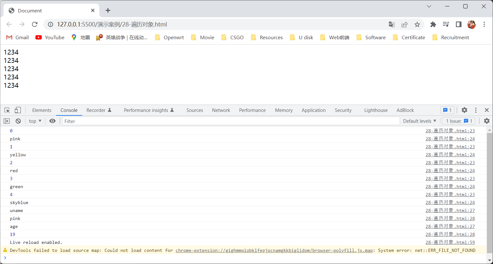
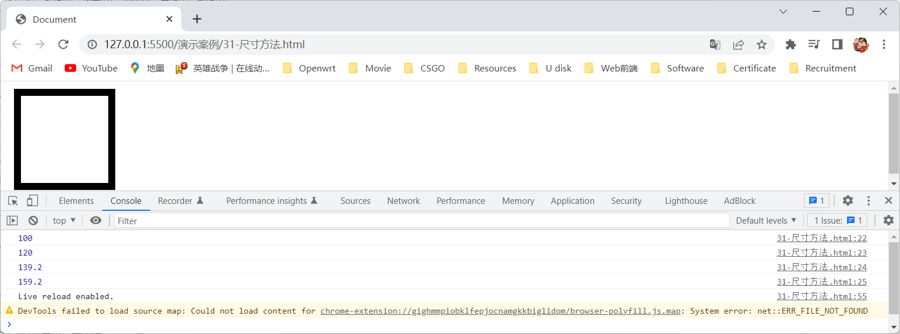

# 1.jQuery概述

## 1.1JavaScript库

- JavaScript库既library，它是一个封装好了函数和方法的特定集合，我们可以从封装好了一大堆函数的角度来理解库，就是在这个库中，我们封装好了很多预先定义好的函数在里面，如：`animate` 函数，获取元素函数等，简单理解就是JavaScript库其实就是一个JavaScript文件，该文件中我们对原生的JavaScript代码进行了封装，让其存放到该文件中，这样我们就可以通过引入该文件，从而能够快速高效的使用该文件中已经封装好的功能，如：jQuery就是为了方便的操作DOM元素，它里面封装的基本上都是操作DOM元素的函数和方法。

- 常见的JavaScript库：

  - jQuery。
  - Prototype。
  - YUI。
  - Dojo。
  - Ext JS。
  - zepto。

  > 注：这些库都是对原生的JavaScript进行封装，这些库能实现的功能都是通过JavaScript来实现的。

## 1.2jQuery概述

- jQuery是一个快速，简洁的JavaScript库，其设计的宗旨是write Less，Do More，既倡导写更少的代码做更多的事情，jQuery封装了JavaScript常用的功能代码，优化了DOM操作、事件处理、动画设计、Ajax交互功能，jQuery出现的目的就是加快前端人员的开发速度，使前端人员可以非常方便的调用和使用它，从而提高开发效率，如：我们要爬到楼顶如果使用jQuery就相当于乘坐电梯到楼顶，使用JavaScript就相当于走楼梯到楼顶，学习jQuery就是学习怎么调用jQuery文件中的函数和方法。

  > 注：jQuery中的 `j` 表示JavaScript的意思，`Query` 表示查询的意思，jQuery的意思就是查询JavaScript，把JavaScript中的DOM操作做了封装，能让我们快速的查询使用DOM操作的功能。

- jQuery的优点：

  - 轻量级，核心文件才几十KB，不会影响页面的加载速度。
  - 跨浏览器兼容，基本兼容了现在主流的浏览器。
  - 链式编程、隐式迭代。
  - 对事件、样式、动画支持，大大简化了DOM操作。
  - 支持插件扩展开发，有着丰富的第三方的插件，如：树形菜单、日期控件、轮播图等。
  - 免费、开源。

# 2.jQuery的基本使用

- jQuery的基本使用步骤如下：

  1. 下载jQuery：

     - 下载jQuery只需去它官网下载即可，如下图所示：

       

       > 注1：jQuery官网地址为：https://jquery.com/。
       >
       > 注2：jQuery有不同的版本分别为：
       >
       > - 1x：兼容IE678等低版本浏览器，官网不再更新。
       > - 2x：不兼容IE678等低版本浏览器，官网不再更新。
       > - 3x：不兼容IE678等低版本浏览器，是官方主要更新维护的版本。
       >
       > - jQuery各个版本的下载地址为：https://code.jquery.com。

  2. 使用 `<script>` 标签中的 `src` 属性往HTML文档中引入jQuery文件，如下图所示：

     

  3. 按照jQuery规定的语法规范来使用jQuery文件中封装的函数和方法即可，如下图所示：

     

# 3.jQuery的入口函数

- 我们有两种jQuery的入口函数它们的作用都是等着DOM结构渲染完毕后即可执行内部代码，不必等到所有外部资源加载完成，相当于可以让我们将包裹着jQuery代码的 `<script>` 标签写在HTML文档中的任意位置，无论该标签写在HTML文档中的什么位置，都要等到DOM结构渲染完毕后才能该标签中的jQuery代码，这两种jQuery的入口函数就相当于原生JavaScript中的 `DOMContentLoaded` 触发事件，只是jQuery帮我们完成了封装，但是要注意这两种jQuery的入口函数不同于原生JavaScript中的 `load` 触发事件，`load` 触发事件是要等页面文档、外部的JavaScript文件、CSS文件、图片都加载完毕后才触发。

- jQuery的入口函数分以下两种：

  1. `$(function() {// jQuery代码})`：

     - 语法：

       ```javascript
       $(function() {
          // jQuery代码 
       });
       ```

     - 演示代码：

       ```html
       <!DOCTYPE html>
       <html lang="en">
       <head>
           <meta charset="UTF-8">
           <meta http-equiv="X-UA-Compatible" content="IE=edge">
           <meta name="viewport" content="width=device-width, initial-scale=1.0">
           <title>Document</title>
           <style>
               div {
                   width: 100px;
                   height: 100px;
                   background-color: pink;
               }
           </style>
       </head>
       <body>
           <script src="./js/jQuery-min.js"></script>
           <script>
               $(function() {
                   $('div').hide();
               });
           </script>
           <div></div>
       </body>
       </html>
       ```

     - 演示结果：

       

  2. `$(document).ready(function() {// jQuery代码})`：

     - 语法：

       ```javascript
       $(document).ready(function() {
           // jQuery代码
       });
       ```

     - 演示代码：

       ```html
       <!DOCTYPE html>
       <html lang="en">
       <head>
           <meta charset="UTF-8">
           <meta http-equiv="X-UA-Compatible" content="IE=edge">
           <meta name="viewport" content="width=device-width, initial-scale=1.0">
           <title>Document</title>
           <style>
               div {
                   width: 100px;
                   height: 100px;
                   background-color: pink;
               }
           </style>
       </head>
       <body>
           <script src="./js/jQuery-min.js"></script>
           <script>
               $(document).ready(function() {
                   $('div').hide();
               });
           </script>
           <div></div>
       </body>
       </html>
       ```

     - 演示结果：

       

# 4.jQuery的顶级对象

- jQuery的顶级对象就是 `jQuery` 对象，该对象有一个别称 `$`，在代码中我们如果要使用 `jQuery` 对象时，我们既可以使用 `jQuery` 来调用 `jQuery` 对象，也可以使用它的别称来调用，如：`jQuery('div').hide();` 代码和 `$('div').hide();` 代码是等价的，我们一般为了方便都是用 `jQuery` 对象的别称来调用该对象。

- jQuery的顶级对象 `jQuery` 对象，相当于原生JavaScript中的 `window` 对象，我们可以利用 `jQuery` 对象来把元素包装成 `jQuery` 对象，这样该元素就可以调用 `jQuery` 对象中的方法了。

- 演示代码：

  ```html
  <!DOCTYPE html>
  <html lang="en">
  <head>
      <meta charset="UTF-8">
      <meta http-equiv="X-UA-Compatible" content="IE=edge">
      <meta name="viewport" content="width=device-width, initial-scale=1.0">
      <title>Document</title>
      <style>
          div {
              width: 100px;
              height: 100px;
              background-color: pink;
          }
      </style>
  </head>
  <body>
      <div></div>
      <script src="./js/jQuery-min.js"></script>
      <script>
          jQuery('div').hide();
      </script>
  </body>
  </html>
  ```

- 演示结果：

  

# 5. `jQuery` 对象和 `DOM` 对象的区别

- `jQuery` 对象和 `DOM` 对象的区别在于：

  - `jQuery` 对象：
    - 通过jQuery方式获取过来的对象就是 `jQuery` 对象，如：`$('div')`。
    - `jQuery` 对象的本质就是利用 `jQuery` 对象对 `DOM` 对象进行包装后产生的新对象，所以该对象是以伪数组的形式来存储的。
    - `jQuery` 对象不能使用 `DOM` 对象中的属性和方法。
  - `DOM` 对象：
    - 通过原生的JavaScript获取过来的对象就是 `DOM` 对象，如：`document.querySelector('div')`。
    - `DOM` 对象中存储着很多属性和方法。
    - `DOM` 对象不能使用 `jQuery` 对象中的属性和方法。

- 演示代码：

  ```html
  <!DOCTYPE html>
  <html lang="en">
  <head>
      <meta charset="UTF-8">
      <meta http-equiv="X-UA-Compatible" content="IE=edge">
      <meta name="viewport" content="width=device-width, initial-scale=1.0">
      <title>Document</title>
      <style>
          div {
              width: 100px;
              height: 100px;
              background-color: pink;
          }
      </style>
  </head>
  <body>
      <div></div>
      <script src="./js/jQuery-min.js"></script>
      <script>
          const div = document.querySelector('div');
          console.dir(div);
          console.dir($('div'));
      </script>
  </body>
  </html>
  ```

- 演示结果：

  

# 6. `jQuery` 对象和 `DOM` 对象的相互转换

- `jQuery` 对象的本质就是利用 `jQuery` 对象对 `DOM` 对象进行包装后产生的新对象，所以通过jQuery方式获取过来的 `DOM` 对象，就相当于是将 `DOM` 对象转换成 `jQuery` 对象，又因为 `DOM` 对象比 `jQuery` 对象更大，所以 `jQuery` 没有给我们封装齐全 `DOM` 对象中的一些属性和方法，所以 `jQuery` 对象要想使用 `DOM` 对象中的一些属性和方法时，需要把 `jQuery` 对象转换为 `DOM` 对象才能使用，把 `jQuery` 对象转换为 `DOM` 对象有以下两种方法：

  - `$('div')[index]`：

    - 语法：

      ```javascript
      $('div')[index];
      ```

    - `index` 取值：通过jQuery方式获取过来的 `DOM` 对象在伪数组中的索引号。

    - 注意点：因为通过jQuery方式获取过来的 `DOM` 对象可能会有很多个，所以 `jQuery` 对象会以伪数组的形式来存储获取过来的 `DOM` 对象。

    - 演示代码：

      ```html
      <!DOCTYPE html>
      <html lang="en">
      <head>
          <meta charset="UTF-8">
          <meta http-equiv="X-UA-Compatible" content="IE=edge">
          <meta name="viewport" content="width=device-width, initial-scale=1.0">
          <title>Document</title>
      </head>
      <body>
          <div></div>
          <script src="./js/jQuery-min.js"></script>
          <script>
              console.dir($('div')[0]);
          </script>
      </body>
      </html>
      ```

    - 演示结果：

      

  - `$('div').get(index)`：

    - 语法：

      ```javascript
      $('div').get(index);
      ```

    - `index` 取值：通过jQuery方式获取过来的 `DOM` 对象在伪数组中的索引号。

    - 注意点：因为通过jQuery方式获取过来的 `DOM` 对象可能会有很多个，所以 `jQuery` 对象会以伪数组的形式来存储获取过来的 `DOM` 对象。

    - 演示代码：

      ```html
      <!DOCTYPE html>
      <html lang="en">
      <head>
          <meta charset="UTF-8">
          <meta http-equiv="X-UA-Compatible" content="IE=edge">
          <meta name="viewport" content="width=device-width, initial-scale=1.0">
          <title>Document</title>
      </head>
      <body>
          <div></div>
          <script src="./js/jQuery-min.js"></script>
          <script>
              console.dir($('div').get(0));
          </script>
      </body>
      </html>
      ```

    - 演示结果：

      

# 7.jQuery常用的API

## 7.1jQuery选择器

### 7.1.1jQuery的基础选择器

- 在原生JavaScript中有很多获取元素的 `DOM` 对象的方式，但是这些方式很杂，并且兼容性情况不一致，所以jQuery将这些方式给我们做了封装，使其获取元素的 `DOM` 对象的方式统一了标准。

- 语法：

  ```javascript
  $('CSS选择器');
  ```

- CSS选择器的取值：用户自定义，只能是我们学习的CSS选择器，如：类选择器、标签名选择器等。

- 注意点：

  - `$('CSS选择器')` 方法可以获取多个或一个元素的 `DOM` 对象。
  - 因为 `jQuery` 对象的本质就是利用 `jQuery` 对象对 `DOM` 对象进行包装后产生的新对象，所以通过jQuery方式获取过来的元素的 `DOM` 对象，就相当于是将元素的 `DOM` 对象转换成 `jQuery` 对象，这样该元素就能使用 `jQuery` 对象中的属性和方法了。
  - 因为通过jQuery方式获取过来的元素的 `DOM` 对象可能会有很多个，所以 `jQuery` 对象会以伪数组的形式来存储获取过来的元素的 `DOM` 对象。

- 演示代码：

  ```html
  <!DOCTYPE html>
  <html lang="en">
  <head>
      <meta charset="UTF-8">
      <meta http-equiv="X-UA-Compatible" content="IE=edge">
      <meta name="viewport" content="width=device-width, initial-scale=1.0">
      <title>Document</title>
  </head>
  <body>
      <ul>
          <li></li>
          <li></li>
          <li></li>
          <li></li>
          <li></li>
      </ul>
      <script src="./js/jQuery-min.js"></script>
      <script>
          console.dir($('ul li'));
      </script>
  </body>
  </html>
  ```

- 演示结果：

  

### 7.1.2隐式迭代

- 因为通过jQuery方式获取过来的元素的 `DOM` 对象可能会有很多个，当我们要给这些元素都使用 `jQuery` 对象中的某种方法时，我们需要先遍历这些元素，给这些元素一个个添加 `jQuery` 对象中的某种方法，而在jQuery中不需要我们手动去遍历这些元素，因为jQuery中有隐式迭代，它会自动帮我们遍历这些元素，jQuery自动遍历 `jQuery` 对象中的元素的 `DOM` 对象的过程就叫做隐式迭代，简单来说就是隐式迭代会自动给通过jQuery方式获取过来的所有元素的 `DOM` 对象进行遍历，并且遍历的同时会执行相应的方法，而不用我们手动进行遍历，从而简化我们的操作。

- 演示代码：

  ```html
  <!DOCTYPE html>
  <html lang="en">
  <head>
      <meta charset="UTF-8">
      <meta http-equiv="X-UA-Compatible" content="IE=edge">
      <meta name="viewport" content="width=device-width, initial-scale=1.0">
      <title>Document</title>
  </head>
  <body>
      <ul>
          <li></li>
          <li></li>
          <li></li>
          <li></li>
          <li></li>
      </ul>
      <script src="./js/jQuery-min.js"></script>
      <script>
          $('ul li').css('background-color','pink');
      </script>
  </body>
  </html>
  ```

- 演示结果：

  

### 7.1.3jQuery的筛选选择器

- 我们还可以通过jQuery的筛选选择器来获取多个或一个元素的 `DOM` 对象，jQuery的筛选选择器如下表所示：

  | jQuery的筛选选择器 |        用法        | 说明                                                         |
  | :----------------: | :----------------: | ------------------------------------------------------------ |
  |      `:first`      | `$('ul li:first')` | 获取 `<ul>` 标签中的第一个 `<li>` 标签的 `DOM` 对象          |
  |      `:last`       | `$('ul li:last')`  | 获取 `<ul>` 标签中的最后一个 `<li>` 标签的 `DOM` 对象        |
  |    `:eq(index)`    | `$('ul li:eq(2)')` | 从获取 `<ul>` 标签中的所有 `<li>` 标签中获取索引号为2的 `<li>` 标签的 `DOM` 对象，索引号是从0开始的，也就是获取 `<ul>` 标签中的第三个 `<li>` 标签的 `DOM` 对象 |
  |       `:odd`       |  `$('ul li:odd')`  | 从获取 `<ul>` 标签中的所有 `<li>` 标签中获取索引号为奇数的 `<li>` 标签的 `DOM` 对象，索引号是从0开始的，也就是获取 `<ul>` 标签中的第1个、第3个、第5个、···、第n个 `<li>` 标签的 `DOM` 对象 |
  |      `:even`       | `$('ul li:even')`  | 从获取 `<ul>` 标签中的所有 `<li>` 标签中获取索引号为偶数的 `<li>` 标签的 `DOM` 对象，索引号是从0开始的，也就是获取 `<ul>` 标签中的第0个、第2个、第4个、···、第n个 `<li>` 标签的 `DOM` 对象 |

- 注意点：

  - 因为 `jQuery` 对象的本质就是利用 `jQuery` 对象对 `DOM` 对象进行包装后产生的新对象，所以通过jQuery方式获取过来的元素的 `DOM` 对象，就相当于是将元素的 `DOM` 对象转换成 `jQuery` 对象，这样该元素就能使用 `jQuery` 对象中的属性和方法了。
  - 因为通过jQuery方式获取过来的元素的 `DOM` 对象可能会有很多个，所以 `jQuery` 对象会以伪数组的形式来存储获取过来的元素的 `DOM` 对象。

- 演示代码：

  ```html
  <!DOCTYPE html>
  <html lang="en">
  <head>
      <meta charset="UTF-8">
      <meta http-equiv="X-UA-Compatible" content="IE=edge">
      <meta name="viewport" content="width=device-width, initial-scale=1.0">
      <title>Document</title>
  </head>
  <body>
      <ul>
          <li></li>
          <li></li>
          <li></li>
          <li></li>
          <li></li>
      </ul>
      <script src="./js/jQuery-min.js"></script>
      <script>
          $('ul li:odd').css('background-color','yellow');
          $('ul li:even').css('background-color','pink');
      </script>
  </body>
  </html>
  ```

- 演示结果：

  

### 7.1.4jQuery的筛选方法

- 我们还可以通过jQuery的筛选方法来获取多个或一个元素的 `DOM` 对象，jQuery的筛选方法如下表所示：

  |   jQuery的筛选方法   |               用法                | 说明                                                         |
  | :------------------: | :-------------------------------: | ------------------------------------------------------------ |
  |      `parent()`      |        `$('li').parent();`        | 获取 `<li>` 标签的父级标签的 `DOM` 对象，只能获取到最近一级的父级标签的 `DOM` 对象 |
  | `parents(selector)`  |     `$('li').parents('ul');`      | 获取 `<li>` 标签的指定父级标签的 `DOM` 对象，也就是获取 `<li>` 标签的父级标签的标签名为 `ul` 的父级标签的 `DOM` 对象。 |
  | `children(selector)` |     `$('ul').children('li');`     | 获取 `<ul>` 标签的最近一级的子级标签，并且该子级标签的标签名要为 `li` 的子级标签的 `DOM` 对象 |
  |   `find(selector)`   |       `$('ul').find('li');`       | 获取 `<ul>` 标签的所有后代标签，并且该后代标签的标签名要为 `li` 的后代标签的 `DOM` 对象 |
  | `siblings(selector)` |    `$('ul').siblings('div');`     | 获取除 `<ul>` 标签之外的所有兄弟标签，并且该兄弟标签的标签名要为 `div` 的兄弟标签的 `DOM` 对象 |
  |  `nextAll([expr])`   |     `$('ul').nextAll('div');`     | 获取除 `<ul>` 标签之外并且在 `<ul>` 标签之后的所有兄弟标签，并且该兄弟标签的标签名要为 `div` 的兄弟标签的 `DOM` 对象 |
  |  `prevtAll([expr])`  |    `$('ul').prevtAll('div');`     | 获取除 `<ul>` 标签之外并且在 `<ul>` 标签之前的所有兄弟标签，并且该兄弟标签的标签名要为 `div` 的兄弟标签的 `DOM` 对象 |
  |  `hasClass(class)`   | `$('div').hasClass('protected');` | 检查获取的 `<div>` 标签是否含有 `protected` 类名，如果有就返回 `true`，否则放回 `false`。 |
  |     `eq(index)`      |        `$('ul li').eq(2);`        | 从获取 `<ul>` 标签中的所有 `<li>` 标签中获取索引号为2的 `<li>` 标签的 `DOM` 对象，索引号是从0开始的，也就是获取 `<ul>` 标签中的第三个 `<li>` 标签的 `DOM` 对象 |

- 注意点：

  - `$('ul').nextAll('div')` 方法中的 `nextAll` 后面的括号内的CSS选择器可写可不写，如果不写就是获取除 `<ul>` 标签之外并且在 `<ul>` 标签之后的所有兄弟标签的 `DOM` 对象。
  - `$('ul').prevtAll('div')` 方法中的 `prevtAll` 后面的括号内的CSS选择器可写可不写，如果不写就是获取除 `<ul>` 标签之外并且在 `<ul>` 标签之前的所有兄弟标签的 `DOM` 对象。
  - 因为 `jQuery` 对象的本质就是利用 `jQuery` 对象对 `DOM` 对象进行包装后产生的新对象，所以通过jQuery方式获取过来的元素的 `DOM` 对象，就相当于是将元素的 `DOM` 对象转换成 `jQuery` 对象，这样该元素就能使用 `jQuery` 对象中的属性和方法了。
  - 因为通过jQuery方式获取过来的元素的 `DOM` 对象可能会有很多个，所以 `jQuery` 对象会以伪数组的形式来存储获取过来的元素的 `DOM` 对象。

- 演示代码：

  ```html
  <!DOCTYPE html>
  <html lang="en">
  <head>
      <meta charset="UTF-8">
      <meta http-equiv="X-UA-Compatible" content="IE=edge">
      <meta name="viewport" content="width=device-width, initial-scale=1.0">
      <title>Document</title>
      <style>
          div {
              width: 100px;
              height: 20px;
          }
      </style>
  </head>
  <body>
      <div></div>
      <div></div>
      <ul>
          <li></li>
          <li></li>
          <li class="one"></li>
          <li></li>
          <li></li>
      </ul>
      <div></div>
      <div></div>
      <script src="./js/jQuery-min.js"></script>
      <script>
          $('ul').children('li').css('background-color','pink');
          $('ul').prevAll().css('background-color','red');
          $('ul').nextAll().css('background-color','yellow');
          console.log($('ul li').hasClass('one'));
      </script>
  </body>
  </html>
  ```

- 演示结果：

  

### 7.1.5新浪下拉菜单案例

- 鼠标滑过导航栏，显示下拉菜单。

- 新浪下拉菜单案例的实现步骤：

  1. 给导航栏中的模块都添加 `mousemove` 事件。
  2. 触发 `mousemove` 事件时就让下拉菜单显示。
  3. 给导航栏中的模块都添加 `mouseleave` 事件。
  4. 触发 `mouseleave` 事件时就让下拉菜单隐藏。

- 演示代码：

  ```html
  <!DOCTYPE html>
  <html lang="en">
  <head>
      <meta charset="UTF-8">
      <meta http-equiv="X-UA-Compatible" content="IE=edge">
      <meta name="viewport" content="width=device-width, initial-scale=1.0">
      <title>新浪下拉菜单案例</title>
      <style>
          * {
              margin: 0;
              padding: 0;
          }
          li {
              list-style-type: none;
          }
          a {
              text-decoration: none;
              font-size: 14px;
          }
          .nav {
              margin: 100px;
          }
          .nav>li {
              position: relative;
              float: left;
              width: 80px;
              height: 41px;
              text-align: center;
          }
          .nav li a {
              display: block;
              width: 100%;
              height: 100%;
              line-height: 41px;
              color: #333;
          }
          .nav>li>a:hover {
              background-color: #eee;
          }
          .nav ul {
              display: none;
              position: absolute;
              top: 41px;
              left: 0;
              width: 100%;
              border-left: 1px solid #FECC5B;
              border-right: 1px solid #FECC5B;
          }
          .nav ul li {
              border-bottom: 1px solid #FECC5B;
          }
          .nav ul li a:hover {
              background-color: #FFF5DA;
          }
      </style>
  </head>
  <body>
      <ul class="nav">
          <li>
              <a href="#">微博</a>
              <ul>
                  <li>
                      <a href="#">私信</a>
                  </li>
                  <li>
                      <a href="#">评论</a>
                  </li>
                  <li>
                      <a href="#">@我</a>
                  </li>
              </ul>
          </li>
          <li>
              <a href="#">微博</a>
              <ul>
                  <li>
                      <a href="#">私信</a>
                  </li>
                  <li>
                      <a href="#">评论</a>
                  </li>
                  <li>
                      <a href="#">@我</a>
                  </li>
              </ul>
          </li>
          <li>
              <a href="#">微博</a>
              <ul>
                  <li>
                      <a href="#">私信</a>
                  </li>
                  <li>
                      <a href="#">评论</a>
                  </li>
                  <li>
                      <a href="#">@我</a>
                  </li>
              </ul>
          </li>
          <li>
              <a href="#">微博</a>
              <ul>
                  <li>
                      <a href="#">私信</a>
                  </li>
                  <li>
                      <a href="#">评论</a>
                  </li>
                  <li>
                      <a href="#">@我</a>
                  </li>
              </ul>
          </li>
      </ul>
      <script src="./js/jQuery-min.js"></script>
      <script>
          // 给导航栏中的模块都添加mousemove事件。
          $('ul>li').mousemove(function() {
              // 触发mousemove事件时就让下拉菜单显示。
              $(this).children('ul').show();// 在jQuery中如果要使用this关键字那么要以$(this)的形式来使用。
          });
          // 给导航栏中的模块都添加mouseleave事件。
          $('ul>li').mouseleave(function() {
              // 触发mouseleave事件时就让下拉菜单隐藏。
              $(this).children('ul').hide();// 在jQuery中如果要使用this关键字那么要以$(this)的形式来使用。
          });
      </script>
  </body>
  </html>
  ```

  > 注：在jQuery中如果要使用 `this` 关键字那么要以 `$(this)` 的形式来使用。

- 演示结果：

  

### 7.1.6jQuery中的排他思想

- 排他思想就是先排除其他元素的样式，然后再设置当前元素的样式，如：如果有同一组元素，我们想要某一个元素实现某种样式，就需要用到循环的排他思想算法，将所有元素的样式全部清除（排除其他人），然后给当前元素设置样式（留下我自己），注意顺序不能颠倒，首先干掉其他元素的样式，再设置当前元素的样式。

- 演示代码：

  ```html
  <!DOCTYPE html>
  <html lang="en">
  <head>
      <meta charset="UTF-8">
      <meta http-equiv="X-UA-Compatible" content="IE=edge">
      <meta name="viewport" content="width=device-width, initial-scale=1.0">
      <title>Document</title>
  </head>
  <body>
      <button>点击</button>
      <button>点击</button>
      <button>点击</button>
      <button>点击</button>
      <button>点击</button>
      <script src="./js/jQuery-min.js"></script>
      <script>
          $('button').click(function() {
              $(this).css('background-color','pink');
              $(this).siblings('button').css('background-color','');
          });
      </script>
  </body>
  </html>
  ```

- 演示结果：

  

### 7.1.7淘宝服饰精品案例

- 鼠标经过导航模块时，显示对应的商品。

- 淘宝服饰精品案例的实现步骤：

  1. 给左侧盒子的所有 `<li>` 标签添加 `mouseover` 事件。

  2. 我们可以使用元素的 `jQuery` 对象中的 `index()` 方法来获取该元素的索引号。

     > 注：我们可以使用元素的 `jQuery` 对象中的 `index()` 方法来获取该元素在被jQuery方式获取过来时，该元素存储在 `jQuery` 对象中的伪数组中的索引号。
     >
     > - 语法：
     >
     >   ```javascript
     >   $('CSS选择器').index();
     >   ```
     >
     > - CSS选择器的取值：用户自定义，只能是我们学习的CSS选择器，如：类选择器、标签名选择器等。
     >
     > - 注意点：
     >
     >   - 要先获取元素的 `jQuery` 对象才能让该元素使用 `jQuery` 对象中的属性和方法。
     >
     >   - 如果获取了多个元素时，这些元素要亲兄弟关系，才能获取到这些元素的索引号。
     >
     > - 演示代码：
     >
     >   ```html
     >   <!DOCTYPE html>
     >   <html lang="en">
     >   <head>
     >       <meta charset="UTF-8">
     >       <meta http-equiv="X-UA-Compatible" content="IE=edge">
     >       <meta name="viewport" content="width=device-width, initial-scale=1.0">
     >       <title>Document</title>
     >   </head>
     >   <body>
     >       <button>点击</button>
     >       <button>点击</button>
     >       <button>点击</button>
     >       <button>点击</button>
     >       <button>点击</button>
     >       <script src="./js/jQuery-min.js"></script>
     >       <script>
     >           $('button').click(function() {
     >               console.log($(this).index());
     >           });
     >       </script>
     >   </body>
     >   </html>
     >   ```
     >
     > - 演示结果：
     >
     >   

  3. 我们可以使用元素的索引号让指定元素显示，其它元素隐藏。

- 演示代码：

  ```html
  <!DOCTYPE html>
  <html lang="en">
  <head>
      <meta charset="UTF-8">
      <meta http-equiv="X-UA-Compatible" content="IE=edge">
      <meta name="viewport" content="width=device-width, initial-scale=1.0">
      <title>淘宝服饰精品案例</title>
      <style>
          * {
              margin: 0;
              padding: 0;
              font-size: 12px;
          }
          ul {
              list-style: none;
          }
          a {
              text-decoration: none;
          }
          .wrapper {
              width: 250px;
              height: 248px;
              margin: 100px auto 0;
              border: 1px solid pink;
              border-right: 0;
              overflow: hidden;
          }
          #left,
          #content {
              float: left;
          }
          #left li {
              background: url(./images/lili.jpg) repeat-x;
          }
          #left li a {
              display: block;
              width: 48px;
              height: 27px;
              border-bottom: 1px solid pink;
              line-height: 27px;
              text-align: center;
              color: black;
          }
          #left li a:hover {
              background-image: url(./images/abg.gif);
          }
          #content {
              border-left: 1px solid pink;
              border-right: 1px solid pink;
          }
      </style>
  </head>
  <body>
      <div class="wrapper">
          <ul id="left">
              <li><a href="#">女靴</a></li>
              <li><a href="#">雪地靴</a></li>
              <li><a href="#">冬裙</a></li>
              <li><a href="#">呢大衣</a></li>
              <li><a href="#">毛衣</a></li>
              <li><a href="#">棉服</a></li>
              <li><a href="#">女裤</a></li>
              <li><a href="#">羽绒服</a></li>
              <li><a href="#">牛仔裤</a></li>
          </ul>
          <div id="content">
              <div>
                  <a href="#"></a>
              </div>
              <div>
                  <a href="#"></a>
              </div>
              <div>
                  <a href="#"></a>
              </div>
              <div>
                  <a href="#"></a>
              </div>
              <div>
                  <a href="#"></a>
              </div>
              <div>
                  <a href="#"></a>
              </div>
              <div>
                  <a href="#"></a>
              </div>
              <div>
                  <a href="#"></a>
              </div>
              <div>
                  <a href="#"></a>
              </div>
          </div>
      </div>
      <script src="./js/jQuery-min.js"></script>
      <script>
          // 给左侧盒子的所有小li添加mouseover事件。
          $("#left li").mouseover(function() {
              // 我们可以使用元素的jQuery对象中的index()方法来获取该元素的索引号。
              var index = $(this).index();
              // 我们可以使用元素的索引号让指定元素显示，其它元素隐藏。
              $("#content div").eq(index).show().siblings().hide();
          })
      </script>
  </body>
  </html>
  ```

- 演示结果：

  

### 7.1.8链式编程

- 链式编程是为了节省代码量，使其看起来更优雅，使用链式编程时一定要注意是那个对象执行操作。

- 演示代码：

  ```html
  <!DOCTYPE html>
  <html lang="en">
  <head>
      <meta charset="UTF-8">
      <meta http-equiv="X-UA-Compatible" content="IE=edge">
      <meta name="viewport" content="width=device-width, initial-scale=1.0">
      <title>Document</title>
  </head>
  <body>
      <button>点击</button>
      <button>点击</button>
      <button>点击</button>
      <button>点击</button>
      <button>点击</button>
      <script src="./js/jQuery-min.js"></script>
      <script>
          $('button').click(function() {
              // 链式编程
              $(this).css('background-color','pink').siblings('button').css('background-color','');
          });
      </script>
  </body>
  </html>
  ```

- 演示结果：

  

## 7.2jQuery样式操作

- jQuery操作元素样式的方法有以下几种：

  1. 我们可以使用元素的 `jQuery` 对象中的 `css()` 方法来获取或修改该元素的CSS属性。

     - 语法：

       ```javascript
       $('CSS选择器').css('要获取该元素的那个CSS属性');// 获取元素的CSS属性
       $('CSS选择器').css('要修改该元素的那个CSS属性','要修改的值');// 修改元素的CSS属性;
       ```

     - 取值：

       |                           | 取值                                                         |
       | :-----------------------: | ------------------------------------------------------------ |
       |         CSS选择器         | 用户自定义，只能是我们学习的CSS选择器，如：类选择器、标签名选择器等 |
       | 要获取该元素的那个CSS属性 | 用户自定义，要获取该元素的那个CSS属性的属性名                |
       | 要修改该元素的那个CSS属性 | 用户自定义，要修改该元素的那个CSS属性的属性名                |
       |        要修改的值         | 用户自定义，可以是数字，字符串等                             |

     - 注意点：

       - 在操作元素之前我们需要先获取该元素的 `jQuery` 对象，才能操作该元素。
       - `$('CSS选择器').css('要修改该元素的那个CSS属性','要修改的值')` 方法中的要修改的值，如果是数字可以省略掉单引号和单位，如：`$('div').css('width',100);` 代码。
       - 如果要修改元素中多个CSS属性，那么该元素的 `jQuery` 对象中的 `css()` 方法中的参数可以是对象的形式，如：`$('CSS选择器').css({要修改该元素的那个CSS属性1: '要修改的值1',要修改该元素的那个CSS属性2: '要修改的值2',···,要修改该元素的那个CSS属性n: '要修改的值n')` 方法，但是要注意要修改该元素的那个CSS属性和要修改的值之间要用冒号进行分隔，并且如果要修改该元素的那个CSS属性是带有 `-` 的CSS属性时，要采取小驼峰命名法，并且要修改该元素的那个CSS属性可以不用加单引号，并且要修改的值，如果是数字还可以省略掉单引号和单位，如：`$('div').css({width: 100,backgroundColor: 'pink');` 代码。

     - 演示代码：

       ```html
       <!DOCTYPE html>
       <html lang="en">
       <head>
           <meta charset="UTF-8">
           <meta http-equiv="X-UA-Compatible" content="IE=edge">
           <meta name="viewport" content="width=device-width, initial-scale=1.0">
           <title>Document</title>
           <style>
               div {
                   width: 100px;
               }
           </style>
       </head>
       <body>
           <div></div>
           <script src="./js/jQuery-min.js"></script>
           <script>
               console.log($('div').css('width'));
               $('div').css({height: 100,backgroundColor: 'pink'});
           </script>
       </body>
       </html>
       ```

     - 演示结果：

       

  2. 我们可以使用元素的 `jQuery` 对象中的 `addClass()` 方法来给该元素添加指定类名、`removeClass()` 方法来给该元素删除指定类名、`toggleClass()` 方法来判断该元素是否有指定类名，如果有就删除指定类名，如果没有就添加指定类名。

     - 语法：

       ```javascript
       $('CSS选择器').addClass('类名');// 给元素添加指定类名
       $('CSS选择器').removeClass('类名');// 给元素删除指定类名
       $('CSS选择器').toggleClass('类名');// 判断元素是否有指定类名，如果有就删除指定类名，如果没有就添加指定类名
       ```

     - 取值：

       |           | 取值                                                         |
       | :-------: | ------------------------------------------------------------ |
       | CSS选择器 | 用户自定义，只能是我们学习的CSS选择器，如：类选择器、标签名选择器等 |
       |   类名    | 用户自定义，可以是数字，字符串等                             |

     - 注意点：
       - 在操作元素之前我们需要先获取该元素的 `jQuery` 对象，才能操作该元素。
       - 原生JavaScript中的元素的DOM对象中的 `className` 属性和元素的 `jQuery` 对象中的 `Class` 方法的区别在于 `className` 属性在修改元素的 `class` 属性时，是将新值替换旧值，所以如果需要给元素添加一个新类名，就需要保留该元素之前的类名，而 `Class` 方法是将类名追加进元素的 `class` 属性中，所以不会影响元素之前的类名。

     - 演示代码：

       ```html
       <!DOCTYPE html>
       <html lang="en">
       <head>
           <meta charset="UTF-8">
           <meta http-equiv="X-UA-Compatible" content="IE=edge">
           <meta name="viewport" content="width=device-width, initial-scale=1.0">
           <title>Document</title>
           <style>
               .one {
                   width: 100px;
                   height: 100px;
                   background-color: pink;
               }
           </style>
       </head>
       <body>
           <div></div>
           <script src="./js/jQuery-min.js"></script>
           <script>
               $('div').addClass('one');
           </script>
       </body>
       </html>
       ```

     - 演示结果：

       

## 7.3Tab栏切换案例

- 点击不同的Tab栏，会显示不同的模块。

- Tab栏切换案例的实现步骤：

  1. 点击上部的 `<li>` 标签，让当前 `<li>` 标签添加 `current` 类，其余兄弟标签移除 `current` 类。
  2. 点击的同时，得到当前 `<li>` 标签的索引号。
  3. 让下部里面相应索引号的 `item` 显示，其余的 `item` 隐藏。

- 演示代码：

  ```html
  <!DOCTYPE html>
  <html lang="en">
  <head>
      <meta charset="UTF-8">
      <meta http-equiv="X-UA-Compatible" content="IE=edge">
      <meta name="viewport" content="width=device-width, initial-scale=1.0">
      <title>Tab栏切换案例</title>
      <style>
          * {
              margin: 0;
              padding: 0;
          }
          li {
              list-style-type: none;
          }
          .tab {
              width: 978px;
              margin: 100px auto;
          }
          .tab_list {
              height: 39px;
              border: 1px solid #ccc;
              background-color: #f1f1f1;
          }
          .tab_list li {
              float: left;
              height: 39px;
              line-height: 39px;
              padding: 0 20px;
              text-align: center;
              cursor: pointer;
          }
          .tab_list .current {
              background-color: #c81623;
              color: #fff;
          }
          .item_info {
              padding: 20px 0 0 20px;
          }
          .item {
              display: none;
          }
      </style>
  </head>
  <body>
      <div class="tab">
          <div class="tab_list">
              <ul>
                  <li class="current">商品介绍</li>
                  <li>规格与包装</li>
                  <li>售后保障</li>
                  <li>商品评价（50000）</li>
                  <li>手机社区</li>
              </ul>
          </div>
          <div class="tab_con">
              <div class="item" style="display: block;">
                  商品介绍模块内容
              </div>
              <div class="item">
                  规格与包装模块内容
              </div>
              <div class="item">
                  售后保障模块内容
              </div>
              <div class="item">
                  商品评价（50000）模块内容
              </div>
              <div class="item">
                  手机社区模块内容
              </div>
          </div>
      </div>
      <script src="./js/jQuery-min.js"></script>
      <script>
          // 点击上部的<li>标签，让当前<li>标签添加current类，其余兄弟标签移除current类。
          $('.tab_list li').click(function() {
              $(this).addClass('current').siblings().removeClass('current');
              // 点击的同时，得到当前<li>标签的索引号。
              let index = $(this).index();
              // 让下部里面相应索引号的item显示，其余的item隐藏。
              $('.item').eq(index).show().siblings().hide();
          });
      </script>
  </body>
  </html>
  ```

- 演示结果：

  

## 7.4jQuery效果

### 7.4.1显示和隐藏效果

- 我们可以使用元素的 `jQuery` 对象中的 `show()` 方法来让该元素显示、`hide()` 方法来让该元素隐藏、`toggle()` 方法来判断该元素是否隐藏了，如果隐藏了就让其显示，如果没有隐藏就让其隐藏。

- 语法：

  ```javascript
  $('CSS选择器').show(speed,easing,fn);// 显示元素
  $('CSS选择器').hide(speed,easing,fn);// 隐藏元素
  $('CSS选择器').toggle(speed,easing,fn);// 判断元素是否隐藏了，如果隐藏了就让其显示，如果没有隐藏就让其隐藏
  ```

- 取值：

  |           | 取值                                                         |
  | :-------: | ------------------------------------------------------------ |
  | CSS选择器 | 用户自定义，只能是我们学习的CSS选择器，如：类选择器、标签名选择器等 |
  |  `speed`  | `'slow'`（慢）、`'normal'`（正常）、`'fast'`（快）、表示动画时长的毫秒数，如：1000 |
  | `easing`  | `'swing'`（匀速，默认值）、`'linear'`（线性）                |
  |   `fn`    | 回调函数                                                     |

- 注意点：

  - 在操作元素之前我们需要先获取该元素的 `jQuery` 对象，才能操作该元素。

  - `show()` 方法、`hide()` 方法、`toggle()` 方法中的括号内的参数可写可不写，如果不写就表示无动画来让元素显示或隐藏，如果写了就表示有动画来让元素显示或隐藏，其中 `speed` 参数用于设置动画的时长，`easing` 参数用于设置动画的运动曲线，`fn` 参数用于设置动画执行完毕后执行什么函数。

- 演示代码：

  ```html
  <!DOCTYPE html>
  <html lang="en">
  <head>
      <meta charset="UTF-8">
      <meta http-equiv="X-UA-Compatible" content="IE=edge">
      <meta name="viewport" content="width=device-width, initial-scale=1.0">
      <title>Document</title>
      <style>
          div {
              width: 100px;
              height: 100px;
              background-color: pink;
          }
      </style>
  </head>
  <body>
      <button>显示</button>
      <button>隐藏</button>
      <button>切换</button>
      <div></div>
      <script src="./js/jQuery-min.js"></script>
      <script>
          $('button').eq(0).click(function() {
              $('div').show(1000,'linear',function() {
                  alert(1);
              });
          });
          $('button').eq(1).click(function() {
              $('div').hide(1000,'linear',function() {
                  alert(2);
              });
          });
          $('button').eq(2).click(function() {
              $('div').toggle(1000,'linear',function() {
                  alert(3);
              });
          });
      </script>
  </body>
  </html>
  ```

- 演示结果：

  

### 7.4.2滑动显示和滑动隐藏效果

- 我们可以使用元素的 `jQuery` 对象中的 `slideDown()` 方法来让该元素下拉显示、`slideUp()` 方法来让该元素上拉隐藏、`slideToggle()` 方法来判断该元素是否隐藏了，如果隐藏了就让其下拉显示，如果没有隐藏就让其上拉隐藏。

- 语法：

  ```javascript
  $('CSS选择器').slideDown(speed,easing,fn);// 下拉显示元素
  $('CSS选择器').slideUp(speed,easing,fn);// 上拉隐藏元素
  $('CSS选择器').slideToggle(speed,easing,fn);// 判断元素是否隐藏了，如果隐藏了就让其下拉显示，如果没有隐藏就让其上拉隐藏
  ```

- 取值：

  |           | 取值                                                         |
  | :-------: | ------------------------------------------------------------ |
  | CSS选择器 | 用户自定义，只能是我们学习的CSS选择器，如：类选择器、标签名选择器等 |
  |  `speed`  | `'slow'`（慢）、`'normal'`（正常）、`'fast'`（快）、表示动画时长的毫秒数，如：1000 |
  | `easing`  | `'swing'`（匀速，默认值）、`'linear'`（线性）                |
  |   `fn`    | 回调函数                                                     |

- 注意点：

  - 在操作元素之前我们需要先获取该元素的 `jQuery` 对象，才能操作该元素。

  - `slideDown()` 方法、`slideUp()` 方法、`slideToggle()` 方法中的括号内的参数可写可不写，如果不写就表示无动画来让元素下拉显示或上拉隐藏，如果写了就表示有动画来让元素下拉显示或上拉隐藏，其中 `speed` 参数用于设置动画的时长，`easing` 参数用于设置动画的运动曲线，`fn` 参数用于设置动画执行完毕后执行什么函数。

- 演示代码：

  ```html
  <!DOCTYPE html>
  <html lang="en">
  <head>
      <meta charset="UTF-8">
      <meta http-equiv="X-UA-Compatible" content="IE=edge">
      <meta name="viewport" content="width=device-width, initial-scale=1.0">
      <title>Document</title>
      <style>
          div {
              width: 100px;
              height: 100px;
              background-color: pink;
          }
      </style>
  </head>
  <body>
      <button>显示</button>
      <button>隐藏</button>
      <button>切换</button>
      <div></div>
      <script src="./js/jQuery-min.js"></script>
      <script>
          $('button').eq(0).click(function() {
              $('div').slideDown(1000,'linear',function() {
                  alert(1);
              });
          });
          $('button').eq(1).click(function() {
              $('div').slideUp(1000,'linear',function() {
                  alert(2);
              });
          });
          $('button').eq(2).click(function() {
              $('div').slideToggle(1000,'linear',function() {
                  alert(3);
              });
          });
      </script>
  </body>
  </html>
  ```

- 演示结果：

  

### 7.4.3事件切换

- 我们可以使用元素的 `jQuery` 对象中的 `hover()` 方法来给该元素添加 `mouseenter` 事件和 `mouseleave` 事件。

- 语法：

  ```javascript
  $('CSS选择器').hover(fn1,fn2);
  ```

- 取值：

  |           | 取值                                                         |
  | :-------: | ------------------------------------------------------------ |
  | CSS选择器 | 用户自定义，只能是我们学习的CSS选择器，如：类选择器、标签名选择器等 |
  |   `fn1`   | 用户自定义，只能是匿名函数                                   |
  |   `fn2`   | 用户自定义，只能是匿名函数                                   |

- 注意点：

  - 在操作元素之前我们需要先获取该元素的 `jQuery` 对象，才能操作该元素。
  - `$('CSS选择器').hover(fn1,fn2)` 方法中的 `fn1` 是当触发 `mouseenter` 事件时，要执行的函数，而 `fn2` 是当触发 `mouseleave` 事件时，要执行的函数。
  - `$('CSS选择器').hover(fn1,fn2)` 方法中如果只写了一个匿名函数，那么当触发 `mouseenter` 事件和触发 `mouseleave` 事件时，都会执行该函数。

- 演示代码：

  ```html
  <!DOCTYPE html>
  <html lang="en">
  <head>
      <meta charset="UTF-8">
      <meta http-equiv="X-UA-Compatible" content="IE=edge">
      <meta name="viewport" content="width=device-width, initial-scale=1.0">
      <title>Document</title>
      <style>
          * {
              margin: 0;
              padding: 0;
          }
          li {
              list-style-type: none;
          }
          a {
              text-decoration: none;
              font-size: 14px;
          }
          .nav {
              margin: 100px;
          }
          .nav>li {
              position: relative;
              float: left;
              width: 80px;
              height: 41px;
              text-align: center;
          }
          .nav li a {
              display: block;
              width: 100%;
              height: 100%;
              line-height: 41px;
              color: #333;
          }
          .nav>li>a:hover {
              background-color: #eee;
          }
          .nav ul {
              display: none;
              position: absolute;
              top: 41px;
              left: 0;
              width: 100%;
              border-left: 1px solid #FECC5B;
              border-right: 1px solid #FECC5B;
          }
          .nav ul li {
              border-bottom: 1px solid #FECC5B;
          }
          .nav ul li a:hover {
              background-color: #FFF5DA;
          }
      </style>
  </head>
  <body>
      <ul class="nav">
          <li>
              <a href="#">微博</a>
              <ul>
                  <li>
                      <a href="#">私信</a>
                  </li>
                  <li>
                      <a href="#">评论</a>
                  </li>
                  <li>
                      <a href="#">@我</a>
                  </li>
              </ul>
          </li>
          <li>
              <a href="#">微博</a>
              <ul>
                  <li>
                      <a href="#">私信</a>
                  </li>
                  <li>
                      <a href="#">评论</a>
                  </li>
                  <li>
                      <a href="#">@我</a>
                  </li>
              </ul>
          </li>
          <li>
              <a href="#">微博</a>
              <ul>
                  <li>
                      <a href="#">私信</a>
                  </li>
                  <li>
                      <a href="#">评论</a>
                  </li>
                  <li>
                      <a href="#">@我</a>
                  </li>
              </ul>
          </li>
          <li>
              <a href="#">微博</a>
              <ul>
                  <li>
                      <a href="#">私信</a>
                  </li>
                  <li>
                      <a href="#">评论</a>
                  </li>
                  <li>
                      <a href="#">@我</a>
                  </li>
              </ul>
          </li>
      </ul>
      <script src="./js/jQuery-min.js"></script>
      <script>
          $('ul>li').hover(function() {
              $(this).children('ul').slideToggle();
          });
      </script>
  </body>
  </html>
  ```

- 演示结果：

  

### 7.4.4动画队列及其停止排队方法

- 如果多次触发jQuery效果时，就会造成多个动画或者效果排队执行，我们称之为动画队列也可以称为效果队列，如下图所示：

  

- 我们可以使用元素的 `jQuery` 对象中的 `stop()` 方法来解决上述问题，`stop()` 方法是用于停止动画或效果的。

- 语法：

  ```javascript
  $('CSS选择器').stop();
  ```

- CSS选择器的取值：用户自定义，只能是我们学习的CSS选择器，如：类选择器、标签名选择器等。

- 注意点：

  - 在操作元素之前我们需要先获取该元素的 `jQuery` 对象，才能操作该元素。

  - `stop()` 方法要写到动画或者效果的前面，这样就相当于停止结束上一次的动画，如果写到动画或效果后面就是停止本次的动画。

- 演示代码：

  ```html
  <!DOCTYPE html>
  <html lang="en">
  <head>
      <meta charset="UTF-8">
      <meta http-equiv="X-UA-Compatible" content="IE=edge">
      <meta name="viewport" content="width=device-width, initial-scale=1.0">
      <title>Document</title>
      <style>
          * {
              margin: 0;
              padding: 0;
          }
          li {
              list-style-type: none;
          }
          a {
              text-decoration: none;
              font-size: 14px;
          }
          .nav {
              margin: 100px;
          }
          .nav>li {
              position: relative;
              float: left;
              width: 80px;
              height: 41px;
              text-align: center;
          }
          .nav li a {
              display: block;
              width: 100%;
              height: 100%;
              line-height: 41px;
              color: #333;
          }
          .nav>li>a:hover {
              background-color: #eee;
          }
          .nav ul {
              display: none;
              position: absolute;
              top: 41px;
              left: 0;
              width: 100%;
              border-left: 1px solid #FECC5B;
              border-right: 1px solid #FECC5B;
          }
          .nav ul li {
              border-bottom: 1px solid #FECC5B;
          }
          .nav ul li a:hover {
              background-color: #FFF5DA;
          }
      </style>
  </head>
  <body>
      <ul class="nav">
          <li>
              <a href="#">微博</a>
              <ul>
                  <li>
                      <a href="#">私信</a>
                  </li>
                  <li>
                      <a href="#">评论</a>
                  </li>
                  <li>
                      <a href="#">@我</a>
                  </li>
              </ul>
          </li>
          <li>
              <a href="#">微博</a>
              <ul>
                  <li>
                      <a href="#">私信</a>
                  </li>
                  <li>
                      <a href="#">评论</a>
                  </li>
                  <li>
                      <a href="#">@我</a>
                  </li>
              </ul>
          </li>
          <li>
              <a href="#">微博</a>
              <ul>
                  <li>
                      <a href="#">私信</a>
                  </li>
                  <li>
                      <a href="#">评论</a>
                  </li>
                  <li>
                      <a href="#">@我</a>
                  </li>
              </ul>
          </li>
          <li>
              <a href="#">微博</a>
              <ul>
                  <li>
                      <a href="#">私信</a>
                  </li>
                  <li>
                      <a href="#">评论</a>
                  </li>
                  <li>
                      <a href="#">@我</a>
                  </li>
              </ul>
          </li>
      </ul>
      <script src="./js/jQuery-min.js"></script>
      <script>
          $('ul>li').hover(function() {
              $(this).children('ul').stop().slideToggle();
          });
      </script>
  </body>
  </html>
  ```

- 演示结果：

  

### 7.4.5淡入显示和淡出隐藏效果

- 我们可以使用元素的 `jQuery` 对象中的 `fadeIn()` 方法来让该元素淡入显示、`fadeOut()` 方法来让该元素淡出隐藏、`fadeToggle()` 方法来判断该元素是否隐藏了，如果隐藏了就让其淡入显示，如果没有隐藏就让其淡出隐藏。

- 语法：

  ```javascript
  $('CSS选择器').fadeIn(speed,easing,fn);// 淡入显示元素
  $('CSS选择器').fadeOut(speed,easing,fn);// 淡出隐藏元素
  $('CSS选择器').fadeToggle(speed,easing,fn);// 判断元素是否隐藏了，如果隐藏了就让其淡入显示，如果没有隐藏就让其淡出隐藏
  ```

- 取值：

  |           | 取值                                                         |
  | :-------: | ------------------------------------------------------------ |
  | CSS选择器 | 用户自定义，只能是我们学习的CSS选择器，如：类选择器、标签名选择器等 |
  |  `speed`  | `'slow'`（慢）、`'normal'`（正常）、`'fast'`（快）、表示动画时长的毫秒数，如：1000 |
  | `easing`  | `'swing'`（匀速，默认值）、`'linear'`（线性）                |
  |   `fn`    | 回调函数                                                     |

- 注意点：

  - 在操作元素之前我们需要先获取该元素的 `jQuery` 对象，才能操作该元素。

  - `fadeIn()` 方法、`fadeOut()` 方法、`fadeToggle()` 方法中的括号内的参数可写可不写，如果不写就表示无动画来让元素淡入显示或淡出隐藏，如果写了就表示有动画来让元素淡入显示或淡出隐藏，其中 `speed` 参数用于设置动画的时长，`easing` 参数用于设置动画的运动曲线，`fn` 参数用于设置动画执行完毕后执行什么函数。

- 演示代码：

  ```html
  <!DOCTYPE html>
  <html lang="en">
  <head>
      <meta charset="UTF-8">
      <meta http-equiv="X-UA-Compatible" content="IE=edge">
      <meta name="viewport" content="width=device-width, initial-scale=1.0">
      <title>Document</title>
      <style>
          div {
              width: 100px;
              height: 100px;
              background-color: pink;
          }
      </style>
  </head>
  <body>
      <button>显示</button>
      <button>隐藏</button>
      <button>切换</button>
      <div></div>
      <script src="./js/jQuery-min.js"></script>
      <script>
          $('button').eq(0).click(function() {
              $('div').fadeIn(1000,'linear',function() {
                  alert(1);
              });
          });
          $('button').eq(1).click(function() {
              $('div').fadeOut(1000,'linear',function() {
                  alert(2);
              });
          });
          $('button').eq(2).click(function() {
              $('div').fadeToggle(1000,'linear',function() {
                  alert(3);
              });
          });
      </script>
  </body>
  </html>
  ```

- 演示结果：

  

### 7.4.6淡入淡出到指定的透明度

- 我们可以使用元素的 `jQuery` 对象中的 `fadeTo()` 方法来让该元素淡入淡出到指定的透明度。

- 语法：

  ```javascript
  $('CSS选择器').fadeTo(speed,opacity,easing,fn);
  ```

- 取值：

  |           | 取值                                                         |
  | :-------: | ------------------------------------------------------------ |
  | CSS选择器 | 用户自定义，只能是我们学习的CSS选择器，如：类选择器、标签名选择器等 |
  |  `speed`  | `'slow'`（慢）、`'normal'`（正常）、`'fast'`（快）、表示动画时长的毫秒数，如：1000 |
  | `opacity` | 用户自定义，只能是数字，并且该数字只能是 `0~1`               |
  | `easing`  | `'swing'`（匀速，默认值）、`'linear'`（线性）                |
  |   `fn`    | 回调函数                                                     |

- 注意点：

  - 在操作元素之前我们需要先获取该元素的 `jQuery` 对象，才能操作该元素。

  - `fadeTo()` 方法中的括号内的 `speed` 参数和 `opacity` 参数必须要写，其余参数可写可不写，其中 `speed` 参数用于设置动画的时长，`opacity` 参数用于设置透明度，`easing` 参数用于设置动画的运动曲线，`fn` 参数用于设置动画执行完毕后执行什么函数。

- 演示代码：

  ```html
  <!DOCTYPE html>
  <html lang="en">
  <head>
      <meta charset="UTF-8">
      <meta http-equiv="X-UA-Compatible" content="IE=edge">
      <meta name="viewport" content="width=device-width, initial-scale=1.0">
      <title>Document</title>
      <style>
          div {
              width: 100px;
              height: 100px;
              background-color: pink;
          }
      </style>
  </head>
  <body>
      <button>淡入淡出到指定的透明度</button>
      <button>淡入淡出到指定的透明度</button>
      <div></div>
      <script src="./js/jQuery-min.js"></script>
      <script>
          $('button').eq(0).click(function() {
              $('div').fadeTo(1000,.5,'linear',function() {
                  alert(1);
              });
          });
          $('button').eq(1).click(function() {
              $('div').fadeTo(1000,0,'linear',function() {
                  alert(2);
              });
          });
      </script>
  </body>
  </html>
  ```

- 演示结果：

  

### 7.4.7高亮显示案例

- 鼠标移动到那个图片时，那个图片就高亮。

- 高亮显示案例的实现步骤：

  1. 鼠标进入的时候，其他的 `<li>` 标签透明度为0.5。
  2. 鼠标离开时，其他的 `<li>` 标签透明度为1。

- 演示代码：

  ```html
  <!DOCTYPE html>
  <html lang="en">
  <head>
      <meta charset="UTF-8">
      <meta http-equiv="X-UA-Compatible" content="IE=edge">
      <meta name="viewport" content="width=device-width, initial-scale=1.0">
      <title>Document</title>
      <style>
          * {
              margin: 0;
              padding: 0;
          }
          ul {
              list-style: none;
          }
          body {
              background: #000;
          }
          .wrap {
              margin: 100px auto 0;
              width: 630px;
              height: 394px;
              padding: 10px 0 0 10px;
              background: #000;
              overflow: hidden;
              border: 1px solid #fff;
          }
          .wrap li {
              float: left;
              margin: 0 10px 10px 0;
          }
          .wrap img {
              display: block;
              border: 0;
          }
      </style>
  </head>
  <body>
      <div class="wrap">
          <ul>
              <li>
                  <a href="#"></a>
              </li>
              <li>
                  <a href="#"></a>
              </li>
              <li>
                  <a href="#"></a>
              </li>
              <li>
                  <a href="#"></a>
              </li>
              <li>
                  <a href="#"></a>
              </li>
              <li>
                  <a href="#"></a>
              </li>
          </ul>
      </div>
      <script src="./js/jQuery-min.js"></script>
      <script>
          $('li').hover(function() {
              // 鼠标进入的时候，其他的li标签透明度为0.5
              $(this).siblings().stop().fadeTo(0,.5);
          },function() {
              // 鼠标离开时，其他li标签透明度为1
              $(this).siblings().stop().fadeTo(0,1);
          });
      </script>
  </body>
  </html>
  ```

- 演示结果：

  

### 7.4.8自定义动画

- 我们可以使用元素的 `jQuery` 对象中的 `animate()` 方法来给该元素添加自定义动画。

- 语法：

  ```javascript
  $('CSS选择器').animate(params,speed,easing,fn);
  ```

- 取值：

  |           | 取值                                                         |
  | :-------: | ------------------------------------------------------------ |
  | CSS选择器 | 用户自定义，只能是我们学习的CSS选择器，如：类选择器、标签名选择器等 |
  | `params`  | 用户自定义，想要更改的CSS属性，要以对象的形式传递            |
  |  `speed`  | `'slow'`（慢）、`'normal'`（正常）、`'fast'`（快）、表示动画时长的毫秒数，如：1000 |
  | `easing`  | `'swing'`（匀速，默认值）、`'linear'`（线性）                |
  |   `fn`    | 回调函数                                                     |

- 注意点：

  - 在操作元素之前我们需要先获取该元素的 `jQuery` 对象，才能操作该元素。
  - `animate()` 方法中的括号内的 `params` 参数必须要写，其他参数可以不写，其中 `params` 参数用于设置想要更改的CSS属性，`speed` 参数用于设置动画的时长，`easing` 参数用于设置动画的运动曲线，`fn` 参数用于设置动画执行完毕后执行什么函数。
  - `animate()` 方法中的括号内的 `params` 参数要以对象的形式传递，并且CSS属性名和属性值之间要用冒号进行分隔，并且多个CSS属性之间要用逗号进行分隔，并且属性值如果是数字的话可以不用加单引号，并且如果CSS属性名中有 `-` 则需要采取小驼峰命名法，如：`animate({backgroundColor: pink,});` 代码。

- 演示代码：

  ```html
  <!DOCTYPE html>
  <html lang="en">
  <head>
      <meta charset="UTF-8">
      <meta http-equiv="X-UA-Compatible" content="IE=edge">
      <meta name="viewport" content="width=device-width, initial-scale=1.0">
      <title>Document</title>
      <style>
          div {
              position: absolute;
              width: 100px;
              height: 100px;
              background-color: pink;
          }
      </style>
  </head>
  <body>
      <button>移动</button>
      <div></div>
      <script src="./js/jQuery-min.js"></script>
      <script>
          $('button').click(function() {
              $('div').animate({left: 200,backgroundColor: 'yellow'},1000,'linear',function() {
                  alert(1);
              });
          });
      </script>
  </body>
  </html>
  ```

- 演示结果：

  

### 7.4.9王者荣耀手风琴效果案例

- 鼠标经过时触发手风琴效果。

- 王者荣耀手风琴效果案例的实现步骤：

  1. 鼠标经过某个 `<li>` 标签让当前 `<li>` 标签的宽度变为224px，同时里面的小图片淡出，大图片淡入。
  2. 其余兄弟 `<li>` 标签的宽度变为69px，小图片淡入，大图片淡出。

- 演示代码：

  ```html
  <!DOCTYPE html>
  <html lang="en">
  <head>
      <meta charset="UTF-8">
      <meta http-equiv="X-UA-Compatible" content="IE=edge">
      <meta name="viewport" content="width=device-width, initial-scale=1.0">
      <title>王者荣耀手风琴效果案例</title>
      <style>
          * {
              margin: 0;
              padding: 0;
          }
          img {
              display: block;
          }
          ul {
              list-style: none;
          }
          .king {
              width: 852px;
              margin: 100px auto;
              background: url(./images/bg.png) no-repeat;
              overflow: hidden;
              padding: 10px;
          }
          .king ul {
              overflow: hidden;
          }
          .king li {
              position: relative;
              float: left;
              width: 69px;
              height: 69px;
              margin-right: 10px;
          }
          .king li.current {
              width: 224px;
          }
          .king li.current .big {
              display: block;
          }
          .king li.current .small {
              display: none;
          }
          .big {
              width: 224px;
              display: none;
          }
          .small {
              position: absolute;
              top: 0;
              left: 0;
              width: 69px;
              height: 69px;
              border-radius: 5px;
          }
      </style>
  </head>
  <body>
      <div class="king">
          <ul>
              <li class="current">
                  <a href="#">
                      
                      
                  </a>
              </li>
              <li>
                  <a href="#">
                      
                      
                  </a>
              </li>
              <li>
                  <a href="#">
                      
                      
                  </a>
              </li>
              <li>
                  <a href="#">
                      
                      
                  </a>
              </li>
              <li>
                  <a href="#">
                      
                      
                  </a>
              </li>
              <li>
                  <a href="#">
                      
                      
                  </a>
              </li>
              <li>
                  <a href="#">
                      
                      
                  </a>
              </li>
          </ul>
      </div>
      <script src="./js/jQuery-min.js"></script>
      <script>
          // 鼠标经过某个<li>标签让当前<li>标签的宽度变为224px，同时里面的小图片淡出，大图片淡入。
          $('ul li').mouseenter(function() {
              $(this).stop().animate({
                  width: 224
              }).find('.small').stop().fadeOut().siblings('.big').stop().fadeIn();
              // 其余兄弟<li>标签的宽度变为69px，小图片淡入，大图片淡出。
              $(this).siblings().stop().animate({
                  width: 69
              }).find('.small').stop().fadeIn().siblings('.big').stop().fadeOut();
          });
      </script>
  </body>
  </html>
  ```

- 演示结果：

  

## 7.5jQuery属性操作

### 7.5.1获取元素的固有属性的属性值

- 我们可以使用元素的 `jQuery` 对象中的 `prop()` 方法来获取或修改该元素的固有属性的属性值。

  > 注：固有属性就是元素自带的属性。

- 语法：

  ```javascript
  $('CSS选择器').prop('要获取该元素的固有属性');// 获取元素的固有属性
  $('CSS选择器').prop('要修改该元素的固有属性','要修改的值');// 修改元素的固有属性
  ```

- 取值：

  |                        | 取值                                                         |
  | :--------------------: | ------------------------------------------------------------ |
  |       CSS选择器        | 用户自定义，只能是我们学习的CSS选择器，如：类选择器、标签名选择器等 |
  | 要获取该元素的固有属性 | 用户自定义，要获取该元素的固有属性的属性名                   |
  | 要修改该元素的固有属性 | 用户自定义，要修改该元素的固有属性的属性名                   |
  |       要修改的值       | 用户自定义，可以是数字，字符串等                             |

- 注意点：在操作元素之前我们需要先获取该元素的 `jQuery` 对象，才能操作该元素。

- 演示代码：

  ```html
  <!DOCTYPE html>
  <html lang="en">
  <head>
      <meta charset="UTF-8">
      <meta http-equiv="X-UA-Compatible" content="IE=edge">
      <meta name="viewport" content="width=device-width, initial-scale=1.0">
      <title>Document</title>
  </head>
  <body>
      <div class="one"></div>
      <script src="./js/jQuery-min.js"></script>
      <script>
          console.log($('div').prop('class'));
          $('div').prop('class','two');
          console.log($('div').prop('class'));
      </script>
  </body>
  </html>
  ```

- 演示结果：

  

### 7.5.2获取元素自定义属性的属性值

- 我们可以使用元素的 `jQuery` 对象中的 `attr()` 方法来获取或修改该元素的自定义属性的属性值。

- 语法：

  ```javascript
  $('CSS选择器').attr('data-要获取该元素的自定义属性');// 获取元素的自定义属性
  $('CSS选择器').attr('data-要修改该元素的自定义属性','要修改的值');// 修改元素的自定义属性
  ```

- 取值：

  |                          | 取值                                                         |
  | :----------------------: | ------------------------------------------------------------ |
  |        CSS选择器         | 用户自定义，只能是我们学习的CSS选择器，如：类选择器、标签名选择器等 |
  | 要获取该元素的自定义属性 | 用户自定义，要获取该元素的自定义属性的属性名                 |
  | 要修改该元素的自定义属性 | 用户自定义，要修改该元素的自定义属性的属性名                 |
  |        要修改的值        | 用户自定义，可以是数字，字符串等                             |

- 注意点：在操作元素之前我们需要先获取该元素的 `jQuery` 对象，才能操作该元素。

- 演示代码：

  ```html
  <!DOCTYPE html>
  <html lang="en">
  <head>
      <meta charset="UTF-8">
      <meta http-equiv="X-UA-Compatible" content="IE=edge">
      <meta name="viewport" content="width=device-width, initial-scale=1.0">
      <title>Document</title>
  </head>
  <body>
      <div data-id="0"></div>
      <script src="./js/jQuery-min.js"></script>
      <script>
          console.log($('div').attr('data-id'));
          $('div').prop('data-id','2');
          console.log($('div').attr('data-id'));
      </script>
  </body>
  </html>
  ```

- 演示结果：

  

### 7.5.3数据缓存

- 我们可以使用元素的 `jQuery` 对象中的 `data()` 方法来获取该元素的缓存数据或往该元素中存储缓存数据。

  > 注：元素的缓存数据就是将数据存储到该元素中，所以我们可以将元素看作是一个变量。

- 语法：

  ```javascript
  $('CSS选择器').data('要获取该元素中的缓存数据');// 获取元素的缓存数据
  $('CSS选择器').data('要存储的缓存数据的数据名','要存储的值');// 往元素中存储缓存数据
  ```

- 取值：

  |                          | 取值                                                         |
  | :----------------------: | ------------------------------------------------------------ |
  |        CSS选择器         | 用户自定义，只能是我们学习的CSS选择器，如：类选择器、标签名选择器等 |
  | 要获取该元素中的缓存数据 | 用户自定义，要获取该元素中的缓存数据的数据名                 |
  | 要存储的缓存数据的数据名 | 用户自定义，要遵从变量名的命名规则与规范                     |
  |        要存储的值        | 用户自定义，可以是数字，字符串等                             |

- 使用 `$('CSS选择器').data('要存储的缓存数据的数据名','要存储的值')` 方法来将数据存储到元素中时，因为数据是以键值对的形式来存储和使用的，所以需要给要存储到元素中的数据赋一个数据名，这样我们就能通过使用该数据的数据名来调用该数据，因此我们可以将 `$('CSS选择器').data('要存储的缓存数据的数据名','要存储的值')` 方法理解成，把要存储的数据赋值给一个变量，然后将该变量存储到元素中，然后我们要调用该数据时，我们只需要调用该变量即可。

- 注意点：

  - 在操作元素之前我们需要先获取该元素的 `jQuery` 对象，才能操作该元素。
  - `$('CSS选择器').data('要存储的缓存数据的数据名','要存储的值')` 方法在执行时，如果元素中已经有了要存储的缓存数据的数据名时，该方法的作用就变成了修改该缓存数据，如：`$('CSS选择器').data('要修改该元素中的缓存数据的数据名','要修改的值')`。
  - 使用 `data()` 方法在指定的元素上存取数据时，并不会修改DOM元素结构，并且如果页面一旦刷新，之前存放在元素中的缓存数据都将会被移除。
  - 我们还可以使用元素的 `jQuery` 对象中的 `data()` 方法来获取该元素的自定义属性的属性值，如：`$('CSS选择器').data('要获取该元素的自定义属性的属性名')`，并且如果该元素的自定义属性的属性值如果是数字，那么获取过来的该元素的自定义属性的属性值为数字型数据。

- 演示代码：

  ```html
  <!DOCTYPE html>
  <html lang="en">
  <head>
      <meta charset="UTF-8">
      <meta http-equiv="X-UA-Compatible" content="IE=edge">
      <meta name="viewport" content="width=device-width, initial-scale=1.0">
      <title>Document</title>
  </head>
  <body>
      <div data-qwe="1"></div>
      <script src="./js/jQuery-min.js"></script>
      <script>
          $('div').data('username','pink');
          console.log($('div').data('username'));
          $('div').data('username','Noob');
          console.log($('div').data('username'));
          console.log($('div').data('qwe'));
      </script>
  </body>
  </html>
  ```

- 演示结果：

  

### 7.5.4全选案例

- 单击复选框其它复选款都全选。

- 全选案例的实现步骤：

  1. 给全选按钮添加 `change` 事件。

  2. 当触发全选按钮的 `change` 事件时，就让小复选框全选。

  3. 给小复选框添加 `change` 事件。

  4. 当触发小复选款的 `change` 事件时，就判断勾选的小复选框的个数是否等于小复选框的个数，如果等于就让人全选按钮勾选上，否则全选按钮不勾选。

     > 注：我们可以使用 `:checked` 选择器来获取复选框被勾选中的元素。
     >
     > - 演示代码：
     >
     >   ```html
     >   <!DOCTYPE html>
     >   <html lang="en">
     >   <head>
     >       <meta charset="UTF-8">
     >       <meta http-equiv="X-UA-Compatible" content="IE=edge">
     >       <meta name="viewport" content="width=device-width, initial-scale=1.0">
     >       <title>Document</title>
     >   </head>
     >   <body>
     >       <input type="checkbox">
     >       <input type="checkbox">
     >       <input type="checkbox">
     >       <input type="checkbox">
     >       <input type="checkbox">
     >       <script src="./js/jQuery-min.js"></script>
     >       <script>
     >           $('input').change(function() {
     >               console.log($('input:checked'));
     >           });
     >       </script>
     >   </body>
     >   </html>
     >   ```
     >
     > - 演示结果：
     >
     >   

- 演示代码：

  ```html
  <!DOCTYPE html>
  <html lang="en">
  <head>
      <meta charset="UTF-8">
      <meta http-equiv="X-UA-Compatible" content="IE=edge">
      <meta name="viewport" content="width=device-width, initial-scale=1.0">
      <title>全选案例</title>
  </head>
  <body>
      <input type="checkbox" id="ckAll">全选
      <input type="checkbox" class="ck">1
      <input type="checkbox" class="ck">2
      <input type="checkbox" class="ck">3
      <input type="checkbox" class="ck">4
      <input type="checkbox" class="ck">5
      <script src="./js/jQuery-min.js"></script>
      <script>
          // 给全选按钮添加change事件。
          $('#ckAll').change(function() {
              // 当触发全选按钮的change事件时，就让小复选框全选。
              $('.ck').prop('checked',$(this).prop('checked'));
          });
          // 给小复选框添加change事件。
          $('.ck').change(function() {
              // 当触发小复选款的change事件时，就判断勾选的小复选框的个数是否等于小复选框的个数，如果等于就让人全选按钮勾选上，否则全选按钮不勾选。
              if ($('.ck:checked').length === $('.ck').length) {
                  $('#ckAll').prop('checked',true);
              } else {
                  $('#ckAll').prop('checked',false);
              }
          });
      </script>
  </body>
  </html>
  ```

- 演示结果：

  

## 7.6jQuery内容文本值

### 7.6.1获取元素的内容

- 我们可以使用元素的 `jQuery` 对象中的 `html()` 方法和 `text()` 方法来获取或修改该元素的内容。

- 语法：

  ```javascript
  $('CSS选择器').html();// 获取元素的内容
  $('CSS选择器').html('要修改的值');// 修改元素的内容
  $('CSS选择器').text();// 获取元素的内容
  $('CSS选择器').text('要修改的值');// 修改元素的内容
  ```

- 取值：

  |            | 取值                                                         |
  | :--------: | ------------------------------------------------------------ |
  | CSS选择器  | 用户自定义，只能是我们学习的CSS选择器，如：类选择器、标签名选择器等 |
  | 要修改的值 | 用户自定义，可以是数字，字符串等                             |

- 注意点：

  - 在操作元素之前我们需要先获取该元素的 `jQuery` 对象，才能操作该元素。
  - `text()` 方法和 `html()` 方法的区别：
    - `text()` 方法：在修改元素中的内容时，如果要修改的内容中有HTML标签的，是不会将该HTML标签解析成网页元素的，而是直接输出这个HTML标签，并且如果要修改的内容中有换行和空格也会照常输出，但是如果是在获取元素中的内容时，是不会获取到HTML标签的。
    - `html()` 方法：在修改元素中的内容时，如果要修改的内容中有HTML标签的，是会将该HTML标签解析成网页元素的，并且如果要修改的内容中有换行和空格也会照常输出，并且在获取元素中的内容时，是会保留HTML标签的。

- 演示代码：

  ```html
  <!DOCTYPE html>
  <html lang="en">
  <head>
      <meta charset="UTF-8">
      <meta http-equiv="X-UA-Compatible" content="IE=edge">
      <meta name="viewport" content="width=device-width, initial-scale=1.0">
      <title>Document</title>
  </head>
  <body>
      <div id="one">
          <strong>123</strong>
          <br>
          456
      </div>
      <div id="two">
          <strong>123</strong>
          <br>
          456
      </div>
      <script src="./js/jQuery-min.js"></script>
      <script>
          console.log($('#one').text());
          $('#one').text('<strong>123</strong> 456');
          console.log($('#two').html());
          $('#two').html('<strong>123</strong> 456');
      </script>
  </body>
  </html>
  ```

- 演示结果：

  

### 7.6.2获取表单元素的值

- 我们可以使用表单元素的 `jQuery` 对象中的 `val()` 方法来获取或修改该表单元素的值。

- 语法：

  ```javascript
  $('CSS选择器').val();// 获取表单元素的值
  $('CSS选择器').val('要修改的值');// 修改表单元素的值
  ```

- 取值：

  |            | 取值                                                         |
  | :--------: | ------------------------------------------------------------ |
  | CSS选择器  | 用户自定义，只能是我们学习的CSS选择器，如：类选择器、标签名选择器等 |
  | 要修改的值 | 用户自定义，可以是数字，字符串等                             |

- 注意点：在操作元素之前我们需要先获取该元素的 `jQuery` 对象，才能操作该元素。

- 演示代码：

  ```html
  <!DOCTYPE html>
  <html lang="en">
  <head>
      <meta charset="UTF-8">
      <meta http-equiv="X-UA-Compatible" content="IE=edge">
      <meta name="viewport" content="width=device-width, initial-scale=1.0">
      <title>Document</title>
  </head>
  <body>
      <input type="text" value="123">
      <script src="./js/jQuery-min.js"></script>
      <script>
          console.log($('input').val());
          $('input').val('456');
      </script>
  </body>
  </html>
  ```

- 演示结果：

  

### 7.6.3增减商品数量案例

- 点击增减按钮商品数量会对应变化。

- 增减商品数量案例的实现步骤：

  1. 点击加号商品数量会加1。
  2. 点击减号商品数量会减1。
  3. 判断商品数量是否为1，如果为1就不能再减了。

- 演示代码：

  ```html
  <!DOCTYPE html>
  <html lang="en">
  <head>
      <meta charset="UTF-8">
      <meta http-equiv="X-UA-Compatible" content="IE=edge">
      <meta name="viewport" content="width=device-width, initial-scale=1.0">
      <title>增减商品数量案例</title>
  </head>
  <body>
      <div class="box">
          <a href="javascript:;" class="jian">-</a>
          <input type="text" class="ipt" value="1">
          <a href="javascript:;" class="jia">+</a>
      </div>
      <div class="box">
          <a href="javascript:;" class="jian">-</a>
          <input type="text" class="ipt" value="1">
          <a href="javascript:;" class="jia">+</a>
      </div>
      <div class="box">
          <a href="javascript:;" class="jian">-</a>
          <input type="text" class="ipt" value="1">
          <a href="javascript:;" class="jia">+</a>
      </div>
      <script src="./js/jQuery-min.js"></script>
      <script>
          // 点击加号商品数量会加1。
          $('.jia').click(function() {
              let num = $(this).siblings('.ipt').val();
              num++;
              $(this).siblings('.ipt').val(num);
          });
          // 点击减号商品数量会减1。
          $('.jian').click(function() {
              let num = $(this).siblings('.ipt').val();
              // 判断商品数量是否为1，如果为1就不能再减了。
              if (num > 1) {
                  num--;
                  $(this).siblings('.ipt').val(num);
              }
          });
      </script>
  </body>
  </html>
  ```

- 演示结果：

  

### 7.6.4商品小计案例

- 商品数量变时，商品小计也要跟着变。

- 商品小计案例的实现步骤：

  1. 获取商品价格。
  2. 商品价格乘以商品数量。

- 演示代码：

  ```html
  <!DOCTYPE html>
  <html lang="en">
  <head>
      <meta charset="UTF-8">
      <meta http-equiv="X-UA-Compatible" content="IE=edge">
      <meta name="viewport" content="width=device-width, initial-scale=1.0">
      <title>商品小计案例</title>
      <style>
          i {
              font-style: normal;
          }
      </style>
  </head>
  <body>
      <div class="box">
          <a href="javascript:;" class="jian">-</a>
          <input type="text" class="ipt" value="1">
          <a href="javascript:;" class="jia">+</a>
          <span class="jg">价格：￥15.30</span>
          <span class="xj">小计：￥15.30</span>
      </div>
      <div class="box">
          <a href="javascript:;" class="jian">-</a>
          <input type="text" class="ipt" value="1">
          <a href="javascript:;" class="jia">+</a>
          <span class="jg">价格：￥13.60</span>
          <span class="xj">小计：￥13.60</span>
      </div>
      <div class="box">
          <a href="javascript:;" class="jian">-</a>
          <input type="text" class="ipt" value="1">
          <a href="javascript:;" class="jia">+</a>
          <span class="jg">价格：￥12.30</span>
          <span class="xj">小计：￥12.30</span>
      </div>
      <script src="./js/jQuery-min.js"></script>
      <script>
          // 点击加号商品数量会加1。
          $('.jia').click(function() {
              let num = $(this).siblings('.ipt').val();
              num++;
              $(this).siblings('.ipt').val(num);
              // 获取商品价格。
              const jg = $(this).siblings('.jg').html().substr(4);
              // 商品价格乘以商品数量。
              $(this).siblings('.xj').html('小计：￥' + (((jg * 100) * num) / 100).toFixed(2));
          });
          // 点击减号商品数量会减1。
          $('.jian').click(function() {
              let num = $(this).siblings('.ipt').val();
              // 判断商品数量是否为1，如果为1就不能再减了。
              if (num > 1) {
                  num--;
                  $(this).siblings('.ipt').val(num);
                  // 获取商品价格。
                  const jg = $(this).siblings('.jg').html().substr(4);
                  // 商品价格乘以商品数量。
                  $(this).siblings('.xj').html('小计：￥' + (((jg * 100) * num) / 100).toFixed(2));
              }
          });
      </script>
  </body>
  </html>
  ```

- 演示结果：

  

## 7.7jQuery元素操作

### 7.7.1遍历元素

- 我们可以使用 `$('CSS选择器').each()` 方法来遍历通过 `$('CSS选择器')` 方法获取过来的多个元素的 `jQuery` 对象。

- 语法：

  ```javascript
  $('CSS选择器').each(function(index,ele) {
      // 数据处理
  });
  ```

- CSS选择器的取值：用户自定义，只能是我们学习的CSS选择器，如：类选择器、标签名选择器等。

- 注意点：

  - jQuery的隐式迭代是对同一类元素做同样的操作，如果想要给同一类元素做不同的操作，那么就需要用到遍历。
  - `$('CSS选择器').each(function(index,ele) {// 数据处理})` 方法中的函数中的两个形参分别得到的是元素在 `jQuery` 对象中的索引号和 `jQuery` 对象中的元素的 `DOM` 对象，这两个形参的形参名是可以用户自定义的，只要是第一个形参就表示得到元素在 `jQuery` 对象中的索引号，第二形参就表示得到 `jQuery` 对象中的元素的 `DOM` 对象，又因为 `ele` 形参得到的是 `jQuery` 对象中的元素的 `DOM` 对象，所以如果该形参要使用 `jQuery` 对象中的方法时要将其转换为 `jQuery` 对象。

- 演示代码：

  ```html
  <!DOCTYPE html>
  <html lang="en">
  <head>
      <meta charset="UTF-8">
      <meta http-equiv="X-UA-Compatible" content="IE=edge">
      <meta name="viewport" content="width=device-width, initial-scale=1.0">
      <title>Document</title>
  </head>
  <body>
      <div>1234</div>
      <div>1234</div>
      <div>1234</div>
      <div>1234</div>
      <div>1234</div>
      <script src="./js/jQuery-min.js"></script>
      <script>
          const arr = ['pink','yellow','red','green','skyblue'];
          $('div').each(function(index,ele) {
              console.log(index);
              console.log(ele);
              $(ele).css('background-color',arr[index]);
          })
      </script>
  </body>
  </html>
  ```

- 演示结果：

  

### 7.7.2遍历对象

- 我们可以使用 `$.each()` 方法来遍历对象或数组。

- 语法：

  ```javascript
  $.each(Object,function(index,ele) {
      // 数据处理
  });
  ```

- `Object` 取值：用户自定义，数组名或对象名。

- 注意点：

  - 如果 `Object` 取值为数组名，那么 `$.each(Object,function(index,ele) {// 数据处理})` 方法中的函数中的两个形参分别得到的是数组中的数据的索引号和数组中的数据，这两个形参的形参名是可以用户自定义的，只要是第一个形参就表示得到数组中的数据的索引号，第二形参就表示得到数组中的数据。
  - 如果 `Object` 取值为对象名，那么 `$.each(Object,function(index,ele) {// 数据处理})` 方法中的函数中的两个形参分别得到的是对象中的属性名和对象中的属性值，这两个形参的形参名是可以用户自定义的，只要是第一个形参就表示得到对象中的属性名，第二形参就表示得到对象中的属性值。

- 演示代码：

  ```html
  <!DOCTYPE html>
  <html lang="en">
  <head>
      <meta charset="UTF-8">
      <meta http-equiv="X-UA-Compatible" content="IE=edge">
      <meta name="viewport" content="width=device-width, initial-scale=1.0">
      <title>Document</title>
  </head>
  <body>
      <div>1234</div>
      <div>1234</div>
      <div>1234</div>
      <div>1234</div>
      <div>1234</div>
      <script src="./js/jQuery-min.js"></script>
      <script>
          const arr = ['pink','yellow','red','green','skyblue'];
          const obj = {
              uname: 'pink',
              age: 19
          }
          $.each(arr,function(index,ele) {
              console.log(index);
              console.log(ele);
          });
          $.each(obj,function(index,ele) {
              console.log(index);
              console.log(ele);
          });
      </script>
  </body>
  </html>
  ```

- 演示结果：

  

### 7.7.3计算总计和总额案例

- 计算出总计和总额。
- 计算总计和总额案例的实现步骤：
  1. 声明一个函数用于求总计和总额。
  2. 遍历所有的商品的商品数量，然后将其相加。
  3. 遍历所有的商品的价格小计，然后将其相加。

- 演示代码：

  ```html
  <!DOCTYPE html>
  <html lang="en">
  <head>
      <meta charset="UTF-8">
      <meta http-equiv="X-UA-Compatible" content="IE=edge">
      <meta name="viewport" content="width=device-width, initial-scale=1.0">
      <title>计算总计和总额案例</title>
      <style>
          i {
              font-style: normal;
          }
      </style>
  </head>
  <body>
      <div class="box">
          <a href="javascript:;" class="jian">-</a>
          <input type="text" class="ipt" value="1">
          <a href="javascript:;" class="jia">+</a>
          <span class="jg">价格：￥15.30</span>
          <span class="xj">小计：￥15.30</span>
      </div>
      <div class="box">
          <a href="javascript:;" class="jian">-</a>
          <input type="text" class="ipt" value="1">
          <a href="javascript:;" class="jia">+</a>
          <span class="jg">价格：￥13.60</span>
          <span class="xj">小计：￥13.60</span>
      </div>
      <div class="box">
          <a href="javascript:;" class="jian">-</a>
          <input type="text" class="ipt" value="1">
          <a href="javascript:;" class="jia">+</a>
          <span class="jg">价格：￥12.30</span>
          <span class="xj">小计：￥12.30</span>
      </div>
      <div class="zj">总计：0</div>
      <div class="ze">总额：0</div>
      <script src="./js/jQuery-min.js"></script>
      <script>
          // 点击加号商品数量会加1。
          $('.jia').click(function() {
              let num = $(this).siblings('.ipt').val();
              num++;
              $(this).siblings('.ipt').val(num);
              // 获取商品价格。
              const jg = $(this).siblings('.jg').html().substr(4);
              // 商品价格乘以商品数量。
              $(this).siblings('.xj').html('小计：￥' + (((jg * 100) * num) / 100).toFixed(2));
              // 调用count函数。
              count();
          });
          // 点击减号商品数量会减1。
          $('.jian').click(function() {
              let num = $(this).siblings('.ipt').val();
              // 判断商品数量是否为1，如果为1就不能再减了。
              if (num > 1) {
                  num--;
                  $(this).siblings('.ipt').val(num);
                  // 获取商品价格。
                  const jg = $(this).siblings('.jg').html().substr(4);
                  // 商品价格乘以商品数量。
                  $(this).siblings('.xj').html('小计：￥' + (((jg * 100) * num) / 100).toFixed(2));
                  // 调用count函数。
                  count();
              }
          });
          // 声明一个函数用于求总计和总额。
          function count() {
              let zj = 0;
              let ze = 0;
              // 遍历所有的商品的商品数量，然后将其相加。
              $('.ipt').each(function(index,ele) {
                  zj += parseInt($(ele).val());
              });
              // 遍历所有的商品的价格小计，然后将其相加。
              $('.xj').each(function(index,ele) {
                  ze += +$(ele).text().substr(4);
              });
              $('.zj').text('总计：' + zj);
              $('.ze').text('总额：' + ((ze * 100) / 100).toFixed(2));
          }
          // 调用count函数。
          count();
      </script>
  </body>
  </html>
  ```

- 演示结果：

  

### 7.7.4创建元素

- 我们可以使用 `$()` 方法来创建一个元素。

- 语法：

  ```javascript
  $('要创建新的元素的完整标签');
  ```

- 要创建新的元素的完整标签的取值为：用户自定义，只能是我们所学的标签，如：`<div></div>`、`<p></p>` 等。

- 注意点：

  - 我们还可以在要创建新的元素的完整标签中添加我们想要的内容，如：`$(<div>我是一个盒子</div>)`。
  - 创建了一个元素不代表该元素已经添加到HTML页面中了，要把创建的元素添加到HTML页面中该元素才会显示。

### 7.7.4添加元素

- 我们可以使用元素的 `jQuery` 对象中的 `append()` 方法或 `prepend()` 方法或 `after()` 方法或 `before()` 方法来把创建的元素添加到该元素中的内容的后面或添加加到该元素中的内容的前面或添加到该元素的后面或添加到该元素的前面。

- 语法：

  ```javascript
  $('CSS选择器').append('要添加的元素');// 把创建的元素添加到该元素中的内容的后面
  $('CSS选择器').prepend('要添加的元素');// 把创建的元素添加到该元素中的内容的前面
  $('CSS选择器').after('要添加的元素');// 把创建的元素添加到该元素的后面
  $('CSS选择器').before('要添加的元素');// 把创建的元素添加到该元素的前面
  ```

- 取值：

  |              | 取值                                                         |
  | :----------: | ------------------------------------------------------------ |
  |  CSS选择器   | 用户自定义，只能是我们学习的CSS选择器，如：类选择器、标签名选择器等 |
  | 要添加的元素 | 用户自定义，只能是新创建的元素的 `jQuery` 对象               |

- 注意点：

  - 在操作元素之前我们需要先获取该元素的 `jQuery` 对象，才能操作该元素。
  - 把创建的元素添加到元素的内容中时，创建的元素和元素形成了父子关系。
  - 把创建的元素添加到元素的前面或后面时，创建的元素和元素形成了兄弟关系。

- 演示代码：

  ```html
  <!DOCTYPE html>
  <html lang="en">
  <head>
      <meta charset="UTF-8">
      <meta http-equiv="X-UA-Compatible" content="IE=edge">
      <meta name="viewport" content="width=device-width, initial-scale=1.0">
      <title>Document</title>
  </head>
  <body>
      <div id="box">123</div>
      <script src="./js/jQuery-min.js"></script>
      <script>
          $('#box').append($('<div>456</div>'));
          $('#box').after($('<div>456</div>'));
          $('#box').before($('<div>456</div>'));
      </script>
  </body>
  </html>
  ```

- 演示结果：

  

### 7.7.5删除元素

- 我们可以使用元素的 `jQuery` 对象中的 `remove()` 方法或 `empty()` 方法来删除该元素或删除该元素中的子元素。

- 语法：

  ```javascript
  $('CSS选择器').remove();// 删除元素
  $('CSS选择器').empty();// 删除元素中的子元素
  ```

- CSS选择器的取值：用户自定义，只能是我们学习的CSS选择器，如：类选择器、标签名选择器等。

- 注意点：

  - 在操作元素之前我们需要先获取该元素的 `jQuery` 对象，才能操作该元素。
  - `remove()` 方法是删除元素本身。
  - `$('CSS选择器').empty()` 方法等价于 `$('CSS选择器').html('')`，它们的作用相同。

- 演示代码：

  ```html
  <!DOCTYPE html>
  <html lang="en">
  <head>
      <meta charset="UTF-8">
      <meta http-equiv="X-UA-Compatible" content="IE=edge">
      <meta name="viewport" content="width=device-width, initial-scale=1.0">
      <title>Document</title>
  </head>
  <body>
      <div id="one">123</div>
      <div id="two">
          12345
          <div>125324534</div>
      </div>
      <div id="three">
          123456789
          <div>1234</div>
      </div>
      <script src="./js/jQuery-min.js"></script>
      <script>
          $('#one').remove();
          $('#two').empty();
          $('#three').html('');
      </script>
  </body>
  </html>
  ```

- 演示结果：

  

### 7.7.6删除商品案例

- 点击删除按钮删除商品。

- 删除商品案例的实现步骤：

  1. 点击删除删除该元素。
  2. 点击全部删除删除全部元素。

- 演示代码：

  ```html
  <!DOCTYPE html>
  <html lang="en">
  <head>
      <meta charset="UTF-8">
      <meta http-equiv="X-UA-Compatible" content="IE=edge">
      <meta name="viewport" content="width=device-width, initial-scale=1.0">
      <title>删除商品</title>
      <style>
          i {
              font-style: normal;
          }
      </style>
  </head>
  <body>
      <div class="box">
          <a href="javascript:;" class="jian">-</a>
          <input type="text" class="ipt" value="1">
          <a href="javascript:;" class="jia">+</a>
          <span class="jg">价格：￥15.30</span>
          <span class="xj">小计：￥15.30</span>
          <a href="javascript:;" class="delet">删除</a>
      </div>
      <div class="box">
          <a href="javascript:;" class="jian">-</a>
          <input type="text" class="ipt" value="1">
          <a href="javascript:;" class="jia">+</a>
          <span class="jg">价格：￥13.60</span>
          <span class="xj">小计：￥13.60</span>
          <a href="javascript:;" class="delet">删除</a>
      </div>
      <div class="box">
          <a href="javascript:;" class="jian">-</a>
          <input type="text" class="ipt" value="1">
          <a href="javascript:;" class="jia">+</a>
          <span class="jg">价格：￥12.30</span>
          <span class="xj">小计：￥12.30</span>
          <a href="javascript:;" class="delet">删除</a>
      </div>
      <div class="zj">总计：0</div>
      <div class="ze">总额：0</div>
      <a href="javascript:;" class="deletAll">全部删除</a>
      <script src="./js/jQuery-min.js"></script>
      <script>
          // 点击加号商品数量会加1。
          $('.jia').click(function() {
              let num = $(this).siblings('.ipt').val();
              num++;
              $(this).siblings('.ipt').val(num);
              // 获取商品价格。
              const jg = $(this).siblings('.jg').html().substr(4);
              // 商品价格乘以商品数量。
              $(this).siblings('.xj').html('小计：￥' + (((jg * 100) * num) / 100).toFixed(2));
              // 调用count函数。
              count();
          });
          // 点击减号商品数量会减1。
          $('.jian').click(function() {
              let num = $(this).siblings('.ipt').val();
              // 判断商品数量是否为1，如果为1就不能再减了。
              if (num > 1) {
                  num--;
                  $(this).siblings('.ipt').val(num);
                  // 获取商品价格。
                  const jg = $(this).siblings('.jg').html().substr(4);
                  // 商品价格乘以商品数量。
                  $(this).siblings('.xj').html('小计：￥' + (((jg * 100) * num) / 100).toFixed(2));
                  // 调用count函数。
                  count();
              }
          });
          // 声明一个函数用于求总计和总额。
          function count() {
              let zj = 0;
              let ze = 0;
              // 遍历所有的商品的商品数量，然后将其相加。
              $('.ipt').each(function(index,ele) {
                  zj += parseInt($(ele).val());
              });
              // 遍历所有的商品的价格小计，然后将其相加。
              $('.xj').each(function(index,ele) {
                  ze += +$(ele).text().substr(4);
              });
              $('.zj').text('总计：' + zj);
              $('.ze').text('总额：' + ((ze * 100) / 100).toFixed(2));
          }
          // 调用count函数。
          count();
          // 点击删除删除该元素。
          $('.delet').click(function() {
              $(this).parents('.box').remove();
          });
          // 点击全部删除删除全部元素。
          $('.deletAll').click(function() {
              $('.box').remove();
          });
      </script>
  </body>
  </html>
  ```

- 演示结果：

  

## 7.8jQuery尺寸、位置操作

### 7.8.1尺寸方法

- 我们可以使用元素的 `jQuery` 对象中的 `widht()` 方法和 `height()` 方法来获取或修改该元素的宽度和高度，并且该宽度和高度不包含该元素的内边距、边框、外边距。

- 语法：

  ```javascript
  $('CSS选择器').widht();// 获取元素的宽度，并且该宽度不包含该元素的内边距、边框、外边距
  $('CSS选择器').widht('要修改的值');// 修改元素的宽度，并且该宽度不包含该元素的内边距、边框、外边距
  $('CSS选择器').height();// 获取元素的宽度，并且该高度不包含该元素的内边距、边框、外边距
  $('CSS选择器').height('要修改的值');// 修改元素的高度，并且该宽度不包含该元素的内边距、边框、外边距
  ```

- 我们可以使用元素的 `jQuery` 对象中的 `innerwidht()` 方法和 `innerheight()` 方法来获取或修改该元素的宽度和高度，并且该宽度和高度包含该元素的内边距，但是不包含该元素的边框、外边距。

- 语法：

  ```javascript
  $('CSS选择器').innerWidht();// 获取元素的宽度，并且该宽度包含该元素的内边距，但是不包含该元素的边框、外边距
  $('CSS选择器').innerWidht('要修改的值');// 修改元素的宽度，并且该宽度包含该元素的内边距，但是不包含该元素的边框、外边距
  $('CSS选择器').innerHeight();// 获取元素的宽度，并且该高度包含该元素的内边距，但是不包含该元素的边框、外边距
  $('CSS选择器').innerHeight('要修改的值');// 修改元素的高度，并且该宽度包含该元素的内边距，但是不包含该元素的边框、外边距
  ```

- 我们可以使用元素的 `jQuery` 对象中的 `outerwidht()` 方法和 `outerheight()` 方法来获取或修改该元素的宽度和高度，并且该宽度和高度包含该元素的内边距、边框，但是不包含该元素的外边距。

- 语法：

  ```javascript
  $('CSS选择器').outerWidht();// 获取元素的宽度，并且该宽度包含该元素的内边距、边框，但是不包含该元素的外边距
  $('CSS选择器').outerWidht('要修改的值');// 修改元素的宽度，并且该宽度包含该元素的内边距、边框，但是不包含该元素的外边距
  $('CSS选择器').outerHeight();// 获取元素的宽度，并且该高度包含该元素的内边距、边框，但是不包含该元素的外边距
  $('CSS选择器').outerHeight('要修改的值');// 修改元素的高度，并且该高度包含该元素的内边距、边框，但是不包含该元素的外边距
  ```

- 我们可以使用元素的 `jQuery` 对象中的 `outerwidht()` 方法和 `outerheight()` 方法来获取该元素的宽度和高度，并且该宽度和高度包含该元素的内边距、边框、外边距。

- 语法：

  ```javascript
  $('CSS选择器').outerWidht(true);// 获取元素的宽度，并且该宽度包含该元素的内边距、边框、外边距
  $('CSS选择器').outerHeight(true);// 获取元素的高度，并且该高度包含该元素的内边距、边框、外边距
  ```

- 取值：

  |            | 取值                                                         |
  | :--------: | ------------------------------------------------------------ |
  | CSS选择器  | 用户自定义，只能是我们学习的CSS选择器，如：类选择器、标签名选择器等 |
  | 要修改的值 | 用户自定义，可以是数字，字符串等                             |

- 注意点：

  - 在操作元素之前我们需要先获取该元素的 `jQuery` 对象，才能操作该元素。
  - 使用这些方法来获取元素的宽度和高度时，这些方法会返回元素的宽度和高度，并且返回的值是数字类型的。
  - 使用这些方法来修改元素的宽度和高度时，要修改的值可以不用写单位。

- 演示代码：

  ```html
  <!DOCTYPE html>
  <html lang="en">
  <head>
      <meta charset="UTF-8">
      <meta http-equiv="X-UA-Compatible" content="IE=edge">
      <meta name="viewport" content="width=device-width, initial-scale=1.0">
      <title>Document</title>
      <style>
          div {
              width: 100px;
              height: 100px;
              padding: 10px;
              border: 10px solid black;
              margin: 10px;
          }
      </style>
  </head>
  <body>
      <div></div>
      <script src="./js/jQuery-min.js"></script>
      <script>
          console.log($('div').width());
          console.log($('div').innerWidth());
          console.log($('div').outerWidth());
          console.log($('div').outerWidth(true));
      </script>
  </body>
  </html>
  ```

- 演示结果：

  

### 7.8.2位置方法

- 我们可以使用元素的 `jQuery` 对象中的 `offset()` 方法来获取或修改该元素的上边框距离HTML页面头部的距离或获取或修改该元素的左边框距离HTML页面左侧的距离。

- 语法：

  ```javascript
  $('CSS选择器').offset();// 获取元素的上边框距离HTML页面头部的距离和元素的左边框距离HTML页面左侧的距离
  $('CSS选择器').offset().top;// 获取元素的上边框距离HTML页面头部的距离
  $('CSS选择器').offset().left;// 获取元素的左边框距离HTML页面左侧的距离
  $('CSS选择器').offset({top: 要修改的值,left: 要修改的值});// 修改元素的上边框距离HTML页面头部的距离和修改元素的左边框距离HTML页面左侧的距离
  ```

- 我们可以使用元素的 `jQuery` 对象中的 `position()` 方法来获取或修改该元素的上边框距离带有定位的父元素的上边框的距离或获取或修改该元素的左边框距离带有定位的父元素的左边框的距离。

- 语法：

  ```javascript
  $('CSS选择器').position();// 获取元素的上边框距离带有定位的父元素的上边框的距离和元素的左边框距离带有定位的父元素的左边框的距离
  $('CSS选择器').position().top = 要修改的值;// 获取元素的上边框距离带有定位的父元素的上边框的距离
  $('CSS选择器').position().left = 要修改的值;// 获取元素的左边框距离带有定位的父元素的左边框的距离
  $('CSS选择器').position({top: 要修改的值,left: 要修改的值})// 修改元素的上边框距离带有定位的父元素的上边框的距离和修改元素的左边框距离带有定位的父元素的左边框的距离
  ```

- 我们可以使用元素的 `jQuery` 对象中的 `scrollTop()` 方法来获取或修改该元素被卷去的头部的距离。

- 语法：

  ```javascript
  $('CSS选择器').scrollTop();// 获取元素被卷去的头部的距离
  $('CSS选择器').scrollTop(要修改的值);// 修改元素被卷去的头部的距离
  ```

- 我们可以使用元素的 `jQuery` 对象中的 `scrollLeft()` 方法来获取或修改该元素被卷去的左侧的距离。

- 语法：

  ```javascript
  $('CSS选择器').scrollLeft();// 获取元素被卷去的左侧的距离
  $('CSS选择器').scrollLeft(要修改的值);// 修改元素被卷去的左侧的距离
  ```

- 取值：

  |            | 取值                                                         |
  | :--------: | ------------------------------------------------------------ |
  | CSS选择器  | 用户自定义，只能是我们学习的CSS选择器，如：类选择器、标签名选择器等 |
  | 要修改的值 | 用户自定义，可以是数字，字符串等                             |

- 注意点：

  - 在操作元素之前我们需要先获取该元素的 `jQuery` 对象，才能操作该元素。
  - `offset()` 方法在获取元素的上边框距离HTML页面头部的距离和元素的左边框距离HTML页面左侧的距离时，会返回一个对象，该对象中存储着该元素的上边框距离HTML页面头部的距离和该元素的左边框距离HTML页面左侧的距离，`scrollTop()` 方法同理。
  - 使用 `scrollTop()` 方法获取或修改该元素的上边框距离带有定位的父元素的上边框的距离或获取或修改该元素的左边框距离带有定位的父元素的左边框的距离时，如果该元素的父元素都没有定位时，则以HTML页面为准。
  - 使用这些方法来修改元素的各种距离时，要修改的值可以不用写单位。

- 演示代码：

  ```html
  <!DOCTYPE html>
  <html lang="en">
  <head>
      <meta charset="UTF-8">
      <meta http-equiv="X-UA-Compatible" content="IE=edge">
      <meta name="viewport" content="width=device-width, initial-scale=1.0">
      <title>Document</title>
      <style>
          .father {
              position: relative;
              width: 200px;
              height: 200px;
              background-color: pink;
          }
          .son {
              position: absolute;
              left: 30px;
              top: 30px;
              width: 100px;
              height: 100px;
              background-color: green;
          }
      </style>
  </head>
  <body>
      <div class="father">
          <div class="son"></div>
      </div>
      <script src="./js/jQuery-min.js"></script>
      <script>
          console.log($('.son').offset());
          console.log($('.son').offset().top);
          console.log($('.son').offset().left);
          console.log($('.son').position());
          console.log($('.son').position().top);
          console.log($('.son').position().left);
          $(window).scroll(function() {
              console.log($(this).scrollTop());
          });
      </script>
  </body>
  </html>
  ```

- 演示结果：

  

### 7.8.3电梯导航案例

- 点击不同的模块，页面可以自动跳转不同的位置。

- 电梯导航案例的实现步骤：

  1. 滚动条滚动到指定位置就显示导航模块。
  2. 点击导航模块中的 `<li>标签` 会滚动条会滚动到对应的模块。
  3. 当页面滚动到指定的模块，导航中的对应模块会高亮。

- 演示代码：

  ```html
  <!DOCTYPE html>
  <html lang="en">
  <head>
      <meta charset="UTF-8">
      <meta http-equiv="X-UA-Compatible" content="IE=edge">
      <meta name="viewport" content="width=device-width, initial-scale=1.0">
      <title>电梯导航案例</title>
      <style>
          * {
              margin: 0;
              padding: 0;
          }
          body {
              height: 3000px;
          }
          .box {
              width: 800px;
              margin: 400px auto;
          }
          .item {
              width: 800px;
              height: 300px;
              background-color: pink;
              margin-bottom: 50px;
          }
          ul {
              position: fixed;
              top: 50%;
              right: 50px;
              width: 50px;
              height: 300px;
          }
          ul li {
              list-style: none;
          }
          a {
              text-decoration: none;
          }
          .gl {
              color: red;
              font-weight: 700;
          }
      </style>
  </head>
  <body>
      <div class="box">
          <div class="item">1</div>
          <div class="item">2</div>
          <div class="item">3</div>
          <div class="item">4</div>
          <div class="item">5</div>
      </div>
      <ul style="display: none;">
          <li class="gl">1</li>
          <li>2</li>
          <li>3</li>
          <li>4</li>
          <li>5</li>
      </ul>
      <script src="./js/jQuery-min.js"></script>
      <script>
          let flag = true;
          // 滚动条滚动到指定位置就显示导航模块。
          let wz = $('.box').offset().top;
          function toggle() {
              if ($(window).scrollTop() >= wz) {
                  $('ul').stop().slideDown(500);
              }else {
                  $('ul').stop().slideUp(500);
              }
          }
          toggle();
          $(window).scroll(function() {
              toggle();
              // 当页面滚动到指定的模块，导航中的对应模块会高亮。
              if (flag) {
                  $('.item').each(function(index,ele) {
                  if ($('html').scrollTop() >= $(ele).offset().top) {
                      $('ul li').eq(index).addClass('gl').siblings().removeClass('gl');
                  }
              });
              }
          });
          // 点击导航模块中的<li>标签会滚动条会滚动到对应的模块。
          $('ul li').click(function() {
              flag = false;
              const tb = $('.box .item').eq($(this).index()).offset().top;
              console.log(tb);
              $('html').stop().animate({
                  scrollTop: tb
              },function() {
                  flag = true;
              });
              $(this).addClass('gl').siblings().removeClass('gl');
          });
      </script>
  </body>
  </html>
  ```

- 演示结果：

  

# 8.jQuery事件

## 8.1jQuery事件监听

### 8.1.1jQuery事件监听的L2版本

- 我们可以使用元素的 `jQuery` 对象中的 `on()` 方法来给该元素添加事件监听。

- 语法：

  ```javascript
  $('CSS选择器').on('事件类型',要执行的函数);
  ```

- 取值：

  |              | 取值                                                         |
  | :----------: | ------------------------------------------------------------ |
  |  CSS选择器   | 用户自定义，只能是我们学习的CSS选择器，如：类选择器、标签名选择器等 |
  |   事件类型   | 用户自定义，只能是 `click`、`mouseover` 等                   |
  | 要执行的函数 | 用户自定义，只能是函数                                       |

- 注意点：
  - 在操作元素之前我们需要先获取该元素的 `jQuery` 对象，才能操作该元素。
  - 事件监听三要素：
    - 事件源：那个元素要添加事件监听，就通过该元素的 `jQuery` 对象中的 `$('CSS选择器').on('事件类型',要执行的函数)` 方法来给该元素添加事件监听。
    - 事件类型：给元素添加了事件监听后，设置该元素以什么方式来触发事件调用的函数，如：可以鼠标单击该元素来触发事件调用的函数等。
    - 事件调用的函数：当元素被触发时会被执行的函数，元素触发一次就执行一次。
  - `$('CSS选择器').on('事件类型',要执行的函数)` 方法中的事件类型要加单引号。
  - 要执行的函数可以写在 `on()` 方法的括号内，也可以写在 `on()` 方法的外面，但是如果写在 `on()` 方法的外面，就要将要执行的函数的函数名写在 `on()` 方法的括号内，要注意只写要执行的函数的函数名，如果给其加了括号，那么就是调用要执行的函数了，此时如果触发了事件要执行的函数是无法被调用的。
  - 要执行的函数可以是具名函数也可以是匿名函数。

- 演示代码：

  ```html
  <!DOCTYPE html>
  <html lang="en">
  <head>
      <meta charset="UTF-8">
      <meta http-equiv="X-UA-Compatible" content="IE=edge">
      <meta name="viewport" content="width=device-width, initial-scale=1.0">
      <title>Document</title>
      <style>
          div {
              width: 100px;
              height: 100px;
              background-color: pink;
          }
      </style>
  </head>
  <body>
      <div></div>
      <script src="./js/jQuery-min.js"></script>
      <script>
          $('div').on('click',function() {
              console.log(1);
          });
      </script>
  </body>
  </html>
  ```

- 演示结果：

  

### 8.1.2jQuery事件监听的L0版本

- 我们可以使用元素的 `jQuery` 对象中的 `事件类型()` 方法来给该元素添加事件监听。

- 语法：

  ```javascript
  $('CSS选择器').事件类型(要执行的函数);
  ```

- 取值：

  |              | 取值                                                         |
  | :----------: | ------------------------------------------------------------ |
  |  CSS选择器   | 用户自定义，只能是我们学习的CSS选择器，如：类选择器、标签名选择器等 |
  |   事件类型   | 用户自定义，只能是 `click`、`mouseover` 等                   |
  | 要执行的函数 | 用户自定义，只能是函数                                       |

- 注意点：

  - 在操作元素之前我们需要先获取该元素的 `jQuery` 对象，才能操作该元素。
  - 要执行的函数可以写在 `事件类型()` 方法的括号内，也可以写在 `事件类型()` 方法的外面，但是如果写在 `事件类型()` 方法的外面，就要将要执行的函数的函数名写在 `事件类型()` 方法的括号内，要注意只写要执行的函数的函数名，如果给其加了括号，那么就是调用要执行的函数了，此时如果触发了事件要执行的函数是无法被调用的。
  - 要执行的函数可以是具名函数也可以是匿名函数。

- 演示代码：

  ```html
  <!DOCTYPE html>
  <html lang="en">
  <head>
      <meta charset="UTF-8">
      <meta http-equiv="X-UA-Compatible" content="IE=edge">
      <meta name="viewport" content="width=device-width, initial-scale=1.0">
      <title>Document</title>
      <style>
          div {
              width: 100px;
              height: 100px;
              background-color: pink;
          }
      </style>
  </head>
  <body>
      <div></div>
      <script src="./js/jQuery-min.js"></script>
      <script>
          $('div').click(function() {
              console.log(1);
          });
      </script>
  </body>
  </html>
  ```

- 演示结果：

  

### 8.1.3jQuery事件监听的L2版本和L0版本的区别

- jQuery事件监听的L2版本和L0版本的区别在于：

  - jQuery事件监听的L2版本：

    - 可以给元素绑定多个事件和多个要执行的函数，如以下代码所示：

      ```javascript
      $('div').on({
          mouseenter: function() {console.log(1);},
          mouseleave: function() {console.log(2);}
      });
      ```

    - 可以给元素的多个事件绑定同一个函数，如以下代码所示：

      ```javascript
      $('div').on('mouseenter mouseleave',function() {
          console.log(1);
      });
      ```

    - 可以实现事件委派，如以下代码所示：

      ```javascript
      $('ul').on('click','li',function() {
          console.log(1);
      });
      ```

    - 通过事件委派方法给动态创建的元素添加事件监听。

  - jQuery事件监听的L0版本：

    - 不可以给元素绑定多个事件和多个要执行的函数。
    - 不可以给元素的多个事件绑定同一个函数。
    - 不可以实现事件委派。
    - 因为不可以实现事件委派，所以不可以给动态创建的元素添加事件监听。

- 演示代码：

  ```html
  <!DOCTYPE html>
  <html lang="en">
  <head>
      <meta charset="UTF-8">
      <meta http-equiv="X-UA-Compatible" content="IE=edge">
      <meta name="viewport" content="width=device-width, initial-scale=1.0">
      <title>Document</title>
      <style>
          div {
              width: 100px;
              height: 100px;
              background-color: pink;
          }
      </style>
  </head>
  <body>
      <div id="one"></div>
      <div id="two" style="background-color: yellow;"></div>
      <ul>
          <li>123</li>
          <li>123</li>
          <li>123</li>
          <li>123</li>
          <li>123</li>
      </ul>
      <p></p>
      <script src="./js/jQuery-min.js"></script>
      <script>
          $('#one').on({
              mouseenter: function() {
                  console.log(123);
              },
              mouseleave: function() {
                  console.log(321);
              }
          })
          $('#two').on('mouseenter mouseleave',function() {
              console.log(1);
          });
          $('ul').on('click','li',function() {
              console.log(2);
          });
          $('p').on('click','div',function() {
              console.log(3);
          });
          const div = $('<div id="three" style="background-color: red;"></div>');
          $('p').append(div);
      </script>
  </body>
  </html>
  ```

- 演示结果：

  

### 8.1.4微博发布案例

- 点击按钮发布消息。

- 微博发布案例的实现步骤：

  1. 点击按钮发布。
  2. 点击删除实现删除操作。

- 演示代码：

  ```html
  <!DOCTYPE html>
  <html lang="en">
  <head>
      <meta charset="UTF-8">
      <meta http-equiv="X-UA-Compatible" content="IE=edge">
      <meta name="viewport" content="width=device-width, initial-scale=1.0">
      <title>微博发布案例</title>
  </head>
  <body>
      <textarea id="tx" cols="30" rows="10"></textarea>
      <button>发布</button>
      <ul></ul>
      <script src="./js/jQuery-min.js"></script>
      <script>
          // 点击按钮发布。
          $('button').on('click',function() {
              const li = $(`<li></li>`);
              li.html($('#tx').val() + '<a href="javascript:;">删除</a>');
              $('ul').append(li);
              $('#tx').val('');
          });
          // 点击删除实现删除操作。
          $('ul').on('click','a',function() {
              $(this).parent().remove();
          });
      </script>
  </body>
  </html>
  ```

- 演示结果：

  

## 8.2解绑事件

- 我们可以使用元素的 `jQuery` 对象中的 `off()` 方法来解绑该元素的事件监听。

- 语法：

  ```javascript
  $('CSS选择器').off('要解绑的事件类型');
  ```

- 取值：

  |                  | 取值                                                         |
  | :--------------: | ------------------------------------------------------------ |
  |    CSS选择器     | 用户自定义，只能是我们学习的CSS选择器，如：类选择器、标签名选择器等 |
  | 要解绑的事件类型 | 用户自定义，只能是 `click`、`mouseover` 等                   |

- 注意点：

  - 在操作元素之前我们需要先获取该元素的 `jQuery` 对象，才能操作该元素。

  - `off('要解绑的事件类型')` 方法中的要解绑的事件类型可写可不写，如果不写就表示解绑元素的所有的事件类型，如果写就表示只解绑元素的要解绑的事件类型。

  - 如果要解绑事件委派绑定的事件类型，那么使用如下方法：

    ```javascript
    $('ul').off('click','li');
    ```

  - 如果想要触发一次元素的事件类型就解绑该元素的该事件类型，那么可以使用该元素的 `jQuery` 对象中的 `one()` 方法，如以下代码所示：

    ```javascript
    $('div').one('click',function() {
        console.log(1);
    });
    ```

- 演示代码：

  ```html
  <!DOCTYPE html>
  <html lang="en">
  <head>
      <meta charset="UTF-8">
      <meta http-equiv="X-UA-Compatible" content="IE=edge">
      <meta name="viewport" content="width=device-width, initial-scale=1.0">
      <title>Document</title>
      <style>
          div {
              width: 100px;
              height: 100px;
              background-color: pink;
          }
      </style>
  </head>
  <body>
      <div id="one"></div>
      <div id="two" style="background-color: yellow;"></div>
      <ul>
          <li>123</li>
          <li>123</li>
          <li>123</li>
          <li>123</li>
          <li>123</li>
      </ul>
      <script src="./js/jQuery-min.js"></script>
      <script>
          $('#one').on('click',function() {
              console.log(1);
          });
          $('ul').on('click','li',function() {
              console.log(2);
          });
          $('#one').off('click');
          $('ul').off('click','li');
          $('#two').one('click',function() {
              console.log(3);
          });
      </script>
  </body>
  </html>
  ```

- 演示结果：

  

## 8.3自动触发事件

- 我们可以使用元素的 `jQuery` 对象中的 `要自动触发的事件类型()` 方法、`trigger()` 方法、`triggerHandler()` 方法来自动触发该元素的事件监听。

- 语法：

  ```javascript
  $('CSS选择器').要自动触发的事件类型();
  $('CSS选择器').trigger('要自动触发的事件类型');
  $('CSS选择器').triggerHandler('要自动触发的事件类型');
  ```

- 取值：

  |                      | 取值                                                         |
  | :------------------: | ------------------------------------------------------------ |
  |      CSS选择器       | 用户自定义，只能是我们学习的CSS选择器，如：类选择器、标签名选择器等 |
  | 要自动触发的事件类型 | 用户自定义，只能是 `click`、`mouseover` 等                   |

- 注意点：
  - 在操作元素之前我们需要先获取该元素的 `jQuery` 对象，才能操作该元素。
  - `要自动触发的事件类型()` 方法和 `trigger()` 方法的作用是一样的，可以理解成 `要自动触发的事件类型()` 方法是 `trigger()` 方法的缩写。
  - `trigger()` 方法和 `triggerHandler()` 方法的区别在于 `trigger()` 方法会触发元素的默认行为，而 `triggerHandler()` 方法不会触发元素的默认行为。

- 演示代码：

  ```html
  <!DOCTYPE html>
  <html lang="en">
  <head>
      <meta charset="UTF-8">
      <meta http-equiv="X-UA-Compatible" content="IE=edge">
      <meta name="viewport" content="width=device-width, initial-scale=1.0">
      <title>Document</title>
  </head>
  <body>
      <input type="text" id="one">
      <input type="text" id="two">
      <input type="text" id="three">
      <script src="./js/jQuery-min.js"></script>
      <script>
          $('#one').on('focus',function() {
              $(this).val('123');
          });
          $('#two').on('focus',function() {
              $(this).val('123');
          });
          $('#three').on('focus',function() {
              $(this).val('123');
          });
          $('#one').focus();
          $('#two').trigger('focus');
          $('#three').triggerHandler('focus');
      </script>
  </body>
  </html>
  ```

- 演示结果：

  

## 8.4事件对象

- 当我们给元素注册了事件时，事件对象就会被JavaScript自动创建，JavaScript会将事件对象传递给要执行的函数，所以要执行的函数的括号内的第一个形参中存储的就是事件对象，又因为事件对象是没有对象名的，所以要执行的函数的括号内的第一个形参的名字就是事件对象的对象名，一般我们会将要执行的函数的括号内的第一个形参的名字设置为 `event`、`evt`、`e`。

- 语法：

  ```javascript
  $('CSS选择器').on('事件类型',function(e) {
      console.log(e);
  });
  ```

- 取值：

  |           | 取值                                                         |
  | :-------: | ------------------------------------------------------------ |
  | CSS选择器 | 用户自定义，只能是我们学习的CSS选择器，如：类选择器、标签名选择器等 |
  | 事件类型  | 用户自定义，只能是 `click`、`mouseover` 等                   |

- 演示代码：

  ```html
  <!DOCTYPE html>
  <html lang="en">
  <head>
      <meta charset="UTF-8">
      <meta http-equiv="X-UA-Compatible" content="IE=edge">
      <meta name="viewport" content="width=device-width, initial-scale=1.0">
      <title>Document</title>
      <style>
          div {
              width: 100px;
              height: 100px;
              background-color: pink;
          }
      </style>
  </head>
  <body>
      <div></div>
      <script src="./js/jQuery-min.js"></script>
      <script>
          $('div').on('click',function(e) {
              console.log(e);
          });
      </script>
  </body>
  </html>
  ```

- 演示结果：

  

# 9.jQuery其它方法

## 9.1jQuery拷贝对象

- 我们可以使用 `jQuery` 对象中的 `extend()` 来将一个对象拷贝到另一个对象中。

- 语法：

  ```javascript
  $.extend(设置是否是深浅拷贝,被拷贝的对象,待拷贝的对象1,···,待拷贝的对象2);
  ```

- 取值：

  |                  | 取值                                                         |
  | :--------------: | ------------------------------------------------------------ |
  | 设置是否是深拷贝 | 只能是 `true` 或 `false`，如果是 `true` 表示深拷贝，如果是 `false` 表示是浅拷贝 |
  |   被拷贝的对象   | 用户自定义，被拷贝的对象的对象名                             |
  |   待拷贝的对象   | 用户自定义，待拷贝的对象的对象名                             |

- 注意点：

  - 浅拷贝只针对复杂数据类型，它只会拷贝地址。
  - 深拷贝只针对复杂数据类型，它拷贝的是对象不是地址。

- 演示代码：

  ```html
  <!DOCTYPE html>
  <html lang="en">
  <head>
      <meta charset="UTF-8">
      <meta http-equiv="X-UA-Compatible" content="IE=edge">
      <meta name="viewport" content="width=device-width, initial-scale=1.0">
      <title>Document</title>
  </head>
  <body>
      <script src="./js/jQuery-min.js"></script>
      <script>
          const obj1 = {
              age: 18,
              sayhai: {
                  sex: '男'
              }
          }
          const obj2 = {
              age: 18,
              sayhai: {
                  sex: '男'
              }
          }
          const obj3 = {}
          const obj4 = {}
          $.extend(obj3,obj1);
          $.extend(true,obj4,obj2);
          obj3.age = 20;
          obj3.sayhai.sex = '女';
          console.log(obj1);
          console.log(obj3);
          obj4.age = 20;
          obj4.sayhai.sex = '女';
          console.log(obj2);
          console.log(obj4);
      </script>
  </body>
  </html>
  ```

- 演示结果：

  

## 9.2多库共存

- jQuery是使用 `$` 符号作为标识符，可是随着jQuery的流行，其它JavaScript库也会使用 `$` 作为标识符，这就会导致如果这个库和jQuery一起使用了，那么 `$` 标识符就会引起冲突，我们可以将jQuery中的 `$` 改为 `jQuery` 或 使用 `jQuery` 对象中的 `noConflict()` 方法来解决这个问题。

- 语法：

  ```javascript
  // 原jQuery用法
  $('div').hide();
  // 将jQuery中的$改为jQuery
  jQuery('div').hide();
  // 使用jQuery对象中的noConflict()方法
  const sb = jQuery.noConflict();
  sb('div').hide();
  ```

- 注意点：使用 `const sb = jQuery.noConflict()` 方法就相当于将jQuery的标识符赋值给变量 `sb`，这样我们要使用jQuery标识符时，就可以使用这个变量来替代jQuery的标识符。

- 演示代码：

  ```html
  <!DOCTYPE html>
  <html lang="en">
  <head>
      <meta charset="UTF-8">
      <meta http-equiv="X-UA-Compatible" content="IE=edge">
      <meta name="viewport" content="width=device-width, initial-scale=1.0">
      <title>Document</title>
      <style>
          div {
              width: 100px;
              height: 100px;
          }
      </style>
  </head>
  <body>
      <div id="one"></div>
      <div id="two"></div>
      <script src="./js/jQuery-min.js"></script>
      <script>
          jQuery('#one').css('background-color','pink');
          const sb = jQuery.noConflict();
          sb('#two').css('background-color','red');
      </script>
  </body>
  </html>
  ```

- 演示结果：

  

## 9.3jQuery插件

- 因为jQuery的功能比较有限，如果想要更复杂的特效效果，我们可以借助于jQuery插件来完成，这些插件因为是依赖于jQuery来完成的，所以必须要先引入jQuery文件，所以也被称为jQuery插件。

- jQuery插件常用的网址如下：

  - jQuery插件库：https://www.jq22.com/。
  - jQuery之家：http://www.htmleaf.com/。

- jQuery插件的使用步骤如下：

  1. 下载插件，如下图所示：

     

  2. 解压插件，复制该插件的 `js` 文件夹和 `css` 文件夹到项目文件夹中，如下图所示：

     

  3. 打开插件的演示代码，复制其HTML样式和CSS样式和JS语法到HTML页面中，并且要往HTML页面中引入所需的文件，如下图所示：

     

  4. 我们可以在插件官网查看该插件的使用手册，来配置自己所需的效果，如下图所示：

     

- 演示代码：

  ```html
  <!DOCTYPE html>
  <html lang="en">
  <head>
      <meta charset="UTF-8">
      <meta http-equiv="X-UA-Compatible" content="IE=edge">
      <meta name="viewport" content="width=device-width, initial-scale=1.0">
      <title>瀑布流插件</title>
      <link rel="stylesheet" href="css/normalize.css">
  	<link rel="stylesheet" type="text/css" href="css/default.css">
      <style type="text/css">
  		#gallery-wrapper {
  		position: relative;
  		max-width: 75%;
  		width: 75%;
  		margin:50px auto;
  		}
  		img.thumb {
  		width: 100%;
  		max-width: 100%;
  		height: auto;
  		}
  		.white-panel {
  		position: absolute;
  		background: white;
  		border-radius: 5px;
  		box-shadow: 0px 1px 2px rgba(0,0,0,0.3);
  		padding: 10px;
  		}
  		.white-panel h1 {
  		font-size: 1em;
  		}
  		.white-panel h1 a {
  		color: #A92733;
  		}
  		.white-panel:hover {
  		box-shadow: 1px 1px 10px rgba(0,0,0,0.5);
  		margin-top: -5px;
  		-webkit-transition: all 0.3s ease-in-out;
  		-moz-transition: all 0.3s ease-in-out;
  		-o-transition: all 0.3s ease-in-out;
  		transition: all 0.3s ease-in-out;
  		}
  	</style>
  </head>
  <body>
      <section id="gallery-wrapper">
  		<article class="white-panel">
  			
  			<h1><a href="#">Title 1</a></h1>
  	  		<p>Description 1</p>
  		</article>
  		<article class="white-panel">
  			
  			<h1><a href="#">Title 2</a></h1>
  	  		<p>Description 2</p>
  		</article>
  		<article class="white-panel">
  			
  			<h1><a href="#">Title 3</a></h1>
  	  		<p>Description 3</p>
  		</article>
  		<article class="white-panel">
  			
  			<h1><a href="#">Title 4</a></h1>
  	  		<p>Description 4</p>
  		</article>
  		<article class="white-panel">
  			
  			<h1><a href="#">Title 5</a></h1>
  	  		<p>Description 5</p>
  		</article>
  		<article class="white-panel">
  			
  			<h1><a href="#">Title 6</a></h1>
  	  		<p>Description 6</p>
  		</article>
  		<article class="white-panel">
  			
  			<h1><a href="#">Title 7</a></h1>
  	  		<p>Description 7</p>
  		</article>
  		<article class="white-panel">
  			
  			<h1><a href="#">Title 8</a></h1>
  	  		<p>Description 8</p>
  		</article>
  		<article class="white-panel">
  			
  			<h1><a href="#">Title 9</a></h1>
  	  		<p>Description 9</p>
  		</article>
  		<article class="white-panel">
  			
  			<h1><a href="#">Title 10</a></h1>
  	  		<p>Description 10</p>
  		</article>
  		<article class="white-panel">
  			
  			<h1><a href="#">Title 11</a></h1>
  	  		<p>Description 11</p>
  		</article>
  		<article class="white-panel">
  			
  			<h1><a href="#">Title 12</a></h1>
  	  		<p>Description 12</p>
  		</article>
  		<article class="white-panel">
  			
  			<h1><a href="#">Title 13</a></h1>
  	  		<p>Description 13</p>
  		</article>
  		<article class="white-panel">
  			
  			<h1><a href="#">Title 14</a></h1>
  	  		<p>Description 14</p>
  		</article>
  		<article class="white-panel">
  			
  			<h1><a href="#">Title 15</a></h1>
  	  		<p>Description 15</p>
  		</article>
      </section>
      <script src="js/jquery-1.11.0.min.js"></script>
  	<script src="js/pinterest_grid.js"></script>
  	<script type="text/javascript">
  		$(function(){
  			$("#gallery-wrapper").pinterest_grid({
  				no_columns: 10,
                  padding_x: 10,
                  padding_y: 10,
                  margin_bottom: 50,
                  single_column_breakpoint: 700
  			});
  			
  		});
  	</script>
  </body>
  </html>
  ```

- 演示结果：

  

- 懒加载插件，如下图所示：

  > 注1：图片懒加载就是图片使用延迟加载，这可以提高网页的下载速度，并且也能帮助减轻服务器的负载，简单来说就是当我们的HTML页面滑动到浏览器的可视区域时，才会加载图片。
  >
  > 注2：懒加载插件EasyLazyload.js网址为：https://github.com/channg/EasyLazyload.js。

  

- 演示代码：

  ```html
  <!DOCTYPE html>
  <html lang="en">
  <head>
      <meta charset="UTF-8">
      <meta http-equiv="X-UA-Compatible" content="IE=edge">
      <meta name="viewport" content="width=device-width, initial-scale=1.0">
      <title>懒加载插件</title>
      <style>
          img {
              display: block;
              margin-bottom: 100px;
          }
      </style>
  </head>
  <body>
      
      
      
      
      <script src="./js/jQuery-min.js"></script>
      <script src="./js/EasyLazyload.min.js"></script>
      <script>
          lazyLoadInit({
              showTime:1100,
              onLoadBackEnd:function(i,e){
                  console.log("onLoadBackEnd:"+i);
              }
              ,onLoadBackStart:function(i,e){
                  console.log("onLoadBackStart:"+i);
              }
          });
      </script>
  </body>
  </html>
  ```

- 演示结果：

  

- 全屏滚动插件，如下图所示：

  > 注1：全屏滚动插件fullpage.js的Github网址为：https://github.com/alvarotrigo/fullPage.js。
  >
  > 注2：全屏滚动插件fullpage.js的中文网址为https://www.dowebok.com/demo/2014/77/。

  

- 演示代码：

  ```html
  <!DOCTYPE html>
  <html lang="en">
  <head>
      <meta charset="UTF-8">
      <meta http-equiv="X-UA-Compatible" content="IE=edge">
      <meta name="viewport" content="width=device-width, initial-scale=1.0">
      <title>全屏滚动插件</title>
      <link rel="stylesheet" href="./css/fullpage.min.css">
  </head>
  <body>
      <div id="dowebok">
          <div class="section">
              <h3>第一屏</h3>
          </div>
          <div class="section">
              <h3>第二屏</h3>
          </div>
          <div class="section">
              <h3>第三屏</h3>
          </div>
          <div class="section">
              <h3>第四屏</h3>
          </div>
      </div>
      <script src="./js/jQuery-min.js"></script>
      <script src="./js/fullpage.min.js"></script>
      <script>
          $(function(){
              $('#dowebok').fullpage();
          });
      </script>
  </body>
  </html>
  ```

- 演示结果：

  

- Bootstrap框架中的jQuery插件，如下图所示：

  > 注：Bootstrap框架的网址为：https://v3.bootcss.com/。

  

- 演示代码：

  ```html
  <!DOCTYPE html>
  <html lang="en">
  <head>
      <meta charset="UTF-8">
      <meta http-equiv="X-UA-Compatible" content="IE=edge">
      <meta name="viewport" content="width=device-width, initial-scale=1.0">
      <title>Bootstrap框架中的jQuery插件</title>
      <link rel="stylesheet" href="./css/bootstrap.min.css">
  </head>
  <body>
      <button type="button" id="btn">模态框</button>
      <div class="modal fade" tabindex="-1" role="dialog" id="myModal">
          <div class="modal-dialog" role="document">
            <div class="modal-content">
              <div class="modal-header">
                <button type="button" class="close" data-dismiss="modal" aria-label="Close"><span aria-hidden="true">&times;</span></button>
                <h4 class="modal-title">Modal title</h4>
              </div>
              <div class="modal-body">
                <p>One fine body&hellip;</p>
              </div>
              <div class="modal-footer">
                <button type="button" class="btn btn-default" data-dismiss="modal">Close</button>
                <button type="button" class="btn btn-primary">Save changes</button>
              </div>
            </div><!-- /.modal-content -->
          </div><!-- /.modal-dialog -->
        </div><!-- /.modal -->
      <script src="./js/jQuery-min.js"></script>
      <script src="./js/bootstrap.min.js"></script>
      <script>
          $('#btn').on('click',function() {
              $('#myModal').modal();
          });
      </script>
  </body>
  </html>
  ```

- 演示结果：

  

## 10.toDoList案例

- 实现待办事项功能。

- toDoList案例的实现步骤：

  1. 声明一个获取数据函数。
  2. 声明一个存储数据函数。
  3. 声明一个渲染函数：
     1. 获取数据。
     2. 清空待办事项和已办事项中的标签。
     3. 判断数据中的 `done` 属性是否为 `false`，如果是就将该数据渲染到待办事项，否则渲染到已办事项。
  4. 添加数据模块：
     1. 判断是否按下了回车。
     2. 判断要添加的数据是否不为空，如果不为空则添加数据，如果为空则提示用户。
     3. 重新渲染页面。
  5. 删除模块：
     1. 给删除按钮添加点击事件。
     2. 根据按钮的id属性来删除指定的数据。
     3. 重新渲染页面。
  6. 待办事项转换为已办事项模块：
     1. 根据每个事项特有的 `id`，将其数据中的 `done` 属性改成 `ture`。
     2. 重新渲染页面。
  7. 统计待办事项和已办事项的数量。

- 演示代码：

  ```html
  <!DOCTYPE html>
  <html lang="en">
  <head>
      <meta charset="UTF-8">
      <meta http-equiv="X-UA-Compatible" content="IE=edge">
      <meta name="viewport" content="width=device-width, initial-scale=1.0">
      <title>待办事项案例</title>
      <style>
          body {
              margin: 0;
              padding: 0;
              font-size: 16px;
              background: #CDCDCD;
          }
          header {
              height: 50px;
              background: #333;
              background: rgba(47, 47, 47, 0.98);
          }
          section {
              margin: 0 auto;
          }
          label {
              float: left;
              width: 100px;
              line-height: 50px;
              color: #DDD;
              font-size: 24px;
              cursor: pointer;
              font-family: "Helvetica Neue", Helvetica, Arial, sans-serif;
          }
          header input {
              float: right;
              width: 60%;
              height: 24px;
              margin-top: 12px;
              text-indent: 10px;
              border-radius: 5px;
              box-shadow: 0 1px 0 rgba(255, 255, 255, 0.24), 0 1px 6px rgba(0, 0, 0, 0.45) inset;
              border: none
          }
          input:focus {
              outline-width: 0
          }
          h2 {
              position: relative;
          }
          span {
              position: absolute;
              top: 2px;
              right: 5px;
              display: inline-block;
              padding: 0 5px;
              height: 20px;
              border-radius: 20px;
              background: #E6E6FA;
              line-height: 22px;
              text-align: center;
              color: #666;
              font-size: 14px;
          }
          ol,
          ul {
              padding: 0;
              list-style: none;
          }
          li input {
              position: absolute;
              top: 2px;
              left: 10px;
              width: 22px;
              height: 22px;
              cursor: pointer;
          }
          p {
              margin: 0;
          }
          li p input {
              top: 3px;
              left: 40px;
              width: 70%;
              height: 20px;
              line-height: 14px;
              text-indent: 5px;
              font-size: 14px;
          }
          li {
              height: 32px;
              line-height: 32px;
              background: #fff;
              position: relative;
              margin-bottom: 10px;
              padding: 0 45px;
              border-radius: 3px;
              border-left: 5px solid #629A9C;
              box-shadow: 0 1px 2px rgba(0, 0, 0, 0.07);
          }
          ol li {
              cursor: move;
          }
          ul li {
              border-left: 5px solid #999;
              opacity: 0.5;
          }
          li a {
              position: absolute;
              top: 2px;
              right: 5px;
              display: inline-block;
              width: 14px;
              height: 12px;
              border-radius: 14px;
              border: 6px double #FFF;
              background: #CCC;
              line-height: 14px;
              text-align: center;
              color: #FFF;
              font-weight: bold;
              font-size: 14px;
              cursor: pointer;
          }
          footer {
              color: #666;
              font-size: 14px;
              text-align: center;
          }
          footer a {
              color: #666;
              text-decoration: none;
              color: #999;
          }
          @media screen and (max-device-width: 620px) {
              section {
                  width: 96%;
                  padding: 0 2%;
              }
          }
          @media screen and (min-width: 620px) {
              section {
                  width: 600px;
                  padding: 0 10px;
              }
          }
      </style>
  </head>
  <body>
      <header>
          <section>
              <label for="title">ToDoList</label>
              <input type="text" id="title" name="title" placeholder="添加ToDo" required="required" autocomplete="off" />
          </section>
      </header>
      <section>
          <h2>正在进行 <span id="todocount"></span></h2>
          <ol id="todolist" class="demo-box"></ol>
          <h2>已经完成 <span id="donecount"></span></h2>
          <ul id="donelist"></ul>
      </section>
      <footer>
          Copyright © 2014 todolist.cn
      </footer>
      <script src="./js/jQuery-min.js"></script>
      <script>
          // 添加数据模块。
          $('#title').on('keydown',function(e) {
              // 判断是否按下了回车。
              if (e.keyCode === 13) {
                  // 判断要添加的数据是否不为空，如果不为空则添加数据，如果为空则提示用户。
                  if ($(this).val()) {
                      let arr = getData();
                      arr.push({title: $(this).val(),done: false});
                      $(this).val('');
                      saveData(arr);
                      // 重新渲染页面。
                      reden();
                  } else {
                      alert('请输入内容');
                  }
              }
          });
          // 删除模块。
          // 给删除按钮添加点击事件。
          $('ol,ul').on('click','a',function() {
              // 根据按钮的id属性来删除指定的数据。
              let data = getData();
              let index = $(this).prop('id');
              data.splice(index,1);
              saveData(data);
              // 重新渲染页面。
              reden();
          });
          // 待办事项转换为已办事项模块。
          $('ol,ul').on('click','input',function() {
              let data = getData();
              let index = $(this).siblings('a').prop('id');
              // 根据每个事项特有的id，将其数据中的done属性改成ture。
              data[index].done = $(this).prop('checked');
              saveData(data);
              // 重新渲染页面。
              reden();
          });
          // 声明一个获取数据函数。
          function getData() {
              let data = localStorage.getItem('todolist');
              if (data) {
                  return JSON.parse(data);
              } else {
                  return [];
              }
          }
          // 声明一个存储数据函数。
          function saveData(data) {
              localStorage.setItem('todolist',JSON.stringify(data));
          }
          // 声明一个渲染函数。
          function reden() {
              // 获取数据。
              let data = getData();
              // 清空待办事项和已办事项中的标签。
              $('ol').empty();
              $('ul').empty();
              // 统计待办事项和已办事项的数量。
              let todocount = 0;
              let donecount = 0;
              // 判断数据中的done属性是否为false，如果是就将该数据渲染到待办事项，否则渲染到已办事项。
              $.each(data,function(index,ele) {
                  if (ele.done) {
                      $('ul').prepend('<li><input type="checkbox" checked> <p>' + ele.title + '</p> <a href="javascript:;" id=' + index + '></a></li>');
                      donecount++;
                  } else {
                      $('ol').prepend('<li><input type="checkbox"> <p>' + ele.title + '</p> <a href="javascript:;"" id=' + index + '></a></li>');
                      todocount++;
                  }
              });
              $('#todocount').text(todocount);
              $('#donecount').text(donecount);
          }
          reden();
      </script>
  </body>
  </html>
  ```

- 演示结果：

  
