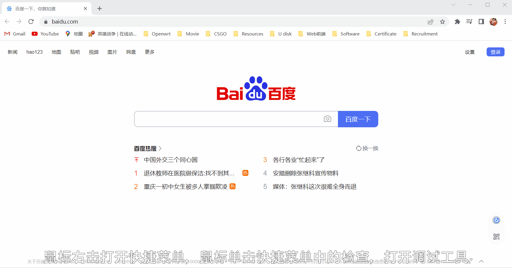
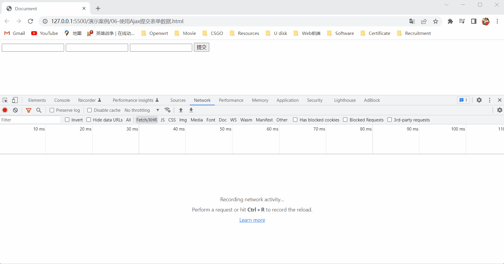
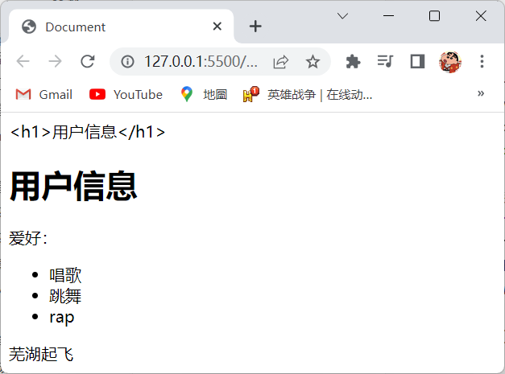
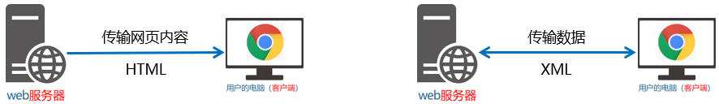
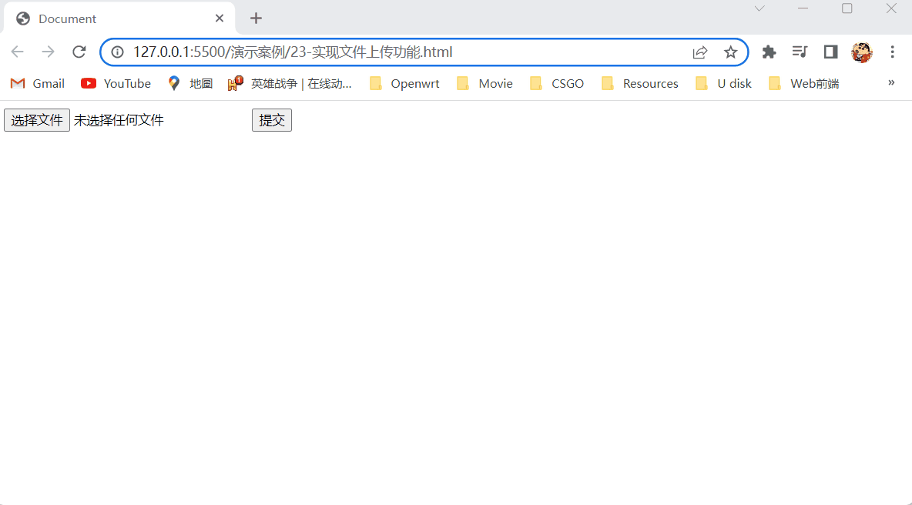

# 1.客户端与服务器

## 1.1上网的目的

- 上网的本质目的就是通过互联网的形式来获取和消费资源，如：刷微博、浏览新闻、在线听音乐等等。

## 1.2服务器

- 上网过程中，负责存放和对外提供资源的电脑，我们叫做服务器，如下图所示：

  

## 1.3客户端

- 上网过程中，负责获取和消费资源的电脑，我们叫做客户端，简单来说就是消费者使用的电脑，如下图所示：

  

# 2.URL地址

## 2.1URL地址的概念

- URL（UniformResourceLocator）的中文意思是统一资源定位符，它是用于标识互联网上每个资源的唯一存放位置，浏览器只有通过URL地址，才能正确定位到资源的存放位置，从而成功访问到对应的资源，简单来说就是URL地址相当于网站的身份证号，我们可以通过该身份证号来访问对应的网站。
- 常见的URL地址：
  - 百度：http://www.baidu.com。
  - 淘宝：http://www.taobao.com。

## 2.2URL地址的组成部分

- URL地址由客户端与服务器之间的通信协议、存有该资源的服务器名称、资源在服务器上具体的存放位置，这三部分组成，如下图所示：

  

# 3.客户端与服务器的通信过程

## 3.1图解客户端与服务器的通信过程

- 客户端与服务器的通信过程如下：

  1. 用户的电脑（客户端）：
     1. 打开浏览器。
     2. 输入要访问的网站地址，如：http://www.baidu.com。
     3. 敲击回车，向服务器发起资源请求。

  2. 服务器处理客户端发起的资源请求：
     1. 服务器接收到客户端发来的资源请求。
     2. 服务器在内部处理这次请求，找到相关的资源。
     3. 服务器把找到的相关资源，响应（发送）给客户端。

- 注意点：

  - 客户端与服务器之间的通信过程，分为请求、处理、响应三个步骤。
  - 网页中的每一个资源，都是通过请求、处理、响应的方式从服务器获取回来的。

- 图解客户端与服务器的通信过程，如下图所示：

  

## 3.2基于浏览器的开发者工具分析通信过程

- 基于浏览器的开发者工具分析通信过程，如下图所示：

  

# 4.服务器对外提供了那些资源

## 4.1网页中常见的资源

- 网页中常见的资源如下：
  - 文字内容。
  - `Image` 图片。
  - `Audio` 音频。
  - `Video` 视频。

## 4.2数据也是资源

- 网页中的数据，也是服务器对外提供的一种资源，如：股票数据、各行业的排行榜等等。

## 4.3数据是网页的灵魂

- 网页的组成：
  - HTML相当于是网页的骨架。
  - CSS相当于是网页的颜值。
  - JavaScript相当于是网页的交互行为。
  - 数据相当于是网页的灵魂。
- 注意点：HTML、CSS、JavaScript皆为数据服务的，数据在网页中是无处不在的。

### 4.4网页中如何请求数据

- 数据，也是服务器对外提供的一种资源，只要是资源，必然要通过请求、处理、响应的方式来进行获取，所以如果我们要在网页中请求服务器上的数据资源时，则需要使用JavaScript中的 `XMLHttpRequest` 内置对象。

  > 注：`XMLHttpRequest` 简称 `xhr`，它是浏览器提供的JavaScript成员，我们可以通过 `XMLHttpRequest` 内置对象来请求服务器上的数据资源，又因为 `XMLHttpRequest` 内置对象是一个构造函数，所以我们需要实例化该对象，才能使用该对象中的属性和方法，如：`const xhrObj = new XMLHttpRequest()`。

### 4.5资源的请求方式

- 客户端请求服务器时，请求的方式有很多种，最常见的两种请求方式分别为 `get` 和 `post` 请求，它们的区别如下：
  - `get` 请求通常用于获取服务端中的资源也就是向服务器要资源，如：客户端如果发送了 `get` 请求，那么 `get` 请求就会根据URL地址，来从服务器中获取HTML文件、CSS文件、JavaScript文件、图片文件、数据资源等。
  - `post` 请求通常用于向服务器提交数据也就是往服务器发送资源，如：登录时，客户端需要向服务器提交登录信息、这时客户端就要发送 `post` 请求，客户端注册和添加用户时，也是同理。

# 5.Ajax

## 5.1Ajax简介

- Ajax的全称是Asynchronous JavaScript And XML，翻译成中文就是异步JavaScript和XML，简单来说Ajax就是在网页中利用 `XMLHttpRequest` 对象和服务器进行数据交互的方式。

## 5.2为什么要学Ajax

- 我们所学的HTML、CSS、JavaScript，只能把网页做的更美观漂亮或添加一些动画效果，但是Ajax能让我们轻松实现网页与服务器之间的数据交互，如下图所示：

  

## 5.3Ajax的典型应用场景

- Ajax的典型应用场景如下：

  - 用户名检测：注册用户时，通过Ajax的形式，动态检测用户名是否被占用，如下图所示：

    

  - 搜索提示：当输入搜索关键字时，通过Ajax的形式，动态加载搜索提示列表，如下图所示：

    

  - 数据分页显示：当点击页码值的时候，通过Ajax的形式，根据页码值动态刷新表格的数据，如下图所示：

    

  - 数据的增删改查：数据的添加、删除、修改、查询操作，都需要通过Ajax的形式，来实现数据的交互，如下图所示：

    

# 6.jQuery中的Ajax

## 6.1jQuery中的Ajax的简介

- JavaScript中提供的 `XMLHttpRequest` 内置对象来发起Ajax请求，但是该对象的用法比较复杂，所以jQuery对该队进行了封装，并且提供了一系列Ajax相关的函数，这样极大地降低了Ajax的使用难度。
- jQuery中发起Ajax请求最常用的三个方法如下：
  1. `$.get()` 方法：向服务器获取数据。
  2. `$.post()` 方法：向服务器发送数据。
  3. `$.ajax()` 方法：既可以向服务器获取数据也可以向服务器发送数据。

## 6.2 `$.get()` 方法

- 我们可以使用 `jQuery` 对象中的 `get()` 方法来发起 `get` 请求，`jQuery` 对象中 `get()` 方法的功能单一，它是专门用于发起 `get` 请求，从而使客户端将服务器上的资源获取过来进行使用。

- 语法：

  ```javascript
  $.get('URL',[data],[callback]);
  ```

- 取值：

  |            | 取值                       | 作用                                     |
  | :--------: | -------------------------- | ---------------------------------------- |
  |   `URL`    | 用户自定义，只能是URL地址  | 客户端向那个URL地址发起 `get` 请求       |
  |   `data`   | 用户自定义                 | 客户端在发起 `get` 请求时，要携带的参数  |
  | `callback` | 用户自定义，只能是匿名函数 | `get` 请求在请求成功后，要执行的回调函数 |

- 注意点：

  - `$.get('URL',[data],[callback])` 方法中被中括号包裹起来的参数可写可不写。

  - 当使用 `$.get()` 方法发起 `get` 请求，并且要携带参数时，要携带的参数只能是以对象的形式来携带，如：`$.get('http://www.liulongbin.top:3006/api/getbooks',{id: 1},function() {})`。

  - 当使用 `$.get()` 方法发起 `get` 请求，并且请求成功后，`$.get()` 方法会将从服务器上获取的数据，传递给回调函数，所以回调函数的括号内的第一个形参中存储的就是使用 `$.get()` 方法从服务器上获取的数据，又因为使用 `$.get()` 方法从服务器上获取的数据是以对象的形式来存储的，所以回调函数的括号内的第一个形参的名字就是该对象的对象名，一般我们会将回调函数的括号内的第一个形参的名字设置为 `res`。

  - 我们可以使用浏览器的开发者工具，来查看客户端发起的Ajax请求，如下图所示：

    

- 使用 `$.get()` 方法发起不带参数的请求，演示代码如下：

  > 注：使用 `$.get()` 方法发起不带参数的请求时，直接书写请求的URL地址和请求成功之后的回调函数即可。

  ```html
  <!DOCTYPE html>
  <html lang="en">
  <head>
      <meta charset="UTF-8">
      <meta http-equiv="X-UA-Compatible" content="IE=edge">
      <meta name="viewport" content="width=device-width, initial-scale=1.0">
      <title>Document</title>
  </head>
  <body>
      <button>发起不带参数的get请求</button>
      <script src="./js/jQuery-min.js"></script>
      <script>
          $('button').on('click',function() {
              $.get('http://www.liulongbin.top:3006/api/getbooks',function(res) {
                  console.log(res);
              });
          })
      </script>
  </body>
  </html>
  ```

- 演示结果：

  

- 使用 `$.get()` 方法发起带参数的请求，演示代码如下：

  ```html
  <!DOCTYPE html>
  <html lang="en">
  <head>
      <meta charset="UTF-8">
      <meta http-equiv="X-UA-Compatible" content="IE=edge">
      <meta name="viewport" content="width=device-width, initial-scale=1.0">
      <title>Document</title>
  </head>
  <body>
      <button>发起带参数的get请求</button>
      <script src="./js/jQuery-min.js"></script>
      <script>
          $('button').on('click',function() {
              $.get('http://www.liulongbin.top:3006/api/getbooks',{id: 376},function(res) {
                  console.log(res);
              });
          })
      </script>
  </body>
  </html>
  ```

- 演示结果：

  

## 6.3 `$.post()` 方法

- 我们可以使用 `jQuery` 对象中的 `post()` 方法来发起 `post` 请求，`jQuery` 对象中 `post()` 方法的功能单一，它是专门用于发起 `post` 请求，从而将客户端要发送给服务器的数据，发送给服务器。

- 语法：

  ```javascript
  $.post('URL',[data],[callback]);
  ```

- 取值：

  |            | 取值                       | 作用                                             |
  | :--------: | -------------------------- | ------------------------------------------------ |
  |   `URL`    | 用户自定义，只能是URL地址  | 客户端向那个URL地址发起 `post` 请求              |
  |   `data`   | 用户自定义                 | 客户端在发起 `post` 请求时，要向服务器发送的数据 |
  | `callback` | 用户自定义，只能是匿名函数 | `post` 请求在请求成功后，要执行的回调函数        |

- 注意点：

  - `$.post('URL',[data],[callback])` 方法中被中括号包裹起来的参数可写可不写。

  - 当使用 `$.post()` 方法发起 `post` 请求时，要向服务器发送的数据只能是以对象的形式来存储，如：`$.post('http://www.liulongbin.top:3006/api/addbook',{id: 1,name: '张三'},function() {})`。

  - 当使用 `$.post()` 方法发起 `post` 请求，并且请求成功后，`$.post()` 方法会将请求成功的信息，传递给回调函数，所以回调函数的括号内的第一个形参中存储的就是请求成功的信息，又因为请求成功的信息是以对象的形式来存储的，所以回调函数的括号内的第一个形参的名字就是该对象的对象名，一般我们会将回调函数的括号内的第一个形参的名字设置为 `res`。

  - 我们可以使用浏览器的开发者工具，来查看客户端发起的Ajax请求，如下图所示：

    

- 演示代码：

  ```html
  <!DOCTYPE html>
  <html lang="en">
  <head>
      <meta charset="UTF-8">
      <meta http-equiv="X-UA-Compatible" content="IE=edge">
      <meta name="viewport" content="width=device-width, initial-scale=1.0">
      <title>Document</title>
  </head>
  <body>
      <button>发起post请求</button>
      <script src="./js/jQuery-min.js"></script>
      <script>
          $('button').on('click',function() {
              $.post('http://www.liulongbin.top:3006/api/addbook',{bookname: '安徒生',author: '安徒生',publisher: '北京图书出版社'},function(res) {
                  console.log(res);
              });
          })
      </script>
  </body>
  </html>
  ```

- 演示结果：

  

## 6.4 `$.ajax()` 方法

- 我们可以使用 `jQuery` 对象中的 `ajax()` 方法来发起 `get` 请求或 `post` 请求。

- 语法：

  ```javascript
  $.ajax({
      type: '请求的方式',
      url: '请求的地址',
      data: {请求时要携带的数据},
      success: 回调函数
  })
  ```

- 取值：

  |                    | 取值                               | 作用                                                         |
  | :----------------: | ---------------------------------- | ------------------------------------------------------------ |
  |     请求的方式     | 用户自定义，只能是 `GET` 或 `POST` | 设置 `$.ajax()` 方法发起什么请求                             |
  |     请求的地址     | 用户自定义，只能是URL地址          | 客户端向那个URL地址发起请求                                  |
  | 请求时要携带的数据 | 用户自定义                         | 如果请求的方式是 `GET`，那么就是客户端在发起 `get` 请求时，要携带的参数，如果请求的方式是 `POST`，那么就是客户端在发起 `post` 请求时，要向服务器发送的数据 |
  |      回调函数      | 用户自定义，只能是匿名函数         | 在请求成功后，要执行的回调函数                               |

- 注意点：

  - 当使用 `$.ajax()` 方法发起 `get` 请求，并且要携带参数时，要携带的参数只能是以对象的形式来存储，如：``$.ajax({type: 'GET',url: 'http://www.liulongbin.top:3006/api/getbooks',data: {id: 1},success: function() {}})`。

  - 当使用 `$.ajax()` 方法发起 `post` 请求时，要向服务器发送的数据只能是以对象的形式来存储，如：`$.ajax({type: 'POST',url: 'http://www.liulongbin.top:3006/api/addbook',data: {id: 1,name: '张三'},success: function() {}})`。

  - 当使用 `$.ajax()` 方法发起 `get` 请求，并且请求成功后，`$.ajax()` 方法会将从服务器上获取的数据，传递给回调函数，所以回调函数的括号内的第一个形参中存储的就是使用 `$.ajax()` 方法从服务器上获取的数据，又因为使用 `$.ajax()` 方法从服务器上获取的数据是以对象的形式来存储的，所以回调函数的括号内的第一个形参的名字就是该对象的对象名，一般我们会将回调函数的括号内的第一个形参的名字设置为 `res`。

  - 当使用 `$.ajax()` 方法发起 `post` 请求，并且请求成功后，`$.ajax()` 方法会将请求成功的信息，传递给回调函数，所以回调函数的括号内的第一个形参中存储的就是请求成功的信息，又因为请求成功的信息是以对象的形式来存储的，所以回调函数的括号内的第一个形参的名字就是该对象的对象名，一般我们会将回调函数的括号内的第一个形参的名字设置为 `res`。

  - 我们可以使用浏览器的开发者工具，来查看客户端发起的Ajax请求，如下图所示：

    

- 使用 `$.ajax()` 方法发起 `get` 请求，演示代码如下：

  > 注：使用 `$.ajax()` 方法发起 `get` 请求时，只需要将 `type` 属性的属性值设置为 `GET` 即可。

  ```html
  <!DOCTYPE html>
  <html lang="en">
  <head>
      <meta charset="UTF-8">
      <meta http-equiv="X-UA-Compatible" content="IE=edge">
      <meta name="viewport" content="width=device-width, initial-scale=1.0">
      <title>Document</title>
  </head>
  <body>
      <button>发起get请求</button>
      <script src="./js/jQuery-min.js"></script>
      <script>
          $('button').on('click',function() {
              $.ajax({
                  type: 'GET',
                  url: 'http://www.liulongbin.top:3006/api/getbooks',
                  data: {id: 388},
                  success: function(res) {
                      console.log(res);
                  }
              });
          })
      </script>
  </body>
  </html>
  ```

- 演示结果：

  

- 使用 `$.ajax()` 方法发起 `post` 请求，演示代码如下：

  > 注：使用 `$.ajax()` 方法发起 `post` 请求时，只需要将 `type` 属性的属性值设置为 `POST` 即可。

  ```html
  <!DOCTYPE html>
  <html lang="en">
  <head>
      <meta charset="UTF-8">
      <meta http-equiv="X-UA-Compatible" content="IE=edge">
      <meta name="viewport" content="width=device-width, initial-scale=1.0">
      <title>Document</title>
  </head>
  <body>
      <button>发起post请求</button>
      <script src="./js/jQuery-min.js"></script>
      <script>
          $('button').on('click',function() {
              $.ajax({
                  type: 'POST',
                  url: 'http://www.liulongbin.top:3006/api/addbook',
                  data: {bookname: '安徒生',author: '安徒生',publisher: '北京图书出版社'},
                  success: function(res) {
                      console.log(res);
                  }
              });
          })
      </script>
  </body>
  </html>
  ```

- 演示结果：

  

# 7.接口

## 7.1接口的概念

- 在使用Ajax请求数据时，被请求的URL地址就叫做数据接口，我们简称为接口，要注意每个接口必须要有请求方式，如：http://www.liulongbin.top:3006/api/getbooks是获取图书列表的接口，它的请求方式必须是 `get` 请求，http://www.liulongbin.top:3006/api/addbook是添加图书的接口，它的请求方式必须是 `post` 请求。

## 7.2分析接口的请求过程

### 7.2.1通过 `get` 方式请求接口的过程

- 通过 `get` 方式请求接口的过程，如下图所示：

  

### 7.2.2通过 `post` 方式请求接口的过程

- 通过 `get` 方式请求接口的过程，如下图所示：

  

## 7.3接口测试工具

### 7.3.1什么是接口测试工具

- 接口测试工具就是验证接口能否被正常访问的工具，我们常常需要使用接口测试工具，来对数据接口进行检测，接口测试工具的好处就是能让我们在不写任何代码的情况下，对接口进行调用和测试。

- 我们常用的接口测试工具就是Postman。

### 7.3.2Postman工具简介

- Postman是一个接口测试工具，它可以让我们在不写任何代码的情况下，对接口进行调用和测试。

  > 注：Postman官网地址为：https://www.postman.com/。

- Postman的使用步骤：

  1. 下载和安装Postman，如下图所示：

     

  2. Postman界面功能，如下图所示：

     

  3. 使用Postman测试 `get` 接口，如下图所示：

     

  4. 使用Postman测试 `post` 接口，如下图所示：

     

## 7.4接口文档

### 7.4.1什么是接口文档

- 接口文档，顾名思义就是接口的说明文档，它是我们调用接口的依据，好的接口文档应当包含接口的URL地址，参数以及输出的内容的说明，我们参照接口文档就能方便的知道接口的作用，以及接口是如何进行调用的。

### 7.4.2接口文档的组成部分

- 接口文档可以包含很多信息，也可以按需进行精简，不过一个合格的接口文档，都应当包含以下6项内容，从而为接口的调用提供依据：

  - 接口名称：用来标识各个接口的简单说明，如：登录接口，获取图书列表接口等。
  - 接口的URL地址：接口的调用地址。
  - 调用方式：接口的调用方式，如：`get` 请求或 `post` 请求。
  - 参数格式：接口需要传递的参数，每个参数必须包含参数名称、参数类型、是否必选、参数说明这4项内容。
  - 响应格式：接口的返回值的详细描述，一般包含数据名称、数据类型、说明这3项内容。
  - 返回示例（可选）：通过对象的形式，例举服务器返回数据的结构。


### 7.4.3接口文档案例

- 接口文档案例，如下图所示：

  

  

  

## 7.5图书管理案例

- 实现图书管理。

- 图书管理案例的实现步骤：

  1. 声明一个渲染函数。
  2. 删除图书模块。
  3. 添加图书模块。

- 演示代码：

  ```html
  <!DOCTYPE html>
  <html lang="en">
  <head>
      <meta charset="UTF-8">
      <meta http-equiv="X-UA-Compatible" content="IE=edge">
      <meta name="viewport" content="width=device-width, initial-scale=1.0">
      <title>图书管理案例</title>
      <link rel="stylesheet" href="./css/bootstrap.min.css">
  </head>
  <body>
      <div class="panel panel-primary">
          <div class="panel-heading">
              <h3 class="panel-title">添加新图书</h3>
          </div>
          <div class="panel-body form-inline">
              <div class="input-group">
                  <div class="input-group-addon">书名</div>
                  <input type="text" class="form-control" id="iptBookname" placeholder="请输入书名">
              </div>
              <div class="input-group">
                <div class="input-group-addon">作者</div>
                <input type="text" class="form-control" id="iptAuthor" placeholder="请输入作者">
              </div>
              <div class="input-group">
                <div class="input-group-addon">出版社</div>
                <input type="text" class="form-control" id="iptPublisher" placeholder="请输入出版社">
              </div>
              <button id="btnAdd" class="btn btn-primary">添加</button>
          </div>
      </div>
      <table class="table table-bordered table-hover">
          <thead>
              <tr>
                  <th>Id</th>
                  <th>书名</th>
                  <th>作者</th>
                  <th>出版社</th>
                  <th>操作</th>
              </tr>
          </thead>
          <tbody id="tb"></tbody>
      </table>
      <script src="./js/jQuery-min.js"></script>
      <script>
          // 声明一个渲染函数。
          function getbooks() {
              $.get('http://www.liulongbin.top:3006/api/getbooks',function(res) {
                  let arr = [];
                  if (res.status !== 200) return alert('获取失败');
                  $.each(res.data,function(index,ele) {
                      arr.push('<tr><td>' + ele.id + '</td><td>' + ele.bookname + '</td><td>' + ele.author + '</td><td>' + ele.publisher + '</td><td><a href="javascript:;" data-id="'+ ele.id +'">删除</a></td></tr>')
                  });
                  $('#tb').empty().append(arr.join(''));
              });
          }
          getbooks();
          // 删除图书模块。
          $('tbody').on('click','a',function() {
              let id = $(this).attr('data-id');
              $.get('http://www.liulongbin.top:3006/api/delbook',{id: id},function(res) {
                  if (res.status !== 200) return alert('删除失败');
                  getbooks();
              });
          });
          // 添加图书模块。
          $('button').on('click',function() {
              if ($('#iptBookname').val() && $('#iptAuthor').val() && $('#iptPublisher').val()) {
                  $.post('http://www.liulongbin.top:3006/api/addbook',{
                      bookname: $('#iptBookname').val().trim(),
                      author: $('#iptAuthor').val().trim(),
                      publisher: $('#iptPublisher').val().trim()
                  },function(res) {
                      if (res.status !== 201) return alert('添加图书失败');
                      $('#iptBookname').val('');
                      $('#iptAuthor').val('');
                      $('#iptPublisher').val('');
                      getbooks();
                  });
              } else {
                  alert('请填写完图书信息');
              }
          });
      </script>
  </body>
  </html>
  ```

- 演示结果：

  

## 7.6聊天机器人案例

- 实现聊天机器人功能。

- 聊天机器人案例的实现步骤：

  1. 初始化右侧滚动条。
  2. 发送模块。
  3. 获取结果模块。
  4. 把结果转换成语音。

- 演示代码：

  ```html
  <!DOCTYPE html>
  <html lang="en">
  <head>
      <meta charset="UTF-8">
      <meta http-equiv="X-UA-Compatible" content="IE=edge">
      <meta name="viewport" content="width=device-width, initial-scale=1.0">
      <title>聊天机器人案例</title>
      <link rel="stylesheet" href="./css/reset.css">
      <link rel="stylesheet" href="./css/main.css">
      <script src="./js/jquery-1.12.4.min.js"></script>
      <script src="./js/jquery-ui.min.js"></script>
      <script src="./js/jquery.mousewheel.js"></script>
  </head>
  <body>
      <div class="wrap">
          <!-- 头部 Header 区域 -->
          <div class="header">
              <h3>小思同学</h3>
              
          </div>
          <!-- 中间 聊天内容区域 -->
          <div class="main">
              <ul class="talk_list" style="top: 0px;" id="talk_list">
                  <li class="left_word">
                      <span>你好</span>
                  </li>
              </ul>
              <div class="drag_bar" style="display: none;">
                  <div class="drager ui-draggable ui-draggable-handle" style="display: none; height: 412.628px;"></div>
              </div>
          </div>
          <!-- 底部 消息编辑区域 -->
          <div class="footer">
              
              <input type="text" placeholder="说的什么吧..." class="input_txt" id="ipt">
              <input type="button" value="发 送" class="input_sub" id="btnSend">
          </div>
      </div>
      <audio src="" id="voice" autoplay style="display: none;"></audio>
      <script type="text/javascript" src="./js/scroll.js"></script>
      <script>
          $(function() {
              // 初始化右侧滚动条
              // 这个方法定义在scroll.js中
              resetui();
              // 发送模块。
              $('#btnSend').on('click',function() {
                  let text = $('#ipt').val().trim();
                  console.log(text);
                  if (!text) return alert('输入的内容为空');
                  $('#talk_list').append('<li class="right_word"><span>'+ text +'</span></li>');
                  $('#ipt').val('');
                  resetui();
                  getmsg(text);
              });
              // 获取结果模块。
              function getmsg(text) {
                  $.ajax({
                      type: 'GET',
                      url: 'http://www.liulongbin.top:3006/api/robot',
                      data: {spoken: text},
                      success: function(res) {
                          if (res.message !== 'success') return alert('获取失败');
                          $('#talk_list').append('<li class="left_word"><span>'+ res.data.info.text +'</span></li>');
                          resetui();
                          getvoice(res.data.info.text);
                      }
                  })
              }
              // 把结果转换成语音。
              function getvoice(text) {
                  $.ajax({
                      type: 'GET',
                      url: 'http://www.liulongbin.top:3006/api/synthesize',
                      data: {text: text},
                      success: function(res) {
                          if (res.status === 200) {
                              $('#voice').prop('src',res.voiceUrl);
                          }
                      }
                  })
              }
              // 按下回车键也可以发送信息。
              $('#ipt').on('keydown',function(e) {
                  if (e.keyCode === 13) {
                      $('#btnSend').click();
                  }
              });
          });
      </script>
  </body>
  </html>
  ```

- 演示结果：

  

# 8.表单

## 8.1什么是表单

- 表单在网页中主要负责数据采集功能，如：登录页面采集用户输入的用户名和密码，HTML中的 `<form>` 标签，就是用于采集用户输入的信息，并且会通过 `<form>` 标签的提交操作，把采集到的信息提交到服务器端进行处理。

## 8.2表单的组成

- 表单的组成如下：
  - 表单域标签。
  - 表单控件。
  - 表单按钮。
- 注意点：表单控件是写在表单域标签中的。

## 8.3 `form` 标签的属性

- `<form>` 标签是用来采集数据的，而 `<form>` 标签的属性则是用来规定如何把采集到的数据发送到服务器。

- `<form>` 标签的属性有：

  |  属性名   | 属性值                                                       |
  | :-------: | ------------------------------------------------------------ |
  | `action`  | 用户自定义，只能是URL地址                                    |
  | `method`  | 用户自定义，只能是 `get`（默认值）、`post`                   |
  | `target`  | 用户自定义，只能是 `_blank`、`_self`（默认值）、`_parent`、`_top`、`framename` |
  | `enctype` | 用户自定义，只能是 `application/x-www-form-urlencoded`（默认值）、`multipart/form-data`、`text/plain` |

- `<form>` 标签的属性的作用如下：

  - `action` 属性：用于设置在提交表单时，将表单数据发送到那个URL地址中。

    > 注1：当 `<form>` 标签没有设置 `action` 属性时，`action` 属性的属性值默认会设置成当前HTML页面的URL地址。
    >
    > 注2：当提交表单后，HTML页面会立即跳转到 `action` 属性指定的URL地址。

  - `method` 属性：用于设置以那种请求方式将表单数据，提交到 `action` 属性指定的URL地址中。

    > 注：`get` 请求方式会将表单数据以URL地址的形式，提交到 `action` 属性指定的URL地址中，这会导致表单数据直接显示在URL地址中，这是不安全的，所以 `get` 请求方式适合用来提交少量的、简单的数据，而 `post` 请求方式适合用来提交大量的、复杂的、包含文件上传的数据，因为 `post` 请求方式不会将表单数据显示在URL地址中，所以在实际开发中，`<form>` 标签使用 `post` 请求方式用的最多，很少会用 `get` 请求方式，如：登录、注册、添加数据等表单操作，都需要使用 `post` 请求方式来提交表单。

  - `target` 属性：用于设置打开 `action` 属性指定的URL地址的方式。

    - `_blank`：设置在新窗口中打开 `action` 属性指定的URL地址。
    - `_self`：设置在当前窗口中打开 `action` 属性指定的URL地址。
    - `_parent`：设置在父浏览器中打开 `action` 属性指定的URL地址。
    - `_top`：设置在整个窗口中打开 `action` 属性指定的URL地址。
    - `framename`：设置在指定浏览器中打开指定的URL地址。

  - `enctype`：用于设置在发送表单数据之前如何对表单数据进行编码。

    - `application/x-www-form-urlencoded`：设置在发送表单数据前，编码所有字符。
    - `multipart/form-data`：设置在发送表单数据前，不对字符进行编码。
    - `text/plain`：设置在发送表单数据前，将空格转换为加号，但不对特殊字符进行编码。

    > 注：在涉及到文件上传的操作时，必须要将 `enctype` 属性的属性值设置为 `multipart/form-data`，如果提交表单时，不涉及到文件上传操作，则直接将 `enctype` 属性的属性值设置为 `application/x-www-form-urlencoded` 即可。

## 8.4表单的同步提交

- 点击表单按钮，会触发表单提交的操作，这会导致HTML页面跳转到表单的 `action` 属性指定的URL地址，这种行为就叫做表单的同步提交。
- 表单的同步提交的缺点：表单同步提交后，HTML页面会发生跳转，会跳转到表单的 `action` 属性指定的URL地址，这会导致用户体验很差，并且表单同步提交后，HTML页面之前的状态和数据都会丢失，但是我们可以通过使用Ajax将表单数据提交到指定的URL地址中，让表单只负责采集数据来解决表单的同步提交的缺点。

## 8.5使用Ajax提交表单数据

- 使用Ajax提交表单数据的步骤如下：

  1. 监听表单的提交事件：

     - 我们可以使用 `submit` 事件类型来监听表单的提交事件。

     - 语法：

       ```javascript
       $('CSS选择器').on('submit',function() {
           // 函数体
       });
       ```

     - CSS选择器的取值：用户自定义，只能是我们学习的CSS选择器，如：类选择器、标签名选择器等。

  2. 阻止表单提交事件的默认行为：

     - 当表单触发提交事件时，会提交表单数据到表单的 `action` 属性指定的URL地址中，并且HTML页面会跳转到表单的 `action` 属性指定的URL地址，这个HTML页面跳转就是表单触发提交事件时的默认行为，所以我们要阻止该默认行为的发生，我们可以使用事件对象中的 `preventDefault()` 方法来阻止该默认行为的发生。

     - 语法：

       ```javascript
       $('CSS选择器').on('submit',function(e) {
           e.preventDefault();
       });
       ```

     - CSS选择器的取值：用户自定义，只能是我们学习的CSS选择器，如：类选择器、标签名选择器等。

  3. 快速获取表单数据：

     - 当表单中有很多个表单控件时，如果我们一个个获取这些表单控件中的表单数据时，会很麻烦，所以我们可以使用表单元素的 `jQuery` 对象中的 `serialize()` 方法来一次性获取表单元素中的所有的表单数据。

     - 语法：

       ```javascript
       $('CSS选择器').serialize();
       ```

     - CSS选择器的取值：用户自定义，只能是我们学习的CSS选择器，如：类选择器、标签名选择器等。

     - 注意点：

       - `serialize()` 方法获取的表单元素中的所有的表单数据的格式是键值对的形式，并且每个键值对之间用 `&` 进行分隔，如：`username='张三'&age=18`。
       - 在使用 `serialize()` 方法一次性获取表单元素中的所有的表单数据时，必须为该表单元素中的每一个表单控件添加 `name` 属性，因为 `serialize()` 方法在获取表单元素中的所有的表单数据时，获取的表单数据的格式是键值对的形式，而表单控件的 `name` 属性的属性值就是该表单控件的表单数据的键名，所以表单元素中的每一个表单控件必须添加 `name` 属性。

  4. 使用Ajax来提交表单数据：

     - 演示代码：

       ```html
       <!DOCTYPE html>
       <html lang="en">
       <head>
           <meta charset="UTF-8">
           <meta http-equiv="X-UA-Compatible" content="IE=edge">
           <meta name="viewport" content="width=device-width, initial-scale=1.0">
           <title>Document</title>
       </head>
       <body>
           <form>
               <input type="text" name="bookname">
               <input type="text" name="author">
               <input type="text" name="publisher">
               <button type="submit">提交</button>
           </form>
           <script src="./js/jQuery-min.js"></script>
           <script>
               $('form').on('submit',function(e) {
                   e.preventDefault();
                   console.log($(this).serialize());
                   $.post('http://www.liulongbin.top:3006/api/addbook',$(this).serialize(),function(res) {
                       console.log(res);
                   });
               });
           </script>
       </body>
       </html>
       ```

     - 演示结果：

       

## 8.6评论列表案例

- 实现评论功能。

- 评论列表的实现步骤：

  1. 声明一个渲染列表函数。
  2. 发布评论模块。
  3. 将表单元素的 `jQuery` 对象转换成 `DOM` 对象才能使用 `reset()` 方法。

- 演示代码：

  ```html
  <!DOCTYPE html>
  <html lang="en">
  <head>
      <meta charset="UTF-8">
      <meta http-equiv="X-UA-Compatible" content="IE=edge">
      <meta name="viewport" content="width=device-width, initial-scale=1.0">
      <title>评论列表案例</title>
      <link rel="stylesheet" href="./css/bootstrap.min.css">
  </head>
  <body>
      <div class="panel panel-primary">
          <div class="panel-heading">
              <h3 class="panel-title">发表评论</h3>
          </div>
          <form class="panel-body" id="formAddCmt">
              <div>评论人：</div>
              <input type="text" class="form-control" name="username" autocomplete="off" />
              <div>评论内容：</div>
              <textarea class="form-control" name="content"></textarea>
              <button type="submit" class="btn btn-primary">发表评论</button>
          </form>
      </div>
      <ul class="list-group" id="cmt-list"></ul>
      <script src="./js/jQuery-min.js"></script>
      <script>
          // 声明一个渲染列表函数。
          function getdata() {
              $.ajax({
                  type: 'GET',
                  url: 'http://www.liulongbin.top:3006/api/cmtlist',
                  success: function(res) {
                      if (res.status === 200) {
                          let arr = [];
                          $.each(res.data,function(index,ele) {
                              arr.push('<li class="list-group-item"><span class="badge" style="background-color: #F0AD4E;">评论时间：' + ele.tiem + '</span><span class="badge" style="background-color: #5BC0DE;">评论人：' + ele.username + '</span>' + ele.content + '</li>');
                          });
                          $('#cmt-list').empty().html(arr.join(''));
                      } else {
                          alert('获取评论列表失败');
                      }
                  }
              });
          }
          getdata();
          // 发布评论模块。
          $('form').on('submit',function(e) {
              e.preventDefault();
              let data = $(this).serialize();
              console.log(data);
              $.ajax({
                  type: 'POST',
                  url: 'http://www.liulongbin.top:3006/api/addcmt',
                  data: data,
                  success: function(res) {
                      if (res.status === 201) {
                          getdata();
                          $('form')[0].reset();// 将表单元素的jQuery对象转换成DOM对象才能使用reset()方法。
                      } else {
                          alert('发表评论失败');
                      }
                  }
              })
          })
      </script>
  </body>
  </html>
  ```

- 演示结果：

  

# 9.模板引擎

## 9.1为什么需要模板引擎

- 如果通过字符串拼接的形式，来渲染UI结构，当UI结构比较复杂时，在拼接字符串的时候就需要格外注意引号之间的嵌套，并且如果一旦需求发生变化，修改起来也会非常麻烦，如以下代码所示：

  ```javascript
  let arr = [];
  $.each(res.data, function (index, ele) {
      arr.push('<li class="list-group-item"><span class="badge" style="background-color: #F0AD4E;">评论时间：' + ele.tiem + '</span><span class="badge" style="background-color: #5BC0DE;">评论人：' + ele.username + '</span>' + ele.content + '</li>');
  $('#cmt-list').empty().html(arr.join(''));
  ```

  > 注：我们可以使用模板引擎来解决上述的问题。

## 9.2什么是模板引擎

- 模板引擎，顾名思义，它可以根据程序员指定的模板结构和数据，自动生成一个完整的HTML页面，如下图所示：

  

## 9.3模板引擎的优点

- 模板引擎的优点有：
  - 减少了字符串的拼接操作。
  - 使代码结构更清晰。
  - 使代码更易于阅读与维护。

## 9.4art-template模板引擎

### 9.4.1art-template模板引擎的简介

- art-template模板引擎是一个简约、超快的模板引擎，如下图所示：

  

- art-template模板引擎的中文网址为：http://aui.github.io/art-template/zh-cn/index.html。

### 9.4.2art-template模板引擎的使用

- art-template模板引擎的使用步骤如下：

  1. 下载模板引擎文件，如下图所示：

     

  2. 解压模板引擎文件，将template-web.js文件复制到项目中，再将template-web.js文件引入到HTML页面中，如下图所示：

     

  3. 定义数据，并且数据要以对象的形式进行存储，如以下代码所示：

     ```html
     <!DOCTYPE html>
     <html lang="en">
     <head>
         <meta charset="UTF-8">
         <meta http-equiv="X-UA-Compatible" content="IE=edge">
         <meta name="viewport" content="width=device-width, initial-scale=1.0">
         <title>Document</title>
     </head>
     <body>
         <script src="./js/template-web.js"></script>
         <script>
             // 定义数据。
             const obj = {
                 title: '用户信息',
                 uname: '张三',
                 age: 19,
                 isVIP: true,
                 regTime: new Date(),
                 happy: ['唱歌','跳舞','rap']
             }
         </script>
     </body>
     </html>
     ```

  4. 定义模板，模板必须要写在 `<script>` 标签中，并且要给 `<script>` 标签添加 `type="text/html"` 属性，因为 `<script>` 标签中是书写JavaScript代码的，所以它的 `type` 属性的属性值默认为 `text/javascript`，而模板是HTML标签，所以要将HTML标签写在 `<script>` 标签中就需要将 `<script>` 标签的 `type` 属性的属性值修改成 `text/html`，如以下代码所示：

     ```html
     <!DOCTYPE html>
     <html lang="en">
     <head>
         <meta charset="UTF-8">
         <meta http-equiv="X-UA-Compatible" content="IE=edge">
         <meta name="viewport" content="width=device-width, initial-scale=1.0">
         <title>Document</title>
     </head>
     <body>
         <script src="./js/template-web.js"></script>
         <!-- 定义模板 -->
         <script type="text/html">
             <div><h3></h3></div>
             <div>姓名：</div>
             <div>年龄：</div>
             <div>会员：</div>
             <div>注册时间：</div>
             <div>爱好：
                 <ul>
                     <li></li>
                     <li></li>
                     <li></li>
                 </ul>
             </div>
         </script>
         <script>
             // 定义数据。
             const obj = {
                 title: '用户信息',
                 uname: '张三',
                 age: 19,
                 isVIP: true,
                 regTime: new Date(),
                 happy: ['唱歌','跳舞','rap']
             }
         </script>
     </body>
     </html>
     ```

  5. 调用 `template()` 方法，`template()` 方法是当HTML页面引入了template-web.js文件后，才会有的方法，该方法是挂载到 `window` 对象中的，如以下代码所示：

     ```html
     <!DOCTYPE html>
     <html lang="en">
     <head>
         <meta charset="UTF-8">
         <meta http-equiv="X-UA-Compatible" content="IE=edge">
         <meta name="viewport" content="width=device-width, initial-scale=1.0">
         <title>Document</title>
     </head>
     <body>
         <script src="./js/template-web.js"></script>
         <!-- 定义模板 -->
         <script type="text/html" id="muban">
             <div><h3>{{title}}</h3></div>
             <div>姓名：{{uname}}</div>
             <div>年龄：{{age}}</div>
             <div>会员：{{isVIP}}</div>
             <div>注册时间：{{regTime}}</div>
             <div>爱好：
                 <ul>
                     <li>{{happy[0]}}</li>
                     <li>{{happy[1]}}</li>
                     <li>{{happy[2]}}</li>
                 </ul>
             </div>
         </script>
         <script>
             // 定义数据。
             const obj = {
                 title: '用户信息',
                 uname: '张三',
                 age: 19,
                 isVIP: true,
                 regTime: new Date(),
                 happy: ['唱歌','跳舞','rap']
             }
             // 调用template()方法。
             let str = template('muban',obj);
         </script>
     </body>
     </html>
     ```

     > 注：`template()` 方法是将数据传入到模板中，然后通过 `{{}}` 占位符来将数据和模板中的内容进行字符串拼接，然后再将模板中的内容返回给 `template()` 方法。
     >
     > - 语法：
     >
     >   ```javascript
     >   template('定义模板的<script>标签的id',要将那些数据传入到模板中);
     >   ```
     >
     > - 取值：
     >
     >   |                                   | 取值                                                         |
     >   | :-------------------------------: | :----------------------------------------------------------- |
     >   | 定义模板的 `<script>` 标签的 `id` | 用户自定义，只能是定义模板的 `<script>` 标签的 `id` 属性的属性值 |
     >   |     要将那些数据传入到模板中      | 用户自定义，只能是要将那些数据传入到模板中，这些数据的变量名 |
     >
     > - 注意点：
     >
     >   - 将数据传入模板中后，我们可以使用 `{{}}` 占位符来将数据和模板中的内容进行字符串拼接，如以下代码所示：
     >
     >     ```html
     >     <script src="./js/template-web.js"></script>
     >     <!-- 定义模板 -->
     >     <script type="text/html" id="muban">
     >     	<div><h3>{{title}}</h3></div>
     >     	<div>姓名：{{uname}}</div>
     >     	<div>年龄：{{age}}</div>
     >         <div>会员：{{isVIP}}</div>
     >         <div>注册时间：{{regTime}}</div>
     >         <div>爱好：
     >         	<ul>
     >         		<li>{{happy[0]}}</li>
     >                 <li>{{happy[1]}}</li>
     >                 <li>{{happy[2]}}</li>
     >         	</ul>
     >         </div>
     >     </script>
     >     <script>
     >         // 定义数据。
     >         const obj = {
     >             title: '用户信息',
     >             uname: '张三',
     >             age: 19,
     >             isVIP: true,
     >             regTime: new Date(),
     >             happy: ['唱歌','跳舞','rap']
     >         }
     >         let str = template('muban',obj);
     >     </script>
     >     ```
     >
     >   - `template()` 方法执行完毕后，会将模板中的内容返回给 `template()` 方法，并且返回的内容的数据类型是字符串类型。

  6. 渲染HTML结构，如以下代码所示：

     ```html
     <!DOCTYPE html>
     <html lang="en">
     <head>
         <meta charset="UTF-8">
         <meta http-equiv="X-UA-Compatible" content="IE=edge">
         <meta name="viewport" content="width=device-width, initial-scale=1.0">
         <title>Document</title>
     </head>
     <body>
         <div class="box"></div>
         <script src="./js/template-web.js"></script>
         <!-- 定义模板 -->
         <script type="text/html" id="muban">
             <div><h3>{{title}}</h3></div>
             <div>姓名：{{uname}}</div>
             <div>年龄：{{age}}</div>
             <div>会员：{{isVIP}}</div>
             <div>注册时间：{{regTime}}</div>
             <div>爱好：
                 <ul>
                     <li>{{happy[0]}}</li>
                     <li>{{happy[1]}}</li>
                     <li>{{happy[2]}}</li>
                 </ul>
             </div>
         </script>
         <script>
             // 定义数据。
             const obj = {
                 title: '用户信息',
                 uname: '张三',
                 age: 19,
                 isVIP: true,
                 regTime: new Date(),
                 happy: ['唱歌','跳舞','rap']
             }
             // 调用template()方法。
             let str = template('muban',obj);
             // 渲染页面结构。
             const div = document.querySelector('.box');
             div.innerHTML = str;
         </script>
     </body>
     </html>
     ```

- 演示代码：

  ```html
  <!DOCTYPE html>
  <html lang="en">
  <head>
      <meta charset="UTF-8">
      <meta http-equiv="X-UA-Compatible" content="IE=edge">
      <meta name="viewport" content="width=device-width, initial-scale=1.0">
      <title>Document</title>
  </head>
  <body>
      <div class="box"></div>
      <script src="./js/template-web.js"></script>
      <!-- 定义模板 -->
      <script type="text/html" id="muban">
          <div><h3>{{title}}</h3></div>
          <div>姓名：{{uname}}</div>
          <div>年龄：{{age}}</div>
          <div>会员：{{isVIP}}</div>
          <div>注册时间：{{regTime}}</div>
          <div>爱好：
              <ul>
                  <li>{{happy[0]}}</li>
                  <li>{{happy[1]}}</li>
                  <li>{{happy[2]}}</li>
              </ul>
          </div>
      </script>
      <script>
          // 定义数据。
          const obj = {
              title: '用户信息',
              uname: '张三',
              age: 19,
              isVIP: true,
              regTime: new Date(),
              happy: ['唱歌','跳舞','rap']
          }
          // 调用template()方法。
          let str = template('muban',obj);
          // 渲染页面结构。
          const div = document.querySelector('.box');
          div.innerHTML = str;
      </script>
  </body>
  </html>
  ```

- 演示结果：

  

### 9.4.2art-template模板引擎的标准语法

- art-template模板引擎提供了 `{{}}` 这种语法格式，我们可以在 `{{}}` 中进行输出或循环数组等操作，这种 `{{}}` 语法在art-template模板引擎中被称为标准语法。

- art-template模板引擎中的标准语法如下：

  - 输出：

    - 我们可以使用 `{{}}` 来输出 `template()` 方法传入模板中的数据。

    - 语法：

      ```javascript
      {{属性名}}
      {{对象名.属性名}}
      {{对象名['属性名']}}
      ```

      > 注：因为 `template()` 方法传入模板中的数据是以对象的形式存储的，所以我们可以直接在 `{{}}` 中书写该对象中的属性名来输出该对象中的该属性的属性值，并且如果该对象中存储着另一个对象，那么我们可以使用 `{{另一个对象的对象名.另一个对象中的属性的属性名}}` 或 `{{另一个对象的对象名['另一个对象中的属性的属性名']}}` 来输出另一个对象中的相对应的属性的属性值。

    - 注意点：

      - `{{}}` 只能写在定义模板的 `<script>` 标签中。
      - 我们还可以使用 `{{}}` 来输出三元表达式的结果，如：`{{'a' === 'a' ? 'b' : 'c'}}` 代码，`{{}}` 会输出结果 `b`。
      - 我们还可以使用 `{{}}` 来输出逻辑运算的结果，如：`{{0 || 1}}` 代码，`{{}}` 会输出结果 `1`。
      - 我们还可以使用 `{{}}` 来输出算术运算的结果，如：`{{0 + 1}}` 代码，`{{}}` 会输出结果 `1`。

    - 演示代码：

      ```html
      <!DOCTYPE html>
      <html lang="en">
      <head>
          <meta charset="UTF-8">
          <meta http-equiv="X-UA-Compatible" content="IE=edge">
          <meta name="viewport" content="width=device-width, initial-scale=1.0">
          <title>Document</title>
      </head>
      <body>
          <div class="box"></div>
          <script src="./js/template-web.js"></script>
          <!-- 定义模板 -->
          <script type="text/html" id="muban">
              <div><h3>{{title}}</h3></div>
              <div>爱好：
                  <ul>
                      <li>{{happy[0]}}</li>
                      <li>{{happy[1]}}</li>
                      <li>{{happy[2]}}</li>
                  </ul>
              </div>
              <div>{{wuhu.qf}}</div>
              {{'a' === 'a' ? 'b' : 'c'}}
              {{0 || 1}}
              {{0 + 1}}
          </script>
          <script>
              // 定义数据。
              const obj = {
                  title: '用户信息',
                  happy: ['唱歌','跳舞','rap'],
                  wuhu: {
                      qf: '芜湖起飞'
                  }
              }
              // 调用template()方法。
              let str = template('muban',obj);
              // 渲染页面结构。
              const div = document.querySelector('.box');
              div.innerHTML = str;
          </script>
      </body>
      </html>
      ```

    - 演示结果：

      

  - 原文输出：

    - 如果 `{{}}` 中要输出的内容中有HTML标签，那么要使用原文输出才能将HTML标签进行渲染，如果不使用原文输出，那么HTML标签将不会被渲染。

    - 语法：

      ```javascript
      {{@ 属性名}}
      {{@ 对象名.属性名}}
      {{@ 对象名['属性名']}}
      ```

    - 演示代码：

      ```html
      <!DOCTYPE html>
      <html lang="en">
      <head>
          <meta charset="UTF-8">
          <meta http-equiv="X-UA-Compatible" content="IE=edge">
          <meta name="viewport" content="width=device-width, initial-scale=1.0">
          <title>Document</title>
      </head>
      <body>
          <div class="box"></div>
          <script src="./js/template-web.js"></script>
          <!-- 定义模板 -->
          <script type="text/html" id="muban">
              <div>{{title}}</div>
              <div>{{@ title}}</div>
              <div>爱好：
                  <ul>
                      <li>{{happy[0]}}</li>
                      <li>{{happy[1]}}</li>
                      <li>{{happy[2]}}</li>
                  </ul>
              </div>
              <div>{{@ wuhu.qf}}</div>
          </script>
          <script>
              // 定义数据。
              const obj = {
                  title: '<h1>用户信息</h1>',
                  happy: ['唱歌','跳舞','rap'],
                  wuhu: {
                      qf: '芜湖起飞'
                  }
              }
              // 调用template()方法。
              let str = template('muban',obj);
              // 渲染页面结构。
              const div = document.querySelector('.box');
              div.innerHTML = str;
          </script>
      </body>
      </html>
      ```

    - 演示结果：

      

  - 条件输出：

    - 我们可以使用 `{{}}` 来根据条件输出想要的内容。

    - 语法：

      ```javascript
      // 语法一
      {{if 条件}}
      	// 条件为真时要输出的内容
      {{/if}}
      // 语法二
      {{if 条件1}}
      	// 条件1为真时要输出的内容
      {{else if 条件2}}
      	// 条件1不为真条件2为真时要输出的内容
      {{/if}}
      ```

    - 演示代码：

      ```html
      <!DOCTYPE html>
      <html lang="en">
      <head>
          <meta charset="UTF-8">
          <meta http-equiv="X-UA-Compatible" content="IE=edge">
          <meta name="viewport" content="width=device-width, initial-scale=1.0">
          <title>Document</title>
      </head>
      <body>
          <div class="box"></div>
          <script src="./js/template-web.js"></script>
          <!-- 定义模板 -->
          <script type="text/html" id="muban">
              <div><h3>{{title}}</h3></div>
              <div>爱好：
                  <ul>
                      <li>{{happy[0]}}</li>
                      <li>{{happy[1]}}</li>
                      <li>{{happy[2]}}</li>
                  </ul>
              </div>
              <div>{{wuhu.qf}}</div>
              <div>{{if isVIP === true}}是会员{{else if isVIP === false}}不是会员{{/if}}</div>
          </script>
          <script>
              // 定义数据。
              const obj = {
                  title: '用户信息',
                  happy: ['唱歌','跳舞','rap'],
                  isVIP: true,
                  wuhu: {
                      qf: '芜湖起飞'
                  }
              }
              // 调用template()方法。
              let str = template('muban',obj);
              // 渲染页面结构。
              const div = document.querySelector('.box');
              div.innerHTML = str;
          </script>
      </body>
      </html>
      ```

    - 演示结果：

      

  - 循环输出：

    - 我们可以使用 `{{}}` 来循环输出 `template()` 方法传入模板中的数组中的数据。

    - 语法：

      ```javascript
      {{each 要循环的数组}}
      	// 数据处理
      {{/each}}
      ```

    - 注意点：我们在循环输出时，可以使用 `{{$index}}` 来获取要循环的数组中的数据在数组中的索引号，使用 `{{$value}}` 来获取要循环的数组中的数据。

    - 演示代码：

      ```html
      <!DOCTYPE html>
      <html lang="en">
      <head>
          <meta charset="UTF-8">
          <meta http-equiv="X-UA-Compatible" content="IE=edge">
          <meta name="viewport" content="width=device-width, initial-scale=1.0">
          <title>Document</title>
      </head>
      <body>
          <div class="box"></div>
          <script src="./js/template-web.js"></script>
          <!-- 定义模板 -->
          <script type="text/html" id="muban">
              <div><h3>{{title}}</h3></div>
              <div>爱好：
                  <ul>
                      {{each happy}}<li>索引号：{{$index}}，数据：{{$value}}</li>{{/each}}
                  </ul>
              </div>
              <div>{{wuhu.qf}}</div>
          </script>
          <script>
              // 定义数据。
              const obj = {
                  title: '用户信息',
                  happy: ['唱歌','跳舞','rap'],
                  isVIP: true,
                  wuhu: {
                      qf: '芜湖起飞'
                  }
              }
              // 调用template()方法。
              let str = template('muban',obj);
              // 渲染页面结构。
              const div = document.querySelector('.box');
              div.innerHTML = str;
          </script>
      </body>
      </html>
      ```

    - 演示结果：

      

  - 过滤器：

    - 我们可以使用过滤器来处理 `{{}}` 中要输出的内容。

      > 注：过滤器的本质就是一个函数，它会将 `{{}}` 中要输出的内容传入到一个函数中，`{{}}` 中要输出的内容会经过该函数的处理，形成一个新内容，然后 `{{}}` 会输出这个新内容，如下图所示：
      >
      > 

    - 语法：

      ```javascript
      // 声明处理函数
      template.defaults.imports.函数名 = function(形参){
          // 数据处理
          return 处理好的数据;
      }
      {{要输出的内容 | 处理函数的函数名}}
      ```

    - 过滤器的执行流程，首先过滤器会将 `{{}}` 中要输出的内容传递给处理函数中的形参，然后处理函数会处理好传递过来的内容，当处理函数处理好传递过来的内容时，要将处理好的内容返回，然后 `{{}}` 输出的就是处理好的内容。

    - 注意点：处理函数一定要用 `return` 关键字将处理好的内容返回。

    - 演示代码：

      ```html
      <!DOCTYPE html>
      <html lang="en">
      <head>
          <meta charset="UTF-8">
          <meta http-equiv="X-UA-Compatible" content="IE=edge">
          <meta name="viewport" content="width=device-width, initial-scale=1.0">
          <title>Document</title>
      </head>
      <body>
          <div class="box"></div>
          <script src="./js/template-web.js"></script>
          <!-- 定义模板 -->
          <script type="text/html" id="muban">
              <div><h3>{{title}}</h3></div>
              <div>爱好：
                  <ul>
                      {{each happy}}<li>索引号：{{$index}}，数据：{{$value}}</li>{{/each}}
                  </ul>
              </div>
              <div>{{wuhu.qf | cl}}</div>
          </script>
          <script>
              template.defaults.imports.cl = function(text) {
                  return text + '乌鸦坐飞机'
              }
              // 定义数据。
              const obj = {
                  title: '用户信息',
                  happy: ['唱歌','跳舞','rap'],
                  isVIP: true,
                  wuhu: {
                      qf: '芜湖起飞'
                  }
              }
              // 调用template()方法。
              let str = template('muban',obj);
              // 渲染页面结构。
              const div = document.querySelector('.box');
              div.innerHTML = str;
          </script>
      </body>
      </html>
      ```

    - 演示结果：

      

## 9.5新闻列表案例

- 实现新闻列表功能。

- 新闻列表案例的实现步骤：

  1. 声明一个渲染函数。
  2. 定义模板。
  3. 将数据传入到模板中。

- 演示代码：

  ```html
  <!DOCTYPE html>
  <html lang="en">
  <head>
      <meta charset="UTF-8">
      <meta http-equiv="X-UA-Compatible" content="IE=edge">
      <meta name="viewport" content="width=device-width, initial-scale=1.0">
      <title>新闻列表案例</title>
      <link rel="stylesheet" href="./css/news.css">
  </head>
  <body>
      <div id="news-list"></div>
      <script src="./js/jQuery-min.js"></script>
      <script src="./js/template-web.js"></script>
      <!-- 定义模板 -->
      <script type="text/html" id="muban">
          {{each data}}
          <div class="news-item">
              
              <div class="right-box">
                  <h1 class="title">{{$value.title}}</h1>
                  <div class="tags">
                      {{each $value.tags}}
                      <span>{{$value}}</span>
                      {{/each}}
                  </div>
                  <div class="footer">
                      <div>
                          <span>{{$value.source}}</span>&nbsp;&nbsp;
                          <span>{{$value.time | datechuli}}</span>
                      </div>
                      <span>评论数：{{$value.cmtcount}}</span>
                  </div>
              </div>
          </div>
          {{/each}}
      </script>
      <script>
          function buling(num) {
              if (num < 10) {
                  return '0' + num;
              } else {
                  return num;
              }
          }
          template.defaults.imports.datechuli = function(times) {
              let time = new Date(times);
              let y = time.getFullYear();
              let m = buling(time.getMonth() + 1);
              let d = buling(time.getDate());
              let hh = buling(time.getHours());
              let mm = buling(time.getMinutes());
              let ss = buling(time.getSeconds());
              return `${y}-${m}-${d} ${hh}:${mm}:${ss}`;
          }
          // 声明一个渲染函数。
          function getdata() {
              $.ajax({
                  type: 'GET',
                  url: 'http://www.liulongbin.top:3006/api/news',
                  success: function(res) {
                      if (res.status === 200) {
                          for (let i = 0; i < res.data.length; i++) {
                              res.data[i].tags = res.data[i].tags.split(',');
                          }
                          // 将数据传入到模板中。
                          let str = template('muban',res);
                          $('#news-list').html(str);
                      } else {
                          alert('获取新闻失败');
                      }
                  }
              });
          }
          getdata();
      </script>
  </body>
  </html>
  ```

- 演示结果：

  

## 9.6模板引擎的实现原理

### 9.6.1正则表达式中的分组

- 在正则表达式中用括号包裹起来的内容就表示一个分组，我们可以通过分组来提取自己想要的内容。

- 演示代码：

  ```html
  <!DOCTYPE html>
  <html lang="en">
  <head>
      <meta charset="UTF-8">
      <meta http-equiv="X-UA-Compatible" content="IE=edge">
      <meta name="viewport" content="width=device-width, initial-scale=1.0">
      <title>Document</title>
  </head>
  <body>
      <script>
          let str = '<div>{{hello}}</div>';
          let pattern = /{{([a-zA-z]+)}}/;// 正则表达式分组
          console.log(pattern.exec(str));
      </script>
  </body>
  </html>
  ```

- 演示结果：

  

### 9.6.2实现简易的模板引擎

- 实现简易的模板引擎的步骤如下：

  1. 声明一个函数。
  2. 获取模板中的内容。
  3. 利用正则表达式将模板中的内容带有 `{{}}` 的内容转换成数据。
  4. 返回处理好的字符串。
  5. 调用函数。
  6. 渲染页面。

- 演示代码：

  ```html
  <!DOCTYPE html>
  <html lang="en">
  <head>
      <meta charset="UTF-8">
      <meta http-equiv="X-UA-Compatible" content="IE=edge">
      <meta name="viewport" content="width=device-width, initial-scale=1.0">
      <title>Document</title>
  </head>
  <body>
      <div class="box"></div>
      <script type="text/html" id="muban">
          <div>姓名：{{uname}}</div>
          <div>年龄：{{age}}</div>
      </script>
      <script>
          const obj = {
              uname: '张三',
              age: 19
          }
          // 声明一个函数。
          function template(id,data) {
              // 获取模板中的内容。
              let str = document.getElementById(id).innerHTML;
              let zz = /{{\s*([a-zA-Z]+)\s*}}/;
              // 利用正则表达式将模板中的内容带有{{}}的内容转换成数据。
              let pattResult = null;
              while (pattResult = zz.exec(str)) {
                  str = str.replace(pattResult[0],data[pattResult[1]]);
              }
              // 返回处理好的字符串。
              return str;
          }
          // 调用函数。
          let str = template('muban',obj);
          const div = document.querySelector('.box');
          // 渲染页面。
          div.innerHTML = str;
      </script>
  </body>
  </html>
  ```

- 演示结果：

  

# 10.XMLHttpRequest对象

## 10.1XMLHttpRequest对象的简介

- `XMLHttpRequest` 对象简称 `xhr` 对象，它是浏览器提供的JavaScript对象，通过它我们可以请求服务器上的数据资源，之前所学的jQuery中的Ajax函数，就是基于 `xhr` 对象封装出来的，如下图所示：

  

## 10.2使用XMLHttpRequest对象发起 `get` 请求

- 使用 `XMLHttpRequest` 对象发起 `get` 请求的步骤如下：

  1. 实例化 `XMLHttpRequest` 对象，如以下代码所示：

     ```html
     <script>
     	const xhr = new XMLHttpRequest();
     </script>
     ```

     > 注：因为 `XMLHttpRequest` 对象是一个构造函数，所以需要实例化对象后，才能使用 `XMLHttpRequest` 对象中的属性和方法。

  2. 调用 `XMLHttpRequest` 对象中的 `open()` 方法来设置请求方式和请求的URL地址，如以下代码所示：

     ```html
     <script>
         const xhr = new XMLHttpRequest();
         xhr.open('GET','http://www.liulongbin.top:3006/api/getbooks');
     </script>
     ```

     > 注：`open()` 方法中的第一个参数就是设置请求方式，它的取值是 `GET` 或 `POST`，第二个参数就是请求的URL地址，它们都是字符串的形式。

  3. 调用 `XMLHttpRequest` 对象中的 `send()` 方法来发起Ajax请求，如以下代码所示：

     ```html
     <script>
         const xhr = new XMLHttpRequest();
         xhr.open('GET','http://www.liulongbin.top:3006/api/getbooks');
         xhr.send();
     </script>
     ```

  4. 监听 `XMLHttpRequest` 对象的 `onreadystatechange` 事件，如以下代码所示：

     ```html
     <script>
         const xhr = new XMLHttpRequest();
         xhr.open('GET','http://www.liulongbin.top:3006/api/getbooks');
         xhr.send();
         xhr.onreadystatechange = function() {
             if (xhr.readyState === 4 && xhr.status === 200) {
                 console.log(xhr.responseText);
             }
         }
     </script>
     ```

     > 注1：监听 `XMLHttpRequest` 对象的 `onreadystatechange` 事件，如果 `XMLHttpRequest` 对象的 `onreadystatechange` 事件被触发了，那么就判断 `XMLHttpRequest` 对象中的 `readyState` 属性是否等于4并且 `XMLHttpRequest` 对象中的 `status` 属性是否等于200，如果条件成立就通过 `XMLHttpRequest` 对象中的 `responseText` 属性来获取服务器响应回来的数据。
     >
     > 注2：`XMLHttpRequest` 对象中的 `status` 属性和服务器响应回来的数据中的 `status` 属性不是同一个属性。

- 演示代码：

  ```html
  <!DOCTYPE html>
  <html lang="en">
  <head>
      <meta charset="UTF-8">
      <meta http-equiv="X-UA-Compatible" content="IE=edge">
      <meta name="viewport" content="width=device-width, initial-scale=1.0">
      <title>Document</title>
  </head>
  <body>
      <script>
          const xhr = new XMLHttpRequest();
          xhr.open('GET','http://www.liulongbin.top:3006/api/getbooks');
          xhr.send();
          xhr.onreadystatechange = function() {
              if (xhr.readyState === 4 && xhr.status === 200) {
                  console.log(xhr.responseText);
              }
          }
      </script>
  </body>
  </html>
  ```

- 演示结果：

  

## 10.3XMLHttpRequest对象中的 `readyState` 属性

- `XMLHttpRequest` 对象中的 `readyState` 属性是用来表示当前Ajax请求所处的状态，每个Ajax请求必然处于以下状态中的一个：

  | `readyState` 属性的属性值 |       状态       | 说明                                                         |
  | :-----------------------: | :--------------: | ------------------------------------------------------------ |
  |             0             |      UNSENT      | 表示 `XMLHttpRequest` 对象已被创建，但尚未调用 `XMLHttpRequest` 对象中的 `open()` 方法。 |
  |             1             |      OPENED      | 表示 `XMLHttpRequest` 对象中的 `open()` 方法已经被调用了     |
  |             2             | HEADERS_RECEIVED | 表示 `XMLHttpRequest` 对象中的 `send()` 方法已经被调用了，并且响应头也已经被接收了 |
  |             3             |     LOADING      | 表示数据接收中，此时 `XMLHttpRequest` 对象中的 `responseText` 属性中已经包含了部分数据 |
  |             4             |       DONE       | 表示Ajax请求完成，这意味着数据传输已经彻底完成或失败         |

## 10.4使用XMLHttpRequest对象发起带参数的 `get` 请求

- 使用 `XMLHttpRequest` 对象发起带参数的 `get` 请求时，只需在调用 `XMLHttpRequest` 对象的 `open()` 方法期间，为URL地址指定参数即可，这种在URL地址后面拼接的参数，就叫做查询字符串，如以下代码所示：

  ```html
  <script>
      const xhr = new XMLHttpRequest();
      xhr.open('GET','http://www.liulongbin.top:3006/api/getbooks?id=1');
      xhr.send();
      xhr.onreadystatechange = function() {
          if (xhr.readyState === 4 && xhr.status === 200) {
              console.log(xhr.responseText);
          }
      }
  </script>
  ```

- 演示代码：

  ```html
  <!DOCTYPE html>
  <html lang="en">
  <head>
      <meta charset="UTF-8">
      <meta http-equiv="X-UA-Compatible" content="IE=edge">
      <meta name="viewport" content="width=device-width, initial-scale=1.0">
      <title>Document</title>
  </head>
  <body>
      <script>
          const xhr = new XMLHttpRequest();
          xhr.open('GET','http://www.liulongbin.top:3006/api/getbooks?id=1');
          xhr.send();
          xhr.onreadystatechange = function() {
              if (xhr.readyState === 4 && xhr.status === 200) {
                  console.log(xhr.responseText);
              }
          }
      </script>
  </body>
  </html>
  ```

- 演示结果：

  

## 10.5查询字符串

- 查询字符串是指在URL地址的末尾加上用于向服务器发送信息的字符串，查询字符串的格式为：将英文的 `?` 放在URL地址的末尾，然后再加上 `参数=值`，如果想加上多个参数的话，要使用 `&` 符号进行分隔，然后以这个形式就可以将想要发送给服务器的数据添加到URL地址中了，如：`http://www.liulongbin.top:3006/api/getbooks?id=1&bookname=西游记`，所以查询字符串就相当于是将要发送给服务器的数据添加到URL地址中。

- 无论是使用jQuery中的 `$.ajax()` 方法还是使用jQuery中的 `$.get()` 方法又或者是使用 `XMLHttpRequest` 对象发起 `get` 请求，只要是发起 `get` 请求，并且要携带参数时，其本质上都是直接将参数以查询字符串的形式，追加到URL地址的后面，然后将其发送到服务器的，如以下代码所示：

  ```javascript
  $.get('http://www.liulongbin.top:3006/api/getbooks',{name: 'zs', age: 20},function() {});
  // 等价于
  $.get('http://www.liulongbin.top:3006/api/getbooks?name=zs&age=20', function() {});
  
  $.ajax({method: 'GET',url: 'http://www.liulongbin.top:3006/api/getbooks',data: {name: 'zs',age: 20},success: function() {}});
  // 等价于
  $.ajax({method: 'GET',url:'http://www.liulongbin.top:3006/api/getbooks?name=zs&age=20',success: function() {}});
  ```

## 10.6URL地址的编码与解码

- 在URL地址中，只允许出现英文相关的字母、标点符号、数字，因此在URL地址中是不允许出现中文字符的，如果URL地址中需要包含中文这样的字符，则必须对中文字符进行编码（转义），编码的原则就是使用安全的字符也就是没有特殊用途或者特殊意义的可打印的字符去表示那些不安全的字符，简单来说就是使用英文字符去表示非英文字符，如：张三经过编码后就会用 `%E5%BC%A0%E4%B8%89` 来表示张三。

- 我们可以使用 `window` 对象中的 `encodeURI()` 方法来将中文字符进行编码。

- 语法：

  ```javascript
  window.encodeURI('字符串');
  ```

- 字符串的取值：用户自定义，只能是中文字符。

- 注意点：

  - `window` 对象可以不写。
  - `encodeURI()` 方法在执行完毕后，会将中文字符的编码返回给 `encodeURI()` 方法。
  - 如果URL地址中包含有中文字符，那么浏览器会自动对这些中文字符进行编码。

- 我们可以使用 `window` 对象中的 `decodeURI()` 方法来将中文字符的编码转换成中文字符，也就是相当于解码。

- 语法：

  ```javascript
  window.decodeURI('中文字符的编码');
  ```

- 中文字符的编码的取值：用户自定义，只能是中文字符的编码。

- 注意点：

  - `window` 对象可以不写。
  - `decodeURI()` 方法在执行完毕后，会将中文字符的编码转换成的中文字符返回给 `decodeURI()` 方法。

- 演示代码：

  ```html
  <!DOCTYPE html>
  <html lang="en">
  <head>
      <meta charset="UTF-8">
      <meta http-equiv="X-UA-Compatible" content="IE=edge">
      <meta name="viewport" content="width=device-width, initial-scale=1.0">
      <title>Document</title>
  </head>
  <body>
      <script>
          let str1 = encodeURI('张三');
          let str2 = decodeURI(str1);
          console.log(str1);
          console.log(str2);
      </script>
  </body>
  </html>
  ```

- 演示结果：

  

## 10.7使用XMLHttpRequest对象发起 `post` 请求

- 使用 `XMLHttpRequest` 对象发起 `post` 请求的步骤如下：

  1. 实例化 `XMLHttpRequest` 对象，如以下代码所示：

     ```html
     <script>
     	const xhr = new XMLHttpRequest();
     </script>
     ```

     > 注：因为 `XMLHttpRequest` 对象是一个构造函数，所以需要实例化对象后，才能使用 `XMLHttpRequest` 对象中的属性和方法。

  2. 调用 `XMLHttpRequest` 对象中的 `open()` 方法来设置请求方式和请求的URL地址，如以下代码所示：

     ```html
     <script>
         const xhr = new XMLHttpRequest();
         xhr.open('POST','http://www.liulongbin.top:3006/api/addbook');
     </script>
     ```

     > 注：`open()` 方法中的第一个参数就是设置请求方式，它的取值是 `GET` 或 `POST`，第二个参数就是请求的URL地址，它们都是字符串的形式。

  3. 调用 `XMLHttpRequest` 对象中的 `setRequestHeader()` 方法来设置 `Content-Type` 属性，如以下代码所示：

     ```html
     <script>
         const xhr = new XMLHttpRequest();
         xhr.open('POST','http://www.liulongbin.top:3006/api/addbook');
         xhr.setRequestHeader('Content-Type','application/x-www-form-urlencoded');
     </script>
     ```

     > 注：`setRequestHeader()` 方法中的两个参数是固定的，所以 `setRequestHeader()` 方法的写法也是固定的。

  4. 调用 `XMLHttpRequest` 对象中的 `send()` 方法来发起Ajax请求，如以下代码所示：

     ```html
     <script>
         const xhr = new XMLHttpRequest();
         xhr.open('POST','http://www.liulongbin.top:3006/api/addbook');
         xhr.setRequestHeader('Content-Type','application/x-www-form-urlencoded');
         xhr.send('bookname=吴亦凡&author=321&publisher=213213');
     </script>
     ```

     > 注：`send()` 方法中的参数是发起 `post` 请求时，要向服务器发送的数据，该数据是字符串的形式。

  5. 监听 `XMLHttpRequest` 对象的 `onreadystatechange` 事件，如以下代码所示：

     ```html
     <script>
         const xhr = new XMLHttpRequest();
         xhr.open('POST','http://www.liulongbin.top:3006/api/addbook');
         xhr.setRequestHeader('Content-Type','application/x-www-form-urlencoded');
         xhr.send('bookname=吴亦凡&author=321&publisher=213213');
         xhr.onreadystatechange = function() {
             if (xhr.readyState === 4 && xhr.status === 200) {
                 console.log(xhr.responseText);
             }
         }
     </script>
     ```

     > 注1：监听 `XMLHttpRequest` 对象的 `onreadystatechange` 事件，如果 `XMLHttpRequest` 对象的 `onreadystatechange` 事件被触发了，那么就判断 `XMLHttpRequest` 对象中的 `readyState` 属性是否等于4并且 `XMLHttpRequest` 对象中的 `status` 属性是否等于200，如果条件成立就通过 `XMLHttpRequest` 对象中的 `responseText` 属性来获取服务器响应回来的数据。
     >
     > 注2：`XMLHttpRequest` 对象中的 `status` 属性和服务器响应回来的数据中的 `status` 属性不是同一个属性。

- 演示代码：

  ```html
  <!DOCTYPE html>
  <html lang="en">
  <head>
      <meta charset="UTF-8">
      <meta http-equiv="X-UA-Compatible" content="IE=edge">
      <meta name="viewport" content="width=device-width, initial-scale=1.0">
      <title>Document</title>
  </head>
  <body>
      <script>
          const xhr = new XMLHttpRequest();
          xhr.open('POST','http://www.liulongbin.top:3006/api/addbook');
          xhr.setRequestHeader('Content-Type','application/x-www-form-urlencoded');
          xhr.send('bookname=吴亦凡&author=321&publisher=213213');
          xhr.onreadystatechange = function() {
              if (xhr.readyState === 4 && xhr.status === 200) {
                  console.log(xhr.responseText);
              }
          }
      </script>
  </body>
  </html>
  ```

- 演示结果：

  

## 10.8数据交换格式

### 10.8.1什么是数据交换格式

- 数据交换格式就是服务器端与客户端之间进行数据传输与交换时的格式，在前端领域中经常提及的两种数据交换格式分别是XML和JSON，其中XML用的非常少，所以我们重点要学习的数据交换格式就是JSON，如下图所示：

  

### 10.8.2XML简介

- XML的英文全称是Extensible Markup Language，即可扩展标记语言，因此XML和HTML类似，也是一种标记语言，如下图所示：

  

- XML和HTML的区别：XML和HTML虽然都是标记语言，但是它们两者之间没有任何的关系，HTML被设计用来描述网页上的内容，是网页内容的载体，而XML被设计用来传输和存储数据，是数据的载体，如：上图中的XML中的 `<note>` 标签是表示一条消息的，`<to>` 标签是表示谁接收这条消息，`<from>` 标签是表示谁发送的这条消息，`<heading>` 标签是表示这条消息的标题，`<body>` 标签是表示这条消息的内容，如下图所示：

  

- XML用来传输和存储数据的缺点：
  - XML格式臃肿，其中和数据无关的代码较多，如上图中的XML中的标签代码比数据都还多，并且体积大，传输效率低。
  - 在JavaScript中解析XML格式比较麻烦。

### 10.8.3JSON

#### 10.8.3.1什么是JSON

- JSON的英文全称是JavaScript Object Notation，即JavaScript对象表示法，简单来说JSON就是JavaScript对象和数组的字符串表示法，它使用文本来表示一个JavaScript对象或数组的信息，因此JSON的本质就是一个字符串。
- JSON的作用：JSON是一种轻量级的文本数据交换格式，它的作用类似于XML，都是专门用于存储和传输数据的，但是JSON比XML更小、更快、更易解析，并且JSON是在2001年就开始被推广和使用的数据格式，到现今为止JSON已经成为了主流的数据交换格式。

#### 10.8.3.2JSON的两种结构

- JSON就是用字符串来表示JavaScript的对象和数组的，所以JSON中包含对象和数组两种结构，通过这两种结构的相互嵌套，可以表示各种复杂的数据结构。

- JSON的对象结构：

  - JSON的对象结构，在JSON中表示为 `{}` 括起来的内容，并且 `{}` 中的数据结构是键值对结构，如以下代码所示：

    ```json
    {
        "uname": "张三",
        "age": 19,
        happy: ["唱","跳","rap"]
    }
    ```

  - 注意点：

    - JSON的对象结构中的数据的键名要使用双引号进行包裹。
    - JSON的对象结构中的数据的键值只能是数字型、字符串型、`null` 型、布尔型、数组、对象，不能是 `undefined` 型。
    - JSON的对象结构中的数据的键值如果是字符串类型，那么要使用双引号将该字符串进行包裹。
    - 在JSON中不能写注释。
    - JSON的最外层必须是对象结构或数组结构。

- JSON的数组结构：

  - JSON的数组结构，在JSON中表示为 `[]` 括起来的内容，并且 `[]` 中的数据只能是数字型、字符串型、`null` 型、布尔型、数组、对象，不能是 `undefined` 型，如以下代码所示：

    ```json
    [{"uname": "张三","age": 19},"rap",19,true]
    ```

  - 注意点：

    - JSON的数组结构中的数据如果是字符串类型，那么要使用双引号将该字符串进行包裹。
    - 在JSON中不能写注释。
    - JSON的最外层必须是对象结构或数组结构。

#### 10.8.3.3JSON和JavaScript对象的关系

- JSON是JavaScript对象的字符串表示法，它使用文本来表示一个JavaScript对象的信息，所以它本质上就是一个字符串，如以下代码所示：

  ```javascript
  let obj = {a: 'Hello', b: 'World'}
  // 等价于
  let json = '{"a": "Hello", "b": "World"}';
  ```

#### 10.8.3.4JSON字符串和JavaScript对象的互转

- 我们可以使用 `JSON` 对象中的 `parse()` 方法来把JSON字符串转换为JavaScript对象。

- 语法：

  ```javascript
  JSON.parse(要转换成JavaScript对象的JSON字符串);
  ```

- 要转换成JavaScript对象的JSON字符串的取值：用户自定义，只能是要转换成JavaScript对象的JSON字符串。

- 我们可以使用 `JSON` 对象中的 `stringify()` 方法来把JavaScript对象转换成JSON字符串。

- 语法：

  ```javascript
  JSON.parse(要转换成JSON字符串的JavaScript对象);
  ```

- 要转换成JSON字符串的JavaScript对象的取值：用户自定义，只能是要转换成JSON字符串的JavaScript对象。

- 注意点：JSON字符串和JavaScript对象的互转的应用场景在使用 `XMLHttpRequest` 对象发起Ajax请求时，服务器响应回来的数据是JSON字符串，我们要使用服务器响应回来的数据就要将其转换成JavaScript对象。

- 演示代码：

  ```html
  <!DOCTYPE html>
  <html lang="en">
  <head>
      <meta charset="UTF-8">
      <meta http-equiv="X-UA-Compatible" content="IE=edge">
      <meta name="viewport" content="width=device-width, initial-scale=1.0">
      <title>Document</title>
  </head>
  <body>
      <script>
          const obj = {
              name: '张三',
              age: 10
          }
          const json = JSON.stringify(obj);
          console.log(json);
          console.log(JSON.parse(json));
      </script>
  </body>
  </html>
  ```

- 演示结果：

  

#### 10.8.3.5序列化和反序列化

- 把JavaScript对象转换为JSON字符串的过程，就叫做序列化，如：调用 `JSON` 对象中的 `stringify()` 方法的操作，就叫做JSON序列化。
- 把JSON字符串转换为JavaScript对象的过程，就叫做反序列化，如：调用 `JSON` 对象中的 `parse()` 方法的操作，就叫做JSON反序列化。

## 10.9使用XMLHttpRequest对象来封装自己的Ajax函数

- 使用 `XMLHttpRequest` 对象来封装自己的Ajax函数的步骤如下：

  1. 声明一个函数，将用户要携带的数据转换成查询字符串。
     1. 声明一个数组。
     2. 因为用户要携带的数据是对象的形式，所以要遍历对象将其转换成查询字符串，将对象中的每个数据转换后加入到数组中。
     3. 将数组转换成字符串，并且返回给函数的调用者。
  2. 声明一个函数，用于发起Ajax请求。
     1. 将用户要携带的数据转换成查询字符串。
     2. 实例化 `XMLHttpRequest` 对象。
     3. 判断是发起 `get` 请求还是 `post` 请求。
     4. 将服务器响应的数据传给用户设置的匿名函数中的形参。
     5. 服务器响应回来的数据是JSON字符串要将其转换成JavaScript对象我们才能使用。
  3. 发起Ajax请求。

- 演示代码：

  ```html
  <!DOCTYPE html>
  <html lang="en">
  <head>
      <meta charset="UTF-8">
      <meta http-equiv="X-UA-Compatible" content="IE=edge">
      <meta name="viewport" content="width=device-width, initial-scale=1.0">
      <title>Document</title>
  </head>
  <body>
      <script>
          // 声明一个函数，将用户要携带的数据转换成查询字符串。
          function cl(obj) {
              // 声明一个数组。
              let arr = [];
              // 因为用户要携带的数据是对象的形式，所以要遍历对象将其转换成查询字符串，将对象中的每个数据转换后加入到数组中。
              for (k in obj) {
                  arr.push(k + '=' + obj[k]);
              }
              // 将数组转换成字符串，并且返回给函数的调用者。
              return arr.join('&');
          }
          // 声明一个函数，用于发起Ajax请求。
          function ajax(obj) {
              // 将用户要携带的数据转换成查询字符串。
              let str = cl(obj.data);
              // 实例化XMLHttpRequest对象。
              const xhr = new XMLHttpRequest();
              // 判断是发起get请求还是post请求。
              if (obj.type === 'GET') {
                  xhr.open('GET',obj.url+ '?' + str);
                  xhr.send();
              } else {
                  xhr.open('POST',obj.url);
                  xhr.setRequestHeader('Content-Type','application/x-www-form-urlencoded');
                  xhr.send(str)
              }
              // 将服务器响应的数据传给用户设置的匿名函数中的形参。
              xhr.onreadystatechange = function() {
                  if (xhr.readyState === 4 && xhr.status === 200) {
                      // 服务器响应回来的数据是JSON字符串要将其转换成JavaScript对象我们才能使用。
                      let redata = JSON.parse(xhr.responseText);
                      obj.success(redata);
                  }
              }
          }
          // 发起Ajax请求。
          ajax({
              type: 'GET',
              url: 'http://www.liulongbin.top:3006/api/getbooks',
              data: {id: 1},
              success: function(res) {
                  console.log(res);
              }
          });
      </script>
  </body>
  </html>
  ```

- 演示结果：

  

## 10.10XMLHttpRequest对象的Level2版本的新特性

- 以前的 `XMLHttpRequest` 对象，只支持文本数据的传输，无法用来读取和上传文件，并且传送和接收数据时，没有进度信息，只能提示有没有完成，而现在的 `XMLHttpRequest` 对象也就是 `XMLHttpRequest` 对象的Level2版本，不仅可以上传文件，还可以获得数据传输的进度信息，并且还可以设置HTTP请求的时限，还可以使用 `FormData` 对象来管理表单数据。

### 10.10.1设置HTTP的请求实现

- 在有的时候，Ajax请求会很耗时，而且我们还无法预知要花费多少时间，所以如果用户的网速很慢时，用户可能要等很久才能等到Ajax请求完成，这是不合理的，所以当我们使用 `XMLHttpRequest` 对象发起Ajax请求时，我们可以使用 `XMLHttpRequest` 对象中的 `timeout` 属性来设置HTTP请求的时限。

  > 注：HTTP请求的时限是从 `XMLHttpRequest` 对象发起Ajax请求开始计时的，当时间到了设置的HTTP请求的时限时，就会结束本次的Ajax请求。

- 语法：

  ```javascript
  const xhr = new XMLHttpRequest();
  xhr.timeout = HTTP请求的时限;
  ```

  > 注：因为 `XMLHttpRequest` 对象是一个构造函数，所以需要实例化对象后，才能使用 `XMLHttpRequest` 对象中的属性和方法。

- HTTP请求的时限的取值：用户自定义，只能是数字。

- 注意点：

  - HTTP请求的时限的时间单位是毫秒。

  - 我们还可以监听 `XMLHttpRequest` 对象的 `ontimeout` 事件，当 `XMLHttpRequest` 对象发起Ajax请求的时间到了设置的HTTP请求的时限时，就会触发该事件。

- 演示代码：

  ```html
  <!DOCTYPE html>
  <html lang="en">
  <head>
      <meta charset="UTF-8">
      <meta http-equiv="X-UA-Compatible" content="IE=edge">
      <meta name="viewport" content="width=device-width, initial-scale=1.0">
      <title>Document</title>
  </head>
  <body>
      <script>
          const xhr = new XMLHttpRequest();
          xhr.timeout = 30;
          xhr.ontimeout = function() {
              console.log('请求超时');
          }
          xhr.open('GET','http://www.liulongbin.top:3006/api/getbooks');
          xhr.send();
          xhr.onreadystatechange = function() {
              if (xhr.readyState === 4 && xhr.status === 200) {
                  console.log(xhr.responseText);
              }
          }
      </script>
  </body>
  </html>
  ```

- 演示结果：

  

### 10.10.2使用FormData对象来获取表单数据

- 因为Ajax请求往往是用来提交表单数据的，而我们一个个获取表单数据会很麻烦，所以为了方便获取表单数据，HTML5新增了一个 `FormData` 对象，该对象用来获取表单数据。

- 语法：

  ```javascript
  const fd = new FormData(表单标签的DOM对象);
  ```

  > 注：因为 `FormData` 对象是一个构造函数，所以需要实例化对象后，才能使用 `FormData` 对象中的属性和方法。

- 表单标签的 `DOM` 对象的取值：用户自定义，只能是表单标签的DOM对象。

- 注意点：

  - 在实例化 `FormData` 对象时，如果括号内有表单标签的DOM对象时，就相当于是根据表单标签来创建 `FormData` 对象，并且在实例化的过程中，会自动将该表单标签中的表单数据填充到 `FormData` 对象中，然后我们在发起Ajax请求时就可以直接将该对象发送给服务器，这就相当于将表单数据发送给服务器。

  - 我们还可以使用 `FormData` 对象中的 `append()` 方法来往 `FormData` 对象中添加数据，如以下代码所示：

    ```javascript
    const form = document.querySelector('form');
    const fd = new FormData(form);
    fd.append('属性名','属性值');
    ```

    > 注：因为是往 `FormData` 对象中添加数据，所以 `append()` 方法中的第一个参数是要添加到 `FormData` 对象中的属性的属性名，第二个参数是要添加到 `FormData` 对象中的属性的属性值。

- 演示代码：

  ```html
  <!DOCTYPE html>
  <html lang="en">
  <head>
      <meta charset="UTF-8">
      <meta http-equiv="X-UA-Compatible" content="IE=edge">
      <meta name="viewport" content="width=device-width, initial-scale=1.0">
      <title>Document</title>
  </head>
  <body>
      <form>
          <input type="text" name="uname">
          <input type="password" name="upwd">
          <button type="submit">提交</button>
      </form>
      <script>
          const form = document.querySelector('form');
          form.addEventListener('submit',function(e) {
              e.preventDefault();
              const fd = new FormData(form);
              const xhr = new XMLHttpRequest();
              xhr.open('POST','http://www.liulongbin.top:3006/api/formdata');
              xhr.setRequestHeader('Content-Type','application/x-www-form-urlencoded');
              xhr.send(fd);
              xhr.onreadystatechange = function() {
                  if (xhr.readyState === 4 && xhr.status === 200) {
                      console.log(xhr.responseText);
                  }
              }
          });
      </script>
  </body>
  </html>
  ```

- 演示结果：

  

### 10.10.3实现文件上传功能

- 实现文件上传功能的步骤：

  1. 判断用户有没有提交文件。
  2. 用户提交了文件就将其发送至服务器中。
  3. 如果要提交文件那么 `XMLHttpRequest` 对象中的 `setRequestHeader()` 方法不需要写。

- 演示代码：

  ```html
  <!DOCTYPE html>
  <html lang="en">
  <head>
      <meta charset="UTF-8">
      <meta http-equiv="X-UA-Compatible" content="IE=edge">
      <meta name="viewport" content="width=device-width, initial-scale=1.0">
      <title>Document</title>
  </head>
  <body>
      <input type="file" id="file">
      <button type="submit">提交</button>
      
      <script>
          const button = document.querySelector('button');
          button.addEventListener('click',function() {
              // 判断用户有没有提交文件。
              const file = document.querySelector('#file').files;
              if (file.length <= 0) {
                  alert('请选择上传文件');
              } else {
                  // 用户提交了文件就将其发送至服务器中。
                  const fd = new FormData();
                  fd.append('files',file[0]);
                  const xhr = new XMLHttpRequest();
                  xhr.open('POST','http://www.liulongbin.top:3006/api/upload/avatar');
                  // 如果要提交文件那么XMLHttpRequest对象中的setRequestHeader()方法不需要写。
                  // xhr.setRequestHeader('Content-Type','application/x-www-form-urlencoded');
                  xhr.send(fd);
                  xhr.onreadystatechange = function() {
                      if (xhr.readyState === 4 && xhr.status === 200) {
                          const data = JSON.parse(xhr.responseText);
                          if (data.status === 200) {
                              document.querySelector('#img').src = 'http://www.liulongbin.top:3006' + data.url;
                          } else {
                              alert('上传失败');
                          }
                      }
                  }
              }
          });
      </script>
  </body>
  </html>
  ```

- 演示结果：

  

### 10.10.4显示文件上传进度

- 显示文件上传进度的步骤：

  1. 监听 `XMLHttpRequest` 对象中的 `upload` 属性的 `onprogress` 事件，该事件是在上传或下载文件时触发。

  2. 判断事件对象中 `lengthComputable` 属性是否为真。

     > 注：事件对象中 `lengthComputable` 属性是获取上传的资源是否具有可计算的长度，如果上传的资源具有可计算的长度，那么会返回 `true`，否则返回 `false`。

  3. 使用事件对象中的 `loaded` 属性来获取已上传了多少字节，使用事件对象中的 `total` 属性来获取需传输的字节，将它们相除并乘以100，然后再向上取整，就可以得到传输的进度。

     > 注1：事件对象中的 `loaded` 属性是获取上传的资源，已经上传了多少字节。
     >
     > 注2：事件对象中的 `total` 属性是获取要上传的资源的总字节。

  4. 将传输的进度渲染到页面中。

  5. 监听 `XMLHttpRequest` 对象中的 `upload` 属性的 `onload` 事件，该事件是在上传完文件时触发。

  6. 文件上传完毕时，将进度条变成绿色。

- 演示代码：

  ```html
  <!DOCTYPE html>
  <html lang="en">
  <head>
      <meta charset="UTF-8">
      <meta http-equiv="X-UA-Compatible" content="IE=edge">
      <meta name="viewport" content="width=device-width, initial-scale=1.0">
      <title>Document</title>
      <link rel="stylesheet" href="./css/bootstrap.min.css">
  </head>
  <body>
      <input type="file" id="file">
      <button type="submit">提交</button>
      
      <div class="progress" style="width: 500px;">
          <div class="progress-bar progress-bar-striped active">
              0%
          </div>
      </div>
      <script>
          const button = document.querySelector('button');
          button.addEventListener('click',function() {
              // 判断用户有没有提交文件。
              const file = document.querySelector('#file').files;
              if (file.length <= 0) {
                  alert('请选择上传文件');
              } else {
                  // 用户提交了文件就将其发送至服务器中。
                  const fd = new FormData();
                  fd.append('files',file[0]);
                  const xhr = new XMLHttpRequest();
                  // 监听XMLHttpRequest对象中的upload属性的onprogress事件，该事件是在上传或下载文件时触发。
                  xhr.upload.onprogress = function(e) {
                      // 判断事件对象中lengthComputable属性是否为真。
                      if (e.lengthComputable) {
                          // 使用事件对象中的loaded属性来获取已上传了多少字节，使用事件对象中的total属性来获取需传输的字节，将它们相除并乘以100，然后再向上取整，就可以得到传输的进度。
                          let jd = Math.ceil((e.loaded / e.total) * 100);
                          // 将传输的进度渲染到页面中。
                          document.querySelector('.progress div').style = 'width:' + jd + '%';
                          document.querySelector('.progress div').innerHTML = jd + '%';
                      }
                  }
                  // 监听XMLHttpRequest对象中的upload属性的onload事件，该事件是在上传完文件时触发。
                  xhr.upload.onload = function() {
                      // 文件上传完毕时，将进度条变成绿色。
                      document.querySelector('.progress div').classList.remove('progress-bar-striped');
                      document.querySelector('.progress div').classList.add('progress-bar-success');
                  }
                  xhr.open('POST','http://www.liulongbin.top:3006/api/upload/avatar');
                  // 如果要提交文件那么XMLHttpRequest对象中的setRequestHeader()方法不需要写。
                  // xhr.setRequestHeader('Content-Type','application/x-www-form-urlencoded');
                  xhr.send(fd);
                  xhr.onreadystatechange = function() {
                      if (xhr.readyState === 4 && xhr.status === 200) {
                          const data = JSON.parse(xhr.responseText);
                          if (data.status === 200) {
                              document.querySelector('#img').src = 'http://www.liulongbin.top:3006' + data.url;
                          } else {
                              alert('上传失败');
                          }
                      }
                  }
              }
          });
      </script>
  </body>
  </html>
  ```

- 演示结果：

  

### 10.10.5使用jQuery来实现文件上传

- 使用jQuery来实现文件上传的步骤：

  1. 判断用户有没有提交文件。

  2. 用户提交了文件就将其发送至服务器中。

  3. 如果要提交文件，那么就需要不修改 `Content-Type` 属性，让 `FormData` 对象使用默认的 `Content-Type` 属性。

     > 注：我们可以在 `jQuery` 对象中的 `ajax` 方法中书写 `contentType: false` 属性来让 `Content-Type` 属性不修改。

  4. 如果要提交文件，那么就需要不对 `FormData` 对象中的数据进行编码，而是将 `FormData` 对象中的数据原样发送给服务器。

     > 注：我们可以在 `jQuery` 对象中的 `ajax` 方法中书写 `processData: false` 属性来让 `FormData` 对象中的数据不进行编码。

  5. 监听 `document` 文档的 `ajaxStart` 事件。

     > 注：`ajaxStart` 事件是在发生了Ajax请求时，就会被触发，所以当监听 `document` 文档的 `ajaxStart` 事件时，如果当前文档中发生了Ajax请求，那么该事件就会被触发，并且 `ajaxStart` 事件是 `document` 文档独有的事件。

  6. 让加载图片显示。

  7. 监听 `document` 文档的 `ajaxStop` 事件。

     > 注：`ajaxStop` 事件是在结束了Ajax请求时，就会被触发，所以当监听 `document` 文档的 `ajaxStop` 事件时，如果当前文档中结束了Ajax请求，那么该事件就会被触发，并且 `ajaxStop` 事件是 `document` 文档独有的事件。

  8. 让加载图片隐藏。

- 演示代码：

  ```html
  <!DOCTYPE html>
  <html lang="en">
  <head>
      <meta charset="UTF-8">
      <meta http-equiv="X-UA-Compatible" content="IE=edge">
      <meta name="viewport" content="width=device-width, initial-scale=1.0">
      <title>Document</title>
      <link rel="stylesheet" href="./css/bootstrap.min.css">
  </head>
  <body>
      <input type="file" id="file">
      <button type="submit">提交</button>
      
      
      <script src="./js/jQuery-min.js"></script>
      <script>
          // 监听document文档的ajaxStart事件。
          $(document).ajaxStart(function() {
              // 让加载图片显示。
              $('#loading').show();
          });
          // 监听document文档的ajaxStop事件。
          $(document).ajaxStop(function() {
              // 让加载图片隐藏。
              $('#loading').hide();
          });
          $('button').on('click',function() {
              // 判断用户有没有提交文件。
              const files = $('#file')[0].files;
              if (files.length <= 0) {
                  alert('请选择上传文件');
              } else {
                  // 用户提交了文件就将其发送至服务器中。
                  const fd = new FormData();
                  fd.append('files',files[0]);
                  $.ajax({
                      type: 'POST',
                      url: 'http://www.liulongbin.top:3006/api/upload/avatar',
                      data: fd,
                      // 如果要提交文件，那么就需要不修改Content-Type属性，让FormData对象使用默认的Content-Type属性。
                      contentType: false,
                      // 如果要提交文件，那么就需要不对FormData对象中的数据进行编码，而是将FormData对象中的数据原样发送给服务器。
                      processData: false,
                      success: function(res) {
                          if (res.status === 200) {
                              console.log(res);
                              $('#img').prop('src','http://www.liulongbin.top:3006' + res.url);
                          } else {
                              alert('获取失败');
                          }
                      }
                  });
              }
          });
      </script>
  </body>
  </html>
  ```

- 演示结果：

  

# 11.Axios

## 11.1Axios的简介

- Axios是专注于网络数据请求的JavaScript库，它相比于原生的 `XMLHttpRequest` 对象，Axios更简单易用，相比于jQuery中的Ajax，Axios更加轻量化，因为它只专注于网络数据请求。
- Axios的官网地址为：http://axios-js.com/。

## 11.2Axios的使用

- Axios的使用步骤：

  1. 封装Axios文件，并将Axios文件复制到项目中，然后在HTML页面中引入Axios文件，如下图所示：

     

  2. 使用Axios发起 `get` 请求：

     - 我们可以使用 `axios` 对象中的 `get()` 方法来发起 `get` 请求。

     - 语法：

       ```javascript
       axios.get('URL',[{params: 要携带的参数}]).then(callback);
       ```

     - 取值：

       |              | 取值                       | 作用                                     |
       | :----------: | -------------------------- | ---------------------------------------- |
       |    `URL`     | 用户自定义，只能是URL地址  | 客户端向那个URL地址发起 `get` 请求       |
       | 要携带的参数 | 用户自定义                 | 客户端在发起 `get` 请求时，要携带的参数  |
       |  `callback`  | 用户自定义，只能是匿名函数 | `get` 请求在请求成功后，要执行的回调函数 |

     - 注意点：
       - `axios.get('URL',[{params: 要携带的参数}]).then(callback)` 方法中被中括号包裹起来的参数可写可不写。
       - 当使用 `get()` 方法发起 `get` 请求，并且要携带参数时，要携带的参数只能是以对象的形式来携带，如：`axios.get('http://www.liulongbin.top:3006/api/getbooks',{params: {id: 1}}).then(function() {})`。
       - 当使用 `get()` 方法发起 `get` 请求，并且请求成功后，`get()` 方法会将从服务器上获取的数据，进行包装，然后将包装好的数据传递给回调函数，所以回调函数的括号内的第一个形参中存储的就是包装好的数据，又因为包装好的数据是以对象的形式来存储的，所以回调函数的括号内的第一个形参的名字就是该对象的对象名，一般我们会将回调函数的括号内的第一个形参的名字设置为 `res`，所以当我们要获取服务器响应回来的数据时，就要通过该对象的 `data` 属性来获取，也就是使用 `res.data` 来获取。

     - 演示代码：

       ```html
       <!DOCTYPE html>
       <html lang="en">
       <head>
           <meta charset="UTF-8">
           <meta http-equiv="X-UA-Compatible" content="IE=edge">
           <meta name="viewport" content="width=device-width, initial-scale=1.0">
           <title>Document</title>
       </head>
       <body>
           <script src="./js/axios.js"></script>
           <script>
               axios.get('http://www.liulongbin.top:3006/api/getbooks',{params: {id: 1}}).then(function(res) {
                   console.log(res);
                   console.log(res.data);
               });
           </script>
       </body>
       </html>
       ```

     - 演示结果：

       

  3. 使用Axios发起 `post` 请求：

     - 我们可以使用 `axios` 对象中的 `post()` 方法来发起 `post` 请求。

     - 语法：

       ```javascript
       axios.post('URL',{要向服务器发送的数据}).then(callback);
       ```

     - 取值：

       |                      | 取值                       | 作用                                             |
       | :------------------: | -------------------------- | ------------------------------------------------ |
       |        `URL`         | 用户自定义，只能是URL地址  | 客户端向那个URL地址发起 `post` 请求              |
       | 要向服务器发送的数据 | 用户自定义                 | 客户端在发起 `post` 请求时，要向服务器发送的数据 |
       |      `callback`      | 用户自定义，只能是匿名函数 | `post` 请求在请求成功后，要执行的回调函数        |

     - 注意点：

       - 当使用 `post()` 方法发起 `post` 请求时，要向服务器发送的数据只能是以对象的形式来存储，如：`axios.post('http://www.liulongbin.top:3006/api/addbook',{id: 1,name: '张三'}).then(function() {})`。
       - 当使用 `post()` 方法发起 `post` 请求，并且请求成功后，`post()` 方法会将请求成功的信息，进行包装，然后将包装好的信息传递给回调函数，所以回调函数的括号内的第一个形参中存储的就是包装好的信息，又因为包装好的信息是以对象的形式来存储的，所以回调函数的括号内的第一个形参的名字就是该对象的对象名，一般我们会将回调函数的括号内的第一个形参的名字设置为 `res`，所以当我们要获取服务器响应回来的数据时，就要通过该对象的 `data` 属性来获取，也就是使用 `res.data` 来获取。

     - 演示代码：

       ```html
       <!DOCTYPE html>
       <html lang="en">
       <head>
           <meta charset="UTF-8">
           <meta http-equiv="X-UA-Compatible" content="IE=edge">
           <meta name="viewport" content="width=device-width, initial-scale=1.0">
           <title>Document</title>
       </head>
       <body>
           <script src="./js/axios.js"></script>
           <script>
               axios.post('http://www.liulongbin.top:3006/api/addbook',{bookname: '无安土',author: '安徒生',publisher: '北京图书出版社'}).then(function(res) {
                   console.log(res);
                   console.log(res.data);
               });
           </script>
       </body>
       </html>
       ```

     - 演示结果：

       

  4. 使用Axios发起 `get` 请求或 `post` 请求：

     - 我们可以直接使用 `axios` 方法来发起 `get` 请求或 `post` 请求。

     - 语法：

       ```javascript
       axios({
            method: '请求的方式',
            url: '请求的地址',
            data: {POST请求时要携带的参数},
            params: {GET请求时要携带的参数}
       }).then(callback);
       ```

     - 取值：

       |                        | 取值                               | 作用                                             |
       | :--------------------: | ---------------------------------- | ------------------------------------------------ |
       |       请求的方式       | 用户自定义，只能是 `GET` 或 `POST` | 设置 `axios()` 方法发起什么请求                  |
       |       请求的地址       | 用户自定义，只能是URL地址          | 客户端向那个URL地址发起请求                      |
       | POST请求时要携带的参数 | 用户自定义                         | 客户端在发起 `post` 请求时，要向服务器发送的数据 |
       | GET请求时要携带的参数  | 用户自定义                         | 客户端在发起 `get` 请求时，要携带的参数          |
       |        回调函数        | 用户自定义，只能是匿名函数         | 在请求成功后，要执行的回调函数                   |

     - 注意点：

       - 当使用 `axios()` 方法发起 `get` 请求，并且要携带参数时，要携带的参数只能是以对象的形式来携带，如：`axios({method: 'GET',url: 'http://www.liulongbin.top:3006/api/getbooks',params: {id: 1}}).then(function() {})`。
       - 如果 `axios()` 方法发起的是 `get` 请求，那么 `axios()` 方法中不能写 `data` 属性。
       - 当使用 `axios()` 方法发起 `post` 请求时，要向服务器发送的数据只能是以对象的形式来存储，如：`axios({method: 'POST',url: 'http://www.liulongbin.top:3006/api/addbook',data: {id: 1,name: '张三'}}).then(function() {})`。

       - 如果 `axios()` 方法发起的是 `post` 请求，那么 `axios()` 方法中不能写 `params` 属性。

       - 当使用 `axios()` 方法发起 `get` 请求，并且请求成功后，`axios()` 方法会将从服务器上获取的数据，进行包装，然后将包装好的数据传递给回调函数，所以回调函数的括号内的第一个形参中存储的就是包装好的数据，又因为包装好的数据是以对象的形式来存储的，所以回调函数的括号内的第一个形参的名字就是该对象的对象名，一般我们会将回调函数的括号内的第一个形参的名字设置为 `res`，所以当我们要获取服务器响应回来的数据时，就要通过该对象的 `data` 属性来获取，也就是使用 `res.data` 来获取。

       - 当使用 `axios()` 方法发起 `post` 请求，并且请求成功后，`axios()` 方法会将请求成功的信息，进行包装，然后将包装好的信息传递给回调函数，所以回调函数的括号内的第一个形参中存储的就是包装好的信息，又因为包装好的信息是以对象的形式来存储的，所以回调函数的括号内的第一个形参的名字就是该对象的对象名，一般我们会将回调函数的括号内的第一个形参的名字设置为 `res`，所以当我们要获取服务器响应回来的数据时，就要通过该对象的 `data` 属性来获取，也就是使用 `res.data` 来获取。

     - 使用 `axios()` 方法发起 `get` 请求，演示代码如下：

       ```html
       <!DOCTYPE html>
       <html lang="en">
       <head>
           <meta charset="UTF-8">
           <meta http-equiv="X-UA-Compatible" content="IE=edge">
           <meta name="viewport" content="width=device-width, initial-scale=1.0">
           <title>Document</title>
       </head>
       <body>
           <script src="./js/axios.js"></script>
           <script>
               axios({
                   method: 'GET',
                   url: 'http://www.liulongbin.top:3006/api/getbooks',
                   params: {id: 1}
               }).then(function(res) {
                   console.log(res);
                   console.log(res.data);
               });
           </script>
       </body>
       </html>
       ```

     - 演示结果：

       

     - 使用 `axios()` 方法发起 `post` 请求，演示代码如下：

       ```html
       <!DOCTYPE html>
       <html lang="en">
       <head>
           <meta charset="UTF-8">
           <meta http-equiv="X-UA-Compatible" content="IE=edge">
           <meta name="viewport" content="width=device-width, initial-scale=1.0">
           <title>Document</title>
       </head>
       <body>
           <script src="./js/axios.js"></script>
           <script>
               axios({
                   method: 'POST',
                   url: 'http://www.liulongbin.top:3006/api/addbook',
                   data: {bookname: '无安土',author: '安徒生',publisher: '北京图书出版社'}
               }).then(function(res) {
                   console.log(res);
                   console.log(res.data);
               });
           </script>
       </body>
       </html>
       ```

     - 演示结果：

       

# 12.同源策略和跨域

## 12.1什么是同源

- 如果两个页面的URL地址中的协议，域名和端口都相同，那么这两个页面就具有相同的源，这就是我们所说的同源，如下表所示：

  |               URL地址                | 是否同源 |                          原因                           |
  | :----------------------------------: | :------: | :-----------------------------------------------------: |
  |   `http://www.test.com/other.html`   |    是    |              同源（协议、域名、端口相同）               |
  |  `https://www.test.com/about.html`   |    否    |                协议不同（http 与 https）                |
  |  `http://blog.test.com/movie.html`   |    否    | 域名不同（[www.test.com](www.test.com)与blog.test.com） |
  | `http://www.test.com:7001/home.html` |    否    |           端口不同（默认的80端口与7001端口）            |
  |  `http://www.test.com:80/main.html`  |    是    |              同源（协议、域名、端口相同）               |

  > 注：上表是对于 `http://www.test.com/index.html` 页面的同源检测。

## 12.2什么是同源策略

- 同源策略（英文全称 Same origin policy）是浏览器提供的一个安全功能，MDN官方给定的概念是同源策略限制了从同一个源加载的文档或脚本如何与来自另一个源的资源进行交互，这是一个用于隔离潜在恶意文件的重要安全机制，简单来说就是浏览器规定，A网站的JavaScript，不允许和非同源的网站B之间，进行资源的交互，如：A网站无法读取非同源网页的Cookie、LocalStorage和IndexedDB，A网站无法接触非同源网页的DOM，A网站无法向非同源地址发送Ajax请求。

## 12.3什么是跨域

- 同源指的是两个URL地址的协议、域名、端口一致，而反之则是跨域，出现跨域的根本原因是浏览器的同源策略不允许非同源的URL地址之间进行资源的交互，如：如果要在 `http://www.test.com/index.html` 网页中发起 `http://www.api.com/userlist` 接口请求，那么这就属于跨域。

## 12.4浏览器对跨域请求的拦截

- 浏览器是允许网页发起跨域请求的，但是跨域请求回来的数据，会被浏览器拦截，这就是浏览器对跨域请求的拦截，如下图所示：

  

- 注意点：浏览器是允许发起跨域请求的，但是跨域请求回来的数据，会被浏览器拦截，所以无法被页面获取到。

## 12.5如何实现跨域数据请求

- 实现跨域数据请求的方法如下：
  1. JSONP：JSONP出现的早，兼容性较好（兼容低版本IE）是前端程序员为了解决跨域问题，被迫想出来的一种临时解决方案，所以它的缺点是只支持GET请求，不支持POST请求。
  2. CORS：CORS出现的较晚，它是W3C标准，属于跨域Ajax请求的根本解决方案，它支持GET和POST请求，但是缺点是不兼容某些低版本的浏览器。

## 12.6JSONP

### 12.6.1JSONP的简介

- JSONP英文全称为JSON with Padding，它是JSON的一种使用模式，可用于解决主流浏览器的跨域数据访问的问题。

### 12.6.2JSONP实现跨域数据访问的原理

- JSONP的实现跨域数据访问原理：由于浏览器同源策略的限制，使得网页中无法通过Ajax请求非同源的接口数据，但是 `<script>` 标签不受浏览器同源策略的影响，所以我们可以通过 `<script>` 标签的 `src` 属性来请求非同源的JavaScript脚本，因此JSONP的实现原理，就是通过 `<script>` 标签的 `src` 属性，来请求跨域的数据接口，并通过函数调用的形式，接收跨域接口响应回来的数据，如以下代码所示：

  ```html
  <!DOCTYPE html>
  <html lang="en">
  <head>
      <meta charset="UTF-8">
      <meta http-equiv="X-UA-Compatible" content="IE=edge">
      <meta name="viewport" content="width=device-width, initial-scale=1.0">
      <title>Document</title>
  </head>
  <body>
      <script>
          function success(data) {
              console.log(data);
          }
      </script>
      <script src="./js/JSONP.js?callback=success"></script>
  </body>
  </html>
  ```

  ```javascript
  // JSONP.js文件中的代码
  success({uname: '张三',age: 19});
  ```

  > 注：以上代码中我们定义了一个函数 `success`，当我们在另一个文件中调用这个函数时，我们需要在HTML页面中引入该文件，又因为该文件中可能会有很多个函数调用，所以我们要使用查询字符串来查看该文件中有没有调用 `success` 函数的语句，如果有就会将调用 `success` 函数的语句中的实参传递给HTML页面中的 `success` 函数中的形参，这个过程就相当于是跨域，因为HTML页面通过跨域获取到了另一个文件中的数据，所以JSONP也是通过这个过程来实现跨域数据访问的。

- 注意点：

  - 由于JSONP是通过 `<script>` 标签的 `src` 属性，来实现跨域数据请求的，所以JSONP只支持 `get` 请求，不支持 `post` 请求。

  - JSONP和Ajax之间是没有任何关系的，所以不能把JSONP请求数据的方式叫做Ajax，因为JSONP没有用到 `XMLHttpRequest` 这个对象。

  - 我们还可以将发起JSONP请求时要携带的参数以查询字符串的形式写在 `<script>` 标签的 `src` 属性中，如：`<script src="http://www.liulongbin.top:3006/api/jsonp?callback=success&name=zs&age=20"></script>`。

  - 我们可以使用浏览器的开发者工具，来查看客户端发起的JSONP请求，如下图所示：

    

- 演示代码：

  ```html
  <!DOCTYPE html>
  <html lang="en">
  <head>
      <meta charset="UTF-8">
      <meta http-equiv="X-UA-Compatible" content="IE=edge">
      <meta name="viewport" content="width=device-width, initial-scale=1.0">
      <title>Document</title>
  </head>
  <body>
      <script>
          function success(data) {
              console.log(data);
          }
      </script>
      <script src="http://www.liulongbin.top:3006/api/jsonp?callback=success&name=zs&age=20"></script>
  </body>
  </html>
  ```

- 演示结果：

  

### 12.6.3jQuery中的JSONP

- jQuery中的 `$.ajax()` 方法，不仅可以发起真正的Ajax数据请求之外，还能够发起JSONP数据请求。

- 语法：

  ```javascript
  $.ajax({
      url: 'http://www.liulongbin.top:3006/api/jsonp?callback=success&name=zs&age=20',
      dataType: 'jsonp',
      success: function(res) {
          console.log(res);
      }
  })
  ```

- 注意点：

  - 如果不在 `$.ajax()` 方法中添加 `dataType: 'jsonp'` 属性，那么 `$.ajax()` 方法就是发起Ajax请求，如果在 `$.ajax()` 方法中添加了 `dataType: 'jsonp'` 属性，那么 `$.ajax()` 方法就是发起JSONP请求。

  - 如果 `$.ajax()` 方法要发起JSONP请求，那么 `$.ajax()` 方法中的请求方式就不要写了，因为JSONP只支持 `get` 请求。

  - 使用 `$.ajax()` 方法发起JSONP请求时，如果要携带数据，那么数据要以查询字符串的形式写在URL地址中。

  - 在默认情况下，如果使用 `$.ajax()` 方法发起JSONP请求，那么 `$.ajax()` 方法中的URL地址会自动携带一个 `callback=jQueryxxx` 的参数，其中 `jQueryxxx` 是随机生成的一个回调函数的名称，如下图所示：

    

  - 我们可以在 `$.ajax()` 方法中书写 `jsonp: '参数名'` 属性来修改在使用 `$.ajax()` 方法发起JSONP请求时，`$.ajax()` 方法中的URL地址自动携带的一个 `callback=jQueryxxx` 的参数的参数名。

  - 我们可以在 `$.ajax()` 方法中书写 `jsonpCallback: '参数值'` 属性来修改在使用 `$.ajax()` 方法发起JSONP请求时，`$.ajax()` 方法中的URL地址自动携带的一个 `callback=jQueryxxx` 的参数的参数值。

  - jQuery中的JSONP请求的实现原理也是也是通过 `<script>` 标签的 `src` 属性来实现跨域数据访问的，只不过jQuery采用的是动态创建和移除 `<script>` 标签的方式，来发起JSONP数据请求的，在使用 `$.ajax()` 方法发起JSONP请求时，jQuery会动态往 `<head>` 标签中添加一个 `<script>` 标签，然后在JSONP请求成功后，jQuery又会动态的从 `<head>` 标签中移除刚刚添加进去的 `<script>` 标签。

- 演示代码：

  ```html
  <!DOCTYPE html>
  <html lang="en">
  <head>
      <meta charset="UTF-8">
      <meta http-equiv="X-UA-Compatible" content="IE=edge">
      <meta name="viewport" content="width=device-width, initial-scale=1.0">
      <title>Document</title>
  </head>
  <body>
      <script src="./js/jQuery-min.js"></script>
      <script>
          $.ajax({
              url: 'http://www.liulongbin.top:3006/api/jsonp?name=zs&age=20',
              dataType: 'jsonp',
              jsonp: 'ck',
              jsonpCallback: 'abc',
              success: function(res) {
                  console.log(res);
              }
          });
      </script>
  </body>
  </html>
  ```

- 演示结果：

  

## 12.7淘宝搜索案例

- 实现搜索提示功能。

- 淘宝搜索案例的实现步骤：

  1. 给搜索框添加键盘键弹起事件。
  2. 获取搜索框中的文字。
  3. 判断搜索框中有没有文字，如果没有就清空搜索结果，并隐藏。
  4. 触发事件就触发防抖函数，并将搜索框中的文字传给防抖函数。
  5. 声明一个防抖函数。
  6. 等事件触发完毕后500毫秒再执行请求数据函数，并将搜索框中的文字传入给请求数据函数。
  7. 声明请求函数。
  8. 因为是跨域请求所以要使用JSONP。
  9. 将服务器响应的数据传给渲染函数。
  10. 声明渲染函数。
  11. 判断服务器响应的数据是否为空，如果为空就清空搜索结果，并隐藏。
  12. 将服务器响应的数据通过模板字符串渲染出来。
  13. 将渲染结果渲染到页面中。
  14. 获取搜索框中的文字。
  15. 将搜索框中的文字，赋值给一个空对象。
  16. 判断对象中是否有数据，如果有就无需经过防抖函数，直接将对象中的数据传入给渲染函数。

- 演示代码：

  ```html
  <!DOCTYPE html>
  <html lang="en">
  <head>
      <meta charset="UTF-8">
      <meta http-equiv="X-UA-Compatible" content="IE=edge">
      <meta name="viewport" content="width=device-width, initial-scale=1.0">
      <title>淘宝搜索案例</title>
      <link rel="stylesheet" href="./css/search.css">
  </head>
  <body>
      <div class="container">
          
          <div class="box">
              <div class="tabs">
                  <div class="tab-active">宝贝</div>
                  <div>店铺</div>
              </div>
              <div class="search-box">
                  <input id="ipt" type="text" class="ipt" placeholder="请输入要搜索的内容">
                  <button class="btnSearch">搜索</button>
              </div>
              <div id="suggest-list"></div>
          </div>
      </div>
      <script src="./js/jQuery-min.js"></script>
      <script src="./js/template-web.js"></script>
      <script type="text/html" id="tpl-suggestList">
          {{each result}}
              <div class="suggest-item">{{$value[0]}}</div>
          {{/each}}
      </script>
      <script>
          const obj = {}
          let timeId = null;
          // 声明一个防抖函数。
          function timer(data) {
              timeId = setTimeout(function() {
                  // 等事件触发完毕后500毫秒再执行请求数据函数，并将搜索框中的文字传入给请求数据函数。
                  getdata(data);
              },500);
          }
          // 给搜索框添加键盘键弹起事件。
          $('#ipt').on('keyup',function() {
              clearTimeout(timeId);
              // 触发事件就获取搜索框中的文字。
              let str = $(this).val().trim();
              // 触发事件就判断搜索框中有没有文字，如果没有就清空搜索结果，并隐藏。
              if (str.length <= 0) {
                  return $('#suggest-list').empty().hide();
              }
              // 判断对象中是否有数据，如果有就无需经过防抖函数，直接将对象中的数据传入给渲染函数。
              if (obj[str]) {
                  return $(render(obj[str]));
              }
              // 触发事件就触发防抖函数，并将搜索框中的文字传给防抖函数。
              timer(str);
          });
          // 声明请求函数。
          function getdata(data) {
              // 因为是跨域请求所以要使用JSONP。
              $.ajax({
                  url: 'https://suggest.taobao.com/sug?q=' + data,
                  dataType: 'jsonp',
                  success: function(res) {
                      // 将服务器响应的数据传给渲染函数。
                      render(res);
                  }
              });
          }
          // 声明渲染函数。
          function render(data) {
              // 判断服务器响应的数据是否为空，如果为空就清空搜索结果，并隐藏。
              if (data.result.length <= 0) {
                  return $('#suggest-list').empty().hide();
              }
              // 将服务器响应的数据通过模板字符串渲染出来。
              let str = template('tpl-suggestList', data);
              // 将渲染结果渲染到页面中。
              $('#suggest-list').html(str).show();
              // 获取搜索框中的文字。
              let k = $('#ipt').val().trim();
              // 将搜索框中的文字，赋值给一个空对象。
              obj[k] = data;
          }
      </script>
  </body>
  </html>
  ```

- 演示结果：

  

# 13.HTTP协议

## 13.1什么通信

- 通信，就是信息的传递和交换，其中通信的三要素分别是：通信的主体、通信的内容、通信的方式，如：现实生活中的通信：张三要把自己考上传智专修学院的好消息写信告诉自己的好朋友李四，其中通信的主体就是张三和李四，通信的内容就是考上传智专修学院，通信的方式就是写信，互联网中的通信：服务器把传智专修学院的简介通过响应的方式发送给客户端浏览器，其中通信的主体就是服务器和客户端浏览器，通信的内容就是传智专修学院的简介，通信的方式就是响应。

## 13.2什么是通信协议

- 通信协议（Communication Protocol）是指通信的双方完成通信所必须遵守的规则和约定，简单来说就是通信双方采用约定好的格式来发送和接收消息，这种事先约定好的通信格式，就叫做通信协议，如：互联网中的通信协议：客户端与服务器之间要实现网页内容的传输，则通信的双方必须遵守网页内容的传输协议，网页内容又叫做超文本，因此网页内容的传输协议又叫做超文本传输协议（Hyper Text Transfer Protocol），我们简称HTTP协议，现实生活中的通信协议：张三与李四采用写信的方式进行通信，在填写信封时，写信的双方需要遵守固定的规则，信封的填写规则就是一种通信协议，如下图所示：

  

## 13.3HTTP协议的简介

- HTTP协议即超文本传送协议（Hyper Text Transfer Protocol），它规定了客户端与服务器之间进行网页内容传输时，所必须遵守的传输格式，如：客户端要以HTTP协议要求的格式把数据提交到服务器，服务器要以HTTP协议要求的格式把内容响应给客户端。

## 13.4HTTP协议的交互模型

- HTTP协议采用了请求/响应的交互模型，如下图所示：

  

## 13.5HTTP协议的请求消息

### 13.5.1什么是HTTP协议的请求消息

- 由于HTTP协议属于客户端浏览器和服务器之间的通信协议，因此客户端发起的请求就叫做HTTP请求，客户端发送到服务器的消息，就是HTTP协议的请求消息，我们也称HTTP协议的请求消息为HTTP请求消息或HTTP请求报文。

### 13.5.2HTTP请求消息的组成部分

- HTTP请求消息由请求行（request line）、请求头部（header）、空行和请求体这四部分组成，如下图所示：

  

- HTTP请求消息的组成部分的详情如下：

  - 请求行：

    - 请求行由请求方式、URL和HTTP协议版本这三个部分组成，它们之间使用空格隔开，如下图所示：

      

    - 我们可以使用浏览器的开发者工具，来查看HTTP请求消息中的请求行，如下图所示：

      

  - 请求头部：

    - 请求头部是用来描述客户端的基本信息的，从而把客户端相关的信息告知给服务器，如：请求头部中的 `User-Agent` 属性就是用来说明当前是什么类型的浏览器，`Content-Type` 属性就是用来描述发送到服务器的数据格式，`Accept` 属性就是用来描述客户端能够接收什么类型的返回内容，`Accept-Language` 属性就是用来描述客户端期望接收哪种人类语言的文本内容。

    - 请求头部是由多行的键值对组成的，键值对之间用英文的冒号进行分隔，如下图所示：

      

    - 请求头部中常见的头部字段，如下表所示：

      |     头部字段      | 说明                                           |
      | :---------------: | ---------------------------------------------- |
      |      `Host`       | 要请求的服务器的URL地址                        |
      |   `Connection`    | 客户端与服务器的连接方式（close 或 keepalive） |
      | `Content-Length`  | 用来描述请求体的大小                           |
      |     `Accept`      | 客户端可识别的响应内容类型列表                 |
      |   `User-Agent`    | 产生请求的浏览器类型                           |
      |  `Content-Type`   | 客户端告诉服务器实际发送的数据类型             |
      | `Accept-Encoding` | 客户端可接收的内容压缩编码形式                 |
      | `Accept-Language` | 用户期望获得的自然语言的优先顺序               |

    - 我们可以使用浏览器的开发者工具，来查看HTTP请求消息中的请求头部，如下图所示：

      

  - 请求行：

    - 请求头部中的最后一个头部字段的后面是一个空行，该空行是通知服务器请求头部至此结束，如下图所示：

      

  - 请求体：
    - 请求体中存放的是要通过 `post` 请求，提交到服务器中的数据，如下图所示：
    
      
    
    - 注意点：只有 `post` 请求才有请求体，`get` 请求是没有请求体的。
    
    - 我们可以使用浏览器的开发者工具，来查看HTTP请求消息中的请求体，如下图所示：
    
      

## 13.6HTTP协议的响应消息

### 13.6.1什么是HTTP协议的响应消息

- 由于HTTP协议属于客户端浏览器和服务器之间的通信协议，因此服务器发起的响应就叫做HTTP响应，服务器响应到客户端的消息，就是HTTP协议的响应消息，我们也称HTTP协议的响应消息为HTTP响应消息或HTTP响应报文。

### 13.6.2HTTP响应消息的组成部分

- HTTP响应消息由状态行、响应头部、空行和响应体这四部分组成，如下图所示：

  

- HTTP响应消息的组成部分的详情如下：

  - 状态行：

    - 状态行由HTTP协议版本、状态码和状态码的描述文本这三个部分组成，它们之间使用空格隔开，如下图所示：

      

    - 我们可以使用浏览器的开发者工具，来查看HTTP响应消息中的状态行，如下图所示：

      

  - 响应头部：

    - 响应头部是用来描述服务器的基本信息的，从而把服务器相关的信息响应给客户端，如：响应头部中的 `Date` 属性就是用来获取服务器往客户端响应数据的开始时间。

    - 响应头部是由多行的键值对组成的，键值对之间用英文的冒号进行分隔，如下图所示：

      

    - 我们可以使用浏览器的开发者工具，来查看HTTP响应消息中的响应头部，如下图所示：

      

  - 空行：

    - 响应头部中的最后一个头部字段的后面是一个空行，该空行是用来通知客户端响应头部至此结束，如下图所示：

      

  - 响应体：

    - 响应体中存放的是服务器响应给客户端的资源内容。

    - 我们可以使用浏览器的开发者工具，来查看HTTP响应消息中的响应体，如下图所示：

      

## 13.7HTTP协议的请求方法

- HTTP协议的请求方法是属于HTTP协议中的一部分，请求方法的作用是用来表明要对服务器上的资源执行的操作，其中最常用的请求方法就是 `get` 和 `post`。

- 常见的请求方法，如下表所示：

  | 请求方法  | 说明                                                         |
  | :-------: | ------------------------------------------------------------ |
  |   `GET`   | （查询）发送请求来获得服务器上的资源，请求体中不会包含请求数据，请求数据放在协议头中 |
  |  `POST`   | （新增）向服务器提交资源，如：提交表单或上传文件，数据会被包含在请求体中提交给服务器 |
  |   `PUT`   | （修改）向服务器提交资源，并使用提交的新资源，替换掉服务器中对应的旧资源 |
  | `DELETE`  | （删除）请求服务器删除指定的资源                             |
  |  `HEAD`   | HEAD方法请求一个与GET请求的响应相同的响应，但没有响应体      |
  | `OPTIONS` | 获取 `http` 服务器支持的 `http` 请求方法，允许客户端查看服务器的性能，如：Ajax跨域时的预检等 |
  | `CONNECT` | 建立一个到由目标资源标识的服务器的隧道                       |
  |  `TRACE`  | 沿着到目标资源的路径执行一个消息环回测试，主要用于测试或诊断 |
  |  `PATCH`  | 是对 `PUT` 方法的补充，用来对已知资源进行局部更新            |

## 13.8HTTP协议的响应状态码

### 13.8.1什么是HTTP协议的响应状态码

- HTTP协议的响应状态码（HTTP Status Code）也是属于HTTP协议的一部分，它是用来标识响应的状态的，响应状态码会随着响应消息一起被发送至客户端浏览器，浏览器根据服务器返回的响应状态码，就能知道这次HTTP请求的结果是成功还是失败了，如下图所示：

  

### 13.8.2HTTP响应状态码的组成及分类

- HTTP响应状态码由三个十进制数字组成，第一个十进制数字定义了状态码的类型，后两个数字用来对状态码进行细分，如：`200`。

- HTTP响应状态码共分为五种类型，如下表所示：

  | 分类  | 分类说明                                                     |
  | :---: | ------------------------------------------------------------ |
  | `1xx` | 表示信息，服务器收到了客户端发起的请求，需要请求者继续执行操作，在实际开发中很少遇到 |
  | `2xx` | 表示成功，客户端发起的请求被成功接收并处理                   |
  | `3xx` | 表示重定向，需要进一步的操作才能完成客户端发起的请求         |
  | `4xx` | 表示客户端错误，客户端发起的请求中包含语法错误或无法发起请求 |
  | `5xx` | 表示服务器错误，服务器在处理客户端发起的请求的过程中发生了错误 |

### 13.8.3常见的HTTP响应状态码

- 常见的HTTP响应状态码，如下所示：

  - `2xx` 范围的响应状态码，表示服务器已成功接收到客户端发起的请求并进行了处理，常见的 `2xx` 类型的状态码，如下表所示：

    | 响应状态码 | 响应状态码的英文名称 | 说明                                                         |
    | :--------: | :------------------: | ------------------------------------------------------------ |
    |   `200`    |          OK          | 表示请求成功，一般用于 `get` 或 `post` 请求                  |
    |   `201`    |       Created        | 表示已创建，成功请求并创建了新的资源，通常用于 `post` 或 `put` 请求 |

  - `3xx` 范围的状态码，表示服务器要求客户端重定向，需要客户端进一步的操作才能完成资源的请求，常见的 `3xx` 类型的状态码，如下表所示：

    | 响应状态码 | 响应状态码的英文名称 | 说明                                                         |
    | :--------: | :------------------: | ------------------------------------------------------------ |
    |   `301`    |  Moved Permanently   | 表示永久移动，请求的资源已被永久的移动到了新的URL地址中，返回信息会包括新的URL地址，浏览器会自动定向到新的URL地址，今后任何新的请求都应使用新的URL地址代替 |
    |   `302`    |        Found         | 表示临时移动，与 `301` 类似，但资源只是临时被移动，客户端应继续使用原有URL地址 |
    |   `304`    |     Not Modified     | 表示未修改，所请求的资源未修改，服务器返回此状态码时，不会返回任何资源（响应消息中不包含响应体），客户端通常会缓存访问过的资源 |

  - `4xx` 范围的状态码，表示客户端的请求中有非法内容，从而导致这次请求失败，常见的 `4xx` 类型的状态码，如下表所示：

    | 响应状态码 | 响应状态码的英文名称 | 说明                                                         |
    | :--------: | :------------------: | ------------------------------------------------------------ |
    |   `400`    |     Bad Request      | 1.表示语义有误，当前请求无法被服务器理解，除非进行修改，否则客户端不应该重复提交这个请求 2.表示请求参数有误 |
    |   `401`    |     Unauthorized     | 表示当前请求需要用户验证                                     |
    |   `403`    |      Forbidden       | 表示服务器已经理解请求，但是拒绝执行它                       |
    |   `404`    |      Not Found       | 表示服务器无法根据客户端的请求找到资源（网页）               |
    |   `408`    |   Request Timeout    | 表示请求超时，服务器等待客户端发送的请求时间过长，超时       |

  - `5xx` 范围的状态码，表示服务器未能正常处理客户端的请求而出现意外错误，常见的 `5xx` 类型的状态码，如下表所示：

    | 响应状态码 | 响应状态码的英文名称  | 说明                                                         |
    | :--------: | :-------------------: | ------------------------------------------------------------ |
    |   `500`    | Internal Server Error | 表示服务器内部错误，无法完成请求                             |
    |   `501`    |    Not Implemented    | 表示服务器不支持该请求方法，无法完成请求，只有 `get` 和 `head` 请求方法是要求每个服务器必须支持的，其它请求方法在不支持的服务器上会返回 `501` |
    |   `503`    |  Service Unavailable  | 表示由于超载或系统维护，服务器暂时的无法处理客户端的请求     |
