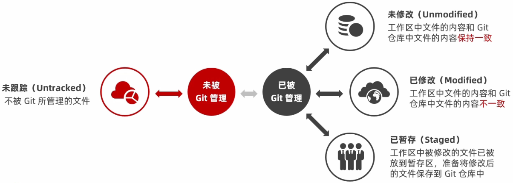
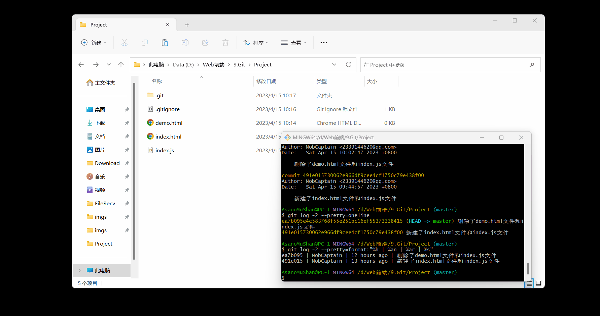
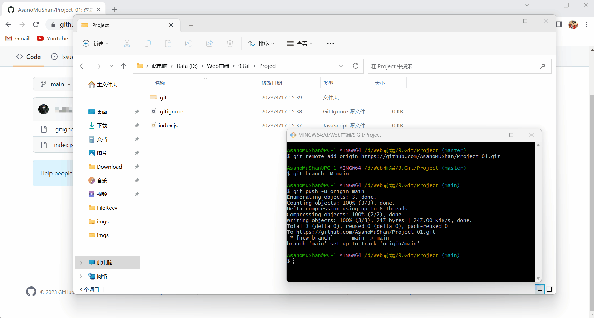
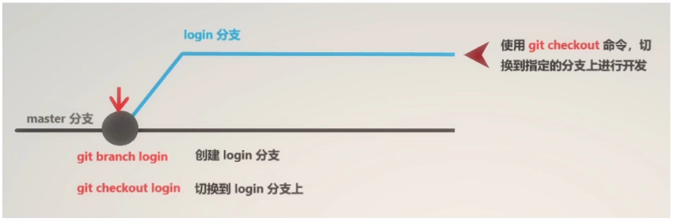

# 1.关于版本控制

## 1.1文件的版本

- 当我们在开发一个项目时，会经历不同的版本，如下图所示：

  

- 当我们在开发一个项目时，我们的文件版本如上图所示时，那么就会有以下缺点：
  - 操作麻烦：每次都需要复制、粘贴、重命名。
  - 命名不规范：无法通过文件名知道具体做了那些修改。
  - 容易丢失：如果硬盘故障或不小心删除，文件很容易丢失。
  - 协作困难：需要手动合并每个人对项目文件的修改，合并时极易出错。

## 1.2版本控制软件

- 版本控制软件是一个用来记录文件变化，以便将来查阅特定版本修订情况的系统，因此有时也叫做版本控制系统，简单来说就是把手工管理文件版本的方式，改为由软件管理文件的版本，这个负责管理文件版本的软件就叫做版本控制软件。

- 使用版本控制软件的优点有：
  - 操作简单：只需记住几组简单的终端命令，即可快速上手常见的版本控制软件。
  - 易于对比：基于版本控制软件提供的功能，能够方便地比较文件的变化细节，从而查找出导致问题的原因。
  - 易于回溯：可以将选定的文件回溯到之前的状态，甚至将整个项目都回退到过去某个时间点的状态。
  - 不易丢失：在版本控制软件中，被用户误删除的文件，可以轻松的恢复回来。
  - 协作方便：基于版本控制软件提供的分支功能，可以轻松实现多人协作开发时的代码合并操作。

## 1.3版本控制系统的分类

- 版本控制系统分为以下几种：

  - 本地版本控制系统：

    - 本地版本控制系统是单机运行的，它使得维护文件版本的操作工具化，如下图所示：

      

    - 本地版本控制系统的特点：使用软件记录了文件的不同版本，提高了工作效率，降低了手动维护版本的出错率。

    - 本地版本控制系统的缺点：本地版本控制系统是单击运行的，不支持多人协作开发，并且版本数据库故障后，所有历史更新记录都会丢失。

  - 集中化版本控制系统：

    - 集中化版本控制系统是联网运行的，它支持多人协作开发，但是它性能差，用户体验不好，如下图所示：

      

    - 集中化版本控制系统的典型代表软件是SVN。
    - 集中化版本控制系统的特点：集中化版本控制系统是基于服务器、客户端的运行模式，服务器保存文件的所有更新记录，客户端只保留最新的文件版本。
    - 集中化版本控制系统的优缺点：
      - 优点：它能联网运行，支持多人协作开发。
      - 缺点：
        - 不支持离线提交版本更新。
        - 中心服务器崩溃后，所有人无法正常工作。

  - 分布式版本控制系统：

    - 分布式版本控制系统是联网运行的，它支持多人协作开发，并且性能优秀，用户体验好，如下图所示：

      

    - 分布式版本控制系统的典型代表软件是Git。

    - 分布式版本控制系统的特点：分布式版本控制系统是基于服务器、客户端的运行模式，服务器保存文件的所有更新版本，客户端是服务器的完整备份，并不是只保留文件的最新版本。

    - 分布式控制系统的优点：它能联网运行，支持多人协作开发，并且客户端断网后，任然支持离线本地提交版本更新，并且服务器故障或损坏后，还可以使用任何一个客户端的备份进行恢复。

# 2.Git

## 2.1什么是Git

- Git是一个开源的分布式版本控制系统，是目前世界上最先进、最流行的版本控制系统，它可以快速高效地处理从很小到非常大的项目版本管理。
- Git的特点：项目越大越复杂，协同开发者越多，越能体现出Git的高性能和高可用性。

## 2.2Git的特性

- Git之所以快速和高效，主要是依赖于下面的两个特性：
  1. Git是直接记录快照，而非差异比较。
  2. Git近乎所有的操作都是本地执行的。

### 2.2.1SVN的差异比较

- 传统的版本控制系统，如：SVN就是基于差异的版本控制，它存储的是一组基本文件和每个文件随着时间逐步累积的差异，如下图所示：

  

  > 注：上图中的版本1中有 `File A`、`File B`、`File C` 这三个初始文件，当我们从版本1更新成版本2时，在版本2中我们只对 `File A` 和 `File C` 这两个初始文件进行了修改，但是我们并没有在版本2中对这两个文件进行记录，而是把这两个文件变化的内容进行了记录，这种记录文件变化的内容就是基于差异的版本控制，这样做的好处就是节省了磁盘空间，但是在每次切换版本的时候，都需要在初始文件的基础上，应用每个差异，从而生成目标版本对应的文件，这就导致了耗时、效率低，如：当我们要从版本1切换到版本5时，版本1中的 `File A` 文件就要应用版本2的差异和版本4的差异后，才能得到版本5中的 `File A` 文件，版本1中的其它文件也是同理。

### 2.2.2Git的记录快照

- Git快照是在原有文件版本的基础上重新生成了一份新的文件，类似于备份，Git为了效率，会在文件没有修改的情况下，Git就不再重新存储该文件，而是只保留一个链接，该链接指向之前存储的文件，如下图所示：

  

  > 注：上图中的版本1中有 `File A`、`File B`、`File C` 这三个初始文件，当我们从版本1更新成版本2时，会将版本1中的文件复制一份到版本2中，然后我们再对版本2中的 `File A` 和 `File C` 文件进行修改，又因为我们没有对版本2中的 `File B` 文件进行修改，所以版本2中不会存储 `File B` 文件，而是存储着一个链接，该链接指向版本1的 `File B` 文件，这就是Git快照，Git快照的优点就是版本切换时会非常快，因为每个版本都是完整的文件快照，所以切换版本时，只需要直接恢复目标版本的快照即可，但是因为每个版本都是完整的文件快照，这就会导致会占用较大的磁盘空间，所以Git的特点就是空间换时间。

### 2.2.3Git近乎所有的操作都是本地执行的

- 在Git中的绝大多数操作都只需要访问本地文件和资源即可，一般不需要来自网络上其它计算机的信息，如下图所示：

  

  > 注：上图中的服务器和电脑A和电脑B中都存储着项目的所有版本，它们的区别在于电脑A和电脑B会进行项目的开发，而服务器只是负责项目的备份，所以电脑A和电脑B在断网后依旧可以在本地对项目进行版本管理，只需在联网后，把本地修改的记录同步到服务器即可，如：我们可以在断网的情况下，在电脑A中开发项目的版本4，在开发完毕后，我们只需在联网后把电脑A中开发的项目的版本4同步到服务器即可。

## 2.3Git中的三个区域

- 使用Git管理的项目，拥有三个区域，分别是：
  - 工作区：处理工作的区域。
  - 暂存区：已完成的工作的临时存放区域，等待被提交。
  - Git仓库：最终存放的区域。

## 2.4Git中的三种状态

- Git中的三种状态分别是：
  - 已修改（modified）：表示修改了文件，但还没将修改的文件存放到暂存区。
  - 已暂存（staged）：表示对已修改的文件的当前版本做了标记，使之包含在下次提交的列表中，也就是将已修改的文件存放到了暂存区中。
  - 已提交（committed）：表示已修改的文件已经安全地保存在本地的Git仓库中了。
- 注意点：
  - 工作区的文件被修改了，但还没有放到暂存区中，就是已修改的状态。
  - 如果文件已修改并放入暂存区中，就属于已暂存状态。
  - 如果Git仓库中保存着特定版本的文件，就属于已提交状态，也就是Git仓库中保存着已修改的文件，那么就属于已提交状态。

## 2.5Git的基本工作流程

- Git的基本工作流程如下：

  1. 在工作区中修改文件。
  2. 将你想要下次提交的更改进行暂存，也就是将已修改的文件提交到暂存区中。
  3. 提交更新，找到暂存区的文件，将快照永久性的存储到Git仓库中，也就是将暂存区中的已修改的文件提交到Git仓库中。

- Git的基本工作流程，如下图所示：

  

## 2.6Git基础

### 2.6.1下载Git

- 下载Git，如下图所示：

  

  > 注：Git官网为：https://git-scm.com/。

### 2.6.2安装Git

- 安装Git，如下图所示：

  

### 2.6.3配置用户信息

- 在安装完Git之后，要做的第一件事就是设置自己的用户名和邮箱地址，因为通过Git对项目进行版本管理的时候，Git需要使用这些基本信息，来记录是谁对项目进行了操作。

- 使用Git设置自己的用户名和邮箱地址的命令：

  ```
  // 设置自己的用户名
  git config --global user.name "用户名"
  // 设置自己的邮箱地址
  git config --global user.email "邮箱地址"
  ```

- 注意点：当Git命令中使用了 `--global` 选项，那么该命令只需运行一次，即可永久生效。

- 使用Git设置自己的用户名和邮箱地址，如下图所示：

  

### 2.6.4Git的全局配置文件

- 通过 `git config --global user.name "用户名"` 和 `git config --global user.email "邮箱地址"` 命令来配置的用户名和邮箱地址，会被写入到 `C:\用户\用户名文件夹\.gitconfilg` 文件中，这个文件是Git的全局配置文件，配置一次即可永久生效，我们可以使用记事本来打开此文件，从而查看自己曾经对Git做了那些全局性的配置，如下图所示：

  

### 2.6.5查看Git的全局配置信息

- 我们除了可以通过查看Git的全局配置文件来查看Git的全局配置信息之外，我们还可以使用下列命令来快速的查看Git的全局配置信息。

  ```
  // 查看Git的所有的全局配置信息
  git config --list --global
  // 查看Git的指定的全局配置信息
  git config user.name
  git config user.email
  ```

- 查看Git的所有的全局配置信息和查看Git的指定的全局配置信息，如下图所示：

  

### 2.6.6获取帮助信息

- 我们可以使用 `git help 要查看那个命令的帮助手册` 命令，来在浏览器中打开该命令的帮助手册，如下图所示：

  

  > 注：上图中的 `git help config` 命令就是在浏览器中打开了 `config` 命令的帮助手册。

- 注意点：如果不想查看完整的帮助手册，那么我们可以在 `git help 要查看那个命令的帮助手册` 命令后面添加上 `-h` 选项来获得更简明的帮助手册，如：`git help config -h`，如下图所示：

  

## 2.7Git的基本操作

### 2.7.1获取Git仓库

- 获取Git仓库有以下两种方法：

  1. 将尚未进行版本控制的本地目录转换为Git仓库：

     - 如果自己有一个尚未进行版本控制的项目目录，如果想要用Git来控制它，只需执行下面的两个步骤即可：

       1. 在项目目录中，通过鼠标右键打开 `Git Bash Here`。
       2. 在终端中执行 `git init` 命令将当前的目录转化为Git仓库。

     - 将尚未进行版本控制的本地目录转换为Git仓库，如下图所示：

       

       > 注：上图中，执行完 `git init` 命令时，会创建一个名为 `.git` 的隐藏目录，这个 `.git` 目录就是当前项目的Git仓库，里面包含了初始的必要文件，这些文件就是Git仓库的必要组成部分，但是要注意该Git仓库是一个空仓库，因为我们还没有往该Git仓库中提交文件。

  2. 从其他服务器中克隆一个已存在的Git仓库：

     - 当我们想从其他服务器中克隆一个已存在的Git仓库时，只需执行下面的三个步骤即可：

       1. 复制其他服务器中已存在的Git仓库的地址。
       2. 在指定目录中，通过鼠标右键打开 `Git Bash Here`。
       3. 在终端中执行 `git clone 其他服务器中已存在的Git仓库的地址` 命令将其他服务器中已存在的Git仓库克隆到指定目录中。

     - 从其他服务器中克隆一个已存在的Git仓库，如下图所示：

       

### 2.7.2工作区中文件的4种状态

- 当我们将尚未进行版本控制的本地目录转换为Git仓库时，该本地目录就成为了工作区，该本地目录中的文件就是工作区中的文件，此时工作区中的每一个文件都可能有四种状态，这四种状态共分为两大类，如下图所示：

  

  > 注：Git操作的终极结果就是让工作区的文件都处于未修改的状态。

### 2.7.3查看工作区中的文件处于什么状态

- 我们可以使用 `git status` 命令来查看工作区中的文件处于什么状态，如下图所示：

  

  > 注：上图中，执行完 `git status` 命令时，会输出状态报告，在状态报告中我们可以看到 `demo.html` 文件出现在Untracked files（未跟踪的文件）下面，这就意味着 `demo.html` 文件处于未跟踪状态，未跟踪的文件就意味着Git在之前的快照（提交）中没有这些文件，所以Git不会自动将这些文件纳入跟踪范围，除非明确的告诉它我需要使用Git跟踪管理这些文件。

- 注意点：使用 `git status` 命令输出的状态报告很详细，但是有些繁琐，如果希望以精简的方式显示工作区中的文件的状态，那么我们可以在 `git status` 命令后面添加上 `-s` 选项或 `--short` 选项来以精简的方式来显示工作区中的文件的状态，如下图所示：

  > 注：`-s` 选项和 `--short` 选项是等价的，`-s` 选项就是 `--short` 选项的缩写形式。

  

  > 注：上图中，执行完 `git status -s` 命令时，会以精简的方式来显示工作区中的文件的状态，其中我们可以看到 `demo.html` 文件的前面有两个红色的问号，这就意味着 `demo.html` 文件处于未跟踪状态。

### 2.7.4跟踪工作区中的未跟踪的文件

- 我们可以使用 `git add 未跟踪的文件的文件名` 命令来跟踪工作区中的未跟踪的文件，如下图所示：

  

- 注意点：

  - 使用 `git add 未跟踪的文件的文件名` 命令来跟踪工作区中的未跟踪的文件后，我们在使用 `git status` 命令来查看工作区中的文件的状态时，在状态报告中我们可以看到 `demo.html` 文件出现在Changes to be committed（要提交的更改）下面，并且文件的前面显示有绿色的new file，这就意味着 `demo.html` 文件已经被跟踪，并且该文件处于已暂存状态，如下图所示：

    

  - 使用 `git add 未跟踪的文件的文件名` 命令来跟踪工作区中的未跟踪的文件后，我们在使用 `git status -s` 命令来以精简的方式来显示工作区中的文件的状态时，其中我们可以看到 `demo.html` 文件的前面有一个绿色的大写的 `A`，这就意味着 `demo.html` 文件已经被跟踪，并且该文件处于已暂存状态，如下图所示：

    

### 2.7.5将工作区中的已跟踪的文件提交到Git仓库中

- 我们可以使用 `git commit -m "提交信息"` 命令将工作区中的已跟踪的文件提交到Git仓库中，如下图所示：

  

- 注意点：

  - 使用 `git commit -m "提交信息"` 命令将工作区中的已跟踪的文件提交到Git仓库中后，我们在使用 `git status` 命令来查看工作区中的文件的状态时，会输出On branch master nothing to commit, working tree clean提示信息，这就意味着工作区中的所有文件都处于未修改的状态，没有任何文件需要被提交，这也就意味着已经将工作区中的已跟踪的文件提交到了Git仓库中，如下图所示：

    

  - `git commit -m "提交信息"` 命令中的 `-m "提交信息"` 可写可不写，如果不写也可以将工作区中的已跟踪的文件提交到Git仓库中，只是本次提交会没有提交信息。

  - 从跟踪工作区中的未跟踪的文件到将工作区中的已跟踪的文件提交到Git仓库中的Git的执行过程，如下图所示：

    

### 2.7.6修改工作区中的文件

- 当我们将工作区中的已跟踪的文件提交到Git仓库中时，此时工作区中的文件就和Git仓库中的文件一样了，此时如果我们修改了工作区中的文件中的内容后，我们在使用 `git status` 命令来查看工作区中的文件的状态时，在状态报告中我们可以看到 `demo.html` 文件出现在Changes not staged for commit（已跟踪的文件的内容发生了变化，但还没放到暂存区中）下面，并且文件的前面显示有红色的modified，这就意味着 `demo.html` 文件中的内容发生了变化，并且该文件处于已修改状态，如下图所示：

  

- 当我们将工作区中的已跟踪的文件提交到Git仓库中时，此时工作区中的文件就和Git仓库中的文件一样了，此时如果我们修改了工作区中的文件中的内容后，我们在使用 `git status -s` 命令来以精简的方式来显示工作区中的文件的状态时，其中我们可以看到 `demo.html` 文件的前面有一个红色的大写的 `M`，这就意味着 `demo.html` 文件中的内容发生了变化，并且该文件处于已修改状态，如下图所示：

  

### 2.7.7将工作区中的已修改的文件提交到暂存区中

- 我们可以使用 `git add 已修改的文件的文件名` 命令将工作区中的已修改的文件提交到暂存区中，如下图所示：

  

- 注意点：

  - `git add 已修改的文件的文件名` 命令是个多功能的命令，它主要有以下3个功能：

    - 可以用它来跟踪工作区中的未跟踪的文件。
    - 可以用它来把已修改的文件提交到暂存区中。
    - 可以用它来把有冲突的文件标记为已解决状态。

  - 使用 `git add 已修改的文件的文件名` 命令将工作区中的已修改的文件提交到暂存区中后，我们在使用 `git status` 命令来查看工作区中的文件的状态时，在状态报告中我们可以看到 `demo.html` 文件出现在Changes to be committed（要提交的更改）下面，并且文件的前面显示有绿色的modified，这就意味着 `demo.html` 文件已经提交到了暂存区中，并且该文件处于已暂存状态，如下图所示：

    

  - 使用 `git add 已修改的文件的文件名` 命令将工作区中已修改的文件提交到暂存区中后，我们在使用 `git status -s` 命令来以精简的方式来显示工作区中的文件的状态时，其中我们可以看到 `demo.html` 文件的前面有一个绿色的大写的 `M`，这就意味着 `demo.html` 文件已经提交到了暂存区中，并且该文件处于已暂存状态，如下图所示：

    

### 2.7.8将暂存区中的已修改的文件提交到Git仓库中

- 我们可以使用 `git commit -m "提交信息"` 命令将暂存区中的已修改的文件提交到Git仓库中，如下图所示：

  

- 注意点：

  - 使用 `git commit -m "提交信息"` 命令将暂存区中的已修改的文件提交到Git仓库中后，我们在使用 `git status` 命令来查看工作区中的文件的状态时，会输出On branch master nothing to commit, working tree clean提示信息，这就意味着工作区中的所有文件都处于未修改的状态，没有任何文件需要被提交，这也就意味着已经将暂存区中的已修改的文件提交到了Git仓库中，如下图所示：

    

  - `git commit -m "提交信息"` 命令中的 `-m "提交信息"` 可写可不写，如果不写也可以将暂存区中的已修改的文件提交到Git仓库中，只是本次提交会没有提交信息。

  - 从修改工作区中的文件到将工作区中的已修改的文件提交到暂存区中到将暂存区中的已修改的文件提交到Git仓库中的Git的执行过程，如下图所示：

    

### 2.7.9撤销对工作区中的文件的修改

- 撤销对工作区中的文件的修改指的是把对工作区中对应文件的修改，还原成Git仓库中所保存的版本，该操作的结果就是工作区中对应的文件的修改会丢失，且无法恢复，所以该操作危险性比较高，请谨慎操作，我们使用 `git checkout -- 要撤销修改的文件的文件名` 命令来撤销对工作区中的文件的修改，如下图所示：

  

- 注意点：

  - 撤销对工作区中的文件的修改的本质就是用Git仓库中保存的文件，覆盖掉工作区中对应的文件。

  - 撤销对工作区中的文件的修改的Git的执行过程，如下图所示：

    

### 2.7.10向暂存区中一次性添加多个工作区中的文件

- 如果需要向暂存区中一次性添加多个工作区中的文件，我们可以使用 `git add .` 命令来一次性将工作区中的所有新增的和修改过的文件提交到暂存区中，如下图所示：

  

### 2.7.11移除暂存区中的文件

- 如果需要从暂存区中移除对应的文件，我们可以使用 `git reset HEAD 要移除的文件的文件名` 命令，如下图所示：

  

- 注意点：我们还可以使用 `git reset HEAD .` 命令将暂存区中的文件全部移除，如下图所示：

  

### 2.7.12跳过使用暂存区直接提交工作区中的文件

- Git标准的工作流程是工作区到暂存区到Git仓库，但有时候这么做会略显繁琐，此时我们可以跳过暂存区，直接将工作区中的文件提交到Git仓库中，这时候Git工作的流程就简化为了工作区到Git仓库，Git提供了一个跳过使用暂存区的方式，只要在提交的时候给 `git commit -m "提交信息"` 命令后面加上 `-a` 选项，Git就会自动把所有已经跟踪过的文件暂存起来一并提交，从而跳过 `git add` 步骤，如下图所示：

  

### 2.7.13移除Git仓库中的文件

- 移除Git仓库中的文件的方式有两种：

  - 从Git仓库和工作区中同时移除对应的文件，就使用 `git rm -f 要移除的文件的文件名` 命令，如下图所示：

    

  - 只从Git仓库中移除对应的文件，但保留工作区中对应的文件，就使用 `git rm --cached 要移除的文件的文件名` 命令，如下图所示：

    

- 注意点：

  - 使用了移除Git仓库中的文件的两种方式后，我们在使用 `git status` 命令来查看工作区中的文件的状态时，在状态报告中我们可以看到 `demo.html` 文件和 `index.js` 文件出现在Changes to be committed（要提交的更改）下面，并且文件的前面显示有绿色的delete，这就意味着 `demo.html` 文件和 `index.js` 文件已经被移除，并且该文件处于已暂存状态，如下图所示：

    

  - 使用了移除Git仓库中的文件的两种方式后，我们在使用 `git status -s` 命令来以精简的方式来显示工作区中的文件的状态时，其中我们可以看到 `demo.html` 文件和 `index.js` 文件的前面有一个绿色的大写的 `D`，这就意味着 `demo.html` 文件已经被移除，并且该文件处于已暂存状态，如下图所示：

    

  - 使用了移除Git仓库中的文件的两种方式后，其实我们并没有完成移除操作，要真正的完成移除操作我们还需要使用 `git commit -m "提交信息"` 命令来完成移除操作，如下图所示：

    

### 2.7.14忽略文件

- 一般情况下，我们总会有些工作区中的文件无需纳入Git的管理，但是又不希望它们总出现在Untracked files（未跟踪的文件）下面，在这种情况下，我们可以创建一个名为 `.gitignore` 的配置文件，在该文件中书写要忽略的文件的文件名，这样该文件就不会纳入Git的管理，也不会出现在Untracked files（未跟踪的文件）下面，如下图所示：

  

- 注意点：

  - 在 `.gitignore` 配置文件中：

    - 以 `#` 开头的是注释。

    - 以 `/` 开头的是防止递归。

    - 以 `/` 结尾的是目录。

    - 以 `!` 开头的表示取反。

    - 我们还可以使用glob模式进行文件和文件夹的匹配。

      > 注：glob模式是指简化了的正则表达式：
      >
      > - `*` 表示匹配零个或多个任意字符。
      > - `[abc]` 表示匹配任何一个列在方括号中的字符，如：`[abc]` 表示匹配一个a或匹配一个b或匹配一个c。
      > - `?` 表示只匹配一个任意字符。
      > - 在方括号中使用短划线分隔两个字符，表示所有在这两个字符范围内的都可以匹配，如：`[0-9]` 表示匹配所有0到9的数字。
      > - `**` 表示匹配任意中间目录，如：`a/**/z` 表示匹配 `a/z`、`a/b/z` 或 `a/b/c/z` 等。

  - 演示 `.gitignore` 配置文件：

    ```
    #忽略工作区中的所有的带有.a的文件
    .a
    #跟踪工作区中的所有的lib.a文件，即使前面忽略了.a文件
    !lib.a
    #只忽略.gitignore配置文件当前目录下的TODO文件，而不忽略当前目录下的subdir文件夹中的TODO文件
    /TODO
    #忽略工作区中的任何目录下的名为build的文件夹中的文件
    build/
    #忽略工作区中的doc文件夹中的notes.text文件，但不忽略工作区中的doc文件夹中的server文件夹中的notes.text文件
    doc/*.txt
    #忽略工作区中的doc文件夹中的任何文件及该文件夹中的所有子目录下的带有.pdf的文件
    doc/**/*.pdf
    ```

### 2.7.15查看提交历史

- 我们可以使用 `git log` 命令，来查看Git的所有的提交历时，如下图所示：

  

  > 注：查看完Git的所有的提交历时，需要按下键盘Q键来退出。

- 我们还可以使用 `git log -2` 命令，来查看Git最近两次的提交历时，命令中的数字可以自定义，如下图所示：

  

- 我们还可以使用 `git log -2 --pretty=oneline` 命令，来在一行上查看Git最近两次的提交历史，命令中的数字可以自定义，如下图所示：

  

- 我们还可以使用 `git log -2 --pretty=format:"%h | %an | $ar | %s"` 命令，来在一行上查看Git最近两次的提交历史，命令中的数字可以自定义，并且还可以使用命令中的 `"%h | %an | $ar | %s"` 来自定义输出的格式，其中 `%h` 输出的是提交时，提交的简写哈希值，`%an` 输出的是提交时，提交的用户的用户名，`%ar` 输出的是提交时，提交的日期，`%s` 输出的是提交时，提交的提交信息，如下图所示：

  

### 2.7.16回退到指定的版本

- 当我们要将工作区中的文件回退到指定的版本时，我们需要经过以下步骤来回退：

  1. 使用 `git log --pretty=oneline` 命令，来在一行上查看Git的所有的提交历史，如下图所示：

     

     > 注：在一行上查看Git的所有的提交历史时，我们可以看到每一行的开头都是一串数字，该数字就是该版本的ID号，我们需要通过该ID号来将工作区中的文件回退到指定的版本。

  2. 使用 `git reset --hard 版本的ID号` 命令，将工作区中的文件回退到指定的版本，如下图所示：

     

- 注意点：当我们将工作区中的文件回退到指定的版本时，我们无法使用 `git log --pretty=oneline` 命令，来在一行上查看Git的所有的提交历史，但是我们可以使用 `git reflog --pretty=oneline` 命令，来在一行上查看Git的所有的提交历史，并且我们还可以使用 `git reset --hard 版本的ID号` 命令，将工作区中的文件回退到指定的版本，如下图所示：

  

# 3.Github

## 3.1什么是开源

- 开源的相关信息，如下图所示：

  

## 3.2什么是开源许可协议

- 开源并不意味着完全没用限制，为了限制使用者的使用范围和保护作者的权力，每个开源项目都应该遵守开源许可协议（Open Source License）。
- 常见的5种开源许可协议有：
  1. BSD（Berkeley Software Distribution）。
  2. Apache Licence 2.0。
  3. GPL（GNU General Public License）。
     - GPL是具有传染性的一种开源协议，它不允许修改后和衍生的代码做为闭源的商业软件发布和销售。
     - 使用GPL的最著名的软件项目就是Linux。
  4. LGPL（GNU Lesser General Public License）。
  5. MIT（Massachusetts Institute of Technology）。
     - MIT是目前限制最少的协议，它唯一的条件就是在修改后的代码或者发行包中，必须包含原作者的许可信息。
     - 使用MIT的软件项目有jQuery、Node.js。

## 3.3为什么要拥抱开源

- 开源的核心思想就是我为人人，人人为我，人们越来越喜欢开源，大致是出于以下3个原因：
  - 开源能给使用者更多的控制权。
  - 开源能让学习变得容易。
  - 开源才有真正的安全。
- 开源是软件开发领域的大趋势，拥抱开源就像站在了巨人的肩膀上，不用自己重复造轮子，让开发越来越容易。

## 3.4开源项目托管平台

- 专门用于免费存放开源项目源代码的网址，叫做开源项目托管平台，目前世界上比较出名的开源项目托管平台，主要有以下3个：

  - Github。

    > 注：Github是全球最牛的开源项目托管平台。

  - Gitlab。

    > 注：Gitlab对代码私有性支持较好，因此企业用户较多。

  - Gitee。

    > 注：Gitee又称码云，是国产的开源项目托管平台，它访问速度快，纯中文界面，使用友好。

- 注意点：以上3个开源项目托管平台，只能托管以Git管理的项目源代码，因此它们的名字都以Git开头。

## 3.5什么是Github

- Github是全球最大的开源项目托管平台，因为只支持Git作为唯一的版本控制工具，所以故名Github。

- 在Github中你可以干以下的操作：

  - 关注自己喜欢的开源项目，为其点赞等。

  - 为自己喜欢的开源项目做贡献。

    > 注：在开源项目的Pull Request选项卡中可以看到很多作者为该开源项目做出的贡献。

  - 和开源项目的作者讨论Bug和提需求。

    > 注：在开源项目的Issues选项卡中可以和开源项目的作者讨论Bug和提需求。

  - 把喜欢的项目复制一份作为自己的项目进行修改（Fork）。

  - 创建属于自己的开源项目。

  - ···

- 在Github中可以干的操作，如下图所示：

  

## 3.6注册Github账号

- 注册Github账号，如下图所示：

  

## 3.7远程仓库的使用

### 3.7.1新建一个空白的远程仓库

- 新建一个空白的远程仓库，如下图所示：

  

### 3.7.2远程仓库的两种访问方式

- Github上的远程仓库，有两种访问方式，分别是：

  - HTTPS访问方式：

    - HTTPS访问方式，不需要配置，但是每次访问Github上的远程仓库时，需要重复输入Github的账号和密码才能访问成功。

    - 我们可以使用HTTPS访问方式，来将本地仓库上传到Github上的远程仓库中，如下图所示：

      

      > 注：HTTPS访问方式的相关操作命令，如下图所示：
      >
      > 

    - 注意点：将本地仓库上传到Github上的远程仓库中后，如果我们想添加新文件，我们就需要先跟踪新文件，然后再把新文件提交到本地仓库中，然后再使用 `git push` 命令把新文件上传到Github上的远程仓库中，如下图所示：

      

  - SSH访问方式：

    - SSH访问方式，需要进行额外的配置，但是配置成功后，每次访问Github上的远程仓库时，就不需要重复输入Github的账号和密码了。

    - 我们可以使用SSH访问方式，来将本地仓库上传到Github上的远程仓库中，但是要使用SSH访问方式，将本地仓库上传到Github上的远程仓库中，我们还需要先使用 `ssh-keygen -t rsa -b 4096 -C "注册Github账号时填写的邮箱地址"` 命令，来生成SSH Key，如下图所示：

      > 注1：SSH Key的作用是实现本地仓库和Github之间免登录的加密数据传输。
      >
      > 注2：SSH Key的好处是免登录身份认证、数据加密传输。
      >
      > 注3：SSH Key由以下两部分组成：
      >
      > - `id_rsa`（私密文件，存放与客户端的电脑中即可）。
      > - `id_rsa.pub`（公钥文件，需要配置到Github中）。

      

    - 当我们使用了 `ssh-keygen -t rsa -b 4096 -C "注册Github账号时填写的邮箱地址"` 命令生成了SSH Key时，我们可以在 `C:\用户名\用户名文件夹\.ssh` 目录中查看生成的 `id_rsa` 和 `id_rsa.pub` 文件，如下图所示：

      

    - 当我们生成了SSH Key后，我们还需要配置Github上的SSH Key，如下图所示：

      

    - 当我们配置好了Github上的SSH Key时，我们可以使用 `ssh -T git@github.com` 命令来检测Github上的SSH Key是否配置成功，如下图所示：

      

    - 当我们配置好了Github上的SSH Key时，我们就可以使用SSH访问方式，来将本地仓库上传到Github上的远程仓库中，如下图所示：

      

      > 注：SSH访问方式的相关操作命令，如下图所示：
      >
      > 

    - 注意点：将本地仓库上传到Github上的远程仓库中后，如果我们想添加新文件，我们就需要先跟踪新文件，然后再把新文件提交到本地仓库中，然后再使用 `git push` 命令把新文件上传到Github上的远程仓库中，如下图所示：

      

# 4.Git分支

## 4.1本地分支操作

### 4.1.1分支的概念

- 分支就是科幻电影里面的平行宇宙，当你正在电脑前努力学习Git的时候，另一个你正在另一个平行宇宙里努力学习SVN，如果两个平行宇宙互不干扰，那对现在的你也没啥影响，不过在某个时间点，两个平行宇宙合并了，结果就是你即学会了Git又学会了SVN。

### 4.1.2分支在实际开发中的作用

- 在进行多人协作开发的时候，为了防止互相干扰，提高协同开发的体验，建议每个开发者都基于分支进行项目功能的开发，如下图所示：

  

### 4.1.3 `master` 主分支

- 在初始化本地Git仓库的时候，Git默认已经帮我们创建了一个名字叫做 `master` 的主分支，通常我们把这个 `master` 主分支叫做主分支，在实际工作中，`master` 主分支的作用是用来保存和记录整个项目已完成的功能代码，因此不允许程序员直接在 `master` 主分支上修改代码，因为这样做的风险太高，容易导致整个项目崩溃，如下图所示：

  

### 4.1.4功能分支

- 由于程序员不能直接在 `master` 主分支上进行功能的开发，所以就有了功能分支的概念，功能分支指的是专门用来开发新功能的分支，它是临时从 `master` 主分支上分叉出来的，当新功能开发且测试完毕后，最终需要合并到 `master` 主分支上，如下图所示：

  

### 4.1.5查看分支列表

- 我们可以使用 `git branch` 命令来查看本地Git仓库中的所有分支列表，如下图所示：

  

  > 注1：分支名称前面的 `*` 号标识就表示当前所处的分支。
  >
  > 注2：旧版本的Git的主分支名称是 `master`，新版本的Git的主分支名称是 `main`。

### 4.1.6创建新分支

- 我们可以使用 `git branch 分支名称` 命令，来基于当前分支，创建一个新的分支，此时新分支中的代码和当前分支的代码完全一样，如下图所示：

  

  

- 注意点：执行完创建新分支的命令后，用户当前所处的分支还是 `master` 主分支，如下图所示：

  

### 4.1.7切换分支

- 我们可以使用 `git checkout 要切换到的分支的名称` 命令，就可以切换到指定的分支上进行开发了，如下图所示：

  

  

### 4.1.8分支的快速创建和切换

- 我们可以使用 `git checkout -b 要创建并切换到的分支的名称` 命令，来创建指定名称的新分支，并立即切换到该新分支上，如下图所示：

  

  

- 注意点：`git checkout -b 要创建并切换到的分支的名称` 命令，相当于是 `git branch 分支名称` 命令和 `git checkout 要切换到的分支的名称` 命令的简写。

### 4.1.9合并分支

- 功能分支的代码开发测试完毕后，我们可以使用 `git merge 要合并的分支的名称` 命令，将完成后的代码合并到 `master` 主分支上，如下图所示：

  

- 合并分支的步骤：

  1. 功能分支的代码开发测试完毕后，将其文件上传到Git仓库中。
  2. 使用 `git checkout master` 命令，切换到 `master` 主分支上。
  3. 使用 `git merge 要合并的分支的名称` 命令，将分支合并到 `master` 主分支上。

- 合并分支的步骤，如下图所示：

  

- 注意点：假设要把C分支的代码合并到A分支上，则必须先使用 `git checkout A分支的名称` 命令，却换到A分支上，然后再使用 `git merge C分支的名称` 命令将C分支合并到A分支上。

### 4.1.10删除分支

- 当把功能分支的代码合并到 `master` 主分支上后，我们就可以使用 `git branch -d 要删除的分支的名称` 命令，来删除对应的功能分支，如下图所示：

  

  

- 注意点：删除分支时，要确保不在要删除的分支上，否则会删除失败。

### 4.1.11遇到冲突时的分支合并

- 如果在两个不同的分支中，对同一个文件进行了不同的修改，那么Git就没法干净的合并它们，此时我们就需要打开这些包含冲突的文件，然后手动解决冲突，然后在将解决好的文件，上传到Git仓库中，如下图所示：

  

### 4.1.12强制删除分支

- 当我们修改了分支中的文件，又没有合并该分支时，我们使用 `git branch -d 要删除的分支的名称` 命令是删除不了该分支的，要删除该分支要使用 `git branch -D 要删除的分支的名称` 命令，如下图所示：

  

## 4.2远程分支操作

### 4.2.1将本地分支发送到远程仓库中

- 如果是第一次将本地分支发送到远程仓库中，那么我们要使用 `git push -u 远程仓库的别名 本地分支的名称:该本地分支在远程仓库中的名称` 命令，如果希望远程分支的名称和本地分支的名称保持一致，那么就可以使用 `git push -u 远程仓库的别名 本地分支的名称` 命令，如下图所示：

  

  > 注：远程仓库的别名默认为 `origin`。

- 注意点：

  - 第一次推送分支需要带 `-u` 参数，此后可以直接使用 `git push` 推送代码到远程分支。

  - 我们可以在远程仓库中查看分支，如下图所示：

    

### 4.2.2查看远程仓库中的所有的分支列表

- 我们可以通过使用 `git remote show 远程仓库的别名` 命令，来查看远程仓库中的所有的分支列表的信息，如下图所示：

  

### 4.2.3跟踪远程仓库中的分支

- 跟踪远程仓库中的分支指的是从远程仓库中，把远程分支下载到本地仓库中，如果要从远程仓库中，把对应的远程分支下载到本地仓库中，并且保持本地分支和远程分支名称相同，那么就需要使用 `git checkout 远程分支的名称` 命令，如果要从远程仓库中，把对应的远程分支下载到本地仓库中，并且要把下载的远程分支进行重命名，那么就需要使用 `git checkout -b 该远程分支在本地仓库中的名称 远程仓库的别名/远程分支的名称` 命令，如下图所示：

  

### 4.2.4拉取远程分支的最新的代码

- 我们可以使用 `git pull` 命令，来将远程分支最新的代码下载到本地对应的分支中，如下图所示：

  

### 4.2.5删除远程分支

- 我们可以使用 `git push 远程仓库的别称 --delete 远程分支的名称` 命令，来删除远程分支，如下图所示：

  
